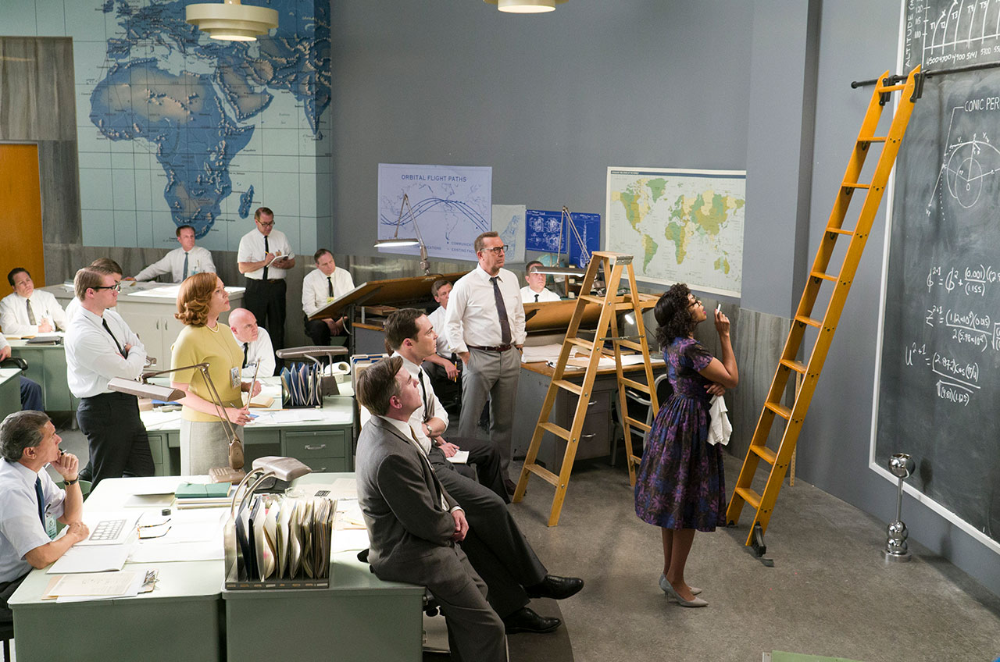

Het programma van de volgende, **de 28ste editie**, verschrijnt hier begin januari 2019. Dit is het programma van **de 27ste editie** die plaats vond op **krokusmaandag 12 februari 2018**. 
Het thema was **Verlos ons van het kwade!**. Het thema kreeg inhoud via de volgende drie films. Het was het eerste luik van een triptiek over _Het Onze Vader_. De volgende editie met het tweede luik van de thematische triptiek vindt plaats op krokusmaandag **4 maart 2019**.

**Resurrection** (2017) is _het langspeelfilmdebuut_ van de jonge Oostendse regisseur van Kristof Hoornaert. Het thema van De Dag ‘_Verlos ons van het kwade_’ is ontleend aan zijn film. Dat komt niet alleen omdat de woorden uit het _Onze Vader_ letterlijk voorkomen in de film, maar ook en nog meer omdat de film het thema is in de volle zin van het woord. In deze zowel contemplatieve als poëtische film klinkt de stilte van de beschouwing indringender dan de schaarse woorden. De regisseur brengt twee personages van verschillende leeftijden samen in aan afgelegen boerderij. Ze zijn met elkaar verbonden door de impact van het kwade, ook al bevinden ze zich niet allebei aan dezelfde zijde van dat kwaad. Het personage van de oude man handelt als een Barmhartige Samaritaan, terwijl dat van de jonge man worstelt met de gevoelens van een Kaïn. Maak [hier](http://www.menstis.be/film-focus/resurrection/) kennis met een uitgebreide studie van de film.

**Hacksaw Ridge** (2016) van Mel Gibson is _een echte Hollywoodfilm met een sterke narratieve levenslijn_. Die is namelijk geënt op de biografie van de Amerikaanse, jonge man _Desmond T. Doss_. De film maakt deel uit van het eigen oeuvre van regisseur Mel Gibson. Dat staat in het teken van het omgaan met het kwaad in de vorm van brutaal oorlogsgeweld dat, vreemd genoeg, dikwijls is verweven met religies. Ook vandaag. Desmond T. Doss groeide op in een gezin waarvan zijn moeder een trouw lid was van een kerkgemeenschap die behoorde tot _het Kerkgenootschap der Zevende-dags Adventisten_. In deze protestantse gemeenschap speelde _de Bijbel_ een hoofdrol. De vader van Desmond was een oorlogsveteraan van de Eerste Wereldoorlog. Hij leed heel sterk onder het trauma dat hij tijdens de confrontatie met dat kwaad had opgelopen. Hij zocht geregeld troost in de alcohol en werd agressief. Opgegroeid tussen die twee uitersten nam de jonge Desmond in de jaren veertig van vorige eeuw het besluit om vrijwillig het Amerikaanse leger in te gaan. Hij wilde net als zijn dorpsgenoten een bijdrage leveren in de strijd van de geallieerden tegen het Duitsland van Hitler en het Japan van keizer Hirohito. Maar hoe kan iemand zich als soldaat inschrijven in het leger en tegelijkertijd, met de Bijbel in de hand, weigeren een geweer vast te houden? Mel Gibson vond het existentieel antwoord van Desmond T. Doss fascinerend genoeg om er een Oscarfilm van te maken.

**Hidden Figures** (2016) van Theodor Melfi is eveneens _een Hollywoodfilm met een historisch narratief_. De film haalt de vergeten geschiedenis van een belangrijk hoogtepunt in _de naoorlogse Space Race tussen de USSR en de USA_ werd gehouden. De Amerikaanse astronaut John Glen vloog als eerste mens in februari 1962 drie keren rond de aarde en kon daarna terug veilig landen. Dat was mogelijk dankzij het verborgen werk van drie Afro-Amerikaanse vrouwen, werkzaam voor het Langley Research Center in Hampton, Virginia. Daar werden de berekeningen uitgevoerd in opdracht van de NASA. _De zwarte vrouwen en collega’s Katherine Globe, Mary Jackson en Dorothy Vaughan_ werden er geconfronteerd met het kwaad in de samenleving. De rassendiscriminatie en segregatie waren uitgegroeid tot een maatschappelijk kankergezwel. In de tegenstroom van _de christelijk geïnspireerde Civil Rights Movement_, overstegen ze dat diep gewortelde kwaad met hun talenten en schreven hierdoor mee aan een belangrijk hoofdstuk van de menselijke ruimtevaart. In 2016 schreef Margot Lee Shetterly het non-fiction boek _Hidden Figures: The American Dream and the Untold Story of the Black Women Who Helped Win the Space Race_. De film is een bewerking van dit historisch boek. President Obama huldigde in 2015 Katherine Globe in het Witte House met de Presidential Medal of Freedom

Het verloop van **De Dag** ziet er als volgt uit.

<table cellpadding="3" cellspacing="2">
               <tr>
                 <td valign="top">09.00 &ndash; 10.00</td>
                 <td><strong id="onthaal">Onthaal</strong></td>
               </tr>
               <tr>
                 <td valign="top">10.00 &ndash; 10.05 </td>
                 <td><strong id="welkom">Welkom</strong> 
                   Felix Rijcken</td>
               </tr>
                 <td valign="top">10.05 &ndash; 10.20 </td>
                 <td><strong id="ovrhetthema">Thema en films</strong> 
                   Sylvain De Bleeckere</td>
               </tr>
                 <td valign="top">10.20 &ndash; 10.35 </td>
                 <td><strong id="In dialoog met Kristof Hoornaert">In dialoog met Kristof Hoornaert</strong>                  </td> 
               <tr>
                 <td valign="top">10.35 &ndash; 12.25</td>
                 <td><strong class="style1" id="legaminauv&eacute;lo">Resurrection</strong> (2017)  
                   <strong>Kristof Hoornaert</strong> 
                   Wereldpremière Gents Filmfestival</td>
               </tr>
               <tr>
                 <td>12.25  &ndash; 13.30</td>
                 <td id="middagpauze2"><strong>Middagpauze</strong></td>
               </tr>
                 <td valign="top">13.30 &ndash; 13.45 </td>
                 <td><strong>Inleiding </strong> 
                 Sylvain De Bleeckere</td>
               <tr>
                 <td valign="top">13.45  &ndash; 16.05</td>
                 <td><strong class="style1">Hacksaw Ridge </strong>(2016)  
                   <strong id="tonykaye">Mel Gibson</strong> 
                 2 Oscars, 6 Oscarnominaties</td>
               </tr>
               <tr>
                 <td valign="top">16.05 &ndash; 16.20</td>
                 <td><strong id="pauze">Pauze</strong></td>
               </tr>
                 <td valign="top">16.20&ndash; 16.30 </td>
                 <td><strong id="inleiding">Inleiding </strong> 
                   Sylvain De Bleeckere</td>
               <tr>
                 <td valign="top">16.30 &ndash; 18.40</td>
                 <td><strong class="style1" id="hiddenfigures">Hidden Figures </strong>(2016)  
                   <strong>Theodore Melfi</strong>  
                   3 Oscarnominaties, Screen Actors Guild Award for Cast </td>
               </tr>
            </td>
    </table>