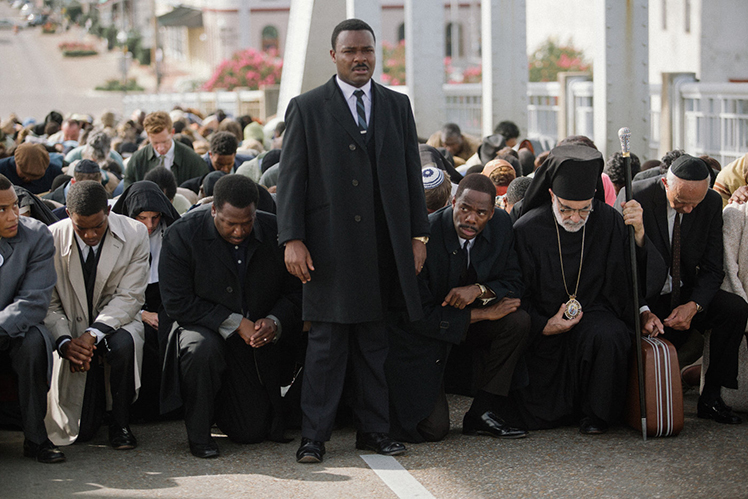

Het progamma van de **28ste editie** van De Dag staat in het teken van het tweede deel van de thematische triptiek over **Het Onzevader**. Dat tweede deel staat in het teken van **Uw Rijk Kome**.

**The Birth of a Nation** (2016) Het betreft de debuutfilm van de Afro-Amerikaanse regisseur en acteur _Nate Parke_r. De titel van de film is eigenlijk een citaat. Die verwijst namelijk direct naar de andere, gelijknamige film _The Birth of a Nation_ van de pionier van de Amerikaanse Hollywoodfilm, _David W. Griffith_. Die bijzonder succesrijke film van 1905 promootte de heropleving van de _Ku Klux Klan_, de racistische beweging die nog steeds actief is. Parker rekent meer dan een eeuw later af met die racistische prent die in de officiële filmgeschiedenis als een meesterwerk wordt gezien. Parker realiseert zijn impliciete ontmaskering van Griffiths film door, op basis van zeer gedegen historisch onderzoek, het filmportret van _Nat Turner_ (1800-1831) op het witte doek te schilderen. De slaaf Nat was in de nog jonge Verenigde Staten van Amerika _de eerste selfmade zwarte predike_. Zijn uniek verhaal toont hoe hij uit dezelfde Bijbel die de blanke slavenhouders gebruiken om hun gelijk te bewijzen, de kracht put om het vuur aan de lont van de weerstand aan te steken. Hij ontdekte de visionaire kracht van _Uw Rijk Kome_. 

**Lincoln** (2012) 

Nate Parker legt een directe link tussen de opstand van Nat Turner en de _Civil War_ die president Lincoln leidde van 1861 tot 1865. Het vuur van het _Uw Rijk Kome_ dat Nat Turner had aangestoken, brandde nu over het hele land. De wettelijke afschaffing van de slavernij als economisch systeem, actief in het Zuiden, leidde tot het bloedigste conflict dat zich op Amerikaanse bodem ooit heeft afgespeeld. De natrillingen van die schokgolf zijn nog steeds voelbaar in het land. _Steven Spielberg_, de Amerikaanse grootmeester van historische films, overtreft zichzelf met zijn Oscarfilm _Lincoln_. Hij kon ook rekenen op _Daniel Day-Lewis_ en diens onovertroffen, veel bekroonde vertolking. Omringd door de beste Amerikaanse historici van de zestiende Amerikaanse president  focust Spielberg op het einde van de _Civil War_. Met het einde van de burgeroorlog in zicht, wilde Lincoln in 1865 de _Thirteen Amendment_ over de definitieve en onomkeerbare afschaffing van de slavernij laten goedkeuren door de Senaat en het House. Hij wilde voorkomen dat na de _Civil War_ de bevrijde slaven opnieuw zouden tot slaaf worden gemaakt door de overwonnen Zuiderse staten. De democratisch gekozen senaat en parlement werden voor het eerst het strijdtoneel met het _Uw Rijk Kome_ als inzet.

**Selma** (2014) ‘Mijn naam is Yolanda Renee King, de kleindochter van Martin Luther King. Mijn grootvader had een droom.’ Zo sprak de 9-jarige kleindochter van Martin Luther King op de March for our lives. Vorig jaar, op 24 maart 2018, verzamelde zich circa achthonderdduizend tieners in Washington DC om strenge wapenwetten te eisen. De film Selma is de eerste, historische film met Martin Luther King als hoofdpersonage. De vrouwelijke Afro-Amerikaanse regisseur Ava DuVernay focust op de historische en geweldloze strijd van de Zwarte Burgerrechtenbeweging in Selma, Alabama, met dominee dr. Martin Luther King als geestelijke leider. De gebeurtenissen vonden plaats in maart 1965, honderd jaar na het einde van de Civil War. De directe aanleiding was de bomaanslag door de KKK tegen de Birmingham, Alabama 16th Street Baptist Church waarbij vier zwarte meisjes omkwamen. De inzet van de mars was het recht van de zwarten om zich te kunnen registreren en zo te kunnen deelnemen aan de democratische verkiezingen, iets wat de blanke racistische leiders in het Zuiden tot elke prijs wilden voorkomen. Na de derde poging lukte de mars. De televisiebeelden van het geweld van de politie tegen de ongewapende deelnemers aan de mars kwamen in alle huiskamers van de US terecht, ook in die van het Witte Huis. In die succesrijke mars weerklonk de echo van Martin Luther Kings speech I Have  Dream, het Uw Rijk Kome van de twintigste eeuw. Hij sprak die op 28 augustus 1963 uit op de trappen van het Lincoln Memorial te Washington DC tijdens de grootste mars in de Amerikaanse geschiedenis.

Het verloop van **De Dag** ziet er als volgt uit.

<table cellpadding="3" cellspacing="2">
               <tr>
                 <td valign="top">09.00 &ndash; 10.00</td>
                 <td><strong id="onthaal">Onthaal</strong></td>
               </tr>
               <tr>
                 <td valign="top">10.00 &ndash; 10.05 </td>
                 <td><strong id="welkom">Welkom</strong> 
                   Felix Rijcken</td>
               </tr>
                 <td valign="top">10.05 &ndash; 10.30 </td>
                 <td><strong id="ovrhetthema">Thema en films</strong> 
                   Sylvain De Bleeckere</td>
               </tr>
                 </td> 
               <tr>
                 <td valign="top">10.30 &ndash; 12.30</td>
                 <td><strong class="style1" id="legaminauv&eacute;lo">The Birth of a Nation</strong> (2016)  
                   <strong>Nat Turner</strong> 
                   US Grand Jury Prize Sundance</td>
               </tr>
               <tr>
                 <td>12.30  &ndash; 13.30</td>
                 <td id="middagpauze2"><strong>Middagpauze</strong></td>
               </tr>
                 <td valign="top
               <tr>
                 <td valign="top">13.45  &ndash; 16.15</td>
                 <td><strong class="style1">Lincoln </strong>(2012)  
                   <strong id="tonykaye">Steven Spielberg</strong> 
                 7 Oscars, 5   Oscarnominaties</td>
               </tr>
               <tr>
                 <td valign="top">16.15 &ndash; 16.30</td>
                 <td><strong id="pauze">Pauze</strong></td>
               </tr>
                 <td valign="top">16.20&ndash; 16.30 </td>
                 <td><strong id="inleiding">Inleiding </strong> 
                   Sylvain De Bleeckere</td>
               <tr>
                 <td valign="top">16.30 &ndash; 18.40</td>
                 <td><strong class="style1" id="hiddenfigures">Selma</strong> (2014)  
                   <strong> Ava DuVernay</strong>  
                   1 Oscar, 1 Oscarnominatie, 1 Golden Globenominatie </td>
               </tr>
            </td>
    </table>