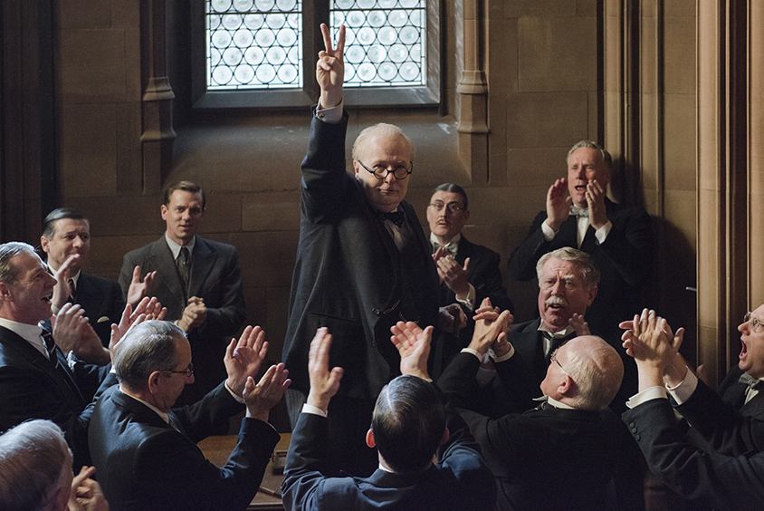
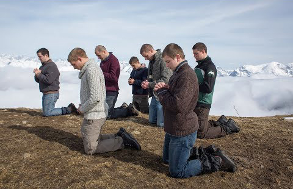

Het nieuwe progamma van de **29ste editie** van **De Dag** op krokusmaandag **24 februari 2020** staat in het teken van het derde en laatste deel van de thematische triptiek over **Het Onzevader**. Het thema is **Beproeving**.

**Darkest Hour** (2017)

 De historische, Britse Oscarfilm van Joe Wright zoomt in op een weinig gekend historisch moment in het verhaal van de Tweede Wereldoorlog. Het betreft een verhaal waarvan de uitkomst het landschap van de huidige Europese Unie blijft tekenen. Centraal staat de uitzonderlijke politieke moed van de Britse premier _Sir Winston Churchill_. Hiermee thematiseert de film het fenomeen ‘_beproeving_’. De film houdt ermee de vinger aan de pols van wat vandaag dagelijks in de nieuwsmedia zicht- en hoorbaar is omdat het zo zeldzaam is: _politieke moed tonen tegenover de zorg voor een humane, democratische machtsuitoefening_. In de recente geschiedenis van de mensheid was dat nooit zo pregnant aan de orde in de maand mei van 1940. Aan de donkere kant van het spectrum bevond zich toen Hitler en zijn oorlogsregime, met wie de leiding gevende Engelse politici een deal wilden sluiten, aan de lichtzijde ervan stond Winston Churchill helemaal alleen. Hij vond de kracht om ‘de beproeving’ te doorstaan door zowel de warme menselijke kracht van zijn huwelijk en gezin als door zijn trouw aan de christelijke inspiratie van de humane, democratische Europese waarden waarin hij rotsvast en consequent geloofde. Het beklijvende en immer actuele filmportret is sterk gebaseerd op nauwkeurig historisch onderzoek, ook van het bestaande beeldmateriaal. Direct na **De Dag** verschijnt er op deze site - **FilmFocus** - een uitgebreide filmstudie over Darkest Hour. De film ontving zes Oscarnominaties en won er drie van, waaronder die van beste film van het jaar en beste acteur in hoofdrol. 

**Cold War** (2018) 

Cold War sluit naadloos aan bij Darkest Hour. Churchill introduceerde na de Tweede Wereldoorlog het begrip ‘_Iron Curtain_’  (IJzeren Gordijn), zichtbaar teken van de Koude Oorlog. Het verdeelde Europa bestond uit twee verschillende ideologische werelden: de communistische in het Oosten en de liberale-democratische in het Westen. De film Zimna wojna (‘Cold War’) van de Pools-Amerikaanse regisseur Pawel Pawlikowski is, zoals zijn vorige film [_Ida_](http://www.menstis.be/film-focus/ida/), een echte Europese auteursfilm in zwart-wit. Via de twee personages Wiktor Warski en Zuzanne Zula Lichon schildert de regisseur _de twee tegengestelde ideologische werelden_ op het niveau van het dagelijkse leven. Daarbij verkent Pawlikowski de verschillende ‘_beproevingen_’ die elk van de regimes typeert. Met die ‘_beproevingen_’ moeten individuen omgaan, wat niet altijd lukt. De film oogt esthetisch als een cinematografisch juweel dat vooral, in goede Europese filmtraditie, is opgebouwd naar een heel bijzondere slotsequentie die zich situeert in een kleine, vervallen dorpskerk. 

**La prière** (2018)

 De Franse film van regisseur Cédric Kahn die ook samen met Fanny Burdino en Samuel Doux het scenario schreef, brengt ons naar een hedendaagse vorm van ‘_beproeving_’, die van _de verslaving_, in casu de verslaving aan harddrugs. De film volgt de tweeëntwintigjarige Thomas die een weg zoekt om van zijn zware heroïneverslaving af te raken. Die zoektocht brengt hem naar een gebedsgemeenschap in de Zwitserse bergen. Daar proberen verslaafden en ex-verslaafden via een gemeenschapsleven, gebaseerd op een uitgesproken gebedsleven, hun menselijke waardigheid en identiteit terug te vinden. De film brengt een fictief verhaal dat echter is geïnspireerd op bestaande experimenten om drugsverslaafden te helpen via _de contemplatieve methode van het bidden_. De film opent een _levensbeschouwelijke horizon_ die alle vormen van verslaving, inherent aan onze brutale consumptiesamenleving, belicht vanuit een ongewoon, religieus bewogen zorgperspectief. 

**Het verloop van De Dag ziet er als volgt uit**.

<table cellpadding="3" cellspacing="2">
               <tr>
                 <td valign="top">09.00 &ndash; 10.00</td>
                 <td><strong id="onthaal">Onthaal</strong></td>
               </tr>
               <tr>
                 <td valign="top">10.00 &ndash; 10.05 </td>
                 <td><strong id="welkom">Welkom</strong> 
                   Felix Rijcken</td>
               </tr>
                 <td valign="top">10.05 &ndash; 10.30 </td>
                 <td><strong id="ovrhetthema">Thema en films</strong> 
                   Sylvain De Bleeckere</td>
               </tr>
                 </td> 
               <tr>
                 <td valign="top">10.30 &ndash; 12.35</td>
                 <td><strong class="style1" id="legaminauv&eacute;lo">Darkest Hour</strong> (2017)  
                   <strong>Joe Wright</strong> 
                   3 Oscars, 6 Oscarnominaties</td>
               </tr>
               <tr>
                 <td>12.35  &ndash; 13.45</td>
                 <td id="middagpauze2"><strong>Middagpauze</strong></td>
               </tr>
               </td>
               </tr>
                 <td valign="top">13.45 &ndash; 14.00 </td>
                 <td><strong id="ovrhetthema">Inleiding Cold War</strong> 
                   Sylvain De Bleeckere</td>
               </tr>
                 </td> 
                 <td valign="top
               <tr>
                 <td valign="top">14.00  &ndash; 15.30</td>
                 <td><strong class="style1">Cold War</strong>(2012)  
                   <strong id="tonykaye">Pawel Pawlikowski</strong> 
                 Cannes 2018: Beste regisseur</td>
               </tr>
               <tr>
                 <td valign="top">15.30 &ndash; 15.45</td>
                 <td><strong id="pauze">Pauze</strong></td>
               </tr>
                 <td valign="top">15.45&ndash; 16.00 </td>
                 <td><strong id="inleiding">Inleiding La pière </strong> 
                   Sylvain De Bleeckere</td>
               <tr>
                 <td valign="top">16.00 &ndash; 18.00</td>
                 <td><strong class="style1" id="hiddenfigures">La prière</strong> (2018)  
                   <strong>Cédric Kahn</strong>  
                   Berlijn: Beste acteur </td>
               </tr>
            </td>
    </table>