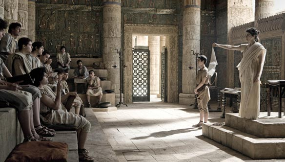

## **Klapbord**

**Agora**
is de titel van _het historische filmepos_ van de Spaans-Chileense regisseur Alejandro Amenábar. Hij filmde zich eerder in de kijker met het euthanasiedrama _Mar Adentro_, maar eveneens met _The Others_ en _Abre los ojos_. **Agora** is zijn eerste kostuumfilm. Hij reconstrueert de weinig gekende geschiedenis van _de vrouwelijke Alexandrijnse filosoof Hypatia_ (ca. 370-415). De historische film is met zijn 50 miljoen euro tot op heden de duurste Spaanse film ooit. Hij evoceert de teloorgang van _de hellenistische cultuurstad Alexandrië_ en weerkaatst de betekenis ervan naar het begin van de 21ste eeuw, onze tijd. De film ontving de 7 Goya’s (de Oscars van de Spaanse film) en 6 Goya-nominaties. Het personage _Hypatia_ wordt vertolkt door Rachel Weisz. De locatie was Malta.

## **Synopsis**

In het Romeins-Egyptische Alexandrië leeft en werkt rond 400 _Hypatia_. Zij is de enige vrouwelijke filosoof die onderwijst en onderzoek verricht in de _grote bibliotheek_, de schatkamer aan kennis van de mediterrane mensheid, een internationale school en een ontmoetingsplaats van geleerden van diverse culturele origine. _Hypatia_ brengt haar verwondering over de orde in het heelal over op haar leerlingen die ze als ‘broeders’ ziet en bij wie ze een geest van verdraagzaamheid en een kritische instelling overbrengt. Haar vader, _Theon_, leidt de bibliotheek. De stad komt onder toenemende spanning te staan door het succes van _de christenen_ die nu niet meer worden vervolgd en op _de agora_ in discussie gaan met de bestaande ‘heidense’ verering van diverse goden. 

>In de stad is de belangrijkste tempel die van _Serapis_, een versmelting van de Egyptische en Griekse religies. Het hoofdgebouw van de bibliotheek bevindt zich in de tempel van Serapis. _Patriarch Theophilus_ moedigt de christenen aan om met de heidense godenbeelden de spot te drijven. De missionair ingestelde monnik _Ammonius_, leider van de gewapende Christussoldaten, _de Parabolanen_, neemt daarbij het voortouw. De christenen krijgen zeer veel aanhang bij het gewone volk en de slaven, onder wie _Davus_, de slaaf en assistent van _Hypatia_. 

>De spanningen lopen uit de hand en ontaarden in bloedige conflicten. De Romeinse prefect heeft een te zwakke politieke en militaire macht om de situatie onder controle te houden. De christenen bestormen uit weerwraak de tempel van Serapis na een bloedige aanval op hen door de aanhangers van de tempel. De bibliotheek wordt verwoest. De christenen nemen het gebouw over en gebruiken een deel ervan als kerk.

>Wanneer de jonge en ambitieuze _Cyrillus_ de overleden Theophilus opvolgt, streeft hij naar een volledige controle over de politieke en religieuze macht. Hij schakelt de joden uit en valt nadien nog de laatste aanhangers van de ‘heidense’ goden aan. Wanneer daarbij de nieuwe prefect, _Orestes_, een oud-leerling van _Hypatia_, hem in de weg staat, speelt hij een politiek schaakspel met als inzet niemand minder dan _Hypatia_. Zij wordt als _heks_ gestenigd vὀὀr het altaar van Christus. Dat gebeurt nadat ze door haar kosmologische studies en experimenten een vermoeden kreeg van de hypothese van het _heliocentrisme_.

## **Cinematografie**

 **HISTORISCHE EVOCATIE**. Het filmproject steunt op grondig onderzoek over het historische Alexandrië rond het jaar 400 toen de waardevolle bibliotheek ten onder is gegaan. _De stad met zijn unieke bibliotheek_ vormt het hoofdpersonage in het eerste deel van de film. De decors werden zo authentiek mogelijk gebouwd. Voor het eerst krijgt de vermaarde bibliotheek een concreet, architecturaal gezicht. De verwoesting van het gebouw vormt het dramatische hoogtepunt van het eerste deel van de film. 

>De regisseur verwerkt in het scenario de overgeleverde feiten over de stad Alexandrië bij de overgang van de Romeinse naar de christelijk periode onder de leiding van patriarch _Cyrillus van Alexandrië_ die in oktober 412 de overleden Theophilus opvolgde. 

>Eén van schaarse historische bronnen over _Hypatia_ is het werk van _Synesius van Cyrene_, de Griekse bisschop van Ptolemais (Lybische Pentapolis). Hij was een leerling van _Hypatia_ in Alexandrië en er is een brief van hem aan _Hypatia_ bewaard. Aan die historische context ontleent de regisseur het personage _Synesius_ dat in het tweede deel van de film een voorname bijrol speelt. 

>Over _Hypatia_ zelf zijn slechts enkele feiten bekend. Die zijn in de film verwerkt. De regisseur heeft zelf de vele leemtes moeten inkleuren. Daarbij heeft hij rekening gehouden met de geest van de tijd. De personages van _Hypatia_’s assistenten, _Davus_ en _Aspasius_, zijn fictief. Vooral de eerste speelt een grote rol in de film en helpt de regisseur om het verhaal te vertellen over het succes van de christelijke leer onder de Romeinse slaven. Davus is immers de slaaf van _Hypatia_ en hij is in het geheim christen. 

>Via het personage van _Hypatia_ brengt de regisseur de succesrijke Helleense filosofie van _het neoplatonisme_ in beeld. Dat concretiseert zich in haar intellectuele passie voor de studie van de kosmos. Zij onderwijst het toen algemeen aanvaarde _geocentrische wereldbeeld van Ptolemaius_, een sleutelvisie van het neoplatonisme. In het eerste deel van de film komen enkele scènes voor waarin _Hypatia_ de sinds Plato als goddelijk beschouwde figuur van _de cirkel_ bestudeerd in relatie tot de komische bewegingen van de zon en de planeten. 

>In het tweede deel verdicht Amenábar de latere overgang van het _geocentrisme_ naar het _heliocentrisme_ in _Hypatia_’s intellectuele honger om de kosmos te doorgronden. Daar is historisch geen enkel bewijs voor aangezien het geschreven werk van de 'heks' _Hypatia_ volledig verloren is gegaan. De (moderne) ontdekking van de elliptische omwentelingsbaan van de planeten door Kepler in 1609, zou ook door _Hypatia_ als hypothese zijn kunnen onderwezen. Zo verwijst de film naar Aristarchus die circa 700 jaar voor Hypatia al het heliocentrisme kende. De intellectuelen uit de Griekse oudheid kenden de theorie, ook al nam niemand ze ernstig, zeker niet toen de jonge christelijke theologie het wereldbeeld van Ptolemaius adopteerde. Het neoplatonisme vond weerklank bij alle intellectuelen van die tijd, ook bij de christenen zoals Synesius. 

>Alleen radicale figuren als Cyrillus I verzetten zich krachtig tegen de mogelijke invloed van de _neoplatoonse_ filosofie op de christenen. Dat was zijn motief om in het bijzonder _Hypatia_ te viseren. Er zijn geen historische bronnen over een directe confrontatie tussen Cyrillus en _Hypatia_. Amenábar laat wel zien hoe Cyrillus zowel zijn eigen aanhang als de beleidslieden van Alexandrië onder wie de prefect Orestes, oud-leerling en vriend van _Hypatia_, manipuleert om _Hypatia_’s (neoplatoonse) invloed in de stad te neutraliseren en uit te schakelen. De gruwelijke moord op _Hypatia_ door de radicale christenen, de Parabolanen, is in de film verzacht. Uit overgeleverde bronnen blijkt dat zij de eerste vrouw is die in naam van Christus als ‘heks’ op een wrede wijze is terechtgesteld.

**WERELDBEELDPERSPECTIEF**. Een van de opvallendste visuele eigenschapen van **Agora** is het wereldbeeldperspectief. De camera bevindt zich als het ware in het heelal, is zelf een planeet die de aarde observeert en vervolgens inzoomt op de Egyptische stad Alexandrië. 

>Het openingsbeeld toont de sterrenhemel met de introductie van de planeet aarde; als een gigantisch lichtschip beweegt deze in een cirkelbaan door het heelal. Bij die beelden weerklinkt dan in voice-over de stem van _Hypatia_ over de betekenis van de cirkel voor de planeten in de kosmos. Dan verplaatst zich de camera van de hemel naar de aarde in de collegezaal waar _Hypatia_ aanschouwelijk via de astronomie  het klassieke of Oud-Griekse wereldbeeld doceert. 

>>_Maar de aarde? Wat gebeurt er hier op aarde? Hier vallen de voorwerpen wel naar beneden terwijl de sterren en de hemellichamen niet naar beneden vallen, maar in cirkels bewegen._

>Het tweede deel opent eveneens met het wereldbeeldperspectief om uiteindelijk in het slotbeweging terug te keren naar de plaats van de camera in het heelal. 

>Nog in het eerste deel met name in het tafereel dat zich in het _theater_ afspeelt, komt ook een betekenisvol hemelperspectief voor. In de pauze van het theaterstuk spreekt Orestes van op de scène zijn liefde uit voor _Hypatia_ en speelt hij voor haar op de Griekse dubbelfluit. Tijdens het muziekopvoering last Amenábar een beeld in genomen vanuit het heelal met zicht op de aarde. Hiermee verwijst Amenábar naar de componenten van het klassieke of Oud-Griekse wereldbeeld: de astronomie en de  kosmologie, de muziek(leer) en de metafysica. _Hypatia_ had immers Orestes’ verliefdheid afgewimpeld met het advies zich op de muziek toe te leggen. Sinds de leer van Pythagoras over _de muziek van de sferen_ waarmee hij bedoelde de muziek die in de kosmos ontstaat door de bewegingen van de planeten, beschouwden de neoplatonisten de studie van de muziek als een onderdeel van de studie van het _wereldbeeld_, gevoed door de toenmalige verwondering en bewondering over de perfecte schoonheid van de kosmos met zijn harmonieuze verhoudingen en bewegingen. 

>Met dat wereldbeeldperspectief onderlijnt Amenábar het blikveld van _Hypatia_. Zij kijkt consequent naar de kosmos boven de planeet aarde als een onophoudelijke bron van verwondering en kennis over de hogere werkelijkheid die in harmonie leeft met zichzelf. De beelden van de sterrenhemel vinden hun oorsprong in de schouwende blik van _Hypatia_. 

>Dat typische wereldbeeldperspectief kan ook het _goddelijk perspectief_ worden genoemd. In het licht van de neoplatoonse metafysica bevindt de werkelijkheid van God zich boven de aarde (het _meta-fysische_ of het _boven-natuurlijke_) en is de schoonheid van de kosmos het meest zichtbare beeld van God dat mensen met de ogen kunnen aanschouwen. 

>In de populaire voorstelling van dat _metafysische wereldbeeld_ woont God in de hemel en kijkt hij naar de aarde. In de optiek van het _neoplatonisme_ was de studie van de kosmos met onder andere de astronomie in feite een deel van _de natuurlijke theologie_. In de traditie van Plato en Aristoteles onderzoekt _Hypatia_ met de kracht van het menselijk denken dat hellenistische wereldbeeld met centraal de studie van de _kosmos_ is. De scènes met _Hypatia_ en haar studie van de kosmos vormen telkens een rustpunt midden de actiescènes.

**STIJL VAN JOURNALISTIEKE VERSLAGGEVING**. Voor de taferelen die zich in de stad afspelen en die tevens in het teken staan van de toenemende spanningen tussen de drie groepen, de ‘heidenen’ of de polytheïsten, de christenen en de joden, kiest Amenábar voor een _zeer levendige, journalistieke_ stijl. Hij wil met de montage van verschillende camerabewegingen van hetzelfde gebeuren de toeschouwer meenemen in een tijdscabine en als een CNN-kijker de actie zelf als een bevoorrechte getuige laten meemaken. Die werkwijze ondersteunt de inleving bij de toeschouwer.

>In diezelfde geest filmt hij belangrijke momenten vanuit de _blik van een getuige_. Een mooi voorbeeld hiervan is de aanhouding van _Hypatia_ door de troepen van Cyrillus, de Parabolanen. Dat gebeuren zelf komt niet in beeld, maar de gevolgen ervan wel; de toeschouwer kan die direct meemaken vanuit het standpunt van Davus. Dat betekent dat Amenábar in tegenstelling met andere historische epische drama’s niet werkt met een alziend standpunt: de camera ziet niet alles en is niet overal bij.

**FLASHBACKS**. De film **Agora** is lineair opgebouwd. Alleen tijdens de dramatische ontknoping last Amenábar flashbackbeelden in. Dat gebeurt concreet tijdens de sterfscène. Davus verstikt de naakte _Hypatia_ die op het punt staat te worden gestenigd door de fanatieke Parabolanen. Hij wil voorkomen dat ze nog meer wordt vernederd en gefolterd.

>_De flashbacks_ zijn de herinneringen van Davus, de slaaf en tevens beste leerling-assistent van _Hypatia_. Hij hield oprecht van haar, maar besefte dat die liefde onmogelijk was. Het is uit zijn liefde voor haar dat hij haar helpt sterven. Door de dood van _Hypatia_ zo in beeld te brengen, brengt Amenábar poëzie in een moment dat alleen maar van gruwel spreekt. De uitbeelding van de historisch overgeleverde moord op _Hypatia_ is immers onmogelijk en ondraaglijk om te zien: het levend villen met scherven van schelpen.

## **Betekenisruimte**

**DE AGORISCHE SAMENLEVING**. Omdat Amenábar de naam _Hypatia_ geen mooie naam en evenmin een goede titel vond, hebben hij en de producent uiteindelijk gekozen voor de titel _Agora_. Het woord komt ook in het script voor. Het is een uniek Grieks woord voor de _open publieke ruimte_, begrepen als de plaats waar mensen zich in vrijheid kunnen verzamelen om met elkaar over alles te spreken, handel te drijven, ambachten en kunsten te beoefenen, enzovoort.

>_De agora_ is de slagader van de _democratische_ samenleving zoals die in het oude Athene voor het eerst heeft gefunctioneerd. Ook het laatantieke Alexandrië had een agora en weerspiegelde het open karakter van de samenleving waar diverse groepen met elk hun religie op een positieve manier samenleefden.

>Op de agora van Alexandrië staat immers een beeld van de Griekse godin _Athena_ aan wie de stad Athene haar naam ontleent. De bibliotheek van Alexandrië voedde die _open democratische_ geest. _Hypatia_ onderwees immers de fundamentele _broederschap_ onder de mensen. 

>De film beschrijft de ondergang van _de agora_ via een crescendo van destructie: in het eerste deel de vernieling van de bibliotheek als gebouw met zijn boekrollen en onderwijsruimtes, en in het tweede deel de geest van de bibliotheek in de gestalte van de moord op de laatste meester van de bibliotheek, _Hypatia_. 

>Voor Amenábar is _de agora_ uiteindelijk de metafoor voor de plaats van het _samen_-leven. Hij laat zien dat de destructie daarvan meteeen de destructie van het menszijn zelf inhoudt.

**HISTORISCHE SPIEGELING**. De regisseur heeft met **Agora** geen vrijblijvende film gemaakt. In verschillende interviews en in zijn dvd-commentaar bij de film, onderstreept Amenábar dat hij “_alles wat hij denkt over de menselijke natuur_” in dat ene verhaal heeft verwerkt. Het _vrijwel ongekende_ historische verhaal is voor de cineast nog steeds relevant. Hij stelt in één van zijn interviews: 

>>_De vernietiging van de Alexandrijnse bibliotheek luidde het begin van de donkere middeleeuwen in. Nu zitten we, vrees ik, opnieuw op zo’n scharniermoment. Het religieuze fanatisme neemt opnieuw toe; er dreigen weer bloedige godsdienstoorlogen._

>In zowel het eerste als het tweede deel wijst de cineast erop dat in alle religies het _fanatisme_ de kop opsteekt. Er zijn in alle groepen goeden en slechten. Zo laat Amenábar in het eerste deel zien dat de priesters van de Serapistempel met het zwaard de christenen die de spot drijven met de hellenistische godenbeelden aanvallen. Die moordpartij lokt dan weer de furieuze aanval van de christenen uit die leidt tot de verwoesting van de bibliotheek. In het tweede deel nemen de joden wraak op de Parabolanen, waarna het bloedige antwoord volgt van de christenen.

>Amenábar verwijst in die beelden direct naar de _Holocaust_ van de 20ste eeuw en hij laat zien hoe het fanatieke _antisemitisme_ waaruit de Holocaust is voortgekomen, diepe historische wortels heeft in het fanatieke laatantieke christlijke _wereldbeeld_. In de hevige toespraak van de jonge patriarch Cyrillus over de joden en over de noodzaak om de stad te zuiveren, verwerkt Amenábar woorden van kerkvader _Augustinus van Hippo_, een tijdgenoot van _Hypatia_ en Cyrillus. Amenábar verwijst expliciet naar de verbranding van de joden en naar de uitdrijving van de joden uit onder andere Poolse steden zoals Spielberg die in beeld brengt in _Schindler’s List_. 

>De spiraal van geweld die het _godsdienstfanatisme_ voortbrengt, vloeit voort uit, zo toont Amenábar, de afwezigheid van respect voor de verschillende uitdrukkingen van godsgeloof. De negatieve spiraal begint eigenlijk bij het bespotten van de hellenistische godsbeelden op de agora. Daaruit spreekt het oudtestamentische  _iconoclasme_ (o.a. _Exodus_ 20, 3-4) dat zich nog versterkt in de slogan van de christenen die tijdens de aanval op de bibliotheek roepen: “_God is één_.” 

>De spiraal versterkt zich via wraakgevoelens waarna die zich kristalliseert in een _niets ontziende politieke machtstrijd_. In het tweede deel, vooral in de episode van de wegvoering van _Hypatia_ door de Parabolanen, roept de regisseur hedendaagse beelden op van de _Taliban_ en _IS_ en hun uitgesproken minachting voor vrouwen. In het jaar 2010, het jaar waarin de film in de westerse landen in de bioscoop is te zien geweest, laaide in Manhattan, New York, een hevige politieke discussie op over de geplande bouw van een moskee en islamitisch centrum op twee blokken verwijderd van de toenmalige _Ground Zero_. Dat leidde tot beelden van fanatieke christenen en moslims die zo uit het laatantieke Alexandrië hadden kunnen komen. 

>Amenábar neemt letterlijk afstand van dergelijke conflicten die een belangrijke deel van de wereldpolitiek op aarde nog steeds blijven beheersen. Dat blijkt uit de filmische afstand van het geweld. Hij filmt met opzet de eerste gewapende aanval van op grote afstand. En hij vergroot die afstand nog via de metafoor van de _mieren_. De hele episode van de verwoesting van de bibliotheek opent met een close-up van mieren en eindigt met een panoramisch hoogteshot van de verwoeste bibliotheek en de mensen die als mieren door en achter elkaar al vechtend en plunderend lopen.

>Hier werkt het _wereldbeeldperspectief_ door en het verwijst naar de filosofische distantie die eigen is aan _Hypatia_ en de studie van de astronomische studie van de kosmos. Het blikveld van _harmonie en symmetrie_ versus het gewriemel van elkaar vermoordende mensen die vanuit de hemel slechts op mieren lijken. 

>Een laatste aspect van de historische spiegeling, betreft het _genderaspect_. Amenábar laat duidelijk zien hoe de positie van de vrouw in zowel het hellenistische als christelijke _wereldbeeld_ die van een _tweederangsburger_ of zelfs van een _slaaf_ was. Dat werkt hij uit in het verhaal over het _ongehuwd_ blijven van _Hypatia_. Hij toont dat hoe dan ook de historische figuur van _Hypatia_ een grote uitzondering is gebleven en dat die uitzondering uiteindelijk ook teniet gedaan is. Daarbij heeft de christelijk-theologische _wereldbeeld_ een gigantische, historische rol gespeeld.

>Het is geen toeval dat hij in het tweede deel de fanatieke Cyrillus in de kerk de Bijbeltekst laat lezen, met name het _tweede hoofdstuk van de eerste brief van Paulus aan Timoteüs_ over het verplichte statuut en de vaste tweederangsplaats van de vrouw in de christelijke kerkgemeenschap. Cyrillus gebruikt die tekst op zo’n manier dat hij ermee de politieke leider van de stad, Orestes, zelf een christen en leerling van _Hypatia_, met zijn rug tegen de muur zet. Hij verplicht Orestes afstand te nemen van _Hypatia_.

>Door toedoen van Cyrillus draaien de rollen om. In het begin onderwijst _Hypatia_ de (mannelijke) leerlingen Orestes en Synesius, terwijl in de laatste sequentie met de drie personages _Hypatia_ op de plaats van de leerlingen zit, terwijl Orestes en Synesius als de (politieke en religieuze) meesters haar duidelijk maken dat ze zich dient te onderwerpen. Ze weigert. Die weigering maakte haar tot de eerste _heks_ uit de pijnlijke geschiedenis van de Kerk in relatie tot de waarde en de waardigheid van de vrouw.

**EEN JEZUS-CHRISTENDOM**. Amenábar heeft met **Agora** geen _antichristelijke_ film gemaakt. Ook al is hij naar eigen zeggen zelf van een christen geëvolueerd naar een atheïst. Uit zijn grote interesse voor de astronomie en de werkelijkheid van het heelal richt hij zich wel op een _mensoverstijgende_ werkelijkheid waarin ook de religies hun oorsprong vinden. In de film laat hij _Hypatia_ zeggen: “_Ik geloof in filosofie_.” 

>In de _hellenistische oudheid_ was het beoefenen van de filosofie een religieuze activiteit want zoals Aristoteles stelde is de metafysica de eerste filosofie die haar hoogtepunt bereikt in het hoofdstuk van de _natuurlijke theologie_.

>Daarnaast toont Amenábar veel sympathie voor de _evangelische Jezus_ en diens humaniserende levensvisie met de elementen van _het broederschap van de mensen_ en _de zorg voor de minsten_ in de samenleving. Hij stelt de kennismaking van Davus met de leer van de christenen helemaal in het teken van de _Bergrede_ die hij letterlijk citeert en met beelden van het uitdelen en breken van broden met de armen verduidelijkt.

>Amenábar portretteert _Hypatia_ met trekken die de evangelies aan Jezus toeschrijven. Zij leert haar studenten wat _broederschap_ betekent door applaus te vragen voor haar assistent, de slaaf Davus. Zij weigert iedere vorm van geweld. Ze legt het zwaard neer dat Davus haar geeft om hem als straf te doden en ze weigert militaire protectie net zoals Jezus deed in de Hof van Olijven bij zijn gevangenneming. Later schenkt Hypatia Davus zijn vrijheid. In de film laat Amenábar Davus het begin van het _Onze Vader_ bidden. Hij filmt de gevangenneming en de terechtstelling van _Hypatia_ als een passieverhaal: de onschuldige leraar wordt door de fanatieke godsdienstleiders gevangen genomen, wordt voor de politieke en kerkelijke macht (Orestes en Synesius) gebracht, door de soldaten bespot en vernederd, op de berg meegevoerd, van zijn kleding beroofd en terechtgesteld. Amenábar filmt de aangrijpende sterfscène als een kruisafneming die tevens oogt als een staande _piëta_.

## **Context**

De film **Agora** van Amenábar kadert in een _postmoderne_ benadering van het fenomeen religie, kerk en geschiedenis. Het is een kritische benadering die vooral afstand neemt van het _monotheïstische_ denken dat vandaag de voedingsbodem blijft van de wereldreligies christendom, jodendom en islam. Het zijn die religies die in hun politieke verschijning tegenover elkaar komen te staan, na al die eeuwen. 

>De film draagt bij tot de onmisbare reflectie over de _cultuurwaarde van de religies_ vandaag. Daarbij kan een kritische studie van de voorbije geschiedenis niet ontbreken. Amenábar brengt via het medium film een belangrijk, _vergeten_ hoofdstuk van die geschiedenis aan het licht.

>Hij roept tegelijkertijd in het beeld van de _Oud-Griekse agora_ de metafoor op van de wereldwijde democratische ruimte waarin mensen vanuit een planetair bewustzijn tot de ontdekking komen dat ze meer met elkaar gemeen hebben dan de verschillen die ze ervaren. Het oorspronkelijke, _Alexandrijnse polytheïsme_ dat ruimte liet voor diverse religieuze expressies krijgt in een hedendaagse wereldcontext de betekenis van een wereldforum waar de verschillende monotheïstische religies elkaar niet meer als vijanden benaderen maar als kleurschakeringen van eenzelfde, transcendente werkelijkheid.

>Een interessant detail van de film krijgt hier een bijzondere betekenis. Naar het einde toe monteert Amenábar een shot in kikvorsperspectief van Cyrillus die een _bijbelboek_ als object liturgisch boven zijn hoofd houdt. Hij eist van iedereen, ook van de politieke leiders, onderwerping en gehoorzaamheid aan het _Boek_. Cyrillus staat hier duidelijk voor de verschuiving van de beelden die elkaar op de agora relativeren en in balans houden, eigen aan het hellenistische polytheïsme, naar het ene beeld van _hét Boek_. 

>In onze _postmoderne_ beschaving die er één is van de opstand van de beelden, geïnspireerd en gevoed door het medium van de _cinematografie_, verliest het _Boek_ zijn bevoorrecht statuut en komt het terecht in de maalstroom van de planetaire _beeldenagora_. Beschouwd vanuit de overgeleverde religies ontstaat daar de boeiende vraag naar hun waarde en betekenis voor de verdere ontwikkeling van de mensheid op de planeet aarde. Die fundamentele vraag verdicht Amenábar ten aanzien van het christendom in het fictieve personage van Davus. In zijn verhaal en dat van Hypatia verdicht zich een belangrijk hoofdstuk van de kerkgeschiedenis.

## **Links**

Zie [hier](http://www.menstis.be/producties/Agora) voor de link met het **Project Agora** van Men(S)tis.

Zie voor een uitgebreide verheldering over de achtergrond van het fenomeen _wereldbeeld_ en over de invloed van het _neoplatonisme_ op het christelijk-theologische wereldbeeld, én voor een constructieve visie op de bijdrage van de cinematografie in de opbouw van een democratische samenleving: [Sylvain De Bleeckere, Levensbeschouwing democratisch belicht](http://www.menstis.be/uitgeverij/Levensbeschouwing).

In het essay, verschenen als het tweede, uitgebreide deel van [Men(S)tis’ Studies # 1](http://www.menstis.be/uitgeverij/Gedachtenis) publiceerde Sylvain De Bleeckere een uitgebreide studie over **Agora**. 

© Sylvain De Bleeckere, Men(S)tis, 2011/2017
     