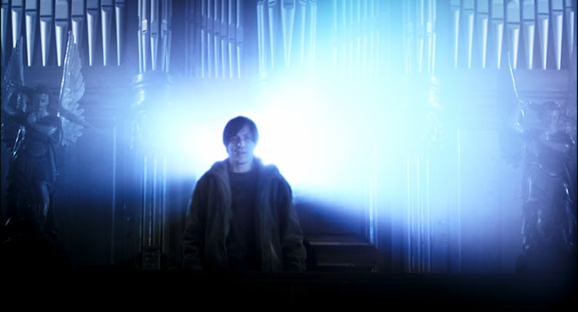

## **Klapbord**

Met **BenX** bevestigt het Vlaamse productiehuis MMG dat het de kwaliteit van een art house film kan combineren met de toegankelijkheid van een productie voor een breed publiek van zowel opgroeiende jongeren als volwassenen. **BenX** is de debuutfilm van Nic Balthazar. Als regisseur is hij een autodidact. Hij schreef zelf het scenario op basis van zijn jeugdroman en theatervoorstelling _Niets was alles wat hij zei_. Op het _Festival des films du monde_ (Montréal 2007) won de debuutfilm van Balthazar de prijs van de beste film, de publieksprijs en de oecumenische prijs.

## **Synopsis**

Ben Vertriest volgt in de derde graad van het technisch onderwijs de afdeling metaal. Hij is erg goed in zijn vak en de leerkrachten zijn over hem tevreden, ook al weten ze dat hij wat raar doet. De meesten van zijn medeleerlingen kunnen aan Bens schoolresultaten trouwens nog een punt zuigen. De jongen woont samen met zijn gescheiden en alleenstaande moeder. Zijn jongere broertje heet Jonas. Ben wil graag de grote broer zijn voor Jonas en voor zijn moeder de voorbeeldige zoon. Maar dat lukt hem niet. Hij draagt de last van een loodzware onmacht mee. Hij kan het niet helpen dat hij al van kindsbeen af een probleemkind is geweest voor zijn ouders en de juffen. En toch heeft hij het, met de hulp van zijn moeder, al ver gebracht. Op het ogenblik dat de eindstreep van het secundair onderwijs in het vizier komt, voelt Ben zijn krachten wegvloeien. Hij speelt met de gedachte om het op te geven. De aanhoudende pesterijen door zijn klasgenoten, Bogaert en Desmet, versterken Bens voornemen een moord te begaan, de moord op zichzelf. Maar zo eenvoudig gaat dat niet. In de game Archlord treedt Ben op als zijn avatar, de succesrijke ridder BenX. Samen met de _human mage_ Scarlite vormt hij een guild. Zij treedt op als de healer van BenX. Het spel kan beginnen, het plan worden gesmeed en de strategie wordt bepaald.

## **Cinematografie**

KLANKBAND. Een eerste, esthetische kwaliteit van de film is de verzorgde klankband. De regisseur heeft die in zekere zin als een zelfstandig deel van de film uitgewerkt. Dat gebeurt vanuit het perspectief van het hoofdpersonage, de autist Ben Vertriest. De film introduceert Ben als iemand die heel veel spreekt tot zichzelf en in zichzelf. De voice-over functioneert als de innenstem van Ben. Ook wanneer hij in beeld is, en hij spreekt, dan bewegen zijn lippen niet. Ben denkt enorm veel na. De hele film door krijgt de toeschouwer via _de innenstem_ inzage in de gedachtewereld van Ben. Een ander element van de klankband is de muziek. De regisseur wendt de muziek aan in de lijn van het voorgrond- en achtergrond effect. Ben heeft geleerd zich tegen die klankaanval van de buitenwereld te verdedigen. Zijn geliefd wapen is zijn walkman. Zijn klankharnas. Hij luistert er naar de muziek van _Praga Khan_. Nic Balthazar gebruikt die sferische, ambiente muziek van Kahn. Die sferische muziek werkt op Ben als zijn soort stilte: geen babbelende stemmen, maar een bijna stille stroom van zachte klanken.

WOORD EN BEELD IN BEELD. De beeldende rijkdom van de film bestaat onder andere uit talrijke sequenties van ‘woord in beeld’. Het zijn _de chatsessies van Ben met Scarlite_, zijn bondgenoot in Archlord. Voor het hoofdpersonage zijn die gesprekken momenten van waarheid. Een ander belangrijk visueel element zijn _de getuigenissen_. Het eerste en het belangrijkste personage dat zo in beeld komt, is de moeder van Ben. Zij en nog andere personages spreken voor de camera in een interviewsituatie. De interviewsequenties geven aan de film _een niet-lineaire verhaalstructuur_. Voorts zijn er de talrijke gamebeelden. _De Archlord-beelden_ tekenen zich zeer scherp af op het filmdoek en helpen hiermee de eigen belevingswereld van Ben levendig voor te stellen. De regisseur wendt die beelden op een zeer creatieve manier aan zodat de toeschouwer gaat begrijpen dat Ben de werkelijkheid waarneemt vanuit het frame van de game. Nooit eerder is in een film een game zo functioneel in een verhaal geïntegreerd. Ook dat maakt de film uniek. De regisseur wendt ook close-up, zelfs de extreme close-up aan om het portret van het hoofdpersonage beklijvend te schilderen.  

## **Betekenisruimte**

De rijke betekeniswereld van BenX ontstaat door de bijzondere vormgeving van de dramatische ontknoping. Daarbij hanteert de regisseur enkele bijzondere cinematografische middelen die bijzonder geschikt zijn voor de interpretatie van het genre van de psychologische thriller vanuit dat van de spirituele film. Het betreft, naast de technische en narratieve elementen, de uitwerking van leidmotieven. In BenX werkt Nic Balthazar enkele sprekende beeldmotieven uit. Ze werken als rode draden die het betekenisweefsel van de film vormen. Drie springen in het oog: de oorlog, de spiegel en het kruisbeeld. Dat laatste verschijnt wanneer Ben naar de bus stapt en even blijft stil staan bij het grote witte kruisbeeld aan het kerkgebouw dat hij passeert. Het is duidelijk één van zijn vaste rituelen. Op het houten kruis hangt een Jezusfiguur, volledig in het wit. Het kruisbeeld komt eveneens in beeld tijdens het uitgewerkte tafereel in de godsdienstklas. Het kruisbeeld speelt ook een hoofdrol in de grote finale van de film. Die is namelijk gesitueerd in het kerkgebouw. Hiermee neemt de regisseur de religieuze, erg christelijke dynamiek van dood en verrijzenis op in zijn verhaal. Hij doet dat op een originele en tevens eigentijdse, beeldende manier.

## **Context**

De film **BenX** is een fictiefilm die op geen enkel moment vervalt in een documentaire uiteenzetting over cyberpesten, zelfdoding en autisme bij jongeren. Voor het schrijven van het scenario heeft Nic Balthazar wel grondig onderzoek verricht naar die fenomenen zodoende dat zijn verhaal over Ben Vertriest diepe wortels heeft in de realiteit. Trouwens tijdens de openingsgeneriek verschijnt de zin: “_Inspired by true events_”. Het filmverhaal **BenX** verschijnt vooral als een uitzonderlijke en waardevolle humane film. De hartslag ervan beweegt op het ritme van de heersende _nood aan een menswaardige zingeving_ van wat er met en in het leven gebeurt. Hierdoor geeft BenX, de filmversie van het verhaal, een nog meer uitgesproken spirituele werking dan de roman en het theaterstuk. Dat spreekt zeer duidelijk uit het onderscheid tussen de drie. Nic Balthazar situeert de grote ontknoping, de begrafenis, in de roman en het theaterstuk in de neutrale ruimte van een crematorium. Dat decor heeft hij helemaal veranderd in **BenX**. En hoe! Hij laat het hele gebeuren plaatsvinden in _een kerkgebouw_. Het feit dat hij, ook weer in tegenstelling tot de eerste twee versies, in de film veel ruimte schept voor _het personage van de godsdienstleraar_ past in diezelfde spirituele accentuering. Het einde krijgt door die religieuze elementen _het karakter van een verrijzenis_, waarvan de betekenis direct wordt ontleend aan het evangelicht narratief van _de Verrijzenis van de Gekruisigde Christus_.

## **Links**

Sylvain De Bleeckere schreef na de gemeenschappelijke vraag van de producent MMG, de distributeur KFD en het Vlaamse Ministerie van Onderwijs en vorming een uitgebreid dossier over de film. Het kan vrij worden gedownload op [de site van de film](http://www.ben-x.be/ndl/downloads.asp)

 © Sylvain De Bleeckere, Men(S)tis, 2011/2017
