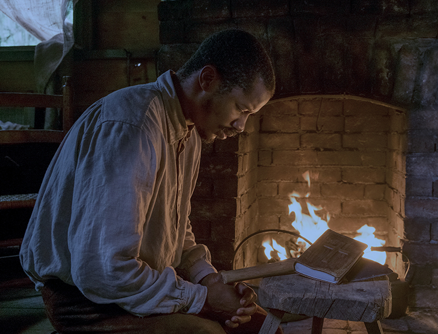

## **Klapbord**

Het bewogen verkiezingsjaar 2016 in de Verenigde Staten van Amerika. Hilary Clinton voor de Democratische Partij en Donald Trump voor de Republikeinse Partij streden er voor het presidentschap. Hilary Clinton hoopte het beleid van de aftredende, eerste zwarte president Barack Obama te kunnen voortzetten. Na de eerste zwarte president in het Witte Huis, nu de eerste vrouw als president (‘breaking through the glass ceiling’). Het draaide anders uit. De overwinning van Trump met zijn uitgesproken anti-Obama-campagne sloeg de meeste Amerikanen en bijna alle Europeanen met verstomming. Dat in dat bewogen verkiezingsjaar 2016 de film **The Birth of a Nation** zijn wereldpremière kende, krijgt een bijzondere betekenis. 
De film is namelijk een productie die onder het presidentschap van Obama mogelijk was geworden. Met de film debuteerde de Afro-Amerikaanse acteur Nate Parker als regisseur. Hij schreef zelf het scenario samen met Jean McGianni Celestin na zorgvuldig historisch onderzoek naar een vergeten periode in de geschiedenis van zwart Amerika. Die situeert zich in de eerste decennia van de negentiende eeuw met Nat Turner in de hoofdrol. Parker brengt die historische figuur voor het eerst filmisch tot leven. De film kende zijn wereldpremière tijdens het Sundance Film Festival en won er de Grand Jury Prize en de publieksprijs, de Sundance Audience Award.

## **Synopsis**

Nat Turner wordt geboren in 1800 op de katoenplantage in Southampton County, Virginia, van de familie Turner. Hij krijgt de Bijbelse voornaam Nathaniël, maar zijn familienaam, zijn identiteit, is Turner, de blanke houder van een eigen slavenkolonie. Nat groeit op als een slaaf. Na de vlucht van zijn vader voor de slavenjagers (‘slave catchers’), wordt Nat opgevoed door twee vrouwen, zijn moeder Nancy en zijn grootmoeder Bridget. Als kind gaat Nat steeds meer beseffen dat hij speciale talenten heeft. Hij leert zichzelf het alfabet en hij kan de letters herkennen in een tekst.

>De weduwe Elizabeth Turner ontdekt dat en neemt de jongen onder haar hoede, niettegenstaande het voor de slaven in het Zuiden streng verboden is om te leren lezen en schrijven. Op advies van de lokale  predikant Walthall, beslist de zoon van de weduwe, Samuel Turner, de eigenaar van de katoenplantage, zijn geletterde slaaf Nat te verhuren. Hij wil hiermee een welgekomen extra bron van inkomsten aanboren. Samuel rijdt regelmatig zijn zwarte predikant Nat naar de naburige plantagebezitters. De welbespraakte zwarte preacher krijgt de taak om in zijn predicaties zijn lotgenoten tot meer onderdanigheid, gehoorzaamheid en werkijver aan te zetten. De plantagehouders hopen op die manier hun vrees voor het ontstaan van slavenopstanden te bedwingen.
 
>Door zijn predicatiewerk leert Nat echter de onmenselijke situatie van de slaven door en door kennen. Hij absorbeert wat hij ziet. Ondertussen trouwt hij met de slavin Cherry-Ann ― later vernemen we dat haar moeder haar de naam Madison Hayne heeft gegeven. Op zeker dag is Nate getuige van de seksuele vernedering van de slavin Ester, de echtgenote van de slaaf Hark, vriend en rechterhand van Nate. Esher werkt in het huishouden van de Turners en na het jaarlijkse feest ten huize van de Turners wordt ze seksueel opgeëist door de naburige plantageman Joseph Randall. Nadat Nat ervaart dat de blanke slave catchers ook zijn eigen vrouw Cherry-Ann seksueel hebben misbruikt, en nadat hij zelf naar aanleiding van een doopsel dat hij heeft toegediend aan een blanke bekeerling, door Samuel Turner met zweepslagen wordt gestraft, beslist Nat ― geïnspireerd door zijn Bijbellezing, visioenen en een zonsverduistering ― zijn broeders op te roepen om met geweld in opstand te komen. 

>Nat en zijn volgelingen doden enkele plantagehouders. Nat zelf doodt Samuel Turner. Lang duurt hun opstand niet. Nat weet te ontsnappen aan de gewapende blanke eigenaars die zich hebben verenigd om de rebellie de kop in te drukken. Na enige tijd geeft Nat zichzelf aan. Na een kort verblijf in de gevangenis, wordt hij opgehangen. De herinnering aan hem en zijn verzet inspireert echter de volgende generatie slaven ― hier belichaamd door de jongen Jasper. Zijn aanwezigheid valt ook op tijdens de terechtstelling van Nat. Hij kijkt op naar hem. De camera zoomt in op zijn gelaat. Hij weent. Dat beeld gaat over naar de zwarte soldaten van het Lincoln-leger. Zij beantwoorden de oproep van president Lincoln om mee te strijden met de noordelijke staten voor de afschaffing van het systeem van de slavernij.  

## **Cinematografie**

**PROLOOG EN EPILOOG**. De film **The Birth of a Nation** is narratief gezien, lineair opgebouwd. Het verhaal zelf opent met een betekenisvolle proloog die verleden en heden verbindt, en een even betekenisvolle epiloog die heden en toekomst aan elkaar haakt. Tussen beide ontspint zich het chronologisch verhaal van Nat Turner in twee delen. Een kort deel belicht enkele episodes uit de kindertijd, terwijl het grote deel de volwassenheid behandelt.

>De proloog verwijst direct naar ‘the birth’ uit de titel. De slaven van de plantage Turner komen in het geheim samen. Ze spreken een zegening uit over de kleine Nat tijdens een Afrikaans-Ghanees ritueel. De gemeenschap heeft opgemerkt dat de jongen bijzondere tekenen draagt op zijn lichaam en dat hij ongewone talenten heeft. Geplaatst in het midden van een cirkel van oudere vrouwen die ritmische gebaren maken, luistert Nat naar een ouderling die de ceremonie leidt. Hij wijst de jongen aan als ‘iemand die de voorvaderlijke heilige tekens draagt’. Hij stelt de jongen aan als ‘leider’ en ‘profeet’ naar wie moet worden geluisterd. Hiermee affirmeert de slavengemeenschap in de Verenigde Staten de blijvende verbondenheid met hun Afrikaanse bakermat en bevestigen ze de grote rol die de generaties daarin vervullen. De ceremoniemeester schrijft Nat als leider kwaliteiten toe die hem een heel leven lang zullen ondersteunen: wijsheid – moed - inzicht. 

>Na die proloog verschijnt de titel van de film: de ‘geboorte’ van een natie, woorden die, zo zal blijken, slaan op de Afro-Amerikaanse natie binnen de Verenigde Staten én bij uitbreiding van de echte Verenigde Staten waarin de voormalige zwarte slavenbevolking ooit volwaardig deel van zal uitmaken; de weeën van de ‘geboorte van die natie’ blijven tot vandaag voortduren.

>De epiloog staat opnieuw in het teken van de generaties, maar nu kijkend richting toekomst. Dat gebeurt via het beeldmetaforisch personage van zwarte jongen Jasper. Hij is een slaaf van de plantage van Randall waar Nat gaat prediken. Daar stelt Randall zelf Jasper voor aan Samuel en Nat Turner. Het hele tafereel van het bezoek aan de Randall-plantage is opgebouwd als een inclusie tussen de twee shots van Jasper. Zowel in het begin als op het einde zegt hij niets, maar kijkt aandachtig. Hij lijkt vooral gefascineerd door de figuur van Nat. Jasper zelf komt dan ook terug in beeld tijdens de eerste bijeenkomst van de opstandelingen. De jongen wil deelnamen aan de bijeenkomst. De volwassen mannen willen hem echter wegsturen, maar Nat beslist dat hij mag blijven. 

>Zo wordt Jasper de kroongetuige van de opstand. Via een overvloeier verschijnt hij opnieuw. Dat gebeurt in het slotbeeld. Nu is hij jonge man. Hij doet dienst als soldaat in het leger van de Amerikaanse leger tijdens de Civil War, uitgeroepen door president Abraham Lincoln, ter afschaffing van de slavernij in het Zuiden. 

>Met die slotbeelden van de epiloog verbindt Parker de opstand van Nat Turner met de Civil War. Hij portretteert de opstand van Nat Turner als de prelude van de grootse, militaire onderneming in de Verenigde Staten om de instelling van de slavernij voor altijd uit te roeien. In dat slotbeeld herdefinieert Parker meesterlijk de titel ‘the birth of a nation’, met de nadruk op ‘nation’. Een natie kan enkel een ware natie worden genoemd, als alle delen van de bevolking er volwaardig deel van kunnen uitmaken.
 

**FILMTITEL ALS CITAAT**. Met de titelkeuze van **The Birth of a Nation** stelt Parker een sterk gebaar. Parkers titel is namelijk bewust niet origineel. Het is namelijk een citaat. Parker citeert een bestaande filmtitel: The Birth of a Nation. Dat is de stille, epische film van regisseur David W. Griffith. Diens film is gebaseerd op een roman en toneelstuk _The Clansman: An Historical Romance of the Ku Klux Klan_ (1905) van Thomas Dixon, Jr. Die historische roman was het tweede deel van een trilogie over de Ku Klux Klan (KKK) waarvan het succes bij het blanke publiek, vooral in het Zuiden van de Verenigde Staten, leidde tot een revival van de racistische Ku Klux Klan-beweging in het begin van de twintigste eeuw. De impact van Griffiths epos versterkte niet alleen het succes van Dixons romans; de film leidde tevens in het Zuiden tot de succesrijke heroprichting van de KKK. Griffith mocht in 1915 zijn film voorstellen in het Witte Huis onder het presidentschap van Woodrow Wilson. Hij prees de film als ‘history written with lighting’. Hierdoor kreeg de film ook een presidentieel aura.

>De heropleving van de KKK, de witte suprematisme en het blanke racisme diende een politiek doel. Dat bestond erin de gevolgen van de afschaffing van de slavernij en de bevrijding van de slaven, ‘the negro’s’, politiek in te dammen door te pleiten voor een systematische segregatie, een juridische scheiding van zwarten en blanken waarbij de zwarten als ‘gevaarlijke’ en ‘te mijden’ tweederangsburgers werden afgeschilderd.

>De roman van Dixon en de film van Griffith scherpten het beeld aan van de vrije ‘negro’s’ als wellustige, wraakzuchtige en ongecultiveerde barbaren die erop uit zijn om blanke vrouwen te verkrachten en blanke burgers te beroven en zelfs te vermoorden. De film verwerkt in een aantal sequenties met revolterende zwarten quasi letterlijk de herinnering op aan de opstand van Nat Turner. Dat KKK-beeld sloot de gewezen zwarte slaaf op in een mensbeeld vol haat tegenover de blanke. De roman en de film verspreidden met opzet het valse beeld van de reële slavengeschiedenis. In die vertekende voorstelling verschenen én verschijnen de leden van de racistische KKK als de helden die het Zuiden hebben gered van een blinde terreur van de zwarte bevolking ten aanzien van hun voormalige blanke meesters. Tegelijkertijd impliceert die verwrongen voorstelling een collectieve vrijspraak voor de voormalige slavernij-periode. Dat alles leert dat aanzienlijk veel blanken in het Zuiden de nederlaag in de Civil War als een onrechtmatige vernedering beschouwen die ze (nog steeds) niet willen accepteren.

**STRIJD OM GESCHIEDENISBEELD**. Evenals in de gewezen Sovjet-Unie, vormde in de vorige eeuw het medium film in de Verenigde Staten de machtigste wapen van de politieke beeldvorming. De Afro-Amerikaanse regisseur Parker is zich bewust van de unieke macht. Hij wendt het filmmedium aan om het blijvend racisme in de Amerikaanse samenleving te bestrijden. Zijn motivatie om enkele jaren van zijn leven volledig te wijden aan het project van zijn film over Nat Turner, vond hij in het historisch belang van Griffith’s film _The Birth of a Nation_.

>Tot voor de realisatie van Parkers gelijknamige film was er nog geen beeldende rechtzetting gekomen op die invloedrijke film van Griffith. Die film heeft nog steeds een groot gezag wegens de naam van Griffith zelf, één van de grote pioniers uit de Amerikaanse, ja zelfs de hele filmgeschiedenis. Nog steeds worden Griffiths films bestudeerd omwille van zijn grote vernieuwingen in het krachtige narratieve vermogen van film. Bovendien is de KKK nog steeds een actieve organisatie die de Griffiths film als hun beeldbijbel beschouwt. De eveneens historische Oscarfilm _BlacKKKlansman_ (2018) van Spike Lee brengt dat sterk aan het licht. Hij kreeg ervoor de Grand Prix op het Filmfestival van Cannes en een Oscar voor het beste scenario. 

>En dan is er nog de recente politieke realiteit. De eerste minister van Justitie, Jeff Sessions, onder de regering van de nieuwe president Trump, heeft in het verleden racistische uitspraken gedaan tegen de zwarte burgerrechten en voor de KKK. In zijn historisch statement van 27 februari 2019 voor de _United States House Commitee on Oversight and Reform_, onder het voorzitterschap van het Afro-Amerikaanse Congreslid Elijah Eugene Cummings stelde de gewezen persoonlijke juridische adviseur van president Trump onder ede zonder aarzelen dat Trump een racist is die zwarte mensen minderwaardig en dom vindt, gewezen president Obama incluis. Dat wijst erop dat het blanke suprematistische mensbeeld, zoals verheerlijkt in Griffiths The Birth of a Nation, in de Verenigde Staten niet alleen onder de oppervlakte, maar ook aan de publieke oppervlakte nog steeds actief doorwerkt.

>In die optiek ontmaskert Parker _The Birth of a Nation_ van Griffith als een echte propagandafilm die de ideologie van het blanke suprematisme onderschrijft en verspreidt. Dat het blanke ras superieur en hoogwaardiger is dan het zwarte ras blijkt inderdaad uit iedere scène van Griffiths film. Parker verwijst ernaar in de eerste scènes van zijn Birth of a Nation. Het betreft de scène waarin Nats vader Isaac in het avonddonker op zoek gaat naar eten voor zijn gezin, en onderweg door lokale slave catchers wordt tegengehouden. De leider van de slavenjagers, Raymond Copp, vraagt aan een van zijn trawanten, Jesse: ‘Hoe noem wij een neger die zichzelf slimmer vindt dat een blanke?’ Het antwoord van Jesse luidt: ‘Een dode neger.’ De vader van Nat kan zich verdedigen en ontsnappen, wat hem echter verplicht zijn gezin te verlaten en blijvend te vluchten. Die vroege scène is reeds een voorafspiegeling van het verzet dat Nat Turner later zal organiseren tegen het ontmenselijkende systeem van de slavernij. 

**HEMELSE KLANKEN EN MENSELIJKE WEEKLACHT**. De muziek vormt een volwaardig deel van de film **The Birth of a Nation**. De eerste muziek is die van de natuur, het geluid van de stilte. De plantage bevindt zich midden in de natuur: de uitgestrekte bossen met veel moerassige delen, de katoenplantage. Die natuurmuziek brengt de stilte voort die prominent aanwezig is en die de toeschouwer helpt om zich in de sfeer te kunnen inleven. De natuurlijke stilte sluit aan bij het opgelegde zwijgen van de slaven. Ze hebben niet het recht om vrijuit te spreken en alles wat ze zien en horen, moeten ze voor zich houden. Nat zelf ondervindt wat er gebeurt, als hij dat opgelegde zwijgen verbreekt.

>Vervolgens is er de originele muziekscore die componist Henry Jackson schreef in opdracht van de regisseur. Zelf beklemtoont Jackson vooral de spirituele dimensie van zijn compositie. Ze kleurt het dramatisch verhaal in met een religieus-spiritueel palet. Concreet gebeurt dat via een eerder ingetogen symfonische filmmuziek met violen en een kinder- en vrouwenkoor. Hierdoor ontstaat er een muziek die uit de hemel lijkt te weerklinken. Dat is zeker het geval in de sequenties waarin de met zweepslagen neergeslagen Nat terug opstaat, gesterkt door het zien van de vele kaarslichtjes die zijn medeslaven zwijgend voor hem hebben doen branden. De componist verwijst zelf expliciet naar diezelfde ‘hemelse’ spirituele muziek bij de gewelddadige confrontatie tussen de rebellerende opstandelingen en de goed bewapende blanken, bijeengebracht door de gealarmeerde plantagehouders. De muziek ‘ontwapent’ de gewelddadige actiescènes. De gebruikelijk heroïsche muziek dikt het visueel geweld niet aan. Het tegenovergesteld gebeurt. Voorts duidt de ‘hemelse’ muziek Nats twee engel-visioenen: op het einde van de geseling en op het einde van de terechtstelling aan de galg. Ieder keer verschijnt de witte engel vanuit een zeer helder wit, hemels licht. De engelfiguur brengt bij de geseling troost en verlichting, en bij de dood verwelkomt ze Nat in de 'hemelse' wereld na de dood. 

>In enkele sequenties verwerkt Jackson de typische Afrikaanse houtblazers en percussie. Die weerklinken in de proloog en in de beginsequenties van de opstand.

>De soundtrack van de film nog een ander belangrijke component: de cello solo. Die is prominent aanwezig en vertolkt het ingehouden verdriet van de slaven, en in het bijzonder dat van de zwarte vrouwen. Hun verdriet verdicht zich in de personages van Nats grootmoeder Bridget en moeder Nancy, en in die van Nats vrouw Cherry en Harks vrouw Esther. Een ‘wenende’ mix van symfonische klanken en cello onderlijnen ook de typische overgangssequenties. Die verbinden soms twee verschillende taferelen, soms twee verschillende momenten in de tijd. 

>Naast de eigen filmmuziek, geeft Parker aan enkele negro-spirituals een cruciale rol. Het unieke genre van de negro-spiritual vertolkt direct de unieke stem van de Afro-Amerikaanse slaven. Ze behoren nu tot de rijkdom van het muziekerfgoed van de Verenigde Staten van Amerika. In die slavenliederen spiegelen de slaven hun onmenselijke situatie in Bijbelse verzen en verhalen. Ze kennen een unieke mix van klaagzang en gebed. 

>Enkele belangrijke filmtaferelen krijgen een unieke stem via die authentieke songs. Ze zijn onlosmakelijk verweven met die taferelen. Het betreft: _Sweet Low, Sweet Chariot_ die de overgang duidt van de jonge Nat naar de volwassen Nat in het katoenveld; _Run, Mary, Run_ dat de zwarte bewoners van de Parker-plantage zingen tijdens het trouwfeest van Hark en Ester;  _Couldn't Hear Nobody Pray_, een unieke a capella interpretatie, gecomponeerd voor de film, door het Afro-Amerikaanse Wiley College Choir met de Afro-Amerikaanse solist Lewis Keys.

>_Sweet Low, Sweet Chariot_ verwijst bij het begin van het verhaal van de volwassen Nat al naar het einde ervan. De spiritual vertolkt de troost van de slaaf in de dood die wordt ervaren als een reis naar de thuis van de hemel. Het beeld van de kar is aan de Bijbel ontleent (2 Kon. 2:11) waar de profeet Elia met een ‘_wagen (chariot) van vuur_’ naar de hemel wordt gevoerd. Voor de Afro-Amerikaanse slaven is die wagen een houten kar waarmee de overleden slaaf naar het graf wordt gevoerd, een laatste reis die wordt ervaren als de laatste reis naar de hemelse thuis zonder pijn, lijden en verdriet. Sommige interpretaties zien in de song eerder een verdoken verwijzing naar de Underground Railroad, de ondergrondse vrijheidsbeweging die slaven hielp ongemerkt te vluchten naar de Noordelijke Staten en naar Canada. De ‘kar’ is dan de ‘trein’. Het feit is dat de song zeer populair werd in de jaren zestig van vorige eeuw door toedoen van de Civil Rights Movement. Ook de blanke folkrevival pikte de zwarte song op. Joan Baez bracht het lied zelfs op het historische Woodstock Festival voor een overwegend blank jongerenpubliek. Al die associaties spelen mee in het citaat ervan in Parkers film bij de introductie van de jonge en volwassen Nat in de katoenplantage.

>De minder populaire _Run, Mary, Run_ weerklinkt bij het trouwfeest van Hark en Esther. Geplaatst in deze context werkt het als een verzetslied. Dat blijkt uit de herhaling van het refrein: _Run, Mary, Run, you got the right to the tree of life_. Het beeld van de levensboom is ontleend aan het _Genesisverhaal 2_ over Adam en Eva in het aards paradijs waar de levensboom zich bevindt. In de filmcontext geven de slaven aan het gehuwde koppel het recht om te leven. In de praktijk van het systeem was dat helemaal niet de realiteit. Slavenhouders hielden ervan om gehuwde Afro-Amerikaanse koppels en gezinnen te breken door een van beiden en/of de kinderen door te verkopen. In de film wordt die praktijk gesuggereerd in het gegeven dat Nat en Cherry-Ann wel kunnen huwen maar niet samen kunnen leven, omdat ze ieder tot een aparte plantage behoren. Bovendien weerklinkt in de film de echo van de song na in de beklijvende scène waarin blijkt dat de pas gehuwde Esther seksueel is misbruikt door slaveneigenaar Joseph Randall na het feest ten huize van de Turners. _Run, Mary, Run_ klinkt retrospectief als een waarschuwing voor het ondraaglijke leed dat Esther nog zal overkomen. Dit alles krijgt nog meer dramatisch gewicht, wanneer de toeschouwer weet dat de actrice Gabrielle Union die Esther vertolkt, zelf heeft getuigd hoe ze slachtoffer is geweest van seksueel geweld. 

>De hele film sluit af met de generiek op een zwarte achtergrond terwijl de negro-spiritual _I Couldn't Hear Nobody Pray_, Lord de toeschouwer en toehoorder uitgeleide doet. De aangrijpende vertolking synthetiseert de hele film retrospectief. De woorden van de spiritual spreken een ondubbelzinge taal. Het refrein is een gebeden weeklacht waarin de stem van Nat over zijn dood heen in de film en in de realiteit alsnog weerklinkt. Zijn stem wordt geleidelijk ook de stem van het hele slavenvolk. Ook hier is er de Bijbelse referentie: de scène uit het passieverhaal van Jezus in de Hof van Olijven. Jezus die zich door iedereen verlaten voelt. Zijn leerlingen slapen, niemand om samen met hem te bidden in het donkerste uur van zijn bestaan. Ziehier de tekst van de song: 

>>[Solo]
_I couldn't hear nobody pray.
See when I was way down yonder,
By myself.
And I couldn't hear nobody pray.
See, oh Lord._

>>[Koor]
_I couldn't hear nobody pray, Lord.
I couldn't hear nobody pray.
See when I was way down yonder,
By myself
And I couldn't hear nobody pray._

>>[Solo]
_Dark was the night and cold the ground,
On which my Lord was laid.
And great drops of blood like sweat roll down,
In agony he prayed.
See, oh Lord....
Father remove this bitter cup
If such thy sacred will.
But if not content to drink it up,
Thy pleasure I'll fulfill.
See,oh Lord oh._

>Behalve de genoemde drie negro-spirituals weerklinkt ook de jazzsong _Strange Fruit_. Dat gebeurt bij de slotsequenties waarin de opstandige slaven worden gevangen, berecht en worden opgehangen. Via _Strange Fruit_ interpreteert Parker dat historisch tafereel voorwaarts. Hij verwijst ermee naar de beruchte lynchpartijen door KKK op het einde van de negentiende en eerste decennia van de  twintigste eeuw. De Joods-Amerikaase dichter Abel Meeropol, pseudoniem Lewis Allen, schreef de song in de jaren dertig van vorige eeuw nadat hij geschokt was door een foto in de krant die berichtte over een lynchpartij in het Zuiden van de Verenigde Staten van Amerika. Hij publiceerde het gedicht eerst in 1937 in het magazine _Teachers Union_ en schreef daarna zelf de muziek bij zijn gedicht. Het groeide uit tot een protestsong avant la lettre. De Afro-Amerikaanse jazzzangeres Billie Holliday maakt de song onsterfelijk toen ze die voor het eerst song in 1939. Ook Afro-Amerikaanse pianiste en zanger Nina Simone bracht een indringende vertolking van de song. Het is haar versie die Parker gebruikt in de film.

**BIJBELBOEK ALS DRAGENDE BEELDMETAFOOR**. Het belangrijkste beeldmotief van de film is het boek van de Bijbel, in het bijzonder het exemplaar van Nat Turner. Zijn persoonlijke ‘Bijbel’ bestaat nog steeds en wordt heden bewaard in het _African American Museum_ in Washington, DC. Daar is te zien dat de historische Nat persoonlijk het Bijbelboek Apocalyps 6: 2 met potlood heeft gemarkeerd: 

>>_En ik zag dit:  een wit paard met een ruiter, die een boog droeg. Hij kreeg een zegekrans en trok op als een overwinnaar, de overwinning tegemoet._ (Nieuwe Bijbelvertaling)

>Dit citaat komt niet in de film zelf voor, maar de geest ervan klinkt door in de vele Bijbelverwijzingen die de film typeren.

>Het inleidende deel van de kindertijd van Nat staat helemaal in het teken van het Bijbelboek. De avond dat zijn vader Isaac voor zijn leven moet vluchten en gedwongen afscheid moet nemen van zijn gezin zegent hij op zijn beurt Nat, zijn enig kind. Hij zegt letterlijk: 

>>_Je bent een kind van God. Je hebt een doel. Het zit in je. God heeft het jou gegeven en iemand kan het je afnemen._

>Kort daarna, ziet Nat voor het eerst een boek. Het ligt omgekeerd op de rug van de schommelstoel van Elisabeth Turner. Het is zij die daarna aan Nats moeder Nancy vertelt dat haar man heeft ontdekt dat Nat zichzelf heeft leren lezen. Ze wil zich over hem ontfermen.

>>_Als de Heer de jongen de gave van het lezen gaf, zou het zonde zijn die verloren te laten gaan._

>Daarna krijgt Nat in de bibliotheek van het huis van mevrouw Turner ‘_het beste boek dat ooit geschreven werd_’, de Bijbel, zijn Bijbel. Ze verzekert hem tevens dat wanneer hij haar instructies volgt, zijn leven nooit meer hetzelfde zal zijn. Dan begint ze met de jongen de eerste regels van de Bijbel, de opening van _Genesis_, te leren lezen: ‘_In het begin..._’. 

>Daarna volgt nog de sequentie in de blanke kerk, gebouwd op de plantage, waar het kind Nat voor het voltallige blanke kerkpubliek voorleest uit de Bijbel: _Jak. 4:8b-9_: 

>>_Reinig uw handen, zondaars, en zuiver uw hart, wankelmoedigen. Erken uw ellende, en treur, en ween. Laat uw lachten in rouw verkeren en uw vreugde in droefheid._

Daarna neemt de blanke dominee het over en nodigt de blanke kerkgemeente uit om in het licht van _Jak. 1_ vast te houden aan ‘_de goedheid van de Heer_’. Na de dood van zijn meester Benjamin Turner, moet de jongen op het katoenveld gaan werken. Via de klankband met _Sweet Low, Sweet Chariot_ volgt de overgang naar de volwassenheid van Nat. Hij werkt nog steeds op het katoenveld, maar de song op de klankband eindigt met de sequentie van Nat die predikt in zijn eigen kerk die hij heeft ingericht in de schuur van het slavenkwartier. Daar resumeert hij de hoofdgedachte van het einde van _Psalm 27_:

>>_Ik zou vergaan zijn zo ik niet had geloofd dat ik het goede van de Heer zou zien in het land van de levenden. Wacht op de Heer, wees sterk en Hij zal uw hart versterken. Wacht, zeg ik, op de Heer._

>In een tweede predicatie voor zijn eigen zwarte kerk, met de Bijbel in zijn handen, bespeelt Nat het agrarisch thema van het planten van de gewassen en het oogsten ervan, waarmee hij zinspeelt op het katoenplantage. Hij verplaatst het slavenwerk op de plantage naar het eigen leven van de slaven dat, mits vertrouwen in God, ooit anders zal worden. Daarom is het sleutelwoord van de predicatie: moed en vertrouwen in het werk van God, die hemelse Planter die anders werkt dan de ‘massa’, de meester van de katoenplantage. 

>>_Zoals het gewas dat geplant werd, op tijd wordt geoogst, zo heeft de Heer ons ook geplant. De goede God zal Zijn werk voltooien in ons. Tot slot vraag ik jullie allemaal moed te vatten, want God is aan het werk in je leven en Hij stopt niet eer Zijn werk gedaan is. Amen._

>Daarna begint de carrière van Nat als prediker die door zijn meester Samuel Turner wordt verhuurd aan diens buren. In de film blijft Parker stilstaan bij twee bijzondere plantages: de meer rijke plantage van de gecultiveerde Joseph Randall en de meer arme plantage van de ruwe Earl Fowler. Randall eist dat Nat zijn slaven aanspoort om zich volledig en zonder morren te onderwerpen aan hun ‘massa’. Nat leest zijn broeders en zusters slaven van Randall _1 Petr. 2:18_ voor: 

>>_Slaven, onderwerpt u aan uw meesters met alle respect. Niet alleen als ze goed en vriendelijk zijn, maar ook als zij hardvochtig zijn._

>De Nederlandse vertalingen van dit vers verschillen. Sommige edities vertalen ‘vriendelijk’ en ‘hardvochtig’ met ‘rechtvaardig’ en ‘onrechtvaardig’. Tussen de bezoeken aan de twee plantages staat een montage die laat zien dat Samuel Turner zijn predikende slaaf overal naar plantages brengt waar hij tegen betaling de diensten van Nat verkoopt. Bij die beelden hoort Nats predicatie met het _vers 2 van Psalm 123_ en de _verzen 24-26 van Gen. 9_. In de Nederlandse ondertiteling van de film luidt dat als volgt.

>>_Zoals de ogen der knechten zijn gericht op de hand van hun meester, zoals de ogen der dienstmaagd zijn gericht op de hand der gebiedster... Toen Noah uit zijn roes ontwaakte en ontdekte wat zijn jongste zoon hem had aangedaan, zei hij: 'Vervloekt zij Kanaän. ...de minste knecht zal hij zijn van zijn broers. En hij vervolgde: Gezegend zij de Heer, de God van Sem, en Kanaän..._

>De tweede en laatste uitgewerkte predicatie van Nat situeert zich op de plantage van de wrede en onbarmhartige Earl Fowler. Die eist dat de zwarte prediker Nat zijn slaven tot blinde gehoorzaamheid aanzet wat de Bijbel kan, aldus Bradley, effectiever zijn dan zijn geweer. Nat die getuige is geweest van de wreedheden van de man, beslist om zijn predicatie te baseren op _Psalm 149_. Ziehier de vertaling zoals ze in de ondertiteling van de film voorkomt. Het is duidelijk dat Nat via de psalmtekst zijn medebroeders verdoken inspireert om zich in Gods Naam in opstand te komen tegen de slavenhouders. 

>>_Broeders, ik bid dat je tot de Heer zingt...met een nieuw lied. Zing Zijn lof in de gemeenschap der rechtschapenen. Opdat de getrouwen zich verheugen in de glorie. Laat hen zingen waar zij zijn gelegerd. Met Gods lof op de lippen der getrouwen en een tweesnijdend zwaard in hun hand tot voltrekking van wraak aan de heidenen, tot een strafgericht over die volken om hun koningen in ketenen te slaan en hun edelen in boeien van ijzer, te voltrekken aan hen dit geschreven recht. Glorie is dit voor al Zijn getrouwen! Loof de Heer! Zing tot Hem met een nieuw lied! Loof de Heer!_ 

>Vervolgens komen er nog expliciete verwijzingen naar Bijbelpassages voor in dialogen tussen de personages. Tijdens het gesprek van Nat met zijn vrouw Cherry-Ann nadat ze zwaar toegetakeld is door de 'slave catchers', zegt Nat haar dat hij dit zal rechtzetten. Zij antwoordt hem echter dat zij van hem het volgende heeft geleerd. Ze citeert dan _Mat. 26, 52_:

>>_Steek uw zwaard weer op zijn plaats. Want allen die naar het zwaard grijpen, zullen door het zwaard omkomen._

Dan is er nog het grote feest op de Turner-plantage. Nat mag van Samuel het tafelgebed uitspreken. Hij begint met de aanhef van het Onzevader (_Mat. 6:913 en Luc. 11:2-4_). Zijn grootmoeder Bridget had dit eerder al gedaan bij de huwelijksinzegening van Nat en Cherry-Ann. Tijdens zijn tafelgebed zet Nat het _Onzevader_ naar zijn hand. Hij bidt eigenlijk voor zichzelf om de moed om ‘_de vijand van onze vijanden_’ te bestrijden en te ‘_in onze beproeving te kunnen volharden_’. Het gegeven van ‘de vijand van onze vijanden’ is een typisch _Oudtestamentisch_ thema dat in alle boeken van de _Thora_ en in vele _Psalmen_ weerklinkt. Het tafelgebed van Nat:

>>_Onze Vader, Wij danken U voor Uw woord en Uw wil. Wij bidden voor en danken U voor Uw bescherming en Uw belofte. En in onze gehoorzaamheid zult Gij een vijand van onze vijanden zijn. Gij zult bestrijden wie ons bestrijdt. Blijf ons leiden, o Heer, en wij blijven U volgen. In onze beproeving zullen wij volharden en enkel U erkennen als onze bron en kracht. In Uw heilige naam bidden wij. Amen._

Na het seksuele misbruik van Esther door plantagehouder Randall, vraagt Hark aan Nat: ‘_Waar is Hij? Waar is God nu?_’ Daarin weerklinkt het gebed van Jezus aan het kruis: _Mat. 27:46 en Mar. 15:34_, wat zelf een citaat is uit _Psalm 22,2-3_. 

>Ook het doopsel dat Nat uitvoert bij een blanke zondaar verwijst visueel naar de scène van het doopsel van Jezus in de Jordaan door Johannes De Doper (_Mat 3,13-17_). 

>Daarna volgt de grote confrontatie Nat versus Samuel Turner en dominee Walthall. Die eisen dat Nat zich verantwoordt over het volgens hen onverantwoorde doopsel. Dan ontspint er zich een Bijbelgevecht. Nat verdedigt zich met _Hand. 20:28_: 

>>_Pas goed op uzelf en op de kudde waarover de Heilige Geest u het toezicht heeft gegeven. Leef als herders voor de gemeente van God, die Hij door het bloed van zijn eigen Zoon heeft verkregen._

De blanke dominee Walthall riposteert met:

>>_Zeg tegen de slaven dat zij hun meesters moeten gehoorzamen, al hun eisen inwilligen, niet tegenspreken..._ (Ef.6:5 en het al eerder geciteerde 1 Petr. 2:18).

>Nat heeft vervolgens zijn antwoord klaar door _1 Kor. 7:23_ aan te halen: 

>>_Gij zijt gekocht en betaald, word geen slaven van mensen._, wat hij koppelt aan _Mat 12:32_: _Wie de Heilige Geest belastert, zal nooit vergeving krijgen, maar is bezwaard..._ 

De dominee kan daar niet mee lachten en roept _Mat. 7:15_ in: 

>>_Wacht u voor de valse profeten in schapenvacht, vanbinnen zijn zij wolven!_

>Nadat dat intens Bijbelgevecht wordt Nat aan de paal gebonden en slaat Jethro, de rechterhand van Samuel, met een harde zweep op de ontblote rug van Nat, met tal van open wonden als resultaat.

>Na het overlijden van zijn grootmoeder Bridget, beslist Nat een gewapende opstand te leiden. Hij citeert voor zichzelf _1 Sam. 15:3_:

>>_Ga nu heen, versla Amalek, vernietig al wat hij bezit en spaar hem niet. Dood man en vrouw, kind en zuigeling, rund en schaap, kameel en ezel._

>Die tekst verschijnt als Bijbeltekst in close-up op het scherm.
Tijdens de geheime bijeenkomst waar Nat aan enkele vertrouwelingen in aanwezigheid van de jongen Jasper roept Nat het Bijbelse beeld van de strijd van David tegen Goliath (_1 Sam. 17:31-54_) en hij citeert ook _Mat. 20:16_: 

>>_De eersten zullen de laatsten zijn en de laatsten zullen de eersten zijn._

>En wanneer zijn leerlingen vragen wat ze dan concreet zullen gaan doen, antwoordt Nat weer in Bijbelse termen:

>>_Hetzelfde als David en Gideon, en Jozua en Samson._

>Naar David had hij al eerder verwezen. Met Gideon roept hij de herinnering op aan de vijfde rechter die van God de opdracht kreeg Zijn vijanden te verslaan (_Recht. 6-8_). Jozua, de opvolger van Mozes, verovert en verdeelt het Beloofde Land Kanaän (het boek Jozua) en de rechter Samson (_Recht. 13-16_) bond de strijd aan tegen de vijanden van Gods volk, de Filistijnen. Die visie speelt ook door in de discussie tussen Nat die de opstand leidt en Isaiah. Nat roept zijn verantwoordelijkheid op voor ‘_het verdrukte volk van God_’ en ‘_Gods Wil_’, termen die een grote rol spelen in de beide Bijbel-Testamenten. En in diezefde geest beëindigt Nat de discussie met Isaiah erop te wijzen dat God ook een ‘_god van gramschap_’, waarna hij herhaalt dat de Heer hem roept om op te staan en te strijden. Die visie krijgt een bevestiging van Cherry-Ann die nog steeds herstelt van haar wonden. Nat neemt afscheid van haar en vertelt haar over zijn beslissing om de opstand te leiden. Haar reactie is: 

>>_Mijn hele leven lang heb ik gebeden dat de Heer ons zou helpen door iemand te sturen die dat kon. Wij allemaal hebben dat gebeden. Ik had alleen niet gedacht dat het mijn eigen man zou zijn. Als de Heer je geroepen heeft om te strijden, moet je dat doen. Strijd voor mij en Joanna. Strijd voor ons allemaal._

>De allerlaatste keer dat Nat naar de Bijbel verwijst, gebeurt in het aangezicht van de ‘vijand’. Daar spreekt hij zijn broeders toe, geïnspireerd door _Jesaja 12:2_: 

>>_De Heer is de kracht van ons leven. Wie zouden wij vrezen?_, gekoppeld aan _Psalm 27:2_: _Kwaadwilligen, ja zelfs onze vijanden kwamen op ons af om ons te verslinden, maar zij struikelden_.

>En met zijn laatste woorden van doorzetting alvorens de aanval in te zetten, roept hij: Al trekt een leger tegen ons op, ons hart versaagt niet, waarmee hij duidelijk verwijst naar het beeld van het leger van de Farao die de gevluchte slaven, het Volk van God, achterna zit (_Ex. 14_). 

>In de gevangenis creëert Parker een beeld met het hemelse, invallende witte licht tegen de achtergrond van de donkere tralies van de cel. Dan in clair-obscure compositie vormt Parker een beeld met het personage van Nat dat direct verwijzing naar _de kruisiging van Jezus_. Daarna volgen de sequenties van de tocht naar de galg, waarbij de visuele nadruk valt op de bespotting onderweg. De omstaanders beschimpen en slaan Nat. De weg naar de plaats van zijn terechtstelling spiegelt zich in _de kruisweg van Jezus in Jeruzalem_. In de kleine Amerikaanse stad die ook Jeruzalem heet, voltrekt zich de opstand van Nat en zijn volgelingen worden er neergeslagen, helemaal in overstemming met de historische feiten. Ook Nat zelf wordt er terechtgesteld. De weg van Jezus en zijn leerlingen eindigde eveneens in de historische stad die Jeruzalem heet. Ook de negro-spiritual song, _I Couldn't Hear Nobody Pray_, die de eindgeneriek en aldus de hele film retrospectief belicht, legt direct de link tussen het verhaal over Nat Turner en _het passieverhaal van Jezus_.

Tot slot, is de Bijbel nog direct aanwezig via _de Bijbelse namen_ van zowel blanke als zwarte personages: Nat is de Amerikaanse afkorting van _Nathaniël_, volgens het Johannes’ Evangelie een van de twaalf apostelen van Jezus. De Hebreeuwse naam betekent ‘gave van God’. Voorts zijn er de Bijbelse namen Samuel, Elizabeth, Isaiah, Esther, Joseph, Benjamin en Simon. De kleine stad Jeruzalem in Southampton County, Virginia, is genoemd naar de grote, historische en Bijbelse stad Jeruzalem.
 
**BEELDSPRAAK VAN VUUR**. In de beeldsignatuur van de film speelt ook de aanwezigheid van vuur een hoofdrol. Dat gebeurt via het brandend haardvuur in de woningen, in het bijzonder in de woning van Bridget, Nancy en Nat. Er komen tal van binnensequenties voor waarin het schijnsel van het haardvuur zelf niet in beeld is, maar wel zichtbaar is op de personages. 

>Het beeld van het vuur in huis heeft ook een Bijbelse inspiratie. Het verwijst naar de werking van de Heilige Geest bij Pinksteren (Hand.2). Door de komst van de Heilige Geest in de vorm van ‘iets wat op vuur geleek’ overwonnen de leerlingen die zich vol droefheid, verlatenheid en rouwgevoelens in een huis waarvan de ramen dicht waren, hadden opgesloten, hervonden ze hun moed, inzicht en bezieling.

>Nat Turner weet zich bezield door het vuur van de Geest. Hij ervaart zijn inzichten en visioenen als de bezielende werking van de Heilige Geest in hem.

>De huwelijksscène met Nat en Cherry-Ann is een sobere, maar zeer sterk opgebouwde binnenscène. Beiden zitten naakt tegenover elkaar in een relatief donkere ruimte die enkel wordt verlicht door een grote, brandende kaars. De camera zoomt langzaam in op die kaars. Dan komen ook de neervallende druppels van de zich opbrandende kaars in beeld. Het zijn de druppels van verdriet dat nog zullen volgen, maar ze roepen ook het beeld op van het offer. 

>Dat verwijst vooruit naar de laatste scène met beiden, de scène die direct voorafgaat aan het begin van de gewapende opstand. Die staat, helemaal in de lijn van de overgeleverde documenten, niet zozeer in het teken van de rebellie zelf, maar in dat van het offer dat Nat, gesterkt door zijn vrouw Cherry-Ann, brengt. Dat sluit ook aan bij de sequentie waarin Nat zich vrijwillig en zonder geweld gaat aangeven aan de overheid.

## **Betekenisruimte**

**MODERNE DEMOCRATIE ALS HET ONTWAKEN VAN GODS RECHTVAARDIGHEID**. In **PilgrImage**

**BEELDENDE OPSTAND**.

**HET LEERPROCES VAN NAT TURNER**.

**INTERPRETATIESTRIJD OM DE BIJBEL**.

## **Context**

Het filmpje **PilgrImage** staat op zichzelf 

## **Links**

Zie de sites van [Kristof Hoornaert](https://www.kristofhoornaert.com/) en [Marleen Mertens](http://www.marleen-mertens.be/metafora.php).

 

© Sylvain De Bleeckere, Men(S)tis, 2019.

