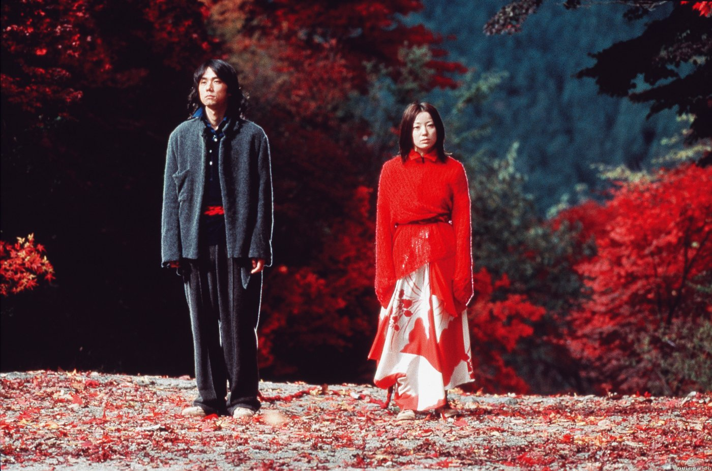

## **Klapbord**

Met zijn film **Dolls** bereikt de Japanse regisseur Kitano Takeshi een esthetisch hoogtepunt in zijn zeer persoonlijk werk. In de loop van de jaren negentig van vorige eeuw heeft hij _een eigen oeuvre_ geschapen waarmee hij is uitgegroeid tot een nieuwe grootmeester van de naoorlogse, Japanse cinema. In **Dolls** verwerkt hij op een originele manier de oude Japanse en tevens unieke traditie van _het bunraku-marionnettentheater_.

## **Synopsis**

De film opent met beelden van een opvoering van het bunraku-stuk _Meido no Hikyaku_ (Boodschapper voor de onderwereld). Van de opvoering door het _Tokio National Theater_ krijgen we zowel de uitvoerders als de toeschouwers te zien. De twee marionetten, _Chunei en Umegawa_, beheersen de scène. Omdat hun liefde voor elkaar maatschappelijk niet wordt aanvaard, beslissen ze samen te vluchten. Uit dit tafereel ontstaat _het filmische hoofdverhaal_ dat zich in het heden afspeelt. Om elkaar niet te verliezen zijn _Matsumoto en Sawaka_ aan elkaar vastgebonden. Voorbijgangers herkennen hen als _de gebonden bedelaars_. De jongen en het meisje houden erg veel van elkaar. Onder druk van zijn ouders verlaat Matsumoto zijn geliefde Sawaka en huwt de dochter van zijn baas. Op zijn trouwdag verneemt hij dat de treurende Sawaka bij een mislukte zelfdoding haar herinneringsvermogen is verloren. Zonder aarzelen verlaat Matsumoto het trouwfeest en haalt Sawaka weg uit de psychiatrische instelling. Zij herkent hem niet. Aan elkaar vastgeknoopt met een rode, dikke koord _dwalen ze zwijgzaam langs de wegen_ om in het decor van een winters en besneeuwd berglandschap, samen te sterven, boven de afgrond hangend aan de tak van een boom. Het verhaal van Matsumoto en Sawaka is verweven met _twee nevenverhalen_. Dat van _Hiro_, de oude yakuza, die na dertig jaar zijn jeugdliefde _Ryoko_ opzoekt. Al die tijd heeft de jonge vrouw iedere zaterdag op een bank in het park tevergeefs gewacht op haar verloofde die zich niet aan zijn woord van terugkeer heeft gehouden. Het tweede liefdesverhaal is dat van de jonge popster _Haruna_ en haar fan _Nukui_. Na een ongeval met de auto trekt de zangeres zich terug uit het openbaar leven. Ze wil niet dat iemand die haar als populaire zangeres heeft gekend, haar geschonden gelaat ziet. Om zijn idool toch te kunnen benaderen, verminkt Nukui zich aan de ogen. De blinde Nukui slaagt erin de gekwetste Haruna te ontmoeten.

## **Cinematografie**

BUNRAKU. Het bijzondere perspectief is een van de bijzondere aspecten van de rijke cinematografie dat **Dolls** kenmerkt. Twee stilistische beslissingen dragen _de visuele poëzie van de sublieme esthetische visie_ van Kitano. Allebei komen ze voort uit _het bunrakutheater_. Er is vooreerst _de structurele inclusie_. De film opent en eindigt met fragmenten uit de bunraku-voorstelling. Vooral het tafereel met de vluchtende Chunei en Umegawa werkt door de montage als _een spiegel_ voor het verhaal van Matsumoto en Sawaka. Naast de structurele inclusie is er _de meesterlijke inversie van het blikveld_. Die inversie voltrekt zich in _de tweeledige proloog_. Eerst is er de introductie van de theatervoorstelling zelf met beelden van de scène met de marionettenspelers, het decor, de poppen en met beelden van de toeschouwers in de zaal. Gescheiden van het eerste deel door een zwart beeld, volgt het tweede proloogstuk. Op een volledig zwarte achtergrond verschijnen nu de _twee marionetten Chunei en Umegawa als zelfstandige personages_. Ze kijken zwijgend naar de camera die inzoomt. Kitano maakt in die beweging de overgang naar het eerste beeld van de twee zwervende hoofdpersonages Matsumoto en Sawaka. Dat betekent dat hij het verhaal in scène zet _vanuit het perspectief van de marionetten_. Niet de marionetten treden op voor de toeschouwers, maar de menselijke personages komen voort uit _de schouwende blik van de marionetten_. Met andere woorden, Kitano keert het perspectief om. De film sluit af met het beeld van de twee schouwende marionetten.

KOSTUMERING. De uitgesproken esthetische visie eigen aan **Dolls** materialiseert zich in de geniale kostumering. Deze is het werk van de internationaal befaamde Japanse modeontwerper _Yohji Yamamoto_. Hij ontwierp de kostuums op uitnodiging van Kitano en na de lezing van het scenario. Bij het zien van de kostuums overviel Kitano niet alleen een gevoel van verbazing. Hij begreep dat hij de hele film zou moeten herzien in functie van de sublieme ontwerpen van Yohji Yamamoto. Zo geschiedde. De ontwerper wilde met de kostuums _een surreële sfeer_ scheppen. Kitano heeft dat gegeven filmisch uitgediept. De twee bedelaars, Matsumoto en Sawaka, zijn gekleed als zeer voorname personen. Hun gewaden vertonen feestelijke kleurencombinaties van geel, wit, rood en blauw. De gewaden zijn ook wijd en lang. Visueel integreert deze kleding zich in het stilistische concept van de film: _het omgekeerde perspectief van de marionetten_. Deze traditionele poppen dragen immers uiterst mooie en gestileerde stoffen. Aldus verschijnen Matsumoto en Sawaka vanuit het oogpunt van hun poppentegenhangers, Chunei en Umegawa.

NATUURBEELDEN. Een ander esthetische basiseigenschap van **Dolls** ent zich op de onvergetelijke natuurbeelden. De regisseur kadert het verhaal van de verbonden bedelaars in het verloop van de vier seizoenen. Hij integreert de eigen ruimtelijke poëzie van het Japanse klimaat in het verhaal van _de weg_ die Matsumoto en Sawaka in de tijd afleggen. Ook al spelen de drie verhalen zich af in de huidige tijd, toch is de heersende tijd niet die van de mens, maar die van de natuur. Het is _een eerder kosmische tijd_ waarin niet de logica van de vooruitgang, maar eerder die van _de golfbeweging en de metamorfose_ primeert. Het hoofdverhaal opent onder de bloesemhemel van de eerste lentedagen en eindigt onder de donkere koepel van de diepe winternacht.

HET ZWIJGEN. Op dramatisch vlak tast Kitano de grenzen af van de stilte en het zwijgen. Het ritme van de film is inderdaad oosters traag en mediterend diep. Voor de geconditioneerde vluchtige blik van de westerse toeschouwer oogt **Dolls** bijna ondraaglijk traag. En toch is dat een verkeerde indruk, want door de kleurrijke afwisseling in kostuums en seizoenen, door de montage van de drie verhalen, door de talrijke flashbacks, flitsen van herinneringsbeelden, kent de film op spiritueel vlak zo een intense diepgang dat iedere actiescène à la Hollywood erbij verbleekt. Het cinematografische wonder dat Kitano hier realiseert, bestaat erin dat hij op geen enkel ogenblik angst heeft voor _de stille, zwijgende blik van de personages_. Tijdens hun tocht spreken Matsumoto en Sawaka niet met elkaar en toch zijn ze onlosmakelijk met elkaar verbonden. De afwisseling van close-ups van hun blikken die boekdelen spreken en van panoramische beelden van hun tocht door het landschap, wekt een dramatische spankracht op in het gemoed van de onthaaste toeschouwer.

## **Betekenisruimte**

OFFERBEELD. Een eerste gegeven van de eigen betekenisruimte van **Dolls** ligt in _de tragiek_. Kitano spreekt in naam van de Japanse cultuur wanneer hij in een interview (Positif nr. 506) naar aanleiding van zijn film opmerkt dat de gekende zin '_en ze leefden nog lang en gelukkig_' niet in de Japanse woordenschat voorkomt. En hij verduidelijkt: '_Wanneer je over liefde spreekt in een Japanse context, dan is er een onvermijdelijk element van zelfoffering bij._' Matsumoto kiest consequent voor Sawaka, terwijl Sawaka zich in de zelfdoding offert in naam van de liefde die haar en Matsumoto bindt. Ook in de andere, twee verhalen verstrengelen liefde en offer zich. Dergelijk beeld overheerst in het traditionele Japanse theater. Via de populaire bunrakustukken is het gegeven van twee geliefden die hun unieke liefde bezegelen in _een gemeenschappelijke zelfdoding_ een vertrouwde voorstelling geworden. In een meer consumptiegerichte visie is _een dergelijk, spiritueel offerbeeld van de liefde_ zonder meer onvoorstelbaar geworden.

VERGEVING. De esthetische betekenisruimte heeft ook _een bijzondere ethische dimensie_. De esthetische schoonheid staat bij Kitano helemaal niet in het teken van een estheticisme, evenmin als de esthetische kracht van de bunrakuvoorstelling opgaat in het oogverblindende spel van marionetten, woord en muziek. In de lijn van zijn andere films verkent Kitano zeker ook in **Dolls** _de ethische betekenisruimte_ tussen mensen, in het bijzonder tussen mannen en vrouwen. _Ethiek en tragiek, geweten en spiriualiteit_ versterken hier elkaar. Een van de weinigen zinnen die Matsumoto spreekt, luidt: 'Vergeef mij.' Ook in de scène met de laatste flashback, net voor de laatste sequenties in de winternacht, weent hij vanuit zijn intens schuldbesef. Kitano onderbouwt het aspect van _schuld en boete_, verbonden met dat van de _vergeving_, met _het visuele element van het kerkgebouw_. Een voor Japan atypisch gegeven. Het dramatische moment van Matsumoto's beslissing om in plaats van te trouwen zijn weg te delen met de mentaal gebroken Sawaka, gebeurt tegen de achtergrond van _een nieuw, christelijk kerkgebouw_. Later komt het gebouw, nu verlicht in het avonddonker, nog een keer terug. Het grondgegeven van vergeving en berouw heeft verder ook _een autobiografische achtergrond_. Kitano steekt het in zijn interviews naar aanleiding van de film niet onder stoelen of banken dat hij spijt heeft van zijn vroeger negatief en destructief gedrag tegenover zijn toenmalige vriendin. In zijn vroege jaren heeft hij haar afgewezen en diep gekwetst. Hij vraagt haar en nog andere vrouwen letterlijk in en door zijn film om vergeving en, in de ruime zin, vraagt hij om vergeving aan al die vrouwen die door zoveel mannen in _hun gevoelens van liefde en offerzin_ onpeilbaar en soms ontroostbaar diep zijn verwond. In die optiek verschijnt in de Japanse context het christelijk kerkgebouw als de religieuze ruimte waar berouw en vergeving een plaats krijgen. Het vormt een tegengewicht voor het traditionele Japanse gebruik dat schuld en boete eerder verwerkt via zelfdoding. De film heeft in die optiek een cultuurkritische insteek ten aanzien van de Japanse cultuurtraditie van de zelfdoding.   

## **Context**

Met zijn film **Dolls** brengt Kitano de toeschouwer in contact met een belangrijke traditie uit het Japanse theater. Het stuk dat hij in de film citeert, is van Japans grootste toneelauteur ooit, _Chikamatsu Monzaemon_ (1653-1724). Hij is de Shakespeare van de Japanse toneelliteratuur. Maar Kitano doet nog meer. Hij huldigt de hedendaagse vertolkers van deze moeilijke, maar uiterst verheven kunst van de bunraku. In de openingssequenties die de proloog vormen, brengt hij deze uitvoerders in beeld. Hiermee brengt hij ook een hulde aan zijn vader en grootmoeder. Beiden waren ze meesters in de Japanse toneel- en danswereld. Zijn vader was meester in de traditionele Japanse danskunst en zijn grootmoeder bespeelde de traditionele muziekinstrumenten die onder andere in de bunraku worden gebruikt. Met **Dolls** houdt Kitano bij zijn jongerenpubliek een pleidooi om de erfenis van deze traditionle kunst niet verloren te laten gaan, maar ze op te nemen en zelf weer door te geven. In het huidige consumptieparadijs Japan worstelen de veeleisende traditionele kunsten immers met een tekort aan jonge mensen die het geduld en de wil tonen om zich te laten inwijden in die eeuwenoude en betekenisrijke theaterkunst. Met zijn film laat Kitano zien dat deze kunst iets heeft te zeggen aan jonge mensen van nu. Kitano laat met **Dolls** zien hoe de jonge traditie van de filmkunst een _metafmorfose_ is van de oude theaterkunst. Hij benadert _de eigenheid van de cinematografie_ niet vanuit een breuk met de kunsttraditie, maar eerder als _een voortzetting en zelfs als het bewaren van die traditie met nieuwe middelen_. Hier betekent 'het bewaren' niet zozeer het conserveren, maar wel het dynamisch herinterpreteren. Dit laatste gebeurt tijdens een noodzakelijke reflectie over de relatie met het eigen cultuurverleden, maar ook tijdens een persoonlijk moment van zingeving aan de eigen biografie.

## **Links**

De Bleeckere, S., Claessens, S., _Dolls_, in CineMagie nr. 245 (winter 2003), 31-38.

© Sylvain De Bleeckere, Men(S)tis, 2011/2017.
