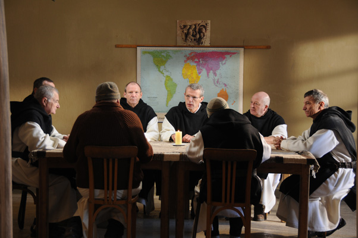

## **Klapbord**

De film **Des hommes en des dieux** van Xavier Beauvois kende zijn wereldpremière in de officiële selectie van het prestigieuze Festival van Cannes en werd er bekroond met de **Grote Prijs van Cannes 2010** en **de Prijs van de Oecumenische jury**. En naast de ruime publieke belangstelling voor deze ingetogen film kwam daar in februari 2011 nog **de Prijs van Beste Europese Film 2010** bovenop, uitgereikt door Signis, de internationale katholieke organisatie voor radio, film en televisie. Afgevaardigden van 26 verschillende Europese landen brachten hun stem uit. Ook ontving de film in Frankrijk **de Prix de l’Education 2010**, uitgereikt door het Ministerie van Onderwijs. Maar ook de filmpers- en kritiek, los van de ideologische voorkeuren, konden de film naar waarde schatten.

## **Synopsis**

De plaats van het gebeuren is **het klooster van Onze-Lieve-Vrouw van de Atlas in Tibhirine (Algerije)** in de jaren negentig van vorige eeuw. Dit klooster van de Franse trappisten van de orde van de cisterciënzers van de strikte observantie (O.C.S.O.) wordt dan geleid door **prior Christian de Chergé**. Onder zijn leiding is er een hechte band gegroeid met de plaatselijke **moslimbevolking**. Dat komt mede door het werk van de monnik-geneesheer **Luc Dochier**. Hij runt in het klooster het enige medische kabinet dat Tibhirine rijk is. Alles verloopt vredig. Dat verandert tijdens de middernachtmis van **Kerstmis 1993**. Dan worden de monniken voor het eerste geviseerd en bedreigd door moslimterroristen (GIA). Van dan af leven de kloosterlingen in spanning over de prangende **vraag of ze moeten blijven of moeten vertrekken**. Ze doorlopen elk afzonderlijk een proces maar beslissen in groep te blijven tot ze door dezelfde terroristen in **de nacht van 27 maart 1996** worden ontvoerd. Ze worden als gijzelaars meegenomen maar worden de volgende meimaand **vermoord** teruggevonden.

## **Cinematografie**

DOCUDRAMA. **Des hommes et des dieux**  is een in memoriam film. Een **gedachtenisfilm**. De regisseur Beauvois neemt de toeschouwers mee naar de dramatische gebeurtenissen waarbij zeven monniken van Tibhirine hun leven verloren. Het scenario is **een reconstructie van de historische gebeurtenissen**, een docudrama. Daarbij kon de regisseur steunen op talrijke bronnen en twee kroongetuigen. De twee monniken, Jean-Pierre Schumacher, de nachtportier en Amédée Noto, een medestichter van het klooster in 1939, die in de nacht van de ontvoering op 27 maart 1996, circa 01u15, niet werden meegenomen, zijn kroongetuigen geworden van het leven en het werk van de monniken in Tibhirine. Tot die groep behoren de zeven trappisten die op 21 mei 1996 omgekomen zijn:  prior Christian de Chergé (59 jaar), de monniken Luc Dochier (82 jaar), Christophe Lebreton (45 jaar), Michel Fleury (52 jaar), Bruno Lemarchand (66 jaar), Célestin Ringeard (62 jaar) en Paul Favre-Miville (57 jaar).

MUZIEK. Beeldend vertolkt de film de authenticiteit van de monniken in Tibherine via talrijke sequenties waarin de muziek centraal staat.  Er zijn **de religieuze gezangen** die de acteurs-monniken zelf vertolken. In chronologische volgorde betreft het de volgende religieuze gezangen: Seigneur, Ouvre mes Lèvres; Puisqu’Il Est Avec Vous; Psaume 142; Dieu, Viens A Mon Aide; Nous Ne savons Pas Ton Msytère; En Toi Seigneur Nos Vies Reposent; Cantique De Siméon; Voici la Nuit; Salve Regina; O Père Des Lumières. Die liturgische gezangen dienen niet alleen om **het geregelde contemplatieve leven** van de monniken te evoceren. Het gaat verder. Het zijn ook **gebeden** die de biddende ziel van de kloostergemeenschap die in bijzondere omstandigheden leeft, doen weerklinken. Voor hen zijn de gezongen en gesproken gebeden, geen rituelen die omwille van zichzelf worden herhaald. Die gebeden in groep vormen de gedachtenis zelf van de groep. De monniken dalen bij het zingen en spreken van de gebeden als het ware af in die diepte zelf van hun gedachtenis, de kern van hun leven, hun roeping: **de gedachtenis aan het mysterie van God, dat ze uitzingen**. Dat blijkt bijvoorbeeld wanneer ze bij het begin van de viering van de middernachtmis van 1993 in de kloosterkapel samen _Voici la nuit_ zingen_._ In een cruciale scène weerklinkt er ook **‘profane’ muziek**. Het betreft de geniale scène waarin de monniken, op initiatief van broeder Luc, hun beslissing te blijven, vieren in de refter. Ze drinken zwijgend een glas rode wijn terwijl ze luisteren naar het moderato van **het Opus 20 van Tsaikovsky, _Het Zwanenmeer_.** De muziek verwijst naar het begin van de tweede act. Het hoofdpersonage prins Siegfried ontdekt het zwanenmeer en de betoverde zwaankoningin  Odette. Het is een poëtische, muzikale dansmetafoor, hier opgenomen in een religieus drama. Het zwanenmeer is een metafoor van het menselijke verdriet. In dat meer zullen de prins en Odette bewust verdrinken omdat ze niet meer kunnen ontsnappen aan de magie van de duivelse tovenaar Von Rothbart en zijn instrument, de zwarte zwaan, behalve…door samen te sterven. Tegelijkertijd weerklinkt in het moderato ook de innerlijke vreugde om de ontmoeting met de witte zwaan; voor de monniken is dat hun diep Christusgeloof die hun motivatie voedt om te blijven.

LANDSCHAP. De film maakt gebruik van **de natuurlijke soundscape van het Marokkaanse berglandschap** waar de film is opgenomen. Het geluid van de natuur is die van de zwijgende of ‘sprekende’ wind. Dat stemt overeen met de levenswijze van de monniken die dicht bij de natuur leven: ze voorzien immers in hun eigen voedsel, ze kweken schapen en telen groenten. Prior Christian mediteert niet alleen in de kapel van het klooster, maar ook midden de grote kathedraal van het  Marokkaanse natuurlandschap. De cruciale scène met pater Christian en pater Christophe die vecht om zijn angst voor een gewelddadige dood te overstijgen, speelt zich af in dat landschap.

## **Betekenisruimte**

EEN EIGENTIJFDE INTERPRETATIE VAN HET MONNIK-ZIJN. De gedachtenis waarin de monniken van Tibhirine onder leiding van prior Christian de Chergé zich bewogen, zo blijkt uit **Des hommes et des dieux**, werd gevoed door de manier waarop zij de eigen waarheid van de christelijke religie wilden gedenken. Geworteld in de eeuwenoude contemplatieve monastieke traditie, peilden ze intellectueel en pastoraal naar de betekenis van een christelijk leven. Ze begrepen dat het rigoureus herhalen van strenge regels niet voldeed om ‘monnik’ te zijn. In feite beleefden ze **het monnik-zijn als een weg om de betekenis van het christen-zijn te exploreren en te beoefenen**. Dat vroeg van hen voortdurend **een wakker bewustzijn**. Ze accepteerden de bijzondere omstandigheden in tijd en ruimte waarin ze zich bevonden en waarvoor ze bewust hadden gekozen.

DIOLOOG MET DE ISLAM. Prior Christian heeft zich verdiept in de Koran, hij kon Arabisch lezen en spreken. Dat wordt in de film ook duidelijk getoond. Voor prior Christian verscheen **de ‘gans andere’ (Levinas) ook met het gelaat van de GIA, het gelaat gewapend met agressie en haat.** Pater Christophe heeft het meest geworsteld met dat gewelddadige gelaat van de ‘gans andere’. Dat blijkt uit zijn dagboeken die ook een belangrijke bron vormden voor zijn personage in **Des hommes et des dieux**.

MARTELAARSCHAP. Een belangrijk gegeven in de film is de overweging over het martelaarschap. Prior Christiaan geeft ieder van zijn medebroeders de tijd om vrij na te denken over de vraag om te blijven of te vertrekken. Daarbij wisten ze dat ‘blijven’ **het risico van het martelaarschap** inhield. Zij hebben in groep gekozen om te blijven maar niet omwille van het martelaarschap. De film laat helemaal trouw aan de geest van de vermoorde monniken zien hoe ze in hun overwegingen en hun besluit vertrekken van **de christelijke kerstgedachtenis**. Die staat helemaal in het teken van de radicale keuze van een geweldloze beleving van de christelijke religie en in se van iedere religie. Die  **hedendaagse postmoderne taal en gedachte** liggen in de lijn van hedendaagse Franse filosofen, met name van Levinas wiens werk prior Christiaan grondig had bestudeerd, alsook van Jacques Derrida. **De pacifistische religieuze beleving** impliceert een deconstructie van de eeuwenoude koppeling van religie en agressie. Religieuze beleving, verkondiging, verdediging steunden bijna vanzelfsprekend op een constructie van geweld, intellectueel en verbaal geweld, militair en bloedig geweld. De monniken van Tibhirine hebben die deconstructie ervan intellectueel, spiritueel en religieus voltrokken.  

## **Context**

De film werpt een bijzonder licht op een gebeuren dat misschien in 1996 als anekdotisch en plaatselijk werd gezien, maar dat vanuit een hedendaags wereldperspectief **profetisch** mag worden genoemd. Dat is het gepaste label voor het levenswerk, bezegeld met hun gewelddadige dood, van de Tibhirine-monniken. De gedachtenis die **Des hommes et des dieux** realiseert, vindt haar **profetische** dimensie met een anker in **de hedendaagse geschiedenis**. In 1996 kon nog niemand vermoeden wat er op **11 september 2001** zich in Manhattan zou voordoen. Toen de Twin Towers neerstortten, vond de geschiedenis even geen adem meer. Al Qaida, het brein achter het terroristische **moslimfundamentalisme**, triomfeerde. Een nieuwe periode van religieus fanatisme en martelaarschap was begonnen. Nochtans vormt de geslaagde aanslag op de twee torens van Manhattan retrospectief gezien het dramatische hoogtepunt van een ontwikkeling die de monniken van Tibhirine vanaf de eerste rij hebben meegemaakt. Zij ervoeren als eerste westerlingen **het proces van radicalisering** dat zich binnen de moslimwereld aan het voltrekken was en dat tevens gepaard ging met een hevige antiwesterse haatcampagne. De ontwikkelingen in Algerije waren representatief voor een brede stroming binnen de moslimlanden. De monniken wilden met hun werk en hun leven getuigen dat wat zou komen **niet de enige en ook niet de juiste oplossing zou zijn voor het mondiaal samenleven van culturen en religies**.

## **Filmfiche**

Frankrijk / 2010 / 122' / **regie**: Xavier Beauvois / **productie**: Pascal Caucheteux, Etienne Comar / **scenario** : Xavier Beauvois, Etienne Comar / **fotografie**: Caroline Champetier / **montage**: Marie-Julie Maille /  **productie designer**: Michel Barthélémy / **vertolking**: Lambert Wilson (Christian), Michael Lonsdale (Luc), Olivier Rabourdin (Christophe), Philippe Laudenbach (Célestin), Jacques Herlin (Amédée), Loïc Pichon  (Jean-Pierre) Michel (Xavier Maly), Farid Larbi (Ali Fayattia).

## **Links**

Sylvain De Bleeckere schreef **een uitgebreid essay over de historische bronnen** van het docudrama, **de eigen verstilde cinematografie** en **de thematische verdieping van de betekeniswereld** die zowel handelt over **de postmoderne interpretatie van het monnikenwezen** als over **het pacifisme en de religies in gespannen relatie tussen het christendom en de islam**. Het essay verscheen als het derde, uitgebreide deel van **Men(S)tis’ Studies # 1**. [Voor meer](../blog/index.html).

� Sylvain De Bleeckere, Men(S)tis, 2011
