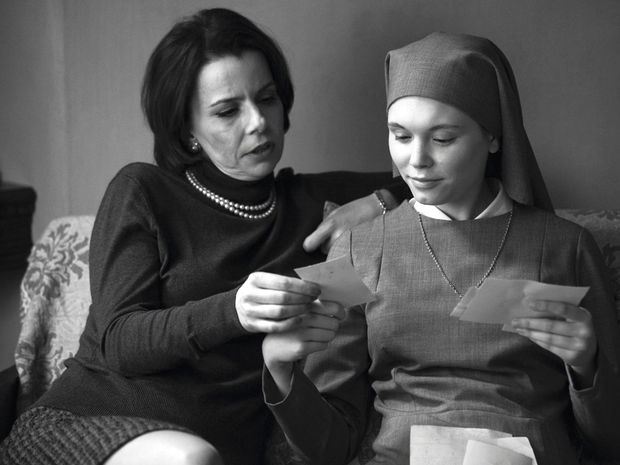

### **Klapbord**

Met **Ida** bevestigt Pawel Pawlikowski zijn unieke plaatst in het landschap van de Europese film. In 2013 won hij ermee de Best Film Award van het London Film Festival en in 2015 mocht hij in Los Angeles de Academy Award (Oscar) for Foreign Language Film in ontvangst nemen. In 2014 kreeg hij al de LUX Film Prize van het Europese Parlement uitgereikt in het Europees Parlement te Straasburg. In **Ida**, waarvoor hij zelf samen met de Britse toneelauteur Rebecca Lenkiewicz het scenario schreef, verwerkt Pawlikowski zijn eigen Poolse en katholieke achtergrond. Hij werd in 1957 geboren in de Poolse hoofdstad Warschau, maar als tiener emigreerde hij samen met zijn moeder naar het vrije Europa, eerst in Engeland, dan in West-Duitsland en uiteindelijk definitief in Engeland. Ze verlieten het Polen van de Koude Oorlog, de toenmalige satellietstaat van de communistische Sovjet-Unie. Toch kreeg hij in dat communistische Polen een katholieke opvoeding. Hij beschouwt zichzelf nog steeds als een katholiek gelovige. In zijn late tienerjaren vernam hij dat zijn grootmoeder langs vaderszijde Joods was en in Auschwitz wad omgekomen. Deze elementen uit zijn biografie vormen de grondstof voor zijn persoonlijk verhaal dat **Ida** heet. Met de film keert Pawlikowski letterlijk terug naar het Polen van zijn kindertijd in het jaar 1962.

### **Synopsis**

### **Cinematografie**

DOCUDRAMA. 

MUZIEK. 

LANDSCHAP. De film maakt gebruik van **de natuurlijke soundscape van het Marokkaanse berglandschap** waar de film is opgenomen. Het geluid van de natuur is die van de zwijgende of ‘sprekende’ wind. Dat stemt overeen met de levenswijze van de monniken die dicht bij de natuur leven: ze voorzien immers in hun eigen voedsel, ze kweken schapen en telen groenten. Prior Christian mediteert niet alleen in de kapel van het klooster, maar ook midden de grote kathedraal van het  Marokkaanse natuurlandschap. De cruciale scène met pater Christian en pater Christophe die vecht om zijn angst voor een gewelddadige dood te overstijgen, speelt zich af in dat landschap.

### **Betekenisruimte**

EEN EIGENTIJFDE INTERPRETATIE VAN HET MONNIK-ZIJN. 

DIOLOOG MET DE ISLAM. 

MARTELAARSCHAP.   

### **Context**

### **Filmfiche**

### **Links**

� Sylvain De Bleeckere, Men(S)tis, 2011
