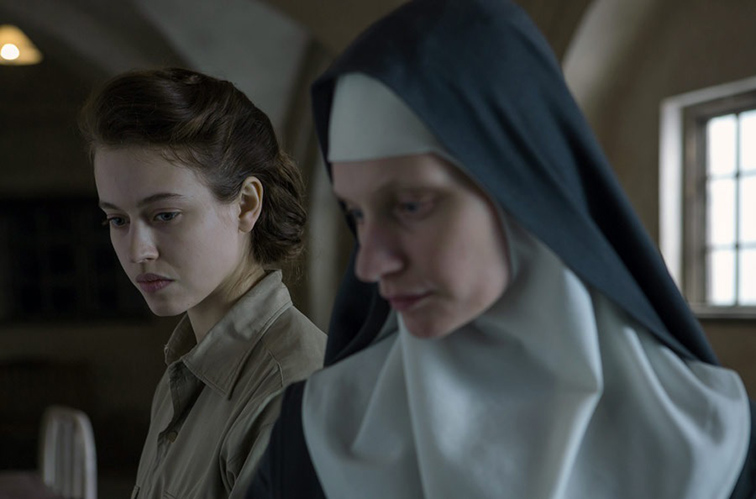

### **Klapbord**

De Frans-Luxemburgse actrice **Anne Fontaine** debuteerde als cineaste in 1993 met Les histoires d’amour finissent mal…en général. Geleidelijk heeft ze zich geprofileerd als een van de vrouwelijke, Europese cineasten die bewust **cinematografische vrouwenportretten** op het witte doek brengen. Dat was het geval met haar internationaal gewaardeerde _Coco avant Chanel_ (2009). Met **Les Innocentes** bevestigt ze dit engagement. Daarbij kiest ze bewust voor onbekende vrouwen, kloosterzusters die slachtoffer werden in een historisch drama. De film zou oorspronkelijk **Agnus Dei** heten. Uiteindelijk werd voor **Les Innocentes** gekozen. De film brengt een vergeten gebeurtenis uit de naoorlogse Poolse geschiedenis aan het licht. De opnames vonden plaats in de Poolse, noordelijke regio Warmia in de winter van januari-februari 2015. Voor de opnames werd een gedesaffecteerd klooster terug tot leven gewekt. In begin 2016 ging de film in première tijdens het Amerikaanse _Sundance Film Festival_. Poolse actrices vertolken de rol van de kloosterzusters. Eén van hen is de bekende Agata Kulesza in de rol van moeder overste. In de Poolse film **Ida** nam ze de rol van de tante Wanda voor haar rekening. De film Les Innocentes is een Frans-Poolse coproductie. 

### **Synopsis**

Twee jonge vrouwen leven in totaal verschillende werelden, maar een historisch drama doet hun wegen kruisen. Dat gebeurt in **Polen in de winter van 1945-1946**. Polen is dan bevrijd door het Sovjetleger. De Tweede Wereldoorlog is in Europa al op 8 mei 1945 beëindigd. Het Sovjetleger bezet Polen. De ene jonge vrouw heet **Mathilde Beaulieu**. Ze is een Franse dokter met van huis uit communistische sympathieën. De andere is de Benedictijnse **zuster Maria**, verantwoordelijk voor de novicen. De twee jonge vrouwen komen in contact met elkaar door toedoen van de novice Teresa. Die overtreedt de kloosterregels door op zoek te gaan naar hulp bij **de medische post van het Franse Rode Kruis** nabij Warschau. Ze zoekt een dokter die noch Russisch noch Pools is. Teresa vindt Mathilde aan wie ze in gebrekkig Frans medische bijstand vraagt voor een van haar medezusters die stervende is. Eerst verwijst Mathilde de non door naar het Poolse Rode Kruis. Wanneer ze echter Teresa ziet volharden terwijl ze biddend op haar blijft wachten, volgt Mathilde de jonge non naar **de abij**. Daar ontmoeten Mathilde en Maria elkaar voor het eerst. Mathilde ontdekt dat een van de zusters, **de novice Zofia**, in levensgevaar verkeert wegens een moeilijke, nakende geboorte van haar baby. Mathilde, geholpen door zuster Maria, voert met succes een keizersnede uit. Uiteindelijk ontdekt Mathilde **de dramatische waarheid van de abdij**. De voorbij trekkende Sovjettroepen hebben gedurende enkele dagen in de abdij de zusters tot driemaal toe verkracht. Collectief en individueel moeten de zusters met dat onvoorstelbare trauma hun kloosterleven verder zetten. Maria vertelt Mathilde dat zeven zusters zwanger zijn geraakt. Nadien blijkt dat er ook zusters hun zwangerschap hebben weten te verbergen voor zichzelf en de anderen. Door toedoen van zuster Maria, raakt Mathilde geleidelijk vertrouwd met de gang van zaken in de abdij, een wereld die haar als communiste volkomen vreemd is. Ze ziet hoe zuster Maria moet optornen tegen haar overste, **de abdis Jadwiga Oledzka**. Die doet er alles aan om haar zusters tegen de schande en de schaamte ten aanzien van de buitenwereld te beschermen. Zelf heeft moeder overste syfilis opgelopen tijdens de verkrachtingen. Ze weigert zich te laten behandelen door Mathilde. In een eerste fase aanvaarden de zusters met tegenzin de hulp van Mathilde, maar in een tweede fase leren ze haar waarderen en nemen ze haar in hun gemeenschap op alsof ze een medezuster is. **Zuster Maria en dokter Mathilde** wisselen ook gedachten uit over wat er gebeurt en over hoe de zusters het drama trachten te verwerken. Wanneer dokter Mathilde op zekere avond onderweg is van de abdij naar de Franse medische missie, haar werkplek, houden Sovjetsoldaten haar tegen. Ze willen haar verkrachten, wat slechts op het nippertje door hun militaire overste wordt verhinderd. Ze rijdt dan terug naar de abdij, waar ze veilig overnacht. In de medische missie waar ze werkt als assistente van haar Joodse collega en mentor, **dokter Samuel Lehmann**, botst dokter Mathilde steeds meer op kritiek over haar vreemd gedrag. Ze kan echter niet vrijuit spreken. Toch ontstaat er tussen haar en Samuel een goede band en zelfs een beginnende liefdesrelatie, de antipode van de agressieve omgang met seksualiteit door de Sovjets. Op zeker moment vraagt Mathilde Samuel om mee te komen helpen bij de gelijke bevalling van twee zusters. Als Jood heeft Samuel geen hoge pet op van Polen wegens de betrokkenheid, passief of actief, van vele Polen bij de Holocaust. En hij weet dat de katholieke Kerk, ook de Poolse, een antisemitisch verleden heeft. Toch helpt hij mee bij de bevalling van de zusters. Ondertussen spannen zuster Maria en dokter Mathilde samen om zonder weten van de abdis één van de pasgeboren baby's bij zuster Zofia onder te brengen. Ze kan de baby voeden. Ze beschouwt de zuigeling als haar eigen kind dat ze door toedoen van de abdis  heeft moeten afstaan voor adoptie. Ze noemt de baby **Helena**. Toch ontdekt de abdus het bestaan van Helena en neemt ze het kind weg van zuster Zofia. Die ziet hoe de abdis de baby in een mand wegdraagt. Zofia volgt haar moeder overste in paniek in het omliggende bos, maar verliest haar spoor. Overvallen door verdriet en radeloosheid, pleegt zuster Zofia **zelfmoord**. De dokters Mathilde en Samuel zijn er getuige van. Kort daarna, ontdekt zuster Maria dat haar overste in plaats van de kinderen naar Poolse adoptieouders te brengen, hen heeft laten sterven. Na de ontdekking daarvan verlaten **zuster Maria en zuster Anna** met de twee nieuwe baby’s naar het Rode Kruis om bescherming te vragen. Mathilde weet de zusters te overtuigen om terug te keren naar de abdij om er **een weeshuis** in onder te brengen voor de verschillende weeskinderen die een voorlopig onderkomen hebben gevonden in het tijdelijke, medische kamp van het Franse Rode Kruis. Op die manier kunnen ze ook de kinderen van de zusters zonder schaamte als weeskinderen in de abdij blijven verzorgen. De zieke abdis trekt zich, overrompeld door een intens schuldgevoel, terug in haar cel. Zuster Anna verlaat de abdij. Bij de komst van de eerste lentedagen, poseren de zusters fier met hun weeskinderen op de feestelijke dag waarop de novicen hun kloostergeloften afleggen. Zuster Maria zendt **de groepsfoto** naar Mathilde om haar in naam van iedereen in de abdij te bedanken voor haar zorgend werk waardoor zij allen en hun abdij een nieuwe toekomst hebben.

### **Cinematografie**

**REGIE VAN HET LICHT**. Cinematografisch gezien, is **Les Innocentes** van grote klasse. Dat komt door het werk van de cinematografe van dienst, **Caroline Champetier**. Zij geniet een groot prestige in de Franse cinema. Ze werkt immers al twee generaties lang nauw samen met een aantal eerste klasse regisseurs: Jean-Luc Godard (_Hélas pour moi_), Alain Cuny _(L’annonce faite à Marie_), Jacques Rivette (_La bande des quatres_), Xavier Beauvois (_Des Hommes et des Dieux_), Leos Carax (_Holy Motors_), Margarethe von Trotta (_Hannah Arendt_). Door de jaren en de films heen heeft Caroline Champetier zich ontpopt tot een grootmeester van het cinematografische lichtbeeld. In een interview met Claude Lefort en Didier Péron met haar, verduidelijkt Caroline Champetier haar werk in het domein van de cinematografie [Libération, 4 februari 2014](http://www.next.liberation.fr/cinema). Ze vertelt hoe ze zich vooral ‘een vertolkster van het beeld’ voelt (‘Je me sens très interprète de l’image’), zoals een muzikant die een parituur interpreteert en zichzelf ieder dag telkens opnieuw uitvindt op het ritme van de voortdurend veranderende realiteit tijdens de opnames. Het weer dat wisselt, de acteurs die in goede of slechte stemming verkeren, allerlei kleine technische conflicten die een oplossing vragen, enzovoort. Ze noemt de filmset een strijdplaats waar de vrede moet worden behouden via technisch, artistieke en menselijk overleg. Zij ziet de taak van de verantwoordelijke cinematograaf zoals zij als degenen die die vrede voortdurend bevordert en in stand houdt in een nauwe samenwerking tussen de regisseur en de cinematograaf. Die samenwerking op de filmset noemt ‘een utopische democratie’ (‘C’est pour ça que le cinéma est une utopie démocratique’). In haar meer recent werk, zoals voor Des Hommes et des Dieux en Les Innocentes, combineert ze wat ze noemt de twee grote stijlen om met het licht om te gaan in de filmkunst. Er is de Duitse school die vooral aandacht schenkt aan de ruimte, de omgeving, het decor en het spel van de lichtcontrasten, terwijl de Amerikaanse school zich meer op de acteurs. In de samenwerking met de regisseur gaat het voor de cinematograaf steeds om de juiste verhouding te vinden tussen de ruimtewerking en het fotogenieke. In Les Innocentes blijkt die verhouding uit een sterk doordacht afwisselend ritme tussen de landschapsbeelden en de fotogenieke close-ups met de vertolkers. Bij de eerste betreft dit vooral de sublieme beelden van de buitenomgeving van de abdij met het naburige bos. Het openingsbeeld met zuster Teresa die op zoek gaat naar medische hulp voor haar medezuster Zofia, zet hierbij de visuele toon van de film. Andere sterke ruimtebeelden komen voor in de tocht van moeder overste met baby Helena naar het kruisbeeld aan de rand van het bos, waarbij Zofia haar volgt maar zich verloren voelt in het bos daar waar twee wegen elkaar kruisen. Een derde belangrijke ruimtebeeld situeert zich in de naburige hoeve waar de tante van Zofia woont. Zuster Maria gaat haar opzoeken om haar het overlijden van Zofia te melden. Daar ontdekt zuster Maria dat moeder overste baby Helena nooit daar heeft naar toe gebracht. Die verschillende ruimtebeelden baden in een winterlicht dat door de sneeuw wordt geabsorbeerd. Daarbij ontstaat er een ingetogen picturaal beeld met de contrasten tussen wit en zwart dat ook de kleur van de habijten van de zusters kenmerkt. De lichtende interpretatie die Caroline Champetier eraan geeft, drukt de grondstemming van het verhaal passend uit. Daarbij beklemtoont ze niet zozeer het contrast tussen zwart en wit, maar de simultane aanwezigheid van de twee. Daarin wordt het drama dat zich afspeelt, heel zichtbaar. Het dramatische van het fysieke en mentale van de zusters, het donkere en zwarte dat nu aan hun kleding een bijzondere betekenis geeft, gaat samen met de zuivere onschuld, het witte deel in hun kleding, vooral van de jonge novicen die een volledig witte kap dragen. Het winterlandschap lijkt alsof het een verlengde van het kloosterleven is geworden met dezelfde samenhang tussen de diepste donkerte en een hemelse helderheid. In de talrijke opnames in het abdijgebouw ligt de nadruk op de personages, de zusters en Mathilde. Hierbij werkt Caroline Champetier met het picturale licht in de lijn van de Nederlandse schilders Vermeer en Rembrandt. Daaruit spreekt een grote feminiene lichtpoëzie die erin slaagt zonder woorden de innerlijke gemoedsgesteldheid passend uit te drukken. De woorden voeren niet de regie over de scènes. Het zijn veeleer de stilte en de schouwende blik die de gevoelens evoceren van de zusters, in het bijzonder van zuster Maria die het dichtste bij het drama staat en dokter Mathilde die direct met de gevolgen van het drama oog in oog komt te staan. Via de komst van zuster Teresa in de medische zorgzaal in de medische post van het Rode Kruis ontstaat er ook cinematografisch een band tussen de abdij en de medische post. De medische post ligt in het bos net zoals de abdij zich aan de andere kant van het bos bevindt. En via de medische witte kleding ontstaat er een gelijkaardig wit licht als in de kleding van de zusters, in het bijzonder bij de novices die een volledig witte kap dragen. Dat lichte licht wenkt Mathilde wanneer ze vanuit een ruim in de medische post tijdens een korte pauze zuster Teresa ziet bidden met haar knieën in de sneeuw tussen de bomen. Dan beslist Mathilde dat lichtspoor te volgen en zo ontstaat er een verbindingslijn tussen de ene en de andere kant van het winterse bos, tussen de medische post en de abdij. Daarnaast een aantal taferelen voor die in een andere lichttoonaard zijn opgenomen. Dat geldt voor de intieme sequenties met Mathilde en Samuel en het eenmalige tafereel met Mathilde en de Russische soldaten langs de weg in het bos. Bij dit laatste overheerst in het donker en vuil groen-militair licht, de kleur van de hel. In de intieme scènes met Mathilde en Samuel herinnert een gedempt groen-militair en bakstenen-rood licht aan de hel van de Oorlog die nu wel voorbij is, maar waarvan de gevolgen nog overal zichtbaar zijn. Alleen de gezichten van de twee collega’s en geliefden, twee mensen van goede wil, lichten op in het grauwe donker. Die intieme scènes situeren zich in de ontspanningszaal van het medische team en in de logeerkamer van Mathilde in Poolse woning. Het gedempte groen-roodachtige licht in de ontspanningszaal evoceert een mix van romantiek en melancholie, terwijl het gedempte licht in de slaapkamer van Mathilde via het binnenvallend schemerlicht en de witheid van de lakens en nachtkleding, weer aansluit bij de lichtsfeer van de abdij. In dat positieve licht schijnt de kleine zon van de sympathie en liefde tussen Mathilde en Samuel. Ze waarderen en steunen elkaars medisch werk. Allebei zetten ze zich in voor een andere wereld, één waar tijd en ruimte is voor liefde en genegenheid. Dat drukken ze uit in het bewustzijn dat ze elkaar respecteren en van elkaar houden, maar ze wellicht na het beëindiging van hun medische missie elkaar nooit meer zullen zien. Bovendien dragen ze in hun gemoed ook hun eigen persoonlijk oorlogsverdriet mee. Mathilde moet haar geheim over de vrouwenabdij bewaren, Samuel is de enig overlevende van zijn Joodse familie. De unieke eigen lichtsfeer die Les Innocentes typeert, bestaat uit het afwisselend ritme van buitenbeelden en binnenbeelden met vooral de abdij als focuspunt, in de regie van wat we in het derde deel van Levensbeschouwing democratisch belicht de Lichtaard noemen.

DOCUDRAMA. ‘Geïnspireerd door ware gebeurtenissen’. Zo introduceert de film zichzelf bij het publiek. Het scenario van de film is geschreven door vier auteurs onder wie de cineaste zelf, Anne Fontaine. Het uitgangspunt van hun scenario waren de nota’s van de Franse dokter, Madeleine Pauliac (1912-1946). Over die nota’s en zijn tante, heeft haar neef, Philippe Maynial, onderzoek verricht. Hij heeft op basis hiervan het idee voor de film aangebracht. Voor de historische gegevens over zijn tante die hierna volgen, is hij de aangewezen bron. Arthur Herlin publiceerde op 20 februari 2016 een interview met hem op de site Aleteia, het wereldwijde katholieke netwerk (www.aleteia.org). Zo leren we dat zijn tante Madeleine, een gespecialiseerde hospitaaldokter in Parijs, tijdens de bezetting van Frankrijk door de troepen van Hitler actief het verzet steunde. Ze liet zelfs bij haar ook Joodse slachtoffers onderduiken. Op vraag van generaal De Gaulle zelf, leidde ze reeds vanaf april 1945 als medische luitenant van het Franse leger de heropbouw van het hospitaal van Warschau en het Franse Rode Kruis in Polen, waarbij ze ook een tijd in bevrijd Rusland heeft gewerkt. Haar taak bestond in de organisatie van de medische hulp bij de repatriëring van de talrijke Franse overlevenden in de circa 200 Poolse concentratie- en vernietigingskampen die ze zelf ook heeft bezocht. Tijdens een van de autoritten naar de kampen, liep ze een zwaar hoofdletsel op, wat haar niet belette haar medische werk in Warschau voort te zetten. Daar stierf ze tijdens een auto-ongeval op weg naar het hospitaal. Philippe Maynial heeft de rechten van het historisch verhaal over zijn tante verkocht aan de makers van de film Les Innocentes. Zij hebben de historische gegevens uiteraard vrij aangepast met behoud van de geest zelf en de basislijn van het geschreven getuigenis van de Franse dokter. Van haar neef Maynial weten we dat Madeleine Pauliac op haar tocht door bevrijd Oost-Europa in Polen zelf vergezeld en geholpen werd door de Franse priester Belliard. Hij was zelf een bevrijde krijgsgevangene in Polen. Na zijn bevrijding, heeft hij het werk van Madeleine Pauliac onbaatzuchtig en vol toewijding ondersteund, zoals blijkt uit de nota’s van Madeleine Pauliac zelf. Het scenario heeft de historische priester vervangen door het fictieve personage van de jonge Joodse dokter Samuel Lehman, wiens familie is omgekomen in het nazikamp Bergen-Belsen. In de film wordt Madeleine zelf vervangen door het fictieve personage van Mathilde Beaulieu. Zij is een medische studente die haar stage doet in de Franse medische missiepost in het pas bevrijde Polen. Zij werkt onder de leiding van de Joodse dokter Samuel. In de film blijkt dat Mathilde communiste en tevens atheïste is. De historische Madeleine was katholiek. Het filmische motief om het personage van de dokter aan te passen betreft het scenario. Daarin ligt de focus niet op een reconstructie van de gebeurtenissen in de eerste weken en maanden na de bevrijding van de Russische bezette gebieden en Polen. In die zin heeft de film geen historische pretenties; de film biedt geen biopic over de historische Madeleine Pauliac. De focus ervan richt zich helemaal op het contrast tussen de medische nazorg van de Oorlog en de getraumatiseerde abdijgemeenschap, alsook op de vrouwelijke solidariteit die uit dat contrast voortkomt. De film werkt met de verwondering van de ongelovige jonge vrouwelijke dokter die uit eigen vrije wil en vanuit een medisch plichtsgevoel de zustergemeenschap bijstaat. Bovendien laat de rol van de Joodse dokter Samuel ook toe om, in het korte bestek van het verhaal dat zich in Polen situeert, verantwoord naar de Holocaust te verwijzen zonder dit op zich uit te werken. Enkele overlevende kinderen van de kampen komen voor als figuranten. Wat de filmische tijd betreft, concentreert Mathilde zich niet zozeer op de slachtoffers van de nazikampen, maar op de Poolse slachtoffers van de Russische bevrijders. In dat filmisch gegeven steekt ook een historische verwijzing naar de historische Madeleine. Als dokter heeft ze zelf de gevolgen gezien van het immorele schanddaden, begaan door de Sovjettroepen op hun weg naar Hitler in Berlijn. Ondertussen heeft historisch onderzoek de omvang van dit taboe uit de bevrijdingsgeschiedenis van de Tweede Wereldoorlog in kaart gebracht. Selm Wenselaers vat in zijn bijdrage De Sovjetschande de cijfers van het opzienbarende onderzoek Befreier und Befreite (1992) als volgt samen: ‘De oprukkende Sovjettroepen in 1944 waren genadeloos voor de Duitse bevolking. De ‘Ivans’ werden gevreesd omdat ze zich plunderend en verkrachtend een weg naar Berlijn baanden. Vooral de vrouwen betaalden het gelag. Het maakte niet uit of ze jong of oud waren, nazi of Joods, of ze pas bevrijd waren uit een concentratiekamp of uit hun schuilplaats kwamen na jaren ondergedoken te hebben geleefd. Tussen de herfst van 1944 en de zomer van 1946 werden alleen al in Duitsland zo’n 2 miljoen vrouwen door Sovjetsoldaten verkracht. Naar schatting 240 000 vrouwen lieten hierbij het leven, omdat ze vermoord werden of omdat ze zichzelf om het leven beroofde, beschaamd voor wat hen was aangedaan.’ (De Oorlogskranten 1940-1945, nr. 48). De film Les Innocentes herinnert niet alleen aan dit dramatische gegeven uit de oorlogsgeschiedenis. De film versterkt nog de draagwijdte ervan door te herinneren aan de Poolse vrouwen, met name dan nog de Poolse kloosterzusters die ook slachtoffer zijn geworden van de Sovjetsoldaten. Dat blijkt uit de nota’s van de historische Madeleine Pauliac zelf. Trouwens in de film komt een tafereel voor waarin haar filmpersonage Mathilde zelf ook slachtoffer dreigt te worden van die soldaten. Dat tafereel samen met het tafereel waarin Mathilde in de abdij de zusters behoedt voor de terugkerende Sovjetmannen, verdicht ook een historische gebeurtenis. Onderweg met de Franse Rode Kruis in het bevrijde deel van de Sovjet-Unie, werd Madeleine Pauliac en haar hele team gevangen genomen door het Sovjetleger. Ze werden opgesloten en bedreigd te worden terechtgesteld. Een moedige tussenkomst van Madeleine bij de hogere overste heeft haar en haar team het leven gered. Ze vertelde de Sovjetofficier dat een familielid van haar deel uitmaakte van het vermaarde escadrille Normandie-Niemen dat tegen de Duitsers vocht in opdracht van generaal De Gaulle aan het Oostfront. Deze leugen om bestwil wist de officier te overtuigen om het team van het Franse Rode Kruis vrij te laten. Ook in de film Les Innocentes weet Mathilde de Sovjetsoldaten om de tuin te leiden met een leugen om bestwil. Ten slotte, de hulp die Mathilde in de film verleent aan de Poolse zusters, weerspiegelt ook het werk van de historische Madeleine. Ze maakte in haar werk geen onderscheid tussen de slachtoffers op basis van nationaliteit, wat werd bevestigd door de priester Belliard die in haar voetsporen stapte om geestelijke hulp aan de slachtoffers te bieden.   

KLANKWERELD. De film opent met een zwart beeld waarop de productiedata verschijnen. Bij het zwart beeld staat op de klankband het geluid van de klok die de zusters oproept tot het koorgebed, gevolgd door de klank van de voetstappen van de zusters in de kloostergang. Dan zien we hen in rugzijde door de kloostergang uit het beeld verdwijnen, waarna de titel Les Innocentes tegen de wand van de kloostergang verschijnt. Deze intro zet meteen de toon voor de klankwereld. Die bestaat in de eerste plaats uit de natuurlijke geluiden, verbonden met de wereld van de abdij: de klok, de voetstappen die sterk weergalmen in de contemplatieve ruimte van de stilte. Diezelfde stilte typeert ook het bos in de sneeuw waar zuster Teresa haar weg vervolgt. We horen haar kordate voetstappen in de sneeuw. Die contemplatieve stilte die de natuurlijke klanken in zich opneemt, maakt dat de menselijke stem geen hoofdrol krijgt. De dialogen zijn uiterst beperkt wat de zusters onderling betreft, en gedeeltelijk ook wat de die tussen Mathilde en zuster Maria betreft. Alleen buiten de abdijmuren, namelijk in de medische missiepost, komen er enkele gesprekken voor tussen Mathilde en Samuel. Die hebben een intiem en daardoor ook een contemplatief karakter. Binnen de abdijmuren krijgt de menselijke stem via de stilte toch een bijzonder klankkleur. Daar zijn de religieuze, Gregoriaanse gezangen. Vooral in het openingstafereel zingen de zuster de Gregoriaanse getijdengebed Conditor Alme Siderum. Die wordt volledig in beeld gezongen. Het betreft een hymne uit de 7de eeuw die veelal in de Adventstijd tijdens de vespers wordt gezongen. Het is een smeekgebed tot ‘de Schepper van de sterren van de nacht, van het altijd durend licht van Zijn volk’ en tot Jezus, de Verlosser’. Ze smeken om verlossing en om gehoord te worden. In de smeekbede die daarop volgt, vragen de gelovigen, in casu de zusters, om een remedie (‘remedium’) die verlossing kan brengen aan een wereld in ruïne. In een volgende strofe introduceert de religieuze hymne de beeldspraak van de Bruidegom en de Bruid uit het Hooglied. Die beeldspraak is van groot belang voor de zusters. In hun spirituele beleving zijn zij de maagdelijke bruiden en is de hemelse Jezus de Verlosser hun Bruidegom. Op het einde vragen ze bescherming zolang ze hier ‘beneden’ in de tijd verblijven, waarna ze afsluiten met lof aan de Heilige Drie-eenheid. De openingshymne doet filmisch drie dingen. Ze bevestigt het dagelijkse ritueel van het getijdengebed met psalmen en hymnen, wat het monastieke leven, zeker van de Benedictinessen, typeert. Tegelijkertijd drukt het in een religieuze taal de dramatische situatie uit waarin de zusters zich bevinden. Het smeekgebed verwijst metaforisch naar hun ‘wereld in ruïne’ en naar hun verlangen naar een verlossing, wat in deze context wel erg bijzonder klinkt. In de tekst komt ook het medisch klinkend woord van een remedie voor. Ten derde is er het dramatische effect waarmee het verhaal opstart. De novice zuster Teresa heeft de hymne aandachtig meegezongen en geabsorbeerd, vooral wanneer ze door het gezang van de zusters heen de wanklank hoort van de pijnschreeuw van haar medezuster novice, Zofia. Die schreeuw zet haar na het gebed in beweging richting de Franse medische missie. Met die beslissing, tevens een overtreding van de geldende kloosterregels, opent de dramatische wending in het filmverhaal. Die schreeuw van in weeën verkerende Zofia vormt de hoofdklank van de film. In het tafereel met Conditor Alme Siderum integreert de klankmontage de schreeuw van de jonge moeder-zuster in het religieuze gezang, een wonderlijk en betekenisrijke compositie. Later volgt nog de hartverscheurende schreeuw in het bos van de wanhopige Zofia die op zoek is naar ‘haar’ baby Helena. En in de verkrachtingsscène met Mathilde weerklinkt ook haar schreeuw waarin de schreeuw van de verkrachte zusters nazindert in de verbeelding van de aandachtige toeschouwer. In het tafereel van de dubbele geboorte waarbij Mathilde hulp krijgt van Samuel, komt er nog een sterke verwevenheid van het religieuze, Gregoriaanse gebed van de zusters en de kreet van de twee moeders in weeën. Ze onderbreken hun weeën driemaal op het ritme van het Angelus dat ze ’s middags gewoon zijn te bidden. Een tweede Gregoriaans gezang dat een zowel religieuze als dramatische betekenis krijgt, is . Die wordt gezongen bij de dageraad, de Lauden. Ze zingen Regem Venturum Dominum. Het is een Kerstlied want het spreekt over de komst van de ‘koning der koningen’ op aarde, als kind ‘onder ons’ geboren (‘nascetur nobis parvulus’). In hun morgengebed smeken de zusters de komst af van ‘de Koning der Koningen’, ‘onze Beschermer’. Ze aanbidden hem en vragen om weldra te komen in ‘een groot licht’ (‘lux magna’). Op de tonen van dit betekenisvol gezang laat zuster Maria heeft dokter Mathilde binnen in de abdij, zonder medeweten van moeder overste om Zofia en haar baby medisch te kunnen opvolgen. Mathilde stelt dan vast dat de baby is verdwenen. Na het fragment met de consultative van de zwangere zusters, waarin blijkt dat ze collectief weigeren zich te laten onderzoeken door dokter Mathilde, doet zuster Maria Mathilde uitgeleide. Bij de scène waarin dokter Mathilde de abdij verlaat, weerklinkt in voice-over het Vox Clamantis in Deserto. Het korte gezang is ontleend aan de Bijbeltekst van Marcus1, 1-3 en Johannes 1, 22-23. Het spreekt over Johannes de Doper, de profeet die zich voelt als een roepende in de woestijn. Dergelijk gevoel overvalt zowel zuster Maria als dokter Mathilde. Hun woestijn is de abdij met zijn zwangere, getraumatiseerde zusters. Een ander belangrijk Gregoriaans gezang is het meer gekende Rorate Caeli. Dat komt voor op het ogenblik dat dokter Mathilde ontwaakt in de abdij nadat ze op het nippertje ontsnapt was aan een verkrachting. In de abdij wordt ze gewekt door het gezang van de zusters. Ze wandelt naar de kapel en luistert naar het Rorate Caeli. Dat kerkgelijke gezang is een Gregoriaanse introïtus, een inleiding op de misviering van de laatste, de vierde zondag van de Advent, dus de laatste zondagsmis voor het eigenlijke feest van Kerstmis. De tekst zelf ik gebaseerd op de Bijbeltekst van Jesaja 45,8. In het refrein weerklinkt de bede aan de Schepper om als regen uit de hemel gerechtigheid te laten neerdalen over de aarde. In een apart beeld zien Mathilde die aandachtig luistert en het gebed ook in zich opneemt. Dat is begrijpelijk want voor één nacht is ze ook kloosterzuster geweest nadat ze door de Sovjetsoldaten onderweg was overvallen en een groot verdriet haar overviel nadat zuster Maria haar een veilig onderkomen had gegeven. De compositie van beeld- en klankband bij dit belangrijke gezang ligt in de lijn van de vorige, maar bereikt hier een hoogtepunt. De religieuze a capella muziek mengt zich met de dreigende geluiden buiten beeld van de inkomende Sovjetsoldaten, geluiden die de zusters maar al te goed herkennen. Opmerkelijk is dat ze blijven doorzingen. Eerst zingen in aanwezigheid van Mathilde voor het eerst het refrein en de tweede strofe. Daarin zingen ze: ‘We hebben gezondigd en zijn onrein geworden waardoor we lijken op vallende bladeren want door onze zonden worden we met de wind meegenomen. Ge hebt U voor ons verborgen en ons neergeworpen wegens de zwaarte van onze zonden.’ Dan zingen de zusters de laatste strofe. Maar dat gebeurt cinematografisch opmerkelijk. De camera richt zich naar zuster Maria en een medezuster die de laatste strofe zingen. Het betreft de strofe waar God zelf antwoordt op de bede van de gelovigen. Het is het goddelijke antwoord van de troost (‘consolamini, consolamini, popule meus’): ‘Troost u, troost u, mijn volk. Weldra komt uw heil. Waarom verliest u zich in uw verdriet daar het uw smart nog verzwaart. Vrees niet, ik zal u redden, want ik ben de Heer, uw God, de Heilige van Israël, uw Verlosser.’ Uitgerekend bij deze strofe zoomt de camera steeds meer in op het gelaat van de zingende Maria terwijl het dreigende geluid van de invallende Sovjetsoldaten luider begint te klinken om uiteindelijk het religieuze gezang te overstemmen. De troost en redding waarover de zusters zingen, komst op dat ogenblik van Mathilde die de soldaten met een medische leugen om best wil uit de buurt van de zusters kan houden. Na dat dreigend tafereel die bij alle zusters dramatische herinneringen wakker roept, volgt het belangrijke gesprek tussen zuster Maria en Mathilde. De zuster weent en bekent dat ze bidt en bidt, maar geen troost vindt, die troost waarover ze even daarvoor had gezongen. Ze bekent dat ze iedere dag de verschrikking terug beleeft. ‘Ze hadden ons moeten vermoorden. Het is een wonder dat ze dat niet hebben gedaan.’ In het daarop volgende beeldkader met de close-up met zuster Maria en Mathilde vertelt Maria dat zij nog enigszins geluk heeft gehad omdat ze voor ze in de abdij is gekomen, had ze omgang gehad met een man, maar de meeste zusters waren nog maagd. Mathilde vraagt dan of niemand van hen het geloof heeft verloren. Dan vertelt zuster Maria over het geloof. ‘Eerst is het als een kind dat zich veilig voelt aan de hand van zijn vader. Dan komt er altijd een moment dat je vader je hand loslaat. Je voelt je verloren, alleen in het donker. Je roept om hulp maar niemand antwoordt. Hoe goed je jezelf ook voorbereidt, je wordt toch verrast. Het raakt je recht in je hart.’ Op dat ogenblik gaat ze naar het raam toe met het invallende, zachte licht. Terwijl in beeld dat licht op haar gelaat valt, spreekt ze verder over het geloof: ‘Dat is het kruis dat we dragen. Achter de vreugde is er het kruis.’ Mathilde luistert aandachtig en neemt de woorden in zich op. Het is het einde van haar verblijf in de abdij, bezegeld door de warme begroeting van alle zusters die haar blij uitwuiven. Een ander Gregoriaans gezang heet Nunc, Sancte, nobis Spiritus. Het komt voor in de episode die begint met de klank van de kloosterbel. Dat is de tweede keer in de film. Deze keer hoort de bel samen met een panoramisch shot van de abdij met de beltoren. De zusters komen weer samen voor het getijdengebed. Ze zingen Nunc, Sancte, nobis Spiritus. We zien de zwangere zusters in close-up. Dan gaat de Gregoriaanse muziek over in rustige, meditatieve filmmuziek Les tâches quotidiennes. Strijkinstrumenten met een contrapuntische piano begeleiden het dagelijkse leven van de zusters, het ora et labora. De gebruikelijke rust schijnt te zijn teruggekeerd tot de muziek stopt en een van de zwangere zusters haar water breekt. Een ander belangrijk muzikaal fragment is gelinkt aan het personage van zuster en novice Zofia, de eerste zuster die is bevallen. Na de onverwachte bevalling van de al wat oudere zuster Ludwika die haar baby niet aanvaard, beslissen zuster Maria en Mathilde zonder medeweten van de abdis de baby aan Zofia te geven. Die zorgt ervoor alsof het haar eigen baby is. Ze noemt de baby Helena. Op het ogenblik dat de abdis echter het bestaan van Helena ontdekt, eist ze de baby op. Zuster Zofia ziet de abdis met ‘haar’ baby in een mand de abdij verlaten. Ze volgt de abdis in het bos maar raakt haar spoor bijster. Verloren staat ze op een kruispunt in het bos. Ze weent. Ze kijkt smekend naar de hemel. De klank van haar wenen gaat over in het mystieke gezang van Hildegard von Bingen, O Vis Aeternitatis, terwijl het beeld nu de abdis volgt die baby Helena wegdraagt en bij het maken van een kruisteken voor dood achterlaat bij het kruisbeeld aan de rand van het bos. De extatisch, religieuze muziek van Hildegard von Bingen werkt contrapuntisch. Ook zij was een abdis. Het beeld van haar, aanwezig in haar mystieke muziek, contrasteert met het beeld van de Poolse abdis Jadwiga Oledzka. Hildergard van Bingen bezingt het religieuze wonder van de geboorte, ‘de Incarnatie’. Ze looft inderdaad ‘de grote goedheid van de Redder die alle dingen heeft bevrijd door zijn goddelijke Incarnatie, onaangetast door enige zonde’. Dat credo in de goddelijke goedheid contrasteert met het beeld van de moord op baby Helena door de Poolse abdis die meent te moeten handelen uit plichtbesef. Ze drijft hiermee niet alleen de baby de dood in, maar ook haar novice Zofia. De moord zelf, het achterlaten in de mand aan de voet van het kruisbeeld, gebeurt in stilte. Alleen de handelingen van de zuster en de baby zijn versterkt hoorbaar. Bij de sequenties van het afscheid van de zusters van de opgebaarde Zofia weerklinkt in voice-over een fragment uit het Veni Creator Spiritus. Het is een smeekbede om de vervulling van de eigen geest en gemoed met de genade van de Heilige Geest. Vreemd genoeg, monteert de regisseur bij deze rouwscènes geen requiem, bijvoorbeeld geen Dies Irae. Het requiem is echter wel aanwezig, niet in klank maar in de beelden van een donker licht. Voor de eerste keer is het schroomvolle, heilige licht dat de abdij en de zusters omhult, afwezig. De religieuze muziek van het Veni Creator Spiritus impliceert ook dat de zusters de zelfmoord van Zofia niet beschouwen als een doodzonde. Ze begeleiden haar met een gebed dat spreekt van een geloof in een genadevolle kracht van de Schepper die hemel en aarde omvat. Bij het beeld van het afscheid van zuster Maria van de opgebaarde Zofia, gaat het Veni Creator Spiritu over in de filmmuziek La Ferme. Het stuk voor piano en cello klinkt als een instrumentaal requiem. Dat blijkt weerklinken tijdens de scènes met zuster Maria die naar de hoeve van de tante van zuster Zofia stapt om daar tot haar groot verdriet te ontdekken dat haar abdis de baby’s van de zusters heeft gedood. De rouwmuziek vertolkt het intense verdriet van de zusters en in het bijzonder dat van zuster Maria over hun overleden pasgeborenen. De muziek verbindt de scènes van de overleden zuster Zofia met die van het besef van de overleden baby’s, een besef dat zuster Zofia als eerste had gekregen. Behalve de Gregoriaanse gezangen, is er ook instrumentale scenische muziek in de abdij. Tijdens een ontspanningsmoment waarbij ook Mathilde aanwezig is, speelt zuster Irena piano. Ze vertolkt Suite No. 2 in F Major, HWV 427- I. Adagio van Georg Friedrich Händel. Dit blij moment van ontspanning vindt zijn tegenhanger in de medische post van het Franse Rode Kruis waar er dansmuziek wordt gespeeld. Aan dat muzikaal ontspanningsmoment komt een abrupt einde door de onvoorziene geboorte van de baby bij zuster Ludwika. Naast de scenische muziek, is er de filmmuziek. Het stuk Les tâches quotidiennes werd al genoemd. In het belangrijke deel naar het einde toe van de film, het deel dat begint met de verhuisscène van het medische kamp met het afscheid van Mathilde en Samuel en eindigt met de dageraad bij het ontwaken van de zusters Maria en Anna in het medische kamp, weerklinkt Petite messe solennelle- XI. Preludio religioso van Gioachino Rossini in een pianoversie en zonder gezang. Hiermee duidt de cineaste het deel waarin door het samenspel tussen dokter Mathilde en zuster Maria een definitieve oplossing komt voor de zusters en hun baby’s, als een religieus gebeuren. Door de mis louter instrumentaal en solo voor piano te citeren, vermijdt Anne Fontaine iedere vorm van heroïsme wat dokter Mathilde betreft of religieus triomfalisme wat zuster Maria betreft. Tot slot, is er de compositie On The Nature Of Daylight van Max Richter. De Britse componist schreef de compositie in 2003 als zijn pacifistische antwoord op de invasie van Irak door de Amerikaanse troepen. Het stuk verwerkt de aanwezigheid van geweld en oorlog. In die geest past het muzikaal citaat zeker in Les Innocentes. Maar de film interpreteert de muziek beeldend en vult ze in die zin ook aan. De muziek begeleidt namelijk de slotbeelden. Die omvatten de komst van de lente en de feestdag waarop de novicen hun kloostergeloften afleggen. Hun familieleden zijn er bij. Tijdens het feest wordt er een groepsfoto gemaakt van de zusters met hun kinderen en weeskinderen. Zuster Maria heeft de foto verzonden met een brief aan dokter Mathilde om haar te bedanken in naam van iedereen. Ze noemt Mathilde voor de abdij een godsgeschenk. Dokter Mathilde is aan het werk in een kliniek terwijl ze in voice-over de brief van zuster Maria hoort voorlezen en ze de groepsfoto bekijkt. De camera zoomt in op haar in haar witte schort tegen een witte achtergrond. Ze lijkt wel een engel. Dit close-up beeld van haar vloeit over naar het moment waarop de fotograaf in de abdij de groepsfoto neemt. Hij gebruikt daarvoor een primitieve vorm van flits. Een kleine explosie van vuur verlicht de groep en maakt de foto. Hiermee gaat het beeld over naar een zwarte achtergrond voor de eindgeneriek. De muziek van Richter die in de titel naar het wonder van het daglicht verwijst, begeleidt ook nog de eindgeneriek. 

### **Betekenisruimte**

TRAGIEK EN ZINGEVING ALS ZORG.  Les Innocentes brengt een vergeten drama terug aan de oppervlakte en brengt daarbij postuum hulde aan zeer moedige vrouwen. In de meest dramatische omstandigheden wisten ze hun menselijke waardigheid te bewaren in de zorg voor anderen. Die zorg krijgt in de film twee concrete vrouwengezichten: die van dokter Mathilde en die van zuster Maria. Op het eerste gezicht zijn die twee antipoden. Ze leven namelijk in een totaal andere wereld. Die van de moderne geneeskunde wat dokter Mathilde betreft en die van de eeuwenoude katholieke kloostertraditie van contemplatieve zusters, in casu de Benedictinessen, wat zuster Maria betreft. Bovendien werkt en denkt dokter Mathilde vanuit een communistische achtergrond die radicaal tegenover het katholieke credo van de zusters staat. Hun onderlinge tegenstelling is slechts het vertrekpunt van het filmverhaal met zijn historische verankering. In de ontwikkeling ervan blijkt hoe beide jonge vrouwen, ieder vanuit hun verschillende achtergrond, eigenlijk ontdekken dat ze eigenlijk zielsverwanten zijn. Ze staan, zo blijkt, allebei zorgend midden in de menselijke tragedie die zich voor hun ogen afspeelt. Geen van beiden weigeren ze de dramatische gebeurtenissen en de gevolgen ervan te verdringen. Ze vinden hun motivatie in hun sterke wil om de werkelijkheid onder ogen te zien. Vanaf de eerste medische tussenkomst van dokter Mathilde, de keizersnede bij zuster Zofia, assisteert zuster Maria dokter Mathilde. Verderop in de film treedt zuster Maria zelfs op als vroedvrouw bij de bevalling van zuster Anna. Aan de andere kant van het spectrum beweegt dokter Mathilde in de richting van de religieuze wereld van de kloosterzusters door toedoen van zuster Maria. In eerste instantie stelt dokter Mathilde zich zuiver medisch op. Geconfronteerd met een noodgeval, treedt ze zeer professioneel op. Ze voelt zich daarna ook medisch verantwoordelijk voor zuster Zofia en haar baby, haar patiënten die ze medisch wil opvolgen. Via de hulp van zuster Maria krijgt ze daartoe ook blijvende toegang tot de abdij. Zuster Maria weet van de abdis de toestemming te krijgen voor dokter Mathilde om de andere zwangere zussen medisch op te volgen. Maar in een eerste moment weigeren de zusters zelf. Zuster Maria en dokter Mathilde voelen zich allebei ‘als roependen in de woestijn’ (Vox Clamantis in Deserto). Een belangrijk keerpunt vormt het moment dat zuster Maria dokter Mathilde opvangt na haar aanranding door de Sovjetsoldaten. Hierdoor overnacht ze in de abdij en ontwaakt ze op de tonen van het Rorate Caeli. Door die ervaring ziet dokter Mathilde voor het eerst de zusters niet als patiënten, maar als religieuze vrouwen. Hun wijze van staan in het leven en hun vaste wil om, niettegenstaande het trauma dat ze in zich meedragen, trouw te blijven aan hun religieuze levenskeuze, imponeert dokter Mathilde. In feite herkent ze daarin haar eigen sterke wil om trouw haar medisch beroep uit te oefenen in de zorg voor wie in nood verkeert. Nadat dokter Mathilde de zusters redt van de invallende Sovjetroepen die de abdij ervan verdenken ‘vijanden van het volk’ te verbergen, nemen alle zusters dokter Mathilde op in hun gemeenschap. Ze beschouwen hen nu als een van hen. Hierna hebben zij en zuster Maria een intens gesprek. Dokter Mathilde luistert naar het verdriet van zuster Maria die terug overrompeld is door de komst van de Sovjetsoldaten. Als verantwoordelijke voor de jonge novicen, handelt ze vanuit een moederlijke zorg tegenover hen, terwijl ze zelf ook slachtoffer is. Ze deelt haar eigen verdriet met dokter Mathilde. De jonge dokter neemt met eerbied en grote aandacht het getuigenis van zuster Maria in zich op. De jonge zuster vertelt over haar groot verdriet en over hoe ze haar geloof  beleeft in die bijzondere omstandigheden (‘Het geloof is vierentwintig uren twijfel en één minuut hoop.’). Beiden groeien mentaal steeds meer naar elkaar toe. Op zeker ogenblik geeft zuster Maria het kleed waarmee ze als burgervrouw naar de abdij is gekomen, aan dokter Mathilde die het aantrekt. Het zijn echte zussen geworden. Wat hen echt verbindt, is hun zorgende wil om ‘het leven te dienen’. Dat zien ze in elkaar en daarin steunen ze ook elkaar. Dat culmineert bij zuster Maria in de weerstand tegen het moordend gedrag van haar abdis aan wie ze gehoorzaamheid is verschuldigd, en bij dokter Mathilde in haar engagement voor de abdijzusters waardoor ze ingaat tegen haar militaire overste die haar huisarrest oplegt. Beiden komen ze tot een echte oplossing voor de abdij die een deel van de taken van de medische missie van het Franse Rode Kruis overneemt, met name de zorg voor de weeskinderen. In de onderlinge feminiene solidariteit waarin zorg, humaniteit en zingeving elkaar versterken, verschijnt de relativiteit van de Ideologieën. Die zijn aanwezig in de verwijzing naar het communisme dat dokter Mathilde van huis uit meekreeg, maar ook via de aanwezigheid van de Sovjetsoldaten die zich na de bevrijding van Polen focussen op het opsporen van ‘vijanden van het volk’. De Ideologie verschijnt ook in het kleed van de religie, belichaamt door de abdis. Ze handelt vanuit de absolute trouw aan het monastieke systeem ten koste van alles, ook van het leven van de ongewenste kinderen. Zuster Maria ontmaskert de wreedheid van dergelijke verharding van een religieuze beleving tot een ideologisch systeem dat zich volledig afkeert van het leven in zichzelf, de anderen en de wereld rondom hen. Wat een middel is, wordt een doel op zich. In de lijn van het portret van zuster Maria introduceert de cineaste in een van de cinematografische hoogtepunten van de film het contrast tussen de historische abdis Hildegard von Bingen via haar O Vis Aeternitatis op de klankband en het personage van abdis Jadwiga Oledzka op de beeldband. Ook religieuze tradities bezitten geen immuniteit tegenover de ideologische verharding. Daarin wenden ze zich af van het wonder van het leven zelf, het wonder van de Schepping. Ze gebruiken het als een instrument voor eigen machtsuitoefening. Dergelijke verworden religies voeren rituelen zonder ziel op, rituelen zonder contact met de werkelijkheid. Dat blijkt zeer scherp uit de dialoog tussen moeder overste en zuster Anna. Het is zuster Anna die op het einde samen met zuster Maria beslist om de laatst geborenen, onder andere haar eigen kind, te redden uit de handen van de abdis, door ze naar de missie van het Rode Kruis te brengen waar dokter Mathilde en dokter Samuel werken. Zuster Anna beslist ook op het einde om uit de abdij te treden op zoek naar haar ‘verloofde’ die ze niet kent. Het is een Sovjetsoldaat zonder naam. Hij heeft zuster Anna beschermd tegenover zijn medesoldaten, die zelfs met hen daarover heeft gevochten en die er ook voor heeft gezorgd dat zijn medesoldaten de zusters niet hebben vermoord, wat ze vanuit ideologische overwegingen wel geneigd waren te doen. In haar gesprek met de abdis, zegt zuster Anna dat ze haar geloof niet meer kan verzoenen met wat er is gebeurd. Ze ziet zichzelf nog steeds als een bruid van God, maar begrijpt niet waarom Hij dan heeft gewild wat er is gebeurd. Zij: ‘Het is gebeurd. Dus wilde Hij het.’ De abdis: ‘We kunnen niet weten wat Gods wil is.’ Zuster Anna: ‘De enige waarheid is zijn Liefde en dit leven dat ongewild in mij groeit en zich weldra openbaart, wat wil Hij dat ik daarmee doe?’ Haar existentiële en religieuze vragen  blijven onbeantwoord. Het enige wat de abdis doet, is zeggen: ‘Laat ons bidden. We zullen bidden. Dat is onze enige troost.’ Deze Ideologische respons maakt het gebed als bron van troost tot een leeg ritueel. Het kijkt weg van de opdracht om wat er in en met het leven gebeurt, onder ogen te zien en zin te geven. De abdis houdt zich krampachtig vast aan de opgelegde regels en haar eigen autocratische machtspositie (‘Ik ben je overste. Gehoorzaam mij!’). Zo veroordeelt ze zichzelf om ziende blind te zijn voor dramatische gevolgen van haar gedrag tegenover de pasgeborenen en haar eigen medezusters, de onschuldigen. Aan de andere zijde van de Ideologie staat het partijcommunisme van het Sovjetleger. Dat ontleent aan zijn eigen gelijk een vrijgeleide om te verkrachten en te vermoorden. Dit heet nu de historische Sovjetschande waarnaar de film duidelijk verwijst. Dokter Mathilde vertelt aan haar collega en vriend Samuel dat ze geen partijlid is maar van huis uit communistisch is opgevoed. Haar ouders hebben hun leven geriskeerd in het verzet tegen de Duitse bezetter. In Polen ervaart ze dat een Ideologie, ook de communistische, ethisch blind wordt wanneer ze handelt vanuit een intellectuele, politieke en militaire machtsdrang. Zuster Maria en dokter Mathilde overstijgen samen die Ideologieën die het leven niet alleen in de weg staan, maar ook nog vernederen en vernietigen. Ze vinden elkaar in de wil om de tragiek in zich op te nemen en zo het leven te dienen en verzorgen. Dokter Mathilde vindt haar motivatie in haar wil om ‘levens te redden’ en zuster Maria luistert naar de nood van de haar toevertrouwde jonge zusters en hun baby’s. Zo blijkt hoe de humane wil tot zingeving in al zijn modaliteiten van zorg voor de menswording verankert zit in de zorg voor die ene werkelijkheid van het leven, zijn inherente tragiek inbegrepen. De film Les Innocentes is een belangrijke oefening in levensbeschouwing.

MAGNIFICAT IN Em.   De cineaste Anne Fontaine die zelf mee het scenario heeft geschreven, heeft ervoor gekozen om twee belangrijke zusterpersonages Maria en Anna te noemen. Dat is zeker geen toeval. Beide voornamen zijn in de christelijke traditie erg belangrijk: Maria is de naam van de moeder van Jezus en Anna is de naam van de moeder van Maria. Ook de cineaste draagt die naam als voornaam. In Les Innocentes weerklinkt zowel visueel als auditief een echo naar het Magnificat, de evangelische ode aan het moederschap van de anonieme vrouw. In het Magnificat krijgt dat moederschap een hoogst religieuze betekenis. Het evangelisch Magnificat is in die zin in de eerste plaats een uiting van zingeving aan het moederschap en in het beeld van de eenvoudige Maria aan alle moeders. Concreet steekt die verwijzing naar dat evangelische Magnificat in de Gregoriaanse gezangen die door de zusters worden gezongen of door de cineast worden geciteerd. Zo goed als allemaal komen ze uit de jaarkrans van de Advent, de vier wekentijd waarin de gelovigen het feest van Kerstmis voorbereiden in bezinning en gebed. In Les Innocentes wordt er niet direct verwezen naar Kerstmis ofschoon het verhaal begint in de decembermaand. De nadruk ligt duidelijk op de Adventstijd, wat zich weerspiegelt in de zwangerschappen van de verkrachte zusters. Het hele gebeuren staat in het teken van de te verwachte geboorten. Dat sluit ook aan bij de aandacht in de evangelische kindheidsverhalen over de zwangerschap van Maria. Bovendien blijkt uit de verhalen en het exegetische onderzoek ernaar dat de zwangerschap van Maria in de ogen van de mensen ongewenst was. Eén van de historische mogelijkheden is zelfs dat de jonge, Palestijnse Maria wellicht werd verkracht door Romeinse soldaten. De link met de film Les Innocentes wordt dan wel erg groot. Hoe dan ook, de Gregoriaanse gezangen herinneren zeer expliciet aan het christelijke credo van de Incarnatie en dus van het religieuze mysterie van de Menswording. De cineaste beklemtoont dit nog eens zeer uitdrukkelijk via de klankverwijzing naar het mystieke lied van Hildegard von Bingen. De hele film is een Magnificat, maar cinematografisch geschreven in Em, de toonaard van het verdriet. In het interview met Christie Huysmans, getuigt Anne Fontaine dat de christelijke iconen van de Madonna met Kind voor haar een belangrijke inspiratiebron zijn geweest. Ook de iconen van de Madonna met King kunnen gezien worden als een visueel Magnificat in Em. Voorts slaagt de cineaste er esthetisch in om de oude Gregoriaanse gezangen zo in het filmverhaal te integreren dat de toeschouwer voor het eerst het Gregoriaans als de blues van de christelijke middeleeuwen kan ervaren. De film opent hiermee via de beslissing van de novice Teresa bij het zingend bidden van Conditor Alme Siderum waarin de schreeuw van de hoogzwangere Zofia weerklinkt. De cineaste laat de Gregoriaanse gezangen ook overgaan in de eigen en ontleende filmmuziek. Het sterkst gebeurt dat in de wake bij het opgebaarde lichaam van zuster Zofia. Het Veni Creator Spiritus vloeit over in de filmmuziek La Ferme dat als een hedendaags muzikaal requiem klinkt. Het vertolkt het grote verdriet dat zuster Maria na de wake bij de overleden Zofia en na de ontdekking van de moord op de pasgeborenen. Dat laatste gegeven herinnert aan de kindermoord door koning Herodos de Grote in Mattheus 2, 16-18 over de kindertijd van Jesus. Aan die bron is het kerkelijk feest dat bekend staat als het feest van de Onnozele of Onschuldige Kinderen. Bij uitbreiding verwijst het naar alle kleine kinderen die ooit zijn vermoord door allerlei machthebbers, een praktijk die nog niet uit de mensenwereld is gebannen. De titel van de film, Les Innocentes, zinspeelt ook op die traditie waarin de figuur van Maria en haar pasgeboren kind een hoofdrol spelen. Het Magnificat in Em spreekt niet alleen uit de klankwereld van de film. Het ‘weerklinkt’ nog meer door de eigen, unieke cinematografie van Caroline Champetier. Het ingetogen winterlicht bedekt niet alleen het landschap rondom de abdij en het omliggende bos met een kleed van zuiverheid. Het beeld ontstaat niet alleen van een zuiverheid op zich, maar van een verwerkt hemels verdriet. De sneeuw is wit bevroren regen die uit de hemel komt. In een religieuze beschouwing staat regen voor de hemel die weent. De sneeuw werkt in die zin als een hemelse troost op de aarde met haar wreedheid door de mens aangericht. Het sneeuwtapijt dat het hemelse licht absorbeert op aarde, herinnert de mens aan de onschuld. Het bekleedt de met bloed doordrenkte aarde met een kleed van onschuld. In dat landschap weerklinken de voetstappen van zuster Teresa en zuster Zofia als noten op de notenbalk van de menselijke geschiedenis. Dat hemels, troostende licht woont in de abdij en begeleidt ook dokter Mathilde. De zorg van haar en van zuster Maria vormt het sneeuwlicht dat verlossing en troost brengt in een oord dat geroepen is om een teken van onschuld te zijn in de mensenwereld. Het filmcitaat van On the Nature of the Daylight bewaart muzikaal het ingetogen verdriet én troost van het sneeuwlicht en begeleidt de eindsequenties van de lente die een nieuwe toekomst voor de abdij, de zusters en hun weeskinderen. Het teken van onschuld dat de abdij nastreeft te zijn, was geschonden en is nu hersteld. De komst van dokter Mathilde maakt daar deel van uit. Uit haar engelachtige, witte verschijning op het einde vloeit de groepsfoto van de zusters met ‘hun’ kinderen voort. Dat einde van de film is niet louter fictief. De overgeleverde nota’s van Madeleine Pauliac zijn strik medisch en zakelijk, aldus Anne Fontaine in het interview met Christie Huysmans. Ze stipt daarin aan dat uit die nota’s niets kan worden afgeleid over de relatie tussen de historische dokter Madeleine en de zusters die ze heeft behandeld. Wel, zo verklaart de cineaste verder, zijn er in Polen nog gelijkaardige gevallen aan het licht gekomen. Het positieve einde van de film is geïnspireerd door wat er in een ander klooster is gebeurd.

### **Context**

 De film Les Innocentes kende zijn release in bewogen jaar 2016, het jaar van de onverwachte Brexit en de nog meer onverwachte verkiezing van de Amerikaanse president Donald Trump. Deze laatste won het presidentschap van Hilary Clinton. Ze zou de eerste vrouwelijke president zijn geworden. Wat haar van de democratische overwinning heeft gehaald is de algemene opkomst van nationalistische reflexen. Zo in Engeland, zo ook in het America First van president Trump. De film van Anne Fontaine biedt een ingetogen maar betekenisvol antwoord op deze nationalistische opwelling in de democratische wereld, ook in Europa. Met haar film brengt Anne Fontaine de noodzakelijke herinnering aan de Tweede Wereldoorlog in beeld. Die oorlog vormde het failliet van de Europese nationalismen en het begin van de ideologische Koude Oorlog die vandaag opnieuw onder het Rusland van Poetin de kop op steek. De film is een Europese film, het resultaat van zowel de financiële als artistieke samenwerking tussen Frankrijk en Polen, twee landen met een katholieke achtergrond en elk uit een deel uit het tot voor kort ideologisch verdeelde Europa. Door dergelijke culturele producties die nationalistische en ideologische grenzen overstijgen, kan het verenigde Europa een echte toekomst tegemoet gaan. Ongewild verscheen deze Frans-Poolse film in de periode dat het Verenigde Europa de Pool Donald Tusk als president heeft. Naast de Europese context, heeft de film ook een kerk-katholieke context. Het brengt de vergeten groep van kloosterzusters en hun stillen, zorgende bijdrage tot de christelijke, Europese cultuur naar de oppervlakte en uit de zone van de vergetelheid. Uit het eerder genoemde interview van Christie Huysmans met de cineaste weten we dat de Franciscaanse aartsbisschop José Rodriguez Carballo, werkzaam in de Romeinse Curie, Les Innocentes na de visie van de film in het Vaticaan ‘un film thérapeutique pour l’Eglise’ heeft genoemd. Waarin die therapie dan bestaat, blijft open. In het licht van de film zelf, blijkt de inspirerende draagwijdte van een feminiene benadering van de eeuwenoude katholieke en bij uitbreiding christelijke tradities. In het oude Europa van de landen zijn die tradities dominant mannelijk en landelijk geweest. Het klerikalisme dat de man religieus boven de vrouw stelt, geldt nog steeds. Les Innocentes laat vanuit een feminiene herinterpretatie van de die eeuwenoude tradities zien welke waardevolle betekenis het religieuze en in het bijzonder het christelijke credo heeft in het licht van de tragiek in de menselijke geschiedenis die blijkt duren. 

### **Links**

Voor de achtergrond over de draagwijdte van de Ideologie en het fenomeen van de Lichtaard, zie delen 2 en 3 van Levensbeschouwing democratisch belicht. Klik hier voor het vermelde interview van Christie Huysmans met de cineaste Anne Fontaine. [Klik hier voor het vermelde interview van Christie Huysmans met de cineaste Anne Fontaine.](http://www.cinefemme.be/spip.php?article64).

© Sylvain De Bleeckere, Men(S)tis, 2017
