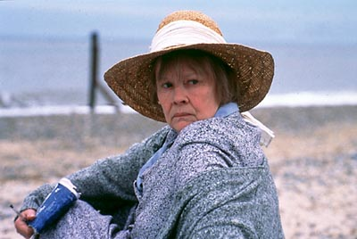

## **Klapbord**

John Bailey schreef twee autobiografische boeken over zijn leven met Iris Murdoch: _Iris. A Memoir_ en _Elegy for Iris_. In het eerste boek getuigt Bailey over zijn 42 huwelijksjaren met Iris en de eerste jaren van haar ziekte. In het tweede boek beschrijft hij Iris' laatste levensjaar en haar overlijden in 1999. Richard Eyre en Charles Wood schreven het scenario van de film **Iris** naar de twee boeken van Bailey. Tijdens de opnames was Bailey een onmisbare raadsman. De Britse acteur Jim Broadbent kroop in de huid van het personage van de oudere Bailey. Zijn uitzonderlijke vertolking leverde hem de Oscar op voor de beste, mannelijke bijrol. De jonge Iris kreeg het gezicht van Kate Winslet, terwijl de vooraanstaande Judi Dench de oudere Iris op het witte doek terug tot leven bracht.

## **Synopsis**

Oxford, de Britse universiteitsstad. Engeland geneest van zijn open oorlogswonde. Het is immers al 1952. Een nieuwe generatie intellectuelen meldt zich. Onder hen bevinden zich twee bijzondere jongvolwassenen. John Bayley is een verlegen, maar bekwame literatuurprofessor; zij heet Iris Murdoch, een intelligente, dynamische studente die vanuit een eigen verworven vrijheid twee passies koestert: die van de liefde en die van de taal. Wanneer ze haar eerste teksten toespeelt aan John, ontstaat er een levenslange relatie, ze huwen, vormen een hecht team tot de ziekte van Alzheimer Iris' geest aantast. Dame Iris Murdoch is dan al uitgegroeid tot een gewaardeerde Britse filosofe en tot de grootste Engelse schrijfster van de tweede helft van de 20ste eeuw. Ze leefde van 1919 tot 1999.

## **Cinematografie**

BIOPIC.De waarde van **Iris** steekt niet in het genre van de biopic. De film schrijft geen biografie. Alleen de tijd waarin Iris en John elkaar leren kennen én de jaren van de fatale doorbraak van Iris'ziekte, komen in beeld. Maar ook in die twee belangrijke segmenten van de gemeenschappelijke biografie van Iris en John, primeert geenszins de wil om te documenteren. Niettegenstaande de grote zorg voor de authenticiteit van de in scène gezette taferelen, transcendeert de film de registratie van feiten. Terecht, want Dame Iris Murdoch vertolkte in haar leven, haar visie en romans _de wondere wereld van de menselijke geest_. In de eerste grote scène met de oudere Iris - ze geeft een lezing in het Sommerville College te Oxford - spreekt ze over de waarde van de opvoeding ('_education_'). Die opvoeding, zo beklemtoont ze, overtuigt ons van de enige, belangrijke vrijheid die er is, die van de geest (_'the mind'_). De cinematografische verdienste van de film bestaat erin de biopic terug te voeren naar de bron zelf van de biografie: het spirituele of 'mentale leven' van, in dit geval, Dame Iris Murdoch. Op deze wijze schildert **Iris** geen kroniek van Iris' verschillende werken, maar zoomt hij in op haar eigen, grote geest, die ze zelf beschouwde als de bron van al haar werken, die bron die door de ziekte van Alzheimer in het duister werd gehuld.

SPIEGELMONTAGE. De structurele kracht van **Iris** ligt in de voortdurende spiegeling van de jeugd en de ouderdom van de huwelijksliefde van Iris en John. De geboorte van hun hechte liefde en de destructie ervan door ziekte en dood spiegelen zich in elkaar als alfa en omega. Reeds in de eerste minuten van de schildering van de ontluikende levenslust bij het verliefde koppel, is via de spiegelmontage de schaduw van het verlies al aanwezig. Dat gebeurt niet in een levenspessimistisch gebaar. Door spiegeling van '_leven en dood in liefde_' licht er op het filmdoek een portret op dat een eerbetoon is aan _het wonder van de huwelijksliefde_. Het huwelijk van Iris en John was kinderloos, maar juist daardoor evoceert **Iris** hoe de vruchtbaarheid van zo'n liefde niet zozeer ligt in de biologische productiviteit, maar allereerst in _de spirituele rijkdom_ van het innig en intens samenleven, ook dan wanneer de dood in de ogen verschijnt.

HUISMETAFOOR. Een dramatisch aspect van de cinematografie verschijnt in het beeld van _het huis_. De ingrijpende dramatiek van de ziekte van Alzheimer komt niet zozeer in woorden aan het licht; dat gebeurt veeleer in de sprakeloze neergang van de huiselijkheid in de woning van Iris en John. Iris bestuurde het huis, zij leidde John en hij volgde haar. Hij wist zich van het begin af geborgen in de wijze waarop zij orde schiep in hun leven, in hun huis. Wanneer de ziekte van Alzheimer het licht van haar geest doofde, trad geruisloos de chaos het huis binnen. De tragiek, hier zuiver beeldend van aard, is schrijnend en laat de toeschouwer aanvoelen voor welke wanhoop en onmacht John komt te staan wanneer hij ervaart hoe de ziekte Iris zich ongewild en onhoudbaar van hem verwijdert.

## **Betekenisruimte**

MIND. Na de diagnosesequenties, zegt Iris: '_I feel as if I'm sailing into darkness_.' De film evoceert het sterven van Iris niet in een scéne met een ziekenhuisbed en een medisch apparaat dat de intrede van de dood signaleert. In plaats daarvan staat een sequentie met de demente Iris die in een gang op haar eigen manier naar het steeds helder wordende licht toe danst. De film evoceert de eigen aardse ruimte van het menselijke bestaan, waarvan de muren gebouwd zijn met zowel duisternis als licht; die muren bevinden zich in _de geest van ieder mens_. De film schildert Iris Murdoch als een grote dame die zich ophoudt in de kamer van de menselijke geest, die zich daar installeert in het licht van de liefde en de taal; daardoor verandert het menszijn in _een bijzonder en uniek zinnebeeld_. De film volgt in het biografische spoor van Iris _de aardse ruimte van een intense zinbeleving_. Het personage van Iris verschijnt daarbij eerder als de betrouwbare gids dan als een object om te beschouwen. De geestelijke ruimte waarin de film zijn eigen waarheid vindt, krijgt zijn juiste benaming in de woorden die Iris spreekt tijdens een lezing, kort voor de intrede van de ziekte: '_We need to believe in something divine without the need for God, something we might call Love or Goodness._' Voortgestuwd door het getuigenis van John Bailey, worden de filmbeelden een plaats waar twee concrete, sterfelijke mensen elkaar omarmen in _de goddelijke ruimte van hun bestaan_, tragisch begrensd door ziekte en ouderdom.

WATER. Een krachtig, poëtisch element van de eigen cinematografie is dat van het water. In dat element verdichten zich de twee zinscheppende krachten van de liefde en de taal. Het levensbeeld ervan bestrijkt zowel de rivier waarin beide geliefden zwemmen, als de grote zee die hun thuisland als een eiland definiëert. Het element van de zee vormt in het oeuvre van Dame Iris Murdoch een voorname, zinbeeldige wereld. Een van haar romans heet trouwens: _The Sea, The Sea_. In Eyre's **Iris**, in zekere zin ook de film van Dame Iris Murdoch zelf, vindt dit literair gegeven zijn eigen cinmatografische waarheid.

## **Context**

Zowel in zijn oorsprong als in zijn uitwerking documenteert **Iris** een belangrijk moment uit het intellectuele milieu van het naoorlogse Engeland. De film sluit aan bij een specifieke traditie van de naoorlogse Britse cinema die teruggaat op Sir Richard Attenboroughs. In diens film **Shadowlands** brengt hij een belangrijk hoofdstuk uit het leven van _C.S.Lewis_ (1898-1963) op het scherm. Deze film vormt een referentiepunt voor de film **Iris**. Beide werken huldigen twee grote persoonlijkheden van de Engelse, naoorlogse intellectuele traditie met aandacht voor literatuur en filosofisch onderbouwde spiritualiteit. Beide films herinneren beide invloedrijke figuren als concrete mensen. De grote humaniteit waarvan hun werken getuigen, staat niet los van hun biografie. Beide films leggen dan ook op die nauwe relatie tussen leven en werk de volle nadruk.Beschouwd vanuit de historische situatie zelf, evoceert **Shadowlands** het perspectief van de man en van de generatie die in haar jeugd de Eerste Wereldoorlog en in haar volwassenheid de Tweede Wereldoorlog heeft meegemaakt. De periode die**Shadowlands** behandelt, situeert zich in de jaren vijftig. In dat decennium brak de emancipatie van de vrouw door in de gesloten mannelijke, academische wereld in Engeland. **Iris** schetst via het portret van de jonge Iris Murdoch hoe zich in de jaren vijftig de jonge generatie van vrouwelijke studenten manifesteert. De persoonlijkheid van Iris Murdoch kleurt het beeld van die ontwikkeling op een zeer levendige en waardevolle wijze in. Evenals **Shadowlands** ent **Iris** het gegeven van de existentiële zingeving op het genre van de biografie. Beide films vermijden een louter narratieve en chronologische vertelling. Ze laten zien wat het betekent voor de denkende mens - de intellectueel - vanaf de tweede helft van de twintigste eeuw zonder dogma's en illusies de waarde van het bestaan te ervaren en te doorleven, ook dan wanneer zich in dat bestaan tekorkomingen en fatale sterfelijkheid melden. In beide films vormen de biografie, het bewustzijn van de tragiek en de zingeving een hecht en intens samenspelend trio.

## **Links**

[Iris Murdoch Archive.](http://fass.kingston.ac.uk/research/iris-murdoch/)

© Sylvain De Bleeckere, Men(S)tis, 2011/2017
