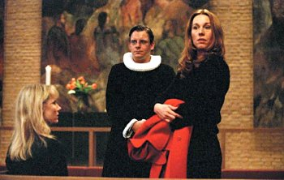

## **Klapbord**

Op 8 december 2000 kende de film **Italiensk for Begyndere - Italiaans voor beginners** zijn wereldpremière in Denemarken, het land waar hij werd geproduceerd en gedraaid. Oorspronkelijk alleen maar bedoeld voor de Deense markt, vond de film echter internationale weerklank en waardering toen hij tijdens het Festival van Berlijn, begin 2001, met de Zilveren Beer werd bekroond. Daarna ontving de film nog enkele prijzen onder andere die voor het beste scenario op het kleinere, 2001 Robert Festival. Zelfs Miramax Films besloot om deze eigenzinnige film ook vanaf januari 2002 uit te brengen in de USA. In België kreeg de film in januari 2002 zijn première. Hij haalde echter de grote zalen niet. Ten onrechte, zo blijkt.

## **Synopsis**

In de buitenwijk waar het Kopenhaagse voetbalstadion ligt, vind je ook nog een modern kerkgebouw,een hotel, een klein kapsalon, een pasteibakkerij, een aula. Er wonen en werken verschillende alleenstaanden van middelbare leeftijd: de nog jonge dominee Andreas, de kapster Karen, de verkoopster Olympia,de hotelbediende Jorgen Mortensen, de kokkin Guilia en Hal-Finn, de vaste kelner van de voetbalkantine. Behalve het feit dat ze zich eenzaam voelen, hebben ze nog iets gemeenschappelijks. Langs diverse wegen vinden ze elkaar op de banken van de Italiaanse les voor beginners. De groep beslist op zekere dag om samen hun Italiaans te gaan testen in Venetië. Daar raken ze hun eenzaamheid kwijt.

## **Cinematografie**

EIGEN SCENARIO. Regisseur Scherfig schreef zelf het scenario. Ze ontwierp zelf de personages en bracht ze ook tot leven. Met de hulp van bevriende acteurs en actrices is haar dat wonderwel gelukt. Scenario en vertolking ondersteunen elkaar en dragen samen de film. Scherfig schreef het scenario vanuit haar wil om levensechte personages te schilderen. Haar verdienste daarbij is dat ze kiest voor zes personages - drie mannen en drie vrouwen - en dat die elkaar niet verdringen. Elk personage krijgt voldoende tijd en ruimte om zich te ontwikkelen. Scherfig slaagt in deze moeilijke opdracht omdat ze consequent kiest om de personges als reële menselijke personen te behandelen. Ze toont de personages zowel in hun werkmilieu als in hun thuissituatie. Hierdoor vermijdt de regisseur dat de nadruk ontstaat alsof de personages alleen maar marionetten in haar handen zouden zijn.Scherfig slaagt erin mensen te tekenen die voor de toeschouwer zeer herkenbaar blijven, gewone mensen die men op straat kan tegenkomen. Scherfig laat via alledaagse situaties zien hoe bij de personages het persoonlijke leven en het beroepsleven in elkaar verweven zijn.  

BEWUST ONHANDIGE CAMERA Camera en montage dienen perfect de verbeelding van het alledaagse leven van gewone mensen, een verbeelding die de regisseur nastreeft. De camera krijgt namelijk een schijnbaar amateuristische behandeling. Het lijkt erop alsof de persoon die filmt, erg onhandig met de camera omspringt. Soms zet hij de lens scherp terwijl hij al aan het filmen is. Er komen schokken voor in de beweging van het beeld en ook de monatage binnen één scène verloopt niet altijd vloeiend. Met andere woorden, vooral het cameragebruik en in mindere mate de monatage onderlijnen wat de regisseur op het oog heeft: geen perfecte wereld, geen perfecte mensen en dus ook met opzet geen perfecte beelden.

ARCHITECTUURMETAFOOR. Een ander belangrijke cinematografische dimensie die bij **Italiensk for Begyndere** in het oog springt, is de wijze waarop de film omgaat met de architecturale ruimtes. Deze spelen een belangrijke rol en verschijnen als even belangrijk voor de uitwerking van de personages als hun kleding. Volgens de lijn beroepsleven - thuissituatie evoceert de film een zekere overeenstemming tussen de zakelijke en wat desolate architectuur van de gebouwen enerzijds en het diep, maar ingehouden verlangen van de personages naar huiselijke warmte en geborgenheid anderzijds. Dat beeld mondt uit in het architecturaal contrast van de slotsequenties in Venetië. In het kleurrijke en romantische Venetië dat oogt als een groot, gezellig huis waarin iedereen zijn plaats vindt, vergeten de personges de noorderlijke, afstandelijke gebouwen van hun Kopenhaagse wijk. **Italiensk for Begyndere** eindigt in een Venetiaans restaurant waar alle personages aan een grote tafel aanzitten: het beeld van een warme huiskamer waar de aanwezigen leden van een grote familie zijn geworden.

## **Betekenisruimte**

GENERATIES. Lone Scherfig opent met haar scenario en regie voor de toeschouwer een zeer boeiende betekenisruimte. Daarin versterken twee krachtige, beeldlijnen elkaar. Een eerste is zeker die van de generaties.De zes personages vertegenwoordigen de generatie van de volwassenen, de dertigers en veertigers. De regisseur spreekt hiermee over haar eigen generatie, ze is geboren in 1959. Kinderen komen in de film niet voor. Daarentegen tekent de film wel het portret van twee bejaarden: een man en een vrouw. Allebei staan ze als gebroken mensen in het leven. Ze zijn verslaafd, de man aan het televisietoestel, de vrouw aan de alcohol. In de loop van het verhaal blijkt dat ze ooit een koppel zijn geweest. Elk hebben ze een dochter die voor hen zorgt: Karen voor haar vader, Olympia voor haar moeder. De twee vrouwen weten echter niet van elkaar dat ze zusters zijn. Dat ontdekken ze in de kerk op het ogenblik dat zowel de vader als de moeder bijna gelijktijdig overlijden en worden begraven. Met dit beeld van de generatie spreekt Scherfig over de onmacht van de oudere generatie - de naoorlogse generatie van de ouders - om samen te leven en elkaar lief te hebben. Het is de generatie van de televisie, maar ook van de echtscheiding en de gebroken dromen. De generatie van hun kinderen, aldus het standpunt van **Italiensk for Begyndere**, weigert dergelijke levenswijze. Ze willen geen bestaan zonder stevig fundament. Maar zoals blijkt bij de personges van Karen en Olympia lijden ze nog onder de mislukking van hun ouders. De wijze waarop Scherfig in het eerste deel van de fim in beeld brengt hoe de twee dochters, onafhankelijk van elkaar, met veel geduld en mededogen voor hun ondankbare en zeurende ouder zorgen, is erg indrukwekkend en treffend. De toeschouwer kijkt in een spiegel en ziet een generatie die opgegroeid is met de eerste golf van de consumptiemaatschappij en die daarin is weggezonken. De kinderen ervan willen dergelijke levenswijze niet, maar lijden onder het gebrek aan ouderlijk voorbeeld. Ze hunkeren naar een authentieke, menselijke relatie, maar weten niet hoe ze die kunnen opbouwen. De film beweegt zich in het centrum van die reële dramatiek.  

LEVENSNABIJE RELIGIE. Een tweede betekenislijn die de ruimte definieert, is de religieuze.Het eerste personage dat in de beeld komt, is dat van Andreas, de jonge dominee die interims doet. Het eerste gebouw dat we zien, is dat van de kerk. De reden waarom Andreas op vraag van die kerkgemeenschap zich aanmeldt, is voor de film niet zonder belang. Het betreft een conflict tussen de plaatselijke, protestantse kerkraad en dominee Wredmann. Het conflict, zo blijkt, heeft een duidelijke theologische achtergrond. Die komt reeds vroeg in de film aan de oppervlakte. Tijdens de eerste kerkdienst die Andreas leidt voor een zo goed als lege kerk, zit ook Wredmann te luisteren. De eerste zinnen van Andreas onthullen de religieuze betekenisruimte van **Italiensk for Begyndere**. Hij spreekt over de aanwezigheid van God in de dagelijkse, kleine dingen van het leven. Gods aanwezigheid kunnen mensen ervaren en beleven in alles wat ze in het leven zelf kennen en waardevol achten. Dergelijke theologie van Godsnabijheid maakt de geschorste dominee woest. Hij onderbreekt de dienst. Andreas ondergaat gelaten de oppositie. Later in de film zwijgt de jonge dominee niet langer. Op kerstavond zoekt Andreas, na zijn gewaardeerde dienst voor een volle kerk, Wredmann op. Dan breekt het theologische conflict helemaal open en houdt Andreas zich niet meer in. Hij wijst de ontgoochelde oudere collega zeer scherp terecht. Ook hier speelt het thema van de jonere en oudere generatie mee. De inhoud van het theologische conflict zelf handelt over Wredmanns veranderde visie op God. Na de dood van zijn vrouw, hebben het verdriet en de eenzaamheid hem overvallen. Met zijn vrouw heeft de godsman ook zijn geloof verloren. Sinsdien preekt hij vanuit een intellectuele hoogte over God als de abstractie die een illusie is die we als mensen dienen te verwijderen. Hij wil, in een protestantse geest, een emancipatie prediken, maar doet dit vanuit een intellectuele, hautaine en kille instelling. Andreas repliceert zonder aarzelen dat Wredmann zich heeft opgesloten in een koud en koel egoïsme. Via het personage van Andreas schept Scherfig een eigentijdse wijze van de benadering en de waardering van het religieuze, christelijke leven. Andreas spreekt niet vanuit de hoogte en evenmin vanuit een negatieve levenshouding: ook hij is weduwnaar, want zijn psychisch zieke vrouw heeft onlangs zelfmoord gepleegd. Hij kent ook het gemis. We zien hem in de hotelkamer zijn gevoel van eenzaamheid 'uitbidden'. Hij weet echter zijn waardigheid te bewaren. Zijn woord en gedrag ontspringen aan een authentiek christelijk geloof, een incarnatiegeloof: God staat niet boven de mensen, maar tussen en in de mensen. Daarover spreekt hij, dat beleeft hij. Hij helpt mensen niet alleen in de kerk door de diensten waardig te verzorgen, maar ook in het zwembad van het hotel waar de impotente Jorgen Mortensen hem raad komt vragen. Vanuit de incarnatorische gedachte is het zeer betekenisvol dat het grote deel dat zich in Kopenhagen situeert, een hoogtepunt kent tijdens het kerstfeest: _het feest van de Incarnatie, van de heiliging van de Menswording_.  

## **Context**

 De twee krachtige betekenislijnen scheppen een betekenisruimte waarin de tafel een sacraal midden vormt. Het hele filmverhaal mondt uit in de slotscène in Venetië; het is een tafelscène. Hier schrijft de film zich in in wat we in het kader van het grote project van Men(S)tis in 2000-2001 hebben uitgewerkt: _het project Tabula Sacra_. De begeleidende visie met zijn antropologische, antropologische en ook religieuze dimensies heeft De Bleeckere uitgeschreven in zijn essay _Het tafelschap_ Daarin vestigt hij de aandacht op onder andere de Skandinavische filmtraditie waarin de tafel een belangrijk en betekenisrijk beeldmotief vormt: van **Fanny och Alexander** (1982) van Ingmar Bergman over **Babettes Gaestebud** (1987) van Gabriël Axel naar **Festen** (1998) van Thomas Vinterberg. De film **Italiensk for Begyndere** plaatst zich op een eigen en oorspronkelijke wijze in die betekenistraditie. De film van Scherfig behoort niet alleen tot _de Skandinavische filmtraditie_. Zijn hele verschijning wijst op een zeer duidelijke context, namelijk die van de Skandinavische vernieuwende filmbeweging, _Dogma 95_ genoemd. Scherfigs film is de twaalfde film die het Dogma-certificaat draagt. De film opent ook met het beeld van dat certificaat. Bezield door de avant-gardistische wil van de Deense cineast _Lars Von Trier_ heeft de Dogma 95-beweging al tal van meesterwerken geproduceerd. Met de film van Scherfig heeft de beweging er een nieuw meesterwerk bij.

## **Links**

De Bleeckere, S., 2001. _Het tafelschap, in:_ CineMagie nr.234, lente, 34-53.

© Sylvain De Bleeckere, Men(S)tis, 2011/2017
