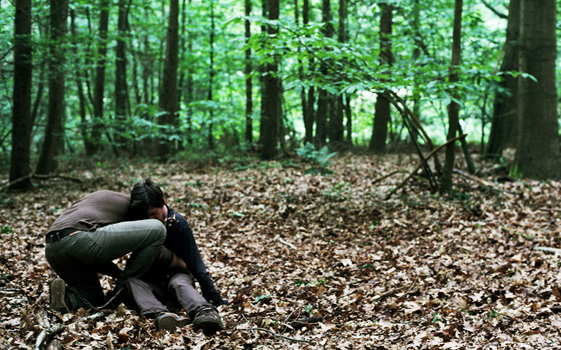

## **Klapbord**

De kortfilm Ka�n (16 min.) is de debuutfilm van de jonge, Oostendse cineast Kristof Hoornaert. Hij is een autodidacticus die zijn eigen scenario met steun van het Vlaams Audiovisueel Fonds (VAF) heeft kunnen verfilmen voor de Vlaamse productiemaatschappij Minds Meet. De film kreeg een selectie voor de Berlinale Shorts Competition van het filmfestival van Berlijn 2009, waar hij werd genomineerd voor de Gouden Beer. Selecties waren er ook voor het Manlleu Short Film Festival, Tofifest International Film Festival - Oostende Film Festival, Bursa International Silk Road Film Festival, Madrid Experimental Cinema Week  en India International Film Festival.

## **Synopsis**

Op een open plek in een bos op een niet gepreciseerde plaats kan een jonge man nog net op tijd de stok afweren waarmee iemand van achter hem wil neerslaan. Hij verdedigt zich tijdens het gevecht op de grond met zijn aanvaller. Het is eveneens een jonge man. Net zoals hij goed gebouwd. Het kunnen, zo te zien, broers zijn. De aanvaller laat niet los en spant zich tot het uiterste in om de grote steen die hij ziet liggen, met beide handen te grijpen. Het lukt hem en hij slaat ermee zijn slachtoffer het hoofd in. De moordenaar rust even uit en torst dan het dode lichaam op zijn schouder. Hij draagt het lichaam een eind het bos in tot waar de grond vochtig wordt wegens de nabijheid van een uitgestrekte vijver. Daar dumpt hij het lijk onder een hoge struik. Daarna stapt hij naar de vijver. Wast het bloed van zijn handen en zijn shirt, om dan helemaal naakt onder te duiken in het water. Wanneer hij boven water komt, hoort hij in de verte geluiden en vlucht haastig weg over het veld. Hij stopt met vluchten in het hoge gras ergens op een weide, gelegen op een heuvel. Met gebogen hoofd rust hij uit. Dan richt hij zijn hoofd op en kijkt met tranen in de ogen over het glooiende landschap naar de horizon met de eerste tekenen van menselijke beschaving: het vervallen huisje.

## **Cinematografie**

FILMGEDICHT. Ka�n situeert zich zelfbewust in de traditie van de Europese auteursfilm. Dat blijkt uit het feit dat Kristof Hoornaert tekent voor het concept, het script en de regie. Maar er is meer. De jonge regisseur stelt zich bewust op in de traditie van de cineasten Andrei Tarkovski  met films als Andrei Roeblev, Solaris, Zerkalo, Stalker, Nostalghia, Offret en Bruno Dumont met films als La vie de J�sus en L’Humanit�. Met deze laatste deelt hij trouwens dezelfde betrokkenheid op het heuvelland van West-Vlaanderen en Frans-Vlaanderen. Voor Kristof Hoornaert is Ka�n een studie in de cinematografie die vanuit zijn eigen unieke en beeldende kracht het mysterie van het leven zelf aan het woord laat, of beter: zijn eigen beeld laat regisseren. De filmische middelen komen consequent in dienst te staan van de eigen kracht van de levende werkelijkheid. Concreet is dat hier de werkelijkheid van de natuur (het bos, het meer, de weide, het landschap) en de werkelijkheid van de mens. Zo ontstaat het filmgedicht dat Ka�n is. Alleen de beelden en de klanken vormen het corpus van het gedicht. Het enige woord dat erbij hoort, is de titel. De montage van beelden en klanken zijn de verzen van het gedicht dat zijn eigen betekenis voordraagt. De toeschouwer krijgt de tijd om vanuit een meditatieve houding het gedicht te schouwen. Het gedicht opent de ruimte voor wat we eerder al hebben beschreven als ‘het beeldende denken’.

HET GELUID VAN DE STILTE. Ka�n kent geen gecomponeerde muziek. De klankwereld is dat van de plaats van de handeling. De stem van het bos met alles wat er leeft, en de woordeloze klanken van de twee mensen, vooral dan van de moordenaar: zijn zuchten, zijn ademhaling, zijn stappen, zijn vluchten. Zelfs tijdens de vechtpartij worden er geen woorden naar elkaar toe geschreeuwd. De stem van de mens, zelfs niet van de vechtende mens, verstoort hier de stilte van de natuur niet. De natuur zelf blijft rustig en quasi geruisloos ademen. Het is windstil, de bebladerde bomen rusten. De natuur krijgt haar eigen stem. Die wordt niet naar de achtergrond geduwd door opdringerige muziek die hier bijna als heiligschennis zou overkomen.

PANORAMISCHE KADRERING. De film kent een panoramische breedte, waarop de cineast door gebruik te maken van de statische camera nog meer de nadruk op legt. Dat impliceert dat de keuze voor de panoramische beeldwerking ook het ritme bepaalt. De camera beweegt slechts enkele keren snel. Dat gebeurt om het personage van de moordenaar op zijn vlucht te volgen. Maar de momenten waarop hij tijdens zijn vlucht stilstaat, zijn talrijker dan de momenten waarop hij daadwerkelijk versnelt beweegt. De panoramische kadrering geeft aan de cineast ook de mogelijkheid om zijn doel te bereiken en dat is de natuur zelf als hoofdpersonage te laten optreden. De panoramische shots van het bos volgens de horizontale en de verticale as, van het landschap met de horizon, van het wateroppervlak van het meer openen een wijde ruimte die recht doet aan de werkelijkheid van de omringende natuur en het groeiende leven waaruit ze concreet bestaat. Kristof Hoornaert schrijft zich met zijn cinematografie van het panoramische landschap in in de traditie van de spirituele landschapschilderkunst die teruggaat op Caspar David Friedrich en die in Vlaanderen in het oeuvre van Valerius De Saedeleer zijn weerga vond.

RUGSHOTS. Bij de opnames van de twee menselijke figuren, valt het consequente gebruik op van het rugshot. Dat stemt overeen met het picturale universum waarvan de meester van het spirituele landschap, het genie van de Duitse romantische schilderkunst, de zopas genoemde Caspar David Friedrich, de auteur is. In tegenstelling tot het modernistische dogma van het portret waarin het ego van het individu het daglicht opeist, schildert Friedrich voor het eerst de mens op de rug. Zijn _Der Wanderer �ber dem Nebelmeer_ van circa 1818 is daarvan het meest sprekende voorbeeld. Ook het panoramische schilderij _Der Monch am Meer_ van circa 1808-10 kent diezelfde uitstraling. In dat beelduniversum draait de (moderne) mens niet meer rond zijn eigen middelpunt. Het beeld haalt hem uit zijn centrum en plaatst hem in zijn originele thuis: de weidse, aardse natuur die hem tot zijn ware proporties herleidt. Vanuit zijn eigen wezen heeft dergelijk beeldwereld een gewilde religieuze werking omdat ze de (moderne) mens herdefinieert vanuit zijn wezenlijke verbondenheid met de bron van zijn eigen bestaan: het heilige leven op aarde. In Ka�n is het hoofdpersonage van de natuur de bevoorrechte getuige van wat er met de mens gebeurt. Vanuit dat perspectief valt er een bijzonder licht op het belangrijke filmische feit dat de regisseur bewust met twee niet-professionele acteurs heeft willen werken. Zelf formuleert hij het duidelijk zo:

> _Ik kies ervoor om te werken met niet-professionele acteurs._ _Kevin Plet speelt Ka�n en is helemaal geen professionele acteur, maar vastgoedmakelaar van beroep. In tegenstelling tot een professionele acteur die zijn personage nog moet cre�ren, heb ik met Kevin reeds een personage gevonden. Ik ben de straat opgegaan, gezocht en heb uiteindelijk Kevin gevonden. Zijn lichaam sprak me meteen aan. Hij heeft lange armen en benen die zijn lichaam enorm expressief maken. Zijn dominante postuur geeft mij het gevoel dat zijn lichaam hem soms in de weg zit. Dit geeft hem een tragische indruk. Ik kon hem overtuigen en heb hem meegenomen naar het bos. Ik wilde zien hoe hij beweegt daar in de natuur. Kevin had weinig regieaanwijzingen nodig. Als ik hem vroeg om iets te doen, dan deed hij het gewoon. Hij begreep perfect wat ik bedoelde. Hij stelde geen vragen. Kevin beweegt en doet dingen op zijn eigen manier. Hij heeft een eigen gedrag en persoonlijkheid. In tegenstelling tot een professionele acteur hoeft Kevin helemaal niet te acteren. Hij hoeft alleen maar zichzelf te zijn. De manier waarop hij zichzelf is maakt hem voor mij de perfecte Ka�n._ _Bart Desloovere is architect van beroep, is een goede vriend van Kevin en speelt de rol van het slachtoffer. Hij heeft een mager figuur en is even groot als Kevin. Het feit dat ze elkaar kennen, zorgt ervoor dat deze twee niet-professionele acteurs vlot omgaan met elkaar en al eens wat meer durven dan twee onbekenden. Voor de gevechtssc�ne is dit van enorm belang. Ook Bart hoeft alleen maar zichzelf te zijn._ _(K. Hoornaert,  Ka�n. Nota van de regisseur. 2009)_

In zijn cinematografie van het rugshot is er geen plaats voor psychologie, wat ook overkomt met de afwezigheid van het menselijke woord. Het menselijk lichaam komt op de voorgrond. In de orde van de mensenwereld is dat het hoofdpersonage. Hier treedt Kristof Hoornaert in de voetsporen van Bruno Dumont die met zijn werk een hedendaagse, nieuw hoofdstuk heeft geschreven in ‘de film van het lichaam’. In de plot van Ka�n komt die film helemaal tot zijn recht. Het laatste shot van de moordenaar is dat van zijn beweend gelaat. Dat slotbeeld werkt als de monding voor de voorgaande rugbeelden van het personage. Voor zijn cinematografie van het lichaam vond Kristof Hoornaert naar eigen zeggen ook inspiratie in de Vlaamse schilderkunst van Gustave van de Woestyne met zijn unieke beelden van kwetsbare lichamen. Eenzelfde inspiratiebron vormde het werk Zittende jongeling van de Duitse beeldhouwer Wilhelm Lehmbruck. Net zoals in Ka�n is bij de beelden van van de Woestyne en Lehmbruck het menselijk lichaam bron van spirituele doordringendheid.

## **Betekenisruimte**

BIJBELBEELD. Het vierde hoofdstuk van het eerste bijbelboek, Genesis, handelt over Gods zonen. De eerste twee heten Ka�n en Abel. De twee broers komen tegenover elkaar te staan door de schuld van de jaloerse Ka�n. Op de titel na refereert de film zelf niet direct aan Genesis 4\. De cineast getuigt daarover zelf:

> _De wreedheid van de mens kent zijn oorsprong in het verhaal van Ka�n en Abel uit het Oude Testament: de eerste moord. De ene broer die uit jaloezie de andere vermoordt. De mens die zijn medemens van het leven berooft. Dit tragische beeld was voor mij de motivatie om dit kortverhaal te schrijven. Uiteindelijk weent de moordenaar om zijn gruwelijke daad. Met dit kortverhaal wil ik reflecteren over onze menselijke conditie. De broedermoord van Ka�n en Abel is meer dan ooit enorm actueel._ _(K. Hoornaert. Ka�n. Nota van de regisseur. 2009)_

De kortfilm van Kristof Hoornaert toont goed aan hoe beeldende kunstenaars de Bijbel lezen. Als een beeldrijke tekst. Zij zien de beeldende kracht in de teksten en wenden de hedendaagse instrumenten aan om die beeldende kracht opnieuw te herontdekken. De cinematografie van het beeldende denken evoceert zo de blijvende actualiteit van tal van bijbelverhalen. Dat geldt zeker voor het verhaal over de eerste broedermoord. Het filmgedicht bevrijdt in zeker opzicht de werkelijkheid van het bijbelverhaal van zijn tekstuele inkleding. Niet dat het de tekst zelf wil vervangen, laat staan weggooien. In het filmgedicht krijgt de werkelijkheid van de broedermoord zijn blijvende religieuze resonantie omdat het medium film een mystieke band onderhoudt met het mysterie van de werkelijkheid zelf.

GEBOORTE VAN HET GEWETEN. De openingsbeelden introduceren het bos, de plaats van de handeling. Dat betekent geenszins dat het bos louter als decor optreedt. De beelden en de natuurlijke geluiden nemen de tijd om het bos als een re�el personage voor te stellen. In de schildering ervan verschijnt het bos als een natuurlijke, gotische kathedraal. De regisseur schenkt immers aandacht aan de open ruimte in het bos en aan het samenspel tussen de vruchtbare aarde, de moederschoot van het leven, en de lichtende hemel. Tijdens het drama van de broedermoord blijft het bos en de omgeving altijd aanwezig. Het geheel heeft een minimale verhaallijn. Iedere psychologische verklaring wordt bewust weggelaten, een aanpak die door de Franse cineast Robert Bresson werd ge�ntroduceerd. Kristof Hoornaert gaat consequent ver in die cinematografie. Door het gebruik van het rugshot ontbreken de close-ups van de gezichten. De lichamen beheersen de sc�ne. Er is geen enkel motief noch achtergrond voor de moord. Over de verwevenheid van het bos en de menselijke lichamen noteert de regisseur zelf het volgende:

> _De rust van het bos contrasteert met de wreedheid van de moord. Rupsen, insekten en vogels in het bos. De natuur is onverschillig voor  de menselijke wreedheid. De natuur die de oorsprong van het leven is. Het is een plaats van water, licht, wind, stilte, bomen, wolken, aarde. Het is de natuurlijke leefomgeving van de mens._ _(K. Hoornaert, Ka�n. Nota van de regisseur. 2009)_

Het filmgedicht van de broedermoord verschijnt zonder woorden. De vele woorden die dagelijks in de kranten en in de media over die wreedheid worden geproduceerd, lijken hier eerder op een enorm gedruis met als effect het doen verstommen van die werkelijkheid. Daartegenover staat de stille kracht van de audiovisuele beelding. Die evoceert de geboorte van het menselijke geweten. De cineast koppelt immers het Ka�ngebeuren — een echt verhaal is het immers niet — met het vijfde van de Tien Geboden: “Pleeg geen moord.” (Ex. 20, 13). Hij probeert helemaal niet om het bijbeltafereel na te spelen. Hij gaat immers anders te werk dan de auteur van Genesis die de klemtoon legt op het psychologische motief van de jaloezie, op het brengen van offers en op het nageslacht. Hoornaert distilleert uit het verhaal de kern die onvergankelijk actueel blijft in de mensenwereld: de broedermoord waarvan de zwaartekracht echoot in Gen. 4, 10:

> _‘Wat heb je gedaan?’ zei de HEER._  
> _ ‘Hoor toch hoe het bloed van je broer uit de aarde naar mij schreeuwt.’_

In het filmgedicht weerklinkt die schreeuw in de kathedraal van het bos en het West-Vlaamse heuvelland. Het is geen letterlijke schreeuw, maar een proces van verwerking en meditatie dat zich in het innerlijk van de moordenaar afspeelt en zich voltrekt binnen de sprekende stilte van de heilige ruimte van de natuur. Hij gebruikt  het bos om zijn daad uit te voeren, te verbergen, te vluchten, weg te wassen van zijn handen en hele lijf. Maar de sprekende stilte van de natuurlijke omgeving weerkaatst zich in zijn gemoed. In het slotbeeld richt hij zijn gebogen hoofd op en kijkt met betraand  gelaat recht in de ogen van de verre horizon, waar hemel en aarde elkaar ontmoeten en waar zich de eerste tekenen van beschaving in de aanwezigheid van een vervallen huisje zich aftekenen. In de beeldsetting die vooraf gaat aan de onthullende close-up van het wenende gelaat last Kristof Hoornaert indirect twee beeldcitaten in: de opening van Dumonts L’Humanit� voor de panoramische loop over de rug van het glooiende akkerland en Dumonts La vie de J�sus voor het rugschot van de moordenaar die met gebogen hoofd in het hoge gras zit. Door al die gegevens oogt het filmgedicht als een eigentijdse meditatie over de religieuze geboorte van het geweten. In die geboorte voltrekt zich de transcendentie van de broedermoord, een beweging die wordt beschreven in de gang van de open ruimte in het bos naar de plek op de heuvelrug waar zich de horizon ontvouwt.

LEVENSBESCHOUWING. Het filmgedicht handelt niet over levensbeschouwing, het is levensbeschouwing, in de rijke zin van het woord. De bijzondere kracht ervan vloeit voort door micro en camera zo aan te wenden dat het leven zelf in de actieve zin schouwend wordt. Het bos neemt het drama op in zijn blikveld. In het filmgedicht bekleedt de levende aarde de plaats die het personage van God heeft in Genesis 4\. Het landschap met zijn horizon, levend beeld van het goddelijke mysterie van het bestaan, worden oog en oor voor het proces van menswording dat zich aan het voltrekken is van in de bijbelse tijden tot op vandaag, een ononderbroken drama met ontelbare taferelen waarvan de zwaartekracht zich verdicht in de kortfilm Ka�n.

## **Context**

De kortfilm is een atypische Vlaamse productie en creatie in het Vlaamse filmlandschap dat zich in het eerste decennium van deze eeuw heeft gevormd. De jonge regisseur Hoornaert schrijft zich in de internationale, vooral Europese traditie van de religieus ge�nspireerde film. Sommigen gebruiken liever de term ‘spirituele film’. De Vlaamse filmproductie blijft in die traditie afwezig. Het genre van de misdaadthriller en de komedie domineren het filmdoek in Vlaanderen. Het relatiedrama vindt ook zijn publiek. Hoornaert bewandelt eigenzinnig de weg van de cinematografie die zich zonder omwegen naar de werkelijkheid van het leven zelf richt. Met Ka�n treedt hij in dialoog met de schrijver van het oude Genesisverhaal over de mens die in staat is zijn medemens, zijn broer, te doden, ononderbroken, van generatie op generatie. Wonderlijk genoeg gaat die keuze voor de werkelijkheid van het leven zelf gepaard met een radicale keuze voor het filmbeeld zelf. Hoornaert toont zijn geloof in de eigen unieke denkkracht van de cinematografie. Met Ka�n legt Hoornaert de eerste steen van een oeuvre dat hopelijk de tijd en de ruimte krijgt om zich in Vlaanderen te ontplooien. Het Vlaamse filmlandschap zou erdoor rijker aan beeldkracht worden.

## **Filmfiche**

Belgi� / 2009 / 16' / **regie, scenario**: Kristof Hoornaert / **productie**: Tomas Leyers voor Minds Meet / **fotografie**: Richard Van Oosterhout / **montage**: Stijn Deconinck / **productie designer**: Eva Cools / **vertolking**: Bart Desloovere (slachtoffer), Kevin Plet (moordenaar).

## **Links**

K. Hoornaert_, Ka�n. Nota van de regisseur_. 2009 (niet-gepubliceerde nota, ter beschikking gesteld door de regisseur)  
S. De Bleeckere, _Tragiek, Transcendentie en Triade. Beeldend denken in de nabijheid van het oeuvre van Andrei Tarkovski_. Hasselt, Men(S)tis, 1999.  
S. De Bleeckere, _L’Humant�,_ in: CineMagie nr. 234, lente 2001, p. 8-33.

� Sylvain De Bleeckere, Men(S)tis, 2011
