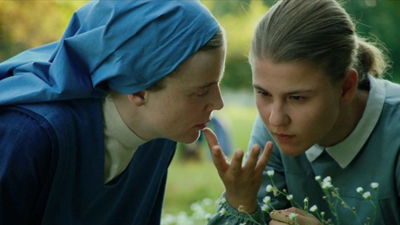

## **Klapbord**

De historisch-biografische film **Marie Heurtin** ging in de zomer van 2014  in première tijdens het internationaal filmfestival van Locarno. Hij won er de _Variety Piazza Grande Award_. De internationale titel is **Marie’s Story**. De Franse regisseur _Jean-Pierre Améris_ baseerde zich op het goed gedocumenteerde verhaal van _Marie Heurtin_. Ze kwam doofblind ter wereld in 1885 en overleed op 36jarige leeftijd op 22 juli 1921. Het meisje had de eerste dertien jaren van haar leven geen enkel contact met zichzelf en haar omgeving. Ze had geen enkel besef wie ze was en waar ze was. Ze bleef  onhandelbaar. Dat veranderde op haar veertiende. Ze kwam dan terecht bij de kloosterzusters _Filles de la Sagesse_. Die bestuurden het _Institut Notre-Dame de Larnay_ bij Poitiers, Frankrijk. Het instituut bestaat nog steeds. Sinds 2006 hebben de zusters het bestuur overgedragen aan de vereniging Larnay Sagesse. Priester _Chaubier de Larnay_ stichtte het instituut in 1847 met als doel sensorieel gehandicapte personen, blinden en doven, op te vangen en te begeleiden. Doofblinden zijn heel uitzonderlijk. Eén van de uitzonderingen was Marie Heurtin. In het Institut Larnay ontfermde de kloosterzuster _Sainte-Marguerite_ ontfermt zich over de veertienjarige doofblinde Marie Heurtin. De zuster ontwikkelde een pedagogie waarmee ze erin slaagde om contact te krijgen met het doofblinde meisje. Door de jaren heen kon Marie Heurtin aldus _een eigen menselijke persoonlijkheid_ opbouwen. Aan het werk van zuster Marguerite dankt het instituut zijn bekendheid. De film is gebaseerd op _de wetenschappelijke documentatie_ over het pedagogische werk van zuster Marguerite met Marie Heurtin. De Franse professor Louis Arnould, verbonden aan de universiteit van Poitiers, wijdde reeds in 1900 in zijn wetenschappelijk werk _Une âme en prison_ een uitgebreide studie aan Marie Heurtin. Zijn studie werd in 1907 nog uitgebreid met een beschrijving van de behandeling van een tweede doofblinde vrouw, Anne-Marie Poyet en met een uitbreiding van het geval Marie Heurtin door haar zuster Marthe Heurtin. De nieuwe titel van het werk dat verwijst naar de eerste studie luidt: _Âmes en prison, l’École française des sourdes-muettes-aveugles_ (1910). De regisseur Jean-Pierre Améris schreef zelf het scenario samen met Philippe Blasband op basis van de historische bonnen. Daarbij legden ze de nadruk op de relatie tussen de twee betrokken vrouwen, zuster Marguerite en Marie Heurtin. De actrice _Isabelle Carre_ nam de rol van de zuster op zich en bereidde zich een half jaar voor met het leren van de Franse gebarentaal. De dove _Arianan Rovoire_ werkte nooit eerder als actrice. De regisseur koos haar voor de rol van Marie Heurtin. De vertolking van beide vrouwen is indrukwekkend.

## **Synopsis**

De ouders van Marie Heurtin hebben hun doofblinde dochter met liefde opgevoed. Ze staan echter machteloos tegenover de ingrijpende handicap van hun meisje. Ze zijn er bijvoorbeeld al die jaren niet in geslaagd het meisje schoenen aan te doen en behoorlijk te kleden. Het kind heeft immers geen enkel contact met zichzelf noch met haar omgeving. De ouders kunnen niet communiceren met hun opgroeiende dochter. Ze herkent haar ouders enkel via de geur en door met haar handen de gezichten te betasten, maar wie eigenlijk wie ze zijn. Met haar zorgende vader heeft ze een goede band. Ze vertrouwt hem. Ze willen de opgroeiende Marie niet laten opsluiten in een asiel voor krankzinnigen. Ze vragen aan het nabijgelegen Larnay Instituut haar te willen opnemen. De moeder-overste weigert, terwijl zuster Marguerite zich geroepen voelt om het meisje te helpen. Ze weet de moeder-overste te overtuigen. Ze krijgt de toestemming van haar overste om het meisje te gaan halen en mee te brengen. Eens aangekomen in het klooster en het internaat, begint het opvoedingswerk van zuster Marguerite. Ze moet improviseren. Ze laat zich niet ontmoedigen door tegenslagen. Ook de scepsis van haar overste  kan haar motivatie en inzet niet temperen. Ondersteund door vooral haar dove medezuster Raphaëlle, gaat zuster Marguerite met een eindeloos geduld te werk. Ze experimenteert. Haar medezusters Véronique, Joseph, Elisabeth, Marthe, Anne, Clothilde en Marie-Ange volgen het verloop van de opvoeding van Marie met verwondering, soms met ongeloof en zelfs met scepsis. Uiteindelijk slaagt Marie een eerste contact te krijgen met de geest van Marie. Het meisje ontwaakt en begint aan een ongekend leerproces. Tussen Marie en zuster Marguerite ontstaat er een heel sterke band. Die wordt op de proef gesteld door de zwakke gezondheid van zuster Marguerite. Uiteindelijk kunnen ze allebei afscheid nemen op het sterfbed van zuster Marguerite. Marie bezoekt het graf van zuster Marguerite,en spreekt tot haar, over de dood heen, in de gebarentaal die ze van haar heeft geleerd. 

## **Cinematografie**

WARME KLEUREN. De film kent een zonnige uitstraling. Dat komt door de aandacht voor de _volle kleuren_, zelfs in de sequenties die zich in de winter situeren. Het eerste deel van de film speelt zich trouwens af in de lente. Het is in de meimaand, de Mariamaand, dat zuster Marguerite, met toestemming van moeder overste, Marie gaat halen bij haar thuis om ze mee te nemen. De _zonovergoten_ beelden vertolken de blijheid van zuster Marguerite. De blijde lentebeelden krijgen nog versterking van de begeleidende _zonnige muziek_ waarin de speelse, maar warme fagot een hoofdrol speelt. Het betreft _Jeux d’enfants, After Janacek’s Moravian Folksongs V_ van Franck Krawcyck. Voorts straalt de _licht blauwe kleding_ van de zusters een blijde eenvoud uit.   

CYCLISCHE TIJD. De film is lineair opgebouwd, maar toch staat de duur van het verhaal in het teken van de cyclische tijd. De openingssequenties brengen zuster Marguerite en Marie samen. Eens Marie in het instituut is waar zuster Marguerite zich over het meisje ontfermt, begint de zuster _een dagboek_. Regelmatig volgen er korte sequenties met zuster Marguerite schrijvend in haar dagboek. Daarna gaat haar stem die uitspreekt wat ze schrijft, verder in voice-over bij de beelden van het leerproces van Marie. Dat dagboekdeel dat tevens het grootste deel van de film omvat, is gestructureerd via _de kalenderdagen_ die de zuster in haar dagboek noteert. Het begint op 10 mei. Daarna volgen nog 27 mei, 26 juli, 20 september, 27 oktober, 15 november, 15 juni, 20 april. Het valt op dat bij de data _geen jaartallen_ staan. Hiermee lost Améris het probleem op van de duur van het leerproces. Het is onmogelijk om dat leerproces dat jaren bestrijkt, binnen de tijdsduur van een film weer te geven. Alleen via suggestie is het mogelijk om het wezenlijke van dat reële proces te evoceren. Via de data beschrijft de regisseur _een cyclus van lente (mei) tot lente (eind april)_. Het is de _natuurcyclus van de wedergeboorte_. In dat teken plaatst de regisseur het hele leerproces dat zuster Marguerite en Marie Heurtin samen doormaken.

PANO EN CLOSE-UPS. Het beeldformaat varieert van panorama tot close-up. In _de buitenbeelden_ plaatst de regisseur de personages in de omgeving, de natuur. Dat gebeurt in het eerste deel van de film vooral in de sequenties van de weg die zuster Marguerite samen met Marie te voet aflegt van Marie’s thuis tot aan het instituut. In de buitensequenties die zich situeren in het instituut gebruikt de cineast het kleinere panoramaformaat om de personages te situeren in de groetentuin, de grote tuin met vooral gras en enkele bomen en het kleine kerkhof. Het formaat in _de binnensequenties_ is vooral dat van de close-up. De talrijke close-ups brengen de pedagogische werk van zuster Marguerite in beeld. De close-ups van _de gezichten van zuster Marguerite en Marie_ zetten het wonder van het contact tussen beiden in reliëf. Dat contact verloopt immers zonder woorden. Dat verklaart waarom de close-ups van _de handen van beide vrouwen_ het visuele leidmotief van de film vormen. 

BEELDMETAFOREN. De film kent geen visuele bravoure. Hij oogt eenvoudig. Dat sluit aan bij _de spiritualiteit van de eenvoud_ die het werk van de zusters typeert. Ze leiden een bestaan in eenvoud en ze stellen zich in dienst van de opvoeding van de meisjes met een zintuiglijke beperking. Die cinematografische eenvoud krijgt een grote diepgang via _enkele beeldmetaforen_ die op het dagelijkse leven zijn geënt. Juist in een omgeving waar woorden amper een rol spelen, ontwikkelt zich _het beeldend denken_ via visuele metaforen op een manier die alleen de kunst van de cinematografie kan realiseren. De belangrijkste beeldmetafoor is die van _het zakmes_. Zuster Marguerite ontdekt in het huis van de ouders van Marie dat het meisje zeer gehecht is aan het zakmes. Ze neemt het in haar handen en ruikt er het intens aan. Zuster Marguerite gebruikt dat zakmes om een eerste vorm van communicatie te realiseren met Marie. Daarnaast groeien via talrijke close-ups _de handen_ uit tot sterke lichaamsmetaforen. In tal van sequenties vormt het spel van de handen een eigen visuele partituur. Een andere belangrijke beeldmetafoor is die van _de boom_. De regisseur brengt ermee _een inclusie_ aan in de film. Bij de eerste aankomst van Marie op het Institut Notre-Dame de Larnay vlucht Marie in de boom. Zuster Marguerite probeert haar te overtuigen om terug naar beneden te komen. Op het ogenblik dat dit bijna lukt, komt moeder-overste tussen waardoor zuster Marguerite uit de boom valt. Naar het einde toe, met name in de sequenties die in het teken staan van de stervende zuster Marguerite, komt er opnieuw een boomscène voor. Opnieuw is Marie in de boom geklommen. Ze is gefrustreerd omdat de zieke zuster Marguerite haar niet meer in haar kamer wil toelaten. De zuster heeft immers grote moeite om afscheid van Marie te nemen. Opnieuw komt de moeder-overste tussen, maar nu in de positieve zin. Ze weet zuster Marguerite te overtuigen om Marie toe te laten bij haar ziekbed. Daarna is het de moeder-overste die zelf in de boom klimt om Marie te overtuigen om naar beneden te komen en opnieuw voor de zieker zuster Marguerite te gaan zorgen. De boom krijgt in die dramatische context en door de inclusie de betekenis van _de levensboom_. Hij brengt zuster Marguerite en Marie samen bij het begin en op het einde.  

DE KLANK VAN CELLO EN VOGELS. Naast de reeds vermelde zonnige muziek in het eerste deel van **Marie Heurtin**, is het vooral _de cellomuziek_ de filmbeelden begeleidt. Voor de instrumentale filmmuziek tekende de Franse celliste _Sonia Wieder-Atherton_. Ze vertolkt samen met Matthieu Lejeune en Sarah Lancu fragmenten van Claude Monteverdi’s _Madrigali Guerrieri et Amorosi, Libro VIII : Altri Canti d’Amor_. Voorts speelt ze een eigen bewerking van _Jeux d’enfants, After Janacek’s Moravian Folksongs I-VII_ van Franck Krawcyck, _de Vespers_ van Rachmaninov, _Variaties on a Slovak Folksong 1-5_ van Bohuslav Martinu, _het Rückert-Lied Ich bin der Welt abhanden gekommen_ van Gustav Mahler, _La chanson de Marie_, Sonia Wieder-Athertons bewerking van een Joodse tradional voor cello. Via de keuze voor de cello als leidend instrument krijgt de filmmuziek een homogeen karakter. De hoofdtoon is _ingetogen, met een ondertoon van beheerste droefheid_. Die begeleidt _de innerlijke strijd_ van zowel zuster Marguerite als van de doofblinde Marie. De muzikale uitzonderingen zijn het reeds vermelde zonnige _Jeux d’enfants, After Janacek’s Moravian Folksongs V_ van Franck Krawcyck, alsook Bachs _Sicilienne_. Dit laatste stuk wordt in de film zelf op piano gespeeld door een medezuster van zuster Marguerite. De piano staat in de eetzaal van de zusters. In de scène met de piano leert Marie voor het eerst de wereld van de muziek en de muziekinstrumenten verkennen. Naast de muziek, monteert  Améris ook _natuurgeluiden_, in het bijzonder _het gefluit van vogel_. Het instituut die het internaat voor de meisjes en het klooster van de zusters omvat, ligt immers midden in de natuur. De stemmen van de vogels die zich ophouden in de grote tuin met bomen van het instituut, begeleiden vooral de buitenbeelden met zuster Marguerite en Marie. Vooral in de momenten van harmonie en verstandhouding tussen beiden situeren zich buiten, begeleid door de vogels. De slotsequentie met Marie bij het graf van zuster Marguerite situeert zich ook in de grote tuin waar zich het kerkhof van de zusters bevindt. De binnenbeelden onderlijnen vooral de strijd die zuster Marguerite moet voeren om Marie uit haar duisternis te halen, een strijd die grenzeloos geduld vereist. Die binnenbeelden krijgen vooral een cellobegeleiding.

## **Betekenisruimte**

DE GEBOORTE VAN DE GEEST. De kracht van de film **Marie Heurtin** reikt verder dan de re-enactment van de historische case van de doofblind geboren Marie Heurtin en haar opvoedster zuster Marguerite. Via die filmische reconstructie, herinnert de regisseur de toeschouwer aan _een zeer fundamenteel menselijk fenomeen_, namelijk dat van _de geboorte en de wording van de geest_. Met die geest is niet alleen de identiteit van de mens als mens en individu gegeven, maar eveneens het onlosmakelijk fenomeen van de opvoeding en de menswording. Geen mens die wordt geboren, is in staat zichzelf op te voeden. En dat geldt bij uitstek voor wie doofblind ter wereld komt. Doofblindheid van bij de geboorte, officieel _aangeboren of congenitale doofblindheid_ genoemd, is eerder zeldzaam. Tot in de tweede helft van de negentiende eeuw, de tijd van Marie Heurtin, werd een opgroeiende doofblinde als ‘abnormaal, wild, gek, idioot’ beschouwd, waarvoor er geen remedie of therapie bestond. Overleden hij of zij niet op jonge leeftijd en werd hij of zij volwassenen, dan kwamen die terecht in een gesloten instelling voor psychiatrische patiënten, toen in de volksmond ‘een gekkenhuis of zothuis’ genoemd. Kortom, opsluiting! Dat laatste wilden de ouders van Marie Heurtin vermijden. Ze konden echter geen kant uit daar ze zelf hun opgroeiende dochter niet meer in bedwang konden houden. Daarom zochten ze hun toevlucht tot het nabijgelegen Institut Notre-Dame de Larnay, gespecialiseerd in de opvoeding van dove meisjes. Zuster Marguerite beschouwde het als haar roeping om alles te proberen om de doofblinde Marie te helpen. De film brengt _het opvoedingsproces_ in beeld, dat zich tussen beiden heeft afgespeeld. Hierdoor krijgt de toeschouwer de gelegenheid om met zuster Marguerite mee _het wonder van de geboorte van de menselijke geest_ te zien voltrekken. Alles staat daarbij in het teken van het contact krijgen met zichzelf en de eigen omgeving. In [Levensbeschouwing democratisch belicht](http://www.menstis.be/uitgeverij/Levensbeschouwing) wordt die open relatie tussen de mens en de wereld rondom als ‘_het contactum_’ belicht. 

In **Marie Heurtin** staat alles in het teken van het ontstaan van dat contactum. Dat gebeurt via de beeldmetafoor van _het zakmes_. Voor Marie is het een bijzonder voorwerp. Ze voelt en ruikt het. Tegelijkertijd belichaamt het zakmes ook de onmogelijkheid om in contact te komen met de dingen. Ze weet niet wat het zakmes precies is, wat het betekent en hoe ze het kan gebruiken. Dat verandert wanneer ze onder leiding van zuster Marguerite leert eten met mes en vork. Van zodra dat lukt, neemt zuster Marguerite dit succes als opstap om de link te leggen met het zakmes. Ze brengt Marie het eerste teken van de gebarentaal bij: _twee vingers die over elkaar bewegen_. ‘Couteau’! Dat herhaalt ze honderden keren na elkaar, uren lang. Ze houdt Marie aan de tafel, ook al is het tijd om te gaan slapen. Ze houdt vol. Plots breekt het inzicht door bij Marie. Ze legt voor het eerst een verband tussen het zakmes en het teken van de gebarentaal. Zuster Marguerite omhelst Marie, beiden lachen. De geest, de ‘_mind_’, van Marie is ontwaakt, acht maanden na haar aankomst in het instituut. Van dat moment af, leert ze heel erg snel. Dat komt omdat ze de moeilijke grens naar het contactum heeft overgestoken. Ze begint te begrijpen dat ze in contact staat met dingen die een naam en een betekenis hebben. Ze leert wat leren is. Voorheen kende ze aangename momenten van verwondering: de ontdekking van het stromende water van de rivier, de zachte, warme huid van de koe. Op die momenten kon het contact echter niet doordringen tot haar omdat haar geest _volkomen afgesloten_ was, ook en vooral voor het contact met zichzelf. 

Met het eerste gebaarteken ‘mes’ verwerft ze een sleutel waarmee ze _toegang_ krijgt tot haar eigen geest en via haar geest opent zich _het contact met de werkelijkheid_ rondom haar. De film belicht dat wonderlijk gebeuren door de mentale ontwikkeling van Marie helemaal in het teken van _de levensboom_ te plaatsen. In de boom zoekt ze veiligheid bij haar aankomst in het instituut en daar vindt ze op het einde opnieuw een houvast. Zo blijkt dat de geboorte van de geest voor Marie en bij uitbreiding voor iedere mens de deur opent van de werkelijkheid van het leven. Aan die werkelijkheid krijgt ieder mens als pasgeborene deel zonder het te beseffen. In de slotsequentie, bij het graf van zuster Marguerite, spreekt Marie in gebarentaal tot de zuster in de hemel. Ze eert haar als haar tweede moeder, zij die haar het leven als unieke mens heeft geschonken. Via het mentale leven leert ze zichzelf zien in relatie tot alles wat tot het leven behoort, ook het sterven. Ze zegt: ‘Ik denk de hele dag aan jou, ’s morgens als ik wakker word, ’s avonds als ik slapen ga. Wanneer ik nieuwe dingen leer, denk ik aan jou.’ Er komt een zeer krachtig tafereel voor in de film. Die staat helemaal in het teken van de ontmoeting van Marie met haar ouders in het instituut. Daar blijkt hoe dochter en ouders nu voor de allereerste keer contact met elkaar hebben. Marie heeft door het werk van zuster Marguerite contact met zichzelf gekregen, waardoor ze nu ook in contact kan treden met haar ouders, met wie ze altijd heeft geleefd, maar nooit heeft kunnen kennen. Dan blijkt hoe de menselijke geest tijdens dat contact, die herkenning, vervuld wordt van dankbaarheid. Die heeft betrekking op het besef van aanwezig te mogen zijn in het leven, een gave die een mens bij de geboorte krijgt. Aan haar ouders kan ze nu zeggen: ‘Ik hou van jullie’. Het wonder van de geboorte van de menselijke geest voltrekt zich in het intens contact met de eigen oorsprong, die via de ouders uiteindelijk leidt naar het heilig mysterie van het leven zelf. Juist iemand als Marie Heurtin die in zeer extreme omstandigheden moet leven, komt tot een sterker inzicht in het wezen van die dankbaarheid, eigen aan het contactum, dan ontelbare mensen die het leven ervaren als niets meer dan een dagelijkse gewoonte. Hun sterkste gevoel is dat van de verveling. Dergelijk gevoel is volkomen vreemd aan Marie en zuster Marguerite. Via de grote inspanningen die de zuster levert om toegang te krijgen tot Marie, krijgt ze ook meer toegang tot het mysterie van haar eigen menselijk wezen. Als kroongetuige van het wonder van de geboorte van de geest bij Marie, treedt zuster Marguerite zelf ook opnieuw binnen in het mysterie van de menselijke geest en zo in het mysterie van het leven zelf. Ze zegt: ‘Marie heeft mij zoveel gegeven. Ze heeft me een wereld leren ontdekken waarvan ik niets wist. Een wereld die je aanraakt, een wereld waarin alles wat leeft, onder de vingers vibreert.’ De film Marie Heurtin is voor de toeschouwer een sterk antidotum tegen de existentiële verveling, of positief geformuleerd: de film helpt de toeschouwer het wonder van de eigen menselijke geest en het contactum te herontdekken, vervuld van een gevoel van dankbaarheid.

KUNST ALS ZOWEL SPIRITUEEL ALS DEMOCRATISCH STATEMENT. De titel van de film is **Mr. Turner**. De ‘Mr.’ heeft een betekenis. Mike Leigh legt er vanaf het begin de nadruk op dat Turner nooit door het Britse koningshuis geëerd is met een adellijke titel. Het is dus niet Sir Turner. Leigh maakt van Mijnheer (Mr.) een eretitel. Dat is _een democratisch statement_. Het verduidelijkt hoe vanuit de zowel spirituele als intellectuele kracht van het gewone volk genieën kunnen voorkomen. Dat geldt zeker voor Turner. Daarbij legt Leigh terecht de grote nadruk op de sterke band tussen vader en zoon Turner. De zoon, William, brengt in de film hulde aan zijn vader. Die heeft in zeer moeilijke levensomstandigheden zijn zoon opgevoed. Hij heeft hem leren lezen en schrijven, en hij heeft het kind de ruimte gegeven om zijn natuurlijk tekentalent in vrijheid te ontplooien. Een ander aspect van dat democratisch statement van Mr. Turner is _Turners doorleefde aandacht voor het menselijke lijden_ dat hij uitdrukt in zijn werk. Het schilderij _The Slave Ship_ komt in de film herhaaldelijk ter sprake. Voorts is er het schrijnende tafereel waarin Turner de jonge prostituee schetst. De visuele echo ervan werkt nog door naar het einde van de film, waarin de doodzieke Turner toch nog zijn huis uitkomt om het aangespoelde lijk van een jonge vrouw te schetsen. In beide gevallen toont Turner via zijn schetsen _zijn doorleefde blijk van medeleven_. Turner wil als mens en als kunstenaar participeren in het menselijke lijden waarmee hij zelf vertrouwd is. Hij wil als het licht zijn dat alles, ook het pijnlijke of het donkere, in zich opneemt. _Die lijfelijke verbondenheid met het lijden_ werkt door in het deelverhaal van Turners collega Haydon, evenals in het tafereel Turner en miss Coggins aan de piano met _Dido’s Lament_ van Purcell. Bij dit alles is het opmerkelijk dat Turner de tragiek van het menselijk leven opneemt in _de levensmetafoor van de zee_, eigen aan het genre van de maritime. Turner schildert de zee niet als een waterlandschap. Hij is niet uit op een zuiver esthetische evocatie van het aardse fenomeen van de grote zeeën. Via zijn volgehouden schetsend onderzoek ontwikkelt hij _de spirituele betekenis en de levensbeschouwelijke draagwijdte_ van de zee. Hij werkt dat beeld uit tot _een levensmetafoor_. De zee is niet enkel de watermassa, het is evenzeer de horizon met het spel van de wolken in de lucht, de rust van de stilte en het gebulder van de storm; het is ook het spel van het licht op de golven, in de regie van de getijden, zelf het werk van de planetaire krachten die voortkomen uit de bewegingen van zon en maan. In die complexe levensmetafoor van de zee, in dat visuele narratief van de zee, komt ook de aanwezigheid van de mens voor, de moderne mens die geschiedenis schrijft op het golvende blad van het leven zelf. Hij schrijft die geschiedenis met het schip dat hij over de zeeën stuurt. Met het slavenschip maakt de moderne mens van de oceaan een zee van lijden. In de film is er ook sprake van Turners _The Battle of Trafalgar, 21 October 1822_,  met Lord Nelson’s _Flagship, The Victory_. Turner schilderde het in opdracht van koning George IV. In de film vertelt het personage van Turner dat hij er twee jaar heeft aan gewerkt maar de koning het schilderij niet waardeerde. De reden daarvoor ligt voor de hand. Turner leverde geen heroïsch tafereel af. Hij maakte er een studie van over de donkere wil van de moderne mens die een geschiedenis van oorlog en geweld schrijft op de bladzijden van het fluïde levensboek.

Een belangrijk aspect van Turners democratische levenshouding als kunstenaar blijkt uit het historisch getrouwe tafereel van **Mr. Turner**. Het situeert zich in Turners eigen galerij waar mecenas Gillott de schilder voorstelt om al zijn nog aanwezig werk op te kopen. Tijdens zijn leven kocht Turner ook schilderijen die hij eerder had verkocht, terug en bewaarde ze in zijn eigen galerij. Turner weigerde Gillotts gul aanbod. Zoals blijkt uit het tafereel in de film, besliste de kunstenaar om de grote hoeveelheid schilderijen en schetsen in zijn bezit _testamentair_ over te dragen aan het Engelse volk met als enige voorwaarde dat het samen zou blijven en voor het publiek vrij toegankelijk zou worden tentoongesteld in de National Gallery. Die nalatenschap, de grootste kunstdonatie ooit, heet officieel _[The Turner Bequest](https://www.nationalgallery.org.uk/paintings/history/the-turner-bequest)_. Het grootste deel van de nalatenschap bevindt zich heden in de Clore Gallery in Tate Britain. Een aantal werken bevindt zich in de National Gallery. 

  

## **Context**

De film **Mr. Turner** ging in première in 2014. In 2016 koos de Britse bevolking met een kleine meerderheid voor de _Brexit_. Die twee gebeurtenissen hebben op zich niets met elkaar te maken. Anderzijds werpt **Mr. Turner** wel een bijzonder licht op _het fenomeen Europa_. De film brengt een belangrijk gegeven uit de collectieve herinnering onder de aandacht. **Mr. Turner** demonstreert _de relativiteit van de nationale grenzen_. Nog voor het ondenkbare werkelijkheid zou worden in de twintigste eeuw, de twee Wereldoorlogen, liet Turner zien dat de kunst zelf alle nationale grenzen overstijgt. De film opent in _Nederland_. Het incident met de rode boei handelt over het schilderij _Helvoetsluys – The City of Utrecht, 64, Going to Sea_, opnieuw een verwijzing naar Nederland. Als autodidact reisde Turner Europa rond. Tijdens zijn verblijven in Italië werkte hij in een atelier in _Rome_ en zocht hij de landschappen in en rond Rome op die Claude Lorrain hadden geïnspireerd. In de periode dat **Mr. Turner** zich situeert, het laatste deel van Turners leven, reisde de schilder  herhaaldelijk naar _Venetië_ waar hij de combinatie van architectuur, water en licht intens bestudeerde. In zijn carrière maakte hij, behalve in Nederland, ook nog schetsen en aquarellen in _Frankrijk, Griekenland, België en Zwitserland_. In zijn testament noteerde Turner dat zijn schilderijen _Dido building Carthago_ en _Sun Rising through Vapour_ zouden worden gehangen naast _Landscape with the Marriage of Isaac en Rebecca_ van Claude Lorrain, de Franse schilder die het grootste deel van zijn leven in Italië verbleef, vooral in Rome waar hij werkte en ook is gestorven. Turner beschouwde hem over de generaties heen als zijn echte leermeester. Voor kunstenaars als Lorrain en Turner is _de aarde de bakermat van het leven, en is het licht een sacrale werkelijkheid_. Voor beiden zijn de landen met hun grenzen erg relatief, gezien vanuit de levensbeschouwelijke Lichtaard. Tijdens het leven van Turner, in de eerste helft van de negentiende eeuw, werden in Europa de kiemen gelegd voor _de ideologie van het nationalisme_. Die ideologie zou in de tweede helft van de negentiende en de eerste helft van de twintigste eeuw uitgroeien tot een monster dat de Europese volkeren tegen elkaar zou opzetten. Turner oversteeg die ideologie nog voor ze helemaal tot wasdom kwam. Hij plaatste er _de praxis van de levensbeschouwing_ tegenover. Die praxis is niet onder de noemer van enige ideologie te vangen. Ze beoefent een universele, religieuze zienswijze met als focus de Lichtaard, het verbindende hemelse licht dat geen landgrenzen kent en de mens vormt tot de beschouwer van _de grote, religieuze Gave_ die hem is gegeven. De Brexit zet een grote stap terug. Het komt voort uit een kortzichtigheid die helemaal vreemd is aan de Londense Europeaan Turner. Misschien is het een troost te weten dat de stad London tegen de Brexit heeft gestemd.

**Mr. Turner** evoceert een belangrijk hoofdstuk van de Europese cultuur, namelijk dat van _de romantische stroming_ van eind achttiende en begin negentiende eeuw. Die stroming is erg relevant voor een goed begrip van de hedendaagse cultuur. De romantische stroming vormt immers de bakermat van wat we sinds de jaren zestig van vorige eeuw _de postmoderne cultuur_ noemen. In de ontwikkeling van de romantisch stroming hebben de literaire kunst van de poëzie en de schilderkunst een hoofdrol gespeeld. William Turner heeft in die optiek een werk van eerste categorie gerealiseerd. Kenneth McConkey noteert in zijn studie over _het impressionisme_ in Groot-Brittannië, verschenen in _Landschaft im Licht_ (1990, 123), dat het pas in het begin van de twintigste eeuw begon door te dringen in Europese kunstkringen dat het Franse impressionisme was ontstaan op de hoeksteen van Turners werk. Maar Turners kunst overstijgt de kunsttheorie en haar soms ijdele discussies over stijlen. Turner is nooit bezig geweest met stijlconcepten. Hij onderzocht _de indrukwekkende lichtruimte_ waarin al wie en wat leeft, eenmalig beweegt. De film van Mike Leigh herinnert aan de unieke persoonlijkheid van Turner en de geniale expressie van zijn werk. Zijn onderzoek naar het licht is pas in de twintigste eeuw opgenomen in de natuurwetenschappen, met name door _Albert Einstein_. Hij heeft _zijn bijzondere en vooral algemene relativiteitstheorie_ immers ontwikkeld vanuit zijn doorgedreven fascinatie voor _het kosmische oerfenomeen van het licht_. Turner werkte als eerste vanuit dergelijke fascinatie en het leverde hem zijn unieke kunst op. Die ontsprong uit _het inzicht in het fenomeen van het licht als grondslag van het als sacraal en religieus ervaren fenomeen van het leven_. In het werk van Turner neemt de dynamische werking van het licht al wat leeft in zich op. De ruimte kan geen vaste grenzen meer. Er ontstaat een _fluïde levensruimte_ die zich voortdurend beweegt tussen de uitersten van licht en donker, dag en nacht. Nadien zal Einstein ook de kosmische ruimte doen vloeien en Newtons visie op de absoluutheid van tijd en ruimte overstijgen. Vanuit zijn unieke sacrale beleving en praxis is Turner ooggetuige geweest van het ontstaan van _de Industriële Revolutie_ met de komst van de stoommachine. In de film wordt daar in verschillende taferelen naar verwezen. Turner sloot zich niet af voor die komende revolutie. Hij registreerde het. Hij doet dat in het besef dat hij wellicht de laatste van de schilders was die nog _het ongerepte licht_ in al zijn schakeringen en gedaanten op aarde kon onderzoeken en weergeven. Hij besefte dat de industriële mens met zijn machines en hun zwarte dampen de natuurlijke verschijning van het licht over het landschap en de zeeën zou wegnemen. In het tafereel in Turners eigen galerij spreekt hij over zijn schilderij _Hannibal and his Army Crossing the Alps_. Hij verduidelijkt dat hij ermee _de menselijke hybris_ heeft uitgedrukt. De basisgedachte van het Griekse woord hybris is dat de mens die handelt alsof God is, zichzelf verliest in de waanzin. Turner schildert in Hannibal het beeld van de militaire heerser die meent de krachten van de natuur te kunnen bedwingen net zoals hij zijn medemens meent te kunnen onderwerpen met zijn militair geweld. Voor Turner was het Carthago van Hannibal een historische metafoor van die hybris waarvan hij de betekenis ook overdroeg naar het Britse Rijk in zijn tijd. Turner behoorde immers tot de generatie die ervan getuige was dat het Britse rijk een belangrijk deel van zijn koloniale macht in 1776 had verloren aan de nieuwe Verenigde Staten van Amerika. Het Hannibal-schilderij wordt in die zin een metafoor voor de hybris van de Industriële en Koloniale, Westerse Mens. Turner verwijst _profetisch_ in een ander schilderij, _Sun Rising through Vapour_, dat ook in de film **Mr. Turner** een rol speelt, naar het stoomschip de _Titanic_, toonbeeld van moderne hybris, dat in 1912 naar de bodem van de oceaan zonk. Moest Turner het lot van de Titanic hebben gekend, dan zou hij van zijn _Sun Rising through Vapour_ zeker een tweeluik hebben gemaakt. In de spiegel van Turners lichtwerken verschijnt de hedendaagse luchtvervuiling, direct gevolg van de Industriële Revolutie, in de eerste plaats een _lichtvervuiling_. Ze brengt levensbeschouwelijke schade toe.

## **Links**

Voor een verdieping van de belangrijke notie Lichtaard, zie [Levensbeschouwing democratisch belicht](http://www.menstis.be/uitgeverij). Betrouwbare data voor verdere verdieping in de persoon en vooral het werk van Turner, zie de website van de [Turner Society](http://www.turnersociety.com/turner).

© Sylvain De Bleeckere, Men(S)tis, 2017
