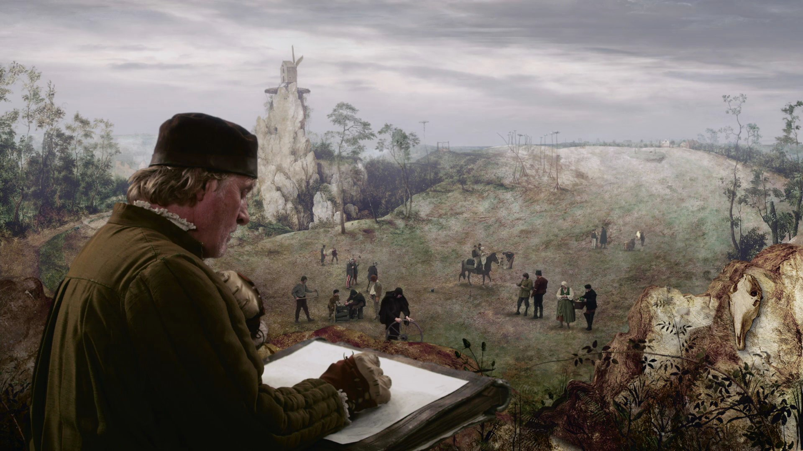

## **Klapbord**

De Pools-Zweedse film **The Mill & the Cross** (Młyn i krzyż ) van Lech Majewski brengt één schilderij van de schilder Pieter Bruegel de Oude (1525/1530-1569) tot leven op het beeldscherm. Het gaat om De Calvarietocht van Christus, soms kortweg De kruisdraging genoemd, in het Engels [The Procession to Calvery](https://commons.wikimedia.org/wiki/File:Pieter_Bruegel_d._%C3%84._007.jpg) genoemd. Bruegel schilderde het doek in 1564. Het wordt nu dagelijks bewonderd door de bezoekers in het Weense Kunsthistorische Museum. Majewski zelf was ooit een van die vele bezoekers. Hij werd voorafgegaan door de Amerikaanse kunstcriticus en historicus Michael Francis Gibson. Hij schreef over dat ene schilderij in het Frans het boek _Le Portement de croix de Pierre Bruegel l'Aîné_, en hij vertaalde het zelf in het Engels onder de titel _The Mill & the Cross_ (2001). Die titel werd ook de titel van Majewski’s film. Gibson heeft Majewski zelf gevraagd om een film te maken op basis van zijn boek. De Amerikaanse auteur was immers sterk onder de indruk gekomen van Majewski’s Poolse film _Angelus_ (2001), een loflied op de spirituele ervaring van het Mysterie en de poëtisch-visuele kracht van de verbeelding als antwoord op materialisme en totalitarisme. Gibson was onder de indruk van de picturale stijl van de film die hem deed denken aan de kunst van Bruegel. Majewski las het boek van Gibson over Bruegels merkwaardig schilderij _De Calvarietocht van Christus_ en besloot naar het schilderij een film te maken. Hij schreef samen Gibson het scenario voor **The Mill & the Cross**. Beide scenaristen besloten dat er maar één verhaallijn zou zijn, die van het schilderij van Bruegel. Voor de opnames kon de Poolse regisseur beroep doen op een internationale cast met de Nederlandse acteur Rutger Hauer in de rol van de schilder, de Franse actrice Charlotte Rampling in de rol van Maria, de moeder van Jezus , en de Engelse acteur Michael York. Hij vertolkt de rol van Bruegels Antwerpse bankier en mecenas van Bruegel, Nicolaas Jonghelinck, de koninklijke belastingontvanger van het toenmalige hertogdom Brabant en marktgraafschap Antwerpen, die samen één van de Zeventien Provinciën van de (Habsburgse) Nederlanden vormden. Deze Europese film kreeg zijn wereldpremière tijdens het Amerikaanse Sundance Film Festival in 2011. Over hun samenwerking schreven Gibson en Majewski een boek: _Bruegel. The Mill and the Cross_. Olszanica, BOSZ & Angelus Silesius, 2010. Daarin synthetiseert en verscherpt Gibson zijn eerder verschenen analyse van Bruegels schilderij in functie van de film (p. 7-117). In het tweede deel ervan publiceert Dagmara Drzazga haar verslag van het opnameproces van de film onder de titel _Lech Majewski: The World According to Bruegel_ (p. 119-197). Het boek besluit met fragmenten van het storyboard, getekend door Jerzy Orga (p. 199-218).

## **Synopsis**

Met zijn zware tekenmap onder de arm, bezoekt _Pieter Breugel_ samen met zijn mecenas, de bankier _Nicolaas Jonghelinck_, een setting van een groep treurende vrouwen ergens buiten de muren van een zestiende-eeuwse, Brabantse stad. Breugel informeert Jonghelinck wat hij van plan is te schilderen. De Brabantse kunstenaar denkt aan het Bijbelse thema van de kruisweg van Jezus naar de Calvarieberg. De schilder licht verschillende taferelen toe die hij wenst in beeld te brengen. Dat geldt eerst en vooral _de groep van de drie wenende, heilige vrouwen_: Maria, moeder van Jezus, Maria-Magdalena en een derde vrouw. Vervolgens spreekt Breugel, tot verwondering van Nicolaas, over de figuur van de molenaar en diens vrouw die hoog boven op een steile ros wonen, van waarop ze de molen beheren. Dan komen ook _de rode, gewapende ruiters_ in beeld. Zij vertegenwoordigen het politieke gezag van de Spaanse koning. Ze nemen eerst een jonge man, _Jan_, gevangen. Hij is samen met zijn vrouw _Netje_ onderweg naar de markt om hun kalf te verkopen. De ruiters slaan en schoppen de jonge man, binden hem vast aan een karrenwiel dat ze vervolgens op een hoge, smalle paal plaatsen. Die trekken ze met koorden recht. Ze leveren de bebloede jonge man over aan de kraaien, de lijkenpikkers. Netje blijft verweesd achter, in haar machteloosheid wenend onderaan de paal. De tweede gevangene is _Jezus_. Hij moet, in tegenstelling met Jan, een zwaar kruis dragen, van de stad naar de nabijgelegen heuvel. Na te zijn geslagen en met een doornen kroon te zijn gemarteld, bezwijkt hij onderweg onder het kruishout. De gewapende ruiters verplichten een voorbijganger, _Simon_, om de veroordeelde te komen helpen diens kruis te dragen. Zijn vrouw _Esther_ protesteert hevig tegen de opeising van haar echtgenoot. Ze gingen immers de tegengestelde richting van de stoet uit. Ze waren op weg naar de markt in de stad. Ondertussen bekijkt _de molenaar_ van hoog boven zijn rots het gebeuren. Hij ziet hoe een grote menigte een stoet vormt richting de heuvel waar de kruisiging plaats zal vinden. Ondertussen bestudeert Breugel hoe hij het tafereel met al zijn protagonisten en figuranten in één beeld kan samenbrengen. Hij vindt inspiratie in _een spinnenweb_. Hij maakt tal van schetsen en verklaart aan zijn mecenas _Nicolaas_ hoe hij de compositie opvat. Nicolaas zelf volgt ook de stoet naar de heuvel van de terechtstelling terwijl hij zich erg kritisch uitspreekt tegenover zijn vrouw _Saskia_ over de toenemende terreur van de gewapende ruiters. Breugel zelf observeert en maakt voortdurend schetsen, steeds buiten in het landschap. Zijn jonge vrouw _Marijken_ zorgt voor de kinderen en het huis. Ze brengt voedsel aan haar man terwijl hij buiten aan het werk is. Ondertussen observeert ook _Maria_, de moeder van Jezus, de voorbijtrekkende stoet. Ze spreekt haar verdriet en onbegrip uit over het gebeuren. Na de terechtstelling gaat ze naar het kruis toe. Daar waakt ze onder samen met Maria-Magdalena en een vriendin. De schilder merkt op dat tijdens de stoet van de dood de tijd even stilstaat. Na de terechtstelling verzamelt het volk op een plek waar geen soldaten meer zijn noch de molen te bespeuren valt. Ze vormen een kring rond een anoniem koppel dat Breugel overal heeft opgemerkt. Alle aanwezigen nemen deel aan de rondedans.

## **Cinematografie**

FILMEN ALS SCHILDEREN EN VICE VERSA. **The Mill & the Cross** is het werk van een cineast die schildert. Majewski identificeert zich met de schilder, wat impliceert dat hij Bruegel als zijnsgelijke beschouwt. Cinematograaf Majewski schildert en kunstschilder Bruegel regisseert. Dat blijkt uit de openingssequentie. Het personage van de schilder stapt samen met dat van Nicolaas Jonghelinck het beeld in. Met zijn schetsboek in de hand, stapt hij naar de filmset waar _de groep van de heilige vrouwen_ hun plaats hebben ingenomen, terwijl de overige personages en figuranten zich stil houden tot het woord van de regisseur ‘action’ weerklinkt. Bruegel wil eerst de groep van de heilige vrouwen controleren, hij herschikt even de plooien van hun gewaden. Nicolaas zegt wat hij meent te zien: ‘_Zo. Dit kan een groep van heiligen zijn die uit het verleden terugkeren om te wenen over het huidige lot van Vlaanderen_.’ Bruegel bevestigt en voegt eraan toe: ‘_Als het schilderij klaar is, mag jij het hebben als je wilt_.’ De proloog van de groep met de heilige, wenende vrouwen en de intro van Bruegel en Jonghelinck bevinden zich tussen het eerste en tweede deel van _de generiek_. Hiermee introduceert Majewski bij de toeschouwer wat er zal gebeuren. De film wil het ene schilderij van Bruegel, _De Calvarietocht van Christus_, voorstellen als een geschilderde film. Bruegel verschijnt als de zestiende-eeuwse cineast die hele setting heeft klaar gezet voor de opname, terwijl Jonghelinck optreedt als de producent die over de schouder van de cineast-schilder meekijkt. Bruegel gebruikt zijn schetsmap zoals een regisseur de cameralens aanwendt om definitief het kader van het beeld vast te leggen, waarna hij ‘action’ roept. Majewski wil laten zien hoe Bruegel te werk is gegaan. Hij wil het schilderij cinematografisch tot leven brengen met het hoofdpersonage Bruegel als gids. Dat alles mondt uit in de epiloog. Daarin toont Majewski het originele schilderij zelf. Het hangt nu in een van de zalen van het Weense Kunsthistorisch Museum. Via een uitzoombeweging toont Majewski waar het schilderij zich precies in het gebouw bevindt. Hiermee neemt hij op het einde de positie in van de museumbezoeker. Na meer dan 92 minuten mentaal het schilderij zelf schouwend te zijn binnengestapt, verlaat de cineast het schilderij om zijn weg in het museum te vervolgen. Om die intense beschouwing te kunnen realiseren, heeft Majewski drie jaar nodig gehad. Hij heeft immers_een heel eigen cinematografische beeldruimte_ ontwikkeld. Daarbij heeft hij gebruik gemaakt van alle beeldende middelen zoals ook Bruegel alle beschikbare middelen van zijn tijd heeft gebruikt. Majewksi is er inderdaad in geslaagd om de hedendaagse toeschouwer mee te nemen in de eigen beeldruimte van het schilderij. Aldus betreedt de toeschouwer het schilderij op een manier waarop hij het in het museum nooit kan zien en beleven. In het museum wordt de bezoeker-toeschouwer overigens op een veilige afstand gehouden. Bruegels schilderij in kwestie bevat honderden details. Het is onmogelijk om in het museum zo dicht bij het schilderij te komen om die details te kunnen waarnemen en exploreren. Daarom reconstrueerde Majewski Bruegels doek in de tijdelijke filmstudio gebouwd in het _Katowice International Trade Fair Center_ en de postproductiekamer van de _Odeon Film Studio_ in Warschau (Drzazga, o.c., 147, 176). Majewski’s grote uitdaging bestond erin het tweedimensionale schilderij van Bruegel te transponeren naar het eveneens tweedimensionale beeldscherm waarop het doek driedimensionaal tot leven komt. Daartoe maakte hij op drie verschillende wijzen digitale opnames met een Amerikaanse _RED digital camera met een 4K resolutie_ (idem, 150). De opnames van de acteurs gebeurden voor een blauw scherm in de filmstudio. Daarnaast werden er opnames gemaakt van de acteurs op buitenlocaties in de pittoreske rotsformaties van de Kraków-Częstochowa Juraketen met zijn ruïnes van middeleeuwse kastelen, onder andere de kasteelruïne van Olsztyn (idem, 126-129), in Tsjechië en in Wenen. In Nieuw-Zeeland filmde Majewski samen met John Crisstoffels een reeks van unieke licht- en wolkencomposities (Idem, 173). Voor de opnames met de acteurs werkte Majewski samen met zijn vaste cameraman Norbert Rudzik die ook instond voor de speciale effecten. De derde soort opnames bestonden uit beelden van een grote tweedimensionale achtergrond (‘backdrop’). Die bestond uit het schilderij van Bruegel dat Majewski zelf op een zeer groot doek heeft nageschilderd. Al die digitale opnames moesten tijdens de postproductie laag per laag op elkaar worden gelegd en tot één beeld worden samengevoegd. Majewski noemt het een ‘_elektronische alchemie_’ (Idem, 150). Hij moest daartoe creatief gebruik maken van de nieuwe ontwikkelingen in de technologie van de computer graphics (CG), ook soms computer-generated imagery (CGI) genoemd. Op die manier kon Majewski op het beeldscherm het schilderij van Bruegel met een 3D-effect laten verschijnen.  

SOUNDSCAPE. Een schilderij als _De Calvarietocht van Christus_ is pure stilte. Het geeft geen klank, het is louter visueel. Dat is niet de bedoeling. Bruegel zou maar al te graag hebben kunnen beschikken over middelen om zijn beeld te doen spreken. De huidige cinematograaf zoals Majewski beschikt over de mogelijkheden om het schilderij een eigen soundscape te geven. Majewski transponeert Bruegels doek in de cinematografische modus van bewegend beeld en klank. In zijn filmische transcriptie gaat Majewski niet zijn eigen weg. Hij blijft trouw aan de geest van Bruegels meesterwerk. Dat uit zich in de vele stille taferelen. Dat geldt bij uitstek voor _de stilte-sequentie_. Wanneer Jezus bezwijkt onder het kruis, legt Majewski alles het zwijgen op. Een korte klaagzang van de vrouwen geeft nog diepgang aan die stilte. De klanksfeer van de film is in hoofdzaak een compositie van natuurlijke geluiden: vogels hoorbaar in het bos, krijsende kraaien, de wind. Daarnaast contrasteert Majewksi die muziek van de landschappelijke omgeving met de geluiden die hun oorsprong vinden in de stad van de mens. De cineast versterkt die klanken zodat ze aan het schilderij een heel eigen stem geven. Dat gebeurt al in het begin van de film, met name in de sequenties waarmee de cineast de rode ruiters introduceert. _Het aankomende paardengetrappel_ rolt als een donder vanuit de mist het beeld in. Het kondigt de harde terreur aan waarmee de huurlingen van de Spaanse koning het volk onderwerpen. Behalve het klankmotief van het paardengetrappel, componeert Majewski en zijn geluidsteam ook dat van _draaiende raderen en wieken van de molen_. De monumentale molenraderen kraken wanneer de wind ze via de wieken in beweging zet. Het paardengetrappel en de molenraderen vormen de eigen partituur van de film. Ook de klank die de menselijke beweging voortbrengt, krijgt een versterkt accent. De klompen van de molenaar, zijn vrouw en hun knecht op de plankenvloer van hun verblijf in de molen, het kappen van de boom in het bos, het spelen van de kinderen.

Majewski verrijkt de partituur van de film met _twee korte, maar betekenisvolle muziekcomposities_ van hemzelf en de veelzijdige Poolse muzikant Jozef Skrzek. De eerste compositie vertolkt _een zachte, eerder kinderlijk blijde stemming op de tonen van een elektronische piano_, bespeeld door Skrzek. Majewski koppelt die muziek aan de eerste verschijning van Bruegel op de set in het middenstuk van de proloog. En bij de eindgeneriek met de namen van wie betrokken zijn geweest bij het productieproces, weerklinkt dezelfde muziek. Het doet de toeschouwer van de film uitgeleide. De tweede korte compositie van Majewski en Skrzek hoort als _een erg korte, maar pregnante klaagzang van vrouwenstemmen_. Die weerklinkt enkel op de klankband en duurt maar enkele seconden. Dat muzikaal leidmotief komt _drie keren_ voor, verspreid over de hele film. De regisseur introduceert het in de proloog bij het tweede deel van de generiek met de namen van de acteurs, de regisseur en de filmtitel. De tweede keer verschijnt de treurzang bij het tafereel met het lijk van de gemartelde Jan, liggend op de grond aan de voet van de boom met het karrenwiel waarop de rode ruiters Jan hadden vastgebonden, terwijl zijn jonge vrouw Netje hem beweent. Op het ogenblik dat de grafdelver het lijk komt weghalen, zet de muziek in. De derde keer monteert Majewski de muziek bij de eerder genoemde stilte-sequentie. Wanneer de camera die van rechts naar links beweegt, ter hoogte van de neergevallen Jezus onder het kruis komt, weerklinkt opnieuw het vrouwelijke lamento. Majewski vult dit muzikale leidmotief op het einde van de film nog aan met twee zeer korte muzikale citaten. Bedoeld zijn, _het Miserere, Opus 44_ ― het fragment _XI Miserere Nobis_ ―van de hedendaagse Poolse componist Henryk Górecki (1933-2010) en het _Miserere Mei_ van de Venetiaanse barokcomponist Antonio Lotti (1667-1740). Het eerste weerklinkt heel even bij het tafereel met de grot waarin de voeten van de overleden Jezus nog zichtbaar zijn. In de buurt staat een oudere burger van de stad mediterend voor zich uit te staren. Het _Miserere Nobis_ begeleidt die beelden tot aan het beeld met Judas die zichzelf aan de galg ombrengt. Helemaal op het einde, met name bij de overgang van het gefilmde schilderij naar het echte doek in het museum, de epiloog van de film, vertrekt Majewski van de groep van de bedroefde, heilige vrouwen en zoomt dan uit. Bij het beginbeeld, de close-up van de groep, weerklinkt het _Miserere Mei_ van Lotti. Hij mixt het heel even met de volksmuziek uit het laatste gefilmde tafereel, om dan de klankband te laten overgaan in stilte.

_De volksmuziek_ in de film komt ook letterlijk in beeld en refereert naar de oude volksmuziek in het toenmalige Brabant en Vlaanderen. _De dansmuziek met fluiten, doedelzak en trom_ staat centraal in het slottafereel van de film. Een groep van koppels uit alle standen van de samenleving dansen vrij en blij in het rond op een groen begroeide heuvel. De spelende muziekkanten dansen mee. In het begin vormt de groep een cirkel rond het koppel dat zich in de loop van de film heeft gevormd. De fluitspeler is de muzikale getuige van de vorming van het koppel langs de weg naar de markt. In de scène die voorafgaat aan de eindsequentie met de rondedans komt eerst een kort tafereel voor. Het toont voor de laatste keer Bruegel die thuis leunend tegen de houten binnenwand van het huis, met zijn vinger tekent in de lucht. Achter hem zien we door het open raam een trio dat danst: de fluitspeler, een burger en een boer. Hun kleine rondedans introduceert de grote rondedans waarmee de film eindigt en waarna de proloog in het museum volgt. Opmerkelijk is dat de grote rondedans geleidelijk overgaat in een dans van koppels die zich vrij naast elkaar bewegen en die dus de initiële cirkel hebben verbroken.

Tot de eigen soundscape van **The Mill & the Cross** hoort ook _de menselijke stem_. Er komen tien momenten voor waarin personages spreken. Dat gebeurt meestal in voice-over. Bruegel, Nicolaas Jonghelinck en de oudere Maria spreken hun gedachten uit voor zichzelf (Maria, Bruegel) of voor anderen (Bruegel, Nicolaas Jonghelinck). Reeds in de proloog licht Bruegel aan zijn mecenas zijn schetsen toe die hij maakt ter voorbereiding van het schilderij over de kruisweg van Jezus naar Golgotha. In de loop van de film zetten zich die gesprekken voort. Bruegel verduidelijkt aan Nicolaas zijn werkwijze en de opbouw van het tafereel dat hij wil schilderen. Daarnaast vertolkt Maria haar gedachten bij het zien van de kruisgang van haar zoon. Nicolaas Jonghelinck is ook een kroongetuige van het gebeuren. In zijn burgerwoning in de stad laat hij zich, binnenskamers tegenover zijn gemalin, erg kritisch uit over _de Spaanse terreur tegenover de lokale bevolking_. Maria krijgt het laatste woord. Haar derde beschouwing handelt over de kruisiging van haar zoon. Na haar woorden volgt het tafereel van de kruisafname – de kruisiging zelf wordt niet in beeld gebracht. Van dan af zwijgt de menselijke stem.
 

CINEMATOGRAFISCHE CIRKELBEWEGINGEN.. Wat de opbouw van **The Mill & the Cross** betreft, springen _de cirkelbewegingen_ in het oog. In de literaire en beeldende tweedimensionale kunsten is het moeilijk om een cirkelbeweging in de opbouw uit te drukken. Toch hebben door de eeuwen heen schrijvers en schilders een creatieve oplossing gevonden via de narratieve techniek van _de inclusie_. Die verdicht zich in het schema A B A’. In de literatuur noemt men die inclusie ook wel sandwich-structuur. De anonieme auteur van het Evangelie van Marcus heeft daar handig gebruik van gemaakt. In de schilderkunst vertaalt zich dat in de vorm van de triptiek, intens gebruikt door de grote Vlaamse Primitieven.

Majewski bespeelt in **The Mill & the Cross** op zijn persoonlijke manier _de techniek van inclusie_ om de cirkelbeweging te accentueren. Dat doet hij voor de hele structuur van de film en voor afzonderlijke onderdelen in de film. Vooreerst _de hele structuur_ van de film. Majewski bouwt de grote structuur op _het tafereel met de groep van de heilige vrouwen_. Hij introduceert dit in de proloog en hij brengt het beeld van die groep, via een close-up van het echte schilderij, terug in beeld als begin van de epiloog in het Weense museum. Met het tafereel met de heilige vrouwen beschrijft de regisseur een inclusie, het fundament van de grote structuur. De inclusie omsluit de hele film die het verhaal vertelt van het ontstaan van het doek De Calvarietocht van Christus. Met de proloog introduceert de cineast al de cinematografische cirkelbeweging. Dat gebeurt via de beeldende inclusie van de generiek.  Die kent twee delen met daartussen het beeldend deel met de groep van de heilige vrouwen. In dat tussendeel van de triptiek ontstaat er een nieuwe, kleine cinematografische cirkelbeweging. De camera toont eerst de heilige vrouwen die op de voorgrond van de set plaatsnemen, terwijl de overige personages en figuranten al klaar staan en wachten op het fiat van de regisseur om te gaan bewegen. Dan tekent de regisseur met de camera een inclusie met de personages van de schilder en zijn mecenas als ankerpunten. Wanneer de camera voor de eerste keer aan de rechterzijde van het tafereel komt, stappen de personages van Bruegel en Jonghelinck in het kader van het beeld. Ze bewegen van rechts naar links, de camera volgt hen. Bruegel maakt vlug een schets en stapt dan in het midden op de lage rots naar de groep van de heilige vrouwen toe. De schilder legt zijn map even neer en schikt de plooien van de gewaden. Dan keert hij terug naar Jonghelinck die Bruegel zijn schetsmap aanreikt. Ze stappen dan samen terug naar de rechterzijde van het beeld. Wanneer ze uit de beeldkader verdwijnen, eindigt het middenluik van de proloog. Op diezelfde manier componeert de regisseur ook binnen het grote middenluik ― het ontstaan van de schilderij vanuit de observaties en schetsen van Bruegel ― nog verschillende cinematografische cirkels. Dat is bijvoorbeeld het geval met de sequentiereeks die zich situeert in het huis van Bruegel. De jonge moeder, de vrouw van Bruegel, en de kinderen komen in beeld. De sequentiereeks opent met de jonge moeder die het huis binnenkomt. Dat gebeurt via een deurschot. De camera staat binnen, gericht naar de open deur. De moeder komt binnen. Door de open deur ziet de camera in de verte de draaiende molen. De sequentiereeks eindigt opnieuw met een shot van de open deur waardoor nu de kinderen, op vraag van de moeder, naar buiten lopen. Ook de belangrijke stilte-sequentie, opgebouwd rond Jezus’ val onder het kruis, vormt een cirkelbeweging via de inclusie met de molen. Ze opent immers met het beeld van de molenwieken die plots ophouden te draaien en ze eindigt wanneer diezelfde molenwieken opnieuw beginnen te bewegen. Naar het einde toe van de film volgt nog een cinematografische cirkelbeweging met de danssequentie. Aan het begin staat de sequentie met Bruegel in zijn huis, leunend tegen de houten muur, tekenend met zijn vinger in de lucht. Door het raam naast Bruegel filmt de camera een rondedans van de fluitspeler, de burger en de boer. Dit beeld introduceert het einde van film. Die staat in het teken van de grote rondedans.

Behalve de cinematografische cirkelbeweging via de beeldinclusie, bouwt Majewski het eigen filmverhaal ook op via _beelden van heel concrete cirkelbewegingen_ van personen en dingen. De grote molen op de rots bestaat uit een samenspel van cirkelbewegingen. De molen kan draaien rond zijn as, er zijn de wieken en de raderen. Daarnaast krijgt het ronde karrenwiel als marteltuig veel beeldruimte. Voorts zijn er de dansbewegingen: personages draaien rond zowel individueel als in groep. Het slottafereel met de volksdans van de grote groep accentueert voor de laatste keer die cirkelbeweging. 

Majewski ontleent via de analyse van Gibson het belang van de cirkelbeweging aan _het schilderij van Bruegel zelf_ (Gibson, 2000, 43-50; 2010, 23-25). Gibson ziet _drie cirkels_ als basis van Bruegels compositie. Gezien vanuit de toeschouwer, bevindt zich in de linkerbovenhoek de stad met haar omwalling in cirkelvorm. In de rechterbovenhoek ziet de toeschouwer de cirkel van de kijklustigen op de heuvel waar zich de terechtstelling situeert. De volkstoeloop die zich vormt rond de drie mannen die op weg zijn naar hun kruisiging, verbindt de twee cirkels. Op dit punt forceert Gibson zijn interpretatie. De langgerekte optocht vormt geen mooi afgelijnde cirkelbeweging. Geometrisch lijkt de lijn ervan meer op een gedeeltelijke ovaal. Majewski zelf stelt Gibsons visie over de drie cirkels bij. Hij relativeert die visie door in de film via het personage van Bruegel _het totaalbeeld van het spinnenweb_ te introduceren. In die optiek verschijnen de vele schetsen van Bruegel als de bestanddelen van het grafische spinrag waaruit hij gestaag de compositie van zijn schilderij laat groeien. In tegenstelling tot Gibsons geometrische analyse, oogt het schilderij veeleer als een bewuste disruptie van de cirkelfiguur. Het beeld bestaat uit een myriade van circa 500 verschillende menselijke figuren plus nog de talrijke dieren, planten en dingen (rotsen, water, bomen, vogels, paarden, een kalf en een lam, een paardenschedel, karren, galgen, distels, enzovoort). Bruegel wil met opzet de blik van de toeschouwer desoriënteren. Dat heeft alles te maken met de creatie van de eigen en unieke betekeniswereld van het doek, waarin zich ook Majewski beweegt. In de creatie van die eigen betekeniswereld, blijft Majewski, wat de drie cirkels van Gibson betreft, dichter bij Bruegels doek. Hij concentreert namelijk _de cirkelbeweging in het beeld van de molen_. In Bruegels schilderij trekt de molen op de rots de aandacht. Niet het beeld van de veroordeelde Jezus onder het kruis, het eigenlijke hoofdpersonage, maar het beeld van de molen domineert het blikveld van de toeschouwer. Majewski werkt de draaiende molen uit als een hoofdpersonage, helemaal in de letter en de geest van Bruegels schilderij. Tegelijkertijd laat hij de molen zien in tal van taferelen. Hierdoor verschijnt de molen in werking als een kroongetuige van het hele gebeuren. 

## **Betekenisruimte**

HET ZELFPORTRET VAN BRUEGEL. Het feit dat **The Mill & the Cross** geen Vlaamse, maar Poolse productie is, onthult dat het werk van Breugel meer dan ooit een internationale vermaardheid kent en een dito uitstraling heeft. Geen enkele productiehuis en regisseur in het Vlaanderen van vandaag blijken in staat te zijn zo een werk als **The Mill & the Cross** te realiseren. Dat heeft veel van doen met het dominante beeld van Bruegel in het Vlaanderen van vandaag. In haar recente biografie over Pieter Bruegel legt de Vlaamse kunsthistorica Leen Huet de vinger op de wonde (Leen Huet, _Pieter Bruegel. De biografie_. Kalmthout, Polis, 2016). Ze beschouwt alle gekende prenten en de doeken van de schilder als de belangrijkste historische bron om iets over hem te weten te komen. De overgeleverde historische data zijn immers erg schaars. Bruegel liet, zover bekend, geen geschreven bronnen na, alleen zijn artistiek werk vormt zijn testament. Maar _het publieke beeld van Bruegel dat in Vlaanderen_ dominant geworden is, staat de kennismaking met de schilder en zijn werk pas echt in de weg. Dat publieke beeld is dat van ‘_de boeren Bruegel_’, ook ‘_Pier den Drol_’ genoemd. Dat beeld is relatief recent en is het resultaat van de herontdekking van Bruegel in de twintigste eeuw. In zijn eigen tijd waren Bruegel en zijn werk internationaal gekend en gewaardeerd: van Antwerpen en Brussel tot in Keulen en Rome. Vanaf de zeventiende eeuw werd hij vergeten om eind negentiende―begin twintigste eeuw te worden herontdekt in het Vlaanderen van het nieuwe België (Huet, o.c., 9-10, 18-22). Die herontdekking situeerde zich binnen _de succesrijke beweging van het nationalisme_ in Europa, dus ook in Vlaanderen. In die optiek werd Bruegels werk in Vlaanderen voorgesteld als _de expressie van een eenvoudige, ietwat boerse volksaard_. De bewaarde schilderijen _Luilekkerland_, _Het bruiloftsmaal_ en _De boerendans_, alle drie daterend van ca. 1567, dienden als bewijsvoeringen van die eenvoudige Vlaamse volksaard. Die toont zich in _een simpele, ietwat domme levenswijze_ waarin men met zijn allen gezellig vet geroosterd varkensvlees en gebraden kip eet, bier drinkt, taarten en rijstpap naar binnen speelt. Traiteurs bieden tot op vandaag aan hun Vlaamse klanten een ‘breugeliaans buffet’ aan. Niemand minder dan de katholieke schrijver _Felix Timmermans_ verspreidde, geïnspireerd door Breugels schilderijen vooral via zijn succesrijke volksroman _Pallieter_ (1916), het beeld van de Vlaamse, breugeliaanse volksaard. Ook in zijn vele lezingen in Vlaanderen, Nederland en Duitsland verspreidde Timmermans die volkse voorstelling van Bruegel (idem, 345-346). Geïnspireerd door de grote Bruegelviering van 1924 in Brussel, publiceerde Timmermans zelfs in 1928 zijn roman _Pieter Bruegel zo heb ik u uit uwe werken geroken_. In die geest kon men in alle Vlaamse huiskamers afdrukken tegenkomen van Bruegels boerentaferelen op koekjesdozen of in kaders aan de muur. In die beeldvorming à la Timmermans ging het Vlaamse publiek ‘hun schilder’ zelf ook zien als een schilderende boer. Huet rekent anno 2016 af met die vertekende beeldvorming. Ze schrijft:

>_‘Toch is het verbazingwekkend dat Timmermans zich Pieter Bruegel alleen kan voorstellen als een neurotische angsthaas. Timmermans’ Bruegel durft om zo te zeggen niets,heeft amper ideeën over kunst en sukkelt kwansuis op een volkse stijl af. Die interpretatie is moeilijk te verteren voor wie Bruegels meesterlijke schilderijen, zijn doeltreffende composities bekijkt. Zo schilderen angsthazen en mannen zonder ideeën niet.’_ (idem, 345-346).

Het grootste argument tegen dergelijk vertekende beeld van Bruegel en zijn werk, zijn de circa veertig schilderijen die van Bruegel zijn bewaard. Die vormen één groot oeuvre. Het vormt een groot en complex dubbel zelfportret: dat van de mens en intellectueel Bruegel en dat zijn eigen tijd. Bruegel behoorde tot de belangrijke groep van intellectuelen in het Antwerpen en Brussel van het toenmalige Brabant. Die intellectuelen bevorderden alles wat met de nieuwe drukpersen kon worden gemaakt: boeken en prenten. Die intellectuelen ademden _de toenmalige tijdgeest van het jonge humanisme_ waarin bewondering voor de Grieks-Romeinse Oudheid gepaard ging met een verbondenheid met de christelijke religie. Tegelijkertijd waren Bruegel en zijn vrienden getuigen op de eerste rij van een tijd waarin zich in het christelijke Europa _de grootste geestelijke en politieke crisis_ ooit voltrok, een crisis waarvan de gevolgen vandaag nog overal duidelijk zichtbaar zijn gebleven. Majewski heeft genoeg aan één schilderij van Bruegel om dat beeld van Bruegel en zijn tijd te begrijpen. Alleen via de methode van het beeldend denken kan iemand tot dergelijk inzicht komen, uitgedrukt in **The Mill & the Cross**. 
 

HET BEELDEND DENKEN EIGEN AAN HET TOESCHOUWERSCHAP. Bij de presentatie van de film aan de pers in 2011 schreef Majewski in de persmap: _‘Bruegel was, and still is, the wisest philosopher among te painters._ Gibson noemt Bruegel _‘a true philosopher-painter’_ (2000, 90) en Huet geeft hem de titel van _‘wijsgerige waarnemer’_ (o.c., 252). Dat inzicht is niet nieuw. In zijn boek herinnert Gibson bijvoorbeeld aan de eulogie die Breugels beste vriend en officiële kosmograaf van koning Filips II, Abraham Ortelius uit Antwerpen, in het Latijn uitsprak vier jaar na Bruegels overlijden (Gibson, 2010, 13). Letterlijk zei hij: ‘_In omnibus eius operibus intelligitur plus semper quam pingitur_’. Het Latijnse ‘_pingo_’ betekent letterlijk ‘_een kleur of een tint aanbrengen, decoreren of opfleuren_’. Ortel bedoelt hier dus het letterlijke schilderwerk, dat wat op het doek is aangebracht in tinten en kleuren. Eenvoudig uitgedrukt: bij Bruegel is een schilderij meer dan een geschilderd paneel dat als decoratief meubilair in een salon aan de muur wordt gehangen. Bruegels werk reikt altijd verder dan wat letterlijk is geschilderd. Het opent een gedachtewereld (‘_intelligitur_’). Kortom: Bruegel is een beeldende denker pur sang.

Majewski voert in **The Mill & the Cross** Bruegel op als personage. Dat verantwoordt hij vanuit het schilderij zelf. Hij vertrekt van de figuur die helemaal beneden in de rechterhoek aan de boom aandachtig staat toe te kijken. In de proloog duidt Majewksi die figuur als een zelfportret van Bruegel (Gibson, 2010, 101-102). Hij wekt die in de film tot leven via de acteur Rutger Hauer. Uit de sequenties met het hoofdpersonage zien we Bruegel als een zeer aandachtige en geconcentreerde getuige van wat er zich rondom hem afspeelt. Hij staat niet zomaar aan de kant toe te kijken. Hij observeert alles erg nauwkeurig. Hij schrijft zijn observaties niet op in een tekst. Historisch weten we dat Bruegel geen tekstschrijver was, ofschoon hij _als humanist van de zestiende eeuw_ een zeer belezen iemand was. Hij schrijft niet, hij tekent en schildert. Hij draagt altijd een grote, lederen map bij zich. Die gebruikt hij als onderlegger voor de schetsen die hij in situ maakt. We zien hem nooit aan het werk in een kunstenaarsatelier met een schildersezel. De natuur en de buitenwereld vormen de contouren van zijn atelier. We zien hem terwijl hij nauwgezet een spin aan het werk observeert en op een dag schets hij vanop een heuvel het landschap, terwijl zijn jonge vrouw met de baby zijn eten brengt. Op het einde van de film zien we hem voor één keer bij hem thuis. Hij zit neer en hij tekent met zijn vinger in de lucht. Als personage in de film licht Bruegel mondeling zijn schetsen toe. Majewski laat hiermee zien hoe Bruegel zelf zeer intens nadacht over wat hij wilde schilderen en hoe hij het in beeld wilde brengen. Hij schilderde niet zomaar om te schilderen of louter om de brode. Zijn_ observerende levenshouding_ kende geen passiviteit. Zijn zien met de ogen en de hand was een _‘wijze’ wijze van zien_. Huet drukt het zo uit: Het is ‘_een oefening in aandacht en verwondering_’ (o.c., 351). In diezelfde lijn noteer ze naar aanleiding van Bruegels schilderijen _Dulle Griet, De val van de opstandige engelen, De triomf van de dood_ en de prent _De afdaling van Christus in het voorgeborchte_ hoe Bruegel omging met _de in zijn tijd erg gangbare christelijke verzoeningsleer_. Die verkondigde triomfantelijk de overwinning op de dood door Christus. Bruegel hoorde die ontelbare keren verkondigen, niet alleen door theologen en clerici, maar ook door populaire dichters die in zijn tijd actief waren in _de rederijkerskamers_. Huet, doelend op Bruegel, stelt vast:

>‘_Een schilder in het publiek begon blijkbaar na te denken over die afgesloten clichés en besloot al schilderend een onderzoek in te stellen._’ (p. 219)

In **The Mill & the Cross** zien we Bruegel nadenkend observeren, via schetsen noteren en op het schildersdoek componeren. _Zijn intens beeldend denken_ blijkt inderdaad uit zijn grote zorg voor de compositie die echter niet op zich staat, maar die hij in één beweging verbindt met _de creatie van beeld- en klankmetaforen_. Die componeert hij met elementen uit de werkelijkheid die hij heeft geregistreerd. Dat geldt voor de hemel met het heldere licht aan de linkerzijde en de dreigende donkerte aan de rechterzijde. Andere bepalende beeldmetaforen zijn: _de rots met de molen, en de boom van het leven en die van de dood_. Ze vormen beide het linker- en rechterkader van het schilderij. Maar ook met de personages schept hij krachtige metaforen. Dat geldt voor _de groep van de heilige vrouwen_ op de voorgrond, _de ruiters in het rood_ en, niet in het minst, _de Figuur onder het kruis_. Door zijn unieke wijze van werken als beeldend denker realiseert hij in alle opzichten een beeld waarin hij de toeschouwer ervan zelf mee betrekt. Met andere woorden, niet alleen Bruegel zelf gaat te werk als beeldend denker, ook brengt hij bewust de toeschouwer ook in de positie van beeldend denker.

Een essentieel aspect van Bruegels beeldend denken is de grote waarde van [het toeschouwerschap]( http://www.menstis.be/uitgeverij/Levensbeschouwing/). Majewski laat zeer goed zien hoe Bruegel zelf dat toeschouwerschap actief beoefent. Van alle personages stelt Bruegel zich bewust op in de positie van _de aandachtige getuige die schouwend het gebeuren en alle betrokkenen in zich opneemt_. Hij maakt geen deel uit van het drama dat de machthebbers in gang hebben gezet. Evenmin stelt hij zich op bij _de kijklustigen_ voor wie het gebeuren van de drievoudige kruisgang niets meer is dan een sensationeel intermezzo in hun dagelijks bestaan. Hij voegt zich ook niet _bij hen die zich afwenden_ van de opvoering van geweld en lijden om hun weg naar de markt in de stad te vervolgen. Toeschouwer Bruegel wil _het geheel_ overzien. Bovendien wil hij _alle details_ die dat geheel voortbrengen in kaart brengen. _Zijn intense schouwende betrokkenheid_ is uniek. Niemand is op die manier betrokken bij wat er zich afspeelt. Bruegel is de enige die als doel heeft de betekenis van de dramatische kruisgang te registreren. En dat is geen passieve, afstandelijke activiteit. Bruegel gaat op zoek naar wat _de draagwijdte_ is van wat zich aan het afspelen is. Schouwen, dé activiteit bij uitstek van het toeschouwerschap, wordt bij Bruegel _een bron van creatief denken in beeld_. Die unieke praxis ligt aan de grondslag van Bruegels beeldend werk. Het oogt als het werk van _een panoramische miniaturist_. Dat geldt bij uitstek voor _De Calvarietocht van Christus_. 
Bruegels toeschouwerschap bepaalt ook de verschijning van het werk naar de beschouwer ervan. Die beschouwer is vandaag de museumbezoeker in Wenen. Majewski is ooit die beschouwer geweest. Hij is figuurlijk drie jaar blijven staan voor het schilderij met **The Mill & the Cross** als resultaat. Dat leert dat Bruegel niet bezig was met het werken _binnen een bepaalde stijl of schoonheidscanon_. Wat primeert, is niet de verschijning, het uitzicht, maar _de expressie van de betekenis van wat zich in de werkelijkheid voordoet_. Daarom hield hij eerst en vooral rekening met de overdracht van die betekenis naar de toeschouwer ervan. In het schilderij zelf werkt Bruegel met _de verdubbeling van de toeschouwer_ die hij zelf is via het personage van de marktventer, vooraan zittend op de lage rots. Diens positie is een verdubbeling van de positie van de schilder, de eerste toeschouwer. Terecht besteedt ook Majewski in de loop van de film aandacht aan het personage van de marktventer. Voorts zijn nog andere personages in wiens positie zich de toeschouwer van het schilderij kan herkennen. Dat geldt voor de twee mannen in de rechterbenedenhoek van het schilderij. Majewski vergroot die uit in de filmpersonages van Bruegel en Jonghelinck. Vreemd genoeg definieert Bruegel nog _de actieve positie van de toeschouwer_ van het schilderij via de belangrijke groep van de heilige vrouwen. Zij keren hun rug naar het drama en keren zich naar de toeschouwer die zich voor het doek bevindt. Zij openen voor de toeschouwer de deur van zijn blikveld. Ze leiden hem binnen in _de betekenisruimte van het tafereel_. Dat heeft Majewski goed begrepen want hij leidt op zijn beurt de filmtoeschouwer binnen in de betekenisruimte van de film _via de proloog_ met de groep van de heilige vrouwen. En ook de uitgeleide van de film gebeurt via datzelfde tafereel. Een laatste aspect van Bruegels kunst van het toeschouwerschap betreft _het zoekperspectief_. Dat impliceert dat de toeschouwer het geheel met al zijn visuele data nooit in één oogopslag kan waarnemen. Er bevindt zich in het schilderij geen visueel brandpunt waarrond zich alles ordent. Dat gegeven krijgt nog versterking via _het gebruik van de narratieve schaduw_. Het eigenlijke hoofdpersonage Jezus Christus bezet niet de narratieve scène. Dat komt omdat Bruegel ervoor opteert om de figuur van Jezus te schilderen liggend op de grond onder het kruis. Lager kan Jezus niet liggen. Bovendien ligt Jezus onder het kruis als verloren tussen de menigte. De toeschouwer moet bewust naar Hem op zoek gaan. Voor Bruegel is dat een visueel teken van het inzicht dat _de zoektocht naar de betekenis van het gebeuren_ zich moet begeven voorbij de veel verspreide voorstellingen van het gebeuren in prenten, schilderijen en taferelen van het Bijbelse passieverhaal in kerken (brandglasramen, basreliëfs, muurschilderingen of beschilderde planken of doeken). Bruegel haalt de christelijke toeschouwer uit zijn _vertrouwde voorstelling van Jezus’ Passie_. Vanuit die gekende voorstelling zoekt de toeschouwer naar Jezus aan het kruis. Hij kan die echter niet vinden. Ook in **The Mill & the Cross** komt geen scène met de eigenlijke kruisiging voor. In de lijn van Bruegel legt Majewski het narratieve accent op Jezus die neerligt onder het kruishout. _De stiltesequentie_ vormt daarvan het filmische hoofdaccent. Het is de filmische vertaling van _de narratieve schaduw_ waarin Bruegel zelf het hoofdpersonage heeft geplaatst. Hiermee vraagt Bruegel zijn toeschouwer het vertrouwde vanuit een nieuw blikveld te bekijken. Kortom, bij Bruegel is de toeschouwer aan zet. Majewski heeft dat goed begrepen.
 
BEELD IN DE REGIE VAN HET LEVEN. Het toeschouwerschap bestaat enkel bij de gratie van het beeld. Als volwaardige beeldend denker had Bruegel een uitgesproken visie op de waarde van het beeld als _het vormend medium bij uitstek voor het toeschouwerschap van de mens_. Met _De Calvarietocht van Christus_ geeft Bruegel een krachtige vertolking van zijn constructieve visie op het beeld. Die zit diep verworteld in zijn verwerking van wat zich afspeelde in de bewogen tijd waarin hij leefde en werkte. Bruegels visie plaatst de waarde van het beeld tussen _het stilisme_ en _het negativisme_.

Aan de ene kant van het beeld staat _het stilisme_. Dat betekent dat het beeld wordt opgesloten in een stijlcanon, meestal aangeduid via een –isme, zoals bijvoorbeeld het classicisme. In **The Mill & the Cross** introduceert Majewski via het tafereel van heilige vrouwen het fenomeen van het stilisme. In Bruegels doek staat het tafereel op de voorgrond. Hij schildert het als _een visueel citaat_. Bruegel toont de groep met de treurende vrouwen helemaal in de gekende en geprezen stijl van _de Vlaamse Primitieven_, in het bijzonder van Jan van Eyck en Rogier van der Weyden. Zij ontpopten zich in de vijftiende eeuw als de ware grootmeesters in _de techniek van geplooide gewaden_. Die vaardigheid maakte deel uit van _hun geniaal vakmanschap in de haarfijne detaillering_, een vaardigheid die ze erfden van de middeleeuwse miniaturisten. Majewski laat in de proloog van **The Mill & the Cross** zien hoe het personage van Bruegel de plooien van het gewaad van de vrouwen inspecteert en nog wat aanpast. Ook in de epiloog vertrekt Majewski van datzelfde detail uit het schilderij van Bruegel. Met dat visuele citaat van zijn voorgangers, de Vlaamse Primitieven, laat Bruegel duidelijk zien dat hij zelf met een zeker gemak de stijl ervan meesterlijk beheerst en imiteert. Hij citeert hen als _blijk van waardering_, maar ook als een niet mis te verstaan teken dat hij _zijn eigen beeldsignatuur_ ontwikkelt. Hij wil de kunst van het beeld niet in het keurslijf van _een stijlcanon_ duwen. Het beeld is voor hem het medium van de vrijheid van denken. En die vrijheid bevindt zijn _aan de overzijde van het stijlgebod_. Stijl idealiseert het beeld. Dat heeft de achtentwintig jarige Bruegel met eigen ogen kunnen zien tijdens zijn verblijf (1552-1555) in _het Italië van de renaissanceschilders_ (Huet, o.c., 105-146). Bruegels Italiaanse collega’s ontwierpen via _de herontdekking van het Grieks-Romeinse classicisme_ een nieuw schoonheidsideaal. Daarbij inspireerden ze zich op _de Schoonheid als hogere Idee_ die ze leerden door het lezen van de werken van de Atheense filosoof _Plato_, wiens _Dialogen_ ze voor het eerst in boekvorm konden lezen in een Latijnse vertaling. Via de introductie van _het klassieke perspectief_ beoefenden de renaissancekunstenaars _de cultus van de Schoonheid_. Hun idealisme steunde op de stilistische hoeksteen van _de Oud-Griekse geometrie van de harmonie en de symmetrie_, iets wat de Romeinen hadden overgenomen. De muurschildering _De school van Athene_ van Rafaël in de _Stanza della Segnatura_ van het Vaticaan is van dat uitgesproken _schoonheidsidealisme_ het blijvende stijlcredo. Bruegel nam kennis van die nieuwe, modieuze ‘renaissance’ van de klassieke kunst en architectuur. Hij bewonderde hun grote beheersing van de nieuwe technieken. Maar hij imiteerde die stilistische kunst niet. Het stijlidealisme sprak hem niet aan. Uit de bewaarde prenten, gemaakt tijdens zijn reis naar Italië, blijkt dat hij geen tekeningen heeft gemaakt van de klassieke ruïnes in en rond Rome. Wat hem imponeerde, waren _de berglandschappen_ die hij tijdens zijn reis had ontdekt. Als toeschouwer vol van een kinderlijke verwondering absorbeerde hij _de vele vergezichten_. De _immense uitgestrektheid van de landschappen met hun rotsige verscheidenheid_ liet hem niet meer los. Vandaar _het heuvelstandpunt_ dat hij als schilder inneemt in de meeste van zijn werken. Dat is ook het geval in _De Calvarietocht van Christus_. Het schilderij kent een wijds panorama waarin rotsen een visuele hoofdrol spelen. In tegenstelling met het Idealisme van de renaissance, betrekt Bruegel de toeschouwer bij het schilderij. Bruegel beoefent niet _de kunst van de afstand tussen toeschouwer en beeld_. Hij gaat dus niet tewerk zoals zijn Italiaanse collega’s. Met hun renaissanceperspectief scheppen ze een afstand tussen de toeschouwer en het schilderij door _het geometrische middelpunt_ in het beeld zelf te leggen. Bruegel slaagt erin om de toeschouwer als het ware in het schilderij zelf mee te nemen. Vanuit dat gegeven heeft Majewski zijn film **The Mill & the Cross** gemaakt. Hij is op de uitnodiging van de schilderij zelf ingegaan en als toeschouwer gaan wandelen in het schilderij.

Aan de andere kant van het beeld stelt zich _het negativisme_ op. Die radicaal negatieve houding tegenover het beeld toont zich in de cultuur van _het iconoclasme_. Die komt voort uit de monotheïstische religies en de traditie heeft als _Bijbelse bron het boek Exodus 20, 2_. Daar klinkt het goddelijke beeldverbod erg duidelijk: Gods aanwezigheid is geen zichtbaar gegeven en kan dus niet worden afgebeeld op eender welke wijze. _Het jodendom en de islam_ nemen dat goddelijke beeldverbod bijzonder ernstig. Mede onder druk van de oprukkende islam, en relatief vroeg in de bewogen geschiedenis van het christendom (730-834), heeft zich vooral in het oosterse deel van de Kerk _de eerste strijd over de religieuze beeldvorming_ afgespeeld. Die ging gepaard met bloedig geweld. Tegelijkertijd werd de strijd ook gevoerd op de intellectuele, vooral theologische scène. De strijdende partijen waren aan de ene kant _de initiatief nemende iconoclasten_, geleid door de Byzantijnse keizer in Constantinopel, en aan de andere kant _de iconofielen_, ook _iconodulen_ genaamd, aangevoerd door de vele christelijke kloosters (Alain Besançon, _L’image interdite. Une histoire intellecutuelle de l’iconoclasme_. Paris, Fayard, 1994, 151-200). Die eerste grote iconoclastenstrijd werd uiteindelijk gewonnen door de iconofielen. Zij legden de grondslag voor de traditie van de (orthodoxe) iconen en de talrijke vormen van religieuze beelden in christelijke kloosters en kerken. De christelijke, religieuze kunst herwon _een tweede onschuld_. Die verdween opnieuw in de tijd van Bruegel. Hij werd een historische getuige van _de tweede iconoclastische golf_ in het christendom. Bruegel schilderde _De Calvarietocht van Christus_ in 1564, het sterfjaar van _Johannes Calvijn_, de belangrijke en invloedrijke Frans-Zwitserse reformator en auteur van het zeer invloedrijke _Institutio Religionis Christianae_ (1536), de hoeksteen van wat tot op heden in het protestantisme _de gereformeerde kerk_ wordt genoemd. Calvijns werk in zijn geheel maar vooral de hoofdstukken 11 en 12 legden de basis van _het zeer strenge, calvinistische beeldenverbod_. Dat vormde de voedingsbodem voor de cultuurschok van de zomer van 1566, die zich vooral in het westelijke en noordelijke deel van de christenheid liet gevoelen, dus ook in de toenmalige Provincies Vlaanderen en Brabant. Die cultuurschok staat historisch opgetekend als _de Beeldenstrijd_ of _de Beeldenstorm_. Huet spreekt in haar Bruegel-biografie over de ‘_grootscheepse imagocide_’ (o.c., 67). Die raasde toen als een opstekende cultuurstorm vanuit het toenmalige West-Vlaamse Steenvoorde eerst over de Nederlandse Provincies Vlaanderen en Brabant. Bruegel maakte die gewelddadige revolutie mee. In _De Calvarietocht van Christus_ van 1564 voorvoelt Bruegel als een profeet die vooruitkijkt, de komst van beeldenstormers. Dat hij vanuit dat aanvoelen, toch uit eigen vrije wil, dus niet op bestelling, opteert voor een religieus schilderij van de Passie is profetisch en tegelijk een statement. Zoals Majewski duidelijk onderlijnt in **The Mill & the Cross**, stelt Bruegel zich op als een geëngageerde toeschouwer. Hij kiest geen partij voor een van beide kampen. Als aandachtige toeschouwer kiest hij voor het beeld, het medium dat hem toelaat de betekenis te bevroeden van wat er aan de gang is. Hij handelt als kunstenaar _in de geest van het christelijk humanisme_ waarvan _Erasmus_ een generatie voor Bruegel de grondslag had gelegd. Als beeldend denker par excellence interpreteerde Bruegel die jonge traditie van christelijk denken op een heel eigen wijze. Dat toont zich in _de weigering van het triomfgevoel_. Hij cultiveert noch zichzelf als schilder noch zijn personages. Hij deelt niet _de cultus van het ego_ die zijn renaissancecollega’s introduceerden. Die cultus van het ego brak inderdaad door met _het humanisme eigen aan de renaissance_. Ontelbare rijke burgers en mecenassen lieten zich in volle glorie portretteren. Hun portretten waren een streling voor het oog en van hun eigen ego. En het leverde de kunstenaars een goed inkomen op. Niets daarvan is bij Bruegel terug te vinden. Gibson heeft gelijk wanneer hij vaststelt dat Bruegels personages niet op zichzelf geconcentreerd zijn (Gibson, 2010, 66). Dat geldt ook voor de centrale figuur van _De Calvarietocht van Christus_. Het statement dat Bruegel hiermee maakt, handelt over _de moeilijke relatie tussen woord en beeld_. Alles stond in Bruegels eigen tijd in het teken van _het gedrukte w/Woord_. De boekdrukkunst floreerde en zorgde voor een nieuwe culturele omwenteling. Die had ook theologische implicaties. De Bijbel kon nu als _hét Boek_ overal gemakkelijk en snel worden verspreid. Hiermee barstte de intellectuele strijd los over wie met macht en gezag _het Woord van God_ kon en mocht interpreteren. Katholieken kwamen tegenover protestanten te staan, en protestanten tegenover weer andere, meer radicale protestanten. Dat alles deed zich voor als een gigantische theologische polemiek. Wat was de betekenis van de Passie van Jezus, die van het Kruisbeeld en de Verrijzenis? Bruegel begreep dat _deze strijd om het Woord_ in de eerste plaats _een woordenstrijd_ was, weliswaar een met concrete, dramatische implicaties. De tegengestelde partijen voedden elkaars radicaliteit. De woorden gingen aan beide kanten steeds zwaarder wegen. In naam van het Bijbelse Woord bekleedden vooral de iconoclasten zich met het gezag om alle beelden niet alleen te verbieden, maar ook radicaal te vernietigen. Wat doet een beeldend, christelijk bewogen kunstenaar in een tijd dat alle beelden, en in het bijzonder de beelden met religieus-christelijke taferelen bovenaan op de agenda staan van extreme beeldenstormers? Die vraag stelde Bruegel zich voortdurend en hij beantwoordde ze met _zijn humaan-religieuze beelden_. Hij opende een nieuwe weg die tussen de tegengestelde posities liep. Hij vond _de weg van de tolerantie_ door _het toeschouwerschap van de mens_ ernstig te nemen. Dat beweegt zich voorbij de grenzen van de harde strijd om het woord/Woord. _Niet het w/Woord heeft het laatste woord, wel het beeld_. Weliswaar niet het beeld om het beeld zelf, niet het beeld als promotie van Stijl, maar _het beeld als getuige van het unieke contact tussen de mens en de realiteit van het leven_. Uitgerekend in de heilige waarde van dat unieke contact, vindt het christendom zijn blijvende bron. _Voor Bruegel draagt het menselijke toeschouwerschap en de beoefening ervan een door en door christelijk-religieus zegel_. Van dat zegel getuigt _De Calvarietocht van Christus_.
 
DE PASSIE GESPIEGELD IN HET BEELDEND ONDERZOEK. Met _De Calvarietocht van Christus_ zet Bruegel de toekomstige beeldenstormers op het verkeerde been. In hun fanatisme zouden ze het schilderij niet als een christelijke uitbeelding van de Passie van Jezus herkennen. Bruegel verbergt Jezus. Door de wirwar van bewegingen en figuren decentreert hij de aandacht voor het hoofdpersonage. Het dramatische hoogtepunt van het schilderij is tevens het dieptepunt ervan. Maar Bruegel doet meer. Hij neemt beeldend een positie in in _de intellectuele strijd over de culturele erfenis van het christendom en zijn Kerken_. Om te beginnen, distantieert hij zich van _het kerkelijk triomfalisme_ dat gepaard gaat met de uitoefening van geweld. Dat laatste zag hij overal om zich heen. In **The Mill & the Cross** duikt het geweld al in de eerste sequenties op. Dat gebeurt met de introductie van de _Roode Rocx's_, de ruiters die in naam van de Spaanse koning de bevolking van Vlaanderen en Brabant terroriseren. Zij zijn de instrumenten waarmee koning Filips II de buitenzinnige taksen heft om zo het eigen bankroet van het Spaanse wereldrijk te voorkomen. Met de Roode Rocx's kwam Filips II ‘_de substantie van het land uitzuigen_’ (Gibson, 2010, 20). Dat alles zag Bruegel zelf gebeuren. Die officiële terreur ten aanzien van de bevolking was slechts de voorbode van de komst van de in het zwart geklede _Hertog van Alva_. In 1567 bracht hij 60 000 militairen mee naar Brabant en Vlaanderen. De goed uitgeruste Italiaanse huurlingen moesten worden gehuisvest en gevoed door de lokale bevolking. Daarbij gingen de huurlingen wreed tekeer. Dat laat Majewski zien bij het begin van **The Mill & the Cross**. Hij introduceert het jonge koppel, Jan en Netje, die met hun kalf naar de markt trekken. Onderweg komen ze de Roode Rocx's tegen. Ze nemen Jan mee, binnen hem vast op een karrenwiel en brengen hem naar het galgenveld waar hij wordt overgeleverd aan de zwarte kraaien. Dat tafereel vormt in **The Mill & the Cross** voor Bruegel de spiegel voor zijn tafereel van de kruisiging van Christus. Hierbij doet zich iets vreemds voor. De Christusfiguur draagt zijn kruis in een Europees landschap met een stad en een dorp met een kerk. In de film weerklinkt klokkengelui. In de kruisweg nemen, naast de Roode Rocx's, ook monniken het voortouw. Eerder hebben ze een jonge vrouw, wellicht een heks, levend begraven volgens het gebruik in die tijd. In **The Mill & the Cross** speelt de witte monnik een belangrijke rol. Op het einde, na de kruisiging, leest hij de Bijbel. Met andere woorden, Bruegel vertrekt van _de culturele evidentie van het christendom_. Het is overal aanwezig door het samenspel van de Kerk (de monniken, de kerkgebouwen) en de Staat (de koning, de notabelen, de Roode Rocx’s). Bruegel is in zijn tijd ook getuige geweest van _de succesrijke rederijkerskamers_. Wanneer die samenkwamen in een stad voor een grote bijeenkomst en wedstrijd in welsprekendheid, het Landjuweel, was dit een hoogmis voor intellectuelen. Ze discussieerden er over _allerlei christelijk-theologische onderwerpen_ als zonde, dood, hel, hemel, vagevuur, verlossing, verzoening. Die christelijk-kerkelijk thema’s die op de agenda stonden, waren uitgegroeid tot _evidenties_, gecementeerd in vaste woordformules. Bruegel hoorde dit alles vanop de eerste rij, maar hij vroeg zich af wat die ‘_afgesleten clichés_’ konden betekenen in het licht van het reële leven van iedere dag en hij ‘_besloot al schilderend een onderzoek in te stellen_’ (Huet, o.c., 219). Hij ging er van uit dat het christelijk credo een diepe betekenis heeft die niet meer herkenbaar was onder het stof van evidenties en clichés die met dezelfde verwoordingen eindeloos worden opgevoerd. De groeiende twist tussen katholicisme en protestantisme versterkte nog de nadruk op de exacte formuleringen. Via _zijn keuze voor het beeld_ keert Bruegel terug naar _de realiteit van het dagelijkse leven_. Zonder _de toetssteen van het contact met dat leven_ dat door concrete mensen wordt geleefd, blijft de betekenis van Christus opgesloten in de verbale clichés. Bruegel haalt de Christusfiguur weg uit dat _verbaal Idealisme_ dat hij ook in de christelijke kunst terugvindt. Kruisigings- en verrijzenistaferelen ogen triomfantelijk. In veel christelijke kunst, ook van de Vlaamse Primitieven, kijkt God zelf of de Verrezen Christus vanuit de Hemel naar de mensen op de aarde. De hemelse Figuur verschijnt als een triomferende Koning die neerkijkt op de volk van wie hij onderwerping en onderdanigheid verlangt. Dergelijke iconografie kent geen _tragiek_, eigen aan de menselijke geschiedenis. Tot die tragiek behoort wel _de Passie en de Kruisdood van Jezus zelf_. De evangelisten hebben die vastgehouden. Bruegel herinnert zich dat en neemt daarvan midden in een tijdsgewricht waarin theologische en kerkelijke partijen elkaar met hun triomfalisme probeerden de loef af te steken. 

Bruegel keert terug naar _het narratief van het evangelische Passieverhaal_. In die zin situeerde hij zich in _de jonge humanistische traditie van de terugkeer naar de bronnen, ook de Bijbelse_. Daarvoor had Erasmus met zijn eerste kritische editie van _de Oudgriekse nieuwtestamentische manuscripten_ het pad geëffend. Hij toonde hiermee fouten aan in de vertaling in _de Latijnse Vulgaatvertaling_ die overal door de Kerk werd gebruikt. Voor Erasmus en Bruegel betrof de renaissance niet in de eerste plaats de herontdekking van de cultuur van het Oude Griekenland en het Oude Rome, maar die van _de oorspronkelijke christelijk geschriften, het Nieuwe Testament_. Die christelijke renaissance gebeurde bij Bruegel op een beeldende manier. Hiermee nam hij afstand van de protestantse terugkeer naar de letter van de Bijbeltekst. Voor Bruegel was de kruisgang van Christus geen tekst gevat in woorden en zinnen, maar _een gebeuren in de tijd_. Van die tijd geeft hij een metaforisch beeld met _de molen op de rots_. Majewski werkt het beeld van de molen sterk uit. De cirkelende molenwieken, de ronddraaiende reuzeraderen, het witte meel, het gebakken brood, al die bewegingen roepen _het beeld op van het dagelijkse leven van mensen_. De beelden ontspringen aan _de waardering van de dagelijkse rituelen_ die het leven van mensen ritmeren. Die waardering weerklinkt in het christelijk oergebed bij uitstek, _Het Onze Vader_, in woorden: ‘_Geef ons heden ons dagelijks brood_’. Majewski filmt enkele scènes waarin dat dagelijks brood centraal staat. Bruegel plaatst de molen die ieder dag opnieuw door de wind op gang wordt getrokken, hoog op een rots. Zo krijgt die molen de betekenis van _het wereldwiel van de tijd_. De mensenwereld beweegt op dat onveranderlijk ritme, van dag en nacht, van uur tot uur, van geboorte tot dood, van generatie tot generatie. Telkens weer opnieuw. Bruegels werk toont _een grote waardering voor dat dagelijkse levensritme_. Zonder enige vorm van verheerlijking maakt de Brabantse schilder van dat dagelijks leven zijn muze. Huet noemt Bruegels drieluik _De spreekwoorden_, _De strijd tussen Carnaval en Vasten_ en _De kinderspelen_ ‘_een antropologisch drieluik, drie ontdekkingsreizen naar het dagelijkse leven_.’ (Huet, o.c., 208). Bruegel beoefent de kunst als een act waarin hij de humane waardigheid van het dagelijkse leven in kaart brengt zonder enige idealiserende verheerlijking, eigen aan de Italiaanse renaissance. En dan is er _het christelijk narratief van de Gekruisigde_. Voor Bruegel bevat het christelijk narratief van de evangelies _het mysterie van de Incarnatie_. God zelf eert en waardeert het menszijn in de figuur van Jezus. Met de geboorte, het leven en de kruisdood van Jezus staan de molenwieken van de tijd even stil. Dat moment houdt Majewski even vast. Dat moment geldt eigenlijk voor het gehele schilderij van Bruegel, wat in zeker zin een artistiek gebaar is waarmee het wereldwiel even stil wordt gelegd. In de proloog met de heilige vrouwen treedt Bruegel op als de cineast die alles en iedereen opstelt in stilte, om dan ‘action’ te roepen. Maar in de film zelf markeert Majewski het hoogtepunt van de film, tevens het dramatische dieptepunt, de val van Jezus onder de zwaarte van het kruishout, door even alle beweging, ook die van de molen, stil te leggen. In die verstilde aandacht toont zich _het christelijk blikveld_. Vanuit het Romeinse machtsperspectief was de calvarietocht van Jezus van Nazareth niets meer dan een fait divers. Terechtstellingen waren een dagelijkse gewoonte, een politiek ritueel. Maar enkelen, de moeder van Jezus en zijn naasten, wisten dat het gebeuren meer was dan een ordinaire terechtstelling. Zij ontwikkelden _het christelijk narratief dat God zelf, de Schepper, met Jezus’ geboorte en dood het menselijk leven heeft geheiligd_. Voor Bruegel geeft dat narratief blijvende waarde, ook en vooral in een tijd waar het christelijk credo een machtsinstrument was geworden waarmee de heilige waarde van het dagelijks leven fundamenteel werd geschonden; een tijd ook waarin het beeldende, het incarnatorische van dat narratief verdwijnt onder het dikke stof van een bloedige woordenstrijd tussen christenen onderling. In de epiloog van **The Mill & the Cross** laat Majewski, in de geest van Bruegel, de dansende mensen, jong en oud, man en vrouw, boer en burger, zien in een beeld waarin geen Roode Rocx’s en geen draaiende molen meer zijn te bespeuren.
 

## **Context**

‘_De meeste werken zijn herontdekt in de twintigste eeuw. Niet alleen in die zin is het oeuvre van Bruegel jong en actueel_.’ (Huet, o.c., 9) De film **The Mill & the Cross** maakt deel uit van het breder cultuurfenomeen van _de herontdekking en herwaardering_ van Pieter Bruegel de Oude, de belangrijkste schilder uit de Lage Landen van de zestiende eeuw, en tevens een van de grootmeesters van de Europese schilderkunst ooit. De basis van die herontdekking en herwaardering is gelegd in het Antwerpen van einde van de negentiende-begin twintigste eeuw door de verzamelaar Fritz Mayer van den Bergh. Door zijn inspanningen kan Huet anno 2016 schrijven: ‘_Van alle oude schilders van de Lage Landen is Pieter Bruegel het laatst herontdekt en bestudeerd, eigenlijk pas in de loop van de twintigste eeuw._’ (Huet, o.c., 18). Dat die beweging van herontdekking en herwaardering _internationaal_ uitdijt, daarvan getuigt het vermelde boek van Gibson en de film van Lew Majewski. Maar ook _de stad Brussel_ waar Bruegel heeft geleefd en gewerkt sinds zijn huwelijk met Mayken Coecke in de Brusselse Kapellekekerk, waar hij ook ligt begraven, sluit zich aan bij die beweging. Dat blijkt uit het project Bruegel/Unseen masterpieces’ van de [Koninklijke Musea voor Schone Kunsten](https://www.brusselsmuseums.be/nl/tentoonstellingen/bruegel-unseen-masterpieces) in Brussel. Dat is een voorloper van de oprichting van _het Bruegel Huis_ in de Brusselse Hoogstraat 132 ― het huis waar Bruegel met zijn gezin woonde ― dat, wanneer alles volgens plan verloopt, in 2019 (de 450ste verjaardag van Bruegels overlijden) zijn deuren zal openen in het centrum van Brussel 

## **Links**

De website van de film [The Mill & the Cross](http://www.themillandthecross.com/).

© Sylvain De Bleeckere, Men(S)tis, 2017
