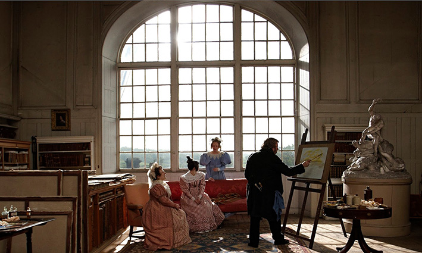

## **Klapbord**

De kunstenaarsfilm **Mr. Turner** is een werk van de Britse cineast Mike Leigh. Vooral samen met Ken Loach heeft Mike Leigh de Britse film op de wereldkaart gezet sinds de tweede helft van vorige eeuw. Tot zijn beste langspeelfilms behoren de films _Naked_ (1993), _Secret and Lies_ (1996), _All or Nothing_ (2002) en _Another Year_ (2010). Met **Mr. Turner** bereikt de filmkunst van Leigh een nieuw hoogtepunt. Dat blijkt in de eerste plaats uit de positieve respons op de film die zijn wereldpremière kende tijdens het 67ste Festival van Cannes (2014). Daar kreeg de hoofdrolspeler Timothy Spall de Prijs voor beste acteur, terwijl de film zelf een nominatie voor de Gouden Palm ontving. Daarnaast won Mike Leigh met **Mr. Turner** ook de BAFTA/ BRITANNIA Award voor Excellence in Directing. Voorts verwierf de film vier nominaties voor zowel de 87ste Academy Awards als de 68ste British Academy Film Awards. De film zelf hoort bij het genre van de historische, en in het bijzonder de biografische film. Toch is **Mr. Turner** niet in de volle zin van het woord een biopic. De film beperkt zich namelijk tot de laatste vijfentwintig levensjaren van de Britse schilder _Joseph Mallord William Turner_ (1775-1851), begraven in de Sint Pauls Cathedral. Veel meer dan een biopic oogt **Mr. Turner** vooral als een volwaardige Europese auteursfilm met een sterk historische dimensie. Mike Leigh nam niet alleen de regie voor zijn rekening, hij schreef ook zelf het scenario op basis van een accurate historische studie van de beschikbare bronnen. Leigh liet zich bijstaan door dr. Jacqueline Riding, kunsthistorica, historica, adviseur en auteur, gespecialiseerd in de epoche van koning George III (1760-1820).

## **Synopsis**

In september 1826 komt J.M.W. Turner terug thuis in Harley Street 64, Londen, na een bezoek aan de Lage Landen. Zijn huisgenoten, zijn vader, _Mr. William_, en de inwonende huishoudster, _Hannah Danby_, zijn erg blij hem terug te zien. Ze vreesden dat Billy, zo noemen ze hem, misschien was omgekomen bij de grote explosie in het kruitmagazijn te Oostende van waar hij geacht werd de boot te nemen. Vader William heeft een hartelijke relatie met zijn beroemde zoon-schilder. Ze hebben een sterke band. Ze werken ook intens samen. Vader William ondersteunt zijn zoon als een volleerde assistent kunstschilder. Hij zorgt voor de aankoop van de juiste pigmenten, maakt de verschillende kleuren klaar en spant de blanco schilderdoeken op. Op haar beurt zorgt Hannah voor het huishouden en ze ontvangt de gasten. Turner geniet als kunstschilder immers koninklijke waardering. Mecenassen uit de adellijke kringen en het milieu van de Londense hoge burgerij komen werk van hem kopen. Hannah is heimelijk verliefd op Turner en zoekt ook seksueel contact met hem. Af en toe gaat Turner op dat verzoek in, zij het onhandig. Hannah lijdt aan de huidziekte psoriasis. Turner concentreert zich _helemaal en zeer intens_ op zijn werk in zijn atelier te London. Hij schildert op basis van de schetsen die hij bij voorkeur maakt aan _de kustlijn van Margate, Kent_. Hij huurt daar een kamer met zicht op zee in het huis van _Sophia Caroline Booth_. Wanneer zij voor de tweede keer weduwe wordt, krijgen zij en Turner een vaste relatie. Om elkaar meer te kunnen zien, koopt Turner voor hen een huis in _Cheyne Walk, Chelsea,  West-Londen_ vlakbij de Thames. Niettegenstaande hij ouder wordt, blijft Turner zich _een hoog werkschema_ opleggen, dat ook fysiek veel van hem vergt. Hij maakt immers erg lange wandelingen langs de kustlijn om te schetsen. Hoge of lage temperaturen deren hem niet. Hij laat zich vastbinden aan de mast van een schip om het licht en de wolkenbewegingen te kunnen bestuderen tijdens een winterstorm. De ervaring gebruikt hij voor het doek _Snow Storm – Steam Boat off a Harbour’s Mouth_. Tijdens die ervaring in extreme weersomstandigheden, loopt Turner echter een zware bronchitis op. Geleidelijk verzwakt zijn hart. Dat komt niet alleen door de grote fysieke inspanningen. Bijna dagelijks maakt hij wandelingen in weer en wind van veertig kilometer. Ook _het verdriet_ weegt zwaar op zijn gemoed. Hij vertrouwt Sophia Booth toe dat hij zijn zusje heeft verloren toen hij acht was. Hij heeft bovendien twee van zijn klasvrienden in de lagere school aan de dood moeten afstaan. Zijn vader en hij hebben Turners moeder moeten laten opnemen in een psychiatrische instelling waar ze is overleden. Dat gebeuren heeft in het gemoed van Turner en zijn vader blijvende sporen getrokken. Tegelijkertijd wordt Turner regelmatig geconfronteerd met de tante van Hannah, _Sarah Danby_, met wie Turner ooit een korte seksuele relatie heeft gehad. Als ongehuwde moeder voort ze haar twee meisjes, Evalina en Georgiana, op in het huis van Turner met de bewering dat zij zijn dochters zijn. Ze speelt de meisjes uit om van Turner financiële steun te bekomen. Ze gaat daarbij agressief te keer. Dat neemt nog toe wanneer Georgiana in het kraambed overlijdt. Turner ontkent de vader te zijn van beide meisjes, maar hij wijst ze niet af. Die situatie bezwaart zijn gemoed. Wanneer Turners vader overlijdt, voelt Turner zich gedesoriënteerd. Hij vecht tegen zwaarmoedige gevoelens. Hij bezoekt de prostituee Eliza. Hij wil haar schetsen in een pose van een wanhopig jong meisje. Al schetsend overvalt hem in haar kamer een immens verdriet. Geleidelijk vindt hij toch terug een warme thuis bij mrs Booth. Ondertussen zet hij zijn sociaal leven verder. Een van zijn adellijke bewonderaars, _George O’Brien Wyndham, de 3de Graaf van Egremont_, nodigt hem graag uit om in zijn ruim Petworth House te verblijven en daar voor hem doeken van zijn domein te schilderen. Turner is al van 1789, op zijn veertiende, erkend lid van de prestigieuze Londense _Royal Academy of Arts_. Sinds 1796, het jaar waarin hij in de Royal Academy of Arts zijn eerste olieverf schilderij (_Fishermen at Sea_) tentoonstelde, werd hij geprezen als getalenteerde tekenaar en geniale schilder van _marines_ (zeezichten).  Op zijn vierentwintigste wordt hij al gekozen als associate van de Academy. Hij geniet er een groot prestige. Later beginnen sommigen zich te ergeren aan Turners toenemend hoekig gedrag en gaan sommigen hem zien als een oude meester uit een voorbije tijd. De nog jonge _Koningin Victoria_ laat openlijk haar afkeur voor Turners gedurfd later werk zien. De oude Turner ziet hoe in het theater met hem, zijn werk en zijn bewonderaars de spot wordt gedreven. Zelf blijft hij intellectueel zeer alert. Hij houdt lezingen voor zijn collega’s van de Academy over licht en kleur. Sinds 1840 is _John Ruskin_ die zich een naam verwerft als kunstcriticus, een grote fan van Turner. De schilder is trouwens een graag geziene gast bij de Ruskins. Turner is eveneens bevriend met _Mary Somerville_. Tegen de tijdgeest in, geniet deze geëmancipeerde vrouw die Turners werk bewondert, faam als natuurkundige vorser. Ze voert in Turners atelier wetenschappelijke experimenten uit met licht en kleur. Turner volgt trouwens de moderne ontwikkelingen in wetenschap en techniek op de voet. Hij heeft oog voor de komst van _het ijzeren stoomschip_ dat het houten zeilschip zal gaan vervangen. De stoomtrein doet zijn intrede, evenals _de fotografie_ waarmee Turner als een van de eerste kennis wil maken in de Londense studio van de Amerikaan John E. Mayall uit het Amerikaanse Philadelphia. Op zekere dag krijgt de oude Turner in zijn atelier bezoek van de rijke kunstmecenas _Joseph Gillot_, fabrikant van stalen pennen die in heel de wereld worden gebruikt. Hij wil Turner de ronde som van honderd duizend pond betalen voor alle werken ― schilderijen, aquarellen, tekeningen en schetsboeken. Turner weigert. Hij heeft testamentair vastgelegd dat zijn werken in eigen bezit ― 300 olieschilderijen op doek, circa 30 000 schetsen en aquarellen, waaronder 300 schetsboeken ― aan de Britse natie gratis toekomt, met als enige voorwaarde dat het voor alle burgers vrij toegankelijk wordt tentoongesteld. In 1851, op de drempel van de eerste naar de tweede helft van de 19de eeuw, de periode van de doorbraak van de Industriële Revolutie, overlijdt William Turner in het huis dat hij bewoont met zijn partner, Sophia Booth. Hij sterft er aan een hartfalen. In zijn laatste ogenblikken zegt hij: ‘_De zon is God._’

## **Cinematografie**

AUTHENTICITEIT. Wie het leven en werk van een schilder als William Turner wil verfilmen, staat voor een grote uitdaging. Mike Leigh heeft die uitdaging aangenomen. Hij werkte zeven jaar aan de voorbereiding van het project, dat is veel meer dan een masterstudent nodig heeft om een doctoraatsstudie te schrijven. Geconfronteerd met de uitzonderlijke hoeveelheid plastisch werk van Turner en met het feit dat diens privéleven niet zo goed is gedocumenteerd, heeft Leigh geopteerd om _een zo groot mogelijke authenticiteit_ te bereiken. Daarvoor alleen al engageerde hij _76 acteurs en actrices_ voor de evenveel rollen van historische personages te vertolken. Toch moest Leigh ook keuzes maken. Leigh koos ervoor om zich te beperken tot _de laatste vijfentwintig levensjaren_ van Turner. Vreemd genoeg is dat de periode waarin de faam van Turner begon te tanen en waarin Turner zelf zich meer en meer sociaal isoleerde. Vervolgens heeft Leigh beslist om _zowel de mens als het werk_ centraal te stellen. Na de studie van de beschikbare biografische data en vooral de studie van Turners schilderijen en schetsboeken, vroeg Leigh aan de Engelse acteur _Timothy Spall_ met wie Leigh al eerder werkte, gedurende twee jaar zich voor te bereiden op de opnames. Onder leiding van de leraar-schilder van portretten, Tim Wright, leerde Spall de techniek van het schilderen naar de werken van Turner. Strik biografisch beschouwd, zijn de data die direct betrekking hebben op de creatie van Turners werk, _zeer accuraat_: zijn omgang met andere schilders van de Royal Academy en mecenassen, zijn sterke band met criticus John Ruskin, de eerste en meest trouwe promotor van Turners werk, Turners experimenten met kleur en licht, diens interesse in natuurkundige experimenten met licht, zijn vele wandelingen en schetsen. Wat _het privéleven van Turner_ betreft, houdt Leigh zich aan de gekende feiten: Turner bleef ongehuwd, zijn moeder werd psychiatrisch opgenomen, zijn vader werd zijn voornaamste assistent en woonde bij hem in, zijn verborgen relatie met weduwe Booth op oudere leeftijd. In de film werkt Leigh vooral _de sterke band tussen Turner en zijn vader_ uit, en focust hij op _de sterke relatie tussen de schilder en weduwe Booth_. De scènes met de vader en met weduwe Booth behoren tot de sterke, dramatische momenten van scènes uit het privéleven van Turner. Voor _de scènes met Sarah Danby_ met haar twee dochters kon Leigh niet beschikken over harde feiten. Het verhaal over _het vermeende vaderschap_ van Turner kan niet meer worden geverifieerd. Turner zelf heeft dat vermeende vaderschap nooit bevestigd. Ten aanzien van _Hannah Danby_, die trouwe huishoudster die aan psoriasis lijdt, bewandelt Leigh een heel eigen pad waarvoor er geen biografische ondersteuning voorhanden is. Dat Hannah Danby veertig jaar de trouwe huishoudster van Turner was, valt buiten iedere twijfel. Leigh heeft zelf verklaard dat er voor zijn interpretatie van mogelijke seksuele relatie tussen Turner en Hannah geen enkele historische evidentie bestaat. De reden waarom Leigh toch voor die optie heeft gekozen, kan voortkomen uit _zijn historisch correcte visie op de tijdsgeest_ waarin Turner als kind en jongen is opgegroeid. Hij is namelijk geboren tijdens het bewind van koning George III (1760-1820) en hij is overleden tijdens het bewind van de nog jonge koningin Victoria (1837-1901). De eerste koning staat bekend als een vrij liberale koning en als ‘de gekke koning’ omdat hij leed aan hevige stemmingswisselingen. Dat blijkt ook uit het filmportret _The Madness of King George_ (1994) van Nicolas Hytner. Het Victoriaanse tijdperk daarentegen is alom gekend omwille van zijn strenge zeden en doorgedreven burgerlijke moraal. Wellicht speelde dit cultuurverschil mee in de weigering van koningin Victoria om Turner de eer van het ridderschap te verlenen, een weigering waaronder Turner leed. Leigh verwerkt beeldend die historische afstand tussen de koningin en de oudere Turner in de sequenties waarin de koningin de tentoonstelling van de Academy bezoekt. William Turner was inderdaad duidelijk _een kind van de Georgiaanse epoche_. Hij werd immers geboren en getogen in Maiden Lane, vlakbij de Londense wijk _Covent Garden_. Toen Turner opgroeide bij zijn vader, kapper en pruikenmaker, en bij zijn geesteszieke moeder, was Covent Garden _de libertijnse bohemienbuurt van Londen_ waar losse zeden de sfeer bepaalden. De Britse historicus Vic Gatrell wijdde er zijn onderzoek aan dat hij publiceerde in _The First Bohemians: Life and Art in London’s Golden Age_ (2013). Mike Leigh laat zien dat de oudere Turner terecht was gekomen in een heel ander Engeland, dat van het Victoriaanse met zijn strenge zeden. De sequenties met Hannah en Sarah Danby, en die met de jonge prostituee krijgen hun historische authenticiteit vanuit die cultuurwissel. De historische authenticiteit van **Mr. Turner** speelt ook mee in _de reconstructie van het kunstenaarsmilieu_ waartoe Turner behoorde. Zo is voor de film een historische trouwe reconstructie gemaakt van Turners _Queen Anne Street galerij_, de eigen galerij die Turner in zijn ruime woning had ingericht, alsook van _de historische zomertentoonstelling van de Royal Academy in 1832_. Daarnaast kent de film vooral _een esthetische authenticiteit_. Dat geldt namelijk voor de panoramische buitenopnames. De cinematograaf _Dick Pope_ brengt de unieke wijze waarop Turner in zijn werk het licht evoceert, over op de filmbeelden van de landschappen. Hierdoor kijkt de toeschouwer naar de lichtcomposities van het landschap op dezelfde wijze waarop Turner dit deed toen hij tijdens zijn wandelingen schetsen maakte. Pope kreeg van de jury van het Festival van Cannes terecht een speciale prijs voor de bijzondere cinematografie. Het werk van Pope voor **Mr. Turner** is hierdoor een sterk voorbeeld geworden van hoe _de Europese cinematografie zichzelf begrijpt als de voortzetting van de Europese schilderkunst met nieuwe middelen_, en omgekeerd toont **Mr. Turner** aan dat Europese schilders als Turner eigenlijk op dezelfde wijze naar de werkelijkheid keken als de kunst van de cinematografie, eigen aan de twintigste eeuw. Het waren cinematografen avant la lettre. Een ander aspect van de esthetische authenticiteit betreft _de vele scènes met doeken van Turner_. Bepaalde scènes bestaan uit een inzoom op een schilderij. Dat gebeurt bijvoorbeeld bij het doek _Snow Storm: Hannibal and his Army Crossing the Alps_ (1812), vandaag te zien in de Tate Galery. Een ander doek waarop de film inzoomt, is _Slave Ship (Slavers Throwing Overboard the Dead and the Dying. Typhoon Coming On_) (1840). Dit doek  krijgt veel aandacht, in het bijzonder wat het ontstaan ervan betreft. Dat blijkt uit de sequentie met mijnheer Booth, de tweede man van mevrouw Booth. Turner, de huurder van de kamer, maakt kennis met mijnheer Booth. Wanneer deze vertelt dat hij heeft gewerkt als scheepstimmerman, wekt dit Turners aandacht. Het eigenlijke onderwerp van het gesprek handelt over _de slavenhandel_ die de scheepstimmerman met eigen ogen heeft aanschouwd. Turner krijgt informatie uit eerste hand. Zijn doek _Slave Ship_ komt verder tweemaal ter sprake tijdens het gesprek met de Ruskins. De eerste keer in de eigen galerij van Turner terwijl de Ruskins het doek zelf ontdekken en de tweede keer handelt het gesprek in het huis van de Ruskins over het schilderij. De jonge John Ruskin zelf noemt het schilderij in aanwezigheid van Turner een meesterwerk en citeert respectvol de lange naam van het werk. Kort daarna werkt Turner in zijn atelier aan een nieuw werk, _Rain, Stea and Speed – The Great Western Railway_. Het tafereel van dit nieuwe meesterwerk dat de opkomst van de Industriële Revolutie uitdrukt, wordt nadien filmisch in het echt gereconstrueerd. Voor de schilderijen die in beeld komen, deed Leigh beroep op de Britse schilder _Charlie Cobb_. Hij kopieerde die schilderijen die in close-up in beeld komen. Voor die schilderijen die alleen op de achtergrond te zien zijn, gebruikte Leah gedrukte reproducties, bewerkt met een laag vernis. 

BIPOLAIR RITME. Turner is de onovertroffen grootmeester in het genre van de marines. Eigen aan zijn zeezichten is de beweging. Hij begreep door zijn jarenlange volgehouden observaties dat de zee nooit een stilstaande massa water is. De zee beweegt op het ritme van eb en vloed. Perioden van rust wisselen af met perioden van storm. Dat inzicht heeft Mike Leigh ook in zijn scenario verwerkt. _De film beweegt namelijk op het bipolaire ritme van enerzijds de menselijke schaal en anderzijds op de panoramische schaal_. Op de eerste staat de mens Turner centraal. Op die schaal situeren zich vooral _de binnenopnames_. Op de panoramische schaal staat de kunstenaar Turner centraal. Hij komt in beeld als de man die horizonten opzoekt zowel in het landschap als langs de kustlijn. _Dat bipolaire ritme ‘Turner de mens – Turner de schilder’_ geeft de film zijn eigenheid en eenheid. Leigh werkt niet met twee gescheiden werelden. Turner is _een buitenmens en een binnenmens_. Hij gaat naar buiten om al schetsend horizonten op te zoeken. Hij absorbeert impressies en brengt die mee naar binnen, in zijn atelier. Daar gebruikt hij zijn schetsen als grondstof voor zijn doeken. Helemaal in overeenstemming met de overgeleverde gegevens, regisseert Leigh het filmische leven van Turner volgens het bipolaire ritme ‘_naar buiten – naar binnen_’.  De film opent buiten. Turner schetst in Holland het landschap met molen. De film eindigt binnen. Turner ligt op zijn sterfbed. Zijn laatste gedachten gaan naar buiten, naar de zon.

De filmrecensies van de film, verschenen na de première, focusten _eenzijdig op ‘de man’_. Ze hadden geen oog voor het bipolaire ritme van de film. Dat komt mede door _de bijzondere en sterk gewaardeerde vertolking door Timothy Spall_. De scènes waarin de acteur de hoekige, grommende en morrende Turner neerzet, kregen veel aandacht en werden overbelicht. Die scènes werden geïsoleerd en kwamen op zich te staan. Hierdoor verloren de recensies _het gehele portret uit het oog_.

Leigh werkt helemaal _niet_ met de tegenstelling tussen de man en het werk. Om het hele plaatje te zien, is het noodzakelijk om oog te hebben voor het zachte hout achter de ruwe schors. Dat is wat Leigh zelf doet. De regisseur toont, helemaal in overeenstemming met de biografische gegevens, hoe de man die van geboorte tot de lagere klasse behoorde, _bijzonder intelligent_ was. Met _een open geest_ verkende Turner zijn omgang met de wereld van mensen en dingen, en verwerkte dit alles in zijn artistiek werk. De film toont niet de kindertijd, de jeugd en jong-volwassenheid van Turner. In die tijd schoolde Turner zichzelf voortdurend bij, onophoudelijk zelf. In de film brengt Turner hulde aan zijn vader als ‘_a man of high intellect_’ en hij voegt eraan toe dat zijn vader hem ‘_leerde lezen en schrijven_’. In de film beklemtoont Turners vader zelf het belang van de opvoeding: ‘_Education is an important thing._’ De film toont het resultaat van dat proces. De aandachtige toeschouwer ontdekt hoe Turner tot aan zijn laatste dagen van het tekenen en het schetsen _zijn eigen leerschool_ maakte. Via de kracht van zijn intelligentie, gekoppeld aan zijn artistiek talent, klom Turner omhoog op de maatschappelijke ladder en maakte hij vrienden in de hoogste kunstkringen. Dat gebeurde niet via een netwerk van relaties, maar uitsluitend via zijn talent dat steunde op _onophoudelijk werken_ en _een grote nieuwsgierigheid_ om bij te leren. 

Leigh legt terecht de nadruk op _Turners kennis van de taal_. Bij het zien van de film, is het voor niet-Engelstaligen van belang om niet alleen de onderschriften te lezen, maar ook en vooral te luisteren naar de bijzondere taal die Turner spreekt. Hij spreekt in _een beknopte, maar beeldrijke taal met regelmatige verwijzingen naar de Grieks-Romeinse mythologie_. Tijdens het lichtexperiment van mevrouw Somerville noemt Turner de beweging van het zonlicht ‘_het machtige hemelse gebied van Apollo_’ (‘_As mighty Apollo moves across his heavenly tract_’). Nadien beschrijft hij het gelaat van mevrouw Booth  met de trekken van een Grieks beeld van Aphrodite. Hij bevestigt tegenover mevrouw Booth dat hij ‘_vertrouwd is met het Griekse beeld_’. Voorts omschrijft hij de slaap met de uitdrukking ‘_zich werpen in de armen van Morpheus_’ ('_I’m gonna throw myself into the arms of Morpheus_’), verwijzend naar de Griekse god van de dromen. In een andere scène noemt hij de slaap ‘_the Kingdom of Hypnos_’. In de Griekse mythologie is Hypnos de god van de slaap en de vader van Morpheus. In een andere scène noemt hij de zon _Helios_, de zonnegod uit de Griekse mythologie. Tegenover de voorzitter van de Royal Academy of Arts, mr. Shee, noemt hij de tentoonstelling ‘_a splendid cornucopia_’ (Hoorn des overvloeds), opnieuw een verwijzing naar een gegeven uit de Griekse mythologie.

Zo blijkt dat Turner _de toenmalige neoklassieke tijdgeest_ persoonlijk had geabsorbeerd. Hij deelde met andere intellectuelen van zijn tijd _de bewondering voor de oud-Griekse cultuur_. Het vroege negentiende-eeuwse _neoclassicisme_ kende in de westerse wereld een grote bloei. Dat blijkt uit de neoklassieke architectuur voor grote, officiële gebouwen in Frankrijk, Engeland en in de jonge Verenigde Staten van Amerika. Ook in de wereld van de schilderkunst bekleedden ‘de academici’, invloedrijke posities, ook in de Royal Academy of Arts. De groep van ‘de academici’ vertegenwoordigden _de standaard van klassieke schoonheid_, te vinden in de oud-Grieks-Romeinse beeldkunst. Mede door de invloed van de Duitse kunsthistoricus en archeoloog, _Johann Winckelman_ (1717-1768) gold in intellectueel Europa op het einde van de achttiende en begin negentiende eeuw de statische en symmetrische Grieks-Romeinse kunst en architectuur als de blijvende standaard van hoogste schoonheid. Dat speelde ook mee in vorming en onderwijs waar de studie van de klassieke filologie in de negentiende eeuw het hoogste aanzien genoot. De film laat zien hoe de zowel gerenommeerde als controversiële kunstenaar Turner zich die neoklassieke cultuur had toegeëigend. Reeds vroeg in zijn carrière had de jonge Turner trouwens tekenles gegeven aan de Royal Academy aan de hand van plasteren kopieën van antieke beelden. Die waren in het kader van _de neoclassicistische mode_ zeer verspreid.

Turner maakte zich tegelijkertijd ook _de groeiende romantische beweging_ eigen. Die beweging corrigeerde als tegenbeweging de meer rationele neoklassieke stroming. De film **Mr. Turner** besteed terecht aandacht aan de historische figuur en tijdgenoot van Turner,_John Constable_ (1776-1837). In de Engelse schilderkunst wordt hij beschouwd als de voorloper van de romantische schilderkunst in Engeland en Frankrijk. Zijn doel was om _de levende natuur en het concrete landschap als de enige leermeester van zijn werk_ te zien. Ook Turner maakte van het landschap zijn werkterrein. Constable en Turner hadden een gemeenschappelijke referentie, _het werk van de Franse schilder Claude Lorrain_ (1602-1862). Die plaatste als eerste zijn personages, die hij ontleende aan de oud-Grieks-Romeinse cultuur, in een realistisch landschap.

Mike Leigh reconstrueert in **Mr. Turner** het historische _‘rode boei-incident’_ waarbij Turner en Constable betrokken waren. Het vond plaats tijdens de voorbereiding van de tentoonstelling in de gebouwen van de Royal Academy of Arts. Het schilderij _Helvoetsluys – The City of Utrecht, 64, Going to Sea_ van Turner en het doek _The Opening of Waterloo Bridge_ van Constable gingen er in de grote zaal naast elkaar. In de filmscène loopt Turner naar zijn schilderij, waarna hij zich naar Constable wendt die druk doende is met het aanbrengen van nog enkele details aan zijn schilderij waarin de kleur rood erg domineert. De mannen begroeten elkaar formeel. Beiden zijn immers niet de beste vrienden, ze zien zichzelf als concurrenten. Turner loopt door de verschillende zalen van de tentoonstellingen en begroet zijn collega’s en bestuursleden van de Academie. In korte, gebalde zinnen drukt hij zijn waardering en collegialiteit uit. Hij participeert gezwind aan het gebeuren, maar relativeert het ook. Uit het tafereel blijkt ook hoe verschillende aanwezigen Turner waarderen en achten. De pointe van het tafereel is de scène waarin Turner weer naar zijn grijs getinte _Helvoetsluys_ toestapt, nu met een schilderskwast, terwijl Constable nog steeds aan het worstelen is met het rood op zijn _The Opening of Waterloo Bridge_. Met een krachtig, precies gebaar werpt Turner een klad rode verf op het doek, waarna hij zonder iets te zeggen de grote zaal verlaat. De academici onder leiding van de toenmalige voorzitter van de Academie, _Sir Martin Archer Shee_, kijken met grote ogen naar het Turners schilderij. Ook Constable. Er ontstaan verschillende meningen. Shee vindt dat Turner een meesterwerk heeft verbrod, anderen vinden dat Turner goed weet wat hij doet. In de algemene verbijstering, trekt de verbolgen Constable zijn jas aan en terwijl hij aanstalten maakt om weg te gaan, zegt hij, geërgerd, over Turner: ‘_Hij is hier geweest en hij vuurde een schot af._’  De controverse over Turners ‘rode’ tussenkomst loopt op en Shee noemt Turners actie ‘_pure madness_’. Kort daarna, komt Turner opnieuw de grote zaal in. Hij gaat direct naar zijn schilderij en hervat zijn actie. Met zijn duim en een lap stof verandert hij de klont rode verf op het doek in _een dobberende boei in het water_. Wanneer iedereen beseft wat er is gebeurd, roept Shee: ‘_Bravo, bravo._’ Turner demonstreerde voor zijn collega’s en het bestuur van de Academie zijn geniaal talent en zijn doorleefde visie over hoe de schilder het licht en de bewegende dingen in het golvende water kan evoceren. 
Turner ging dan ook zijn eigen unieke weg, tegen de stroom in van de heersende academische stijl in de kunst en kunstopleidingen. Hierdoor was hij in Europa _een echte pionier in de vrije kunststijlen_ die pas eind negentiende en begin twintigste eeuw zouden doorbreken.

Turners intellectuele standing blijkt uit zijn vriendenkring waartoe de historische leden van de _Londonse Royal Academy of Arts_ behoorden. Hij frequenteerde mensen als de jonge _John Ruskin_ en diens ouders, de Londense architect _Sir John Soane_ en schilders als _Benjamin Haydon_. Ofschoon hij van lagere komaf was, liet Turner zich niet intimideren door de leden van de hogere kringen. Hij bleef zichzelf en drukte zich uit in zeer gevatte, korte zinnen die ook getuigden van een persoonlijk gevoel voor humor. Zo reageert hij bijvoorbeeld op de kritiek van de heer Lenox dat Turners werk ‘_onduidelijk, vaag_’ is, gevat met: ‘_You should tell Mr Lenox that indistinctness is my forte_’. Wat in de ogen van anderen een gemis lijkt, daarvan maakt Turner zijn handelsmerk.

Wat de beheersing van de taal betreft, uitte Turner zich ook in _gedichten_. Naar het einde toe van de film, schildert hij in het atelier in het Chelsea huis dat hij samen met mevrouw Booth bewoont. Terwijl hij het doek _Norham Castle, Sunrise_ aan het schilderen is waarbij mevrouw Booth hem assisteert, draagt hij voor haar zijn liefdesgedicht _Be still, my dear Molly, be still_ voor. De regisseur heeft het gedicht gevonden in Turners vele notitieboekjes die vandaag worden bewaard in de Londense Tate Gallery. In de film krijgt het doek _The Slave Ship_ ― de oorspronkelijke titel luidde _Slavers Throwing overboard the Dead and Dying-Typhoon coming on_ ― heel wat aandacht. Terecht toont de film dat het doek zich nog in Turners atelier bevindt waar hij het in 1840 schilderde. Vader en zoon Ruskin bezoeken het atelier en zijn erg onder de indruk. John Ruskin werd de eerste eigenaar. Turner, een pleitbezorger van het Britse abolitionisme dat zich keerde tegen de slavenhandel, stelde het doek voor het eerst tentoon tijdens de grote Londense _World Anti-Slavery Convention_. Die vond er plaats in 1840 onder voorzitterschap van de jonge prins Albert, de echtgenoot van koningin Victoria. Naast het schilderij plaatste Turner toen enkele regels van een gedicht dat hij reeds in 1812 had geschreven. Opnieuw blijkt dat de intellectueel Turner een erg taalvaardig was.

Hoezeer Turner zich ook vrij en vlot bewoog in het intellectuele landschap van de taal, toch relativeerde hij het medium in relatie tot _het vermogen ervan om het echte mysterie van het bestaan te vertolken_. Dat toont Mike Leigh gevat in de sequentie ten huize van de Ruskins. Turner luistert er aandachtig naar een intellectueel hoogstaande conversatie over de schilderkunst van maritiemes. John Ruskin zwaait de lof over Turners kunst en zijn schilderij _Slave Ship_, nu in het bezit van Ruskin. De jonge, ambitieuze kunstcriticus stelt dat de kunst van Claude Lorrain, geplaatst tegenover die van Turner, schraal overkomt. Turner luistert aandachtig en komt slechts tussen om Lorrain een genie te noemen en om de conversatie af te breken door John Ruskin en het gezelschap terug met beide voeten op de grond te zetten. Hij vraagt droogjes of hij mijnheer Ruskin een ‘_enigszins moeilijk_’ probleem mag voorleggen. Hij vraagt hem namelijk of hij eerder een pastei van biefstuk en nier dan wel een pastei van kalfsvlees en hesp prefereert. Hiermee relativeert hij _de waarde van het zuiver verbaal en intellectueel spreken over het artistieke beeld_. Dit laatste, het beeld zelf, blijft in de optiek van de intellectueel en kunstenaar Turner _de alfa en omega_. Het intellectuele spreken, de taal van de geleerden, heeft een relatieve waarde op voorwaarde dat ze geen doel op zich wordt en zich steeds beweegt in verbondenheid met het beeld zelf, haar oorsprong en blijvende inspiratie. Tegelijkertijd herinnert Turner er het gezelschap aan dat het misschien tijd is om iets te eten. Voor hem staat _het eten_ hier als de blijvende verbondenheid van de mens met zijn lichaam en met het leven zelf. Ieder spreken, hoe geleerd ook, ontleent daaraan zijn betekenis. _De taal ontspringt aan de bron van het leven en keert er altijd naar terug_. 

Mike Leigh vervolledig het portret van de intellectueel Turner nog via _de muziek_. Hij toont hoe Turner zich ook in dat domein op eigen wijze beweegt. Er komt een sterke muzieksequentie voor tijdens het bezoek aan Turner aan zijn belangrijke mecenas, Lord Egremont. In de scène luistert Turner aandachtig naar _miss Coggins_ aan de piano. Na het stuk feliciteert Turner haar in zijn gebruikelijke, gebalde stijl, maar vol attentie: ‘_Exceedingly beautiful_’. Hij herkent de melodie maar kan ze niet noemen. Miss Coggins vertelt hem dat ze de _Pathétique_ heeft gespeeld, de pianosonate nr. 8, opus 13, van Beethoven. Turner vertrouwt miss Coggins toe dat hij bijzonder veel van de muziek van _Henry Purcell_ houdt. De vrouw bevestigt dat ook zij die liefde deelt en ze zet _Dido’s Lament_ in. Turner herkent direct de muziek en begint onhandig maar zeer doorleefd de tekst te zingen, daarbij geholpen door miss Coggins. Tekst en muziek drukken een diep verdriet uit (‘_a song of lost love_’), een blues waarin Miss Coggins en Turner elk hun eigen persoonlijk verdriet leggen. Opmerkelijk daarbij is dat Leigh de scène met de piano plaatst vlakbij de wand waar enkele doeken met landschappen van Turner hangen. De expressie van het verdriet via de muziek krijgt haar visuele echo in de schilderijen. De scène vertolkt hoe de menselijke communicatie tussen mensen over wat hen in hun diepste wezen heeft geraakt, _eerder_ via muziek en beelden dan via verbale mededelingen geschiedt.

Leigh verrijkt het intellectueel portret van de historische Turner nog met enkele krachtige scènes waaruit blijkt hoe Turner zich ook _de christelijke cultuur_ heeft eigen gemaakt. Vooral in de scènes met de historische collega-schilder _Benjamin Haydon_ zet Leigh die christelijke dimensie in de verf. Dat gebeurt hier via de opstap van een schilderij, namelijk het doek _Heilige Sebastiaan getroost door een engel_ van de Vlaming Gerard Seghers. Het is Turner die zijn twee collega’s, de schilder Haydon en de beeldhouwer Carew de legende van de martelaar Sebastiaan uitlegt en daarbij verwijst naar de nieuwtestamentische parabel van _de Barmhartige Samaritaan_. Het Sebastiaan-schilderij is de intro tot de bijzondere relatie tussen Haydon en Turner als een van de leidmotieven van het filmverhaal. Uit dat verhaal blijkt hoe Turner optreedt als een barmhartige Samaritaan tegenover zijn collega Haydon die zich miskend voelt door de kunstscene, zich in financiële nesten werkt, wegens schulden gevangenisstraf oploopt en uiteindelijk zelfmoord pleegt.

Leighs rijk geschakeerd filmportret van de schilder Turner als intellectueel doet niet alleen recht aan de historische figuur zelf,maar nog meer aan diens werk. Via _het filmische ritme ‘buiten-binnen’_ laat Leigh de toeschouwer toe een vermoeden te krijgen van de diepe inwendige bron van Turners inzichten en emoties, bron van zijn unieke kunst.

## **Betekenisruimte**

LEVENSBESCHOUWING IN HET TEKEN VAN HET LICHT. De Londense National Gallery noemt William Turner ['the painter of light’](http://www.nationalgallery.org.uk/artists/joseph-mallord-william-turner). Dat is helemaal terecht. In geen enkel oeuvre uit de rijke westerse schilderkunst onderhoudt zo een intense relatie met de bron ervan, _het mysterie van het licht_. Dat mysterie krijgt in het derde deel van [Levensbeschouwing democratisch belicht](http://www.menstis.be/uitgeverij/Levensbeschouwing) de naam _Lichtaard_. Mike Leigh doet de historische Turner als _de grootmeester van de Lichtaard_ alle eer aan. Dat komt in de eerste plaats door beroep te doen op zijn vaste Britse cameraman _Dick Pope_ die voor zijn werk een Oscarnominatie voor beste cinematografie ontving. Opgenomen met een digitale camera, slaagt Pope van de eerste panoramische beelden erin de toeschouwer naar het landschap en de horizon te laten kijken met de ogen van Turner. Vooral de panoramische beelden hebben de signatuur van de schilderijen van Turner. De situatie waarin bepaalde schilderijen, zoals _Rain, Steam, and Speed – The Great Western Railway_, zijn ontstaan, zijn in situ gereconstrueerd. Daarbij heeft Pope vooral heel veel zorg besteed aan _de registratie van licht_ zoals Turner het heeft overgebracht op zijn doeken. Pope en Leigh maken van **Mr. Turner** _een studie in de kunst van de cinematografie_. Ze laten zien hoe _de cinematografie de ultieme lichtkunst_ is die voortbouwt op die van de grootmeesters van de Europese schilderkunst. Ze verbinden namelijk het werk van Turner aan dat van _Johannes Vermeer_ (1632-1675) en _Caspar David Friedrich_ (1774-1840). De eerste is de grootmeester van _het invallende interieurlicht_. Leigh-Pope herinneren eraan in het portret van mrs Booth bij het raam in de scène met de laatste dialoog tussen haar en Turner. Het onderwerp is dat van de echte menselijke schoonheid die voortkomt uit de kracht van het innerlijk. _Friedrich_, die slechts een jaar ouder was dan Turner, is _de Europese grootmeester van de spirituele landschappen_, de bezielde panorama’s met bijna onzichtbare menselijke figuren of met menselijke personages die hij schildert op de rugzijde kijkend naar de horizon. **Mr. Turner** brengt beide grootmeesters van het licht, Vermeer en Friedrich, samen in het portret van _het negentiende-eeuwse genie van het licht_. Tegelijkertijd legt de film ook zelf direct een verband tussen de schilderkunst van Turner en de kunst van de cinematografie. Dat gebeurt concreet in het tafereel dat zich situeert in de galerij die Turner in zijn eigen huis had ingericht. In die galerij ontving hij kunstminnende bezoekers, zoals de Ruskins. Turner organiseerde hun bezoek als _een bioscoopbezoek avant la lettre_. Eerst liet hij de bezoekers even wachten in een donkere antichambre. Na enkele minuten werd de deur naar de galerij geopend. Die baadde in het volle licht dat rijkelijk viel op de schilderijen die zelf een ode aan het licht zijn. Dit historisch correct tafereel toont heel goed aan hoe Turner in de eerste helft van de negentiende eeuw reeds cinematografisch dacht.

Turners _licht-oeuvre_ speelt niet alleen mee in de talrijke buitenopnames van **Mr. Turner**, maar ook in de vele binnenopnames ervan. Dat gebeurt in talrijke taferelen waarin Leigh toont hoe de denker Turner voortdurend bezig is met _zijn eigen onderzoek naar het licht_. Dat geldt bijvoorbeeld voor het tafereel waarin via toedoen van mrs Somerville het atelier van Turner verandert in _een labo voor een natuurkundig onderzoek naar de gedraging van het licht via het spectrum_. Tijdens dat experiment noemt mrs Somerville het licht ‘_God’s good sunlight_’. Die gedachte resoneert in de laatste woorden, volgens de overlevering, van Turner op zijn sterfbed: ‘_The sun is God_’. Daaruit blijkt Turners religieuze beleving van het zonlicht dat het leven op aarde voortbrengt. Die beleving echoot in het gesprek tussen Turner en mrs Somerville over het universum als ‘_a wondrous thing_’. Turner bevestigt mrs Sommerville haar sterk geloof ‘_that all things on this earth are connected. Nothing exists in isolation._’ Eén van de basisbetekenissen van het woord religie is verbondenheid, aanwezig in het Latijnse _religare_ dat staat voor _binden, verbinden_. Iemand als kerkvader Augustinus werkte reeds met die verbindende basisbetekenis van het woord religie. In **Mr. Turner** is het duidelijk dat Turner die zich daarbij helemaal op dezelfde lijn als mrs Somerville bevindt, die verbindende basisbetekenis opzoekt in _het mysterie van het zonlicht_ in al zijn schakeringen zoals die zich in beweging voordoen aan de aardse beschouwer. Bij het zien van het effect van het lichtexperiment van mrs Somerville zegt Turner: ‘_The majesty of mystery_’. Het licht en de werking ervan vormen inderdaad voor Turner _de grootsheid van het mysterie van de Lichtaard_. Tegenover mrs Sommerville verduidelijkt hij nog dat de zuiverheid van haar natuurkundige prisma en wat hij ‘_the contamination_’ (besmetting, onzuiverheid) van zijn palet noemt, elkaar aanvullen. Er is het natuurlijke heldere licht en er is het zwart. ‘_Wit is de macht van het goede, zwart de duivel._’ Met die religieuze taal bevindt Turner zich heel dicht bij de anonieme auteur van het _Bijbels Scheppingsverhaal van Genesis 1-2,4a_, in _Levensbeschouwing democratisch belicht_ uitvoerig in relatie gebracht met de notie van [de Lichtaard]( http://www.menstis.be/uitgeverij/Levensbeschouwing). Turners hele leven en werk beweegt zich binnen de levensruimte van de Lichtaard. Wat dat voor hem inhoudt, vertelt Turner in de film zelf tijdens een schildersessie in het grote Petworth House van zijn mecenas Lord Egrement. Lady Stuckley is samen met twee opgroeiende meisjes getuige van de sessie. Terwijl hij aan het schilderen is, ontspint er zich een conversatie met de dames. Die handelt over het onderscheid tussen het schilderen van een zonsopgang en een zonsondergang. Turner verduidelijkt dat heel wat natuurelementen de lichtinval van het zonlicht mee bepalen. Het zonlicht is met andere woorden altijd betrokken op het aardse leven in al zijn componenten zoals de weersomstandigheden, de vochtigheid, de wind, de breekbaarheid, enzovoort. Dat inzicht motiveert Turner om onvermoeid op onderzoek uit te gaan. Al schetsend wandelt hij bijna iedere dag opnieuw in het landschap of langs de kustlijn, terwijl hij de aanwezigheid van het licht aan de hemel (‘_mighty Apollo’s heavenly tract_’), in het wolkendek, op de opspattende golven of de glooiende heuvelruggen intens beschouwt. Turner vertelt de jonge dames dat terwijl zij nog ’s morgens in bed liggen, hij al buiten is om nog voor de leeuwerik bevoorrechte getuige te zijn van de ongeschonden zonsopgang. Daarnaast is er nog het tafereel van de lezing. Het situeert zich in _de aula van de Royal Academy of Arts_. Turner is er de spreker. Voor een volle zaal geeft Turner een lezing over _de lichtbreking op transparante lichamen zoals bijvoorbeeld water, gekleurd glas of spiegelglas_. Hij legt daarbij de nadruk op het vermogen van water om de werking van het natuurlijk licht te versterken. Hieruit blijkt hoe Turners _onderzoekende houding_ in _het grootse labo van de aarde zelf_ de bron is van zijn inzichten in het mysterie van de Lichtaard. 

Turner verschijnt in **Mr. Turner** als het model van _de beschouwende mens_. De schilder van het licht onthult iets van het grote gave van de mens. Die bereikt immers zijn diepste wezen in _de praxis van de levensbeschouwing_. De schilder Turner beoefent die praxis op een geniale wijze. Hij vertaalt die in zijn schilderen. Hierdoor kan iedere aandachtige toeschouwer van Turners doeken nog steeds deel hebben aan die unieke praxis van levensbeschouwing. In het tafereel met het lichtexperiment van mrs Somerville ontstaat er een dialoog tussen wetenschap (fysica) en kunst. Opmerkelijk is dat de natuurkundige met lof spreekt over de visie die spreekt uit de schilderijen van Turner. De aanleiding is een gesprek over licht en kleur. Voor de natuurkundige is kleur absoluut, terwijl voor Turner kleur contradictorisch is. Hij verduidelijkt zijn inzicht in kleur gebald met de woorden ‘_subliem maar contradictorisch, en toch harmonisch_’. Daarop reageert mrs Somerville dat Turner ‘_a man of great vision_’ is. Ze licht haar punt toe: ‘_The universe is chaotic and you make us see it._’ In de spiegel van het werk van Turner en van de film **Mr. Turner** kunnen we vandaag zeggen dat Turner de kunst van de levensbeschouwing als geen andere in de eerste helft van de negentiende eeuw heeft beoefend. Vanuit een intens, volgehouden contact met het mysterie van het licht dat alles wat tot het leven op aarde behoort, letterlijk aan het licht brengt, creëerde Turner zijn unieke schilderijen. In zijn levensbeschouwelijke praxis bracht hij het onophoudelijk variërend samenspel van de zeegolven en het hemellicht op de voorgrond. Zo werkte Turner die nooit aflatende dynamiek uit tot _een complexe levensmetafoor_. Hierdoor worden zijn schilderijen ramen waardoor de mens schouwend in contact komt met de grote werkelijkheid waarvan hij zelf een deel vormt. In die zin is Turner een voorloper van de _(postmoderne) filosofie van het leven_ zoals die in het werk van _Friedrich Nietzsche_, een generatie na Turner, voor het eerst werd verwoord. Tegelijkertijd kondigt het werk van Turner aan dat die levensbeschouwelijke kunst en _de nog te ontwikkelen nieuwe of moderne fysica_ elkaar zouden vinden in een zelfde mentale ruimte. Dat is effectief gebeurd in het begin van de twintigste eeuw via _Einsteins relativiteitstheorie en de kwantummechanica van Niels Bohr en Werner Heisenberg_. Die gedeelde levens- en lichtruimte staat in het teken van _de relativiteit_, het kosmische fenomeen dat op aarde openheid en verbondenheid waarborgt, ook in de mensenwereld.

KUNST ALS ZOWEL SPIRITUEEL ALS DEMOCRATISCH STATEMENT. De titel van de film is **Mr. Turner**. De ‘Mr.’ heeft een betekenis. Mike Leigh legt er vanaf het begin de nadruk op dat Turner nooit door het Britse koningshuis geëerd is met een adellijke titel. Het is dus niet Sir Turner. Leigh maakt van Mijnheer (Mr.) een eretitel. Dat is _een democratisch statement_. Het verduidelijkt hoe vanuit de zowel spirituele als intellectuele kracht van het gewone volk genieën kunnen voorkomen. Dat geldt zeker voor Turner. Daarbij legt Leigh terecht de grote nadruk op de sterke band tussen vader en zoon Turner. De zoon, William, brengt in de film hulde aan zijn vader. Die heeft in zeer moeilijke levensomstandigheden zijn zoon opgevoed. Hij heeft hem leren lezen en schrijven, en hij heeft het kind de ruimte gegeven om zijn natuurlijk tekentalent in vrijheid te ontplooien. Een ander aspect van dat democratisch statement van Mr. Turner is _Turners doorleefde aandacht voor het menselijke lijden_ dat hij uitdrukt in zijn werk. Het schilderij _The Slave Ship_ komt in de film herhaaldelijk ter sprake. Voorts is er het schrijnende tafereel waarin Turner de jonge prostituee schetst. De visuele echo ervan werkt nog door naar het einde van de film, waarin de doodzieke Turner toch nog zijn huis uitkomt om het aangespoelde lijk van een jonge vrouw te schetsen. In beide gevallen toont Turner via zijn schetsen _zijn doorleefde blijk van medeleven_. Turner wil als mens en als kunstenaar participeren in het menselijke lijden waarmee hij zelf vertrouwd is. Hij wil als het licht zijn dat alles, ook het pijnlijke of het donkere, in zich opneemt. _Die lijfelijke verbondenheid met het lijden_ werkt door in het deelverhaal van Turners collega Haydon, evenals in het tafereel Turner en miss Coggins aan de piano met _Dido’s Lament_ van Purcell. Bij dit alles is het opmerkelijk dat Turner de tragiek van het menselijk leven opneemt in _de levensmetafoor van de zee_, eigen aan het genre van de maritime. Turner schildert de zee niet als een waterlandschap. Hij is niet uit op een zuiver esthetische evocatie van het aardse fenomeen van de grote zeeën. Via zijn volgehouden schetsend onderzoek ontwikkelt hij _de spirituele betekenis en de levensbeschouwelijke draagwijdte_ van de zee. Hij werkt dat beeld uit tot _een levensmetafoor_. De zee is niet enkel de watermassa, het is evenzeer de horizon met het spel van de wolken in de lucht, de rust van de stilte en het gebulder van de storm; het is ook het spel van het licht op de golven, in de regie van de getijden, zelf het werk van de planetaire krachten die voortkomen uit de bewegingen van zon en maan. In die complexe levensmetafoor van de zee, in dat visuele narratief van de zee, komt ook de aanwezigheid van de mens voor, de moderne mens die geschiedenis schrijft op het golvende blad van het leven zelf. Hij schrijft die geschiedenis met het schip dat hij over de zeeën stuurt. Met het slavenschip maakt de moderne mens van de oceaan een zee van lijden. In de film is er ook sprake van Turners _The Battle of Trafalgar, 21 October 1822_,  met Lord Nelson’s _Flagship, The Victory_. Turner schilderde het in opdracht van koning George IV. In de film vertelt het personage van Turner dat hij er twee jaar heeft aan gewerkt maar de koning het schilderij niet waardeerde. De reden daarvoor ligt voor de hand. Turner leverde geen heroïsch tafereel af. Hij maakte er een studie van over de donkere wil van de moderne mens die een geschiedenis van oorlog en geweld schrijft op de bladzijden van het fluïde levensboek.

Een belangrijk aspect van Turners democratische levenshouding als kunstenaar blijkt uit het historisch getrouwe tafereel van **Mr. Turner**. Het situeert zich in Turners eigen galerij waar mecenas Gillott de schilder voorstelt om al zijn nog aanwezig werk op te kopen. Tijdens zijn leven kocht Turner ook schilderijen die hij eerder had verkocht, terug en bewaarde ze in zijn eigen galerij. Turner weigerde Gillotts gul aanbod. Zoals blijkt uit het tafereel in de film, besliste de kunstenaar om de grote hoeveelheid schilderijen en schetsen in zijn bezit _testamentair_ over te dragen aan het Engelse volk met als enige voorwaarde dat het samen zou blijven en voor het publiek vrij toegankelijk zou worden tentoongesteld in de National Gallery. Die nalatenschap, de grootste kunstdonatie ooit, heet officieel _[The Turner Bequest](https://www.nationalgallery.org.uk/paintings/history/the-turner-bequest)_. Het grootste deel van de nalatenschap bevindt zich heden in de Clore Gallery in Tate Britain. Een aantal werken bevindt zich in de National Gallery. 

  

## **Context**

De film **Mr. Turner** ging in première in 2014. In 2016 koos de Britse bevolking met een kleine meerderheid voor de _Brexit_. Die twee gebeurtenissen hebben op zich niets met elkaar te maken. Anderzijds werpt **Mr. Turner** wel een bijzonder licht op _het fenomeen Europa_. De film brengt een belangrijk gegeven uit de collectieve herinnering onder de aandacht. **Mr. Turner** demonstreert _de relativiteit van de nationale grenzen_. Nog voor het ondenkbare werkelijkheid zou worden in de twintigste eeuw, de twee Wereldoorlogen, liet Turner zien dat de kunst zelf alle nationale grenzen overstijgt. De film opent in _Nederland_. Het incident met de rode boei handelt over het schilderij _Helvoetsluys – The City of Utrecht, 64, Going to Sea_, opnieuw een verwijzing naar Nederland. Als autodidact reisde Turner Europa rond. Tijdens zijn verblijven in Italië werkte hij in een atelier in _Rome_ en zocht hij de landschappen in en rond Rome op die Claude Lorrain hadden geïnspireerd. In de periode dat **Mr. Turner** zich situeert, het laatste deel van Turners leven, reisde de schilder  herhaaldelijk naar _Venetië_ waar hij de combinatie van architectuur, water en licht intens bestudeerde. In zijn carrière maakte hij, behalve in Nederland, ook nog schetsen en aquarellen in _Frankrijk, Griekenland, België en Zwitserland_. In zijn testament noteerde Turner dat zijn schilderijen _Dido building Carthago_ en _Sun Rising through Vapour_ zouden worden gehangen naast _Landscape with the Marriage of Isaac en Rebecca_ van Claude Lorrain, de Franse schilder die het grootste deel van zijn leven in Italië verbleef, vooral in Rome waar hij werkte en ook is gestorven. Turner beschouwde hem over de generaties heen als zijn echte leermeester. Voor kunstenaars als Lorrain en Turner is _de aarde de bakermat van het leven, en is het licht een sacrale werkelijkheid_. Voor beiden zijn de landen met hun grenzen erg relatief, gezien vanuit de levensbeschouwelijke Lichtaard. Tijdens het leven van Turner, in de eerste helft van de negentiende eeuw, werden in Europa de kiemen gelegd voor _de ideologie van het nationalisme_. Die ideologie zou in de tweede helft van de negentiende en de eerste helft van de twintigste eeuw uitgroeien tot een monster dat de Europese volkeren tegen elkaar zou opzetten. Turner oversteeg die ideologie nog voor ze helemaal tot wasdom kwam. Hij plaatste er _de praxis van de levensbeschouwing_ tegenover. Die praxis is niet onder de noemer van enige ideologie te vangen. Ze beoefent een universele, religieuze zienswijze met als focus de Lichtaard, het verbindende hemelse licht dat geen landgrenzen kent en de mens vormt tot de beschouwer van _de grote, religieuze Gave_ die hem is gegeven. De Brexit zet een grote stap terug. Het komt voort uit een kortzichtigheid die helemaal vreemd is aan de Londense Europeaan Turner. Misschien is het een troost te weten dat de stad London tegen de Brexit heeft gestemd.

**Mr. Turner** evoceert een belangrijk hoofdstuk van de Europese cultuur, namelijk dat van _de romantische stroming_ van eind achttiende en begin negentiende eeuw. Die stroming is erg relevant voor een goed begrip van de hedendaagse cultuur. De romantische stroming vormt immers de bakermat van wat we sinds de jaren zestig van vorige eeuw _de postmoderne cultuur_ noemen. In de ontwikkeling van de romantisch stroming hebben de literaire kunst van de poëzie en de schilderkunst een hoofdrol gespeeld. William Turner heeft in die optiek een werk van eerste categorie gerealiseerd. Kenneth McConkey noteert in zijn studie over _het impressionisme_ in Groot-Brittannië, verschenen in _Landschaft im Licht_ (1990, 123), dat het pas in het begin van de twintigste eeuw begon door te dringen in Europese kunstkringen dat het Franse impressionisme was ontstaan op de hoeksteen van Turners werk. Maar Turners kunst overstijgt de kunsttheorie en haar soms ijdele discussies over stijlen. Turner is nooit bezig geweest met stijlconcepten. Hij onderzocht _de indrukwekkende lichtruimte_ waarin al wie en wat leeft, eenmalig beweegt. De film van Mike Leigh herinnert aan de unieke persoonlijkheid van Turner en de geniale expressie van zijn werk. Zijn onderzoek naar het licht is pas in de twintigste eeuw opgenomen in de natuurwetenschappen, met name door _Albert Einstein_. Hij heeft _zijn bijzondere en vooral algemene relativiteitstheorie_ immers ontwikkeld vanuit zijn doorgedreven fascinatie voor _het kosmische oerfenomeen van het licht_. Turner werkte als eerste vanuit dergelijke fascinatie en het leverde hem zijn unieke kunst op. Die ontsprong uit _het inzicht in het fenomeen van het licht als grondslag van het als sacraal en religieus ervaren fenomeen van het leven_. In het werk van Turner neemt de dynamische werking van het licht al wat leeft in zich op. De ruimte kan geen vaste grenzen meer. Er ontstaat een _fluïde levensruimte_ die zich voortdurend beweegt tussen de uitersten van licht en donker, dag en nacht. Nadien zal Einstein ook de kosmische ruimte doen vloeien en Newtons visie op de absoluutheid van tijd en ruimte overstijgen. Vanuit zijn unieke sacrale beleving en praxis is Turner ooggetuige geweest van het ontstaan van _de Industriële Revolutie_ met de komst van de stoommachine. In de film wordt daar in verschillende taferelen naar verwezen. Turner sloot zich niet af voor die komende revolutie. Hij registreerde het. Hij doet dat in het besef dat hij wellicht de laatste van de schilders was die nog _het ongerepte licht_ in al zijn schakeringen en gedaanten op aarde kon onderzoeken en weergeven. Hij besefte dat de industriële mens met zijn machines en hun zwarte dampen de natuurlijke verschijning van het licht over het landschap en de zeeën zou wegnemen. In het tafereel in Turners eigen galerij spreekt hij over zijn schilderij _Hannibal and his Army Crossing the Alps_. Hij verduidelijkt dat hij ermee _de menselijke hybris_ heeft uitgedrukt. De basisgedachte van het Griekse woord hybris is dat de mens die handelt alsof God is, zichzelf verliest in de waanzin. Turner schildert in Hannibal het beeld van de militaire heerser die meent de krachten van de natuur te kunnen bedwingen net zoals hij zijn medemens meent te kunnen onderwerpen met zijn militair geweld. Voor Turner was het Carthago van Hannibal een historische metafoor van die hybris waarvan hij de betekenis ook overdroeg naar het Britse Rijk in zijn tijd. Turner behoorde immers tot de generatie die ervan getuige was dat het Britse rijk een belangrijk deel van zijn koloniale macht in 1776 had verloren aan de nieuwe Verenigde Staten van Amerika. Het Hannibal-schilderij wordt in die zin een metafoor voor de hybris van de Industriële en Koloniale, Westerse Mens. Turner verwijst _profetisch_ in een ander schilderij, _Sun Rising through Vapour_, dat ook in de film **Mr. Turner** een rol speelt, naar het stoomschip de _Titanic_, toonbeeld van moderne hybris, dat in 1912 naar de bodem van de oceaan zonk. Moest Turner het lot van de Titanic hebben gekend, dan zou hij van zijn _Sun Rising through Vapour_ zeker een tweeluik hebben gemaakt. In de spiegel van Turners lichtwerken verschijnt de hedendaagse luchtvervuiling, direct gevolg van de Industriële Revolutie, in de eerste plaats een _lichtvervuiling_. Ze brengt levensbeschouwelijke schade toe.

## **Links**

Voor een verdieping van de belangrijke notie Lichtaard, zie [Levensbeschouwing democratisch belicht](http://www.menstis.be/uitgeverij). Betrouwbare data voor verdere verdieping in de persoon en vooral het werk van Turner, zie de website van de [Turner Society](http://www.turnersociety.com/turner).

© Sylvain De Bleeckere, Men(S)tis, 2017
