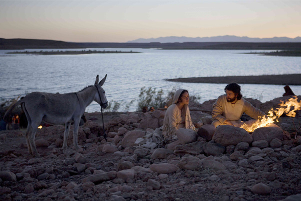

## **Klapbord**

**The Nativity Story** is de derde film van Catherine Hardwicke. Zij is een architecte, maar vooral werkzaam  als Amerikaanse regisseuse en producente. Zij regisseerde tot nu vier films waaruit een bijzondere aandacht blijkt voor de leefwereld van tieners en adolescenten. Er steekt in haar films een genderaspect want op **Lords of Dogtown** na, is de hoofdrol altijd een meisje. In **The Nativity Stor** is dat het meisje Maria, vertolkt door Keisha Castle-Hughes. De opnames gebeurden in Italië en Marokko (het Atlasgebergte). De muziek is erg belangrijk in de film en is een realisatie van Mychael Danna.

## **Synopsis**

Het is de tijd dat koning Herodes met harde hand regeert over het Joodse volk van Judea met goedkeuring van de Romeinse keizer Augustus. Herodes heeft al 35 jaar lang alles onder controle maar is waanzinnig angstig dat iemand uit eigen midden hem van zijn troon zou stoten. Vooral de oude profetie over iemand uit de stam van David die in opdracht van God vrede en gerechtigheid voor het volk zou brengen, achtervolgt hem. Wanneer drie wijzen, Gaspar, Melchior en Balthazar uit het Oosten hem in Jeruzalem komen vertellen van de nakende geboorte van de Koning van de Joden te Bethlehem, beslist hij alle mannelijke kinderen van twee jaar en jonger te doden. Hij weet echter niet dat de hoogzwangere Maria te Bethlehem bevallen is van Jezus, het kind dat haar via de boodschap van de engel Gabriël is voorzegd. De drie wijzen brengen eer aan het kind. Jozef van Judea, de man van Maria wordt in een droom gewaarschuwd. Hij vertrekt op tijd met Maria en hun kind uit Bethlehem. Ze ontkomen en bereiken veilig Egypte.

## **Cinematografie**

INCLUSIE. De introductie met beelden van de nachtelijke sterrenhemel boven de wolken en de daaropvolgende neerwaartse beweging — van de hemel door het wolkendek heen naar de aarde — eindigt in Jeruzalem. Dan volgt de eerste reeks van sequenties in het paleis van Herodes. Daar beveelt de wrede koning de kindermoord te Bethlehem. Na de beelden van de soldaten die in de avond de huizen binnenvallen en de kleine jongentjes ombrengen, maakt het verhaal een terugkeer in de tijd. Het lange middenluik met Maria, Jozef en de drie wijzen tot en met de geboorte van het kind Jezus te Bethlehem mondt uit in de kindermoordsequenties. Die worden nu anders dan in het begin opgebouwd. Dat leert dat Hardwicke het kerstverhaal heeft willen vertellen via de verhaalstructuur van _de inclusie_ die door toedoen van het _Marcusevangelie_ een gebruikelijke verteltechniek is van de synoptische evangelies. De inclusie met de infanticide te Bethlehem komt zelf niet voor in de nieuwtestamentische geboorteverhalen. De regisseuse geeft met die inclusie een eigen en contrastrijke dimensie aan de geboorte van Jezus te Bethlehem. Een betekenisvolle, filmische lezing van het gekende Bijbelverhaal.

KOORMZUIEK. De muziek speelt een belangrijke rol in de sferische werking van **The Nativity Story**. Van de 101’ speelduur zijn er ongeveer 85’ minuten met muziek. Componist Mychael Danna koos voor een orkestscore met een groot koor. Hij beschikte over een symfonisch orkest van 70 leden. In nauw overleg met Catherine Hardwicke heeft hij er niet voor gekozen om muziek te zoeken die de historische tijd, het jaar nul van onze tijdrekening, wil suggereren. De beelden zelf volstaan om de toeschouwer het gevoel te geven dat hij getuige is van de gebeurtenissen op het ogenblik dat ze zich voordeden. Met de muziek daarentegen wil de componist een muzikale brug bouwen van de toenmalige gebeurtenissen (de beelden) naar de huidige wereld (de klanken). In de score gebruikt hij namelijk gegevens uit de oude muziekcultuur die het oorspronkelijke verhaal over de generaties zingend en spelend heeft doorgegeven. Daarom gebruikt hij bijvoorbeeld instrumenten en koortechnieken uit _de middeleeuwen en de renaissance_. De gezongen muziek, te beginnen met de openingsbeelden waar het kerstlied _‘Veni, Veni Emmanuel’_ weerklinkt, zijn in het Latijn. Hij gebruikt voor de vele koorliederen gregoriaanse melodieën en melodieën van oude kerstliederen. Zo integreert hij in de compositie voor de aankondiging van de kindermoord door Herodes het Engelse _‘Coventry Carol’_, afkomstig uit een Engels kerstspel van de 15de eeuw. _'Corde natus ex parentis'_ weerklinkt bij de geboorte van Johannes, de zoon van het oudere koppel Elizabeth en Zachariah. _'Rosa Aeterna Floret'_ begeleidt de eindgeneriek. Daarvoor komt het herkenbare _Silent Nox_, het in het Latijn gezongen _'Stille Nacht, Heilige Nacht'_ bij de beelden van de vlucht naar Egypte. Voor de meer emotionele scènes gebruikt Danna de gebruikelijke moderne orkestscore met strijkers.

PARALLELMONTAGE. Binnen het grote middenluik van de inclusie realiseert Hardwicke een lang uitgewerkte parallelmontage. Concreet lopen twee verhaallijnen naast elkaar en tevens onafhankelijk van elkaar. De gebeurtenissen verlopen in de ruimte en de tijd zonder op elkaar in te spelen. Er is namelijk _het verhaal in Nazareth en dat in Perzië_. In het eerste spelen Maria en Jozef de hoofdrol, terwijl in het tweede de drie wijzen op het voorplan staan. In Bethlehem vloeien de twee verhaallijnen in elkaar over. 

KLEUR EN LICHT. De sequenties met Herodes en de kindermoord zijn vooral in het donker gefilmd. Ze verbinden Herodes met duistere krachten. De talrijke taferelen met Maria en Jozef in hun natuurlijke omgeving en met de ezel waarmee ze reizen naar Bethlehem en nadien naar Egypte, zijn niet in volle kleuren gefilmd. Dat zou immers erg sentimenteel en romantiserend overkomen. Hardwicke heeft ervoor gekozen om de gebeurtenissen zo in beeld te brengen alsof ze zich voor het eerst voltrekken. Ze vermijdt hiermee iedere verwijzing naar het theatergenre van het kerstspel. Vandaar de keuze om alles te situeren in een natuurlijke omgeving die gemakkelijk de sfeer evoceert van het Judea van het begin van de christelijke tijdrekening. De regisseuse versterkt dat effect nog door de kleuren te filteren zodat zelfs _een zwart-wit effect ontstaat_. Zelfs het woestijnzand kleurt niet geel. Sommige sequenties ogen daardoor alsof ze _in sepia_ zijn gefilmd. De kleding van de personages is daaraan aangepast: soorten van witte en soorten van donkere tinten overheersen. Maria is daarbij altijd in een gebroken wit gekleed. De engel Gabriël verschijnt in een helder wit gewaad in een donkere omgeving. Dat hemelse helder wit sluit aan bij de _talrijke beelden in vogelperspectief van de hemelse lichtstroken_ die hoog vanuit de hemel naar de aarde stralen. De regisseuse evoceert hiermee de vaderlijke betrokkenheid van God zelf op het gebeuren dat zich in Judea afspeelt. Het grote panoramische slotbeeld met in de verte de Egyptische piramiden is gecomponeerd met een opgaande camerabeweging die vanuit de aarde vertrekt en stilstaat bij een volledig verticaal shot van de hemel van waaruit lichtbundels naar beneden schijnen. Een lichtend orgelpunt op de tonen van '_Stille Nacht, Heilige Nacht_'. Een gedurfde, maar veelzeggende compositie. In de beeldvorming van de hemelse lichtbundels heeft Hardwiche zich duidelijk laten inspireren door de gekende bijbelillustraties van _Gustave Doré_. Picturaal brengt de film een mooie hulde aan deze grote illustrator.

## **Betekenisruimte**

INCARNATIEMOTIEF. **The Nativity Story** heeft zijn eigen plaats veroverd in het subgenre ‘Jezusfilm’ van het rijke genre ‘Bijbelfilm’. De film blijft trouw aan de gegevens van de Bijbel. De synoptische evangelies vormen de concrete beeldbron. Het gegeven van de engel Gabriël werd bijvoorbeeld niet uit het scenario weggeschreven. In de openingsbeelden wordt _Jer. 23, 5-6_ geciteerd en in de slotsequenties spreekt Maria in voice-over het _Magnificat (Lc 1, 47-54)_ uit. Dit laatste hoort thuis in het tafereel van het bezoek van Maria aan Elisabeth, terwijl Hardwicke het laat horen in de slotbeelden van de vlucht naar Egypte. Als een soort synthese van de betekenis van alles wat zich heeft afgespeeld. Juist door de inclusievertelling met de kindermoord onderlijnt Hardwicke dat het mysterie van Gods aanwezigheid niet in de dood maar de geboorte van het kind te vinden is. Dat is wat de herders en de wijzen ontdekken, en wat Maria en Jozef van zeer nabij beleven. Daarom verwoordt Maria na de geboorte aan de herders _het credo voor een hedendaags publiek_: '_Hij is geboren voor de hele mensheid. Ons allemaal is een geschenk gegeven._' De drie wijzen belijden bij een inzoom op de pasgeboren baby: '_God is vlees geworden/ God made into flesh_. Het christelijke narratief van de _Incarnatie_ vormt de theologisch leiddraad van de film. In de geboortescène is er een zeer nauwe band tussen de blik van Maria en de hemelse lichtbundel van de Ster van Bethlehem. 

BLIJVEND BIJBELBEELD. In het blikveld van **The Nativity Story** verschijnt het kerstverhaal als _een onsterfelijk verhaal dat blijvend inspireert_. Het bevat talrijke taferelen die bijzonder beeldend zijn en in het verleden ontelbare generaties heeft geïnspireerd om ze zelf in scène te zetten. Zonder ze te imiteren, sluit Hardwicke aan bij die eeuwenoude _volkscultuur_. Door creatief gebruik te maken van de hedendaagse filmmiddelen vertelt ze het verhaal alsof het nu aan het gebeuren is. Dat is de magie van het cinematografische beeld. En via _de originele klankband_ verbindt ze toch het verhaal met zijn werkingsgeschiedenis die zich heeft gematerialiseerd in een schat aan populaire liederen, woorden en melodieën.

FEMINIENE TOUCH. Wellicht kan vandaag enkel een vrouwelijke cineast zo consequent kiezen voor het personage van _het jonge meisje Maria_ en juist daardoor ook voor _het vergeten personage van Jozef_ die hier helemaal tot zijn recht komt. Hardwicke plaatst namelijk het jonge meisje in de Joodse context van toen waar uithuwelijking op jonge leeftijd de algemene regel was (wat vandaag als in strijd met de wet zou worden gezien). In **The Nativity Story** schildert de regisseuse Maria en Jozef in een eenvoudig maar zeer gelovig Joods milieu en reflecteert over de moeilijkheid die de ‘vreemde’ zwangerschap van de nog ongehuwde Maria concreet moeten hebben teweeg gebracht. Vandaar het belang van en _de waardering voor de figuur van Jozef_. Niet toevallig zegt Maria na de geboorte van Jezus dat ze daartoe in staat is geweest _'dankzij de kracht van God'_ en, zo voegt ze eraan toe kijkend naar Jozef, '_en dankzij u_'.  In de patriarchale samenleving van toen was de attente aanwezigheid van Jozef onontbeerlijk. De eigen _feminiene benadering_ leidt er ook toe dat de episode van de drie wijzen veel aandacht krijgt. Het is een verhaal in een verhaal geworden waarbij Hardwicke niet nalaat op _de universele betekenis van de geboorte van Jezus voor alle culturen_ te wijzen. Het is trouwens de zwarte Melchior die zijn collega’s vraagt om hun ervaring van Bethlehem voor zichzelf te houden en niet bekend te maken aan Herodes. _Het beeld van de drie wijzen_ krijgt hier in een mondiale samenleving een actuele belichting. De grote oude namen voor koning ('_goud_') en priester ('_wierook_'), functies verbonden met grote macht in het verleden, worden door de wijzen aan een pasgeboren baby toegezegd onder hemelse belichting. Het derde geschenk ('_mire_') opent echter de betekenis van ‘_de goddelijke macht van de kwetsbaarheid_’ en verwijst in plaats van naar macht naar _het offer_. De machtfiguren van de koning en de priester krijgen hun actuele blijvende betekenis in de figuur van ‘_de dienaar_’. De figuren van Maria en Jozef zijn van dit laatste de concrete voorafbeeldingen.

## **Context**

**The Nativity Story** kan ook worden gezien als een antwoord op de zeer bloedige en wrede verfilming van het passieverhaal door _Mel Gibson_ in diens **The Passion of the Christ** (2004). In die film verschijnt vooral God zelf als een op bloed beluste vaderfiguur en treedt Jezus op als een sadomasochistische superheld. Bij **The Nativity Story** blijft _het mysterie van Gods bestaan veel dichter bij de concrete, menselijke ervaring_. De wreedheid is hier het werk van koningen die gewone mensen uitbuiten en er niet voor terug schrikken kinderen om te brengen.

## **Links**

_Leren Leven Met Beelden_, nr. 16 (2010),19-22.

© Sylvain De Bleeckere, Men(S)tis, 2011/2017.
