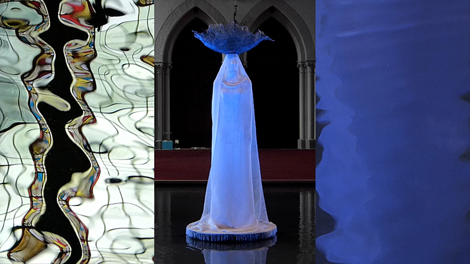

## **Klapbord**

De kortfilm **PilgrImage** - bekijk [hier](http://www.menstis.be/producties/Agora/AgoraMovies/) de film - is een kleine, onafhankelijke productie van Men(S)tis (Hasselt), in samenwerking met Yot (Brugge). Het concept is van Sylvain De Bleeckere. De regie is een gemeenschappelijk werk van Sylvain De Bleeckere en Kristof Hoornaert. 

>Met minimale middelen en veel creativiteit maakten ze de opnames in de _Heilige Magdalenakerk_ (Brugge) op 25 juni 2018, met in de hoofdrol het kerkgebouw en tal van vaste en tijdelijke beelden. Het filmpje ging in première op _de website van Men(S)tis_ op 3 juli 2018. De opnames kaderden in het [Project Agora](http://www.menstis.be/producties/Agora/) (Brugge, mei-september 2018). 

>Enkele kunstwerken die in het kader ervan werden gerealiseerd en getoond, maken deel uit van **PilgrImage**. De regisseurs gebruikten de tentoonstelling als een filmset. Het toont de volgende beelden uit de Agora-expositie: _Humana_ van Marleen Mertens en in volgorde van verschijning de volgende werken van Jan De Wachter: de tekening _Madonna en de slapende geliefde_, het doek _Verlatenheid_, de beelden _Solus_ en _De traan_, het tapijt _Liefdeslabyrint - Allegorie van het leven_, de bewerkte botscan _Ecce Homo_ en het schilderij _De Madonna van de Tederheid_. 

>Kristof Hoornaert bediende de _camera_ van een eenvoudig Panasonic fototoestel, en verzorgde, in overleg met Sylvain De Bleeckere, de montage. 

>De _sounddesign_ is een gemeenschappelijk concept van  Sylvain De Bleeckere en Jan De Wachter, technisch gerealiseerd door Mark Vercnocke, en met de stem van de Russische componist Alexander Knaifel.

>Geert Delbeke van Yot assisteerde tijdens de opnames. 

>Het filmpje is opgedragen aan ― de kort voor de opnames ― overleden _Patrick Perquy_, priester-leraar, romanist, bijbelkenner, cinefiel, mentor en medewerker van Yot.

## **Synopsis**

Een pelgrim (m/v) komt aan in een katholieke kerk. De pelgrim neemt verwonderd het kerkgebouw in zich op en merkt onmiddellijk dat zijn vertrouwde beeld van een kerkgebouw niet helemaal klopt. De kaarsen aan de zuilen branden, maar er is geen kerkdienst aan de gang. Er bevindt zich een watervlak in het religieuze gebouw. Daarop staat een vrouwelijke figuur in het wit met een donkerblauwe kroon. Ze lijkt op een verschijning. De pelgrim neemt het beeld van de witte vrouw in zich op en vervolgt daarna een eigen pad doorheen de kerk. Enkele beelden gidsen de pelgrim. Net voor het betreden van het koor stapt hij op een tapijt met een labyrint. De verwondering neemt toe. Het priesterkoor waar het grote altaar zou moeten staan, is helemaal leeg. De pelgrim kijkt even rond, zoekt, ziet aan de oostelijke muur van het koor een beeld van een skelet. Plots ziet de pelgrim links een open deur met een kleine zwarte gang. Hij stapt er naar toe. Dan ontdekt de pelgrim de verborgen kamer waar twee kaarsen branden bij een schilderij met een honinggele kleur en het silhouet van de Madonna met Kind. 

## **Cinematografie**

**VOETSTAPPENMOVIE IN TRIPTIEKVORM**. De _proloog_ van **PilgrImage** opent met een triptiek. Centraal verschijnt het beeld _Humana_, symmetrisch gekadreerd in de neogotische binnenzijde van de deuropening van de kerk. Links en rechts zijn bewegende beelden van het water waarop _Humana_ zicht bevindt. Links weerspiegelt een brandglasraam het zonlicht dat speelt op het rimpelende wateroppervlak. Rechts kleurt het water blauwig door de weerkaatsing van het kleed van _Humana_ op de waterspiegel. Dat blauw ontstaat door de werking van de spots die mede _Humana_ belichten. De pelgrim (m/v) hoort het ruizen van de wind en het stromen van het water. 

>Dan volgt er een _fade out_ naar een zwart totaalbeeld waarop de titel verschijnt. In het midden van het Engelse woord _pilgrimage_ staat de hoofdletter _I_ waardoor er een woordbeeld ontstaat waarvan het tweede deel bestaat uit het woord _Image_ (het Engelse woord voor _beeld_). 

>Uit het donker van de _nieuwe fade out_ na de titel verschijnt de triptiek terug. Van dan af begint het pad van de pelgrim. Zijn stem weerklinkt op de geluidsband. Hij bidt het Mariagebed in het Russisch. Bij de eerste aanbidding van ‘Maria’ komen links en rechts details van de tekening _Madonna en de slapende geliefde_ in beeld. Zo wordt het beeld _Humana_, nu gefilmd op de rug tegen de achtergrond van het priesterkoor met de grote glasramen, gekoppeld aan dat van de _Madonna_. De triptiek brengt beide beelden samen. Humana wijst de pelgrim naar de richting van het priesterkoor waar zich in een zijkapel de _Madonna van de Tederheid_ bevindt. 

>De pelgrim legt nu de weg af van _de westelijke ingang van de kerk naar het oostelijke eindpunt_, het priesterkoor. Hij volgt de rechtergang. Het midden van de filmtriptiek toont zijn pad. Links en rechts begeleiden hem enkele beelden die in het teken staan van verdriet en lijden: _Verlatenheid_, _Solus_ en _De traan_. De pelgrim beschouwt de sculptuur van de wenende man bij de boom (_De traan_) en eindigt zijn gebed met ‘_Amen_’.  Van dan af keren het geluid van de wind in de bomen en dat van de golven van de zee terug tot aan het slotbeeld. 

>Ondertussen eindigt de beschouwing van het beeld _De traan_ met _een nieuwe fade out_ naar een volledig donker beeld. Dan licht de triptiek terug op met in het midden het tapijt _Liefdeslabyrint - Allegorie van het leven_, de zijkanten blijven donker. De pelgrim verkent het labyrint en zoekt zijn weg. Dan lichten links en rechts de wegwijzers op: rechts het glasraam met de heilige Magdalena en rechts het houten beeld van dezelfde heilige maar in een andere positie. Telkens voltrekt er zich een _verticale_ beweging richting naar boven, terwijl de blik van de pelgrim nog neerwaarts richting tapijt op de grond is gericht. De opwaartse beweging van de zijpanelen begeleidt in het middelpaneel de blik van de pelgrim richting het priesterkoor waar doorheen het licht door de glasramen schijnt. 

>Nu bevindt de pelgrim zich in een nieuwe ruimte die hij verwonderd verkent. Hij ziet echter enkel de leegte van het priesterkoor en het beeld _Ecce Homo_ dat getuigt van ziekte en lijden. De beelden van de zijpanelen zijn nu helemaal donker geworden. 

>Na enige aarzeling merkt de pelgrim een _open gang_ die helemaal donker is. Hij stapt de donkerte in. _Fade out_. Ook het beeld ‘kleurt’ (opnieuw) donker. 

>Dan licht uit die duisternis de _epiloog_ van **PilgrImage**. Het is een totaalbeeld op met de _Madonna van de Tederheid_ die zich in de kamer bevindt die de pelgrim heeft betreden via de donkere gang. De triptiek is weg, er is nu enkel het totaalbeeld van de _Madonna van de Tederheid_ met links en rechts een brandende kaars. De camera neemt de positie in van de beschouwende pelgrim die aan het einde van zijn weg is gekomen. 

>Laatste _fade out_. Dan volgt nog het beeld met eindgeneriek.

**SOUNDDESIGN**. **PilgrImage** heeft een autonome klankband die zelf als een triptiek is opgebouwd. Er komen geen geluiden voor van de stappende pelgrim (m/v). Wel begeleidt een eigen soundtrack zijn weg in de kerk. 

>Die bestaat in hoofdzaak uit het in _het Russisch gebeden Mariagebed_. Dat vormt het middelluik van de klankband. De keuze van het gebed is van kunstenaar Jan De Wachter die het als kind van zijn vader heeft geleerd. De Nederlandse tekst is de volgende:

>>_Heilige Maria, vol van tedere toewijding. Gedenk dat nooit iemand tevergeefs tot u zijn toevlucht nam, uw hulp inriep, om uw bijstand verzocht. Vervuld van dat vertrouwen in u, kom ik tot u, nader ik, sta ik smekend voor uw voeten. O, Moeder van het vleesgeworden Woord, versmaad mijn gebeden niet, aanhoor mijn smeken en wees mij genadig. Amen_

>Dat middenluik van de klankband wordt geflankeerd door een klankmontage van het _geluid van de wind die waait in hoge bomen en dat van de golven van de zee_. Die klankmontage begeleidt de proloog, alsook de sequenties die volgen na de beschouwing van _De traan_ en leiden naar de kamer met _De Madonna van de Tederheid_.

## **Betekenisruimte**

**HET KERKGEBOUW ALS FEMINIENE ZONE VAN ZIN**. In **PilgrImage** komen er geen mensen in beeld. Er is enkel de aanwezigheid van de pelgrim (m/v) via de subjectieve camera. Alle beelden vloeien voort uit zijn beschouwende blik. Het kerkgebouw verschijnt als het hoofdpersonage met een eigen identiteit. Met haar ruimtelijk, beeldend wezen toont de kerk zich als _een unieke zone van zin_. Het gebouw is veel meer dan een verzameling stenen, geordend volgend een bepaalde hoogte, lente en breedte. ‘_Is_’ is te weinig gezegd. De kerk is niet, ze _doet_, ze _handelt_, ze _ontplooit_ een eigen werking. Dat ervaart de pelgrim vanaf het eerste moment van zijn aanwezigheid in het gebouw.

>De kerk ontvangt de pelgrim die aan het einde van zijn tocht is aangekomen in de kerk. Van die gastvrijheid getuigt de _openheid van het gebouw_, en _de brandende kaarsen_. Die wijzen erop alsof de kerk de komst van de pelgrim heeft verwacht. Ze uitnodigt hem uit om nog een laatste weg af te leggen, fysiek met de voeten en mentaal met zijn geest en hart. Hij neemt het pad waar dat zich opent van het westen naar het oosten, van achteraan naar vooraan.  **PilgrImage** beschrijft die pelgrimsgang in de kerk.

>Het gebaar van openheid en gastvrijheid komt voort uit het _feminiene wezen_ van de kerk. Het hele gebouw stelt een _moederlijke_ geste: ze ontvangt en geeft leven. Ze geeft een _thuis_ aan de lokale, omwonende gemeenschap, maar ook aan de verre vreemdeling die passeert. Ze ontvangt hen allen als de pelgrims die mensen zijn, onderweg in het leven, van hun geboorte tot hun overlijden, generatie na generatie. 

>De _feminiene_ werking van de kerk spreekt ook uit het resultaat ervan. De thuis die ze aan het individu en de gemeenschap biedt, vormt een _zone van zin_. De pelgrims, de mensen, krijgen er een ruimte om zich te bezinnen, om aan de grondstof van hun bestaan, hun ervaringen van vreugde en lijden, een betekenis te geven.  **PilgrImage** toont hoe de pelgrim thuiskomt in die zone van zin, daar waar hij toegang krijgt tot zijn diepste wezen als mens onderweg, zoals een kind thuiskomt bij zijn moeder. 

**IN DE SCHADUW VAN HET FLUÏDE LEVENSLICHT**. Het openingsbeeld - zie het beeld hierboven - in triptiek zet de visuele toon. Het statige beeld _Humana_ staat op het bewegende en spiegelende water. Dat reflecteert het inwerkende licht. 

>De twee spiegelbeelden onthullen de fluïde kracht van inwerkende licht. Dat fluïde licht verschijnt ook in het witte kleed van _Humana_. De blik van de pelgrim (m/v) richt zich met de intensiteit van de verwondering op haar etherische verschijning. Het van het Grieks komende ‘etherisch’ (ether) duidt letterlijk op de verschijning van ‘_de heldere lucht van de hemel_’. Hier kunnen we dat vrij interpreteren als ‘_zo licht als het licht van de hemel_’. _Humana_ oogt alsof ze grotendeels uit licht bestaat. Dat geldt in zekere zin ook van de kerkruimte zelf. De glasramen vertellen dat aan de pelgrim, evenals de vele brandende kaarsen aan de zuilen.

>De krachtige, _feminiene_ werking van de kerk komt voort uit de wijze waarop ze het hemelse licht in zich opneemt. Dat licht is hier niet het louter functionele licht, maar dat van _het wonder van het aardse licht van de schepping_, in het derde deel van [Levensbeschouwing democratisch belicht](http://www.menstis.be/uitgeverij/Levensbeschouwing/) ‘_de Lichtaard_’ genoemd. In het openingsbeeld van **PilgrImage** verschijnt het als het fluïde levenslicht. De pelgrim beleeft dat licht langs zijn kerkpad op een bijna mystieke wijze. Hij beseft dat het dat scheppende levenslicht is die de regie voert van het pad dat hij volgt, van Humana naar de Madonna van de Tederheid. Hij volgt het spoor van het licht dat hem vanuit de oostelijke koorruimte wenkt. Daarbij gaat hij tweemaal door een donkere ruimte. Dat gebeurt de eerste maal wanneer hij bij het beeld _De traan_ aankomt en van daar naar het labyrint _Liefdeslabyrint - Allegorie van het leven_ stapt. Daar aangekomen, wijst het licht in de koorruimte hem opnieuw de weg. Daar ontdekt hij dat niet het priesterkoor het einddoel van zijn pad is. Hij moet nog eerst door een donkere gang. Voor de tweede keer stapt hij de duisternis in, alvorens zijn echte einddoel, de kamer van de _Madonna van de Tederheid_, te bereiken.

>Langs het pad van het fluïde levenslicht gaat de pelgrim inderdaad door _donkere plekken_. Die verschijnen reeds in het eerste lichtbeeld van de openingstriptiek. Er zijn de schaal van de _Humana_ en de blauwige reflectie van haar gewaad in het rechterluik van het filmbeeld, een effect van een mix van invallend zonlicht en kunstlicht. De _donkerblauwe kleur van de hoofdschaal_ contrasteert met het _witte_ gewaad. Dat contrast is echter niet absoluut.

>De pelgrim ziet hoe vanuit de schaal van _Humana_ blauwe draden door het witte kleed zijn geweven waarin zich in datzelfde blauw druppels hebben gevormd. Ze vertegenwoordigen de fijne stralen en druppels van het verdriet, die in de schaal zijn opgevangen. Ze vloeien door het kleed heen naar het zacht bewegende wateroppervlak. Hierdoor krijgt in het rechterbeeld het watervlak de _ingetogen kleur van de blues_, de naam van het diepe verdriet dat de mens in zich opslaat langs zijn levensweg. 

>De pelgrim spiegelt erin zijn _eigen_ verdriet, evenals het _collectieve_ verdriet wat hij deelt met de mensheid waarvan hij deel uitmaakt. Langs zijn pad in de kerk begeleidt het fluïde levenslicht de pelgrim langs momenten waar dat _eigen en gedeelde_ verdriet verder doordringt in zijn gemoed. Hij herkent zich in het beeld van de man met de traan, buigend bij een afgeknotte boom. Die leidt hem naar het labyrint met een kaart van de verschillende regionen die de mens voortdurend doorloopt in zijn mentaal landschap. De botscan in het priesterkoor confronteert hem met de broosheid van zijn lichaam. 

>Het fluïde levenslicht tovert dat alles niet weg. Het neemt die blauwe stemmingen en beelden van verdriet in zich op, belicht ze zelfs, en neemt ze mee in een verticale, hemelwaartse beweging, die spreekt van de _feminiene_ kracht van de dragende zuil en het brandglasraam. Met die kracht stapt de pelgrim doorheen de donkere gang om er in de kamer van de _Madonna van de Tederheid_ aan te komen. In de beeldende beschouwing van de pelgrim echoot het Mariagebed dat hij tijdens zijn weg tot Haar heeft gebeden.
 
**MENTALE BEE(LD)WEG**. Het woord _beeweg_ is in Vlaanderen het dialectwoord voor bedevaart, en is een samendrukking van _bedeweg_. Zo zegt men bijvoorbeeld dat iemand _op bedeweg is geweest_ naar Lourdes. Langs een bedevaart komt een pelgrim veel andere pelgrims tegen. In **PilgrImage** zijn de tochtgenoten van de pelgrim (m/v) beelden; daarnaar verwijst het woord _Image_ in de titel **PilgrImage**. De beelden hebben ieder hun eigen narratief. Samen versterken ze elkaar om één groot beeldend gebed zwijgend ‘uit te spreken’. De pelgrim volgt hun spoor, ze vormen zijn bee(ld)weg.

>** Het neogotische kerkgebouw** is het eerste beeldwerk. Dat neemt als moederbeeld alle andere beelden in zich opneemt. De kerk geeft ze ruimte en laat ze tot leven komen. Dat ontdekt de pelgrim tijdens zijn bee(ld)weg. De diverse beelden gidsen hem langs zijn pad in het kerkgebouw. Het zijn tekeningen, schilderijen, een scanfoto, driedimensionale beelden in linnen, gips en hout, alsook nog een tapijt en een brandglasraam.

>**Humana** op het water is een installatie met centraal een vrouwenfiguur met een handgeweven gewaad van linnen (vlas). De installatie met de ruimte, de figuur, de kleding, het water en het licht creëert een uniek weefsel.

>>_Humana_ belichaamt eerst en vooral het feminiene wezen van het neogotische kerkgebouw. De naam roept tevens de vrouwelijke dimensie van het wezen mens op. Het woord _humana_ is het vrouwelijke van het Latijnse bijvoeglijk naamwoord _humanus_, waarvan in de Europese talen, ook in het Nederlands, het woord _humaan_, menselijk, van is afgeleid. Het beeld vertegenwoordigt niet alleen alle vrouwen die ooit hebben geleefd, nu leven en nog zullen leven.

>>_Humana_ vertolkt ook de ingetogen waardigheid van de mens als vrouw, zij wier menselijke verschijning in de voorbije eeuwen van wat men de ‘beschaafde’ mensheid is gaan noemen, altijd in de schaduw heeft gestaan. Vandaar ook de blauwe schaal op haar hoofd. Het blauw is de kleur van haar lijden en verdriet dat ze al eeuwen met zich meedraagt. Door haar gestalte verwijst ze naar haar zes zusters, de [Kariatiden](http://my-favourite-planet.de/english/europe/greece/attica/athens/acropolis/acropolis-photos-01-018.html) van het Erechtheion op de Atheense Acropolis. _Humana_ synthetiseert de twee, tegenstrijdige betekenissen van het overgeleverde beeldfenomeen kariatide.

>>De Oud-Romeinse lezing ziet in de figuren de tot slaven gemaakte vrouwen van het Spartaanse stadje Karyae die voor eeuwig en altijd lasten op hun hoofd moeten dragen. De meer archeologische visie ziet ze als priesteressen van Karyae die tijdens het tempelfeest voor de godinnen Artemis en Athena de heilige voorwerpen op hun hoofd in manden of schotels naar de tempel brengen. _Humana_ absorbeert beide, tegenstrijdige zienswijzen. In het kader van de installatie in het kerkgebouw krijgt _Humana_ een priesterlijke verschijning, terwijl ze in haar schaal het verdriet van de vrouwelijke mensheid meedraagt.

>**Madonna en de slapende geliefde** begeleidt het begin van de tocht van de pelgrim. Vanaf de verschijning van deze tekening begint hij zijn Mariagebed te bidden. Die tekening verbindt de Madonna of Heilige Maria - de meest gekende en vereerde vrouw van de zowel orthodoxe als katholieke christenheid - met iedere vrouw die als geliefde echtgenote door het leven is gegaan, gaat en nog zal gaan. Hiermee roepen het feminiene trio – Humana, de Madonna, de slapende geliefde - bij de pelgrim de herinnering op aan het begin van alle menselijk leven op aarde, de oorsprong ervan: de geboorte van ieder mensenkind, eerst tot leven gekomen in de moederschoot. De heilige Maria, vereerd als Moeder Gods, belichaamt in die zin niet enkel alle moeders, maar ook en tegelijkertijd de heilige gave van het menselijk leven, m.a.w. de heiligheid van het moederschap op zich.

>**Verlatenheid, Solus, De traan en Ecce Homo** versterken langs het pad van de pelgrim elkaar binnen hetzelfde betekenisveld. Ze roepen ervaringen op die zich situeren in het existentiële register van eenzaamheid, psychisch en fysiek lijden. 

>>De mannelijke figuur van _Verlatenheid, Solus, De traan_ evoceren het psychisch of mentaal lijden, _Ecce Homo_ confronteert de pelgrim met het lijden van het lichaam door ziekte. Die beelden spiegelen langs het feminiene pad van de pelgrim de kwetsbare kant van de man en in ruime zin van iedere mens, man of vrouw. 

>>Dat beeld van de kwetsbare man contrasteert met dat van de eeuwenoude, historische realiteit. Die bewaart de zichtbare tekenen van de masculiene uitoefening van culturele, godsdienstige, economische, politieke en militaire machtsuitoefening die een niet meer te vatten wreedheid en lijden heeft voortgebracht. 

>>Tot het beeld van de kwetsbare man hoort ook dat van de afgeknotte boom. De boom is in het collectieve bewustzijn van de mens steeds als levensboom gezien en gewaardeerd. Ook _Genesis_ 3:22 en _Spreuken_ 3:18, 30 kennen die zienswijze. En de middeleeuwse bouwers van de gotische kerken gebruikten de hoge bomen als model voor hun hoge zuilen, een verwijzing naar de Bijbelse levensboom. Vele gotische kerkgewelven ogen als een bladerendek ontsprongen aan de kruinen van de hoge zuilen. 

>>In de feminiene beelden van de kwetsbare man die de pelgrim langs zijn pad in zich opneemt, staat de afgeknotte levensboom op de voorgrond. Dat leert dat zijn verdriet niet alleen op hem, maar ook op het lot van de levensboom betrekking heeft. De slachtoffers van de eeuwenlange, masculiene wreedheid – het werk van heel wat farao’s, keizers, tsaren, koningen, duces, pauzen, grootayatollahs, partijleiders, Führers, generaals - waren niet alleen de gewone stervelingen in het algemeen, maar vooral de vrouwen in het bijzonder, evenals moeder aarde met haar mensen, dieren, bomen en zeeën. De tekenen van die niet meer te overziene aanhoudende destructie komen, op het ritme van de jaren, steeds duidelijker aan de oppervlakte.

>**Liefdeslabyrint - Allegorie van het leven** is het kunstzinnige tapijt waarop de pelgrim de overgang maakt van de kerkruimte naar het priesterkoor. Deze installatie met het beschilderde tapijt en twee paar schoenen, één voor een man, één voor een vrouw, is verdeeld in vier kwartieren. Ze dragen de namen: sanguinisch, cholerisch, melancholisch, flegmatisch.

>>Ze verwijzen naar de vier _humores_ of lichaamsappen die de basis hebben gevormd van de westerse geneeskunde, van de Oud-Griekse tijd tot in de 19de eeuw. Het concept ervan bestaat erin dat iedere mens voortdurend een fluïde balans moet zien te vinden om niet in een of andere extreme stemming te vervallen met tal van schadelijke gevolgen van dien. 

>>De installatie gebruikt die eeuwenoude voorstelling als een _allegorie van het fluïde leven zelf_ dat de mens eigen is. Het labyrint vormt een halte op de weg van de pelgrim, een moment van intense inkeer, vervuld van het zoeken naar een licht in de donkerte.

>>Met zijn twee voeten op de grond verblijft de pelgrim even ‘in het midden’ van zijn levensweg. Op het tapijt staat de zin: _Nel mezzo del cammin di nostra vita_ (In het midden van de weg van ons leven). Met dit vers opent de eerste canto van het Inferno van Dantes _Divina Commedia_. Het roept de levensbeschouwelijke kracht van de mens op die hij ervaart telkens wanneer hij even halt houdt langs zijn levensweg en daar dan een korte of lange mentale pelgrimage maakt.

>**Maria Magdalena, Eva en het lege priesterkoor**. Na zijn verkenning van het tapijt met labyrint betreedt de pelgrim het lege priesterkoor. Links en rechts begeleiden hem twee verticale beeldbewegingen. Daarin figureert de nieuwtestamentische heilige _Maria Magdalena_ tweemaal.

>>Rechts vormt het houten heiligenbeeld aan de zuil de aanzet van een opwaartse beweging die boven eindigt bij het beeld van _Eva_. Daar vertakt de hoge zuil zich in de gebogen lijnen van het gewelf. Links van het centrale beeld met het lege priesterkoor is er de eveneens opwaartse beweging van het glasraam dat zich boven de ingang van de kamer met _De Madonna van de Tederheid_ bevindt. De pelgrim merkt dat hier de heilige Magdalena anders wordt voorgesteld. 

>>De eerste, die van het houten beeld, toont haar als de Maria uit Magdala, het stadje op de westelijke oever van het meer van Tiberias, een volgelinge van Jezus. Ze is aanwezig bij de kruisiging van Jezus. Op de dag na Jezus’ dood en begrafenis gaat ze heel vroeg in de morgen naar het graf met welriekende olie. Daar is ze als eerste getuige van het lege graf van Jezus. Ze bericht over dat lege graf aan de apostelen (_Johannes_ 2: 1-3). 

>>De tweede figuratie, die van de Maria Magdalena van het brandglasraam, verschilt van de evangelische. Hier toont de voorstelling haar als de berouwvolle zondares die een doodshoofd vasthoudt.  Dit is de ‘kerkelijke’ Maria Magdalena, enkel gekend in de katholieke kerktraditie. Niemand minder dan kerkvader en paus Gregorius I de Grote (6de eeuw) besliste om catechetische en pastorale redenen alle figuren van christelijke zondaressen te bundelen in de anonieme figuur van de zondares uit _Lucas_ 7: 44-50. De paus identificeerde de anonieme zondares uit het Lucas’ evangelie als de evangelische Maria Magdalena. Ze werd hierdoor het model van alle berouwvolle zondaressen. 

>>Die kerkelijke herinterpretatie legde zo impliciet een link tussen Maria Magdalena en de oudtestamentische figuur van _Eva_, de Bijbelse oermoeder van de zondige mensheid tout court, en heel in het bijzonder de ‘oorzaak’ van de natuurlijke zondigheid van alle vrouwen. Zie in die optiek ook de film [Agora](http://www.menstis.be/film-focus/agora/).

>>In dit licht gezien komt de pelgrim, tijdens zijn verwondering in het lege priesterkoor, tot het inzicht dat er een eind is gekomen aan _het eeuwenoude mannelijke klerikalisme_ dat steeds het monopolie over het priesterkoor heeft opgeëist. Alleen volgens de officiële leer van de katholieke Kerk is dat monopolie echter nog steeds van kracht. 

>>Langs zijn feminiene kerkpad beseft de pelgrim dat het beeld van de ‘kerkelijke’ Maria Magdalena onrecht aandoet aan de religieuze, feminiene kracht van de mens in het algemeen en die van de vrouw in het bijzonder. Geleid door de ‘evangelische’ Maria Magdalena die getuigt van de geloofskracht van opstanding, ontdekt de pelgrim dat vandaag het heilig levensmysterie in de zijkamer van het lege priesterkoor is te vinden. In die kamer ontdekt hij de warme gloed van _De Madonna van de Tederheid_, nadat hij eerst het beeld _Ecce Homo_ tot zich heeft laten doordringen.

>**Ecce Homo** staat geschreven op de uitvergrote botscan in het lege priesterkoor. Die geijkte woorden komen uit het nieuwtestamentische _Passievehaal_ (_Johannes_ 19:5). In iedere katholieke kerk wordt ernaar verwezen in het eerste tafereel van de kruisweg, opgehangen aan de muren van de kerk. Ecce Homo is hier de botscan van een man. Het beeld bevindt zich in het meest oostelijke punt van het kerkgebouw, daar waar voorheen het hoofdaltaar stond en waar nu meestal een groot kruisbeeld hangt. De scan is gemaakt in het kader van een medisch onderzoek dat leidde tot de vaststelling van een levensbedreigende  ziekte. Via dat beeld staat de pelgrim oog in oog met zijn eigen sterfelijkheid, met die van iedere mens en, gezien het kader van het priesterkoor, ook met die van het historisch klerikalisme.

>**De Madonna van de Tederheid** vormt het eindpunt van het kerkpad van de pelgrim. Onderweg heeft de pelgrim zijn Mariagebed gebeden in het Russisch. Dat heeft een reden. Nog meer dan in de katholieke verering van Maria als de Moeder Gods, heeft de orthodoxe iconenkunst aan het beeld van Maria een hemels karakter gegeven. [Vladimirskaja](https://nl.wikipedia.org/wiki/Moeder_Gods_van_Vladimir) of de Moeder Gods van Vladimir, wordt vereerd als de beschermster van Rusland.

>>_De Madonna van de Tederheid_ verwijst naar die beroemde icoon uit de Russisch-orthodoxe christenheid, met name in de zwarte contourlijnen van de Madonna met kind. De pelgrim merkt op dat beiden één en dezelfde contourlijn hebben. Ze vallen samen, ze zijn niet te scheiden. Het kind, meer dan in de historische icoon, maakt hier deel uit van de moeder zelf. De pelgrim schouwt in het beeld de heiligheid van het moederschap. Het schilderij is zelf geen icoon. 

>>De pelgrim merkt op dat het driedimensionale beeld kleurrijk is en refereert naar de gouden glans in de _Vladimirskaja_. Dat goud heeft hier een honiggele kleur gekregen. De bijen doen alles voor hun moeder-koningin. Ze produceren de gele honing als heilzaam voedsel voor mens en dier. 

>>Het doek oogt niet gepolijst of afgewerkt, en dit in tegenstelling met de iconen die altijd hemelse perfectie uitstralen. _De Madonna van de Tederheid_ is aards, onaf; ze spreekt van materie. Ze krijgt een sokkel van jute, de natuurlijke stof die verweven is met het dagelijkse leven van vele voorbije generaties. De sporen van het ontstaan van het beeld, van het werken aan het beeld blijven goed zichtbaar en maken deel uit van de verschijning ervan. Het veelvuldig overschilderen en het herhaaldelijk bewerken blijken uit de strepen van de schilderborstels, de krassen van het schildersmes, en de in de verf gedrukte handpalmen.

>>Links, van onder naar boven, is het woord _immaterie_ in de verf gekrast. Het herinnert de pelgrim eraan dat het beeld in en uit de materie, als uit een moeder (het Latijnse _mater_), voort is gekomen, ‘geboren’ is. Die moederlijke materie is ook die van moeder aarde, aanwezig in de klankband met de wind en de golvende zee. Niettegenstaande zijn eigen moederlijke materialiteit, heeft het beeld, zoals de iconen, ook een immateriële uitstaling. Het brengt uit de materie net als de moeder de tederheid van de menswording voort. In die optiek merkt de pelgrim dat rond de heilige moederfiguur zich een sterrenhemel van handen in wit verzamelt. Deze open handen willen geven, niet nemen. Als naalden van een kompas oriënteren ze zich naar de magnetische, tedere hand van de heilige Moeder. 

## **Context**

Het filmpje **PilgrImage** staat op zichzelf als een kunstzinnige kortfilm. De toeschouwer kan die beleven als een beeldende meditatie en/of gebed. 

>Tegelijkertijd maakt **PilgrImage** ook deel uit van een breed maatschappelijk en cultureel kader. Het betreft namelijk de zoektocht naar de _herstemming_ van de katholieke parochiekerk, in de eerste plaats in Vlaanderen, maar ook elders in de katholieke landen of regio’s in Europa. Het onderzoekswerk van Sylvain De Bleeckere en Roel De Ridder, gepubliceerd in _Het open kerkgebouw. Verleden, heden en toekomst van het kerkgebouw in Vlaanderen_ (Pelckmans, 2014), heeft voor het eerst die thematiek duidelijk geformuleerd en een concrete weg naar de hernieuwde toekomst van de parochiekerk uitgestippeld. 

>Het _Project Agora_ van Men(S)tis, voor het eerst in de Brugse _Heilige Magdalenakerk_ gerealiseerd in een nauwe samenwerking met Yot, zet via een creatieve benadering een stap verder richting toekomst. **PilgrImage** evoceert een mogelijke richting van 'herstemming' van de parochiekerk niet enkel als collectief erfgoed, maar vooral als _een hedendaagse zone van zin_, die terug aansluiting vindt bij de _creativiteit_ eigen aan de generaties die in het verre en nabije verleden het kerkgebouw hebben voortgebracht en in stand gehouden.

## **Links**

Zie de sites van [Kristof Hoornaert](https://www.kristofhoornaert.com/) en [Marleen Mertens](http://www.marleen-mertens.be/metafora.php).

Zie ook de site van [Jan De Wachter](http://www.jandewachter.be/Intro). De kunstenaar stelde zelf een verklarende nota op naar aanleiding van de installatie [Alles goed? Jan De Wachter!]( https://cdn.webdoos.io/yot/54cd231592e2692c342fdc3c3bc67872.pdf), een belangrijk onderdeel van het Project Agora.  Enkele van de werken uit die meerdelige installatie komen voor in **PilgrImage**. Daaruit blijkt dat de kunstwerken die hierboven zijn vermeld en toegelicht - _Verlatenheid, Solus, De traan, Ecce Homo_ – het karakter van een zelfportret hebben. Ook voor _De Madonna van de Tederheid_ putte Jan De Wachter, zo vertrouwde de kunstenaar de auteur toe, inspiratie uit zijn eigen leven. De overleden moeder van de kunstenaar was namelijk vroedvrouw. Ze bezat bijzonder korte, krachtige handen waarmee ze veel kinderen hielp geboren worden. De moeder van de schilder had een grote verering voor de Heilige Maria. Via de nagedachtenis van zijn moeder brengt hij met De Madonna van de Tederheid hulde aan alle vrouwen die als echte moeders in het leven staan en met het leven omgaan. Het vertolkt de bewondering van de kunstenaar voor de verbondenheid van moeder en kind, een verbondenheid die hij als een echt geloofsgebeuren ervaart.

De auteur dankt Geert Delbeke van Yot. Hij wees hem op de waarde en het belang van de twee beelden van de Heilige Maria Magdalena in de kerk, die nu ook deel uitmaken van **PilgrImage**.
 

© Sylvain De Bleeckere, Men(S)tis, 2018.
