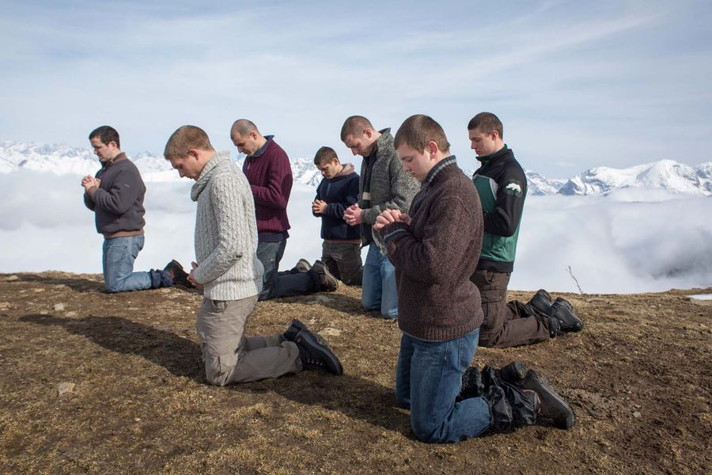

## **Klapbord**

De Franse regisseur Cédric Kahn ligt aan de basis van het filmscenario **La prière**. Geïnspireerd door een idee van de Franse romanschrijfster Aude Walker, begon Kahn te werken aan een concept voor een concrete film over jongeren die hun drugsverslaving willen overwinnen door te gaan leven in een rooms-katholieke gemeenschap. In de periode dat hij het script schreef, ging Cédric zelf tien dagen meeleven in een dergelijke, bestaande gemeenschap. Onder leiding van katholieke opvoeders leven de jongeren er volgens een monastiek ritme. Fysieke arbeid wisselt af met reguliere gebedsmomenten. Alle hedendaagse afleidingen worden geweerd. Cédric sprak er met een tiental jongeren wier levensverhaal het vertrekpunt vormde voor het scenario. In de film zelf vertolken acteurs en actrices die neergeschreven getuigenissen. Om uiteindelijk te vermijden dat een mogelijke film tussen de twee stoelen van een documentaire en een speelfilm zou terecht komen, ging de regisseur samenwerken met collega’s scenaristen Fanny Burdino en Samuel Doux. Deze laatste bereidde zich eveneens voor door in een religieuze gemeenschap te gaan meeleven. De eerste fase van de opnames vonden plaats van 15 februari tot 23 maart 2017 (winter), waarna de tweede fase volgde van 30 mei tot 8 juni (zomer) van datzelfde jaar. De filmploeg vond de geschikte locaties in de Franse Alpen, de regio Auvergne-Rhône-Alpes, vooral in het departement Isère, de vallei van Trièves, ten zuiden van Grenoble, omringd door 2000 meter hoge bergen. De 23jarige, beloftevolle Franse acteur, Anthony Bajon, ontving op het Filmfestival Berlijn (2018) de prijs voor de beste mannelijke hoofdrol. 

## **Synopsis**

De 22jarige drugsverslaafde Thomas zoekt een uitweg uit zijn jarenlange heroïneverslaving. Hij is onderweg naar een katholieke gebedsgemeenschap in het hooggebergte, geleid en bevolkt door gewezen verslaafden. Hij wordt opgenomen in hun kleine gemeenschap, geleid door Marco. Thomas krijgt een persoonlijke begeleider toegewezen, Pierre. De gemeenschap leeft vrij geïsoleerd van de buitenwereld volgens een zeer strenge discipline, zonder medicijnen, sigaretten, alcohol, televisie. Er is geen contact met de meisjes die verderop een gelijkaardige  gemeenschap vormen.

>De jonge mannen verrichten zware fysieke arbeid, die ze afwisselen met een intens gebedsleven. Hun dagelijks leven staat in het teken van vriendschap en wederzijdse ondersteuning bij ‘de gratie Gods’. Thomas kampt met ontwenningsverschijnselen en hij botst tegen de harde discipline. Het religieuze leven spreekt hem niet aan. Voor haar voorzieningen onderhoudt de gemeenschap contacten met het nabijgelegen dorp, vooral met de boerderij van Olivier en Agnès. Daar leert Thomas hun dochter, de archeologiestudente Sybille, kennen. Ze verblijft even bij haar ouders in afwachting van een teken om haar archeologische stage in Spanje te mogen beginnen. Zij voorkomt dat Thomas de gemeenschap vroegtijdig verlaat.

>Na die herstart vindt hij geleidelijk zijn eigen plaats in de gemeenschap. Tijdens het jaarlijkse gemengde feest van de twee gemeenschappen bereikt Thomas opnieuw de grens van zijn innerlijke zelf. Op het einde van het feestelijke dag wordt hij ’s avonds voor het eerst geconfronteerd met de dood van een van de jongens. Xavier is bezweken aan een overdosis. Thomas is overstuur, loopt naar het dorp en klopt aan bij Sibylle. Zij biedt hem troost. In haar kamer beleven ze een intens liefdesmoment. In de dagen na die gebeurtenissen neemt Thomas deel aan een inspannende trektocht naar berghut in het hooggebergte. Bij de terugkeer is een lichte sneeuwstorm. Thomas raakt afgezonderd van de groep en verliest zijn weg. Bij een zware val op de berghelling, bezaaid met stenen, verwondt hij zich aan de linkerknie. Hij moet de nacht in het gebergte alleen doorbrengen. Hij bidt: ‘Heer, verlaat me niet. Laat me hier niet sterven’.

>Wanneer hij ontwaakt, is zijn knie ontzwollen en kan hij zijn afdaling naar de vallei voortzetten. Na zijn intense bergervaring beslist hij seminarist te worden.  Na zeven maanden neemt hij afscheid van de gemeenschap. Onderweg naar het grootseminarie, twijfelt hij en beslist hij na te hebben gebeden, een andere weg te nemen, richting Spanje, naar de plaats waar Sibylle stage loopt.  

## **Cinematografie**

 **DE INCLUSIE MET DE WEG**. De verhaalstructuur van **La prière** kent een inclusie. De beelding ervan bestaat uit het op weg gaan. De introductiesequenties van het hoofdpersonage tonen Thomas zittend in een rijdende bus. De hobbelige weg schudt de ingedommelde jongen wakker. Hij staart naar de weg met op de horizon het hooggebergte. Hij draagt littekens van een verwonding boven en onder zijn linkeroog, die hij tijdens zijn voorbije weg van de verslaving heeft opgelopen. De bus stopt. Het eindstation voor Thomas. De volgende sequentie toont zijn intakegesprek in de afgelegen religieuze gemeenschap. De eindsequenties staan opnieuw in het teken van de weg. Marco, de hoofdverantwoordelijke van de gemeenschap, brengt Thomas met de auto naar een tankstation waar de jongen de bus kan nemen naar Grenoble. Terwijl hij even moet wachten, denkt hij na, hij bidt en kijkt in het toilet in de spiegel zichzelf in de ogen. Dan beslist hij naar de overkant van de autoweg te lopen. Daar vindt hij iemand met wie kan meerijden richting Spanje. In de auto kijkt Thomas opnieuw naar de weg. In de slotsequentie is hij aangekomen bij de archeologische site waar Sybille haar stage verricht.

**HET GESPROKEN WOORD**. **La prière** opent en eindigt met het geluid van de natuurlijke stilte. In de grote tussenruimte bevinden zich enkele opvallende auditieve sculpturen. Het gesproken, levende woord kleurt enkele, belangrijke sequenties. Als eerste is er het intakegesprek waarin de verantwoordelijke Marco Thomas introduceert in de huisregels van de gemeenschap. Dat gesprek heeft het karakter van een monoloog. De jonge man krijgt ook een engelbewaarder, de ex-verslaafde Pierre.

>In de loop van de film komen er enkele sequenties voor die tonen hoe Pierre en Thomas elkaar vertrouwen en ondersteunen. Dat is het geval na de terugkeer van Thomas in de gemeenschap waaruit hij was gestapt als gevolg van ontwenningsverschijnselen die hij niet onder controle kreeg. Door toedoen van Sybille keert Thomas terug naar de gemeenschap. Zoals de regel voorschrijft, moet hij in therapeutische afzondering gaan. Pierre begeleidt hem daarbij. Pierre vertelt er over zijn verleden. Hij heeft een vrouw en een kind die hem af en toe komen bezoeken. Zijn jongen is nu vier jaar, en hij heeft die enkele keren gezien.

>Naar het einde toe van de film werken Pierre en Thomas in het houtatelier. Ze timmeren er samen een groot, houten kruisbeeld. Ze bevinden zich samen op het eindpunt vat hun gemeenschappelijke kruisdraging. Pierre is in dit licht beschouwd, Simon van Cyrene die Thomas heeft geholpen zijn kruis te dragen gedurende zijn verblijf in de gemeenschap. Op dat gemeenschappelijk eindpunt aangekomen, spreekt Thomas zijn innerlijke twijfel uit over zijn keuze om naar het priesterseminarie te gaan. Daaraan vooraf gaat de sequentie van het gesprek tussen Thomas en de priester Luc. Samen hebben ze het over de goddelijke roepstem die Thomas na zijn bergervaring heeft gehoord. Priester Luc probeert Thomas’ enthousiasme te temperen. Hij wijst er de jonge man onder andere op dat priesterleven een pad is met struikelstenen. Hij beklemtoont vooral dat een priester afstand doet van relaties met vrouwen. Dat laatste punt zal Thomas doen twijfelen. Die twijfel vertrouwt hij toe aan Pierre terwijl ze samen het grote houten kruis dat ze hebben getimmerd, voltooien. Tot slot is er nog het spirituele gesprek tussen zuster Myriam en Thomas op het einde van het gemengde feest. Dat gesprek vormt een van de belangrijke dramatische wendingen. Zuster Myriam dwingt Thomas eerlijk te zijn tegenover zichzelf.

**OPVOERING VAN LAZARUS**. Er komt ook een tweeledige theaterdialoog voor. Die staat in het teken van de opvoering van de evangeliepassage over de opwekking van de overleden Lazarus, zoals opgetekend in het _Evangelie van Johannes_. De opvoering komt twee keren voor: in de sequentie van de repetitie en in de sequentie van de eigenlijke opvoering tijdens het gemengde feest. De mannen hebben zelf een primitieve scène met decor gebouwd en enkele van hen hebben zich verkleed als leerlingen van Jezus. Het opwekken uit de doden van Lazarus vormt het hoogtepunt van de opvoering. Helemaal in de geest van het _Johannesevangelie_ staat het tafereel in het teken van de oproep tot het geloof in de macht van Jezus om de dood te overwinnen en wat dood is, nieuw leven te schenken. 

**GETUIGENISSEN**. Opvallende woordelementen zijn de getuigenissen in monoloog. Sommigen gebeuren in de eigen kring van de gemeenschap, soms zoals in het geval van Pierre in een vertrouwelijk gesprek van man tot man. Daarnaast is er een grote sequentie die zich situeert tijdens het jaarlijkse, gemengde feest waarop ook gasten vanbuiten af worden uitgenodigd. Een van de activiteiten van dat feest bestaat erin dat wie wil, een getuigenis aflegt voor de groep van de twee gemeenschappen en hun genodigden. De getuige kan iemand zijn die de gemeenschap al enige tijd heeft verlaten en nu komt getuigen over haar of zijn ervaringen in de buitenwereld.

>Zo volgen drie getuigenissen na elkaar. Ze spreken recht in de camera en spreken eigenlijk tot de toeschouwers van de film. Die reële getuigenissen, vertolkt door acteurs, vormen de oorsprong van de film La prière. Eerst vertelt een jonge anonieme vrouw hoe ze als kind door haar vader werd misbruikt en hoe ze acht jaar verslaafd was aan drugs. Het was haar bijgebleven dat haar moeder een gelovige vrouw was. Na het verblijf in de gemeenschap leeft ze nu al twee jaar zelfstandig. Dan volgt Ben. Hij is de verwende zoon van rijke ouders die telkens opnieuw zijn misstappen met geld wegwisten. Dat werd hem fataal. Verslaafd aan drugs was hij nog geen zeventien toen hij op een dag zijn moeder sloeg voor geld. Nu verblijft hij al een jaar in de gemeenschap en heeft hij opnieuw contact met zijn ouders. De derde getuige verliet vier jaar geleden de gemeenschap na een verblijf van drie jaar. Na een half jaar buiten verviel hij opnieuw in zijn alcoholverslaving. Daarom is hij teruggekeerd naar de gemeenschap. De drie getuigenissen demonstreren hoe hardnekkig het probleem van de verslaving is en welke moeilijke weg ze moeten doorlopen om tot een zekere genezing te komen. Ook Thomas botst op die moeilijkheid.

**NOTRE DIEU S'EST FAIT HOMME**. Vervolgens zijn er de sequenties die in het teken staan van het bidden. Sommige zijn gezongen, andere gesproken. Dat laatste is het geval in het begin van de film. De jongens bevinden zich buiten in de groentetuin nabij de serres. Wanneer tegen de middag de klok van het gebedshuis weerklinkt, verzamelen ze zich. Ze maken samen het kruisteken en beginnen dan in een lange rij te stappen terwijl ze de tekst van het katholieke credo opzeggen. Het eerste gezonden lied situeert zich in de sequentie tijdens de gezamenlijke morgeneucharistieviering. De sequentie toont niet de eucharistie zelf, maar focust op de groep van de jonge mannen die, begeleid door twee gitaristen, samen zingen: 

>_Notre Dieu s’est fait homme pour que l’homme soit Dieu.
Mystère inépuissable, fontaine du Salut.
Quand Dieu dresse la table, il convie ses amies,
Pour que sa vie divine soit aussi notre vie!_

>_Le Seigneur nous convoque par le feu de l'Esprit
Au banquet de ses noces célébrées dans la joie.
Nous sommes son Eglise, l'Epouse qu'il choisit,
Pour vivre son alliance et partager sa vie_.

Dit lied is in katholiek Frankijk erg ingeburgerd vooral in de liturgie van de Advent en Kerstmis. Het vertolkt het geloofsmysterie van de goddelijke Menswording, ook al wordt de geboorte van Jezus zelf niet met name genoemd. Voor de jonge mannen vormt de eucharistie die ze ’s morgens vieren de goddelijke tafel waaraan ze als gasten van God zelf zijn uitgenodigd. De eucharistietafel belichaamt de gastvrijheid van de katholieke gemeenschap waar ze, niettegenstaande hun gevecht met verslaving, zich toch ‘vrienden en gasten’ van God voelen. In de tweede strofe zingen ze hun vreugde uit die gepaard gaat met het aanzitten aan het goddelijke huwelijksbanket. Die vreugde vormt ook een opdracht: hun gemeenschap is de bruid van de Heer, die opgeroepen wordt als zodanig ook te leve, gesterkt door het vuur van de Geest.

**BIJBELBIDDEN**. In de loop van de film volgen er nog verschillende sequenties waarin het gebedsleven van de gemeenschap en in het bijzonder van Thomas centraal staat. Dat is bijvoorbeeld het geval na de beëindiging van de therapeutische afzondering van Thomas, daarin bijgestaan door Pierre.

>Ze kunnen nu terug deelnemen aan de morgeneucharistie. Iemand van de jongens leest tijdens de woorddienst voor uit _Genesis 12:3_: ‘_Ik zal zegenen wie u zegenen, en wie u vervloekt, zal ik vervloeken; in u zullen alle geslachten  worden gezegend._’ Het betreft de belofte die Jahwe uitspreekt bij de sluiting van het verbond met Abraham, de stamvader van het Joodse volk.

>Die Bijbeltekst bezegelt in zekere zin het verbond dat Thomas van nu af bewust en gewild kan sluiten met de gemeenschap en daardoor ook met God zelf, de hoeksteen van het verbond tussen God en de gemeenschap. Als bevestiging van dat verbond van Thomas met de katholieke gemeenschap waarvan hij nu volwaardig lid is geworden, staat Thomas op om _Psalm 27_ als de tweede lezing te brengen. Het betreft een belijdenis van de gelovige die wil wonen in het huis van de Heer én een smeekgebed dat de hulp van de Heer inroept langs de weg naar dat huis van de Heer: ‘_Het enige wat ik verlang: wonen in het huis van de Heer_.’ (vers 4). ‘_Wijs mij uw weg, Heer, leid mij op een effen pad, bescherm mij tegen mijn vijanden, lever mij niet uit aan mijn belagers_.” (vers 11). Het Psalmgebed lijkt Thomas op het lijf geschreven.

>Verderop in de film zit Thomas alleen in de gebedsruimte. Die sequentie toont hoe de jonge man probeert het boek van Psalmen uit het hoofd te leren. Hij oefent de lofpsalm 145. Nadien, met name tijdens het beklimmen van de berg, vraagt priester Luc aan Thomas hoe ver hij is gevorderd met de _Psalmen_. Hij nodigt Thomas uit om tijdens het stappen bij wijze van oefening de korte _Psalm 3_ vanbuiten op te zeggen. Dat lukt hem ook. De Psalm is zeker van toepassing op het gebeuren. Dat blijkt uit de verzen  4 en 5: “_U, Heer, bent een schild om mij heen, u bent mijn eer, u houdt mij staande. Roep ik tot de Heer om hulp, hij antwoordt mij vanaf zijn heilige berg_”. En het vers 6 wijst vooruit op wat Thomas zal meemaken tijdens de afdaling wanneer hij de groep kwijtraakt en de nacht alleen op de bergvlak moet doorbrengen: “_Ik ga slapen, val in slaap en word wakker – de Heer beschermt mij_.”

**THIS LITTLE LIGHT OF MINE**. Een gezongen scène situeert zich in de eetzaal tijdens een recreatiemoment.  Samen zingen ze de gospel _This Little Light of Mine_. Die lofzang op Jezus Christus als het ‘Licht van de wereld’ werd in de jaren twintig van vorige eeuw geschreven door de blanke componist Harry Dixon Loes. Hij componeerde Bijbelse liederen in de geest van de negro-spirituals. Loes schreef het lied oorspronkelijk voor kinderen. De tekst is geïnspireerd door Mattheüs 5:14-16/Lucas 11:33. 

>Ook de gekende katholieke gebeden – _het Onzevader en het Weesgegroet_ – komen voor in de film. Tijdens het moment van verlatenheid in de bergen bidt Thomas _het Onzevader_. _Het Weesgegroet_ komt verschillende keren voor. Tijdens de repetitie, voorafgaand aan de Lazarusopvoering door de mannen, oefenen de vrouwen het gezongen _Weesgegroet_: ‘_Je vous salue Marie_’. Dat wordt ook gezongen als gemeenschappelijke afsluiting van het gemengde feest. Thomas en zuster Myiam bidden ook samen _het Weesgegroet_ en het komt naar het einde toe opnieuw voor in de sequentie die het afscheid van Thomas inluidt. Hij bevindt zich alleen in de gebedsruimte en bidt er het Weesgegroet. Tot slot komt er, eveneens naar het slot toe van de film, een sequentie voor met Thomas als misdienaar. De groep zingt dan het _Hosanna_. 

**BIST DU BEI MIR**. Naast de gesproken en gezongen gebeden monteert de regisseur op drie belangrijke momenten een gezongen lied dat niet door de personages zelf wordt gezongen. Het betreft het lied _Bist Du Bei Mir_, een compositie van de Duitse musicus Gottfried Heinrich Stölzel (1690-1749). Het lied werd lange tijd ten onrechte toegeschreven aan Bach omdat die het had opgenomen in zijn _Klavierbüchlein für Anna Magdalena Bach_ (BWV 508). De auteur van de tekst is anoniem gebleven. Het religieus klinkende lied weerklinkt in Duitsland vaak op huwelijksvieringen. Het is inderdaad een liefdeslied dat de wederzijdse trouwe verbondenheid tot aan de poort van de dood  verklankt. 
 
>_Bist du bei mir, geh ich mit Freuden
zum Sterben und zu meiner Ruh.
Ach, wie vergnügt wär so mein Ende,
es drückten deine schönen Hände
mir die getreuen Augen zu!_

>_Als jij bij mij bent, dan ga ik met vreugde
mijn sterven en mijn rust tegemoet.
Ach, hoe aangenaam zou mijn einde zijn
wanneer dan jouw lieve handen
mijn trouwe ogen zouden sluiten._ 

De regisseur monteer het lied bij drie sequenties. De eerste keer duidt het lied de sequenties van Thomas in de auto van Sybille. Ze voert hem terug naar de gemeenschap nadat ze hem heeft kunnen overtuigen om zijn inspanning om af te kicken, niet te stoppen. Tijdens de rit terug weerklinkt dan _Bist du bei mir_. Bij het woord ‘_Ende_’ stopt de auto. De tweede maal dat het lied weerklinkt, gebeurt in de sequenties met Thomas’ afdaling van de berg. Gekwetst heeft hij de nacht doorgebracht op de bergflank. Genezen daalt hij in het zonlicht de berg af richting zijn thuis, de religieuze gemeenschap. De derde maal dat Bist du bei mir de beelden duidt, situeert zich opnieuw in de auto. Thomas kan meerijden richting Spanje. De jonge chauffeur zet de autoradio aan. De regisseur monteert hier een intro van het technonummer _Philtrum (original mix)_ van Disco Fries. Die repetitieve drum contrasteert sterk met al de religieuze gezangen van de gemeenschap. Thomas rijdt duidelijk opnieuw ‘de wereld’ in. Maar hij is veranderd. De regisseur laat de technodrum overgaan in het liefdeslied Bist du bei mir met zijn religieuze uitstraling. Het begeleidt Thomas naar op zijn weg naar Sybille in Spanje.

## **Betekenisruimte**

**OP WEG NAAR ZIJN VERLOREN ZELF**. **La prière** kent een cinematografie van de weg. Het verhaal van Thomas ontrolt zich tussen de inclusie van de weg. En in het lange tussenverhaal in de gemeenschap blijft de weg aanwezig: de weg naar het dorp, het weglopen, de terugweg, de weg naar het gemengde feest, het bergpad. Het beeld van de fysieke weg groeit uit tot een beeldmetafoor van de spirituele weg die Thomas aflegt op zoek naar zijn eigen zelf. Wanneer in de openingssequentie Thomas in de bus zit, rijdt hij weg van de plaats en de tijd waarin hij zichzelf is kwijtgeraakt. Over die weg vernemen we niets. Alleen noemt de jonge man tijdens zijn afscheid van de gemeenschap Pierre ‘mijn eerste vader’. De film doet niet aan psychologische duiding. Het verhaal van Pierre, Thomas’ beschermengel, over zijn alcoholverslaving, de drie getuigenissen tijdens het gemengde feest die over hun verleden vertellen, volstaan.

>Bij Thomas ligt de nadruk op de weg terug naar zichzelf. Hij draagt de tekenen van verwonding aan zijn linkeroog. Hij wil niet meer wegkijken van zichzelf. Hij zoekt de heling van zijn zelfbeeld. Op het einde neemt hij de belangrijke beslissing onderweg door zichzelf met een genezen blik in de spiegel te bekijken. Dit was tijdens zijn verslaving onmogelijk. Vanuit die heldere blik op zijn zelfbeeld neemt hij voor het eerst sinds lang een eigen beslissing over de toekomst van zijn levensweg.

>Na het intakegesprek komt er een betekenisvolle sequentie die de existentiële draagwijdte van Thomas’ tocht naar zichzelf in de verf zet. Thomas moet alles wat hij meebrengt van zijn afgelegde levenspad, afleggen. Ook zijn ondergoed. Zijn haren worden kort geknipt. Zijn naakte zelf is zijn enig vertrekpunt. Hij moet in de gemeenschap opnieuw worden geboren door de poort naar zijn eigen zelf terug te vinden en te openen. Dat verloopt niet van een leien dakje. In de eerste nacht wordt hij met afkickverschijnselen geconfronteerd. De gemeenschap gebruikt geen medicatie. Pierre en de anderen ondersteunen hem om door de pijn heen te gaan.

>De existentiële weg naar zichzelf, zijn tweede geboorte, kent twee grote fasen. De eerste begint met de nachtelijke afkickverschijnselen en eindigt met een gevecht in de eetzaal. Thomas kan niet overweg met de discipline en de huisregels. Het bidden zegt hem niets. Hij moet zich ook voor de groep verontschuldigen omdat hij een sigaret heeft gerookt, waarna hij in therapeutische afzondering moet gaan. Hij weigert alles. De anderen proberen hem te overtuigen, maar Thomas maakt zich boos. Na het gevecht beslist hij de gemeenschap te verlaten. Zo komt hij terecht bij Sybille. Zij overtuigt Thomas om door te zetten.

>Dan begint de tweede fase. Daarin staat de opwaartse, spirituele weg centraal. In de therapeutische afzondering, samen met Pierre, komt hij tot rust, waarna hij in staat is te participeren aan het gemeenschappelijke gebedsleven. Daar vindt hij steun in tot aan het moment dat hij de dode Xavier ontdekt. Dat brengt Thomas opnieuw van zijn opwaartse weg af. Hij loopt naar het dorp in de vallei waar hij troost vindt in de armen van Sybille. Daarna gaat het weer bergop. Letterlijk dan. Hij leert de Psalmen vanbuiten en trekt mee de bergen in. Tijdens het moment van afdaling beleeft hij, alleen aan zichzelf overgelaten midden in de Gods weidse natuur, zijn moment van terugkeer tot zichzelf. Dat interpreteert hij als een roeping en besluit voor de priesteropleiding te gaan. Uiteindelijk, mede door het gesprek met priester Luc, na een het spiegelmoment en een gebed in stilte, kiest hij voor de weg naar Sybille.  

**THOMAS' LAZARUS-DOORTOCHT IN DE RELIGIEUZE GEMEENSCHAP**. Voor Thomas en ook voor de anderen, met uitzondering van Xavier, is de rooms-katholieke gemeenschap de plaats van hun tweede geboorte. In de spiegel van Thomas’ verhaal valt het bijzonder karakter van die katholieke omgeving op. Thomas heeft geen existentiële connectie met de religieuze levenswijze die sterk verwant is aan dat van een abdij of klooster.

>Het kloosterleven staat haaks op dat een heroïneverslaafde zoals Thomas. Zo iemand leeft geïsoleerd en schuwt anderen. Thomas moet in de gemeenschap een existentiële bocht van 180 graden maken. Dat lukt zomaar niet. De gebeden zeggen hem niets. Hij participeert wel aan de gemeenschappelijke gebedsmomenten, maar hij zwijgt. Pas na zijn herstart, dankzij toedoen van Sybille, participeert hij aan het gebedsleven. Dat gebeurt na de therapeutische isolatie. Daar vertelt zijn engelbewaarder Pierre Thomas over zijn ervaring met het bidden. Die getuigt: ‘Ik heb God nooit gezien. Soms denk ik: ‘_Geef mij een teken dat U bestaat. Dan gebeurt er iets waar ik weer vertrouwen krijg_'. Pierre verbindt zijn getuigenis over zijn gebedsleven met zijn levensverhaal. Hij vertrouwt Thomas toe hoe zwaar zijn alcoholverslaving is geweest, hoe zijn vrouw zes maanden zwanger was en hij dan door toedoen van zijn ouders in de gemeenschap is terecht is gekomen. Zijn kind is nu al vier jaar. Hij heeft het al drie keren gezien. Zijn vrouw en zijn kind komen een keer per jaar op bezoek. Zelf durft hij nog niet terug te keren. De religieuze gemeenschap is zijn ruggensteun en hij beseft dat die zal wegvallen, wanneer hij naar zijn vrouw en kind terugkeert.

>Het getuigenis van Pierre zet Thomas aan het denken. Het leert hem de relatie te zien van de genezing van de verslaving met de vergeving en het krijgen van een herstart in het leven via de religieuze gemeenschap. Het dringt tot hem door dat het gemeenschappelijk gebedsleven de hoeksteen vormt van de hechte vriendschap, de wederzijdse ondersteuning en de onderlinge solidariteit. Thomas ontdekt dat het reguliere gebedsleven de voedingsbodem legt voor de doorgedreven eerlijkheid tegenover zichzelf en de anderen in de strijd tegen de leugen en voor de waarheid over zichzelf en het eigen gedrag. Met andere woorden, Thomas ontdekt dat het gezamenlijke gebedsleven geen doel op zich is, maar eerder de stam is waaraan belangrijke takken groeien die goede vruchten voortbrengen.

>Na zijn herstart in de katholieke gemeenschap doorloopt Thomas een eigen levensfase. Zijn genezing spiegelt zich in het evangelieverhaal van Lazarus die uit de doden herrijst. Het is een religieuze, christelijke beeldspraak die van betekenis is voor alle leden van de twee gemeenschappen, mannen en vrouwen. Ook voor Thomas. Alleen verloopt dit ‘opstaan uit de doden’ in de gemeenschap voor Thomas niet vanzelf. Nog op avond van het gemengde feest met de Lazarusopvoering komt Thomas oog in oog te staan met Xavier, overleden door een overdosis. Eerder, namelijk tijdens de repetitie, liep het al mis met Xavier. Hij hield de lange stok met de volle zon boven  het Lazarus-decor. De jongen kon dat niet volhouden en moest de stok loslaten. Het decor viel uiteen en ‘de opstanding’ werd afgebroken. 

>Dat Thomas’ verblijf in de katholieke gemeenschap niet zonder crisissen verloopt, blijkt eveneens uit de belangrijke sequentie met hem en zuster Myriam. Dat gesprek situeert zich na de gebeurtenissen met de getuigen. Ook Thomas wil getuigen, maar het lukt hem niet. Hij vindt de woorden niet. Dat is zuster Myriam niet ontgaan. Wanneer de avond is gevallen, nodigt ze de jonge man uit voor een persoonlijk gesprek. Eerst bidden ze samen het Weesgegroet. Dan vraagt ze Thomas of hij gelukkig is. Ze confronteert hem met zijn zelfbeeld en met zijn wil om oprecht te zijn tegenover zichzelf. Ze vraagt hem ook of als hij bidt, wel echt bidt. Thomas antwoordt enthousiast: ‘_Ik ken alle gebeden en ga vaak naar de mis_.' Zuster Myriam gaat verder: ‘_Lukt het jou om echt te geloven?_’ Thomas antwoordt steeds met ‘ja’. Tot zijn grote verbazing slaat de zuster de jongen op de wang. Ze wil hem letterlijk wakker schudden. ‘_Echt gelukkig?_’ ‘_Ja_.’ Opnieuw slaat ze op zijn wang. '_Als je hier knielt en bidt, voor wie kniel je dan? Je leeft in een leugen._’ Dan breekt Thomas. Zijn masker van stoere overwinnaar valt af en hij weent. Zuster Myriam: ‘_Huil maar. Ik hoor het kind in jou wenen._’ Ze legt haar hand op zijn hoofd.

>In het beslissende gesprek van Thomas met zuster Myriam speelt de gevoelens van Thomas voor Sybille mee. Thomas verzwijgt dit. Nochtans had hij de jonge vrouw persoonlijk uitgenodigd naar het gemengde feest. Vol verlangen stond hij langs de weg te wachten op haar, maar ze kwam niet. Het gesprek met de zuster stimuleert Thomas om eerlijk tegenover zichzelf te staan. Wanneer hij kort erna, op het einde van de avond, zijn hart breekt wanneer hij de dode, jonge Xavier vindt, loopt hij regelrecht naar Sybille. Hij vindt troost in haar armen. Daarna maakt hij de tocht mee in het hooggebergte. Ook die confronteert hem met zichzelf en met het grote wonder van de natuur, het hooggebergte met zijn sublieme zichten en tegelijk met zijn vele gevaren. Tijdens de beproeving van zijn nachtelijk verblijf in het gebergte bidt hij het Onzevader en smeekt hij de Vader: ‘_Heer, verlaat me niet. Maar me nier niet sterven_.’ Hij doorstaat de beproeving en hij geraakt veilig terug in de gemeenschap. Door de overweldiging van de bergervaring wil hij priester worden, maar priester Luc brengt Thomas terug naar de concrete realiteit van zichzelf. Kort nadien, erkent hij tegenover Pierre dat hij zich verbonden voelt met Sybille. Pierre vraagt Thomas of hij een antwoord over zijn twijfel heeft gezocht in het gebed. Hij antwoordt: ‘_Ja, maar ik krijg geen antwoord._’ Hij blijft bij zijn voornemen naar het bisschoppelijke seminarie te gaan, hij neemt afscheid van de gemeenschap in dankbaarheid en vertrekt. Op het kruispunt van de definitieve keuze van de richting die hij uiteindelijk wil gaan, kiest hij na een persoonlijk gebed voor richting Spanje, richting Sybille.

>Regisseur Kahn speelt het religieuze gebedsleven niet uit tegenover de buitenwereld. Zelf heeft hij het als volgt geformuleerd: ‘_Mijn film is tijdloos. De verslaving, die is even oud als de wereld. Dat geldt ook voor het gebed_.’ Hij behandelt het gebedsleven van de groep met respect. Hij toont hoe de leden van de gemeenschap door de ruggengraat van hun gebedsleven heil en genezing hebben gevonden. Ze hebben er terug kunnen aanknopen bij hun menselijke waardigheid en zelfrespect. De gebedsgemeenschap is voor hen allen een Lazarus-gebeuren. Ook voor Thomas zijn persoonlijk Lazarus-proces betekent de gebedscultuur een belangrijke fase die zeker verder deel zal uitmaken van zijn verder leven. In die richting spreekt Thomas over de betekenis van het bidden voor hem tegenover Sybille. Hij bezoekt haar wanneer hij mee met de camionette proviand gaat afhalen op de boerderij van haar ouders. Het meisje vraagt hem waarom hij zo lang heeft gewacht haar te bezoeken sinds ze hem terugbracht naar de gemeenschap. Ze polst naar zijn welbevinden in de gebedsgemeenschap. Thomas vertelt haar dat hij van het bidden rustig wordt en hij besluit: ‘_Je hebt mijn leven gered_.’ 

**DE ARCHEOLOGIE VAN HET RELIGIEUZE LEVEN**. De originele insteek van **La prière** bestaat erin het Bijbelse Lazarusverhaal te koppelen aan de archeologie als beeldmetafoor. De slotsequentie staat inderdaad helemaal in het teken van de archeologische site in Spanje, waar Sybille haar stage doet. Het gegeven van de archeologie is inderdaad helemaal geënt op het personage van Sybille. De jonge vrouw vertelt Thomas wat archeologie betekent: ‘_In de bodem zoeken naar sporen van oude beschavingen_.’ Die korte uitleg van Sybille voor de jonge man die zijn middelbare studies na het vierde jaar heeft onderbroken, is correct.

>Het woord voor de veldwetenschap, eigen aan de studie van de geschiedenis, is een leenwoord van het Grieks, ‘_arkhaiologia_’. De oud-Griekse cultuur was zich immers al bewust van het bestaan van verloren gegane beschavingen. In de ruimere zin ging de oud-Griekse cultuur als eerste in de beschaafde mensheid op zoek naar de ‘archè’ van alles wat bestaat: de culturen van volkeren met hun eigen goden, riten en verhalen, de wereld van alle dingen, de planten en de stenen, de aarde en de zeeën, de dieren, de wolken, de sterren en planeten, enzovoort.

>Regisseur Kahn introduceert de archeologie in de film via Sybille als de metafoor waarin hij de verbondenheid van de mens met de oorsprong van zijn bestaan oproept. In die film krijgt het beeld van die oorsprong een religieuze uitstraling. Die oorsprong betekent immers verbondenheid, de grondbetekenis van het Latijnse woord ‘_religare_’ (verbinden, een band smeden), waaraan het woord religie wordt gelinkt. De verslaafde Thomas staat voor de mens die de band met zijn oorsprong is kwijtgespeeld. Dat geldt evenzeer voor alle bewoners van de gemeenschap waar hij wordt opgenomen. In de schoot van die gemeenschap volgt Thomas een pad dat hem terug verbindt met zijn menselijke archeologie. Hij ontdekt die in **de heiligheid van het leven** waarvan hij deel uitmaakt, een inzicht en een gevoel dat hij is kwijtgespeeld. Hij vindt de band met de heiligheid van het leven terug via de vriendschap, de gebedscultuur, de aanwezigheid van de wonderlijke natuur in de gestalte van het hooggebergte, alsook via het gevecht met zichzelf. Onderweg naar die religieuze verbinding met het leven dat hij terugvindt, blijkt de figuur van Sybille onmisbaar te zijn: ‘_Je hebt mijn leven gered_’. 

>Kahn laat er geen twijfel over bestaan. Sybille is de dochter, geboren uit de humane liefde van Olivier en Agnès. Zij leven en werken in een boerderij, dicht bij de natuur. Ze werken samen met de afgelegen religieuze gemeenschap. Ze voorzien hen van de nodige natuurproducten, een bron van eerlijk gewonnen inkomsten. Tegelijkertijd stellen ze zich op als de barmhartige Samaritaan. Ze vangen de jonge mannen zoals Thomas op die in moeilijkheden geraken. Ze laten de vertwijfelde jonge man aanzitten aan hun tafel en geven hem een bed. Ook Sybille maakt deel uit van die _Samaritaanse_ gezin. ’s Anderendaags weet Sybille Thomas te overtuigen terug te keren naar de gemeenschap en daar verder te werken aan de archeologische weg naar zijn verloren zelf. 

>Het archeologische spoor van het Samaritaanse gezin, de geboorteplaats van de humane liefde tussen man en vrouw, is in de film nooit ver weg. Behalve Olivier en Agnès, zijn er ook sequenties die zich binnen de gemeenschap afspelen, die naar die liefde verwijzen. Tijdens het gemengde feest is er de aankondiging van de relatie tussen twee leden van de twee gemeenschappen: Dzianis en Agathe. Zij hebben elkaar gevonden na hun wedergeboorte als mens. Ook is er een korte sequentie in de gemeenschap van de mannen waarin even Pierre samen met zijn vrouw en hun kind is te zien. Die laatsten staan op het punt te vertrekken na hun bezoek. Eerder, tijdens de therapeutische afzondering, had Pierre Thomas al over zijn verleden en zijn gezin verteld. En dan is er de liefdessequentie met Thomas zelf en Sybille. Die is gelinkt aan de tragische dood van de jonge Xavier. Het antwoord op de confrontatie hiermee bestaat niet meer uit troostende woorden die hoe dan ook enkel woorden blijven. Het antwoord op de absurde dood is de beaming van het leven zelf in zijn meest menselijke, archeologische verschijning. Voor de tweede keer redt Sybille Thomas’ leven. Ze neemt zijn snijdend verdriet letterlijk op in haar armen, tastbaar teken van de wederzijdse liefde die ze voor elkaar voelen. Daarna moet Thomas echter nog zijn eigen weg verder zetten. Die loopt verder langs het religieuze bergpad. Uiteindelijk leidt hem dat terug naar Sybille. Dat vergt inspanning en inzet.. Hij moet weer onderweg, naar de archeologische bakermat van het leven, daar waar Sybille werkt.

>In het archeologische perspectief van het leven waarmee de verslaafde Thomas geleidelijk terug aanknoping vindt, legt de regisseur de klemtoon op **het religieuze leven als verweven met de lotgevallen van het menselijke bestaan op aarde**. Dat blijkt uit het feit dat de religieuze gemeenschap erg lijkt op een klooster of een abdij, maar dat toch niet is. De jonge mannen moeten geen belofte van celibatair leven afleggen. Dat hoort niet bij de huisregels. Ook het gemengde feest bevestigt dit. Het celibaat is ook het onderwerp van het gesprek van Thomas met priester Luc. Op het einde ervan brengt de priester de verplichting van het celibaat ter sprake. Hij zegt expliciet dat kiezen voor het religieuze leven de eis van het celibaat inhoudt: ‘_afstand doen van vrouwen_’.

>Via deze sequentie neemt Kahn geen standpunt in over het al dan niet verantwoord zijn van de opgelegde kerkelijke wet van het celibatair leven voor priesters. Kahn oordeelt niet, hij constateert dat de wet er na eeuwen en eeuwen ook vandaag nog steeds van kracht is. Kahns focus richt zich naar de verbreding van de heilige waarde van het religieuze leven. Die overstijgt de suggestie die de Kerk verspreidt via het priestercelibaat, namelijk dat de weg naar het ware en hoogste religieuze leven celibatair verloopt.

>Kahn exploreert in **La prière** een andere betekenis van het religieuze leven. Die ent hij op de _archeologie van het leven zelf_. Vooral in de bergsequentie met Thomas evoceert hij **het religieuze mysterie van het leven op aarde**, waar de mens deel van uitmaakt. Via het genezingsproces van Thomas en het archeologische spoor van Sybille slaagt Kahn erin **de grondwaarde van het religieuze leven te verweven met het grondgegeven van de humane man-vrouw liefde**. En dat krijgt filmisch ondersteuning via de drieledige montage van het lied ‘_Bist du bei mir_’. Het is een liefdeslied dat het grote wonder van de humane man-vrouw liefde vertolkt waarin leven en dood zich innig verweven. Door Bachs optekening van het lied ‘Bist du bei mir’ klinkt het als een volwaardig intens religieus lied. Hierdoor krijgt het dezelfde religieuze uitstraling als Bachs gekende religieuze muziek, van zijn _Hoge Messe_ (Missa in h - BWV 232) tot zijn _Matthäus-Passion_ (BWV 244). Via dit cinematografisch weefsel van beeld en muziek waarmee Kahn het verhaal van Thomas vertelt, weet hij de betekenis van het religieuze leven uit te breiden naar het levensverhaal dat Thomas en Sybille samen kunnen beginnen op het ogenblik dat de film eindigt. Hierdoor is **La prière** een origineel, hedendaags ‘beelgebed’.

## **Context**

De actualiteit van de drugsverslaving is in de heersende consumptiemaatschappij nooit veraf. Telkens weer speelt zich een groot menselijk drama af, in de wereldsteden, in de landelijke dorpen. **La prière** handelt niet over die verslaving op zich. De film opent op het moment dat Thomas genezing zoekt. De film is gebaseerd op een realiteit. Dat verklaart de aanwezigheid van het personage van zuster Myriam. Hiermee brengt Kahn hulde aan het werk van de katholieke kloosterzuster Rita Agnese Petrozzi ― bekend als Moeder Elvira. De door velen ‘de zuster van de drugsverslaafden’ genoemd stichtte in 1983 in Italië (Saluzzo) de eerste _Gemeenschap Cenacolo_ voor drugsverslaafde jongeren. Die is nu uitgegroeid tot een internationale katholieke gemeenschap met afdelingen in verschillende Europese landen, onder andere in Frankrijk, waar de film **La prière** is gesitueerd en opgenomen. In België heeft de Gemeenschap Cenacolo enkel een contactadres.

>Onafhankelijk van elkaar ontstond eveneens in 1983 onder impuls van de Duitse, franciscaanse missionaris de katholieke organisatie _Fazenda da Espereanza_ (Boerderij van de hoop). De werking lijkt sterk op die in de film La prière. De organisatie kent ondertussen in heel wat landen stichtingen, waaronder Duitsland. Ondertussen is op 13 oktober 2018 in België (Noord-Limburg) de eerste stichting van Fazenda da Esperança in de abdij van Achel nabij de gekende Achelse Kluis opgestart.

## **Links**

[Beeldgebed]( http://www.menstis.be/webshop/Beeldgebed/). De film werd vertoond tijdens de 29ste editie van De Dag van de Religieuze Film, naar aanleiding waarvan ook het boekje  Beeldgebed verscheen. Het fenomeen van het bidden als onderscheiden van ‘gebeden’, aanwezig in de film, vormt de rode draad van het beeldrijke boekje, beeldrijk zowel in de woorden als in de kunstwerken.

[Bist Du Bei Mir](https://www.youtube.com/watch?v=ABWNXrUdYIE). De versie in de film wordt gezongen door de soprano Ingrid Kertesi, begeleid door Camerata Budapest onder leiding van Laszlo Kovacs.

[Gemeenschap Cenacolo](https://www.comunitacenacolo.it/nl/index.php).

[Fazenda da Esperanze](www.fazenda.de).

Regisseur Kahn licht enkele aspecten van zijn film toe tijdens een gesprek met [Arte](https://www.youtube.com/watch?v=w841guZCh_w).
 

© Sylvain De Bleeckere, Men(S)tis, 2020
     