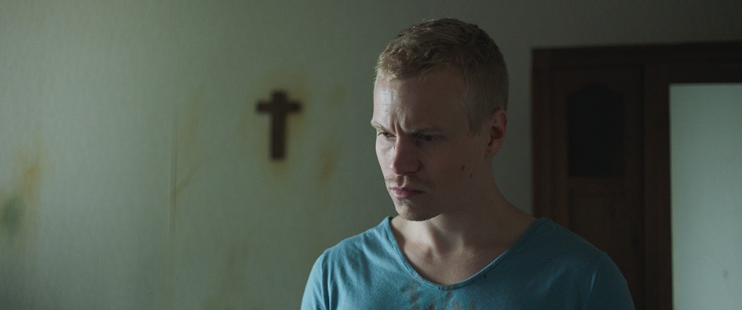

## **Klapbord**

Tijdens het Gentse Filmfestival, op zondagavond 15 oktober 2017, kende het langspeelfilmdebuut van Kristof Hoornaert, **Resurrection**, zijn wereldpremière. Voor de jonge Vlaamse regisseur uit Oostende, was dat gebeuren in meer dan één opzicht een verrijzenis. Zijn eerste kortfilm, [Kaïn](http://www.menstis.be/film-focus/kain/) dateert al van 2009. Hij kreeg ervoor op het filmfestival van Berlijn een nominatie voor de Gouden Beer. Zijn tweede kortfilm, **The Fall** (2013), moest hij draaien zonder budget en de opnames moesten op één dag worden gerealiseerd. Toch won de film verschillende prijzen en was hij te zien op meer dan 40 filmfestivals. Ook zijn derde kortfilm, **Empire**, kende een internationale carrière. Die drie kortfilms waren stapstenen naar zijn eerste langspeelfilm. Hoornaert schreef net zoals voor zijn triptiek van kortfilms, ook voor zijn langspeelfilmdebuut zelf het scenario. De release van de film in de Belgische bioscopen vanaf 10 januari 2018 is een unieke gebeurtenis in het landschap van de Belgische en vooral Vlaamse film.

## **Synopsis**

Vandaag, ergens in een stad. Torengebouwen tekenen zich af hoog in de lucht. Plots verschijnt er zwarte rook. Een bomaanslag op een bus. Slachtoffers liggen op straat, sommigen bewegen. Anderen helpen elkaar de gehavende bus uit. Vijfentwintig jaar later. Twee jonge mannen vechten in een bos op leven en dood. Een van hen vermoordt de ander en dumpt diens lijk in het bos. De dader vlucht in paniek weg, halfnaakt komt hij uit een vijver. Ontredderd legt hij zich buiten het bos neer in het hoge gras. Daar vindt een oude man met zijn hond hem. Hij geeft de ontredderde jongeling onderdak in zijn afgelegen boerderij. Na de aanslag op de stadsbus leeft de oude man als enig overlevende van zijn gezin teruggetrokken in de boerderij midden in de natuur. Hij zorgt er trouw voor zijn dieren en planten. Hij leidt een zeer sober bestaan en put energie uit de stille nabijheid van de weilanden en het nabijgelegen bos. De afwezigheid van mensen maakt hem rustig. De oude man probeert contact met de anonieme jonge man te krijgen, maar dat lukt niet. De jonge moordenaar dwaalt rond in zijn gedachten en gevoelens. De gastvrijheid van de oudere man overmant hem. Beiden communiceren via de stilte en hun dagelijkse handelingen. Alleen de oude man blijft proberen om tot een gesprek te komen. Tevergeefs. Langs de radio hoort de oude man een live verslag over een terroristische aanslag. Dat bericht katapulteert hem terug naar het drama dat zijn leven omgooide. Hij trekt zich terug in zijn slaapkamer waar hij knielt bij het kruisbeeld en het Onze Vader bidt: ‘Verlos ons van het kwade’. Na een bezoek van de politie, beseft hij dat hij het kwade in de persoon van de jonge man in zijn huis heeft binnen gehaald. De oude man besluit om de plek van de misdaad in het bos op te zoeken. Wanneer hij terug thuis is, vertelt hij aan de jonge moordenaar dat lang geleden zijn vrouw en zoon omgekomen zijn tijdens een bomaanslag in de stad. Daarna heeft hij zich van de wreedheid, eigen aan de mensenwereld, verwijderd om een teruggetrokken bestaan te leiden, ver weg van de mensenwereld. De jonge moordenaar aanhoort het verhaal, zegt niets, maar schreeuwt met zijn hele wezen zijn verwarde gevoelens uit. De oude man omarmt de ontredderde jonge man. ’s Anderendaags stelt de oude man vast dat zijn gast is weggegaan. Kort daarna krijgt hij een telefoon van de gevangenis om te melden dat de jonge moordenaar zichzelf heeft aangegeven. De oude man verlaat zijn boerderij, vergezeld van zijn hond. Hij meldt zich op zijn beurt aan in de gevangenis. Daar neemt hij zijn intrek in een cel. Hij neemt de plaats in van de jonge man. Daar zien ze elkaar terug en omarmen elkaar. Ze hebben geen woorden nodig.

## **Cinematografie**

LINEAIRE NARRATIVITEIT. **Resurrection** kent een narratieve opbouw met een lineair verloop. De film opent met een korte proloog die zich situeert ergens in een hedendaagse stad met woonblokken. Daarna volgt de generiek op een zwarte achtergrond. De generiek sluit af met de filmtitel. Daarna bouwt de regisseur-scenarist een spanningsboog op via vijf bewegingen die elk uit verschillende taferelen bestaan. De vijf bewegingen zijn enkel gemarkeerd door een fade out naar een zwart beeld. Behalve dat zwart beeld, zijn er geen aanduidingen. 

De _eerste_ beweging opent in een groot bos waar zich het drama van de broedermoord afspeelt. De beweging eindigt met de jonge moordenaar in de eetkamer van de boerderij van de oude man. Hij zit er alleen aan tafel, nadat de oude man hem een goede nacht heeft gewenst. Het slotbeeld bestaat uit een inzoom op de rug van de jonge man aan de tafel.

De _tweede_ beweging opent met het panoramische beeld van de eerste ochtendschemering na de donkere onweersnacht. De eerste dag van de verblijf van de jonge man in de boerderij begint. De beweging mondt uit in een inzoom door het keukenraam met zicht op twee bomen waartussen de oude man over de horizon schouwt. Net daarvoor heeft hij op de radio het live verslag beluisterd over een dodelijke schietpartij die zich in een of andere stad aan het voltrekken is.

Ook de _derde_ beweging zet in met een panoramisch beeld. Het toont het omringde grasland waarin zich de enige toegangsweg naar de boerderij aftekent. De beweging sluit af met een panoramisch beeld met de oude man die stapt richting boerderij. Tussen beide panoramische beelden in gaat oude man in het bos de plaats opzoeken waar de politie het lijk van het slachtoffer heeft gevonden. Ondertussen zit de jonge man aan de tafel met zijn handen aan zijn hoofd. Hij schreeuwt zijn verscheurde ziel uit.

De _vierde_ beweging opent met een medium shot van de boerderij. De oude man komt uit de werkplaats, hij stapt richting het huis en treft er opnieuw de politie aan. De beweging gaat over naar een zwart beeld na de scène waarin de oude en de jonge man elkaar omarmen. Daarvoor heeft de oude man aan de jonge man zijn verleden verteld, waarna hij nogmaals vraagt aan de jonge man wie hij eigenlijk is. De jonge man begint te wenen. De oude man troost hem.

De _vijfde_ beweging opent met de jonge man. Hij begint een nieuwe dag en gaat voor het eerst sinds zijn verblijf op de boerderij, naar buiten. Wanneer de oude man opstaat, is de jonge man verdwenen. Later krijgt de oude man tweemaal een telefoon. De tweede maal neemt hij op en verneemt hij waar de jonge man zich bevindt: in de gevangenis. De oude man komt aan in de gevangenis. Hij krijgt er een eigen cel waar de jonge man hem komt opzoeken. Beiden spreken geen woord. Ze omarmen elkaar. Dat beeld gaat via een fade out over naar een zwart beeld met de eindgeneriek. Het korte tafereel in de gevangenis verschijnt als het narratieve orgelpunt van de hele film. 

CINEMATOGRAFISCHE LIJNEN IN HET TEKEN VAN HET KRUIS.. Niettegenstaande de talrijke panoramische shots die in principe een horizontaal blikveld scheppen, kent de film ook een _verticale beeldlijn_. Kristof Hoornaert schept inderdaad een eigen cinematografische sfeer via een verticale camerabeweging of een verticaal hemelbeeld. De verticale beeldlijn beweegt zich tussen de punten ‘hemel’ en ‘aarde’. Dat geldt al voor het openingsshot van de proloog met de appartementsblokken. Ook de eerste beweging opent met een shot van de hoge boomkruinen reikend naar de hemel. De twee zopas genoemde openingsshots beschrijven die beeldlijn van boven (hemel) naar beneden (aarde). In proloog gebeurt dat in één ononderbroken beweging, in de eerste beweging, na de filmtitel, gebeurt die neerwaartse beweging trapsgewijs. In diezelfde eerste beweging komt het eerste hemelbeeld voor. Dat bevindt zich aan het hoogste punt van de verticale beeldlijn. De moordenaar met naakt bovenlijf heeft het bos verlaten en legt zich neer in het hoge gras. Dan komt er een beeld van de hemel. De wolken versluieren de zon die onzichtbaar blijft. Ze kondigen een nakend onweer aan. In de derde beweging ligt de oude man op de plaats waar het lijk is gevonden. Hij draait zich op zijn rug en kijkt naar de hemel. Dan volgt de inlas met het verticale beeld van het hoge bladerdek waar doorheen de zon schijnt. In de vierde beweging, met name na het tweede bezoek van de politie, zoekt de oude man steun tegen de stenen muur. Dan last de cineast een beeld in van de hemel. Doorheen het hoge wolkendek blijft de zon zichtbaar tot er een donkere wolk haar helemaal verbergt. Ze kondigt een onweer aan. Kort daarna volgt de belangrijke monoloog van de oude man die zijn geschiedenis deelt met de jonge moordenaar. In de vijfde en laatste beweging monteert de regisseur opnieuw een inlas van een hemelbeeld. Na het vertrek van de jonge man gaat de oude man naar de groentetuin. Hij aarzelt even en gaat naar de witte rozenstruik in bloei vlakbij de groentetuin. Hij neemt de bloemen in zijn handpalm, schouwt over de horizon met het bos. Dan komt het beeld van de hemel met het wolkendek waarin toch de heldere lichtbol van de zon aanwezig is. 

Daarnaast werkt de regisseur nog de verticale beeldlijn uit in de cinematografische schildering van _de relatie tussen de twee personages_. Die beeldlijn ontstaat door het blikveld van beiden. Ze bevinden zich namelijk niet steeds op dezelfde hoogte. Dat blijkt al uit hun eerste ontmoeting. De jongen die in het hoge gras ligt, schrikt op van de blaffende hond. Hij kijkt neergezeten op naar de oude man die de hond tot bedaren brengt. Omgekeerd ziet de oude man de jonge, halfnaakte man met zwijgende wanhoop in zijn ogen. De oude man staat recht en bevindt hij zich cameramatig aan de bovenkant, de hemelkant, van de verticale beeldlijn, terwijl de jongen zich aan de benedenkant ervan, de aardekant, bevindt. In de tweede beweging, meer bepaald in het tafereel met het Onze Vader, werkt de cineast opnieuw een verticale beeldlijn uit. De oude man bidt neergeknield het grote, christelijke gebed. Daarbij kijkt hij opwaarts naar het kleine kruisbeeld aan de muur van de kamer. Dat gebeurt bij het begin van het gebed. Bij de laatste zin, ‘Verlos ons van het kwade’, kijkt hij naar beneden, waarna hij die zin een tweede keer bidt, nu met zijn blik terug opwaarts naar het kruisbeeld gekeerd. Een vergelijkbare verticale beeldlijn ontstaat ook op het einde van de vierde beweging. Net voor de eerste omarming zit de jonge moordenaar wenend aan de tafel met zijn hand aan zijn hoofd. De oude man komt naar hem toe en neemt de hand van de jongen weg. Die kijkt met een betraand gelaat op naar de rechtstaande, oude man. Vervolgens volgt er een shot van de oude man die kijkt naar de neergezeten en terneergedrukte jonge man. Hun blikken kruisen elkaar. Ze omarmen elkaar. Met dat shot eindigt de vierde beweging.

In de optiek van de verticale beeldlijn krijgt de keuze voor _de panoramische beeldwerking_ een bijzondere betekenis. De sleutel ervan bevindt zich in _het teken van het kruis_. Dat geldt voor het belangrijke visuele leidmotief van de film, dat van de panoramische beelden met de weilanden, de bomenrijen en de lichtende hemel in de verte. Dat beeldmotief ontstaat uit _de kruising van de horizontale dwarslijn met de verticale hoogtelijn_. De aarde-hemellijn kruist met de horizontale aardelijn van het landschap. Die lijn heeft een menselijke pendant. Leonardo da Vinci begreep dit toen hij zijn beroemde [Homo Vitrivius](https://commons.wikimedia.org/wiki/File:Da_Vinci_Vitruve_Luc_Viatour.jpg ) heeft getekend. Dit is op zich geen ontdekking van da Vinci. De Romeinen gebruikten die kennis om minder esthetische redenen. Ze ontwikkelden de kruismethode als marteltuig voor het menselijk lichaam. Via het christelijke verhaal van de kruisweg van Jezus is de Romeinse kruismethode bezit van de collectieve verbeelding geworden. Het kruisteken is zelfs uitgegroeid tot het gebedsteken bij uitstek waarmee de christenen hun religieuze rituelen beginnen en afsluiten. Ze tekenen dan het kruis op hun eigen lichaam. Dat doet ook de oude man. Hij maakt in de tweede beweging, na het nieuwsbericht van de aanslag te hebben beluisterd, een kruisteken alvorens het Onze Vader te bidden in zijn slaapkamer. In Resurrection wordt dit gegeven van het lichamelijk kruisteken nog op een impliciete manier aangebracht op het einde van de film. Wanneer de oude man de gevangenis binnenkomt, moet hij de metaaldetector passeren. Daartoe moet hij gestrekt blijven staan met zijn armen wijd open. Hij oogt als een levend kruisbeeld, gevormd door de verticale en horizontale lichaamslijn. In de Europese schilderkunst heeft de meester van het spirituele landschap, [Caspar David Friedrich](https://www.caspardavidfriedrich.org/links.html), voor het eerst die religieus geïnspireerde kijk op het fenomeen van de horizon in zijn landschapsschilderijen uitgewerkt. De Russische filmregisseur [Andrei Tarkovski](http://www.menstis.be/film-focus/andreiroublev/) is hem daarin gevolgd. Ook de Franse cineast _Bruno Dumont_ is in diezelfde voetsporen gestapt. Kristof Hoornaert is met **Resurrection** langs die esthetische weg zijn eigen persoonlijke weg gegaan.
 

SOUNDSCAPE. **Resurrection** kent een zeer eenvoudige en tegelijkertijd complexe soundscape. Een _eerste_ klanklaag ervan bestaat uit de klank van de dingen, waarvan de natuur het grootste aandeel heeft. In de tweede en de vierde beweging weerklinkt het onweer met de regen. Telkens begeleidt die muziek van de hemelwolken de scène met de twee mannen aan de tafel. De _natuurlijke partituur van de dingen_ kent ook de geluiden van het bos. De wind, het gekraak van het gevallen hout, het blaffen en gejank van de hond en vooral het gefluit van de vogels. 

Een _tweede_ klanklaag ontspringt aan de handelingen van de personages. De voetstappen in het hoge gras, in het bos, in het huis. De talrijke binnengeluiden aan de tafel en in de keuken zoals het wassen van de handen en de borden, het plaatsen van de borden op de tafel, de klank van het bestek tijdens het eten, het gekraak van de oude deuren. Alle kleine, dagelijkse handelingen hebben hun eigen muziek. Die geluiden klinken als noten van de partituur, gecomponeerd door het levensritme zelf. Cinematografie klinkt hier als kamermuziek geschreven voor een oude man met hond, een jonge man met een bezwaard gemoed en een boerderij in een groen landschap met bossen en weilanden. 

Een _derde_ klanklaag is die van de menselijke cultuur. Die weerklinkt in de eerste plaats via de radio die live een verslag over een moordende aanslag uitzendt, beluisterd door de oude en de jonge man. Daarnaast is er ook nog de muziek. Ook via de radio luistert de jonge man naar de Introïtus van Mozarts Requiemmis. Datzelfde muzikaal citaat begeleidt nadien ook de eindgeneriek. De Latijnse tekst luidt:

>_Requiem aeternam dona eis, Domine,
Et lux perpetua luceat eis.
Te decet hymnus, Deus, in Sion,
Et tibi reddetur votum in Jeruzalem.
Exaudi orationem meam
Ad te omnis caro veniet._

Vrij vertaald zegt dit openingsgebed van de Latijnse uitvaartdienst het volgende:

>_Heer, geef hen de eeuwige rust.
Laat het eeuwig licht op hen schijnen.
U komt de lofzang toe, God, in Sion,
In Jeruzalem zal ik U de beloofde offers brengen.
Verhoor mijn gebed.
Tot U komen alle stervelingen.
Heer, geef hen de eeuwige rust.
Laat het eeuwig licht op hen schijnen._

In een andere scène gaat de oude man zelf aan het harmonium zitten. Dat gebeurt in de laatste beweging. Op het ogenblik dat hij beseft dat de jonge man weg is gegaan, speelt hij een rustig, eenvoudige muziek. Het betreft een heel eenvoudige gelegenheidscompositie van Steve Willaert. Tot de klanklaag van de cultuurgeluiden horen ook _de woorden_ die de personages spreken. Dat geldt alleen voor de oude man. Hij spreekt zeer weinig. In de tweede beweging bidt hij het Onze Vader. In de vierde beweging vertelt hij het verhaal van zijn leven aan de vreemde jonge man. Daarnaast zijn er de twee scènes met een dialoog tussen de oude man en de twee politiemensen. Het is eerder een monoloog waarin de oude man luistert naar de talrijke vragen van de politie. Die wil hij echter niet beantwoorden. Hiermee beschermt hij de jonge man die hij als gast in zijn huis heeft opgenomen. 

De _diepste_ klanklaag van de soundscape van de film is echter _de muziek van de stilte_. Die weerklinkt eerst en vooral in de panoramische beelden. De stilte bestaat uit de klank van het landschap met boerderij. Daarnaast bestaat de stilte vooral uit het zwijgen van de twee personages. Dat geldt in de eerste plaats voor de jonge moordenaar. Hij zegt geen woord in de hele film. Hij huilt luid en op het einde weent hij in het bijzijn van de oude man. Spreken doet hij niet. En ook de oude man zwijgt meer dan dat hij woorden gebruikt. Hier wordt zeer duidelijk hoe Kristof Hoornaert consequent _de eigen kracht, de beeldende kracht_, van de cinematografie cultiveert. In de meeste films spreken acteurs. Ze declameren teksten in voorgeschreven dialogen en monologen. De unieke cinematografische kracht van de filmkunst bevindt zich daar waar ze ophoudt gefilmd theater te zijn. De acteurs krijgen dan de ruimte om te spreken via hun lichaam. Dat geldt voor Resurrection. De film verschijnt in die optiek als _cinematografische kamermuziek voor twee gezichten_. Dat resulteert in _het eigen ritme van de menselijke stilte_. Dat ritme is bijzonder subtiel en meesterlijk uitgewerkt. De regisseur evoceert ermee de unieke, rijke klank van de stilte aanwezig in de schouwende blik van beide personages. In de scène van de eerste ondervraging door de politie, blijft de camera helemaal gericht op de gelaat van de oude man. Hij antwoordt en reageert zwijgend op de talrijke vragen die de politiemannen hem voorleggen. Hetzelfde beeldritme typeert de scènes met de zwijgende jonge man. Via dat beeldritme schildert de regisseur een cinematografisch landschap van gezichten. Voor heel wat toeschouwers die gevormd zijn door de dagelijkse stroom van banale consumptiebeelden, allemaal voortgestuwd door een hectisch ritme, oogt **Resurrection** als een erg trage film. De toeschouwer daarentegen die ruimte geeft aan de kracht van het beeld zelf, ontdekt de eigen intensiteit aanwezig in het landschap van de gezichten. In dit opzicht verdient de cineast grote waardering voor _zijn uitgekiende acteursregie_. Hij is erin geslaagd het acteertalent van de internationaal erkende acteur _Johan Leysen_ met zijn gegroefd gelaat optimaal te integreren in zijn filmisch verhaal. Datzelfde geldt voor de manier waarop hij het talent van de jonge _Gilles De Schryver_ laat schitteren. Bij het grote Vlaamse publiek geniet de acteur bekendheid als komische acteur, terwijl Hoornaert recht doet aan het groot dramatisch talent van de jonge Belgische film-, televisie- en theateracteur en dito schrijver en producent. Hoornaert toont hoe alleen film in staat is een dergelijke metamorfose van een acteur te realiseren, een acteur die schittert door consequent te zwijgen. 

HET DERDE PERSONAGE. Naast de twee mannelijke hoofdpersonages kent **Resurrection** nog een derde, een niet-menselijk hoofdpersonage, met name _het landschap met boerderij_. Voorbij het bos waar zich het drama van de twee broers afspeelt, bevinden er zich weilanden met een glooilijn naar de horizon. Er loopt slechts één aarden weg die leidt naar de boerderij. Daar heeft de oude man zich met zijn hond teruggetrokken en voorziet hij er in zijn eigen onderhoud. Hij houdt er enkele melkkoeien, kweekt er wat kleinvee en hij tuiniert er. In zijn woning houdt hij enkele kamerplanten. De unieke locatie die wonderwel past in het scenario, heeft een onzichtbare link met het thema van het kwade. Alleen de geïnformeerde toeschouwer beseft dat. In een persoonlijk gesprek met de auteur vertelde Kristof Hoornaert over zijn erg lange en geduldige zoektocht naar de geschikte locatie. Hij wilde immers niet in een studio filmen. De opnames in het bos gebeurden in het Zoniënwoud ten zuiden van Brussel. Het landschap met boerderij vond de regisseur over de Belgische grens, in het Franse _Romagne-sous-Montfoucan_ in het noordoostelijk gelegen Lorraine. Het betreft de _Ferme La Robinette_. Een echte vondst. In de film spreekt een politieman de naam Robinette uit. Hij verwijst er naar het afgelegen bos waar het lijk van het slachtoffer is gevonden. De oude man zegt dat hij daar niet komt. In werkelijkheid is La Robinette de officiële naam van de boerderij in kwestie. Door de boerderij een hoofdrol te geven in de film doet de regisseur _de historische boerderij_ alle eer aan. Hij brengt ze helemaal terug tot leven. Een echte ‘_resurrection_’. Volgens geschreven bronnen is de boerderij sinds de jaren vijftig van vorige eeuw onbewoond gebleven. Volgens het scenario zijn het hoofdpersonage en de boerderij na vijfentwintig jaren vergroeid met elkaar. Dit gegeven kan enkel filmisch werken in een boerderij die de littekens van de tijd vertoont, net zoals het gerimpelde gezicht van de oude man zijn leeftijd laat zien. De tijd heeft in Romagne-sous-Montfoucan diepe en blijvende sporen nagelaten. Het gebouw vertoont diepe architecturale rimpels. Dat geldt ook voor het meubilair. De historische littekens komen niet direct in beeld, maar via het thema van het kwaad belichten ze wel op een unieke wijze het verhaal dat Resurrection vertelt. De naam Romagne-sous-Montfoucan is namelijk sterk verbonden met het kwade dat verbonden is met de gruwel van _de Eerste Wereldoorlog_. In en rond de boerderij heeft de Duitse agressor in april 1916 het Waltlager La Robinette uitgebouwd, een afgelegen verblijfplaats waar de soldaten even konden uitrusten. De plaats ligt op circa 40 kilometer van het meer gekende Verdun. Het grootste Amerikaanse militair kerkhof in Europa, _het Meuse-Argonne American Cemetery_ ― 14 246 graven over 52 hectaren ―  is gelegen in het landschap van Romagne-sous-Montfoucan. Er bevindt zich eveneens een kleiner Duitse militair kerkhof op het grondgebied van de gemeente. De soldatengraven zijn blijvende stille getuigen van de oorlog die het Amerikaanse en Duitse leger uitvochten gedurende het Meuse-Argonne-offensief tijdens de laatste maanden van de Eerste Wereldoorlog. Terwijl hij de opnames in en rond de boerderij leidde, vernam de regisseur dat de boerderij ook tijdens de Tweede Wereldoorlog een rol speelde. De SS vestigde er haar hoofdkwartier in de streek. 

In vorige eeuw heeft het kwade zich dus meermaals gehuisvest in de boerderij. Dat gebeurt ook in de film, maar op een niet-historische manier. De oude man trok zich na de bomaanslag waarbij hij zijn vrouw en zoon heeft verloren, terug in de boerderij. Hij nam afstand van de bewoonde wereld. Sindsdien wantrouwt hij mensen. Nu blijkt dat hij, zonder het te beseffen, het kwade zelf herbergt wanneer hij de jonge man aan de rand van het bos aantreft en onderdak geeft. Via het hoofdpersonage van de boerderij La Robinette verbindt de regisseur het fenomeen van het historische kwade in de mensenwereld via de twee Wereldoorlogen met het hedendaagse kwaad van de terroristische aanslagen in het Westen, het Oosten, het Midden-Oosten en Africa. En die actuele verschijning van het kwade verbindt hij met het universele gegeven van het kwaad dat schuilt in het hart en de geest van iedere mens, belichaamd door de anonieme jonge man die zijn broer vermoordt. De reden waarom hij het deed, blijft onbesproken. Wellicht weet hij het zelf niet en is hij in zekere zin via de moord _het kwade in zichzelf_ tegengekomen. In haar recent album _If All I Was Was Black_ (2017) zingt de zwarte, Amerikaanse zangeres [Mavis Staples](https://www.mavisstaples.com/) de nieuwe song _Try Harder_. Die opent met de verzen: ‘_There’s evil in the world, and there’s evil in me._’ Dit ongewild parallelisme tussen **Resurrection** en Mavis’ nieuwe song toont hoe de film zich beweegt op de golflengte van de worsteling van onze tijd met het fenomeen van het kwade. Het lijkt wel _een oerfenomeen_ te zijn in de wereld bevolkt door mensen. Maakt religie daar deel van uit of is ze een humane respons op dat oerfenomeen? Die vragen openen de eigen betekenisruimte van Resurrection.

## **Betekenisruimte**

HET CINEMASCOPISCHE TOESCHOUWERSCHAP AAN ZET. Kristof Hoornaert stelt in een interview, gepubliceerd in de _Perskit_ van de film, dat **Resurrection** ‘_een mentale film_’ is. Door de eigen kracht van de beelden is de toeschouwer aan zet. Hij maakt al schouwend de film in de mentale ruimte van zijn drie ogen: de twee ogen en het derde oog, het mentale oog (‘the mind’). Dat samenspel heet in [Levensbeschouwing democratisch belicht](http://www.menstis.be/uitgeverij/Levensbeschouwing), _het contemplatievermogen_ van de mens. Het maakt de mens tot het schouwend wezen dat hij kan worden. Die toeschouwer krijgt een actieve rol in de film. Tijdens de opnames zijn niet alleen de acteurs en de dingen aanwezig, maar ook de toeschouwer speelt mee. Dat uit zich in het gebruik van het cinemascoopformaat. Hierdoor komt de film het best tot zijn recht in een bioscoop. Regisseur Hoornaert licht in de _Perskit_ van **Resurrection** zijn bewust gebruik van het cinemascoopformaat toe:

>_Omdat dit formaat je toelaat om beelden te maken. Dat klinkt misschien vreemd, want is cinema niet altijd beeldend? Maar het brede cinemascoop-formaat zorgt ervoor dat je minder op de huid zit van je personages. Cinemascoop creëert een afstand tussen de kijken en het onderwerp dat je aan het filmen bent. Het is minder psychologisch. Je ziet een personage in zijn omgeving, dat maakt het beeld contemplatiever. Het ‘nadenken over’ is mijn doel met deze film. Cinemascoop geeft mij de mogelijkheid om de wereld te observeren in beelden. De camera als een telescoop of microscoop die de mens observeert in de wereld waarin hij leeft._

De camera toont de personages op het ogenblik dat ze zich als mens in de situatie bevinden dat ze schouwend in het leven willen staan. Bij de oudere man is dat een zeer bewuste keuze. Na het dramatisch gebeuren van het kwade in de wereld die zijn hele wezen overhoop heeft gehaald, trekt hij zich terug in de boerderij La Robinette. Telkens wanneer hij met het kwade in aanraking komt, zoekt hij schouwend te horizon op. Dat gebeurt wanneer hij op de radio het live verslag hoort van een alweer nieuwe terroristische aanslag. Eerst gaat hij naar zijn slaapkamer waar hij het Onze Vader bidt, waarna hij buiten tussen de twee bomen over de horizon schouwt. Die zoekt hij opnieuw op wanneer het na het bezoek van de politie het bij hem begint door te dringen dat hij een jonge moordenaar onderdak heeft verleend. Op de dag dat hij ontdekt dat de jonge man weg is gegaan zonder iets te zeggen, verbindt de oude man zich opnieuw schouwend met de horizon waaraan hij zo gehecht is. Het is zijn tweede thuis. De oude man staat schouwend in het leven. Dat betekent dat hij het leven met al zijn dingen die hem omringen, inademt tot in het diepste vezels van zijn bestaan. Zijn schouwen is voor hem een act van intense verbondenheid met alles wat deel uitmaakt van zijn bestaan in de boerderij en het omringende landschap. Die intensiteit wordt zichtbaar in zijn gelaat en zijn gebaren. Dat laatste blijkt uit de wijze waarop hij de wit-roze bloem van de kamerplant felicia streelt op de vensterbank en de roos op de struik nabij de groentetuin. Hij gaat zorgzaam om met zijn dieren. En in de derde beweging stapt hij naar de plaats delict. Op de plaats waar het lijk is gevonden, raakt hij de aarde aan en legt hij er zich neer. Op het einde van de derde beweging, met name na het tafereel met de bloedneus van de jonge man, gaat de oude man opnieuw naar buiten, schouwt over de horizon, stapt toe naar een oude boom, raakt die wenend aan. _Toeschouwen_ is geen passieve bezigheid, het is een act van intense verwevenheid met de levensader en met de tragiek die eigen is aan het menszijn.  

HET MENSELIJKE GELAAT VAN HET KWADE. **Resurrection** opent met een dubbel beeld van het fenomeen van het kwade. De proloog evoceert in een ononderbroken sequentie het drama van een terroristische aanslag. Het tafereel synthetiseert de niet aflatende beelden van de bloedige aanslagen die de voorbije jaren de nieuwsbeelden de revue zijn gepasseerd. Daarna opent de eerste beweging met de broedermoord. Twee jonge mannen vechten midden in het bos op leven en dood. Een van de twee wordt de moordenaar, de ander het slachtoffer. Het gebeuren voltrekt zich. Er is geen context behalve het bos. De beelden ontdoen het fenomeen van het kwade van al zijn historische verschijningen en tonen er de concrete harde kern van. Het betreft het beroven van het leven van een mens door een medemens. Twee mensen, twee broers, delen hetzelfde leven, hebben dezelfde moeder, maar de een gunt de andere niet de gave van het leven, die hij nochtans zelf ook als een kostbaar geschenk heeft ontvangen. De registratie van dàt oerfenomeen gebeurt door een derde, de regisseur, de beschouwer. Hij neemt afstand van dat kwade, maakt er zich los van en wordt beschouwer. Die beschouwer is altijd _een levensbeschouwer_. Hij stelt vragen waarvan de klank een echo vormt die weerklinkt tot in het heelal. De oude man luistert naar de vragen van de politie die op zoek zijn naar de dader. Hij luistert terwijl hij de mannen aankijkt. Zijn blik en gelaat spreken boekdelen. Zijn woorden zijn gemeten: ‘_Dat zo iets kan gebeuren!_’ Niet alleen die spaarzame woorden, niet alleen zijn blik, maar ook zijn hele lichaam, zijn wenen, vertolkt zijn verwondering over de niet te stoppen gang van het kwade. Die verwondering vormt de bron van de schouwende blik van de oude man in **Resurrection**. Hij is de dubbelganger van de regisseur zelf. 

Kristof Hoornaert maakte zijn debuut als cineast met de kortfilm **Kaïn**. Dat was zijn zeer geslaagde vingeroefening, de opstap naar **Resurrection**, met een tussentijd van acht jaar. De proloog van de film is een bewerking van **Kaïn**, nu gecomponeerd als de ouverture op de eerste langspeelfilm van Hoornaert. De titel **Kaïn** verwijst naar het Bijbelverhaal Kaïn en Abel in _[Genesis 4, 1-16](https://www.kuleuven.be/thomas/page/bijbelfiche-kain-en-abel/)_. Hier is de anonieme schrijver de tolk van de menselijke verwondering over het oerfenomeen van het kwade dat de ene mens de andere aandoet. **Kaïn** en de proloog van **Resurrection** illustreren het Bijbelverhaal niet. Ze dringen door tot _de levensbeschouwende kern_ ervan, verborgen in de taal. Die Bijbeltaal zoekt de verbeelding op via het beeld van de twee broers Kaïn en Abel. Het giet de verbeelding in de mal van de taal. Dat impliceert dat het verhaal gevangen zit in een bepaald denkpatroon dat in dit geval bestaat uit een genealogische gedachtegang, gecombineerd met een bepaalde religieuze voorstelling, eigen aan een etnische bevolkingsgroep op zoek naar haar eigen identiteit. De cinematografie van **Kaïn** en **Resurrection** weekt het oerfenomeen van het kwade los van die literaire en culturele inbedding. Ze onthult er _de blijvende, levensbeschouwelijke kern_ van, het open zicht op de overrompelende aanwezigheid van de tragiek van het kwade dat menselijke wezens elkaar blijven aandoen, ook en vooral zij die broeders zijn en dus van nature geroepen zijn om elkaar te helpen en te steunen. Diezelfde verwondering komt ook in een ander, overgeleverd genealogisch verhaal terug. Vergilius’ _Aeneas_ vertelt in de eerste eeuw v. Chr. het mythisch verhaal van de oorsprong van de stad Rome door de tweelingbroers _Romulus_ en _Remus_. Romulus vermoordde zijn tweelingbroer na een ruzie over de vraag wie van beiden de eerste koning over de stad zou worden en naar wiens naam de stad genoemd mocht worden. Ook hier drong het besef van de broedermoord door tot in de diepste lagen van de Romeinse collectieve herinnering. In **Kaïn** en de proloog van **Resurrection** ontdoet Hoornaert die herinneringen aan het fenomeen van de broedermoord van hun genealogische context. Hij smeedt het tot _het oerbeeld van het kwaad_, gesitueerd in de context van het bos, tastbaar teken van de planetaire thuis van de mensheid. Dat beeld onthult het grote contrast tussen de grootsheid en schoonheid van het leven op aarde en het moordend geweld van de mensen. Zij verschijnen als een klein deel van de grote, groene levenszone. Zij hebben geen enkel oog voor datgene waaruit ze zijn voortgekomen en wat ze delen, het levende leven. Ze slaan op elkaar in en gunnen elkaar geen levensruimte. De een slaat de ander dood. De beschouwer bij uitstek, de oude man in de boerderij, registreert dat destructief gegeven, eigen aan de mensenwereld, _met_ en _in_ heel zijn wezen. In de vierde beweging spreekt de oude man de jonge moordenaar aan. Op het einde van het korte getuigenis over zijn eigen levensgeschiedenis verwijst hij ook naar de broedermoord. Hij zegt letterlijk: ‘_Hoe kan zo iets gebeuren? Hoe kan je zo iets doen? Waarom in Gods Naam?_’ Hij vertolkt zijn levenslange verwondering over de terugkeer van het kwade in de aardse mensenwereld. Hij stelt vragen in het besef dat er geen antwoord voorhanden is. De jonge moordenaar kan zelf geen woord uitbrengen. De politie vertegenwoordigt het antwoord van de maatschappij. De twee mannen moeten het probleem van de moord oplossen door de dader te vinden. Dan is, zoals dat heet, ‘de moord opgelost’. De oude man weet beter. Als de beschouwer ziet hij in de lokale moord de heerschappij van het oerfenomeen van het kwade. In zijn levensbeschouwelijke aanwezigheid bij de dingen en de gebeurtenissen ontdoet hij het kwade van zijn maatschappelijk en psychologisch omhulsel. Hij beslist om de jonge moordenaar die in zijn huis schuilt, niet aan de politie uit te leveren. 

DE BARMHARTIGE SAMARITAAN. Wanneer de hond van de oude man de jonge moordenaar in het hoge gras aan de rand van het bos heeft gevonden, neemt de oude man de jonge man in bescherming. Hij roept de hond bij zich, stelt de jongen gerust en nodigt hem uit te komen schuilen bij hem thuis voor het nakende onweer. De oude man doet zijn jas uit om die over de schouders te leggen van de halfnaakte, verwarde jonge man. Die schrikt even en gaat een stap achteruit. Daarop overhandigt de oude man zijn jas aan de jonge man. Die trekt de jas van de man aan en volgt hem richting boerderij. Dit kennismakingstafereel contrasteert helemaal met die van de broedermoord. De oude man behoort tot een andere wereld en leidt de jonge binnen in een ongekende zone van leven. Het openingstafereel van de eerste beweging introduceert de oude man als een _Barmhartige Samaritaan_, een personage geïntroduceerd in [Lucas 10, 25-37](https://www.kuleuven.be/thomas/page/bijbelfiche-de-barmhartige-samaritaan/). Op de theoretische en theologische vraag wie is mijn naaste, antwoordt Jezus _beeldend_. Hij laat zich niet verleiden tot allerlei spitsvondige discussies met hun pirouettes van begrippen. Via het beeldend verhaal plaatst Jezus de vraag op de aarden vloer van het leven zelf. Alleen de kracht van het beeld kan dat en alleen de schouwende toehoorder verstaat dat. De hele eerste beweging staat vanaf de introductie van de oude man helemaal in het teken van het gebaar van de Barmhartige Samaritaan. Hij is de anonieme man die reageert op de gevolgen van het kwade in de mensenwereld. In **Resurrection** krijgt dit gegeven een bijzondere uitvergroting omdat hier de Barmhartige Samaritaan zich niet over het slachtoffer, maar over de dader ontfermt. Hij ziet een jonge man in nood en herbergt hem. Hij geeft hem een onderdak, eten en drinken, en kleding. Hij schenkt de jonge man een T-shirt van zijn omgekomen zoon die ongeveer dezelfde leeftijd had van de jonge, anonieme man. Maar de houding van de Barmhartige Samaritaan reikt verder dan die in het Bijbelverhaal. De oude man biedt de jonge man in nood niet enkel materiële, lichamelijke bescherming. Hij doet veel meer. Hij neemt een belangrijke beslissing na de eerste bevraging van de politie waardoor hij beseft dat hij de dader van de broedermoord onderdak verleent. Dat brengt een nieuwe dynamiek op gang, een dynamiek die zich bevindt aan de overzijde van de zuiver maatschappelijke of politionele omgang met het kwade. Vanaf de derde beweging ontwikkelt zich de levensbeschouwelijke confrontatie met het kwade in de dubbele regie van de oude man en Kristof Hoornaert.

ROUW EN BEROUW.De jonge moordenaar komt in de boerderij in contact met een hem volkomen vreemde wereld. Die staat haaks op de wereld waarvan hij de vertegenwoordiger is, die van het kwade in zijn ergste vorm: doodslag. Eerst is de jonge man verwonderd over de gastvrijheid van de oude man. Zonder enige vraag of uiterlijke dwang krijgt de jonge man kleding, eten en drinken, en een plaats om te slapen. Van de derde beweging af weet de oude man dat hij een moordenaar in huis heeft gehaald. Hij accepteert hem door te weigeren hem uit te leveren aan de politie. Wat hij vijfentwintig jaar heeft vermeden, de confrontatie met het kwade in de mensenwereld, staat en zit nu voor hem in de figuur van de jonge man. Uit zijn houding blijkt hoe de oude man daarover een zekere angst vertoont. Zal de jonge man zich ook tegen hem keren? Zal hij, net zoals zijn vrouw en zoon, uiteindelijk ook het slachtoffer worden van dat onbegrijpelijke kwade? Hij overwint zijn terechte angst en eerste verbijstering over wat hij nu meemaakt. Hij beslist om het kwade dat zo dichtbij is gekomen, helemaal onder ogen te zien. Daarbij blijft hij trouw aan zijn levensbeschouwelijke houding. Hij blijft zorgen voor de jonge man die hij mentaal ziet lijden: de onmacht om te spreken, de vertwijfeling in zijn blik, de handen aan zijn hoofd alsof er een storm in woedt, de schreeuw van een verscheurde ziel, het bloeden uit de neus, het overweldigende verdriet. 

De oude man geeft de jonge moordenaar de ruimte en de tijd om het kwade in zichzelf onder ogen te zien. Concreet gebeurt dit door de jonge dader op te nemen in _de dagelijkse rituelen van het wonen_: de tafel dekken, de handen wassen, brood eten, melk drinken, slapen, ontwaken. Die rituelen scheppen ruimte en tijd voor het verdriet eigen aan de rouw (de oude man) en het berouw (de jonge moordenaar). Dat menselijk verdriet verweeft zich met wat we hier in de sfeer van de film, de _weeklank_ ― nee, niet de weerklank, maar inderdaad de _weeklank_ ― van de dingen noemen. In de eerste en de vierde beweging weent de hemel regen. Die begeleidt en bezegelt de mensentranen. De oude man voert de rituelen van het wonen uit met een priesterlijke waardigheid. De jonge man merkt dat en na zijn eerste verwondering daarover, neemt hij geleidelijk aan die rituelen over. Het betreft geen de rituelen van een of ander religieuze cultus. Neen, de rituelen maken deel uit van _de levenskunst_ die haar wortels vindt in _de levensbeschouwelijke attitude_ van de oude man. Ze vormen het dagelijkse leven. Ze openen voor de jonge moordenaar de poort naar _het basale leven_. Het kwade waarin hij heeft verbleven heeft hem afgesneden van de oergrond van zijn eigen bestaan. De oude man is na de confrontatie met het kwade in de grootstad, teruggekeerd naar dat basale leven, ver van de stedelijke samenleving die zich steeds verder daarvan verwijdert. In het landschap met de boerderij heeft hij de wijding van het basale leven teruggevonden. Daar heeft hij _zijn eigen zone van zin_ ontwikkeld in de rituelen die een even eenvoudige als complexe uiting zijn van de zorg voor het dagelijkse wonen in verbondenheid met het omringde aardse leven. 

Het is in die zone van het basale leven dat de jonge moordenaar terug contact krijgt met _zijn eigen menselijke grondlaag_. Zo ontdekt hij dat de hond van de oude man over hem komt waken. De hond beschermt hem en blaft naar de politie als die begint vragen te stellen over de mogelijke aanwezigheid van de jonge moordenaar. Geleidelijk adopteert de jonge man de rituelen van de oude man over. Dat blijkt uit het gebaar van het strelen van de bloem van de kamerplant. De jonge man legt zich op het bed van de oude man en ziet hoe het kruisbeeld aan de muur in het blikveld van de oude man hangt. Hij interesseert zich in zijn beschermer die hij geleidelijk als zijn leidsman accepteert. Hij opent de schuif in het nachtkastje van de oude man en vindt er een oud exemplaar van het boek _Ornaments de la mémoire_, met erin een foto van diens echtgenote en zoon. Hij schenkt op zeker ogenblik zelf water in in het glas van de oude man. Hij helpt mee opruimen en afwassen. Hij luistert mee met de oude man naar het radiobericht over de terroristische aanslag, zoals hij ook aandachtig luistert naar het levensverhaal van de oude man en diens indringende levensvragen aan hem. Hij neemt zelf het initiatief om de radio aan te zetten en het begin van het Latijnse _Requiem_ in zich op te nemen. Hij stelt zich steeds kwetsbaarder op om op zeker ogenblik te beginnen bloeden uit zijn neus waarop ook een fysiek litteken van de moord zichtbaar is gebleven. Daarna blijft hij het T-shirt met de vlek van zijn eigen bloed dragen als zijn tweede litteken. Was er vanaf de eerste kennismaking, de eerste beweging, een afstand tussen beide mensen, dan verkleint die afstand geleidelijk op _het levensritme van de basale rituelen_. Die beweging van toenadering mondt uit in _het beeldende crescendo_ van de wederzijdse omarming. Daarmee besluit én de vierde én de laatste beweging.

DE TROOST VAN HET HEMELS-AARDSE LICHT. Het krachtigste ritueel van de levenskunst, beoefend door de levensbeschouwelijke oude man, is _het schouwen over de horizon_. Daarin beleeft hij zijn de betrokkenheid met de bron van alle leven op aarde, het hemelse zonlicht, dat in het derde deel van [Levensbeschouwing democratisch belicht](http://www.menstis.be/uitgeverij/Levensbeschouwing) met het neologisme _de Lichtaard_ wordt genoemd. Het visuele leidmotief van de hemelbeelden met de wolken en de zon, van de lichtbeelden aan het raam, van het bladerdek met de zon, van de panoramische beelden met de lichtende horizon, onthult hier zijn eigen unieke betekenis. Vooral in de lichtbeelden aan het raam weerkaatst de kracht van de Lichtaard zich op het gezicht van de personages. De oude man zoekt voortdurend dat licht op bij het raam met de kamerplanten, vooral dan wanneer hij voelt dat zijn verdriet over het kwade weer dreigt de bovenhand te halen. Het licht door het raam nodigt hem uit naar buiten te gaan waar hij over de lichtende horizon schouwt. In die schouwende verbondenheid met dat licht vindt hij niet alleen troost, maar bovenal energie en kracht om menselijk weerstand te bieden aan de impact van het kwade. Dat is de rijkste beleving die hij via de basale rituelen van de levenskunst zonder woorden overbrengt naar de jonge moordenaar. Ook die begint de richting van het licht op te zoeken. Hij gaat ook naar het raam toe om in dat licht zijn schouwend vermogen te ontdekken. 

Het slottafereel van de tweede beweging staat helemaal in het teken van die ommekeer van de moordenaar. Hij bevindt zich alleen in de kamer met de radio waarmee hij zopas het dramatische bericht over de terroristische aanslag mee heeft beluisterd. Hij heeft de oude man, overmand door een groot verdriet, de kamer zien verlaten. Hij draait opnieuw aan de radioknop en beluistert er Mozart’s _Requiem_. Hij laat er zich door raken. De muziek spreekt over de doden in relatie tot het hemelse licht, _Lux Aeterna_. De camera volgt de blik van de jonge man. Die gaat richting het raam met het volle licht die de drie kamerplanten doet groeien en bloeien. 

VERLOS ONS VAN HET KWADE.De tweede beweging is cruciaal in de eigen narratieve ontwikkeling van **Resurrection**. In de dramatische ontwikkeling ervan omvat ze het tafereel met het Onze Vader. En de beweging eindigt met het _Requiem Aeternam_ van Mozart. Beide momenten zijn gebedsmomenten. Het Onze Vader wordt luidop gebeden door de oude man nadat hij het live bericht over de terroristische aanslag heeft gehoord. Hij doet het helemaal alleen in zijn slaapkamer, geknield voor het kleine kruisbeeld aan de muur. Opmerkelijk daarbij is dat hij de slotzin ‘_En verlos ons van het kwade_’ herhaalt. Daarbij beschrijft hij met zijn blik een verticale beeldlijn. De eerste maal buigt hij zijn hoofd naar de vloer, de tweede maal richt hij zijn blik opwaarts naar het kruisbeeld. Ook het _Requiem Aeternam_ is een gebed. Het wordt gezongen door een koor. De jonge moordenaar laat het weerklinken in de kamer waar hij met de oude man eet. Daarbij absorbeert hij de requiemmuziek terwijl hij zijn blik richt naar het lichtende raam. Later verkent de jonge man de slaapkamer van de oude man en ziet er het kruisbeeld hangen. Via zijn gastheer en zwijgzame mentor verlaat hij langzaam de mentale kamer van het kwade waarin hij zat opgesloten en treedt hij binnen in de lichtende kamer van de levenskunst. Hij ontdekt dat de sleutel tot die mentale kamer _een christelijke signatuur_ heeft. Via de beluistering van het _Requiem_, het gezongen Latijnse openingsgebed van de katholieke begrafenisdienst, én via de ontdekking van het kruisbeeld in de slaapkamer, komt de jonge man op het spoor van de christelijke motivatie van zijn beschermheer, zijn Barmhartige Samaritaan. Hierdoor krijgt de betekenisruimte van **Resurrection** een _expliciete, christelijke_ dimensie. Kristof Hoornaert spreekt in de _Perskit_ daar ook zelf over. Hij belicht daarbij de titel en de anonieme figuur van de oude man. Hij verduidelijkt:

>_’Resurrection’ is een zwaar geladen titel. Daarom wordt die ook gepresenteerd in kleine letters in de film en op de poster. Het is een kleine symbolische verrijzenis van het hoofdpersonage. Natuurlijk wilde ik met deze titel ook verwijzen naar de verrijzenis van Christus. Ik wou altijd al een film maken over een Christusfiguur in onze moderne wereld. Een interessant idee om deze twee gegevens te contrasteren met elkaar._

In die optiek verschijnt de oude man als _een Christusfiguur_ in onze supermoderne wereld, getypeerd door zijn overbevolkte grootsteden met hun anonieme, agressieve beton- en glasarchitectuur, hun onophoudelijke strijd tegen alle vormen van agressie, hun hectische beeldschermcultus, hun verstikkende lucht en  ongebreidelde consumptiecultuur, gedirigeerd door een ontembare geldhonger. Die christelijke, of misschien beter gezegd, die _christische_ dimensie van **Resurrection** blijkt uit de eigen, unieke strijd van de oude man tegen de terreur van het kwade. Die uit zich in zijn werk als Barmhartige Samaritaan tegenover de jonge moordenaar, zijn Onze Vader-gebed, zijn religieuze verbondenheid met de lichtende schepping van het leven op aarde. Zijn _christische levenskunst_ kristalliseert zich in zijn wil om het kwade op te heffen door het te _absorberen_. Hij trekt naar de plaats delict en legt zich op de plaats van het lijk, eerst met zijn gezicht gekeerd naar de aarde zelf, daarna op zijn rug met zijn blik gericht naar de zon die door het bladerdek op een klaarlichte dag wenkt als een Ster van Bethlehem. Tegelijkertijd oogt de locatie in het bos als een neergevallen kruis door de wijze waarop de omgevallen boom in het bos ligt over de plaats waar de moordenaar het lijk heeft gedumpt. De oude man identificeert zich met het slachtoffer dat onder het gewicht van het kwade werd ‘gekruisigd’. De oude man vervolgt zijn absorptie van het kwade door zich ook te identificeren met de dader. Hij biedt hem een fysieke en mentale thuis waarin die zich kan verlossen van het kwade dat zijn hele menselijke wezen in zijn greep heeft. Die identificatie mondt uit in de dubbele omarming, eenmaal in het huis van de verrijzenis, en eenmaal in de gevangenis waar de oude man de plaats inneemt van de dader. Opvallend voltrekt zich _die intieme verrijzenis_ buiten alle aandacht van de media die heersen over de stad. Het christische gebeuren voltrekt zich enkel voor het oog en de regie van de toeschouwer bij uitstek, de cineast. **Resurrection** verschijnt hierdoor als _een filmische parabel_ over het kwade in relatie tot de naaste. In die zin werkt de film als een ode aan het eigen mentale werk van en voor de toeschouwer. De film handelt aldus niet alleen over het kwade, het is ook _een mentale remedie_ tegen dat kwade.
 

## **Context**
**Resurrection** is een unieke, gedurfde en moedige Vlaamse film die zich bewust inschrijft in de rijke traditie van vooral de Europese cinematografie, ook nog de auteurscinema genoemd. Samen met de jonge [Gust Van de Berghe](http://www.menstis.be/film-focus/desterre/) vormt Kristof Hoornaert een jongste generatie die, tegen de geldende stroom van de Vlaamse Hollywoodfilm van de Jan Verheyens en de Erik Van Looy’s in, trouw blijven aan de exploratie van de unieke zeggingskracht van de kunst van de cinematografie.  

## **Links**

 De website van [Kristof Hoornaert](http://www.kristofhoornaert.com/). 

© Sylvain De Bleeckere, Men(S)tis, 2018
