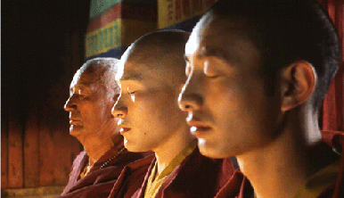

## **Klapbord**

Slechts enkele kleine en alternatieve bioscopen durfden het in Vlaanderen aan om de film **Samsara** te programmeren. De film kreeg aldus een kleine kans om een publiek te vinden. Een van die bioscopen prees de film aan met het volgende statement: '_Een jonge boeddhistische monnik raakt volledig in de ban van een beeldschone vrouw. Hun stomende vrijscènes zorgen er uiteindelijk voor dat zijn nirvana eerder overhoop wordt gehaald_.' Deze beschamende nonsense doet de film onrecht aan. De presentatie haalt niet eens het niveau van de reclame voor een zuiver commerciële Hollywoodfilm. Het onderkoelde cynisme bewijst volkomen blind te zijn: blind voor de beelden en blind voor hun grote spirituele rijkdom. **Samsara** is namelijk in tal van opzichten een meesterwerk. De film en zijn auteur verwerven zich een vaste plaats in de schatkamer van _de religieuze cinematografie_.

## **Synopsis**

Tashi groeit op als een boeddhistische lama in het schilderachtige berglandschap van het Indische Ladakh. Hij gaat helemaal op in zijn opleiding. Via een strenge discipline en volgehouden studie wil hij de spirituele verlichting bereiken. De oudere Apo en de jongere Sonam omringen en steunen hem. Op zeker ogenblik beslist Tashi drie jaar, drie maanden en drie dagen in afzondering te gaan leven. Heel zijn bestaan staat nu in het teken van meditatie en yoga. Hij bereikt het punt van het nirvana. Met dat punt begint de film. Apo en Sonam brengen Tashi uit zijn nirvanabeleving terug naar het klooster. In boeddhistische termen betekent die terugkeer het opnieuw intreden in het samsara: de kringloop van dood en wedergeboorte. Tashi herstelt fysisch en neemt terug deel aan het kloosterleven. Toch ervaart hij bij zichzelf enige veranderingen. Het beeld van een jonge moeder die haar baby voedt, dringt diep in zijn geest binnen. Hij krijgt seksuele dromen en wordt onrustig. Tijdens een oogstfeest ontmoet hij Pema, de huwbare dochter van een plaatselijke graanboer. Na zijn inwijding in het tantrisme door een asceet, beslist Tashi het klooster te verlaten. Hij treedt binnen in de wereld van het samsara. Hij huwt Pema, ze krijgen een jongen Karma. Tashi maakt zijn schoonvader economisch onafhankelijk van de lokale graanhandelaar, Dawa. Voorts komt hij in conflict met Jamayang, de jonge man uit het dorp aan wie Pema eerder was toegewezen. Tashi ondergaat ook de verleidende kracht van de jonge seizoenarbeidster Sujata. Maar nog meer ontdekt Tashi de eigen wijsheid van Pema zelf. Op zekere dag beslist hij uit de wereld van samsara te stappen en terug te keren naar het klooster. Op zijn weg komt hij echter Pema tegen die hem confronteert met zijn verantwoordelijkheid tegenover haar en hun kind. Die confrontatie werpt Tashi letterlijk op de aarde: hij huilt en kijkt naar de hemel boven hem.

## **Cinematografie**

AUTODIDACT. Regisseur Nalin Pan schreef samen met Tim Baker het scenario naar een eigen verhaal van Nalin. Met **Samsara** levert Nalin zijn eerste langspeelfilm af. Gezien het resultaat is dat een enorme verdienste. Als cineast is hij een autodidact die in 1992 een eerste kortfilm draaide, **Khajuraho**. Zijn spirituele Ayurveda-opvoeding thuis, zijn talrijke trektochten doorheen India en Europa, zijn werkervaring in Bollywood te Bombay, zijn filmclub waar hij retrospectieves organiseerde van het werk van Tarkovski, Goddard, Kurosawa, Eisenstein en Bunuel, zijn spirituele leerschool in de Himalayastreek, dat alles mondde in 2001 uit in twee belangrijke internationale films: de fictiefilm **Samsara** en de lange documentaire film **Ayurveda: Art of Being**.

ZENEMATOGRAFIE. Het heeft Nalin Pan zeven jaar gekost om de hele productie van **Samsara** rond te krijgen. In **Samsara** ontwikkelt hij een cinematografie die hijzelf doopt met de nieuwe naam _zenematografie_. Het begrip vertrekt van het boeddhistische begrip zen. De cineast gebruikt het niet in de strikte zin van het Japanse zenboeddhisme. Zen verschijnt hier in een algemene zin, en duidt op de oosterse cultuur waarin meditatie en yoga binnen een vooral boeddhistische omgeving centraal staan. In **Samsara** gaat het om een Tibetaans boeddhisme met veel lokale, Noord-Indische accenten en met een expliciete inbreng van het tantrisme, een in wezen hindoeïtische religie. Deze zenematografische werkwijze impliceert dat de filmploeg, technici en acteurs, tijdens het draaien spirituele werksessies houden. Ze mediteren en beoefenen yoga. Uiteraard uit zich deze cinematografie in de kunst van de beelden en de klanken zelf. Een belangrijk zenematografisch aspect betreft _de wereld van het licht en de daarmee verbonden kleuren_. De proloog van de film die tevens als generiek dient, introduceert de toeschouwer in _de adembenemende, picturale schoonheid van het Indische hooggebebergte in Ladakh_. Het licht regisseert. Het onthult een landschap met wijdte en een diepte die de mens sprakeloos maakt en hem tot inkeer brengt. Uit datzelfde magische licht ontstaat ook de diverse kleuren. De filmcrew heeft de grootste zorg besteed aan de kleding van de personages. Vooral aan de kleuren ervan besteedde men heel veel aandacht. Via hun kleding integreren de personages zich in de omgeving of vormen ze ermee een contrast. Dat gegeven speelt ook dramatisch mee op het niveau van het scenario en wel op twee cruciale vlakken. Ten eerste, voltrekt het personage Tashi een belangrijke beweging die begint in de duisternis van zijn nirvanaverblijf: Apo en Sonam brengen hem terug in de werkelijkheid van het licht en dekken Tashi's ogen af om te voorkomen dat hij tijdens de overgang van duisternis naar licht zijn ogen niet schaadt. Ten tweede, het personge Tashi draagt verschillende kleren in de loop van de film. De spirituele fasen die hij doormaakt, verbeelden zich in zijn kleding.

SOUNDSCAPE. Van de talrijke cinematografische kwaliteiten valt ook de verzorgde klankband op. Er wordt in **Samsara** zeer weinig gesproken. Dat betekent niet dat de meeste sequenties stil zijn. Veeleer vormen de reële dingen en gebeurtenissen het klankmilieu van**Samsara**. In de eerste plaats geldt dat voor de bergwind. De talrijke beelden van typische Tibetaanse wimpels maken de alom aanwezige en sterke onzichtbare wind tastbaar. De natuurlijke muziek van de bergstroom begeleidt als een vast personage de mentale reis van Tashi. Voorts weerklinkt op een indringende wijze de cultische muziek van de monniken, alsook de etnische muziek van de feestende boerengemeenschap.

CIRKEL. De film bevat een rijkdom aan beeldcomposities waarvan de eigen picturale waarde de uitwerking van de betekeniswereld ondersteunt. Er zijn de panoramische beelden die de goed gekozen close-ups omkaderen. Het ritme van de seizoenen krijgt veel aandacht; vooral de sequenties in de winter en die in de oogsttijd dragen hun betekenis over op wat er met de personages gebeurt. Een belangrijk cinematografisch element ent zich op de spirituele titel: **Samsara**. Daarin staat de figuur van de cirkel - de kringloop - centraal. In de geest van de zenemotagrafie gaat het om een dynamische cirkel. De cirkel van de kringloop omschrijft bijvoorbeeld _het zeer indrukwekkende openingstafereel met de arend_ die ook terugkeert in het slotbeeld. Voorts componeert de zenemotografische cirkel _de bijzonder originele montage en poëzie van de eerste liefdescène tussen Tashi en Pema_. In andere sequenties blijft de camera onbeweeglijk, maar komt de cirkelbeweging in het beeld voor vanuit de beweging van de personages zelf: de opvallend opgebouwde verleidingsscène met Sujata en Tashi, en de dramatische confrontatiescène met Pema en Tashi.

## **Betekenisruimte**

De zenematografie van **Samasara** schildert via het portret van het hoofdpersonage lama Tashi een boeiende en inspirerende betekeniswereld. De film blijft niet steken in een documentair exotisme. De personages krijgen een eigenheid die past binnen de ontwikkeling van een beeldend uitgewerkt, spiritueel drama. In de kern van dat drama ontwikkelt Nalin Pan een eigen origineel denken dat zijn diepe wortels heeft in _de religieuze en spirituele tradities van het Oosten_, zowel van de Indische als de Chinese culturen, alsook in _de religieuze en spirituele traditie van de Europese auteurscinema van auteurs als Tarkovski, Bunuel en Godard_. Wat deze Europese cineasten doen met de Europese, christelijke tradities, realiseert Nalin Pan ten aanzien van de overgeleverde oosterse tradities van vooral het Mahayana boeddhisme en het hindoeïstische tantrisme. Hieruit blijkt dat in het spirituele midden van het cinematografische beeld de westerse en oosterse culturen een gemeenschappelijke ontmoetingsruimte vinden. Nalin Pans beeldende interpretatie van 'Samsara', bevindt zich zeer dicht bij Tarkovski's verbeelding van de heilige waarde van 'het leven'. Nalin Pan evoceert dat er in wezen geen scheiding dient te bestaan tussen spirituele waarden en het concrete leven van de mens. In bepaalde boeddhistische interpretaties begint spiritualiteit wanneer iemand *_de kringloop van dood en wedergeboorte_ verlaat. Nalin Pan brengt het drama in beeld waarbij de boeddhistische monnik Tashi _de omgekeerde weg_ aflegt: van het bijna-nirvana punt, eigen aan het streven van de monnik, naar het punt van samsara, eigen aan het leven dat mensen iedere dag ervaren en waaraan ze een zin geven...met vallen en opstaan.

## **Context**

Nalin Pans film is de eerste langspeelfilm die volledig is opgenomen in Ladakh. Het gebied bevindt zich in Noord-Indië. Het wordt omzoomd door de bergketens van de Grote Himalaya en de Karakoram. Een deel behoort tot de Indische provincie Jamnu, een ander deel tot de Indische provincie Kasmir. Het bevindt zich dus in het gebied waar Indië en Pakistan elkaar diplomatiek en militair bestrijden. Het gebied is zowel historisch als geografisch erg ongewoon voor Indië. Het wordt trouwens ook 'Klein Tibet' genoemd. Gezien de grote onderdrukking van de Chinese Tibetaanse cultuur wint het ongeschonden Tibetaanse Ladakh aan belang. Alleen het gevaarlijke westerse, cultuur- en sporttoerisme kan op termijn een bedreiging vormen. Ook dat aspect haalt Nalin Pan aan in **Samsara**. De productie is gedragen door de Duitse _Pandora Film_, gesticht in 1981 en ondertussen uitgegroeid tot het grootste Europese productiehuis voor internationale kunstfilms. Dezelfde productiemaatschappij realiseerde onder andere de erg antropologische en documentair ogen langspeelfilm **Himalaya** van Eric Valli, alsook de tantristische Indische film **Kama Sutra** van Mira Nair. Het productiehuis engageerde zich ook voor films als **Nostalghia** van Tarkovski en **Farewell, My Concubine** van Chen Kaige.

## **Link**

Het religieuze levensfenomeen van het licht speelt een hoofdrol in het derde deel van [Levensbeschouwing democratisch belicht](http://www.menstis.be/uitgeverij/Levensbeschouwing/)

[Palin](https://en.wikipedia.org/wiki/Pan_Nalin).

© Sylvain De Bleeckere, Men(S)tis, 2011/2017.
