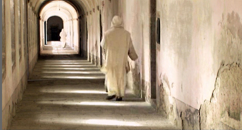

### **Klapbord**

Met de documentaire _Die grosse Stille/ Le grand silence/ Into Great Silence_ schrijft de **Duitse regisseur Gr�ning** zonder meer en in absolute zin geschiedenis: **filmgeschiedenis �n kerkgeschiedenis**. Het is de allereerste keer in de geschiedenis dat er filmopnames zijn gemaakt binnen de muren van de historische **Grande Chartreuse**, het moederklooster van de kartuizermonniken. In 2006 ging de film in premi�re op het filmfestival van Veneti�. Eind december 2006 won hij **de European Film Award voor de beste documentaire** van het jaar.

### **Synopsis**

De film is een **documentaire** film. Het is dus geen verfilming van een vooraf uitgeschreven scenario. In zekere zin is het de werkelijkheid zelf die de film regisseert. Die werkelijkheid bestaat concreet uit **de gebouwen van de Grande Chartreuse, afgelegen in het berglandschap van de Franse Alpen**, waar een belangrijk deel van het jaar sneeuw ligt. Een ander aspect van de regisserende werkelijkheid is de kloostergemeenschap zelf. **Het leven van de monniken** brengt niet alleen de beelden voor, maar ook **het ritme van de beelden**. Dat blijkt al in het begin van de film. De camera staat in de cel van ��n van de monniken. Hij blijft er tot de klokken luiden en hem een teken geven om de cel te verlaten. Eerst de kleine klok, nadien de grote kerkklok. Er zijn dus heel wat **lange sequenties van de monniken in hun cel**. Dat is de ruimte waar ze het grootste deel van hun leven als monnik doorbrengen. Het is daar waar ze slapen, bidden, mediteren, studeren en eten. Ze verlaten hun cel alleen op het ritme van de klokken die hen oproepen naar de kerk te gaan voor het gemeenschappelijk gebedsleven. Dat begint om **middernacht**. Dan begint de monnik zijn nieuwe dag. Samen met de andere monniken blijft hij drie uren in de donkere kerk, enkel verlicht door **de kleine godslamp** en de leeslampen van de koorbanken. Het hele scenario beweegt tussen de passages van de monnik in zijn cel en die van de schaarse momenten van het gemeenschapsleven. Dat voltrekt zich in **volkomen stilte**, waaraan de **titel** van de film is ontleend. Stilte betekent hier dat de monniken niet met elkaar spreken. Buiten het grootste deel van de sequenties in de cel en in de kerk, komen er in de film enkele uitzonderingen voor. Er is de sequentie in de refter, de gemeenschappelijke eetzaal waar de monniken op zondag samen in stilte eten terwijl ze naar een lezing van een tekst luisteren. In de film komt er ook een tafereel voor met de monniken die zich **op zondag even ontspannen**. Dat gebeurt tijdens een wandeling. Dan spreken ze met elkaar. Uit de beschrijving van de documentaire film blijkt dat het een cyclische film is. Er is geen lineaire ontwikkeling van dramatische elementen. Er is alleen **de zuivere werkelijkheid van de cyclus van dag en nacht en van die van de seizoenen**. Dat alles belet de regisseur niet om via de montage toch een licht narratief accent in te brengen. Dat gebeurt al in het begin van de film. Dan is de camera getuige van **de offici�le intrede van twee nieuwe, jonge monniken**. Die intrede gebeurt volgens een strikt beregelde plechtigheid. In de loop van de film volgt de camera ��n van de nieuwe monniken. Een andere, relatieve narratieve lijn is die van **de blinde monnik**. Hij  komt even in beeld in het eerste kwart van de film en keert dan in **een crescendobeweging** naar het einde frontaal in beeld. Dat gebeurt in de lang uitgewerkte sequenties met zijn **getuigenis**. Hij verbreekt de stilte en spreekt recht in de camera, als het ware tot de toeschouwer, over zijn visie op het leven van zichzelf en dat van wat hij de moderne mens noemt. Nadat de toeschouwer op een zuivere cinematografische wijze een beeld heeft gekregen van **het monastieke leven van de kartuizers,** krijgt hij even ook verbaal van binnenuit een beeld van het leven en denken van de monnik. Maar het eerste en het laatste woord van de film is **de grote stilte**, de eigenlijke werkelijkheid die in beeld komt.

### **Cinematografie**

**UNIEKE OPNAME**. De eigen cinematografie van _Into Great Silence_ komt in de eerste plaats voort uit **de bijzondere omstandigheden waarin de opnames gebeurden**. De regisseur verbleef alles bij elkaar ongeveer zes maanden in het klooster. Hij filmde in de lente en de zomer van 2002, drie weken in de winter van begin 2003 plus nog drie dagen in december 2003\. **Hij deelde het leven van de monniken en was voor zijn filmwerk helemaal op zichzelf aangewezen.** Niemand anders dan hijzelf mocht filmen. Hij leefde dus helemaal alleen met de monniken in de Grande Chartreuse. Wegens de verschillende kloostertaken die hij moest vervullen, gecombineerd met de zeer strikte timing van het kloosterleven, **kon Gr�ning ongeveer 2 � 3 uur per dag filmen**. Hij filmde een cassette per dag, dat is 49 minuten. Hij deed zelf de opnames met een HD Cam, een digitale videocamera. Die opnames werden aangevuld met enkele 35mm opnames, vooral de buitenopnames van de kloostergebouwen vanuit een panoramisch perspectief, plus ook enkele Super 8mm opnamen. **Uit ongeveer 120 uur gefilmd materiaal heeft Gr�ning zijn 160 minuten durende film gemonteerd.** De monniken van de Grande Chartreuse legden de regisseur contractueel **het verbod van kunstlicht** op. Bij de opnames mocht Gr�ning bij geen enkele opname kunstlicht gebruiken. Zonder kunstlicht filmen in een kloostergebouw als dat van de Grande Chartreuse is natuurlijk geen sinecure. Gr�ning moest heel wat creativiteit aan de dag leggen om **het schaarse licht** te benutten van het zonlicht, brandende kaarsen, brandende houtblokken, en de schaarse elektrische lampen. Hij heeft ook in enkele cellen gefilmd waar behoorlijk weinig natuurlijk licht in schijnt en waar slechts ��n elektrische lamp hangt. Heel wat van die opnames heeft hij in Super8 mm gefilmd, wat een grove beeldkorrel, een visuele ruis, oplevert.

**NATUURLIJK GELUID****.** Een tweede cinematografische regel waaraan Gr�ning zich contractueel diende te houden, was **geen gebruik maken van toegevoegde muziek of gesproken commentaar**. Die methodische regel is in de eerste plaats een spirituele regel. Die determineert echter de cinematografie en is in overeenstemming met de spiritualiteit van de stilte, eigen aan de kartuizers. E�n van de grote, stevige pijlers van spiritualiteit van de kartuizers is namelijk **de stilte**. De film verklankt de eigen, unieke stilte van de Grande Chartreuse en haar bewoners. De methodische regel van het natuurlijke geluid heeft ook een schaduwzijde. Geen commentaar. Gr�ning komt nergens tussen om bepaalde beelden toe te lichten. Geen enkele commentaarstem begeleidt de toeschouwer. Die wordt aan zijn lot over gelaten. Anders geformuleerd: hij wordt de woestijn van de beelden ingestuurd. Alleen de beelden spreken. Soms worden er teksten gezongen en voorgelezen. Maar ook die behoren tot **de stem van de stilte**, waarnaar de monniken luisteren.  

**BEELDRIJM****.** Een ander cinematografisch element is **het zwarte beeld**. Tevens het openingsbeeld van de film. Het vertegenwoordigt ook de wereld van de gesloten ogen van de monniken. Trouwens, uit het zwarte beeld verschijnt het donkere beeld van de biddende kartuizer in zijn cel. De toeschouwer kan in de grote close-up het beeld herkennen van het gebogen hoofd van de biddende monnik die zijn hoofd laat rusten op zijn gevouwen handen. Zijn oor staat centraal in die heelgrootopname. **De wereld van de kartuizer** speelt zich niet af in die van het licht, bron van beelden. De kartuizer is geen toeschouwer, hij is een **contemplatief** die zijn ogen sluit voor wat het zonnelicht van de dag onthult. Hij houdt eerder van het donker dan van het licht, ook al draagt hij een witte pij. Dank zij die witheid kan Gr�ning de aanwezigheid van de monnik vanuit het eerste donkere beeld laten oplichten. De monnik zelf bevindt zich in de onzichtbare wereld van de contemplatie.  **Het zwarte beeld** vertegenwoordigt die onzichtbaarheid. In het grote close-upbeeld van de biddende monnik met gesloten ogen last Gr�ning een overvloeier naar een ander abstract beeld in.  

TEKSTBEELD**.** Er is ook een cinematografisch element, het tekstbeeld, dat herinnert aan de periode van de stille film . Zowel helemaal in het begin van de film, in de loop van de film en in het eindbeeld laat de regisseur **teksten** verschijnen **op het filmdoek**. De openingstekst is een Bijbelperikoop **1 Kon. 19,11-12**. De tekst in de Willebrordvertaling luidt:  
_11 Maar Jahwe zei: “Ga naar buiten en treed voor Jahwe op de berg.” Toen trok Jahwe voorbij. Voor Jahwe uit ging een zeer zware storm, die bergen deed splijten en rotsen verbrijzelde. Maar Jahwe was niet in de storm. Op de storm volgde een aardbeving. Maar ook in de aardbeving was Jahwe niet._  
_12 Op de aardbeving volgde vuur. Maar ook in het vuur was Jahwe niet. Op het vuur volgde het suizen van een zachte bries._  
Een andere Bijbeltekst is **Lucas 14, 33**: “_Wie geen afstand doet van al zijn bezittingen en mijn voorbeeld niet volgt, kan mijn leerling niet zijn.”_  De regisseur montert dat tekstbeeld meer dan een keer. Zonder zelf commentaar te geven, last hij toch op die manier teksten die deel uitmaken van het leven en de studie van de kartuizers.

### **Betekenisruimte**

**BLINDHEID****.** Een wezenlijk aspect van de monastieke betekeniswereld van _Into Great Silence_ ent zich op **de figuur van de oude blinde monnik**. Het is het dramatische hoogtepunt van de film want de kartuizer neemt zelf het woord en spreekt tot de camera. Het enige interview in de film, ofschoon er geen vragen worden gesteld. De cineast en de toeschouwer luisteren naar de woorden van de blinde religieus. Het getuigenis opent met een zwart beeld en de eerste zin handelt over **de dood**. Angst voor de dood heeft geen zin, want het is het lot van alle mensen. Zwart beeld. Sterven is het geluk verwerven, dat bestaat in het nabijkomen van God. In feite is de dood de grote vreugde van de mens. Zwart beeld. In God bestaat geen verleden en toekomst. God is enkel heden. Hij overziet ons leven in ��n ogenblik. Omdat hij bron is van alle goedheid, hoeven we als mensen niet bang te zijn voor wat ons overkomt. Het is het beste wat God met ons voorheeft. Zwart beeld. Ik dank God dat hij me blind heeft laten worden voor het welzijn van mijn ziel. Zwart beeld. Het is jammer dat de wereld de zin voor God heeft verloren. Ze hebben geen reden meer om te leven. Als je de gedachte aan God afschaft, waarom leef je dan nog. Zwart beeld. Een christen mag nooit verdrietig zijn, maar altijd gelukkig want God doet alles voor ons voor ons welzijn. Alles wat gebeurt is Gods wil en geschiedt voor het welzijn van de ziel. God is oppermachtig, goed en Hij helpt ons. Zwart beeld. En dat is alles wat men moet doen,en men wordt gelukkig. Zwart beeld. **Aldus het getuigenis van de blinde kartuizermonnik.**

**ICONOCLASME**. Een ander inhoudelijk wezenlijk aspect is **het iconoclasme van het zwarte beeld**. De regisseur is hiermee trouw aan de spiritualiteit van het afwezige beeld in de leef- en denkwereld van de kartuizers. Hun spirituele leven steunt immers op het fundament van het iconoclasme met zijn diepe wortels in de klassieke traditie van het metafysisch Idealisme. Dat voert een grote hi�rarchische scheiding in tussen de concrete lichtwereld waar de ogen toegang toe hebben en de bovennatuurlijke wereld van het goddelijke licht waar alleen de mediterende geest toegang toe heeft. Dergelijke, eeuwenoude religieuze cultuur die teruggaat tot de eerste eeuwen van het institutionele christendom is door de kartuizers tot op vandaag zuiver en authentiek bewaard. Niets beter dan deze film maakt het vandaag mogelijk om een zeker inzicht te krijgen in de oudste fundamenten van het contemplatieve, monastieke leven dat zo sterk de Europese, christelijke cultuur doorheen de middeleeuwen en nog nadien heeft getekend. Die traditie wordt hier levend en toegankelijk beeld.

### **Context**

OEFENING IN STILTE. De film confronteert de hedendaagse toeschouwer met de werkelijkheid van **de contemplatieve stilte** die uit zijn leefwereld zo goed als verdwenen is. Het was puur toeval dat toen de film in Belgi� in de bioscoop te zien was, in het nieuws van december 2006 de mededeling kwam van een wetenschappelijk onderzoek van de Rijksuniversiteit Gent. Daaruit blijkt dat  ��n op zes adolescenten een ernstig gehoorprobleem heeft. In de leeftijdsgroep van 18 tot 22 jaar vinden wij bijna niemand meer met een perfect gehoor. Als dat zo doorgaat heeft de jeugd tegen haar dertigste verjaardag het gehoor van een oudere man. Aldus het onderzoek. De film _Into Great Silence_ biedt in de context van **onze hedendaagse lawaaicultuur** een zeer nuttige, meditatieve oefening in stilte. De kartuizers praktiseren die oefening tot in het extreme. Juist daardoor krijgt hun geluidsascese een hedendaagse betekenis die ze nooit eerder heeft gehad.  

HET FENOMEEN MONACHISME. Een tweede contextueel element betreft **de waarde van het beeld van de extreme religiositeit** dat uit de film spreekt en duidelijk wordt verwoord door **de blinde monnik**. Die betreurt dat de mensen van nu de zin voor God hebben verloren waardoor het bestaan geen echte zin meer heeft. Dit punt vormt **de grens van de film zelf**. Gr�ning leent zijn camera aan de monastieke gemeenschap van de Grande Chartreuse. Hij geeft hen het volle beeld en de volle klank. De film is in dat opzicht **zeker een geslaagd kunstwerk**. Als portret van het religieuze leven voor onze tijd is het echter **eenzijdig**. Z� eenvoudig zit de hedendaagse beschaving namelijk niet in elkaar dat ze in een zwart-wit tekening kan worden weergegeven. **De kartuizerwereld als de laatste zone van het zuiver geloof versus de buitenwereld als de negatieve zone waar het geloof is verdwenen**. Eeuwen beschaving van christelijke en monastieke cultuur hebben niet kunnen verhinderen dat **de concrete beleving van het religieuze, christelijke leven is ge�volueerd**. En het is zeker niet zo dat die evolutie een louter negatieve balans oplevert. **Het eeuwenoude monachisme** eiste het monopolie van het zuivere geloof op. Het onderbouwde zijn eis met een zware metafysische constructie die ook in _Into Great Silence_ voor de aandachtige toeschouwer zichtbaar aan de oppervlakte komt: de radicale afwijzing van de eigen waarde van de tijd, het wegredeneren van het probleem van de dood als een schijnprobleem, het fenomeen van het persoonlijk lijden minimaliseren vanuit een absolute apologie van de algoede God die ook in het lijden nog het beste met de mens voorgeeft. **Dergelijke visie heeft diepe wortels in de Griekse metafysica van het eeuwige zijn.** In de context van de film verschijnt die visie als **het iconoclasme van het bestaan.** Het re�le bestaan van de mens in tijd en ruimte wordt weggezuiverd en opgelost in het zwarte beeld, **het visuele leidmotief van de hele film**.

### **Filmfiche**

Duitsland / 162’ / 2005 / regie, scenario, fotografie, producer, montage: Philip Gr�ning. 

### **Links**

De Bleeckere, S., _2007\. Into Great Silence_, in: CineMagie nr.559, pp. 3-17\.  
De Bleeckere, S., _Het tijdperk van het monachisme_, in: Vanclooster, D., (red.), _De Duinenabdij van Koksijde. Cisterciënzers in de Lage Landen_. Tielt; Lannoo, pp. 12-23.  
[De website van de film](http://www.diegrossestille.de/)

� Sylvain De Bleeckere, Men(S)tis, 2011

