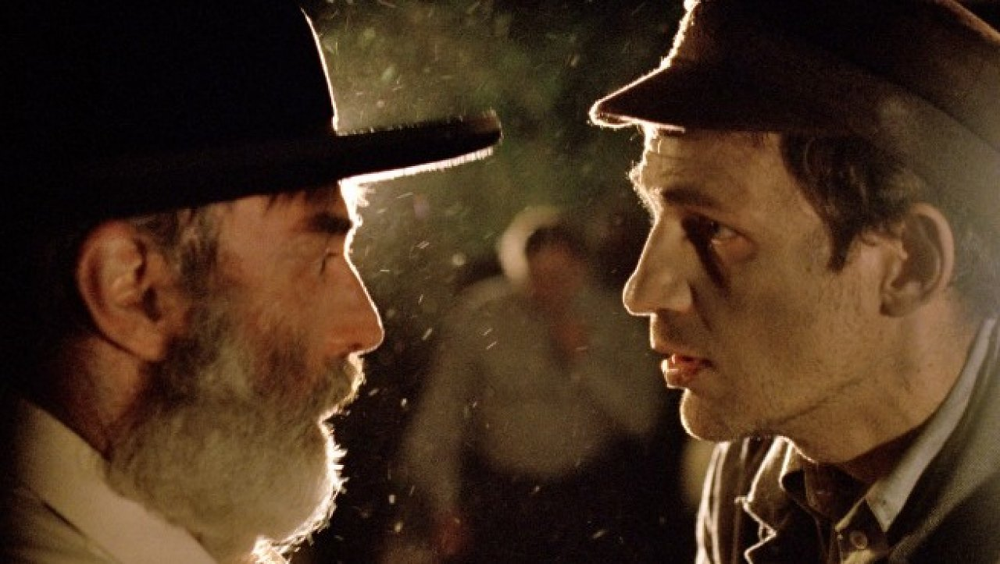

## **Klapbord**

**Son of Saul** is een Hongaarse film van de debuterende László Nemes. De film liet vanaf zijn wereldpremière tijdens _het Filmfestival van Cannes_ in 2015 een grote indruk na. De jury gaf aan de film haar Grote Prijs. Dit is na de Gouden Palm, de meest prestigieuze prijs van het festival. Bovendien kreeg de film tijdens _de 88ste Academy Awards (de Oscars)_ de award voor _beste niet-Engelstalige film_. De regisseur Nemes schreef zelf het scenario, daarbij geholpen door Clara Royer. De casting is ook bijzonder. De regisseur koos acteurs en actrices die hun eigen moedertaal moesten spreken. Er wordt in de film onder andere Duits, Hongaars, Pools en Yiddisch gesproken. Voor het hoofdpersonage koos hij _Géza Röhrig_. Hij is een orthodoxe, Hongaarse jood, tevens dichter die sinds 2000 in New York woont. Hij werkt er als leraar Joodse studies. Zijn eerste dichtbundel had Auschwitz als onderwerp en was de vertolking van _zijn vele bezoeken aan de site van Auschwitz-Birkenau_ vanuit Krakau waar hij als student een tijdlang verbleef in de jaren tachtig van vorige eeuw. Toen was de site, gelegen achter het toenmalige IJzeren Gordijn, nog geen ‘toeristische’ halte. Röhrig is geen echte acteur; in de jaren tachtig van vorige eeuw speelde hij even mee in een televisieserie. Als goede kennis van de regisseur, kreeg Röhrig de vraag van de regisseur de hoofdrol in diens debuutfilm over de Holocaust voor zijn rekening te nemen. De film werd opgenomen in _Budafok, een wijk van Budapest_. De Hongaarse architect László Rajk zorgde voor _de reconstructie van de crematoria van Auschwitz-Birkenau_. Hij werkte namelijk aan de permanente Hongaarse tentoonstelling van het Auschwitz-Birkenau Staatsmuseum in Polen. Het verhaal zelf is _fictief_, maar het is ontleend aan bijzonder historische feiten. Nemes heeft zich namelijk gebaseerd op _de opgetekende getuigenissen van enkele overlevende Sonderkommando’s_. Hun nota’s staan gekend onder de internationale naam _The Scrolls of Auschwitz_. De schrijvers hebben toen hun nota’s verborgen in de grond van het terrein rond het Crematorium III van Birkenau in de hoop dat ze later zouden worden gevonden. Die zijn tussen 1945 en 1980 inderdaad door toeval ontdekt. Nicholas Chare en Dominic Williams publiceerden in 2015 hun onderzoek naar de Scrolls in hun boek [Matters of Testimony: Interpreting the Scrolls of Auschwitz]( https://www.google.be/search?q=the+scrolls+of+auschwitz&oq=The+Scrolls+o&aqs=chrome.2.69i59j69i57j0l4.8191j0j8&sourceid=chrome&ie=UTF-8#q=the+scrolls+of+auschwitz+pdf). Er waren circa 950 Sonderkommando’s in Auschwitz-Birkenau. Negentig van hen overleefden de oorlog en het kamp. Son of Saul is het eerste filmdocument dat op de studie ervan is gebaseerd. Aan het historische fenomeen van de Sonderkommando’s werd nooit eerder een film gewijd. In Son of Saul heet het hoofdpersonage Saul. Hij wordt in het grootste vernietigingskamp als Sonderkommando tewerkgesteld. De nazi’s selecteerden namelijk een aantal sterke Joodse mannen die voor hen het monsterlijke werk dienden uit te voeren bij de vergassing en verbranding van de joodse slachtoffers in Auschwitz-Birkenau. Om te voorkomen dat die Joodse Sonderkommando’s zouden gaan samenspannen en rebelleren, werden ze na enige tijd, maximum drie maanden, vervangen en geëxecuteerd.

## **Synopsis**

_Saul Ausländer_ hoort bij _de Hongaarse Joden_ die in 1944 massaal naar Auschwitz-Birkenau zijn gebracht. Het Duitse leger is stilaan de oorlog aan het verliezen, en de nazi’s willen in verhoogd tempo nog zoveel mogelijk hun _Endlösung_ doorvoeren. De Duitse term Endlösung staat voor de genocide van alle Joden in Europa. Het bewind in Berlijn eiste dat de vernietigingsmachine van Auschwitz-Birkenau op volle toeren draaide. Wanneer Saul Ausländer _in oktober 1944_ in het kamp aankomt, wordt hij geselecteerd voor _de Sonderkommando’s_. Saul is ingedeeld bij de sectie die instaat voor het collecteren van kostbaarheden in de kleding van hen die zijn vergast, het verwijderen van de lijken uit de gaskamers en het direct daarna schrobben van de vloeren om de volgende groep slachtoffers te kunnen ‘verwerken’. Saul voert de bevelen schijnbaar apathisch en automatisch uit. Hij doet perfect wat van hem wordt verwacht. Dat verandert op de dag dat hij in de gaskamers _het lijk vindt van een jongen_. Onmiddellijk _ontfermt hij zich over het lichaam alsof het dat van zijn zoon betreft_. Hij stelt vast dat de jongen nog ademt niettegenstaande de vergassing. Hij moet toezien dat een nazi-dokter de jongen vermoordt. De dokter beveelt het lijk naar de autopsie-afdeling te brengen. Op dat ogenblik stapt Saul naar voren en biedt zich aan om het bevel uit te voeren. Zo maakt hij in de autopsie-afdeling kennis met dokter Miklós. Die blijkt ook een Hongaarse Jood te zijn die gedwongen wordt om de nazi-bevelen uit te voeren. Saul weet Miklós te overtuigen dat niet te doen in het geval van het lijk van de jongen. _Hij wil immers diens lijk meenemen om het een gepaste Joodse begrafenis te kunnen geven._ Miklós wijst de vraag van Saul niet af. Hij laat voorlopig het lijk ongeschonden en negeert ermee het bevel van de nazi-dokter. Saul zelf begint _zijn speurtocht naar een rabbijn_ die het ritueel van _de kaddisj_ kan uitvoeren. Hij vindt _rabbijn Frankel_. Die weigert mee te werken en stelt voor dat Saul zelf het ritueel voltrekt. Ondertussen ontstaan er binnen de groep van de Sonderkommando’s twee strekkingen. De eerste, onder leiding van de opstandige Abraham, wil met Oberkapo Biedermann, de Joodse leider van de sectie waartoe Saul en Abraham behoort, een opstand voorbereiden tegen de SS-bewakers. Van de tweede strekking is die van Bierdemann zelf de woordvoerder. Hij stelt voor om de wreedheden in het geheim te fotograferen en het fotomateriaal naar buiten te smokkelen en ermee mogelijke hulp uit te lokken. Om zijn eigen plan te kunnen uitvoeren, werkt Saul mee aan beide plannen. Via de medewerking komt hij in situaties terecht waarop hij inspeelt om een rabbijn te vinden. Zo komt hij via Abraham te weten dat er in een van de secties van de Sonderkommando’s een man is  die _‘de Renegaat’_ wordt genoemd. Hij is van Griekse origine en was voorheen wellicht een rabbijn. Saul zegt in ruil aan Abraham toe om mee te werken met het fotografieplan. Saul vindt de Renegaat bij de leden van de sectie die de assen uit de gasovens in de nabijgelegen rivier moeten scheppen. Wanneer de Renegaat echter weigert in te gaan op Sauls vraag, veroorzaakt Saul bewust een incident om de man toch te dwingen om mee te werken. Het incident leidt tot een ondervraging door de SS-commandant die de Renegaat executeert en Saul terugstuurt naar zijn sectie. Daar slaagt Saul erin het lijk van de jongen dat Miklós heeft verborgen in de autopsiekamer, mee te nemen naar de barak van de Sonderkommando’s in afwachting dat hij een rabbijn vindt. Saul wordt opgeroepen om de tafel op te ruimte van SS-commandant Voss, de nazi-baas van de gaskamers en verbrandingsovens. Saul hoort Voss Biedermann bevelen hem een lijst van zeventig namen te bezorgen. Hieruit leidt Biedermann af dat de mannen van zijn sectie waartoe ook Saul behoort, kortelings zullen worden omgebracht. In overleg met Abraham, besluit Biedermann een opstand voor te bereiden. Saul moet in het kamp van de vrouwen via Ella een pakje met dynamiet zien weg te smokkelen. De vrouw herkent hem, noemt zijn naam en zoekt toenadering, maar Saul blijft gefocust en houdt afstand. Onderweg naar zijn barak, komt Saul terecht in een groep van Hongaarse Joden die pas in het kamp zijn gearriveerd. Ze worden direct naar het bos gebracht om te worden geëxecuteerd. Onmiddellijk gaat Saul op zoek naar een mogelijke rabbijn onder de nieuwelingen. De Fransman _Braun_ maakt zich bekend bij Saul en zegt dat hij een rabbijn is. Daarop vermomt Saul Braun als een Sonderkommando en neemt hem mee naar de barak. Daar stelt Saul vast dat hij tijdens het tumult in het bos zijn pakje dynamiet is kwijtgespeeld. Ondertussen heeft Abraham het lijk van de jongen ontdekt in de barak. Daarover ondervraagd door Abraham, onthult Saul dat de jongen zijn zoon is. Abraham weigert dat te geloven. Tijdens het morgenappel zien Miklós en Saul elkaar. Miklós eist van Saul een ander lijk ter vervanging van dat van de jongen. Wanneer de sectie terug aan het werk moet, ontdekken de mannen dat hun leider Biedermann door de SS is geëxecuteerd. Daarop start Abraham _de rebellie_. Van dat tumult maakt Saul gebruik om het lijk van de jongen mee te nemen naar de bossen. Hij neemt ook Braun mee. Bij de rivier wil Saul het lijk begraven. Hij vraagt Braun het gebed uit te spreken, maar de man blijkt vals te hebben gespeeld. _Hij kent het gebed niet, hij blijkt geen rabbijn te zijn_. Daarop steekt Saul met het lijk de rivier over, maar door het gewicht en de stroming kan hij het lijk niet meer houden en moet hij het laten wegdrijven. Een van de medevluchters, de echte rabbijn Frankel, helpt Saul uit de rivier. De ontsnapten verzamelen in een schuur en plannen om aan te sluiten bij het Poolse verzet. Plots ontdekt Saul een Poolse jongen in de nabijheid van de schuur. Saul en de jongen glimlachen naar elkaar. Dan loopt de jongen plots weg, SS-wachten naderen de schuur. De jongen verdwijnt in het bos. 

## **Cinematografie**

CINEMATOGRAFIE VAN DE RADICALE SOLIDARITEIT. De meest opvallende cinematografische keuze die de regisseur heeft gemaakt, is die van -het besloten cameraperspectief-. De panoramische zichten ontbreken met uitzondering van het slotbeeld met het bos. Er is evenmin een alwetende verteller aanwezig om de beelden toe te lichten. In die zin kent de film _een claustrofobische look_. De openingssequentie is onscherp gefilmd. De toeschouwer kijkt naar een flou beeld waarin hij figuren ziet bewegen zonder ze duidelijk te kunnen onderscheiden. Een van de figuren loopt richting camera. Van het ogenblik af dat de figuur bij de camera is gekomen, ontstaat er een scherp beeld. Hiermee geeft de regisseur een duidelijk teken aan de toeschouwer. _Ook de regisseur beschikt niet over aan alziend en alwetend perspectief_. Nemes zelf probeert midden in het gebeuren scherp te zien vanuit zijn eigen, beperkte positie. De regisseur beslist dan om zijn camera te binden aan de positie van de man die naar hem toestapt: _Saul_. Van dan af zit de camera op de hielen van het hoofdpersonage Saul. Hij kleeft er als het ware aan. Die keuze stelt de cameraman voor een grote uitdaging. De acteur en de cameraman moeten voortdurend een soort dansbeweging uitvoeren. De cameraman moet de loodzware filmcamera minutenlang bedienen door achter het hoofdpersonage afwisselend voorwaarts en achterwaarts te lopen. In vergelijking met een doorsnee film zijn er langere sequenties. In totaal bestaat **Son of Saul** uit tachtig cuts (onderbrekingen aangebracht tijdens de montage), terwijl een doorsnee film 200 à 300 cuts telt. Dergelijk gefocust cameragebruik is geïntroduceerd door _de gebroeders Dardenne_ in hun eerste films, vooral in hun _Rosetta_ (1999). Nemes radicaliseert die cinematografische benadering in zijn **Son of Saul** tot in het extreme. Terecht. Op die manier identificeert de cineast zich voor honderd procent met zijn hoofdpersonage. Aldus realiseert Nemes met de film een bijna één op één identificatie met het slachtoffer en bij uitbreiding alle slachtoffers, belichaamd door het personage Saul. Hier wordt _de camera het instrument van engagement_. De camera handelt als enige _in volle solidariteit_ met de Holocaustslachtoffers. Dat engagement zit echter ook verankerd in _een narratieve logica die de historische situatie correct weerspiegelt_. De Scrolls of Auschwitz bevestigen samen met de studie van het grondplan van Auschwitz-Birkenau dat de Sonderkommando’s geïsoleerd leefden van de rest van het kamp. Hun barakken bevonden zich direct in de buurt van de gaskamers en verbrandingsovens. Enerzijds beseften de Sonderkommando’s dat ze bij de uitzonderingen, ja in zeker opzicht zelfs bij de geprivilegieerden, hoorden. De gemiddelde levensduur in het kamp was tien dagen na de aankomst. De Sonderkommando’s wisten dat zij dankzij hun gedwongen job langer dan wie ook van alle Joodse slachtoffers, langer in leven konden blijven. Anderzijds leefden en werkten ze volledig afgezonderd. Ze hadden geen enkel overzicht over het kamp. Ze waren volledig onwetend over de beslissingen van de SS van wie ze wisten dat die altijd het bevel konden geven om ook hen, de Sonderkommando’s, op zekere dag om te brengen. Hierdoor konden de Sonderkommando’s met geen derden communiceren over hun bijzondere ervaringen over wat ze zelf in de Scrolls ‘_het hart van de hel_’ noemen. Verschillenden voelden een sterke nood om te getuigen van hun bevoorrechte ervaringen. Van alle Joden stonden zij letterlijk aan _de frontlijn van de Holocaust_. Ook in **Son of Saul** blijkt die nood aan communicatie met de buitenwereld in het gegeven van het fotografieplan. De leden van de Sonderkommando’s ervoeren op de meest extreme wijze een eigenschap van ieder menselijke conditie, met name begrensd te zijn in tijd en ruimte. Zij zaten letterlijk en mentaal opgesloten in de tijd en de ruimte van de historische Holocaust. Geen enkele oog- en oorgetuige van de slachtoffers kreeg de tijd om daarvan op zo’n intense manier getuigen. **Son of Saul** blijft trouw aan die unieke getuigenis. Op deze wijze wordt ook de toeschouwer van de film via de camera en de microfoon deelgenoot van dit uniek, historisch getuigenis. Sinds het einde van de Tweede Wereldoorlog kan alleen de kunst van de cinematografie blijvend zo dicht bij de doorleefde horror van de historische Holocaust komen.

DE ARCHITECTUURMETAFOOR VAN HET LABYRINT. Als er één metafoor is die de spirit van _onze postmoderne tijden_ vertolkt, is het wel die van _het labyrint_. En die metafoor werd nergens zo reëel doorleefd als door de slachtoffers van de historische Holocaust. De cinematografie van **Son of Saul** realiseert die metafoor van het labyrint op een meesterlijke manier. Dat gebeurt tegelijk visueel en auditief. Saul krijgt nergens een overzicht van de situatie. Hij beweegt midden in _een enge en besloten ruimte_. Iedere vluchtpoging is vooraf gedoemd om te mislukken.

_De architectuurmetafoor van het labyrint_ is voor het eerst in de westerse cultuurgeschiedenis geïntroduceerd via _het oud-Griekse verhaal_ van koning Minos van Kreta, beschreven door Herodotos in zijn _Historiën_ uit de 5de eeuw v.C. en vooral bekend gebleven door de literaire evocatie ervan door de Romeinse schrijver Ovidius in zijn _Metamorfosen_, voltooid in de 1ste eeuw n.C. In de oud-Griekse overlevering staat de Griekse held Theseus centraal. Hij slaagde erin het monster, de Minotaurus, opgesloten in het labyrint, aan wie de Atheners jaarlijks mensenoffers moesten brengen, te overwinnen met de hulp van _de draad van Ariadne_. De dochter van koning Minos had Theseus een bol van wollen draad meegegeven waardoor hij de weg terug kon vinden. In het oermodel van het Kretenzische labyrint is er één uitgang en is er zelfs via de list van de draad van Ariadne de mogelijkheid om er, eens binnen,gemakkelijk terug uit te geraken. 

De draad van Ariadne _onbreekt_ in het geval van Auschwitz-Birkenau in het algemeen en in de werkplaats en het terrein van de Sonderkommando’s in het bijzonder. Saul en zijn lotgenoten bewegen zich van _het ene ruimtelijke cataclysme in het andere_. Ze hebben op geen enkele manier enig meesterschap op de labyrintische ruimte en de gebeurtenissen die er zich in voltrekken. Saul probeert in zekere zin een draad van Ariadne te vinden via het lijk van ‘zijn zoon’, maar tijdens de hopeloze ontsnapping verliest hij ook die broze draad. **Son of Saul** Saul werkt met de metafoor van het labyrint en breidt de betekenis ervan uit in alle richtingen. Saul bevindt zich eerst en vooral letterlijk in de labyrintische dodengang zonder uitweg. Het besef van Saul constant in een labyrint rond te lopen is niet alleen visueel uitgewerkt. Het is ook _auditief_ aanwezig. Er is geen filmische muziek die van buitenaf over de beelden wordt gelegd. Saul beweegt zich namelijk in een labyrint van stemmen en geluiden waarvan hij de herkomst amper kan overzien. Támas Zányi, de verantwoordelijke voor de klankband, heeft vijf maanden gewerkt aan de sound design van **Son of Saul**.  

## **Betekenisruimte**

KADDISJ. Nemes bouwt de betekeniswereld van **Son of Saul** op via _het narratief van de kaddisj_. Saul verzet zich, niettegenstaande de overrompelende impact van wat er gebeurt, tegen de industriële en mechanische vergassing van mensen en de dito verbranding van de lijken. Zijn verzet bestaat erin dat hij één lijk weghoudt van de verbrandingsovens met als doel het ritueel te begraven. Daartoe zoekt hij een rabbijn. Die moet namelijk bij de begrafenis het ritueel gebed van _de kaddisj_ uitspreken. Met dit narratief element bouwt de regisseur de betekeniswereld van de film op de hoeksteen van _het joodse gebedsleven_. Het gebed [kaddisj](https://www.jewishvirtuallibrary.org/the-mourners-kaddish) staat centraal tijdens de joodse liturgie in de synagoge. Het gebed scheidt de diverse delen van de eredienst. In de joodse religie speelt de _kaddisj_ ook nog een grote rol tijdens het begrafenisritueel. In dat geval spreekt men van _de kaddisj van de rouwenden_. Tijdens een begrafenis wordt de kaddisj gebeden en jaarlijks wordt op de verjaardag van het overlijden in familiekring de kaddisj gebeden ter nagedachtenis van de overledene. Ook wordt de kaddisj ‘gezegd’ tijdens de elf maanden durende rouwperiode bij een overlijden. De uitdrukking ‘_kaddisj zeggen_’ verwijst altijd naar het rouwritueel. In **Son of Saul** gebruikt Saul de woorden _‘_kaddisj zeggen_’ wanneer hij aan de drie mannen waarvan hij denkt dat ze rabbijn zijn of zijn geweest, vraagt hem te helpen bij de begrafenis van ‘zijn zoon’. 

Via _het narratief kaddisj_ plaatst Nemes het gebeuren van de Holocaust in de bewogen geschiedenis van het Joodse volk. Het vertrouwde Joodse gebed van de kaddisj is in _het Aramees_, op de laatste zin na die in het Hebreeuws is. Het Aramees was namelijk de taal die de Joden spraken _tijdens de Babylonische ballingschap_ die volgde op de historische verwoesting van Jeruzalem, en dus ook van het hart van het jodendom, de tempel van Jeruzalem, in 583 v.C. Het zeggen van de Kaddish verbindt de generaties met elkaar, en in het bijzonder met _het gedeelde rouwproces_ over het verlies van de eigen thuis en van hen die worden gemist. _De kaddisj_ bewaart in zich het rouwverdriet van het hele volk, dat van generatie tot generatie wordt overgeleverd. 

Het opmerkelijke van de _kaddisj_ als een gebed voor de dode is dat _diens naam niet wordt genoemd_. Er komt zelfs _geen enkele verwijzing naar de dood_ in voor. Het gebed is namelijk _een uitgesproken lofprijzing van God en een heiliging van de naam van God_. In die zin is de _kaddisj_ een _hymne_. Het is opgebouwd uit tien werkwoorden. Het getal tien verwijst naar _de Tien Geboden_, maar ook naar de tien keren dat God sprak tijdens de schepping van de wereld volgens het boek _Genesis_. In de eerste regels van de hymne wordt immers direct verwezen naar ‘_de wereld die Hij geschapen heeft_’. Voorts spreekt de hymne de hoop uit op de spoedige komst van ‘_de vrede uit de hemel_’. De laatste zin luidt: ‘_Hij die vrede maakt in zijn hoge sferen zal ook vrede maken voor ons en voor geheel Israël._’ Het gebed sluit af met de uitnodiging aan de gelovigen het gebed te beamen: ‘_Zeg nu: Amen_’. 

In **Son of Saul** roept het narratief ‘_kaddisj zeggen_’ zowel de band met de generaties op als het rouwproces zelf. De overleden ‘zoon’ van Saul, het lijk dat Saul in zijn armen en op zijn schouder meedraagt, belichaamt letterlijk _alle slachtoffers van de Holocaust_ die aan de lopende band worden vergast _zonder enig begrafenisritueel_. Hij die uitgerekend wordt gedwongen een rol te spelen in die mechanisering van het lijden en de dood van zijn volk, organiseert zijn eigen verzet door zich vast te klampen aan de kaddisj. **Son of Saul** is de kaddisj voor alle Joodse slachtoffers van de Holocaust. De film is een gebed.

JOODSE RELIGIE IN RELATIE TOT DE HOLOCAUST. Nemes benadert de Holocaust consequent _vanuit de optiek van de slachtoffers_, niet vanuit die van de daders. Dat verklaart waarom hij in de opbouw van de betekeniswereld expliciet verwijst naar _de joodse religie via de kaddisj en de figuur van de joodse geestelijke, de rabbijn_. Saul heeft een strak afgelijnd doel. Hij wil onder de Sonderkommando’s en de nieuw aangevoerde slachtoffers, kost wat kost een echte rabbijn zoeken en vinden. In volgorde komt hij in contact met rabbijn Frankel, die deel uitmaakt van de sectie van Saul, de Renegaat en Braun. In de drie gevallen mislukt Saul zijn poging om de rabbijn te engageren voor het ‘_kaddisj zeggen_’. De echte rabbijn Frankel weigert, gezien de omstandigheden, de vraag van Saul ernstig te nemen. Frankels weigering houdt Saul niet tegen. Hij wil immers een ritueel correcte begrafenis, met anderen woorden een begrafenis in aanwezigheid van een rabbijn. De tweede poging van Saul betreft de Renegaat. Aan de oever van de rivier Soła waarin de assen worden gedumpt, verplicht Saul de Renegaat mee te werken aan de uitvoering van zijn plan. Ook die poging mislukt. De derde poging vindt plaats tijdens de ontsnapping. Ook die faalt. Saul heeft er alles aan gedaan om Braun te redden vanuit de overtuiging dat de man een rabbijn is. Tijdens de aanzet tot de echte begrafenis in het bos, opnieuw aan de oever van de rivier, blijkt dat Braun helemaal geen rabbijn is. Achterna gezeten door de SS-bewakers, moet Saul de begrafenis onderbreken. Hij neemt het lijkt mee en zwemt ermee de rivier over. De stroming dwingt hem echter het lijk los te laten. _Het stromende water_ neemt letterlijk de last weg van zijn schouders. Dankzij de inspanningen van Saul ontkomt het lijk aan het vuur van de verbrandingsovens en gaat het op in de natuurkracht die weerstand biedt aan dat vuur, _het stromende water van de rivier Soła_. Het is de rabbijn Frankel die Saul, vechtend tegen de sterke stroming, uit de rivier helpt en hem meeneemt in het bos. Uit deze narratieve elementen blijkt dat Son of Saul de confrontatie tussen de Holocaust en de joodse religie thematiseert. Dat gebeurt uiteraard niet via een theoretische, laat staan theologische beschouwing.

Behalve via het personage van de rabbijn, werkt Nemes nog via _drie andere belangrijke beeldmetaforen_ een betekeniswereld uit waarin in eerste instantie _de Joodse cultuur_ centraal staat. Het zijn de naam van het hoofdpersonage, het narratief vader-zoon en de metafoor van het lijk.

Nemes laat de bijzondere groep van de Sonderkommando’s vertegenwoordigen door het hoofdpersonage dat _de Joodse naam Saul_,in het Latijn Saulus, draagt. De beschikbare online bronnen bevestigen allemaal dat de Hebreeuwse naam _Sha'ul_ de volgende betekeniskern heeft: ‘_gevraagd worden voor, gesmeekt of gebeden worden om_’. De naam krijgt in de context van _de geschiedenis van het Joodse volk_, zoals bewaard in de Bijbel, een religieuze betekenis. Hij verwijst naar een antwoord op de religieuze bede van het volk naar hun god, Jahwe, om iemand te zenden die hen uit de nood kan helpen. Saul is het goddelijke antwoord op die smeekbede van het volk. Dat verklaart waarom de betekenis van _de naam Saul_ sterk historisch is _verankerd in de Bijbelse geschiedenis van het Joodse volk_. _De eerste koning van Israël_ heet inderdaad _Saul_. Hij werd als eerste man door de profeet Samuel tot koning van Israël gezalfd. Saul is de eerste Messias, de eerste gestalte van het goddelijk Antwoord op de roep om hulp van Zijn volk. Saul leidde als eerste inderdaad het volk van Jahwe in diverse oorlogen tegen de vijanden van Israël, in het bijzonder de Filistijnen. In de context van het Holocaustverhaal krijgt de naam Saul via de centrale figuur van de Sonderkommando een bijzondere wending. De Hongaar Saul ervaart hoe het Joodse volk ook en vooral in de twintigste eeuw nog steeds op vijanden botst. De Holocaust lijkt nu wel _het summum van alle vijandige acties_ ooit ondernomen tegen het Joodse volk te vertegenwoordigen. Dat beleeft Saul aan de lijve. Als Sonderkommando, werkzaam bij de gaskamers en de verbrandingsovens, is hij tevens een kroongetuige van _dat onvoorstelbaar summum aan vijandigheid en destructie ten aanzien van het Joodse volk_. Maar er is nog meer. De historische koning Saul slaagde er niet in zijn goddelijke opdracht om de diverse stammen van Israël samen te brengen en te verenigen in vrede en voorspoed. In die zin leeft hij ook verder als een mislukte koning die zelfs probeerde zijn opvolger, David, te vermoorden. Dat laatste mislukte echter en Saul stierf zelf, samen met zijn zoon Jonathan, tijdens een veldslag tegen de Filistijnen. Ook de Sonderkammando Saul mislukt in zijn religieuze opdracht. Hij vindt geen rabbijn om ‘zijn zoon’ ritueel te kunnen begraven. Saul wil nog ten koste van alles een messias zijn, een gezalfde, een redder, niet van de levenden, maar van de doden. Hij luistert in zekere zin naar de verstomde smeekbede van de vergaste slachtoffers. Hij neemt die roep op en gaat over tot de actie, ook al is die gedoemd om te mislukken.

De beeldmetafoor Saul werkt verder door in_ het narratief vader-zoon_. Er is geen ander volk dan het Joodse gekend, waarin _het fenomeen van de generaties_ zo sterk doorweegt in religie en cultuur. De joodse Bijbel besteedt veel aandacht aan stambomen, een traditie die nog doorspeelt in de christelijke evangelies. Dat laatste geldt voor het Evangelie volgens Mattheus, het meeste Joodse van de vier. In Son of Saul beheerst het vader-zoon narratief de loop van de gebeurtenissen. Saul ontfermt zich bij de ontruiming van de gastkamer over een van de slachtoffers, een jongen die nog tekenen van leven geeft. Onmiddellijk adopteert hij de jongeling als zijn zoon. De regisseur laat in het midden of Saul überhaupt kinderen heeft en dan nog eventueel een zoon. De regisseur toont ook nergens een beeld van het gezicht van de jongen en er komt geen herkenningsscène voor, een moment waarin Saul de jongen effectief als zijn echte zoon herkent. Door de gebeurtenissen in het kamp van de Sonderkommando’s te bespelen vanuit de optiek van zijn dode zoon, gewikkeld in een witte lijkwade, plaatst Saul in het kamp _de hoeksteen van het Joodse volk_. De _identiteit_ van het Joodse volk bestaat immers niet in de eerste plaats uit _de religieuze credo’s_ zoals de onuitspreekbare naam van de ene God, het statuut van het uitverkoren volk van God, de Tien Geboden van Mozes, de voorschriften inzake hygiëne en voedsel, enzovoort. Die religieuze bijzonderheden krijgen hun ware betekenis vanuit de eerste, de _genetische identiteit_. Al wie _kind is van een Joodse moeder_, is een Jood. Wie zich als niet-Jood de Joodse godsdienst aanneemt en beoefent, is een proseliet. Hij wordt nooit een echte Jood. Dat werpt een bijzonder licht op **Son of Saul**. Saul komt als Sonderkommando oog in oog te staan met de uiterste consequentie van de Jodenhaat van het Duitse naziregime. De _nazi-ideologie_ richtte zich niet in de eerste plaats tegen in de religie van het Jodendom. Het doelwit ervan waren niet in de eerste plaats de Joodse gelovigen en hun religieus gedrag. De nazi’s concentreerden zich op _de genetische hoeksteen van het Jodendom_. Al wie als Jood geboren is, is Jood en, in de optiek van _Endlösung_, een Jood te veel, gelovig of niet. Op basis van hun ideologie gebaseerd op _de biologie van het zuivere ras_, viseerden de nazi’s het Joodse volk als het onzuivere ras bij uitstek. In hun zoekacties naar Joden, concentreerden ze zich dan ook niet op het gegeven van de religie, maar op dat van de biologische identiteit. Dat gegeven speelt mee in _het narratief vader-zoon_, eigen aan **Son of Saul**. De Sonderkommando Saul adopteert de slachtoffers vanuit zijn bijzondere positie in het ene personage van ‘zijn’ zoon. In dat gebaar benut hij de laatste, kleine ruimte die hem is gegeven, om niet in de eerste plaats aan zijn eigen zelfbehoud te denken, maar om zich radicaal in te zetten voor het volk dat als een kwalijk insect wordt vertrapt en vernietigd. Saul wil zijn eigen waardigheid kost wat kost behouden door in zijn denken en handelen de Joodse identiteit te bewaren. Hij wil blijven denken en handelen vanuit het vader-zoon narratief.

Nemes verdiept de beeldmetafoor vader-zoon via _die van het lijk_. Het anonieme personage van de zoon verschijnt in beeld als bijna-dood. Onmiddellijk daarna vermoordt een nazi-dokter de jongen in de autopsiekamer en daarna komt hij enkel nog in beeld gewikkeld in de lijkwade. Via dit filmische leidmotief slaagt de regisseur erin om de slachtoffers nog _een minimum aan waardigheid_ te verlenen. De filmbeelden richten zich niet op de onvoorstelbare vernedering en ontwaarding van ieder humaniteit. Het blijft bij suggesties. De nadruk ligt van het begin af op _het stil verzet van Saul_. Zijn engagement bestaat erin dat hij het lijk van de jongen niet wil laten verbranden. Hij wil het een decente begrafenis geven,begeleid door een religieus ritueel. Zijn ondernemen lukt niet wat het religieuze aspect betreft, maar hij slaagt er wel in het lijk ver van de gasovens te houden. Uiteindelijk is het _de rivier_ die het lijk overneemt van Saul en het meevoert in de stroming, weg van het vuur van Auschwitz-Birkenau. _Het stromende water waarin het hemelse licht_ zich weerspiegelt, getuigt in alle opzichten van _leven_. Het omarmt het lijk en voert het met zijn levenskracht mee. Nemes geeft aan alle slachtoffers van Auschwitz-Birkenau en bij uitbreiding alle slachtoffers van de Holocaust, toch een waardige, humane plaats via het beeld van Sauls zorg om het lijk. Via die beeldmetafoor krijgt de Joodse betekeniswereld van de film ook _een algemeen humane resonantie_.

TRAGIEK EN ZINGEVING. De betekenis die voortkomt uit de Joodse beeldelementen ― _kaddisj, de rabbijn, Saul, vader-zoon, het lijk_ ― reikt inderdaad over de grenzen van de Joodse cultuur. Via de _universele beeldtaal van de cinematografie_ strekt hun betekeniswereld zich ook uit naar _de hele huidige mensheid_. Dat gebeurt concreet via _het element van de taal_. De Joodse cultuur onderhoudt een structurele band met de taal. Ze waardeert _de joodse Bijbel als het Woord van God zelf_. De Boekrol,het Boek, het Woord, ze krijgen een goddelijk statuut. Voortdurend weerklinkt er ‘_En God sprak_’ als een mantra. Het wezen van God blijkt fundamenteel verbonden te zijn met de Taal. Het goddelijke Woord bepaalt de loop der dingen. Dit Joodse cultuurgegeven werkt door in _de monotheïstische religies van het Boek_: de christelijke kerken (‘In het begin was er het Woord/Logos’) en de islam (de Koran). Maar ook in _het tijdperk van de moderne staten_ verwierf de Taal/het Woord een eersterangs statuut. De geschreven wetten regelen het openbaar leven. Ook in _de wetenschappen_ (de logoi) domineert de Taal in haar verschillende academische gedaanten. Zelfs de moderne nazi-ideologie beriep zich op de wetenschappelijke Logos van de moderne biologie. In de moderne staten is via de grote impact van de communicatiemiddelen de geschreven en gesproken taal overal aanwezig. Maar in _het postmoderne cultuurklimaat_ is de Taal _haar monopolie_ verloren. _Het historische fenomeen Holocaust_ en de verwerking ervan vanaf de tweede helft van de vorige eeuw, liggen aan de oorsprong van _het postmoderne cultuurbewustzijn_. **Son of Saul** laat zien wat dit inhoudt. In de betekeniswereld van de film is _de taal een onderdeel geworden van een stroom van geluiden en klanken_ waarin de mens, in casu het hoofdpersonage Saul, zich beweegt. De taal is haar goddelijk statuut, haar hoofdletter, kwijtgespeeld. Er is geen enkel woord of zin die in staat is die klankenstroom stil te leggen. Niemand heeft nog een sleutel, zelfs de nazi’s bezitten die niet. Hun dominante _Leer (Logos) van het Ras_ die Wet geworden is, brengt uiteindelijk een tsunami van de inwerkende werkelijkheid voor, die de meesters van de Wet, de nazi’s, zelf niet meer kunnen bedwingen. Dat blijkt uit hun falen om zelf hun monsterlijke moordmachine te bedienen. Ze zijn verplicht om een deel van hun slachtoffers in te zetten om hun even onwezenlijk als reëel dodenplan uit te voeren. Dat ervaart Saul aan de lijve. Bovendien brengt _de moderne ideo-Logos_ van de nazi’s een Gruwel voort die zich tegen hen keert. Van alle slachtoffers zijn immers de Sonderkommando’s door hun positie de bevoorrechte getuigen. Ze zien en horen alles, terwijl de eigenlijke slachtoffers direct worden geneutraliseerd en vernietigd. De Sonderkommando’s zijn de enige slachtoffers met een herinnering aan de monsterlijke impact van de werkelijkheid, van _het vreselijke wrede contactum waarvan de regie in handen is van een elite van mensen die menen met hun Logos de macht over de werkelijkheid in handen te hebben_. Omwille van hun eigen rol, vormen de leden van de Sonderkommando’s een groot gevaar voor de nazi’s. Daarom worden ze zelf ook na korte tijd neergeschoten. Dat weten ze en daarom komen ze in opstand. Dat laat **Son of Saul** zien. Die beperkte opstand mislukt, maar is wel de voorbode van de historische militaire en morele nederlaag van de nazi’s. In die nederlaag zindert ook _het failliet van iedere beschaving na, die zich wil realiseren op basis van het monopolie van het Woord, de Logos_. Wie dat beseft, weet samen met Saul dat de postmoderne mens zich bevindt in _het grote labyrint van de werkelijkheid_. De eeuwenoude draad van Ariadne ― _het Woord waarvan de mens meende dat die hem doorheen het labyrint van de werkelijkheid kon leiden_ ― is niet langer beschikbaar. 

**Son of Saul** evoceert zeer pregnant hoe de mens sinds de Holocaust zijn vertrouwde draad van Ariadne voor altijd heeft verloren. De Holocaust is _geen fait divers_. Het is geen geschiedenis die voorbij is. _Het gebeuren herdefinieert het menselijke vermogen van de collectieve herinnering tot een onbegrensd labyrint_. De mens heeft _zijn vermogen tot herinnering_ altijd al ervaren als de mentale plaats bij uitstek is waar hij _de impact van de inwerkende werkelijkheid_ registreert. Daar ervaart de mens het sterkst _zijn structurele kwetsbaarheid_. Daar leert hij dat hij in situaties kan terecht komen waarin de impact van de werkelijkheid voor hem te immens kan zijn. Bob Dylan dicht dit sterk in de het vers van _Not Dark Yet_: ‘_Sometimes my burden seems more than I can bear._’ Dat geldt heel in het bijzonder voor Saul. Geworpen midden het tumult van de extreme historische omstandigheden, vertoeft hij bijzonder dicht bij de immense impact van de inslaande werkelijkheid. Hij put uit de bron van zijn laatste menselijke kracht om in zijn herinnering die impact vast te houden. Die inslag is zo hevig dat ze alle goede herinneringen verdringt die Saul als mens meedroeg tot op de dag dat hij aankwam in het vernietigingskamp. Die goede herinneringen houden geen stand meer tegenover de actuele herinneringen die hij als Sonderkommando opbouwt. Die nieuwe overrompelende herinneringen _ontregelen_ zijn menszijn. Hij beschikt niet meer over de menselijke middelen ― woorden, gedachten, gebeden, emoties ― om dit te plaatsen en te dragen. De laatste kiem van menselijkheid waaraan hij zich vastklampt, is die van de dode jongen, die hij adopteert als de zoon die hij wellicht nooit heeft gehad, maar die hij wel heeft gewenst, een wens die hij nu nooit meer zal kunnen in vervulling zien gaan. Hij verbergt het lijk vanuit de laatste rest van zijn sterke wil om het dode lichaam een rituele begrafenis te geven, uitgevoerd door een rabbijn. Dit blijkt een illusie te zijn.

In het filmverhaal van Saul verdicht Nemes _het fenomeen van de geschiedenis_, dit is de menselijke en de door de mens gevormde tijd. De cineast laat zien hoe die geschiedenis via de herinnering _een onbegrensd labyrint_ is geworden, waarvan niemand nog de ultieme betekenissleutel bezit, ook de regisseur niet. In tegenstelling met andere Holocaustfilms zoals _Schindler’s List_ (1993) van Steven Spielberg, die hun eigen waarde bezitten, toont László Nemes _geen panoramisch overzicht_ van de gebeurtenissen. Samen met Saul, krijgt de toeschouwer geen overkoepelend beeld van de ruimte en het gebeuren. De regisseur identificeert zich helemaal met het perspectief van zijn hoofdpersonage. Hiermee vertegenwoordigt de regisseur _het postmoderne blikveld_. De werkelijkheid die altijd is geschreven in de modus van _het post-Holocaust tijdperk_, een onbegrensd labyrint. Wie zoals de regisseur Nemes leeft en werkt in dergelijke epoche, doet dat vanuit de wil tot het scheppen van humaniteit _vanuit de sterke beaming van de tragiek_. De _hardnekkige wil tot zingeving_ en de tragiek brengen elkaar voor. Zij vormen samen _een nieuwe humaniteit_ midden in het labyrint van de gebeurtenissen. Interessant is, dat de film ook laat zien dat de religies en de traditionele godsdiensten _niet buiten die tragiek_ staan: Sauls zoektocht naar een rabbijn mislukt. In de dramatische situatie is de rabbijn niet meer herkenbaar als rabbijn, en indien die er is, staat hij net zo min als alle andere mensen boven de stroom van de gebeurtenissen. Hij kan zich niet langer beroepen op het onaantastbare Woord van God. De rabbijn, de priester, de imam, ze maken zelf deel uit van de gebeurtenissen. De gebeurtennissen hebben hen _hun vertrouwde, godsdienstige draad van Ariadne_ afgenomen. In **Son of Saul** vindt de rabbijn geen woorden meer om uit te brengen. Die uitvergroting van de extreme gebeurtenis, de Holocaust, het werk overigens van de moderne, verlichte mens, is één van de collectieve herinneringen die de huidige mens helpen te leven vanuit _de beaming van het open labyrint_. De wil om niet te vergeten als fundament om _vanuit de wil tot zingeving in de tragiek te gaan zijn_, is het enige anker van humaniteit dat overblijft. In de postmoderne epoche is de kunst van de cinematografie daartoe _onmisbaar_ geworden. Een film als **Son of Saul** is absoluut noodzakelijk. Hij wijst op _de enige draad van Ariadne_ die de postmoderne mens overblijft, de dunne maar onmisbare draad van _het werk aan de zingeving midden in de tragiek_ met haar vermogen tot herinnering. 

Midden in de tragiek, is **Son of Saul** een _credo_. Dat blijkt uit de slotsequentie. Gefilmd met een subjectieve camera, toont de slotsequentie de laatste blik van Saul. Vanuit de close-up van zijn gelaat ontstaat dan de _enige sequentie met een panoramische dimensie_. Saul glimlacht voor de eerste keer op het ogenblik dat hij de jongen, nog een kind, ziet die uit het bos naar de schuilplaats van de Sonderkommando’s toekomt. Wanneer de SS-wachters aankomen, ziet Saul nog hoe de jongen door de SS-wachters wordt tegengehouden, waarna ze hem direct weer vrijlaten. Hij ziet nog hoe de jongen terug in het bos verdwijnt. Hoe vreemd het ook lijkt, _het credo_ van die slotsequentie spreekt van _het ultieme geloof in de werkelijkheid van het leven, bron van zingeving midden in de menselijke tragiek_. Dat _credo_ verschijnt in het korte, maar intense contact tussen de glimlach van Saul, de jongen en de natuur. Die verschijnt in _de beeldcompositie van het heldere daglicht en de bomen van het bos, geworteld in de aarde maar reikend naar de hemel_. Saul laatste blik is gericht op de jongen, die in metaforische zin zijn andere zoon zou kunnen zijn, die ontsnapt aan de SS en deel blijft uitmaken van _het grote leven op aarde_. Dat omvat _het wonderlijke weefsel van tijd en ruimte_, van licht, groen en aarde met in de nabijheid het stromende water van de rivier. In het postmoderne perspectief van de film suggereert Nemes dat _dit weefsel_ geen nieuwe draad van Ariadne is. Het is eerder _een credo_ dat toegang verleent tot het onbegrensde labyrint van tijd en ruimte, van indrukken, ervaringen, gebeurtenissen, gevoelens en gedachten, van de taal met haar eindeloze betekenisweefsels, het onbegrensde labyrint van beelden en klanken, waarin _tragiek en zingeving_ elkaar versterken. 

  

## **Context**

**Son of Saul** maakt deel uit van _het genre van de Holocaustfilm_. De film heeft er zijn eigen, unieke plaats ingenomen. Niettegenstaande het een fictiefilm betreft, slaagt hij erin de toeschouwer bijzonder dicht bij de historische realiteit te brengen via het personage van de Sonderkommando Saul. Nemes kreeg dan ook alle waardering van Claude Lanzmann, de regisseur van _Shoah_, de belangrijkste documentaire over Auschwitz tot nu toe. Lanzmann prees **Son of Saul** als volgt: ‘_It's a very new film, very original, very unusual. It's a film that gives a very real sense of what it was like to be in the Sonderkommando. It's not at all melodramatic. It's done with a very great modesty._’ Bron: [The New York Times](https://www.nytimes.com/2015/12/15/movies/in-son-of-saul-laszlo-nemes-expands-the-language-of-holocaust-films.html?_r=0). 

**Son of Saul** is bijzonder geschikt om in groep, volwassenen en jongeren vanaf zestien, te bekijken op 27 januari. Ieder jaar wordt op die dag de [Holocaust Memorial Day](http://hmd.org.uk) georganiseerd. Groot-Brittannië neemt daarbij het voortouw. Dat wereldwijd initiatief is ontstaan uit de _Stockholm Declaration_ van 2000. Toen gingen 46 regeringen akkoord om jaarlijks een dag in het teken te stellen van de Holocaust in _opvoeding, publieke herdenking en onderzoek_.

De acteur Rohrig zelf getuigt in de Israëlische krant _Haaretz_ van 17 april 2016 het volgende over het fenomeen en de blijvende betekenis van de _Sonderkommando’s_ als volgt:_'Even though the Sonderkommando were fed better than the other prisoners, it was only to assist in the machinery of extermination. They were under a thick and protective armor of numbness, mechanically doing their duty. In such misery, the only way to function is not to think, not to feel. The will to live becomes independent of the person. In some cases, members of the Sondercommando, in extreme despair, snuck into the gas chamber with the other prisoners. Those were saints._'. 

## **Links**

[Interview met Nemes en Rohrig](http://www.comingsoon.net/movies/features/641059-interview-son-of-saul-director-laszlo-nemes-and-geza-rohrig-on-the-unique-vision-of-auschwitz)

De verwerking van de historische fenomeen van de Holocaust als collectieve zingeving in het kader van het ontstaan van de staat Israël, komt ook aan de orde in het derde deel van het boek [Het Beloofde Land]( http://www.menstis.be/uitgeverij/Land/).

Voor een verdieping van het gegeven 'tragiek en zingeving', zie [Levensbeschouwing democratisch belicht](http://www.menstis.be/uitgeverij/Levensbeschouwing/).

© Sylvain De Bleeckere, Men(S)tis, 2017
