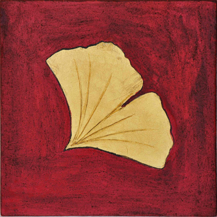

## Men(S)tis vzw

## Missie

De missie van de vereniging zonder winstgevend doel, **Men(S)tis,** rust op **de waarden 'mens, geest en leven'**.

**Het eerste element,** **de mens,** is aanwezig in de naam die leest als 'mens, menstis'. **Men(S)tis vzw** **wil het mysterie van de menswording** blijven huldigen en exploreren.

**Het tweede element** van 'mens, menstis', is **het Latijnse woord mens voor** **geest**. Die betekenis blijft immers goed leesbaar in de woorden 'mentaal, mentaliteit' en het Engelse 'mind'. **Men(S)tis** **werkt vanuit de mentale rijkdom van de mens.** In en door de mens stroomt er een innerlijk kapitaal aan gedachten, gevoelens en beelden. Het hoort bij de Homo sapiens als de bladeren aan de boom, maar... ze zijn diens eigendom niet. De Latijnse genitief — _menstis_ — signaleert dat de mens verbonden is met **de wonderlijke en complexe wereld van de geest**, een wereld waarin het fenomeen mens zijn nest heeft, een wereld waarin hij thuis is en woont, maar die hij niet als zijn volle eigendom bezit of beheerst.

 

**Het derde element** van de missie, is **het fenomeen van** **het leven**. Daarvan is het beeldlogo het zichtbare teken. Het beeld, een creatie van Nelly Claeys in opdracht van de vereniging, toont in close-up een ginkgoblad op een alizarine rode achtergrond. Het blad vertegenwoordigt de oudste boom, de **ginkgo biloba**. Hij is de echte levensboom van de planeet aarde. **Men(S)tis vzw** participeert hiermee aan een kunsttraditie die het ginkgoblad als **het levende beeld ziet van de heilige waarde van het leven**. De Duitse dichter Goethe bezong het ginkgoblad; het hedendaagse Britse kunstenaarsduo Gilbert & George nam het blad als leidmotief voor een reeks van werken.

**Men(S)tis vzw** schept met ieder initiatief een reële en mentale ruimte die verschijnt als een **bescheiden, tijdelijke en vruchtbare zone van zin**, een oord van levensbeschouwing. **Men(S)tis vzw** wil hiermee bijdragen tot de ontwikkeling van **het beeldend denken** en tot **het onderzoek naar de religiositeit, eigen aan de zich ontwikkelende audiovisuele cultuur**.

De vereniging heeft ook een **eigen website** en **een Facebook-profiel**.

De **stichtende leden** zijn: Sylvain De Bleeckere (1950), Felix Rijcken (1929), Nicole De Bleeckere-Van de Kerckhove (1951-1996), Gie Dandois (1955-1997). De **huidige** bestuursleden zijn: Sylvain De Bleeckere (voorzitter), Felix Rijcken (ondervoorzitter), Samuel De Bleeckere (secretaris-boekhouder).
