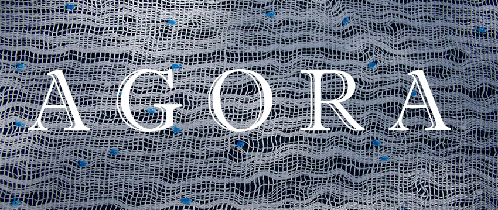

**HET KERKGEBOUW - WEEFSEL VAN ZINGEVING**

Heilige Magdalena Kerk, Brugge 

5 MEI-16 SEPTEMBER 2018

Het project is een samenwerking van Men(S)tis vzw en Yot vzw.

Curator: Sylvain De Bleeckere [Men(S)tis]
Coördinator: Koen Dekorte [Yot]

Tijdens het project Agora rolt de Heilige Magdalenakerk de rode loper uit voor iedereen, klein en groot, buurtbewoner, Bruggeling en toerist. Er ontstaat _een experimentele ontmoetingsplaats_. Het project Agora doet binnen het inspirerende en historische gebouw _een zichtbaar en onzichtbaar weefsel van zingeving_ ontstaan. Dat gebeurt via de _tentoonstelling_ van hedendaagse kunst met werk van [Marleen Mertens](http://www.marleen-mertens.be/) (Humana) en [Jan De Wachter]( http://www.jandewachter.be/Intro) (De Madonna van de Tederheid), de _verhalenkamer Serafijntje_ en de _filmstudio Lichtaard_. Iedereen kan het kerkgebouw met nieuwe ogen ontdekken. 

Wie zich geroepen voelt, kan zelf met een eigen bijdrage _de agora_ mee helpen uitbouwen in de verhalenkamer of de filmstudio.

Voor alle info met de presentatienota van het project, klik [hier](https://www.yot.be/nl/agora/410).

