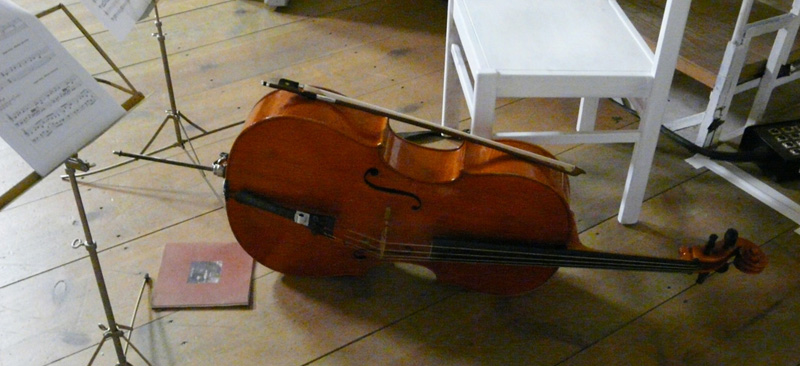
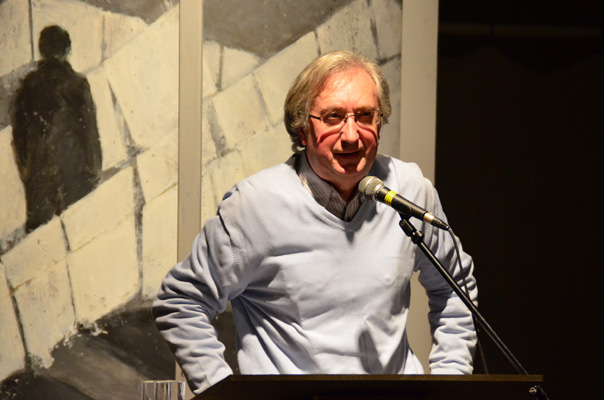
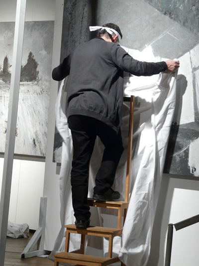
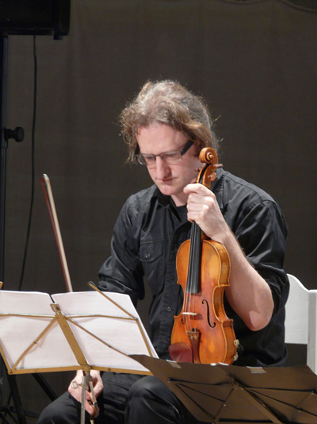
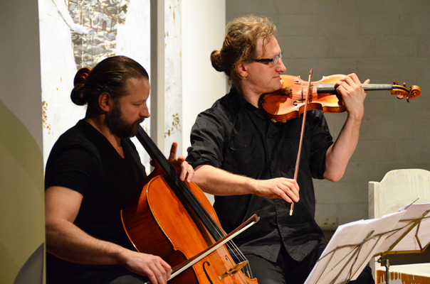
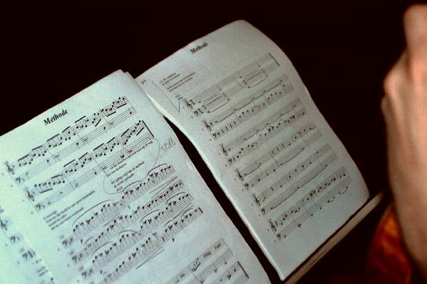

## Wat

Clair-Obscur is een kunstvoorstelling, opgebouwd rond de uitvoering van **Methode**, een kamermuziekspel voor stem, viool en cello. De uitvoering wordt omkaderd door een **performance met drie schilderijen**. De conceptuele achtergrond van **Clair-Obscur** is het boek [Levensbeschouwing democratisch belicht](http://www.menstis.be/uitgeverij/Levensbeschouwing/). Het geheel realiseert **een levensbeschouwelijke performance**.

## Programma

Welkom en inleiding in het teken van levensbeschouwing  
Openingsperformance met drie schilderijen  
Methode – deel 1: muzikale uitvoering met viool en cello  
Methode – deel 2: muzikale uitvoering met viool, cello en stem  
Slotperformance met drie schilderijen

## Wie

**Sylvain De Bleeckere.** Hij concipieerde Clair-Obscur in de geest van zijn boek  _Levensbeschouwing democratisch belicht_ (Pelckmans, 2015). Hij verzorgt het welkom en de inleiding. Hij schreef eveneens het filosofische poëem _Methode. Een denkbeeld_ (2001), een bibliofiele editie met CD van [uitgeverij Men(S)tis](/uitgeverij/). Hij draagt ook zelf de tekst voor tijdens de uitvoering. Woorden die tot leven komen tijdens de uitvoering: leven, geboorte, zingeving, tragiek, toeschouwerschap, onderweg, cultuurstuur.

**Jan De Wachter.** Hedendaags, plastisch kunstenaar opent en sluit de voorstelling af met een korte performance met drie van zijn grote schilderijen die het clair-obscur op een eigen, plastische wijze vertolken. [www.jandewachter.be/Jan_De_Wachter](http://www.jandewachter.be/Jan_De_Wachter)

**Wouter Vandenabeele** componeerde de muziek voor viool en cello bij Methode, dirigeert en speelt zelf de vioolpartij. Hij is de inspirator, componist en dirigent van Olla Vogola en lid van de groep Ambrozijn. Hij is als muzikant een echte multiculturalist, een van Vlaanderens beste violisten in de traditie van de folk, de jazz en de wereldmuziek. [www.woutervandenabeele.be](http://www.woutervandenabeele.be)

**Lode Vercampt** bespeelt de cello. Hij is een ware meester en voelt zich thuis op de scène van de klassieke muziek, de Vlaamse folk en rock, de jazz, de experimentele muziek en het muziektheater. Hij neemt tijdens de uitvoering de cellopartij voor zijn rekening.

## 'Zones van zin'

De voorstelling komt het best tot zijn recht in oude of nieuwe ruimtes met een architecturale kwaliteit. Tijdens de uitvoering krijgen ze de uitstraling van een tijdelijke ‘zone van zin’. Het publiek bestaat uit toeschouwers die voor de duur van de voorstelling zinzoekers worden. De voorstelling duurt 60 minuten.

## Uitvoeringen

De première van Methode vond plaats in De Markten te Brussel op 3 en 4 februari 2007\. Op 25 februari 2015 vond de eerste uitvoering van Clair-Obscur plaats in het Theater Tinnenpot te Gent naar aanleiding van de presentatie van het boek Levensbeschouwing democratisch belicht. 

Beluister hieronder de aanzet van het stuk Methode:

<audio controls>
 <source src="./Prelude.mp3"
         type='audio/mp3'>
</audio>

