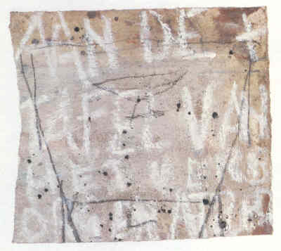

**Auteurs**

Sylvain De Bleeckere en Jan De Wachter

**Beschrijving**

Het boek bestaat uit een dialoog tussen **het essay van Sylvain De Bleeckere**: _Aan de tafel van het verborgen atelier. Een bericht aan Jan De Wachter_, en **de tekeningen van Jan De Wachter** met als motief **de oude en lange tafel** die van zijn atelier een huiskamer maakt. Het werk heeft als opdracht: _Aan al die vrienden die nu, in de Herinnering, ooit aan deze tafel aanzaten._  
Het boek toont eerst een tekening, daarna opent het essay met het deel dat als titel heeft: HET. Het middenluik van het boek bestaat uit een reeks tekeningen in kleur. Vervolgens gaat het esay verder met het deel: ZIJ. Het boek eindigt met een tekening in zwart-wit en het colofon.

**Technische gegevens**

Het betreft **een bibliofiel kunstboek**.  
Het boek bevat **26 bladzijden en 21 beelden**.  
De **afmetingen** van het boek zijn L:30 cm, B: 1 cm, H:42 cm.  
Het boek verscheen in **1997** in een oplage van 200 exemplaren. De **eerste 30 exemplaren** zijn romeins genummerd en gesigneerd van I tot XXX en voorzien van een originele tekening. De **overige 170 exemplaren** zijn genummerd en gesigneerd van 1 tot 170.  
Voor **de vormgeving, de maquette, het bindwerk en het ontwerp van de omslag met zeefdruk** zorgden Jan en Ann De Wachter.  
Het papier is rivoli wit, 160 gram. Het boek is gezet uit Esprit Book 13 punt.  
**Het drukwerk** gebeurde bij Salto n.v. (Rekem-Lanaken)