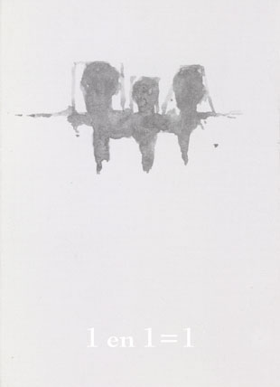
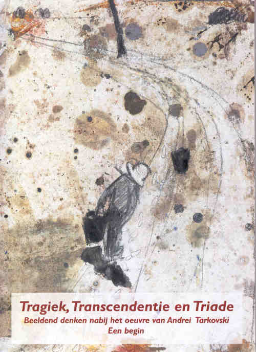

### Box 1 en 1 = 1 met het boek _Tragiek, Transcendentie en Triade_ en _negen kunstkaarten_

**Auteurs**

Sylvain De Bleeckere en Jan De Wachter

**Beschrijving**

De box is een doosje met op de voorzijde **het grafische logo**, getekend door Jan De Wachter, en **de denkformule 1 en 1 = 1** van Sylvain De Bleeckere. Op de linkerzijde bevinden zich de namen van de auteurs, op de rechterzijde staat het volgende citaat van Tarkovski: _Iemand die liefheeft kan geen eigen leven leiden, want je wereld dient samen te smelten met de wereld van de ander en in iets totaal anders te veranderen._ Op de achterzijde staat een tekst over het ontstaan en de inhoudelijke achtegrond van de box.

Bij de opening van het doosje vindt de lezer en toeschouwer eerst **het boek van Sylvain De Bleeckere**: _Tragiek, Transcendentie en Triade._ De ondetitel van het boek luidt: _Beeldend denken nabij het oeuvre van Andrei Tarkovski. Een begin_ Onderaan het doosje liggen **negen kunstkaarten van Jan De Wachter.**  
Het boek is in menig opzicht **naar concept en inhoud uniek**. Het introduceert **de notie van het beeldend denken**. Deze notie krijgt een metafysische, antropologische, cultuurfilosofische en esthetische fundering.

De Box bevat ook negen kunstkaarten, een selectie die de auteurs hebben gemaakt uit **de cyclus van 100 meditekeningen van Jan De Wachter naar de zeven films van Andrei Tarkovski**. Het drukwerk voor de meditekeningen is gebeurd met de hoogwaardige reproductie- en druktechniek voor kunst, ontwikkeld door **Salto N.V.** in Rekem-Lanaken. Dit werk is niet meer in voorraad.

