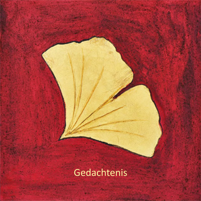

### Gedachtenis - Men(S)tis' Studies # 1

**Auteur**

Sylvain De Bleeckere

**Beschrijving**

Dit is de eerste publicatie in de reeks Men(S)tis' Studies. Het thema is 'gedachtenis'. De auteur behandelt het thema via een triptiek van drie uitgebreide filmstudies. Het betreft de films _En waar de sterre bleef stille staan, Agora_ en _Des hommes et des dieux_. Voor een kennismaking met het boek, [klik hier](./Gedachtenis.pdf).

U kunt Gedachtenis [Online bestellen](/shop/) op deze website. Aan boekhandels en organisaties worden bestellingen geaccepteerd vanaf 10 exemplaren of meer.

**Technische gegevens**

Het boek telt 124 bladzijden.  
De kaft is in kleur en is een originele schildering van een ginkgoblad.  
De tekst is verlucht met talrijke zwart-wit filmfoto's.  
De afmetingen zijn: 20 cm op 20 cm.  
ISBN 978 8051 650 2  
2011(2de druk)