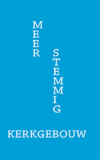

### Meerstemmig kerkgebouw

**Auteurs**

Sylvain De Bleeckere, Koen Dekorte, Geert Delbeke, Jef Van Eynde

**Beschrijving**

Het boek is verschenen begin maart 2019 als een gemeenschappelijke reflectie over het [Project Agora](http://www.menstis.be/producties/Agora/) in de Heilige-
Magdalenakerk te Brugge. Het is een gemeenschappelijke uitgave van Men(S)tis en [Yot](https://www.yot.be/nl/home/5).
Het boek telt vier inhoudelijke hoofdstukken plus een hoofdstuk met bronnen. De Maria-Magdalenakerk is onder leiding van de vzw YOT in Vlaanderen uitgegroeid tot een modelproject van een constructieve benadering van de parochiekerken die leeg komen te staan. Het pilootproject _Agora_ onderbouwt het werk van YOT en schept een werk- en reflectieruimte over het lot
van de vele parochiekerken in Vlaanderen. Met de titel '_Meerstemmig kerkgebouw_' nemen de auteurs afstand van het heersende discours over '_herbestemming van kerken_' en tonen ze vanuit de praktijk aan hoe het anders kan. 
Het boek is rijk geïllustreerd met het werk van fotograaf Jef Van Eynde.

Bestel _Meerstemmig kerkgebouw_ de winkelprijs bedraagt 20,00 EUR, verzending niet inbegrepen. 
[Online bestellen](/shop/).

**Technische gegevens**

Het boek telt 108 bladzijden.  
Het heeft een harde kaft.   
De afmetingen zijn: 160 mm op 235 mm.  
ISBN 978-90-8051-654-0  
2019