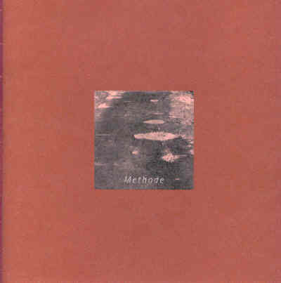

**Auteur**

Sylvain De Bleeckere

**Beschrijving**

Het boek Methode heeft een dubbele ondertitel waarvan de eerste is: _Een denkbeeld_, gevolgd door de tweede: _Fragmenten van een reflexie na een wandeling met een onbekende vriend._ Het betreft een filosofisch-religieus poëem. De auteur bewandelt hier onbegane paden om **een oorspronkelijke verwoording** te zoeken van wat sommigen vandaag onder **een religieuze beleving van het bestaan op aarde** kunnen verstaan. De tekst vertolkt en verklankt een dergelijke beleving waarbij **het indivuele beleven** zich mengt met **het collectieve lot van de mensheid** onderweg. De tekst heeft **in een bepaald opzicht een liturgisch karakter** en is geschreven om te worden voorgelezen. In het colofon preciseert de auteur dat het poëem is geschreven _om te worden voorgedragen daar waar enkele mensen zich rond een tafel verzamelen om bezinnend het heilig mysterie van het leven te delen._

**Technische gegevens**

Het boekje verscheen in **2001** en heeft een **broze** 
verschijning. 
De afmetingen zijn: L:22 cm, D: 0,5 cm, H:22 cm.   
Het telt **24** bladzijden.   
De tekst is evenals de kaft in **een aarden kleur** gezet.  
Het beeld op het omslag is **een digitaal bewerkt fotofragment**,
door de auteur genomen op de weg langs de oever
 van het meer van Silvaplana nabij Sil-Maria 
 in het Zwiterse Oberengadin.   
De uitgever: Men(S)tis vzw, Hasselt.
ISBN: 90-805165-2-X  

U kan de Methode cd en het boek [Online bestellen](../shop.html) 
op deze website. **Methode** maakt ook deel uit van het
productie van Men(S)tis,
**Clair-Obscur**.
