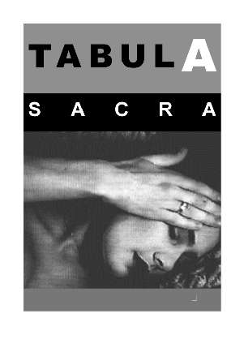

### Tabula Sacra

**Auteur**

Sylvain De Bleeckere

**Beschrijving**

Het betreft **de esthetisch verzorgde programmapocket** van het Men(S)tis-project **Tabula Sacra**. Het boekje bevat **de visie en het veelzijdige programma** van het project dat in 2001 op drie bijzondere locaties plaatsvond. Deze locaties - **Kasteel Mariagaarde Hoepertingen, Priorij Regina pacis Schoten en Oude Abdij Drongen** - worden voorgesteld. Voor de opmaak werkte de auteur samen met hedendaags kunstenaar **Patrick Merckaert**. Van hem is ook de kunstfoto op het omslag.

**Technische gegevens**  

Afmetingen: l: 10,5 cm, H: 15 cm, B: 0,3 cm.  
Het boekje telt 16 bladzijden en 3 locatie-foto's.

Het boekje Tabula Sacra [Online bestellen](/shop/) is gratis bij de bestelling van een 
van de andere publicaties.

