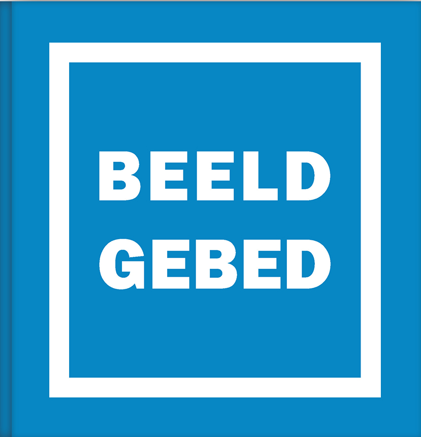

**Auteur**

Sylvain De Bleeckere

**Beschrijving**

BEELDGEBED is een even kunstzinnig als zinscheppende boekje. Het bestaat uit een origineel weefsel van beelden en woorden die samen peilen naar het **beeldende hart van het christendom**.
Met het meest kenmerkende, christelijke gebed, _het Onzevader_, als opstap, diept het boekje in het eerste deel, _**Woordbeeld**_, het onderscheid uit tussen bidden als werkwoord en gebeden als woorden. In die optiek bijft het boekje stilstaan bij de **tragiek** eigen aan de taal en de talen, namelijk die van de interpretatie. Dat inzicht - denk aan het verhaal over de Toren van Babel - belicht kritisch de eeuwenlange kerkelijke traditie dat bidden gelijk is aan het opzeggen van voorgeschreven woorden, gebeden genoemd. Vandaag ervaren we meer dan ooit dat woorden, ook religieuze woorden zoals gebeden, terecht zijn gekomen in een verstikkend en onvruchtbaar moeras van woorden.

**BEELDGEBED** neemt in het tweede deel, _**Beeldwoord**_, stapt uit dat moeras van het eeuwenoude geloof in woorden, door mensen bekleed met het zegel van eeuwigheid. De eerst stap daartoe bestaat in de kritische afstand tegenover  de visie en aanpak van de apostel Paulus en de inzoom op de **beeldrijke evangelies en de lichticoon Jezus**. Via een inzicht in **de interpretatie van de tragiek**, waaruit de christelijke grondteksten zijn voortgekomen, valt er een ander dan tradioneel licht op bidden. Hier verschijnt bidden als werkwoord, als levensbeschouwelijke praxis. Dat gebeurt via de spiegel van het **feminien-beeldende** karakter van Jezus' handelen en spreken. Daarin verschijint de blijvende relevantie van het oermenselijke fenomeen '**tafelgemeenschap**' - grondslag van Jezus' handelen - voor een **actuele, groeiende democratische samenleving**. Inspirerende herinneringsbeelden aan Jezus kunnen vandaag nog onze gemeenschap voeden. BEELDGEBED opent een nieuwe visie op de beproeving waarmee de wereldwijde samenleving met haar consumptiezucht progressief te kampen heeft: de mentale gezondheid van iedere persoon.

**Doelgroepen**

>Al wie levensbeschouwelijk actief is.

>Al wie een kunstminnend oog en geest heeft.

>Al wie zich wil verwonderen over het unieke universeel-menselijk oerfenomeen dat 'bidden' heet.

>Al wie moedig durft nadenken over het lot van de christelijke kerken (orthodox, katholiek, protestant).

>Al wie beseft dat de humane rijkdom van het christendom verder reikt dan het domein van de traditionele kerken die zich in een morele crisis bevinden.

>Al wie leeft en werkt vanuit een democratische gezindheid die niet kan worden gerecupereerd of gemanipuleerd door welke politieke partij dan ook.

>Creatieve scholen en hun hun alerte onderwijsmensen.

>Actieve, religieuze leesgroepen en/of gebedsgroepen.

**Technische gegevens**

Het boekje ligt in de hand door zijn vierkant formaat van 14cm. De stoffen kaft met zilveren boord en letters straalt ingetogenheid en een bijna liturgische waardigheid uit. 

Het boekje telt **120 bladzijden** en **17 beelden**. Kunstenaars [Marleen Mertens](http://www.marleen-mertens.be/), [Jan De Wachter](http://www.jandewachter.be/Intro), [Vincent Spaas](https://www.vincentspaas.com/), [Jef Van Eynde](http://www.jefvaneynde.be/) en [Kristof Hoornaert](https://www.kristofhoornaert.com/) leverden op vraag van de auteur nieuwe beelden aan die zich integreren in het boekje. Het boekje werkt ook met een uitsnede van een beeld van Leonardo da Vinci. Het bijzondere boekdesign is een ontwerp van de auteur in samenwerking met Jan De Meester van de drukkerij [Cultura](http://www.cultura.be/), Wetteren.  

Door zijn mooi uitzicht, zijn handig formaat, zijn visueel boekdesign, zijn bijzondere inhoud, is het een **ideaal geschenk** om aan een bijzonder iemand te geven.
 
De uitgever is **Men(S)tis**, Hasselt, 2020. 
ISBN: 978 90 805 1655 7. 
Kostrpijs: 20,00 EUR 

BEELDGEBED is niet in de boekhandel. Het is verkrijgbaar bij Men(S)tis via info@menstis.be.  

© Men(S)tis, 2020.