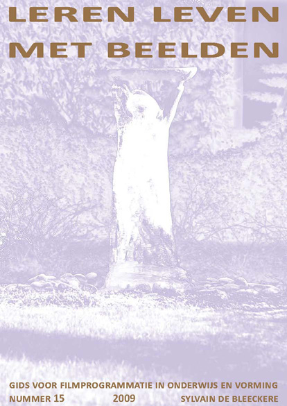

**Auteur**

Sylvain De Bleeckere

**Beschrijving**

Leren Leven Met Beelden is **een beeldpedagogische uitgave**, geschreven vanuit een eigen ontworpen concept en met als doelgroep: leerkrachten uit het basisonderwijs,het secundair en het hoger onderwijs. De ondertitel luidt: _Gids voor een filmprogrammatie in onderwijs en vorming._ De auteur stelt een tiental **recente films** voor die zowel esthetisch als inhoudelijk **een beeldvormende en algemeen vormende waarde** bezitten. Met deze presentatie in de hand, kunnen leerkrachten beslissen of een bepaalde film pedagogisch nuttig en ondersteunend kan zijn voor de uitwerking van een beeldpedagogisch en/of thematisch project.

**Doelgroepen**

> Al wie in onderwijs en vorming begaan is met beeldopvoeding aan de hand van kwalitieve beelden.

> Al wie lid is van een werkfroep film- en beeldopvoeding op school.

**Technische gegevens**

De uitgave heeft een A4-formaat en telt 48 bladzijden.  
**In 2012** verscheen **de 17de en laatste editie**.  

U kan de laatste exemplaren van **Leren Leven Met Beelden** bestellen via: info@menstis.be.

Kostprijs: 2,00 EUR per exemplaar - portkosten niet inbegrepen.

© Men(S)tis, 2020.