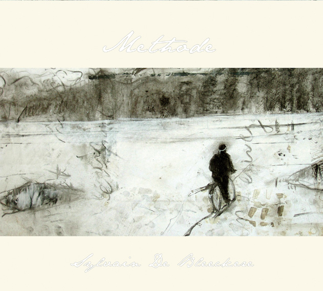

**Auteur**

Sylvain De Bleeckere

**Beschrijving**

De CD Methode is een **klankopname** van **het filosofisch poëem Methode** van Sylvain De Bleeckere.
 Musicus **Wouter Vandenabeele** (Olla Vogala, Ambrozijn) heeft naar aanleiding 
 van dat poëtisch werk **een nieuwe partituur** voor viool, altviool, cello en zang geschreven. De CD heeft een drieledige structuur. 
Er is een korte **prelude** die zowel muzikaal als tekstueel
 de sfeer oproept van het geheel. Daarna volgt **instrumentale uitvoering** van de compositie.
  Dat stuk werkt zelf als een lange prelude op **de volledige uitvoering met de voorgedragen tekst**. 
  De CD is niet in de handel verkrijgbaar. Het werk is enkel als **een geschenk** verkrijgbaar bij 
  de aankoop van het boek Methode, alsook bij een betalende deelname aan
  de productie **Clair-Obscur** van Men(S)tis vzw.

**Technische gegevens**

_Uitvoerders_  
Wouter Vandenabeele (compositie, viool, altviool)  
Lode Vercampt (cello)  
Soetkin Baptist (zang)  
Sylvain De Bleeckere (tekst, voordracht)

_Techniek_  
Opname en masering: Home Records (Luik) / 2007 / ([www.homerecords.be](http://www.homerecords.be/))  
Mixage: Michel Van Achter, Wouter Vandenabeele, Sylvain De Bleeckere  
Foto’s: Michel Van Achter  
Stemmentor: Veerle Verheyen  
Tekening; Jan De Wachter

_Duur_  
1 Prelude 1’13”  
2 Methode 1 (instrumentaal) 24’56”  
3 Methode 2 28’53”

U kan de Methode cd en het boek [Online bestellen](/shop/) op deze website.

© Men(S)tis, 2020.