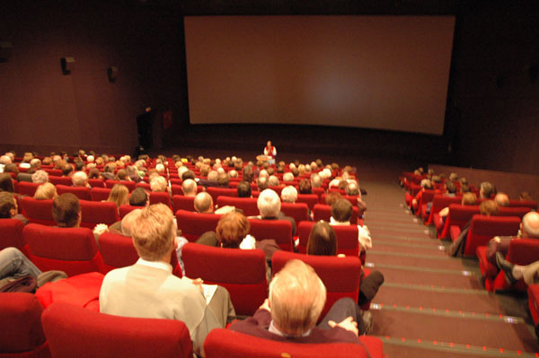
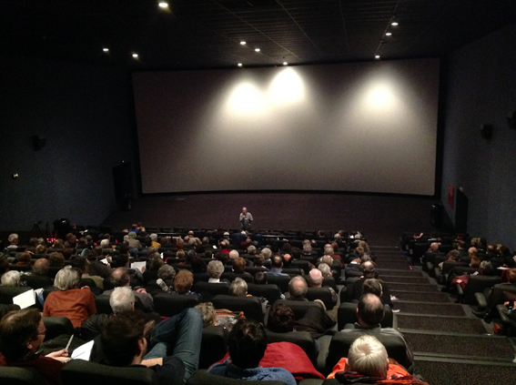

_De Dag van de Religieuze Film_ onderzoekt en beleeft **het antropologisch fenomeen van de levensbeschouwing in de postmoderne, democratische samenleving**. Daarbij schenkt _De Dag_ aandacht aan **de hedendaagse waarde van het authentieke beeld, de esthetische** en **spirituele rijkdom van de cinematografie** en **de veelzijdige praxis van zingeving en religie**. _De Dag_ kadert in **de ontwikkeling van het beeldend denken**. Het **motto** van _De Dag_ luidt: '**Een feest voor oog en geest**'.

_De Dag_ ziet er uit als **een bescheiden en niet-gesponsord event** dat enkele recente films op _een andere manier_ in de kijker plaatst dan de louter journalistieke en/of commerciële presentatie. Er is **een beeldprogramma** met films, alsook **een woordprogramma** dat het jaarthema en de verschillende films belicht.

Iedere editie van _De Dag_ heeft **een andere thematische invalshoek**. Sylvain De Bleeckere belicht het thema en de films tijdens zijn inleidingen en via publicaties. Van de 20ste editie (2011) en de 21ste editie (2012) verschenen zijn studies als [Men(S)tis' Studies](../uitgeverij/index.html "uitgeverij"). Naar aanleiding van de 23ste editie (2013) verscheen zijn boek **Het Beloofde Land** (Averbode Altiora) en bij de 24ste editie (2015) zijn boek **Levensbeschouwing, democratisch belicht** (Uitgeverij Pelckmans).

De Dag vindt plaats in **het bioscoopcomplex Kinepolis te Hasselt**, telkens op krokusmaandag.

Het Men(S)tis' **team** dat het event organiseert: **Sylvain De Bleeckere** (concept en inhoud),
**Felix Rijcken** (ondersteuning en verwelkoming),
 **Siegfried De Bleeckere** (website),
**Gerda Bracke, Dorothea De Bleeckere, Thirza Vandenabeele** (balie en onthaal).

Voor meer informatie in verband met de _Dag van de Religieuze Film_ kan je mailen naar dit adres: [**info@menstis.be**](mailto:info@menstis.be).

 