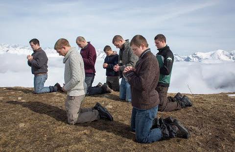

Het progamma van de **30ste editie** van **De Dag** op krokusmaandag **15 februari 2021** heeft als thema **Beeldgebed**. Het thema is ontleend aan het gelijknamige  [boekje](http://www.menstis.be/webshop/Beeldgebed/) van Sylvain De Bleeckere, verschenen in 2020 en gepresenteerd tijdens **De Dag**. dat tijdens de vorige editie is verschenen.  Het programma verschijnt hier midden december 2020. Er is echter een groot voorbehoud aan verbonden. Wegens de heersende corona-crisis is het nu helemaal niet duidelijk of **De Dag** zal kunnen doorgaan. Van zodra daarover duidelijkheid bestaat, wordt dit hier meegedeeld. Ook op haar Facebook-pagina van **De Dag van de Religieuze Film** zal Men(S)tis vzw daarover communiceren.

Tijdens de vorige editie vertoonde **De Dag** de historische film **Darkest Hour** (2017) over Sir Winston Churchill. Ondertussen is er op [FilmFocus](http://www.menstis.be/film-focus/darkesthour/) van Men(S)tis-site een uitgebreide studie over de film gepupliceerd. Hieruit blijkt dat Winston Churchill in mei 1940 de enige politicus in de westerse wereld was die het durfde opnemen tegen de fascistische Hitler. De motivatie van Churchill kwam voor uit zijn diep geloof in de christelijke waarden van menselijkheid en de democratische rechten van de mens. Hieruit blijkt aan welke historische blindheid de bekladders van het standbeeld van Churchill in Londen in juni 2020 lijden.

Ook de Franse film **La prière** stond op het programma van jongste editie van **De Dag**. Een uitgebreide analyse van de film verscheen eveneens op [FilmFocus](http://www.menstis.be/film-focus/priere/). 

