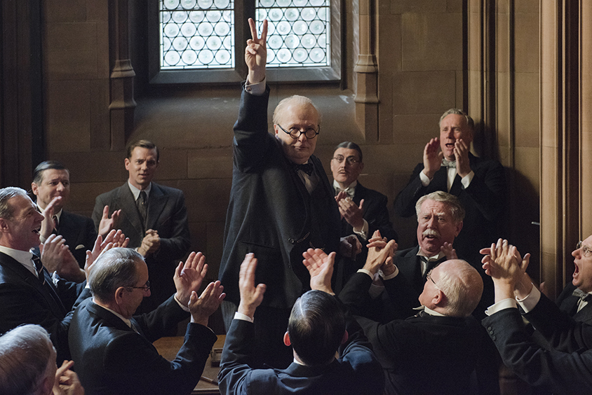

Het progamma van de **30ste editie** van **De Dag** zal als thema **Beeldgebed** hebben. Het thema is ontleend aan het gelijknamige  [boekje](http://www.menstis.be/webshop/Beeldgebed/) van Sylvain De Bleeckere, verschenen in 2020 en gepresenteerd tijdens de jongste, de 29ste editie van **De Dag**. 

 Wegens de heersende corona-crisis zal de 30ste editie van **De Dag** niet plaatsvinden in 2021. Of dit in 2022 zal kunnen, daarover kan nu nog niets met zekerheid worden gezegd. Ook op haar Facebook-pagina van **De Dag van de Religieuze Film** zal Men(S)tis vzw daarover haar volgers informeren.

Tijdens de vorige editie vertoonde **De Dag** de historische film **Darkest Hour** (2017) over Sir Winston Churchill. Ondertussen is er op [FilmFocus](http://www.menstis.be/film-focus/darkesthour/) van Men(S)tis-site een uitgebreide studie over de film gepupliceerd. Hieruit blijkt dat Winston Churchill in mei 1940 de enige politicus in de westerse wereld was die het durfde opnemen tegen de fascistische Hitler. De motivatie van Churchill kwam voor uit zijn diep geloof in de christelijke waarden van menselijkheid en de democratische rechten van de mens die in zijn optiek geen gescheiden werelden waren. Spijtig dat er vandaag velen zijn die aan historische blindheid lijden, zoals zij die meenden het standbeeld van Churchill in Londen in juni 2020 te moeten bekladden. In Time Magazine van 15-22 februari 2021, een themanummer over The Black Renaissance, verscheen een interview van Michele Obama met Amanda Gorman, de jonge zwarte dichteres die wereldwijd indruk maakte op de Inauguration Day van president Biden met de voordracht van haar gelegenheidsgedicht _The Hill We Climb_. Michelle Obama vroeg aan Amanda Gorman welke kunstenaars die in andere domeinen dan de poëzie werken, haar hebben geïnspireerd. Ze antwoordde: _'While I was writing the Inaugural poem, I was reading a lot of Frederick Douglass, a lot of Winston Churchill, a lot of Abraham Lincoln._' (p. 63)

Ook de Franse film **La prière** stond op het programma van jongste editie van **De Dag**. Een uitgebreide analyse van de film verscheen eveneens op [FilmFocus](http://www.menstis.be/film-focus/priere/). 

