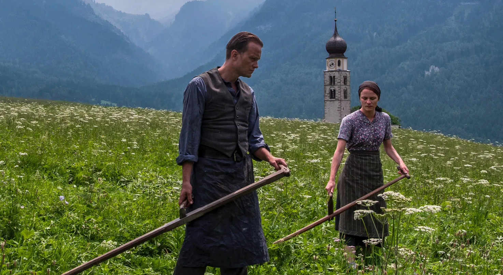

- [Klapbord](#hid_bord)

- [Synopsis](#hid_opsis)

- [Cinematografie](#hid_graf)

    - [Ouverture in zwart-wit, voice-over en Bach](#hid_bach)

    - [Epiloog in kleur, voice-over en James Newton Howard](#hid_how)

    - [Driezijdig contemplatievermogen](#hid_gen)

    - [Beeldspraak](#hid_spraak)

    - [Requiem](#hid_em)

- [Betekenisruimte](#hid_ruim)

    - [Humanument](#hid_ment)

    - [De ‘zwijgende’ Kerk van Pius XII](#hid_kerk)

    - [Malicks cinematografisch zelfportret met christelijke kunst](#hid_kunst)

    - [Gewetensvrijheid als democratisch verzet](#hid_zet)

- [Context](#hid_xt)

- [Links](#hid_ks)

## Klapbord

Terrence Malick won met zijn tiende langspeelfilm **A Hidden Life** de Gouden Palm van het Filmfestival Cannes 2019 voor Beste Film, alsook de Prijs van de Oecumenische Jury. Zoals in zijn eerdere films ― The Thin Red Line over WO II en [The New Life](http://www.menstis.be/film-focus/newworld/) over de koloniale oorsprong van de USA ― is **A Hidden Life** opnieuw een historisch drama. Ditmaal situeert het zich in Europa, met name in het door Hitler bezette Oostenrijk. In zijn bijna drie uur durende film evoceert Malick het levensverhaal van een eenvoudig Oostenrijks landbouwersgezin, waaraan de herinnering tijdens en direct na de dramatische geschiedenis van Hitlers Derde Rijk verdween als een gevallen herfstblad, ongekend, vergeten, onbeduidend voor het grote verhaal over de loop van die rampzalige, historische gebeurtenissen. De film evoceert het reële verhaal van Franz Jägerstätter, een katholieke martelaar van de 20ste eeuw. Malick zelf heeft jaren aan het script gewerkt na studie van de historische bronnen. Hij besteedde veel aandacht aan de voorbereiding van de opnames in en rond het Oostenrijkse bergdorp St. Radegund met de originele boerderij van Franz en zijn vrouw Fani. Voor de berglandschappen koos hij het Italiaanse Zuid-Tirol (Alto Adige). De gevangenissequenties filmde hij in Zittau, gelegen in de Duitse deelstaat Saksen, en in de stad Berlijn. De hoofdvertolkingen zijn van August Diehl als Franz Jägerstätter, Valerie Pachner als diens vrouw Franziska Schwaninger ― roepnaam ‘Fani’ ― en Maria Simon als Resie, de zuster van Fani. Verschillende nevenpersonages worden vertolkt door sterke acteurs zoals de Duitse, ondertussen overleden Bruno Ganz (rechter Werner Lueben) en de Vlaamse acteurs Matthias Schoenaerts (Duitse militair Herder) en Johan Leysen (schilder Ohlendorf). 

## Synopsis

Het landbouwgezin van Franz en Fani Jägerstätter leven gelukkig op en rond hun velden in het Oostenrijkse, rooms-katholieke bergdorp St. Radegund in Opper-Oostenrijk (Oberösterreich), een grensdorp gelegen vlakbij de Duitse grens. Het gezin woont er sinds hun trouwdag 9 april 1936 in hun boerderij Leherbauer samen met hun drie meisjes Rosalia (°1937), Maria (°1938) en Aloisia (°1940). De ongehuwde zus van Fani, Resie, maakt deel uit van het gezin. Ook Rosalia, de moeder-weduwe van Franz, verblijft op het erf. De seizoenen bepalen hun agrarische levensritme. De nabije bergen, de valleien, de bossen en de bergrivier Salzach vormen hun vertrouwde biotoop. De dichtstbij zijnde steden Linz en Salzburg hebben amper een impact op St. Radegund met zijn vijfhonderd inwoners. Dat verandert wanneer Hitler, geboren in het Oostenrijkse Braunau, niet zo heel ver van waar Franz en Fani wonen, beslist het oorlogspad te bewandelen. In 1938 ondergaat Oosterrijk de Anschluss met Hitlers Derde Rijk. In juni 1940 moet iedere gezonde man in de streek zich in het leger laten inschrijven in Braunau. Franz moet van 18 juni tot 31 december 1940 een eerste militaire training volgen in Enns bij Linz. Fani en Franz schrijven elkaar en blijven sterk verbonden. Uiteindelijk krijgt Franz als landbouwer toestemming om terug te keren naar zijn gezin in St. Radegund. Samen hopen Fani en Franz vurig dat hij uiteindelijk niet als soldaat zal worden opgeroepen. In het dorp weigert Franz mee te doen met de nazipartij die greep heeft gekregen op de bewoners van het dorp. De dorpelingen keren zich tegen het gezin Jägerstätter. Franz zoekt steun bij de dorpspastoor Fürthauer maar die voelt zich machteloos. Hij regelt een gesprek van Franz met de bisschop. Dat levert niets op. Franz en Fani staan er alleen voor. Ze hebben elkaar, hun kinderen en hun katholieke geloof. Hun innige hoop dat Franz niet wordt opgeroepen, houdt stand tot op 23 februari 1943. Dan brengt de postbode het onvermijdelijke verdict. Franz moet zich melden op de militaire basis van Enns als gevolg van de grote mobilisatie in 1943. Tijdens de administratieve procedure in de kazerne deelt Franz mee dat hij weigert de verplichte militaire eed van trouw aan de Führer af te leggen. Hij wordt meteen gevangen gezet, eerst bij de krankzinnigen, daarna wordt hij vervoerd naar de gevangenis in Tegel, Berlijn. Franz en Fani blijven elkaar schrijven. Fani kan een laatste keer Franz bezoeken in de gevangenis. Het wordt een definitief afscheid. Dan moet Franz verschijnen voor het Reichskriegsgericht, het hoogste militaire gerechtshof van het Derde Rijk. Dat veroordeelt Franz op 6 juli 1943 tot de dood. Het vonnis wordt op 14 juli bekrachtigd. Op 9 augustus wordt Franz om 16u00 terechtgesteld met de guillotine. Boerin Fani is van dan af een weduwe met drie kinderen.

## Cinematografie

De synopsis beschrijft enkel de narratieve rode draad van **A Hidden Life**. De film kent een inclusie met de proloog en de epiloog. Daartussen ontvouwt zich dan de tweeledige, chronologische beweging. De eerste schildert de groeiende, destructieve impact van de Anschluss op het dagelijkse leven van het gezin van Franz en Fani. De tweede evoceert de lijdensweg van Franz in de gevangenissen tot aan zijn terechtstelling. Die tweeledige narratieve basislijn benadert geenszins het concrete beeld van Malicks heel bijzondere en veelzijdige cinematografie. Voor Malick vertegenwoordigt het historisch-biografische verhaal slechts de aanleiding voor zijn eigen, cinematografische expressie van het historische gebeuren. Zijn film focust niet op het narratieve. Dat blijkt al in de proloog. Vanaf de eerste minuten zet die de eigenzinnige, artistieke toon van Malicks audiovisuele poëzie.

##  **Ouverture in zwart-wit, voice-over en Bach**

De korte maar zeer uitgekiende ouverture van de film geeft de toeschouwer de sleutel ervan in handen. De unieke audiovisuele montage hoort en oogt als een beeldgedicht dat de persoonlijke mentale leefwereld van het hoofdpersonage introduceert. De eerste beelden zijn volledig zwart met enkel de generieknamen in het wit, terwijl de eerste vogelgeluiden en het stromende water van de Salzach hoorbaar zijn. Na de generieknamen blijft het beeld helemaal zwart met de heldere natuurgeluiden. Dan weerklinkt uit het niets, met het donkere beeld nog steeds op de achtergrond, de voice-off van Franz: ‘Ik hoopte voor ons een nest te bouwen ergens hoog in de bomen...’ Dan weerklinkt in een stille modus op de klankband het koor dat Bachs Matthäus-Passion inzet, terwijl Franz vervolgt: ‘…en dan wegvliegen als vogels naar de bergen.’ Het Bachkoor neemt vervolgens de klankband over terwijl dan pas de eerste sequentie in zwart-wit verschijnt binnen een vierkant frame. We kijken mee met de piloot van een vliegtuig dat hoog boven de wolken vliegt. Het toestel daalt door de wolken en dan verschijnt de Duitse stad Neurenberg. Op de klankband is geen motor te horen, alleen de stemmen van Bachs oratorium. Dan rijdt een autocolonne met Hitler in een open Mercedes langs de straten waar enthousiaste rijen Duitse mannen, vrouwen, jongeren en kinderen hem toejuichen. Ze voeren allen de Hitlergroet uit. We zien een close-up van Hitlers rechterhand. De Führer schouwt de optocht ter zijner ere vanop de toenmalige Adolf-Hitler-Platz tegenover de statige Frauenkirche. Mannen zwaaien met grote nazivlaggen; mannen en vrouwen in Beierse klederdracht stappen voorbij. Vervolgens gaat Hitler naar de hoofdtribune van het Neurenbergse Reichsparteitagsgelände, waarop hij de massa partijleden zal toespreken. Zijn stem vermengt zich even met het Bachkoor. We zien de nazileider in close-up zijn vele duizenden aanhangers toeschreeuwen. Nog steeds op de tonen van het koor volgen avondbeelden van de fakkeloptocht van de SA-troepen die verzamelen rond een groot vuur. De reeks zwart-beelden mondt uit op het kikvorsbeeld van Hitler die in het donker de marcherende mannen met fakkels overschouwt en met gestrekte arm groet. De muziek weerklinkt verder, het beeld wordt terug zwart. Dan verschijnen de volgende zinnen: ‘The following story is based on true events. During World War II, every Austrian soldier called up for active duty was required to swear an oath of loyalty to Hitler’. De muziek gaat over in het geluid van een zeis waarna het eerste panoramische beeld in kleur verschijnt: de grasmaaiende boer Franz in rugperspectief met op de achtergrond de wit geschilderde toren van de parochiekerk, een witte stip in het landschap met het gebergte in de verte.   

## **EPILOOG IN KLEUR, VOICE-OVER EN JAMES NEWTON HOWARD**  

Met de suggestieve sequentie van de terechtstelling van Franz eindigt het historische verhaal, maar niet de film. Na die sequentie volgt een zwart beeld, begeleid door enkel het geluid van de stromende Salzach. Die klank introduceert de eerste beelden van de epiloog. We zien in kleur de stroming van de rivier. Dan komt de koster van het kerkje in beeld die de klok gaat luiden. In het begin van de film zagen we Franz diezelfde klokken luiden. Nu draagt de kerkklok het nieuws van het overlijden van Franz uit over het dorp en vallei. Iedereen in het veld en op de boerderijen staat even stil. De mannen nemen uit eerbied hun pet af. Het beeld van de zwijgende klok gaat over in een zwart beeld. Dan zien we Fani en haar zus Resie zwoegend en trekkend het geploegde veld heggen. Fani verzorgt de dieren in de stal. De twee zussen zitten zwijgend in het hoge gras dat ze straks met de sikkel in de hand gaan maaien. De dorpelingen werken op het veld. Ze stappen daarna richting de kerk. Fani is op de boerderij. Een oude man met naast hem een kleinkind schept water uit de waterput. Bij die reeks epiloogbeelden weerklinkt de mediterende stem van Fani: 

>>*Eens zullen we weten waar dit allemaal voor is. Geen geheimen meer, dan weten we waarom we leven. We komen samen. We planten boomgaarden en velden. We bouwen het land weer op. Franz, ik zal je ontmoeten, daar in de bergen.*

Bij het woord ‘bergen’ filmt de camera panoramische beelden van het weidse berglandschap met op de klankband Howards ingetogen compositie ‘Their Will Be No Mysteries’, appellerend aan de woorden van Fani: ‘…geen geheimen meer’. Het Engelse ‘mysteries’ wordt in de Nederlandse ondertiteling niet helemaal juist vertaald met ‘geheimen’. Dat heeft een andere betekenis dan het woord ‘mysteries’. Bij de laatste voice-off woorden van Fani – ‘Franz, ik zal je daar ontmoeten, in de bergen’ – weerklinkt vanaf de beelden van de gewassen op het veld met de nabije witte kerktoren en het verre gebergte, Howards compositie ‘A Hidden Life’. Die begeleidt ook nog het volledig zwarte beeld waarmee de film eindigt, waarna de slottekst verschijnt, een citaat van George Eliot: 

>>*…for the growing good of the world is partly dependent on unhistoric acts; and that things are not so ill with you and me as they might have been, is half owing to the number who lived faithfully a hidden life, and rest in unvisited tombs.*

Ook bij de eindgeneriek blijft de muziek van Howard doorlopen. De proloog en de epiloog beschrijven in woord en beeld een inclusie. Ze omcirkelen de twee lange bewegingen van het biografische verhaal. In de proloog zegt Frans: *I thought we could build our nest high up, in the trees, fly away like birds to the mountains.* In de epiloog antwoordt Fani hem over de dood heen: *Franz, I’ll meet you there — in the mountains*.

## **DRIEZIJDIG CONTEMPLATIEVERMOGEN**

Malick tilt de cinematografie tot op het hoogste niveau van de levensbeschouwelijke kunst. Daarin is hij een grootmeester. Hij bewandelt immers de levensbeschouwelijke weg op drie verschillende niveaus tegelijk: dat van de regisseur, de personages en de toeschouwer. Zijn kunst van de cinematografie appelleert op een unieke manier aan wat ik vooral in het eerste deel van Levensbeschouwing democratisch belicht (2015) ‘het contemplatievermogen’ heb genoemd. Het betreft de mentale navelstreng waarmee ieder lid van de mensheid verbonden is met het levenswonder dat hij of zij zelf is en dat hem of haar omringt, van de microkosmos tot de macrokosmos. Het contemplatievermogen vormt de onuitputtelijke bron van de vele modi van creativiteit: het unieke vermogen van de menselijke geest, ‘the mind’: het Latijnse ‘mens, mentis’ [men(S)tis]. 

>**De regisseur**

Op het niveau van de regisseur beoefent Malick de authentieke kunst van de auteursfilm. Hij kiest zelf zijn onderwerp, doet onderzoek, werkt zelf aan het scenario, kiest de buitenlocaties, regisseert de opnames in nauwe samenwerking met de cameraman en hij werkt daarna in alle rust en stilte ongeveer een jaar aan de montagetafel aan de uiteindelijke film. Met andere woorden, hij gaat creatief om met alle beschikbare elementen van het filmische instrumentarium. Dat maakt hem in de het tweede en derde decennium van de 21ste eeuw tot dé filmkunstenaar niet alleen van en in de USA, maar ook van de huidige wereld. Hij beweegt zich op zijn eigen manier in de vooral Europese traditie van de kunstfilm die na de Tweede Wereldoorlog tot ontwikkeling en tot bloei is gekomen. Ik karakteriseer Malicks cinematografische schriftuur als fluïde. In de allereerste klanken van de proloog weerklinkt het stromende water van de Salzach; hetzelfde gebeurt opnieuw bij de opening van de epiloog. De stromende rivier zet de beeldenreeks van de epiloog in. Malick maakt van die stroming de basismetafoor van zijn cinematografische werkwijze. Zo maakt hij tijdens de opnames gebruik van de steadycam. Deze camera steunt op het hele lichaam van de cameraman. Die zeer wendbare camera kan zeer dicht bij de personages komen, meestal voor of achter, zelden opzij van hen. Dat verklaart ook de vele close-ups ― full face shots ― van de hoofdpersonages. Die laten de acteurs zelf vrij te bewegen in de opameruimte en kan de camera zich ook heel soepel en vloeiend tussen en rond de acteurs bewegen zonder hun bewegingen te hinderen. Malick gebruikt die fluïde opnames nadien in de montage om het tijdsverloop als één ononderbroken, stromende beweging te laten overkomen. Dat impliceert dat hij zijn filmwerk ent op het tijdsverloop van de natuur en niet op dat van de mens. De menselijke tijd verloopt chronologisch volgens de mechanische logica van het uurwerk. Het tijdsverloop van de natuur daarentegen kent stroming, verwevenheid, terugkeer, herhaling van hetzelfde dat voor wie er oog en oor voor heeft steeds anders is: de natuurlijke cyclus van dag en nacht, de seizoenen, eb en vloed, de waterval die nooit stopt en hetzelfde lijkt te zijn terwijl steeds ander water naar beneden valt. Malicks fluïde cinematografie bepaalt ook de wijze waarop Malick het verhaal van Franz en Fani verbeeldt. In de twee biografische bewegingen monteert Malick de beeldenstroom van het gezin op de boerderij. Die beelden enten zich op het ritme van de seizoenen, niet op dat van de historische gebeurtenissen. Malick gebruikt daarom talrijke jump cuts. Hij breekt ermee de chronologie letterlijk af zodat niet die chronologie domineert, maar de eigen immanente kracht van het gebeuren zelf. Zelfs wanneer Franz en Fani worden gescheiden door het historische gebeuren van de ontketende wereldoorlog blijven ze via de beelden intens verbonden. Malick maakt er geen herinneringsbeelden of flashbacks van. De beelden in kwestie behouden hun natuurlijkheid alsof het natuurlijke leven van Franz, Fani en Resie op de velden, de boerderij en de bossen op de heuvels nooit verdwijnt, nooit oud wordt noch vergaat. De beelden vertellen van de bewegende, levendige standvastigheid van dat agrarische en liefdevolle bestaan, verweven met elkaar, de kinderen, de familieleden, de dieren, de planten, de bergen en de valleien. Bij die beelden weerklinkt in voice-over de stem van Fani: *Hoe simpel was het leven toen. We leefden boven de wolken. We hadden een thuis. Onze familie. Ons dorp.* Ze spreekt in de verleden tijd, ze schrijft naar haar Franz die bij het Duitse leger is moeten gaan trainen als motorrijder. Terwijl ze hem schrijft, evoceren de beelden van St. Radegund de aanwezigheid van hun gemeenschappelijke en natuurlijke bestaan als koppel, gezin, familie en dorp. De verleden tijd die Fani gebruikt, laat het eigen levensritme oplichten van het agrarische gezin; dat voltrekt zich in een andere tijdszone dan die van de chronologische, historische tijd die voor het eerst op het scherm verschijnt met de datum en de plaats van Franz’ eerste militaire training: ‘Enns Military Base, 1940’. Die militaire orde verschijnt dan in het beeld van de marcherende Duitse soldaten in de kazerne. Hun gelaarsde voerstappen weerklinken als de ritmische secondewijzer van een klok. Zij introduceren de uiterst destructieve tijdsorde die agressief binnendringt in die van de fluïde natuurtijd van Franz en Fani. De jonge soldaten trainen ook met hun geweren in aanslag in het bos waarmee thuis Franz en Fani zich op hun eigen manier sterk verbonden voelen. Malick werkt het contrast uit door eerst de soldaten in het bos te plaatsen en daarna een sequentie in te lassen met Fani en Resie die op dat ogenblik in het bos voor het haardvuur hout sprokkelen van de afgewaaide takken. Even later zien we Fani in de winterse sneeuw ook hout sprokkelen aan de oevers van de stroom.  Met de bundel hout op haar rug baant ze zich dan moeizaam een weg door de sneeuw naar huis. De hele film lang confronteert Malick de weerstand van de tijdszone van de levendige natuur waarin Franz en Fani bewegen met de tijdszone van de Duitse oorlogsmachine. In de epiloog blijkt dat die laatste uiteindelijk, hoe machtig en moordend ook, niet in staat is de natuurlijke tijd te vernietigen. Malick geeft in die epiloog het laatste woord aan die fluïde tijd waarin Franz en Fani verweven met elkaar en de dingen leefden. Het dictaat van de historische moord op Franz kan voor Malick niet het cinematografische eindpunt zijn.

Op het niveau van de persoon van de regisseur activeert Malick het contemplatievermogen bovendien nog in een wel heel bijzonder tafereel. In **A Hidden Life** last hij uitzonderlijk een niet-biografische sequentiereeks in met de opvoering van zijn alter-ego, de schilder Ohlendorf. Het betreft een fictief personage, een creatie van Malick zelf, die los staat van het historische verhaal van Frans Jägerstätter. Malick situeert het tafereel in een kerk waar Ohlendorf fresco’s van nieuwtestamentische taferelen schildert. Helemaal in de geest van de contemplatieve aura van de film staat de sequentiereeks in het teken van de reflectie van de schilder-regisseur over de zin van zijn werk: de creatie van religieuze kunst. Het personage spreekt hardop nadenkend voor zichzelf terwijl Franz naar hem luistert. In plaats van het geven van interviews aan filmjournalisten die willen weten wat hij met zijn bijzondere filmische stijl juist bedoelt, vertolkt Malick via het artistieke kerktafereel zijn persoonlijke, autobiografische reflectie over zijn werk in het algemeen en heel in het bijzonder over zijn film **A Hidden Life**, en monteert hij aldus in de film de contemplatieve sleutel ervan. Door het personage van Franz zwijgend in het tafereel mee op te nemen, mediteert Malick cinematografisch eveneens over de betekenis van de religieuze kunst in relatie tot de concrete realiteit met haar historische gelaagdheid.

>**De personages**

Malicks fluïde cinematografie dedramatiseert de twee hoofdpersonages. Zij bevrijdt ze uit de narratieve dwangbuis. Geen karakterstudie, geen psychologische verklaringen, zelfs een minimum aan dialogen, ook in de sequenties in de gevangenis en de rechtszaal waar Franz wordt ondervraagd. Wat op de voorgrond komt, zijn de schouwende, mediterende Franz en Fani. Ze zijn geen marionetten aan de touwtjes van het scenario. Ze bewegen vanuit hun innerlijke wereld. Die toont zich in hun manier van kijken naar zichzelf, elkaar en de omringende dingen. Dat maakt deel uit van het inwendige gesprek dat ze voeren met zichzelf en elkaar via de voice-over van hun brieven. Ook blijkt hoe intens ze de omringende natuur in zich opnemen. Ze spreken niet, ze zwijgen en luisteren in de menselijke stilte naar de klanken van het landschap. Als ze spreken met elkaar gebeurt dat in voice-over. Het zijn beschouwingen die ze naar elkaar per brief sturen wanneer het militaire bevel hen scheidt. Wanneer ze bij elkaar zijn, hebben ze genoeg aan enkele woorden en de intieme stilte waarin ze zich bewegen. Franz en Fani zijn echte Malick-personages. Ze contempleren in zichzelf over hun bestaan, over de levenswaarden die ze bij elkaar vinden en over de bedreiging die van buitenaf hun gemeenschappelijke bestaan in gevaar brengt. Een ander cinematografisch middel waarmee Malick de narratieve logica dedramatiseert, bestaat uit de inlas van zwarte beelden. In **A Hidden Life** dienen ze om de wisseling tussen de twee tijdsordes van elkaar te scheiden. Tegelijkertijd leggen ze over de hele film een rouwband. Vanaf het begin is de dramatische uitkomst al gekend. Malicks focust niet op de dramatiek van het verhaal op zich. Hij ent zijn cinematografie op de mentale attitude van Franz en Fani, op hun gemeenschappelijke besef van de blijvende waarde van hun unieke onverbrekelijke band. Met andere woorden, het cinematografische accent ligt niet op het lot zelf van Franz en Fani, maar op de uitzonderlijke waardevolle manier waarop ze hun lot beschouwen. Malick wil zoveel mogelijk beschikbare filmische tijd vrij maken voor die beschouwende blik van zijn personages. Dat maakt dat **A Hidden Life** niet oogt als een actiefilm met een passieve rol voor de toeschouwer. Daarentegen krijgt de toeschouwer een actieve, contemplatieve rol toebedeeld. 

>**De toeschouwer**

Malicks fluïde cinematografie neemt het toeschouwerschap van de mens helemaal ernstig op alle niveaus. Zij appelleert aan het schouwende vermogen van de mens om op het hoogste mentale niveau met de filmbeelden te dialogeren. Op die manier brengt Malick de toeschouwer in dezelfde contemplerende positie als Franz en Fani. Dat geeft Malick zelf aan in het begin van de film, meer bepaald in de allereerste episode met het Duitse leger, die zich situeert in het trainingskamp van Enns. De sequentie opent met zwart-wit oorlogsbeelden. Het Duitse leger bevindt zich in de USSR (Rusland) en is er aan de winnende hand, zo lijkt het toch. Dan zoomt het beeld uit en dan blijkt het te gaan over een zwart-wit film op een wit doek in open lucht. De soldaten in training, onder wie Franz, kijken in het avondschemer naar de film, gezeten op banken op de binnenplaats van de kazerne. Een Duitse militair met geweer bewaakt de groep om mogelijke negatieve reacties direct in de kiem te smoren. De rekruten moeten na de vertoning applaudisseren. Dat doen ze ook, op één na: Franz! Hij negeert de beelden van de succesrijke Duitse Wehrmacht met zijn jonge Duitse soldaten die de Hitlergroet uitbrengen. Franz heeft details gezien: vrouwen die wenen bij een lijk van een man die met vastgebonden handen op de rug is omgebracht langs de weg, een vader die de koude voeten van zijn dochtertje warmt aan een aangestoken takkenvuur, tanks die huizen verwoesten, een in brand staand dorp. Malick last op de klankband bij die beelden de voice-over stem van Franz: *O mijn vrouw, wat gebeurt er met ons land, met het land dat we liefhebben?* Franz is de enige, vrije toeschouwer. Hij doorziet de propagandafilm van het Duitse leger, een zuivere nazipropaganda die de nieuwe soldaten in spe moet motiveren om hun leven te geven voor het glorierijke leger van de zichzelf verklaarde Führer in wiens naam ze straks de vijand moeten vernietigen zonder enige vorm van mededogen. De detailbeelden die Franz ziet, horen bij die propaganda: alleen het Duitse ras is waardig een mensenras te worden genoemd, alle anderen zoals het Slavische ras, zijn minderwaardig en de Duitse ‘übermenschen’ mogen die als dusdanig behandelen, hun bezittingen vernietigen en hen zelfs genadeloos vermoorden. Franz kijkt doorheen dergelijke ideologische regie met haar geestdodende propagandafilm. Dergelijke regie verminkt, verdooft en verkleint het toeschouwerschap van de mens, de wezenlijke dimensie van diens contemplatievermogen. Franz beoefent dat toeschouwerschap in zijn schouwende bewondering van zijn geliefde vrouw, hun gezin, hun kinderen en dierbaren, van het sublieme landschap met de dieren, de bomen, de vruchten, de rivier. Dat toeschouwerschap ent zich op het goddelijke toeschouwerschap, dat van de Zevende Dag toen de Schepper zag ‘dat het goed was’. Franz leest niet Genesis, hij schouwt Genesis. En in die verwevenheid van de schouwende, menselijke blik met de goddelijke blik, metaforisch gezien, neemt Malick zijn toeschouwers op aan de overzijde van alle ideologische beelden die toen werden opgedrongen aan de Duitse soldaten en het Duitse volk. De cultuur van het vrije toeschouwerschap van Franz contrasteert met het geknechte  toeschouwerschap van zijn collega’s in de kazerne van Enns. Die strijd voor het vrije toeschouwerschap gaat onverminderd voort. De films van Malick en zeker **A Hidden Life** bewegen zich midden in die strijd. In de spiegel ervan rijzen de volgende vragen op. Is in de huidige beeldcultuur de toeschouwer nog vrij? Wordt zijn contemplatievermogen niet lamgelegd en uitgehold door de onophoudelijke stroom van audiovisuele reclamespots en andere filmbeelden die enkel banale consumptie en verdoving van de schouwende geest op het oog hebben? De mentale dictatuur van het entertainment? De beste consumenten zijn toch diegenen die de de vrijheid hebben verloren om de echte waarde van de dingen die tot het leven behoren, te zien en te overwegen? Een consumptiemaatschappij die niet meer wil nadenken over haar eigen oorsprong raakt verdwaald in een existentieel moeras of in een dorre woestijn. En welke mentale verdoving en uitschakeling voltrekt zich niet massaal via de smartphone die van toeschouwers swipende vingers maakt? In dit tegenlicht gezien zijn films als **A Hidden Life** niet alleen een noodzakelijke remedie maar nog meer een authentiek credo van het humane toeschouwerschap. 

## **BEELDSPRAAK**

Malicks fluïde cinematografie creëert een sterke beeldspraak. Eén component ervan betreft de wijze waarop hij het berglandschap in beeld brengt. Dat gebeurt niet via de gekende toeristische beeldmodus. Malick ziet het unieke berglandschap niet als een toeristisch object. Hij benadert het als een hoofdpersonage met zijn eigen krachtige beeldtaal. Het stromende water van Salzach, de aanwezige bergen met hun bossen en bloemrijke bergflanken, zij krijgen de cinematografische ruimte om hun eigen verhaal te vertellen aan hun bevoorrechte toeschouwers Franz, Fani, de dorpsbewoners van St. Radegund én de toeschouwers van de film. Malick verweeft de panoramische landschapsbeelden met close-ups van Franz en Fani die schouwend nabij zijn bij het groene bergheuvelgras, de dennenbossen, het hooggebergte en de stromende bergrivier. Helemaal in de lijn van het rugperspectief van Caspar David Friedrich, de vader van het Duits-romantische landschapsgenre en de creator van het beeldende rugperspectief, filmt Malick vooral Franz op de rugzijde terwijl die zwijgend zijn vertrouwd landschap beschouwt. Sommige sequenties tonen Fani op dezelfde manier. De filmtoeschouwers kijken met hen mee.

Malick schildert ook een sterke, bepalende metafoor met de witte kerktoren. Hij introduceert de uitwerking van die beeldmetafoor vanaf het allereerste beeld in kleur. Het valt tevens samen met de introductie van het hoofdpersonage Franz, direct gevolgd door die van het andere hoofdpersonage: Fani. Franz maait het gras met de veldbloemen op  de akker die is gelegen op een heuvelrug met in de directe nabijheid de witte kerktoren van de kleine parochiekerk. Die bevindt zich als enige cultuurbaken in het panoramische berglandschap. Dan verschijnt in datzelfde beeld de maaiende Fani samen met Franz. Hiermee introduceert Malick het belangrijkste betekenisveld van de film met als componenten het agrarische koppel, de witte kerktoren én het berglandschap. Die metaforische beeldwereld ritmeert de hele flow van beelden en klanken. Zo blijft de kerktoren ook auditief aanwezig in het klokgelui dat ’s middags oproept tot het Angelus-gebed of dat het overlijden van een dorpeling(e) meldt. In een scène treedt Franz op als de koster die de klokken luidt. In de belangrijke sequentie met het gesprek van Franz met dorpspastoor Fürthauer componeert Malick een panoramisch beeld met links de pastoor, in het midden de kerktoren en rechts Franz. 

Een andere component van Malicks filmische beeldspraak betreft de beeldmetafoor van de trein. De regisseur ontleent die aan een droombeeld van de historische Franz. Die wordt hierdoor voor even de coregisseur van de film. Franz Jägerstätter beschreef zijn droom van 1938 in zijn tweede, bewaarde notitieboek dat dateert van 1942. Hij opent ermee zijn tekst On Today’s Issue: Catholic or National Socialist? De droom van Franz kadert in zijn persoonlijke bevraging of een katholiek gelovige ook een aanhanger én lid van Hitlers nationaalsocialistische partij (NSDAP) kan zijn. Dit was voor Franz geenszins een theoretische kwestie, maar een radicaal existentiële beproeving. Ze raakte zijn diepste wezen en zijn hevigste gewetensstrijd. Zijn droom van de trein bracht hem het antwoord. Hij schrijft dat hij zijn droom aan zijn vrouw Fani heeft verteld. Malick integreert die biografische referentie naar Franz’ droom in een uitgekiende mixage van beelden in zwart-wit en kleur, waarin de droombeelden én de betekenis ervan in het concrete bestaan van Franz en Fani een eigen filmisch weefsel vormen. Die mixage ensceneert het moeilijke, mentale proces dat Franz en ook Fani doorlopen dat leidt naar Franz’ weigering ‘soldaat van Hitler’ te worden. Malick werkt de metafoor van de trein zeer dynamisch uit in de vorm van een triptiek. Concreet verschijnt de trein twee keren in de loop van de eerste beweging van de film. 

De eerste keer komt de trein in beeld tijdens een reeks zwart-wit fragmenten. Die enten zich letterlijk op de droombeelden van de historische Franz. In zijn notaboek schrijft hij over een grote, imposante trein. Wanneer die stopt, wilt een groep kinderen met die trein meerijden. Ze lopen enthousiast naar de trein voorbij de volwassenen die niets ondernemen om hen tegen te houden. Franz noteert dat hij in zijn droom een stem hoorde zeggen: ‘De trein rijdt naar de hel.’ Malick verfilmt die neergeschreven droom van Franz niet letterlijk. Hij gebruikt het biografische gegeven als een inspiratiebron om ermee een eigen compositie te maken in de vorm van een vloeiende mix van beelden en klanken. Hiermee evoceert Malick Franz’ groeiende besluit om te weigeren voor Hitler naar het front te trekken. Malicks uitgekiende en uitgebreide mixage met Franz’ droom als kern verweeft crescendo de zwart-beelden van de trein met confrontatie-sequenties in kleur. Die schetsen de groeiende vijandschap van de dorpelingen tegenover Franz en zijn gezin. Zelfs de kinderen van het dorp beschimpen en belagen de meisjes van Franz en Fani. Fani beschermt ze. Franz en Fani zorgen ervoor dat hun kinderen niet op ‘de trein’ stappen, wat hen in het dorp zeer kwalijk wordt genomen. De vijandschap tegenover Franz en zijn gezin culmineert in de gesprekken met de burgermeester, de belangrijkste vertegenwoordiger van het dorp, hij die de lokale ‘nazi-trein’ bestuurt, bijgestaan door leden van SA en SS. Eerst probeert de burgemeester Franz te overtuigen met het argument dat Franz’ vader als soldaat is gesneuveld voor het vaderland tijdens de Eerste Wereldoorlog. Wanneer dat argument niet helpt, wordt de burgermeester agressief. De verbale en bijna fysieke confrontatie eindigt met de veroordeling door de burgermeester: ‘Jij bent een verrader!’ Tegelijkertijd hoort Franz van iemand die in Wenen is geweest, wat de politiek van Hitlers partij concreet inhoudt: ‘Ze doden krankzinnigen.’ Die vijandige confrontatie-consequenties monden uit in de verdere opbouw van de mixage met de trein-metafoor. Ze opent met een scène overdag in de slaapkamer van Frans en Fani. Hiermee verwijst Malick direct naar het biografische getuigenis van de historische Franz die over zijn droom met Fani heeft gesproken. Dan verschijnen de zwart-wit beelden van een stomende locomotief: de snel draaiende wielen, de voorbij schuivende ijzeren sporen, het wegglijdende landschap, de vluchtige pijlers van een spoorwegbrug. Franz staat bij een open raam en verduidelijkt: ‘Je zag alleen velden en bomen voorbij razen.’ De trein-beelden verschijnen in zwart-wit net zoals de openingsbeelden van de film en de oorlogsbeelden die Franz en zijn collega’s-soldaten in het trainingskamp moeten bekijken. Dat betekent dat ook de trein-beelden propagandabeelden van het Hitlerregime betreft. De ‘Duitse trein’ was bij uitstek het moderne vervoersmiddel van het oorlogsregime: de staatstrein van waaruit Hitler de oorlog in Polen stuurde en die hem nadien naar zijn diverse residenties en schuilplaatsen bracht, de treinen die de soldaten en de wapens naar de fronten voerden, maar die ook de politieke tegenstanders naar de werkkampen reden, die de gedwongen arbeiders uit de bezette gebieden naar Duitsland transporteerden om er als moderne slaven in bedrijven en op boerderijen te gaan werken en, ten slotte, de beestentreinen waarmee de Joden in Duitsland en de bezette gebieden werden weggevoerd naar de uitroeiingskampen in Polen en Duitsland. Malick integreert in de metafoor van de nazi-trein tevens die van het kind en dit in overeenstemming met de droom van de historische Franz. Daarin verschijnt de trein in relatie tot de kinderen. Malick werkt die metaforische mixage uit op een zowel originele als confronterende manier. Hij plaatst de harde, zwart-witte trein-metafoor naast huisopnames in kleur van Hitler op het balkon van zijn privéverblijf Berghof in Obersalzberg. Vanaf 1936 was het zwaar beveiligde Berghof Hitlers privéverblijf. Tijdens de oorlog veranderde Berghof en directe omgeving ― officieel het Führersperrgebiet ― in Hitlers operationeel hoofdkwartier van waaruit hij met zijn medestanders en vrienden Bormann, Speer, Himmler, Göring de oorlog leidde. Die directe secondanten kregen immers in het Führersperrgebiet hun eigen woning. In Berghof liet Hitler privéfilmbeelden maken die nooit in het openbaar werden vertoond en pas na de oorlog zijn gevonden. Malick monteert in **A Hidden Life** enkele fragmenten van die beelden. Hij kiest helemaal in overstemming met Franz’ trein-droom het fragment van Hitlers vaderlijke omgang met een kleuter, een kind uit de familiekring van diens geheime vriendin Eva Braun. Het meisje in een witte jurk toont fier haar nieuwe schoentjes aan Hitler die haar vriendelijk de hand reikt. Met de mixage diept Malick het contrast ‘Franz versus Hitler’ verder uit. Bij het beeld van het houten kinderbed in het huis van Franz en Fani ― het beeld oogt als een schilderij, een stilleven met kinderbedje ― zegt Franz buitenbeeld: *Ik heb een herinnering van wat ik ooit was.* Dan volgen beelden in kleur van Hitler en Eva Braun met een bezoeker op hun bergbalkon. Hitler draagt een wit militair uniform met rode armband met hakenkruis. De blijde Hitler placeert zelfs een dansje. Franz in voice-off: *Ik kan bij niemand terecht.* Opnieuw Hitler in een zetel in de huiskamer, daarna op zijn balkon, nu nadenkend kijkend naar de bergen in de verte. De stem van Franz die binnen bij een raam staat waardoor er veel licht valt op zijn gelaat en zegt: *Niets komt in mijn ziel.* Daarna volgen er beelden van Franz, Fani en de dorpelingen die het hooi verzamelen. Daar vindt er een incident plaats met een man die Fani verbaal wegjaagt. Het komt tot een handgemeen met Franz die Fani beschermt. De vijandschap tegenover het gezin Franz-Fani escaleert. Terug thuis vraagt Fani zich af: ‘Wanneer worden onze gebeden verhoord?’ Ze zegt in voice-over bij beelden van de waterval over de bergflank en het bergwater dat via een geul naar de boerderij stroomt: ‘We hebben Hem. Dat is genoeg.’ Bij de watermolen met de grote bakoven en het vers gebakken, dagelijkse brood mediteert de verdrietige molenaar in close-up in aanwezigheid van Franz: *De hele wereld gaat ten onder. Er is geen antwoord. Hem volgen…* – hij kijkt hemelwaarts – *…is waanzin*. Terug op de boerderij vraagt zijn katholieke schoonvader Franz wat hij gaat doen.

>*Ze vragen je een eed af te leggen aan de antichrist. Ik weet het. Het is een leven zonder eer. Is dit hier het einde van de wereld? Is dit de dood van het licht?*

Franz mediteert over de stemmen van de molenaar die over waanzin en het einde van de wereld schreeuwt vanuit zijn wanhoop en zijn schoonvader die hetzelfde doet maar vanuit zijn katholieke geloof. Die lange, uitgesponnen mixage rond de trein-metafoor eindigt auditief. Malick monteert er in voice-off het rollende geluid van de razende trein. Dan volgt er een volledig zwart beeld. 
De tweede verschijning van de metafoor van de stomende trein is een slotbeeld. Het situeert zich narratief op het perron 1 van het station waar Franz de trein opstapt op weg naar de kazerne om nooit meer terug te keren. Aan dat moment waarop de trein opnieuw verschijnt, maar nu in het narratieve heden, in kleur, gaat er een korte sequentiereeks vooraf. Die staat helemaal in het teken van het definitieve en existentiële besluit van Franz om iedere actieve militaire dienst te weigeren. Die sequentiereeks opent niet toevallig in de parochiekerk waar Franz als koster het onderhoud verzorgt. Na dat moment ― Franz alleen in het kerkgebouw ― brengt de postbode het zo gevreesde oproepingsbevel, gevolgd door verschillende sequenties die in het teken staan van de reacties op Franz’ zijn besluit. Er is de dorpastoor Fürthauer. Franz antwoordt de kerkelijke man die hem op andere gedachten wilt brengen door hem te wijzen op de gevolgen ervan voor zijn gezin,  met: 

>*Heeft een man het recht om zichzelf te laten doden? Voor de waarheid? Zou dat God behagen? Hij wil dat we vrede hebben. Vreugde. Hij wil niet wat we onszelf leed aandoen. We moeten opstaan tegen het kwaad.*

Er is ook Fani. In eerst instantie heeft ze het moeilijk met Franz’ besluit. Ze beseft wat het voor haar, de kinderen en de boerderij zal betekenen. Fani mediteert daarover met op de achtergrond van de boerderij en de horizon van het gebergte: *Je kan de wereld niet veranderen. De wereld is sterker. Ik heb je nodig.* Ze weent terwijl ze wroetend met haar handen de aarde omwoelt. Ze stelt Franz voor om aan het front in een ziekenhuis te gaan werken. *Daar is niets mis mee. Toch?* Er is haar zus Resie. Die verwijt Franz: *We hebben al genoeg problemen in ons leven.* En ze zet ook Fani onder druk: *Je doet jezelf tekort, Fani. Sta op tegen hem, Fani. Verzet je. Je weet niet wat ongelukkig zijn is.* Er is Franz’ moeder: *Mijn dierbare zoon. Jij bent alles wat ik heb. Je weet wat het is om zonder vader op te groeien. Ik weet wat het is alleen te zijn.* Toch blijven Fani, Resie  en zijn moeder Franz steunen. De dorpspriester doet dat zwijgend. Hij accepteert in stilte Franz’ besluit. Hij wil hem niet meer ompraten. Fani en Resie  bewerken samen de akker. Fani weent, Resie  troost haar. Zij zullen elkaar steunen wanneer Franz er niet meer zal zijn. Ze zullen zichzelf, de kinderen en de boerderij overeind houden. Fani verzoent zich met Franz. Beiden liggen bij elkaar zwijgend in het gras, luisterend naar de wind. Franz neemt afscheid van zijn wenende moeder-weduwe. Op de akker met gras, nabij de kerktoren, speelt Franz een laatste keer met de kinderen terwijl een opkomend onweer nadert. Franz weent. Hij beseft wie en wat hij moet achterlaten. Dat proces mondt uit in het definitieve afscheid thuis met de kinderen en Resie. Franz en Fani vertrekken naar het station. Daar wacht de trein. Die haalt het koppel Franz en Fani fysiek voor altijd uit elkaar. Fani probeert bijna letterlijk de trein tegen te houden, maar tegen de machinale kracht ervan is geen individu, geen liefdevol bestaan opgewassen. Met het treintafereel besluit de eerste filmische beweging af. Daarna volgt de tweede die helemaal in het teken staat van Franz’ gevangenschap, veroordeling en terechtstelling. 

## **REQUIEM**

Malick werkt even intens aan de montage van de klank als aan die van het beeld. Hij behandelt beide autonoom en brengt ze daarna samen. Zo weeft hij een wonderlijke, audiovisuele symbiose van klanken en beelden. Samen vormen ze voor de toeschouwer een unieke audiovisuele symfonie. 

**A Hidden Life** 
Dat is niet alleen de filmtitel, maar ook die van de suite gecomponeerd door de veel gelauwerde, Amerikaanse filmcomponist James Newton Howard. Die basiscompositie zet de toon voor de andere stukken die verwijzen naar bepaalde episodes uit het filmverhaal: *Return, Love and Suffering, Knotted, Surrounded by Walls, There Will Be No Mysteries*. Wanneer men die na elkaar beluisterd via de cd vloeien ze op een natuurlijke wijze in elkaar over. Atmosferisch vormen ze een ononderbroken geheel. In samenspraak met Malick liet Howard zich inspireren door de bergrivier Salzach die in de film dikwijls in beeld komt. De suite kent een ingetogen, vloeiende en golvende beweging via het samenspel van de piano, de cello en de viool solo, gespeeld door James Ehnes. De muziek vertolkt woordeloos de onverbrekelijke liefde en onderlinge verwevenheid van beide hoofdpersonages. Doorheen die meerstemmige harmonie weerklinken ook verdriet en lijden, ook al blijft het ingetogen hoofdthema dàt van de innige band tussen Franz en Fani in het hier en nu, én over de dood heen. 

**There Will Be No Mysteries**. Deze compositie is hoorbaar in de epiloog. Wanner Malick flashbackbeelden uit de eerste beweging mixt met beelden van Fani in het heden na Franz’ terechtstelling, vertolkt ‘There Will Be No Mysteries’ een uiterst intense, aangehouden klank die zweeft tussen stilte en geluid, tussen het onzichtbare en het zichtbare, het oneindige en het eindige.

**Kommt, ihr Tochter, helft mir klagen**. Het meerdelige, prominente muziekcitaat in **A Hidden Life** komt uit de opening van Johan Sebastian Bachs oratorium: de *St. Matthäus Passion*. Malick koppelt de opening van zijn film aan die van Bachs ouverture. Hij contrasteert de nazipropaganda-film in zwart-wit met het openingskoor en het koraal van Bachs Passion. In het openingskoor zelf worden ‘de dochters van Zion’ gevraagd: *Help mij klagen.* De reden daarvoor is *de bruidegom die als een lam met geduld onze schuld draagt. Zie hoe hij zelf met liefde en genade het hout voor het kruis draagt*. De tekst van het koor verweeft zich met die van het koraal dat een gebed is tot *het onschuldige Lam Gods* met de bede: *Erbarm u, o Jezus, over ons.* Bachs complexe compositie vormt een fuga van stemmen van twee koren en vertolkt de gepaste stemming voor het beluisteren van het komende passieverhaal. Door de inlas van Bachs fuga zet Malick voor zijn toeschouwers de toon van de film; hij spiegelt die in het evangelische passieverhaal. Hij citeert een tweede keer Bachs ouverture van de *St. Matthäus Passion* op het einde van de eerste filmbeweging, met name in de slotsequenties met het definitieve afscheid van Franz en Fani in het station. Malick initieert het instrumentale deel van de ouverture van de *St. Matthäus Passion* ― het deel zonder koorgezang ― in de passage van Franz’ afscheid met zijn moeder. Op de klankband gaat de wind van het opstekende onweer subtiel over in de sequenties met Franz en Fani die samen naar het station stappen langs de oever van de rivier. Via die muzikale referenties maakt Malick op de klankband een inclusie tussen de opening en het slot van de eerste beweging van **A Hidden Life**. Zo versterkt hij zijn opzet om **A Hidden Life** te zien als een filmisch passieverhaal. Een derde en laatste keer citeert Malick op de klankband Bachs Passion-ouverture. Dat gebeurt naar het einde toe van de tweede filmbeweging. Malick citeert dan opnieuw even het koraal van *St. Matthäus Passion*. Dat gebeurt in de sequenties die zich situeren op binnenplaats van de Berlijnse gevangenis. Op het ogenblik dat de gevangenen terug binnen naar hun cellen moeten stappen, staat Franz even alleen buiten. Twee bewakers zien hem staan. Ze sluiten de deur en nemen hun matrakken, klaar om Franz te gaan slaan. Dat geweld komt niet in beeld. In plaatst ervan citeert Malick het Lam Gods-koraal uit Bachs Passion in combinatie met een sequens van beeldfragmenten: de weg aan de boerderij van Franz en Fani, en eerdere beelden van de gedetineerden binnen de gevangenismuren, de gevangenen die naar binnen vluchten na het horen van de sirene van het luchtalarm. Dat wekt hoopt bij de gevangenen, ook bij Franz, maar uiteindelijk gebeurt er niets. IJdele hoop! De Passion-muziek mondt uit in een zwart beeld. 

**And Believed the Lord and His servant Moses**. Malick ontleent ook een muzikaal fragment uit het Bijbeloratorium Israel in Egypt van Georg Friedrich Händel. Hij citeert uit het slotkoor nummer 16 van het eerste deel, genaamd ‘Exodus’. De tekst van het oratorium bestaat uit een collage van Bijbelcitaten uit de oudtestamentische boeken Exodus en Psalmen. Het betreffende slotkoor zingt: *And Believed the Lord and His servant Moses*. Dat slaat op het uit Egypte bevrijde volk Israël dat, zoals het slotkoor meedeelt *in de Heer en zijn dienaar Mozes gelooft¨*. Concreet zet die koormuziek zelf in bij de reeds vermelde beelden van Franz en Fani die langs de oever naar het station stappen. De koormuziek volgt direct op het hierboven genoemde, voorafgaande symfonische deel van de ouverture van St. Matthäus Passion. Malick monteert die twee muziekfragmenten van respectievelijk Bach en Händel aan elkaar als een nieuwe, aparte compositie. De twee fragmenten vormen in het hier en nu van de film één compositie. Het slot ervan, het koor van Händel, stijgt crescendo tot aan het definitieve afscheid in het station met de vertrekkende trein waarvan het ijzeren geluid de koormuziek snel overstemt. 

**Silentium**. Malick koos uit het zowel klassieke als hedendaagse muziekrepertoire fragmenten die aansluiten bij de sfeer van de filmmuziek van James Newton Howard én omgekeerd liet Howard zich door Malicks muziekkeuze inspireren voor zijn compositie. Malicks film en Howards partituur kennen hetzelfde verstilde, contemplatieve timbre. Beiden filmen respectievelijk componeren met ingehouden adem en met een mediterende focus op de mysteries van het bestaan. Het referentiepunt van Malicks muziekkeuze is de symfonische intro van Bachs *St. Mattheüs Passion*. In die stijl selecteerde hij verschillende citaten uit de hedendaagse muziekcatalogus. Dat geldt bijvoorbeeld voor de compositie Silentium, de tweede beweging uit het werk *Tabula Rasa* van Arvo Pärt, een concerto voor twee solo violen, piano en kamerorkest. Die muziek werd in New York gebruikt bij de begeleiding van terminale kanker- en AIDS-patiënten. Zij noemde *Silentium* hun ‘engelenmuziek’. Malick citeert Silentium als contrapunt bij de agressieve sequenties tijdens de eerste beweging van de film. Die sequenties tonen de toenemende agressie van de dorpelingen tegenover de antinazistische houding van Franz. De burgemeester van het dorp neemt daarbij het voortouw. Hij handelt als de speelbal van de nazipartij. Hij confronteert Franz met diens ‘negatieve’ politieke houding en noemt hem ‘een landverrader’. Wanneer hij gedronken heeft, ontpopt de burgemeester zich als een kleine Hitler die racistische slogans schreeuwt. De muziek van Pärt countert die verbale agressie en kiest de ingetogen, meditatieve kant van Franz en zijn gezin. Malick laat de ‘engelenmuziek’ van *Silentium* uitmonden in de sequenties met de drie meisjes van Franz en Fani die door de dorpskinderen worden aangevallen. Fani komt tussen en beschermt haar meisjes. Dan eindigt ook het muzikaal citaat van *Silentium*. Tevens verwijst Malick met die sequenties indirect naar de droom van Franz over ‘de trein’ die de kinderen meeneemt. Hij en Fani zijn de enige volwassenen van het dorp die ze voor de lokroep van ‘die trein’ behoeden.

**Third Symphony**.
In de tweede beweging van de film die helemaal in het teken staat van de gevangenschap van Franz, kiest Malick een fragment uit de *Derde Symfonie*, opus 36, van de in 2010 overleden hedendaagse, Poolse componist Henryk Mikolaj Górecki. Zelf noemde Górecki zijn compositie *een normale symfonie van droevige liederen*. Dat laatste verwijst naar de lange titel van de derde beweging van de symfonie: *Folk Song from the Opole region about a mother looking for her mordered son in the Silesian insurrection*. De muziek voegt zich bij het requiem-genre. Dat verklaart Malicks keuze om twee fragmenten ervan te gebruiken in de tweede filmbeweging. Het eerste symfonie-fragment bestaat uit de instrumentale aanzet, het Lento. De muziek hoort bij de sequenties met Fani die tevergeefs contact probeert te krijgen met de militaire autoriteiten. Ze zoekt informatie over haar man Franz en wil pleiten om hem terug naar huis, de boerderij, te laten komen. De militaire ambtenaar maakt haar duidelijk dat haar onderneming geen enkele zin heeft. Kort na die sequenties last Malick een beeld in van de treurende moeder van Franz, zinspelend op de titel van Górecki’s muziek en diens referentie naar de treurende moeder die tevergeefs op zoek gaat naar het lichaam van haar zoon, vermist na een veldslag. De instrumentale muziek begeleidt ook Fani die vanuit de emotionele bron van haar diep verdriet zonder resultaat aanklopt bij het militaire regime dat haar Franz heeft gevangen gezet. Opnieuw wendt Malick de muziek aan als de rechtmatige plaats van menselijke emotie in een sociale ruimte die wegens de militaire bezetting ervan voor de stem van iedere humane emotie doof blijft. Via de muziek van Górecki’s derde beweging verbindt Malick nadien de sequenties van Fani’s vergeefse smeekbede aan de gesloten deur van het regime met de sequenties van Franz’ laatste uren in de gevangenis. Franz krijgt in de gevangenis voor de laatste keer de voorlezing te horen van zijn geplande terechtstelling. Malick overstemt de harde, kille stem van de militaire ambtenaar met de solo soprano van het symfonische fragment *Cantabile – semplice*. De tekst zelf komt van een Siciliaanse folksong, een klaagzang van een moeder over het verlies van haar zoon in een militaire veldslag. In de tweede strofe klaagt ze: ‘Ah, you bad people. In the name of God, the most Holy, tell me, why did you kill my son?’ Malick verbindt via de muziek van Górecki Franz en Fani, door het militaire regime dwangmatig gescheiden, maar mentaal en emotioneel blijvend verbonden. Terzelfdertijd verklankt de treurzang de menselijke emotie van Franz die zwijgzaam en gelaten verplicht is de voorlezing van zijn terechtstelling te aanhoren. Tevens plaatst Malick het ‘kleine’ historische verhaal van de eenvoudige, Oostenrijkse boer Franz in het ruime verhaal van het onmetelijke leed dat gewone mensen van eeuw tot eeuw moeten ondergaan door de oorlogsgruwel die als een pletwals over hun dagelijkse leven rolt.

**Male requiem dla pewnej polki**. Malick citeert nog een ander fragment uit het oeuvre van Górecki. Met diens instrumentale *Little Requiem for a Certain Polka*, opus 66 voor piano en 13 instrumenten waaronder klokken, blijft Górecki in de sfeer van het klassieke genre van het requiem, de rouwmuziek. In de eerste beweging van de film bindt Malick de score aan de sequenties, volgend na de scène met de postbode die de noodlottige en zo gevreesde oproepingsbrief bezorgt aan Franz. De daarop volgende sequenties tonen de wisseling van tegenstrijdige emoties bij Franz en Fani. Van ontgoocheling, wanhoop tot verbondenheid en standvastigheid. Malick kiest voor een fragment uit het laatste gedeelte, *Largo*, van het *Kleine Requiem*. Daarin vertolken klokken, violen en een hoorn de requiemstemming. De komst van de oproepingsbrief kondigt immers het begin van Franz’ pad naar zijn terechtstelling aan. In de film eindigt het muzikaal requiem-citaat bij de scène waarbij de door verdriet overmande Fani neerzit bij de omheining met een lange koord op haar schoot. Ze beseft het onvermijdelijke verlies dat haar te wachten staat. De muzikale klokken preluderen op de komende doodsklokken.

**Agnus Dei**.
Malick citeert ook uit het gekende Agnus Dei van de rooms-katholieke missa, een genre dat veel klassieke componisten hebben beoefend. De Latijnse tekst ervan luidt: *Agnus Dei, qui tollis peccata mundi, miserere nobis. Agnus Dei, qui tollis peccata mundi, dona nobis pacem.* De tekst is ontleend aan de nieuwtestamentische tekst van het Johannesevangelie 1:29. Het liturgische Agnus Dei bestaat concreet uit drie zinnen: de eerste zin wordt tweemaal herhaald, waarna de derde zin afsluit. De Nederlandse vertaling luidt: *Lam Gods dat de zonden van de wereld wegneem,  ontferm u over ons. Lam Gods dat de zonden van de wereld wegneemt, geef ons vrede.* Malick kiest voor de compositie van de in 2013 overleden Poolse Wojciech Kilar, een tijdgenoot en collega van Górecki. Kilar legt de nadruk op de herhaling van de eerste twee woorden: Agnus Dei. Malick voegt Kilars *Agnus Dei* bij het meest dramatische tafereel in de tweede beweging van de film. Het situeert zich in de gevangenis tijdens de allerlaatste ontmoeting tussen Franz en Fani in aanwezigheid van zijn bewakers, zijn advocaat en de dorpspastoor Fürthauer die Fani begeleidt op haar reis naar Berlijn. De advocaat en de pastoor willen nog een laatste keer druk uitoefenen op Franz om alsnog terug te komen op zijn besluit. Fani zit tegenover hem en steunt hem: *Ik hou van je. Wat je ook doet, wat er ook zal komen, ik sta achter jou. Altijd. Doe het juiste.* Franz weent. Fani kust Franz hartstochtelijk maar de bewakers komen tussen en scheidt het koppel hardhandig. Franz wordt weggevoerd…voor altijd. Op de klankband weerklinkt telkens opnieuw: *Agnus Dei*. Met die muzikale keuze vertolkt Malick de diepe emotie van dat dramatische moment, waarin liefde en wanhoop in elkaar versmelten. Met het Agnus Dei-citaat herneemt Malick het thema van het Lam Gods dat ook al in het begin van de film te horen is via Bachs ouverture van diens Mattheüs Passion. 

## **Betekenisruimte**

## **HUMANUMENT** 

**A Hidden Life** is een cinematografisch ‘humanument’ voor de historische Franz Jägerstätter. Het woord ‘humanument’ is een neologisme dat ik vorm met het Latijnse woord ‘humanus’ (humaan, menselijk) en het Nederlandse woord ‘monument’, zelf afgeleid van het Latijnse ‘monumentum’, de algemene benaming voor een creatie om iemand of iets te blijven herinneren in de gemeenschap. In het Latijnse woord ‘monumentum’ steekt het Latijnse werkwoord ‘monere’ (herinneren), verwant aan het etymologische stamwoord ‘men-‘ wat staat voor ‘denken’, zoals in ‘mentaal’. Een monument dat aan iets of iemand herinnert, is steeds een resultaat van een collectief denkwerk en roept op tot aandenken, gedenken. Waarom spreken over een ‘humanument’ ten aanzien van A Hidden Life?

Omdat de unieke film van Malick op een eigenzinnige wijze omgaat met het biografische filmgenre. Bestaande woorden doen geen recht aan het unieke karakter ervan. In het verleden, vooral in de 19de eeuw richtten in vele westerse landen de steden vele monumenten, standbeelden, op van nationale helden: politieke heersers, militaire of culturele figuren. Staande op een hoge sokkel kijken ze neer op het volk beneden hen. Nog verder in het verleden werkte de Rooms-Katholieke Kerk met heiligenverhalen en -beelden (miniaturen in middeleeuwse perkamenten handschriften, fresco’s, glas-in-lood schilderingen, kleine en grote heiligenbeelden op een piëdestal in kerkgebouwen). Ze vormden het eigen genre van de hagiografie en ze dienden het gelovige volk te stichten en onderrichten. De heiligen waren kerkelijke ‘monumenten’.**A Hidden Life** past niet in de rij van historische standbeelden of hagiografische verhalen en dito beelden. De film is geen statig standbeeld dat vergaat in regen en wind. Evenmin is het een gedateerd heiligenleven, geschreven met een dogmatische, ideologische kerkelijke pen. **A Hidden Life** is als film steeds een dynamische gedachtenis die wegens de huidige digitale media altijd nieuw blijft telkens minstens één toeschouwer de film bekijkt. Het deel ‘huma-‘ vertolkt expliciet dat **A Hidden Life** een monument is met diepe wortels in het vruchtbare veld van de moderne mensheid. Daaronder verstaan we de mensheid die nu al meer dan twee eeuwen moeizaam werkt aan de uitbouw van een duurzame, democratische samenleving gebouwd op de hoeksteen van de menswaardigheid.

Na de oorlog kenden de bewoners van het kleine Oostenrijkse dorp St. Radegund het dramatische verhaal van Franz Jägerstätter. Buiten de grenzen ervan wist niemand van diens lot. Dat zou uiteindelijk zijn vergeten, had de Amerikaan Gordon Zahn niet het dorp bezocht in de jaren zeventig van vorige eeuw. Gordon Zahn had als gewetensbezwaarde tijdens de Tweede Wereldoorlog verbleven in een Amerikaans werkkamp voor katholieke gewetensbezwaarden. Hij werd na de oorlog medestichter van de Amerikaanse tak van Pax Christi. In St. Radegund hoorde hij het verhaal van de katholieke Franz Jägerstätter. Onmiddellijk herkende hij iets van zichzelf in diens verhaal en besloot diens geschiedenis te gaan onderzoeken. Hij las de brieven die Franz vanuit de gevangenis had geschreven aan zijn vrouw Fani en vice versa. Ofschoon Franz niet geschoold was, las hij veel en hield na verloop van tijd notaboeken bij waarin hij voor zichzelf korte essays schreef over de vragen die zijn gemoed bezwaarden. Zahn heeft die brieven en essays vertaald in het Engels en gepubliceerd bij Orbis Books: In Solitary Witness: The Life & Death of Franz Jägerstätter (1964/1986). Zo is Malick op het spoor gekomen van het bijzondere levensverhaal van Franz en Fani Jägerstätter. De voice-over teksten, gesproken door de vertolkers August Diehl en Valerie Pachner, zijn letterlijke citaten uit de genoemde brieven en essays.

Via de eigen teksten van Franz en Fani Jägerstätter én de beeldmetafoor van de kerktoren toont **A Hidden Life** duidelijk de rooms-katholieke bezieling en motivatie van Franz en Fani. Op dat vlak blijft Malick zeer dicht bij de historische feiten. De basislijn bestaat uit Franz’ consequente pacifistische houding die radicaal tegenover de nazimacht komt te staan. Franz vindt zijn houvast daartoe in zijn rooms-katholieke geloof. Dat deelt hij met zijn sterk gelovige vrouw Fani die op haar beurt daarin wordt aangemoedigd door haar eveneens zeer overtuigde katholieke vader. Sinds zijn huwelijk met Fani is Franz’ katholieke geloof sterk gegroeid. Dat gegeven wordt ook in de film vermeld, onder andere in het bewogen gesprek tussen Franz en de nazi-burgermeester. Die man en met hem de hele gemeenschap weten dat Franz als enige dorpeling tegen de Anschluss heeft gestemd. Ook in de film blijkt hoe hij systematisch in het publiek weigerde de verplichte Hitlergroet (‘Heil Hitler’) uit te brengen. Zijn antinazistische en pacifistische visie en gedrag komen tot een climax wanneer hij wordt opgeroepen als soldaat. Op dat moment weigert hij de verplichte ‘heilige’ eed van trouw af te leggen die ieder lid van de Duitse Wehrmacht aan de ‘Führer des Deutschen Reiches und Volkes, Adolf Hitler’ publiek moet uitspreken en ondertekenen. De soldaten moesten ‘absolute gehoorzaamheid’ aan de opperbevelhebber Hitler beloven en als ‘dappere soldaat’ bereid zijn op ieder moment voor de Führer hun ‘leven te geven’. Malick filmt tal van sequenties, vooral in de eerste beweging, waarin blijkt dat het hele dorp zich vijandig gaat gedragen tegenover het gezin van Franz en Fani. Het dorp was immers na de Anschluss in de politieke wurggreep van de nazipartij geraakt. Historisch en in enkele filmsequenties blijft Franz zeer consequent: hij weigerde oorlogsgeld te geven om mede de oorlog te helpen financieren, maar hij weigerde eveneens de officiële, financiële toelagen van de oorlogsstaat aan gezinnen. Malick toont in de eerste beweging de groeiende, negatieve impact van de nazipartij en Hitlers oorlogsvoering op het dagelijkse leven van het bergdorp. Hierdoor komen Franz en Fani geïsoleerd te staan. Ze vinden enkel steun bij elkaar, hun drie kinderen, Resie, de moeder-weduwe van Franz en de vader van Fani en Resie. Telkens putten zij allen kracht en moed uit hun rooms-katholieke geloof. Dat uit zich in het contemplatief, mediterend karakter van de film: Franz en Fani zijn schouwende personages wier bestaan zich spiritueel en fysisch afspeelt tussen hun boerderij en de nabije witte kerktoren, hun spiritueel kompas. 

sHet humanument **A Hidden Life** focust zich op de intrinsieke humaniteit eigen aan het bestaan van het echtpaar Franz en Fanny. Malick brengt via beeld en klank de verrijkende menswaardigheid aan de cinematografische oppervlakte, die het leven van het Oostenrijke, katholieke echtpaar vervult. Franz en Fani waren gewone mensen over wie George Eliot spreekt in het slotcitaat van de film. Het betreft die mensen die geen plaats krijgen in het grote verhaal van de geschiedenis. Dat werd in de eerste helft van de jaren veertig van vorige eeuw geschreven door de Führer, zijn NSDAP-elite en zijn oorlogsgeneraals in diens Berghof. Het leven van Franz en Fani stelde voor die historische ‘leiders’ niets, maar ook helemaal niets voor. De film respecteert die realiteit in de sequenties waarin de vertegenwoordigers van het regime Franz confronteren: ‘Wie denk jij wel wie je bent? Jouw beslissing verandert helemaal niets aan het beleid, aan de oorlog.’ Vele jaren na de gebeurtenissen huldigt Malick de grote menselijke moed en waardigheid die Franz en Fani hebben getoond door hun menselijkheid te bewaren terwijl ze samen weerloos stonden tegenover de overweldigende, dehumaniserende oorlogsmachine. 

## **DE 'ZWIJGENDE' KERK VAN PIUS XII**

Malick realiseert met de aanwezigheid van de witte kerktoren in het berglandschap een sprekend beeldmotief. De kerktoren prijkt boven de heuvelrug waarachter het schip van de kleine parochiekerk zelf verdwijnt. Malick situeert Franz en Fani, apart of samen, dikwijls in het landschap met de witte kerktoren. In de eerste beweging van de film komt er een bijzonder tafereel voor. De actoren ervan zijn Franz en de dorpspastoor Fürthauer. De regisseur plaatst de twee personages in een veelzeggend frame. In het panoramische tafereel plaatst Malick de witte kerktoren, de baken in het landschap, in het midden met links ervan de pastoor en rechts ervan Franz. Het tafereel maakt deel uit van de existentiële zoektocht van de katholieke Franz naar een antwoord op zijn vraag of zijn weigering om de wapens op te nemen wel verantwoord is in het licht van zijn katholieke geloof. Vanzelfsprekend gaat hij ook bij zijn parochiepriester te rade. Het tafereel met de witte kerktoren in het midden introduceert het thema van de rol van de Rooms-Katholieke Kerk in het ‘Drittes Reich’. De eenvoudige boer Franz kwam niet alleen tegenover de oorlogsmachine van Hitlers naziregime te staan. In toenemende mate botste hij ook op de afzijdigheid van de rooms-katholieke hiërarchie bij wie hij geestelijke en morele steun hoopte te vinden. Tevergeefs! 

Alle sequenties van **A Hidden Life**e met Franz en de kerkelijke instanties – van de dorpspastoor Fürthauer tot de bisschop van Linz, Joseph Fliessen – krijgen hun verreikende, historische betekenis in het licht van de toenmalige politieke context. De dramatische levensgeschiedenis van Franz en Fani speelde zich immers af in de bestaande maatschappelijke ruimte van de Kerk en het Hitlerregime. Hun tragische lot werd erdoor bepaald. Franz thematiseerde zelf die aanwezige context in de korte essays die hij schreef om zijn eigen gedachten te ordenen. Hij vroeg zich af: *Kan een rooms-katholieke gelovige man soldaat worden in de nationaalsocialistische oorlog die Führer Hitler had ontketend?¨* **A Hidden Life** toont Franz’ worsteling met die gewetensvraag. Dit gebeurt in de sequenties van Franz in gesprek met de leden van de clerus. Aldus raakt **A Hidden Life** aan de grote vraag naar het waarom van het toenmalige grote zwijgen van de Kerk bij monde van het hoofd ervan: paus Pius XII. Zowel de houding van de dorpspastoor van St. Radegund als die van de bisschop van Linz vertolken immers het officiële ‘neutrale’ standpunt van het Vaticaan. Via de overal in de wereld beluisterde radio formuleerde paus Pius XII het ‘neutrale’ standpunt van de Kerk nog eens duidelijk in zijn kerstboodschap van 24 december 1942. Hij verklaarde: *Ik leef mee met alle onschuldige slachtoffers en gedenk hen in mijn gebeden.* In zijn kerstrede noemde de paus noch de belangrijkste slachtoffers, het opgejaagde Joodse volk, noch de daders, het naziregime, bij name. Hij anonimiseerde de slachtoffers én de daders, en vermeed zodoende een duidelijke positionering. In Duitsland en de bezette gebieden bleef die pauselijke kerstboodschap de officiële leidraad van de rooms-katholieke gedragslijn tegenover de gruwel en de terreur van Hitlers nazi’s. Hierdoor stond Franz Jägerstätter als gewetensvolle katholieke gelovige alleen met zijn prangende gewetensvraag. Zijn pastoor Fürthauer probeerde Franz van zijn voornemen militaire dienst te weigeren, af te zien met het argument dat hij aan zijn gezin moest denken, aan wat zij zouden moeten doorstaan. Bisschop Fliessen stond Franz te woord. De gelovige landbouwer herinnerde de bisschop aan de vrije wil die God aan de mens heeft gegeven, waardoor die vrije mens verantwoordelijk is voor wat hij doet en niet doet. Wat moet de gelovige doen als *onze leiders niet goed zijn, zelf het kwade zijn’?* Letterlijk: *Wat moet men dan doen? Ik wil mijn leven redden maar niet met leugens.* Voor zijn persoonlijk onderhoud met hem hoorden Franz en Fani de bisschop in de kerk preken om zijn gelovigen te helpen de oorlogssituatie door te komen. De bisschop sprak zijn kerkgangers over *de les van de smid*:

>*We moeten sterk zijn. Standvastig. Leer de les van de smid. Hoe hard de hamer ook slaat, het aambeeld zal niet en hoeft niet te terug te slaan. Het aambeeld is sterker dan de hamer. Wat op het aambeeld geslagen wordt, wordt gevormd door zowel de hamer als het aambeeld.* 

Op de persoonlijke vraag van de vertwijfelde Franz antwoordde de bisschop dat hij zijn vaderland moest dienen. *Dat is wat de Kerk ons zegt.* En de bisschop beroept zich op de Bijbel, Paulus’ Brief aan de Romeinen 13:1-2, wanneer hij zegt: *Ieder mens moet zich onderwerpen aan de gezagdragers die boven hem zijn gesteld.* Dan voegt hij eraan toe: *Hoor je de klokken luiden? Ze smelten ze voor kogels.* Hiermee maakt de bisschop Franz duidelijk dat het voor de Kerk wijzer is om zich niet tegen de politieke machthebbers te verzetten om erger te voorkomen. Zowel in zijn preek als in het persoonlijke gesprek riep de bisschop zijn gelovigen op zich niet tegen de overheid te verzetten, hoe moeilijk dat toen ook was. Hij adviseerde hen te gehoorzamen en te zwijgen. Dat was de pastorale beleidslijn van de Kerk in het Derde Rijk. Na zijn onderhoud met de bisschop sprak Franz zijn ontgoocheling daarover uit tegenover Fani  ― *Hij was vast bang dat ik een spion was.* ― en nadien ook tegenover zijn eveneens zeer katholieke schoonvader. Die probeert de houding van de bisschop enigszins te begrijpen: met zijn houding hoopt de bisschop dat het antikatholieke regime zich toleranter gaat opstellen tegenover de Kerk want er worden immers *priesters naar concentratiekampen* gezonden en *processies worden verboden*. De schoonvader vertolkt de gevoelens van Franz wanneer hij besluit: *Wat kunnen wij doen? Wij kleine mensen hier?* Direct erna zien we Franz langs de weg naar de witte kerktoren stappen. Hij blijft even staan bij een houten kruisbeeld. Uiteindelijk loopt het pad dat Franz alleen bewandelt, historisch tot aan het Vaticaan en paus Pius XII in Rome, voorheen de bestemming van de huwelijksreis van de katholieke Franz en Fani.

In Franz’ contact met de ‘zwijgende’ Kerk weerklinkt de echo van de naoorlogse, historische vraag naar het beleid van paus Pius XII ten aanzien van het naziregime en in het bijzonder ten aanzien van de Holocaust. Die vraag is steeds luider gaan klinken. Historici en onderzoeksjournalisten hadden echter enkel toegang tot de publieke bronnen, zoals de pauselijke historische kerstboodschap van 1942. Het Vaticaanse archief van Pius XII bleef verzegeld en gesloten voor iedereen. Dat veranderde echter plots in 2020. Paus Franciscus stelde in maart 2020 het archief van paus Pius XII open voor onderzoek. Een belangrijk deel ervan is nu al online beschikbaar, vooral het deel dat veel Joodse families aanbelangt, namelijk het deel met de ‘Bittbriefe’, als gevolg van het onderzoeksproject *Asking the Pope for Help* onder de leiding van de Duitse historicus Hubert Wolf (Universiteit van Münster). Diens project vormt het voorwerp van *Bittbriefe an der Papst - Pius XII. und der Holocaust* (2025). Deze documentaire van Annette Koehler behandelt dat Bittfriefe-project. Ze interviewt prof. Wolf. Ook de Duitse historicus Lutz Klinkhammer, auteur van *Zwischen Bündnis und Besatzung: das nationalsozialistische Deutschland und die Republik von Salò* (1994) werkt mee aan de wetenschappelijk onderbouwde documentaire. 

De genoemde wetenschappelijk onderbouwde documentaire schetst goed de historische figuur van paus Pius XII. Zijn levensloop als kerkelijke diplomaat verklaart immers veel van zijn latere houding als paus tegenover Hitler en diens mondiale oorlog. De Italiaan Eugenio Pacelli, geboren te Rome in 1876, begon in 1917 zijn kerkelijke carrière in het Vaticaan als apostolisch nuntius van Duitsland. Hij werkte eerst vanuit München waar hij in 1923 de mislukte staatsgreep van de jonge Hitler meemaakte. In de zomer van 1925 werd Berlijn zijn vaste verblijf- en werkplaats. Hij woonde en werkte dertien jaar in Duitsland. Op 16 december 1929 werd hij kardinaal. Hij functioneerde van toen af als een topdiplomaat van het Vaticaan en werd snel na paus Pius XI de nummer twee van het Vaticaan. Hij bewerkstelligde het nog steeds van kracht zijnde Verdrag van Lateranen (1929) tussen het Vaticaan en de toenmalige dictator Musolini. Als kardinaal-staatssecretaris van het Vaticaan speelde hij eveneens een hoofdrol in de totstandkoming van het Concordaat van Rome (1933), ook nog het Concordaat van Pruisen genoemd. Dat regelde de overeenkomst tussen het Vaticaan en het nationaalsocialistische regime van Hitler. Kardinaal Pacelli werd op 2 maart 1939 verkozen tot paus Pius XII. Enkele maanden nadien, op 1 september, werd hij direct geconfronteerd met Hitlers inval in het katholieke Polen, de beslissende stap naar de Tweede Wereldoorlog.

Wegens zijn gekende ‘zwijgende’ houding vroeg men zich in de tweede helft van vorige eeuw af of de paus wel op de hoogte was van wat er aan het gebeuren was in nazi-Duitsland, het bezette Polen en nadien in de andere bezette gebieden. Was hij wel op de hoogte van de Holocaust die zich aan het voltrekken was? De Bittbriefe-documentaire laat over het antwoord geen twijfel meer bestaan. Het Vaticaan van paus Pius XII was eerst en best geïnformeerd over de vreselijke toestand. De Kerk in Rome beschikte immers over het beste informatienetwerk van toen via de lokale clerus en kloosters. Velen van hen schreven reeds in het voorjaar van 1941 brieven naar het Vaticaan over wat ze zagen gebeuren. Boleslaw Twardowski, de toenmalige aartsbisschop van het bezette, Oekraïense Lviv, informeerde het Vaticaan over de massamoord op 130 000 Joden in de hoofdstad van Oekraïne, Kiev. Het Vaticaan groeide uit tot het internationale informatiecentrum over wat er zich overal concreet afspeelde. In september 1942 informeerde het Joodse Wereldcongres de Amerikaanse president Roosevelt over het bestaan van vernietigingskampen in Polen. De president zond zijn speciale gezant Myron Taylor naar Rome met een presidentiële brief voor de paus over die situatie. Taylor getuigde dat de paus zelf de brief heeft gelezen. Na dat bezoek was er een intern overleg in het Staatssecretariaat van het Vaticaan met de paus en de toenmalige Monseigneur Angelo Dell’ Acqua van de Congregratie voor de Buitengewone Aangelegenheden van de Kerk. Die laatste trok alles in twijfel met de woorden: ‘De beschuldigingen zijn ernstig áls ze waar zijn.’ Pius XII verklaarde: *We kunnen dit alles niet bevestigen.* Kort daarna, in zijn historische kerstboodschap van 1942 gebruikte hij de verkregen info over de aan de gang zijnde Holocaust in heel abstracte zin. Hij anonimiseerde slachtoffers én daders. Hetzelfde gebeurde opnieuw in 1943. De nazi’s bezetten toen de stad Rome. Daar bevonden zich vele gevluchte Joodse families met katholieke relaties omdat ze hoopten er bescherming te genieten wegens de nabijheid van de paus. Toen het hoofd van de Duitse politie en veiligheidsdiensten in Rome, de SS-Obersturmbannführer Herbert Kappler, razzia’s op de Joden in Rome begon te houden om ze te deporteren van het goederenstation Tiburtina naar Auschwitz, schreven duizenden Joodse families smeekbrieven ― ‘Bittbriefe’ ― naar de paus voor directe interventie. De Joodse slachtoffers werden bijeengebracht in de Militaire School aan de Tiber op amper 2 kilometer van het Vaticaan. Op 22 maart 1944 liet Kappler bij wijze van intimidatie en represaille wegens een partizanenaanval op het Romeinse SS-garnizoen 335 onschuldige burgers, onder wie 75 Joodse gijzelaars, vermoorden in de Ardeatijnse grotten op enkele kilometers ten zuiden van de stad Rome. Daar wordt jaarlijks een herdenking van de slachtoffers gehouden. Het antwoord van de paus op de vele Bittbriefe was: ‘Men doet wat men kan.’ De paus nam geen enkel publiek initiatief. Hij gaf aan kloosters wel stilzwijgend toestemming om Joodse kinderen, ook niet-gedoopten, te helpen onderduiken. In het Vaticaan werden er geen Joodse vluchtelingen geherbergd, wel in het pauselijke buitenverblijf Castel Gandolfo. De katholieke instellingen in Rome redden zo’n 4000 Joden, vooral kinderen. Van de gedeporteerde Joden van Rome kwamen er 16 levend terug van Auschwitz. In de Bittbriefe-documentaire besluit professor Wolf dat paus Pius XII en het Vaticaanse Staatssecretariaat zeer goed op hoogte waren van de Holocaust. Het Vaticaan koos bij monde van de paus echter in laatste instantie *voor de Kerk en niet voor de mensenrechten.*

Dat besluit krijgt nog bijkomende bevestiging van een tweede onderzoek van het open gestelde  archief van Pius XII. Daarover bericht de documentaire *Papst Pius XII und der Holocaust* (2024) van Christel Fomm, een productie van Gruppe 5 voor ZDF en Arte. Pius XII bleef vooral trouw aan de ideologische lijn van zijn voorganger Pius XI. Die volgde leerstellig een consequent antimodernistisch beleid. Hij wees niet alleen alle moderne -ismen af, maar ook de moderne democratie. Ook al wist Pius XI via zijn apostolische nuntius Pacelli in Duitsland dat *Hitler de duivel is die tot alles in staat is*, toch vond hij dat het nodig was *met de duivel in persoon* te onderhandelen als die het gevaar van het dreigende communisme (Stalin) zou kunnen indijken. Zijn basisvisie lichtte Pius XI toe in enkele krachtige antidemocratische stellingen:

>*De taak van de paus bestaat erin te getuigen van de waarheid zonder zich te laten beïnvloeden door aardse overwegingen. Als er een totalitair regime bestaat, totalitair in feite en in rechte, dan is dat het regime van de kerk want de mens is het schepsel van de goede God, dus heeft de kerk het recht haar totalitaire macht over de individuen op te eisen. Iedere mens, de mens in zijn totaliteit behoort tot de eigendom van de kerk want de mens behoort volledig toe aan God.*

Onder Pius XI sloot het Vaticaan een concordaat met Hitler-Duitsland. Pacelli was de apostolische diplomaat die onderhandelde en het Concordaat op 20 juli 1933 ondertekende. Hij verklaarde daarover: *Ik had geen alternatief. Ik moest onderhandelen met een pistool tegen mijn hoofd.* In de overeenkomst beloofde het Vaticaan zich niet te mengen met de Duitse rassenpolitiek van Hitler in ruil voor de waarborg van godsdienstvrijheid voor de Duitse Kerk. Hitler eiste van de Kerk een absoluut zwijgen over de interne politieke zaken van Duitsland. Het akkoord gaf Hitler en zijn regime een internationale en morele legitimiteit in de ogen van de grote, democratische landen die kritisch stonden tegenover het nazisme van Hitler. Pius XII bleef trouw aan die visie van zijn voorganger en aan het Concordaat met Hitler, dat hij zelf had onderhandeld. Van zodra Pius XII de Petruszetel in Rome bezette, wilde hij direct een opening naar Duitsland en vroeg de Vaticaanse media niet meer kritisch te staan tegenover nazi-Duitsland. Door het onderzoek van het archief van Pius XII weten we nu dat reeds tijdens de eerste maanden van het pontificaat van Pius XII, meer bepaald vanaf 11 mei 1939, het eerste van een reeks geheime overlegvergaderingen plaatsvond tussen nazi-Duitsland en het Vaticaan. De geheime gezant van Hitler was prins Philipp von Hessen, later, vanaf 11 maart 1940, na de bezetting van Polen, was dat de Duitse minister van Buitenlandse Zaken, Joachim von Ribbentrop. Tijdens die onderhandelingen eiste Hitler opnieuw het absolute zwijgen van het Vaticaan over Duitse politiek en de Duitse Joden-kwestie. Hij besefte immers dat er in Duitsland twintig miljoen katholieken woonden. Hij kon zich dus geen verzet van al die Duitse katholieken permitteren. Hitler oefende eerst druk uit op de Kerk door het sluiten van katholieke scholen, het verbieden van het godsdienstonderwijs en *het smelten van kerkklokken tot kogels.* De Gestapo arresteerden en executeerden kritische pastoors en monniken die niet wilden zwijgen over de terreur van het regime. De onderhandelaar Von Hessen overtuigde het Vaticaan van de valse beschuldiging dat die gearresteerde clerici pedofielen en plegers van seksuele misdrijven waren. De archiefdocumenten onthullen dat Pius XII aan Hitlers gezant verklaarde dat *als Hitler de katholieken met rust laat, zij de meest trouwe bondgenoten zullen zijn*. Twee maanden later viel Hitler het katholieke Polen binnen omdat hij de garantie had dat er vanuit het Vaticaan geen kritiek zou komen. De Poolse kerkleiders drongen echter bij de paus aan om tussenbeide te komen wegens de dodelijke agressie van de Duitse bezetter ten aanzien van de Poolse Kerk, haar priesters, geestelijken en leken-gelovigen. De SS vermoordde namelijk direct na de bezetting de Poolse, intellectuele elite om mogelijk verzet te voorkomen. Die Poolse elite was door en door katholiek. De Poolse bisschoppen sloegen direct alarm en smeekten de paus om hulp. Pius XII bewoog niet. Hij zweeg. Hij publiceerde een apostolische brief waarin hij de situatie in Polen betreurde; hij vroeg om medelijden en vooral gebeden voor de getroffen bevolking van Polen. Opnieuw anonimiseerde hij de slachtoffers én de agressor en vermelde nergens de flagrante Duitse schending van het internationale recht. De paus accepteerde de stelling van Hitler die via zijn geheime gezant beweerde dat de Führer ervoor zorgde dat er nog godsdienst bestond in Europa dankzij diens strijd tegen het bolsjewisme. De paus onderschreef Hitlers stelling en de Führer gaf bevel om de arrestatie van de zogenaamde pedofiele Duitse priesters en geestelijken te stoppen. Vanuit het Vaticaan kregen de kritische priesters en monniken het advies te zwijgen voor het goed van de Kerk. De geheime afspraken tussen het Vaticaan en Hitler hadden directe gevolgen voor de katholieke Kerk in Duitsland en Oostenrijk. Het antisemitisme was er wijd verspreid onder de bisschoppen, de priesters en de gelovigen. Het zwijgen van Rome zagen velen als een groen licht om openlijk Hitler en zijn antisemitisme te steunen. We weten nu van een geheim overleg op 4 november 1936 tussen de Führer en de Duitse aartsbisschop van München, Michael von Faulhaber, in Hitlers Berghof. De aartsbisschop bevestigde na zijn bezoek:

>*Der Reichskanzler gelooft zonder twijfel in God. De staat heeft het recht om op te treden tegen uitwassen van het jodendom, vooral wanneer de Joden als bolsjewieken en communisten de staatkundige orde in gevaar brengen.* 

Hitler verklaarde aan de aartsbisschop dat wanneer hij als Führer er niet in zou slagen de bolsjewieken te verslaan, het dan ook gedaan zou zijn met de Kerk. Wanneer hij de overwinning zou behalen en de Kerk bleef afwezig, dan had die geen deel aan de overwinning. Hitler had immers de katholieke soldaten nodig. Eén van hen was Franz Jägerstätter. Het Duitse katholieke en protestantse anti-judaïsme ― *de Joden hebben Jezus vermoord* ― was wijdverspreid en bleef een voedingsbodem voor de grote kerkelijke instemming met het racistische antisemitisme van de nazi-doctrine. Vooral de Duitse dominicanen waren daarin voortrekkers. Ze preekten openlijk ten gunste van het Duitse antisemitisme. Vele kerkelijke leiders volgden de visie van Hitler die beweerde dat de oorlog tegen de USSR gericht was tegen de communisten en de Joden omdat vele Joden als communisten moesten worden beschouwd. Het grootste deel van de hogere en lagere Duitse clerus volgde die redenering en beschouwde de oorlog tegen de USSR als een gerechtvaardigde kruistocht. De paus zelf bleef zwijgen over de Joodse kwestie. Gedurende de hele oorlog heeft hij nooit het woord ‘Jood’ uitgesproken of neergeschreven. Hij deed ook geen beroep op het persoonlijke geweten van de gelovigen. Had hij dat wèl gedaan, dan had dit een grote, positieve betekenis gehad voor alle christenen in de wereld en zeker in Duitsland en Oostenrijk. Dan hadden de eenvoudige gelovige man Franz Jägerstätter en de zijnen niet alleen gestaan in hun gewetensstrijd. Dat biografische gegeven weerklinkt duidelijk door in **A Hidden Life**. In een sequentie filmt Malick de sacramentsprocessie. Het hele dorp volgt de priester met de monstrans feestelijk en liturgisch langs de paden door de velden. Fani en haar drie meisjes kijken vanop een afstand toe. Zij zijn niet gewenst want haar man en hun vader zit als dienstweigeraar in de gevangenis. Fani en haar zus Resie houden de boerderij in stand. Ze beploegen de akker in de nabijheid van de witte kerktoren. Fani verliest er bijna de moed bij: *Niemand zal ons helpen.* Resie troost haar: *We doen het zelf*. Nadien bidt Fani tot God: *U doet niets. Waar bent U? Waarom heeft U ons geschapen?* In dit gebed is de echo van het zwijgen van het Vaticaan existentieel tastbaar. Hetzelfde gebeurt ook in een gesprek dat Franz in de gevangenis heeft met een lotgenoot. Franz denkt hardop: *Hebben de zachtmoedigen de aarde geërfd?*. Zijn medegevangene reageert:

>*De wijzen hebben ons misleid. Angst. Ooit was ik zoals jij. Geef toe. Jouw God kent geen medelijden. Hij is weg. Hij heeft ons verlaten net zoals Hij jouw Christus verliet. Zijn Zoon. We zijn zo ver verwijderd van ons dagelijks brood. Wanneer worden we verlost van het kwaad? Konden we alleen maar het begin van Zijn koninkrijk zien. De dageraad. Maar…niets. Helemaal niets. Waarom geef je jouw leven voor hen? Probeer te vluchten…Jouw man is voor niets gestorven. Hij kwam. En het was allemaal voor niets. Twintig eeuwen van falen….*

Die gedachten leven ook bij Franz zelf. Hij worstelt ermee. Dat komt omdat hij tevergeefs geestelijke bijstand en morele steun zocht bij de verantwoordelijken van de Kerk: de dorpspastoor, de bisschop. Het leerde hem dat hij alleen stond met zijn geweten. Zijn enige zekerheid bestond uit de onvoorwaardelijke steun van zijn vrouw Fani, zijn schoonvader en zijn eigen moeder, eenvoudige mensen in de steek gelaten door hun geestelijke en politieke leiders. En dit slaat uiteindelijk op het noodlottige zwijgen van paus Pius XII.

De film roept de tragiek op eigen aan de vraag hoe dit mogelijk is geweest. Het antwoord zit verscholen in het fenomeen van de ideologie, waarover ik uitvoerig ben ingegaan in *Levensbeschouwing democratisch belicht*. De moderne ideologie van welke aard ook vertegenwoordigt een intellectuele en morele blindheid. Dat geldt ook voor Pius XI en Pius XII en hun antimodernistische ideologie met haar wortels in het neothomisme van de tweede helft van de negentiende eeuw. Die kerkelijke ideologie beriep zich op de middeleeuwse theoloog en filosoof, de dominicaan Thomas van Aquino. Naar hem verwees paus Pius XII. Hij citeerde graag Thomas’ stelling: *Maior mala sunt magis vitanda quam minora* (Letterlijk: *Het is beter grotere kwaden te vermijden dan kleinere.*). Met andere woorden, in zijn eigen visie koos Pius XII voor het minste kwaad. De paus zelf beleefde de ijzige stilte van zijn zwijgen als een vorm van principiële keuze voor het minste kwaad. Retrospectief gezien, blijkt dàt een grote historische vergissing te zijn. Hitler had wel degelijk schrik dat de paus van Rome zich kritisch zou uitspreken over diens *duivelse*, antisemitische politiek en oorlog. De onvoorstelbare wreedheid van de Endlösung bleef, gelukkig voor Hitler, volledig verborgen achter de nochtans bijzonder goed geïnformeerde muren van het Vaticaan. Het echte geweten was te vinden in het kleine bergdorp St. Radegund bij een eenvoudig boerengezin.

## **MALICKS CINEMATOGRAFISCHE ZELFPORTRET MET CHRISTELIJKE KUNST** 

Franz verwerkt zijn ontgoochelend onderhoud met de bisschop van Linz. Zijn meelevende, katholieke schoonvader helpt Franz de houding van de leidende clerus te situeren, maar ondersteunt zijn schoonzoon in diens gewetensvolle afwijzing van de Duitse antichrist. Daarna wil Franz alles wat hij de voorbije dagen heeft gezien en gehoord bij zichzelf overwegen. Hij wandelt langs het bergpad met het kruisbeeld. Via een jump-cut bevinden we ons dan in een kerk waar Franz rust en stilte vindt. Daar ontmoet hij de kunstschilder Ohlendorf die er aan het werk is. Franz’ nood aan een meditatief moment in het kerkgebouw uit zich dus niet in een stil gebed, maar in een luisterend oor voor de monoloog van de kunstenaar en een aandachtige blik voor diens fresco’s op het plafond en de muren van het kerkgebouw. 

De kerksequentie brengt twee personages in beeld: het hoofdpersonage Franz Jägerstätter en het nevenpersonage dat enkel in die sequentie is te zien, de kunstschilder Ohlendorf, vertolkt door Johan Leysen. Diens personage is een van de weinige, fictieve figuren. Kunstschilder Ohlendorf is een creatie van Malick zelf, evenals de tekst van de zelfreflectie van het personage. Niet alleen die figuur maar de hele, niet-historische sequentie vormt een in vele opzichten een uitzonderlijk autobiografisch, cinematografisch zelfportret. In tegenstelling met zijn eerder meesterwerk, The Tree of Life (2011), waarin Malick de zelfmoord van zijn broer heeft verwerkt, betreft het autobiografische aspect van **A Hidden Life** het wezen van zijn cinematografisch engagement: zijn eigen wezen als filmkunstenaar. Dergelijke cinematografische sequenties zijn in de filmkunst grote uitzonderingen. [El Sol del Membrillo](http://www.menstis.be/film-focus/elsoldelmembrillo/) (1992) van de Spaanse filmauteur Victor Erice (°1942) en Spaanse schilder Antonio López García (° 1936) is wel de meest merkwaardige film in dat genre. Dat meesterwerk kent enkele lange sequenties met Antonio López García zelf en zijn collega-kunstenaar Enrique Gran. Beide plastische kunstenaars reflecteren niet alleen over hun eigen werk, maar ook over hun gemeenschappelijke kunstopleiding en over de draagwijdte van wat traditioneel als religieuze kunst wordt beschouwd. Dergelijke fundamentele reflectie in de filmkunst gaat terug op de grootmeester van de naoorlogse religieuze cinematografie, Andrei Tarkovsky (1932-1986) met zijn meesterwerk [Andrei Roeblev](http://www.menstis.be/film-focus/andreiroublev/) (1966). In zijn geniaal epos over de vader van de Russisch-orthodoxe iconenkunst reflecteert Tarkovsky op een unieke, audiovisuele wijze over de draagwijdte, de universele én actuele betekenis van de traditionele, religieuze kerkkunst. Malick brengt indirect hulde aan Tarkovsky’s meesterwerk door de sequentie met zijn alter-ego, de schilder Ohlendorf, te situeren in het kerkgebouw waarin die aan het werk is. Dergelijke sequenties komen ook in de film *Andrei Roeblev* voor.

Het eerste wat opvalt in de sequentie met Franz en Ohlendorf, is de naam van Ohlendorf. Die naam wordt tijdens de sequentie zelf niet uitgesproken. Het script duidt hem aan met ‘painter’. In de officiële lijst van de cast, zoals gepubliceerd op de International Movie Database, staat bij acteur Johan Leysen ‘Ohlendorf, the Painter’. De Engelse Wikipedia bevestigt dat. Met de keuze voor die familienaam voor zijn alter-ego, de fresco-schilder, versterkt Malick het historische kader van de film. In Duitsland is de familienaam Ohlendorf geen onbekende, althans niet voor hen die op de hoogte zijn van het Duitse naziverleden. De familienaam roept de herinnering wakker aan Otto Ohlendorf (1907-1951). Hij behoorde tot de jonge, Duitse intellectuele elite die binnen Himmlers SS  opereerde. De SS-man maakte politieke carrière en bekleedde als bekwaam econoom een hoge functie in de centrale Sicherheitsdienst die vanaf 1938 nauw samenwerkte met de beruchte Gestapo. Tijdens de oorlog leidde Ohlendorf een jaar lang de gevreesde SS-Einsatzgruppen en hun op Joden gerichte moordcampagnes in de bezette USSR, met name in Oekraïne. Tijdens het negende proces van de Processen van Neurenberg (1945 – 1948) tegen de leiders van de SS-Einsatzgruppen was Ohlendorf de hoofdverdachte én kroongetuige tegelijk. Hij betoonde geen enkele spijt en herhaalde instemmend Himmlers rechtvaardiging voor het vermoorden van kinderen. Hij werd ter dood veroordeeld en op 8 juni 1951 terechtgesteld. 

In de sequentiereeks met de schilder Ohlendorf plaatst Malick indirect twee Duitsers in dezelfde kerkruimte: het slachtoffer Jägerstätter en de beul Ohlendorf. Maar door de besmeurde familienaam te geven aan een kunstenaar die fresco’s schildert in kerken, verandert hij de beladen familienaam die staat voor ‘destructie’ in de tegenovergestelde richting van ‘constructie’ en ‘creatie’. Malick koppelt nu ‘Ohlendorf’ aan de zaak van Franz Jägerstätter én aan zichzelf als de filmkunstenaar die met **A Hidden Life** de zijde kiest van het historische slachtoffer. Die omkering van betekenis voltrekt zich in de monoloog van de fictieve Duitse kunstenaar Ohlendorf. In diens monoloog spreekt Malick zelf rechtstreeks over zijn werk en zijn film tot de toeschouwer, hier vertegenwoordigd door de luisterende Franz. Hierna volgt de tekst van de monoloog van het personage van de schilder die dikwijls buitenbeeld blijft. De hierna volgende tekens ― [ ]― in de in cursief gezette, originele, Engelse tekst van de monoloog duiden het specifieke filmbeeld aan dat Malick juist daar heeft gemonteerd. De hele sequentiereeks is immers een vloeiende montage van beelden en woorden waarbij Malick de toeschouwer bedwelmt met een betekenisovervloed.

>*I paint the tombs of the prophets. I help people look up from those pews and dream. They look up and they imagine if they lived back in Christ time they wouldn't have done what the others did. They wouldn't have murdered...* ― [Franz beneden aan de stelling luisterend en opkijkend naar de schilder op de stelling] ―

 >...*those whom we now adore. I paint all this suffering, but, I don't suffer myself.* ― [Franz] ― 
 
 >*I make a living of it. What we do, is just create sympathy. We create admirers. We don't create followers.* ― [fresco Het Laatste Avondmaal] ―
 
 >*Christ's life is a demand. You don't want to be reminded of it. So we don't have to see what happens to the truth. A darker time is coming when men will be more clever. They won't fight the truth, they'll just ignore it. I paint their comfortable Christ, with a halo over his head.* ― [fresco De toewijding van Jezus in de tempel met het tafereel van de ontmoeting van Maria en haar kind Jezus met de oude en wijze Simeon, naar Lucas 2:22-34. De camera verkent het fresco en stopt bij de oude Simeon] ―
 
 >*How can I show what I haven't lived? Someday I might have the courage to venture, not yet. Someday I’ll paint the true Christ.* ― [Landschap met de zon laag op de horizon. Franz ziet aan de hemel onweerswolken naderen. Twee mannen van het dorp begroeten hem met ‘Heil Hitler’. Hij wijst ze af met zijn handen in zijn zakken. De twee mannen staan versteld over diens onvriendelijke reactie en wandelen hoofdschuddend verder.] ―

In een eerste moment kijkt de schilder Ohlendorf omhoog naar zijn fresco’s op het plafond: *Ik schilder de graven van de profeten*. Hij is er zich bewust van dat de gelovigen vanop de kerkbanken ook omhoog kijken naar die fresco’s. En hij voegt eraan toe dat die gelovigen zich voorstellen dat zij niet op dezelfde wijze zouden hebben gehandeld, moesten ze ook in de tijd van Jezus hebben geleefd en Hem zijn gevolgd. Ze zouden bij Hem zijn gebleven en niet zoals zijn volgelingen van toen zijn weggelopen en hem hebben verraden. Ze zouden Hem niet hebben vermoord. Dat is het woord dat hij gebruikt, zinspelend op de Joodse tijdgenoten en machthebbers van toen. Malick brengt Franz in beeld die verrast opkijkt bij het woord *vermoord*. Het is duidelijk dat Malick een directe link legt tussen het geschreven evangelische passieverhaal en zijn gefilmde passieverhaal, dat van Franz Jägerstätter. En bij het beeld van Franz legt hij natuurlijk de directe link naar de kerkleiders van toen ― de dorpspastoor, de bisschop ― die in de lijn van het beleid van paus Pius XII Franz hebben afgewezen en verloochend. Hetzelfde geldt voor de echte ‘moordenaar’ van toen, de Führer, die direct na de sequentiereeks met de schilder wordt vernoemd door de twee dorpelingen die Franz begroeten met *Heil Hitler*.

In een tweede moment van de kerksequentiereeks reflecteert de kunstenaar Ohlendorf-Malick over zichzelf. Hij relativeert zichzelf en zijn werk. Hij belijdt dat hij de religieuze beelden schildert als broodwinning én om te worden bewonderd. Eigenlijk, zo geeft hij toe, bedoelt zijn religieuze kunst niet om christelijke ‘volgelingen’ te werven maar om ‘bewonderaars’ te krijgen voor zijn kunst. Hier vertolkt Malick zijn visie op de klassieke religieuze kunst van Bijbelse taferelen en voorstellingen van kerkelijke heiligen. De filmkunstenaar Malick blikt terug op zijn vele generaties voorgangers van kerkelijke kunst zoals die in ontelbare christelijke, vooral rooms-katholieke kerken nog steeds worden bewonderd, van Rome (Sint-Pieters Basiliek) tot Antwerpen (Onze-Lieve-Vrouwekathedraal) en New York (Saint Patrick’s Cathedral). Sta even stil bij de jaarlijkse stroom van toeristen in de Sixtijnse Kapel met zijn 6 miljoen bezoekers per jaar of in de Gentse Sint-Baafskathedraal met het beroemde Lam Gods met tussen de 150 000 à 200 000 bezoekers per jaar. Al die toeristen komen met bewondering staren naar de kunstwerken die veelal nieuwtestamentische figuren en taferelen voorstellen. Dat laatste gebeurt eveneens in de kerk met de fresco’s van de fictieve schilder Ohlendorf. Malick zoomt in op de nieuwtestamentische taferelen van het Laatste Avondmaal en de Toewijding van Jezus in de Tempel met Maria, haar kind Jezus en de oude en wijze Simeon. Dergelijke taferelen brengen de bezoekers niet tot ‘hét geloof’, maar roepen bij hen bewondering op over wat creatieve mensen, kunstenaars, vermogen. Ze kunnen een naakte, architecturale ruimte omtoveren tot een wondere wereld van beelden en taferelen, van kleuren en vormen. Ze herinneren de bezoekers aan een mensheid die niet moordt en wereldbranden veroorzaakt, maar een mensheid die een inspirerende beeldenwereld schept, voortgekomen uit de creatieve verbeeldingskracht die zich voedt aan een verhaal van een onschuldige man die vrede en gemeenschap wil maar door de leiders van diezelfde gemeenschap als misdadiger en godloochenaar wordt veroordeeld en vermoord in naam van de heersende, godsdienstige orde en rechtspraak die op haar beurt door de heersende politieke en militaire orde wordt bekrachtigd. Malick spiegelt het historische passieverhaal van Franz Jägerstätter en diens gezin in dat van de historische Jezus met zijn moeder Maria en zijn volgelingen. Hij ziet in het historische ‘verborgen’ leven van het Oostenrijkse gezin echter geen kopie van het nieuwtestamentische passieverhaal. Hij erkent dat hij met **A Hidden Life** geen nieuwe Jezusfilm wil realiseren, een film die pretendeert de historische Jezus of althans het nieuwtestamentische verhaal over de historische Jezus cinematografisch te imiteren, hetzij volgens de wijze van Pasolini’s *Il vangelo secondo Matteo* (1964) die de letterlijke tekst van Mattheüs als uitgangspunt heeft of Mel Gibsons *The Passion of the Christ* (2004) met zijn dogmatisch-theologisch insteek. Malick verklaart duidelijk bij monde van zijn alter-ego Ohlendorf dat een historiserende evocatie van het christelijke hoofdpersonage hem niet interesseert. Hij denkt immers incarnerend. De schilder erkent deemoedig dat hij in opdracht van de Kerk een ‘comfortabele’, een aangename Christus schildert. Dat geschilderde Christusbeeld behaagt, is een mooi object om naar te kijken: *I paint their comfortable Christ, with a halo over his head.* De draagwijdte van de naam ‘Christus’ ― dat is de theologische term die Malick gebruikt ― voltrekt zich in het nu van de heersende tijd. En dat vraagt van de levende kerkgangers die de beelden bekijken, veel meer dan bewondering. De maatstaf van de eigen waarheid, verbonden met Christus, moeten we volgens Ohlendorf-Malick zoeken in het concrete, geleefde leven. Naar ‘de kerk gaan’ is één ding, maar het dagelijkse leven buiten de kerk, in de wind en de regen van de dag, is iets anders, iets veeleisends. *Christ's life is a demand.* Een concreet gedrag dat beantwoordt aan die ‘christische’ eis wordt moeilijker en moeilijker, zo getuigt Ohlendorf-Malick in het kerkgebouw met zijn enige waarachtige gelovige, Franz Jägerstätter. De andere kerkgangers bezitten niet de *christische* moed van Franz. Ohlendorf-Malick: *Er komt een donkerder tijd aan wanneer mensen nog slimmer zullen worden. Zij zullen niet de waarheid bestrijden, zij zullen die gewoon negeren.* Hiermee licht Malick toe waarom hij nooit een kerkelijke dienst in de parochiekerk van Franz en Fani heeft willen filmen. Kunstenaar Ohlendorf-Malick belijdt dat hij tot op heden zelf ook niet in staat is geweest om als kunstenaar aan de *christische* eis in de geleefde tijd te beantwoorden. Hij hoopt in de toekomst een poging te wagen. *Someday I’ll paint the true Christ.* Malick komt met **A Hidden Life** erg dichtbij de creatie van *the true Christ*. Alleen situeert dat zich in het voorbije Duitse naziverleden waarvan de naweeën nog steeds voelbaar zijn in de huidige ‘geleefde’ tijd. Op het ogenblik dat de gebeurtenissen zich voltrokken in St. Radegund was er geen filmcamera, geen Malick, in de buurt. Wellicht blijft de afstand in de tijd tussen het *christische* moment dat zich aan het voltrekken is, in casu het leven van Franz Jägerstätter’, en de beeldende reflectie ervan altijd onoverbrugbaar. Ieder waarachtig Christusbeeld kan wellicht niet anders zijn dan een flashback. Zelfs de vier evangelies in het Nieuwe Testament zijn theologische flashbacks.

## **GEWETENSVRIJHEID ALS DEMOCRATISCH VERZET** 

De historische Franz Jägerstätter worstelde zelf ook met de vraag welke houding een kerkelijk- gelovige christen moet aannemen wanneer hij terechtkomt in een goddeloze staat die als een destructieve machine iedere humanitas doodt. Als ongeschoolde landbouwer zocht hij een antwoord bij de ‘deskundigen’ ter zake: de clerus. Zij lieten hem verstaan dat hij niet zo’n moeilijke vragen moest stellen, dat hij niet werd geacht diep na te denken in  plaats van gewoon te gehoorzamen. Uiteindelijk moest Franz Jägerstätter het existentieel antwoord zoeken in dialoog met zijn eigen geweten, ondersteund door de onvoorwaardelijke trouw van zijn echtgenote Fani, de morele en fysieke steun van zijn schoonvader, zijn moeder en zijn schoonzuster. De gewetensvrijheid stond niet op de eeuwenoude kerkelijke agenda. Die wijzigde pas tijdens het Tweede Vaticaans Concilie (1962-1965), bijeengeroepen door paus Johannes XXIII, de opvolger van Pius XII, om de Kerk bij de tijd te doen aansluiten. Het is tijdens de zittingen van dat Concilie dat het historische getuigenis van de martelaar van het vrije geweten, Frans Jägerstätter, ter sprake is gekomen. Dat gebeurde onder invloed van de jezuïet Thomas Roberts, aartsbisschop van Bombay (1937-1950) en opgemerkte auteur van *Black Popes: Authority its Use en Abuse* (1954). Hij deed de wenkbrauwen fronzen in rooms-katholieke kringen wanneer hij in 1961 *Naked Power: Authority in the Church Today* schreef. Daarin verdedigde hij dat gegronde kritiek op de kerkelijke hiërarchie niet automatisch als verraad, ketterij of rebellie moest worden bestempeld maar als een plicht moest worden beschouwd om machtsmisbruik te voorkomen. Ik zou eraan toevoegen: onbekwaamheid, morele lafheid en intellectuele blindheid. Het is in die geest en context dat bisschop Roberts tijdens zijn bijdrage tot het Concilie het martelaarschap van Franz Jägerstätter aan de concilievaders heeft voorgesteld. Dat viel niet in dovemansoren. Dat blijkt uit de *Pastorale Constitutie over de Kerk in de Moderne Wereld. Gaudium et Spes* (1964), goedgekeurd door het Concilie. Daarin thematiseren de concilievaders de thema’s oorlog en  vrede. In die context beklemtonen ze de instantie van het geweten in relatie tot de individuele verantwoordelijkheid van iedere gelovige en burger. De tekst omschrijft het geweten als *de meest verborgen kern en het heiligdom van de mens, waar hij alleen is met God, wiens stem klinkt in zijn binnenste.* Die gedachte komt quasi letterlijk uit de korte essays die Franz Jäggestätter voor zichzelf schreef. Ze vormden de neerslag van de dialoog met zijn geweten. **A Hidden Life** laat het licht schijnen op dat historische getuigenis van de gewetensbezwaarde Franz Jäggerstätter. De erkenning van diens getuigenis kreeg nog een tweede kerkelijke erkenning. Paus Johannes-Paulus II verklaarde in 2002 dat de historische Basilica San Bartholomeo all’Isola te Rome werd toegewijd aan de *nieuwe martelaren van de 19de en de 20ste eeuw*. Concreet bevinden zich in de zes zijkapellen van de basiliek herinneringen aan verschillende moderne martelaren. Eén van hen is Franz Jägerstätter. In een van de kapellen is de laatste notitie die Franz heeft geschreven in de Berlijnse gevangenis tentoongesteld. De tekst opent met:

>*Now I’ll write down a few words as the come to me from my heart. Although I am writing them with my hands in chains, this is still much better than if my will were in chains. (Document 88 van diens Notaboek III)*

En dan is er nog het derde moment van de kerkelijke erkenning achteraf. Maximilian Aichern, de aartsbisschop van Linz – zie de ironie van de situatie: Franz was door diens voorganger afgewezen – zette in 1997 te Rome het proces tot zaligverklaring van Franz Jägerstätter in gang. Op 26 oktober 2007 verklaarde hij in opdracht van paus Benedictus XVI Franz Jägerstätter zalig in de Mariedom van Linz. Daarbij waren Fani, de weduwe van Franz, en hun nakomelingen aanwezig. Hiermee kwam definitief een einde aan Franz ‘verborgen leven’, nu ook bezegeld door Malick met **A Hidden Life**.

## **Context**

Paus Johannes-Paulus II verklaarde in 2002 dat de historische Basilica San Bartholomeo all’Isola te Rome werd toegewijd aan de *nieuwe martelaren van de 19de en de 20ste eeuw*. Concreet bevinden zich in de zes zijkapellen van de basiliek herinneringen aan verschillende moderne martelaren. Eén van hen is Franz Jägerstätter. In een van de kapellen is de laatste notitie die Franz heeft geschreven in de Berlijnse gevangenis tentoongesteld. De tekst opent met:

>*Now I’ll write down a few words as the come to me from my heart. Although I am writing them with my hands in chains, this is still much better than if my will were in chains. (Document 88 van diens Notaboek III)*

En dan is er nog het derde moment van de kerkelijke erkenning achteraf. Maximilian Aichern, de aartsbisschop van Linz – zie de ironie van de situatie: Franz was door diens voorganger afgewezen – zette in 1997 te Rome het proces tot zaligverklaring van Franz Jägerstätter in gang. Op 26 oktober 2007 verklaarde hij in opdracht van paus Benedictus XVI Franz Jägerstätter zalig in de Mariedom van Linz. Daarbij waren Fani, de weduwe van Franz, en hun nakomelingen aanwezig.

## **Links**

De film **A Hidden Life** is beschikbaar op het streamingplatform van Disney Plus.

De Bleeckere, S., [Het aards paradijs als zinnebeeld. Beschouwingen bij The New World en The Tree of Life van Terrence Malick](http://www.menstis.be/webshop). Men(S)tis’ Studies #2. Hasselt, Men(S)tis, 2012. 

De Bleeckere, S., [Levensbeschouwing democratisch belicht](http://www.menstis.be/webshop). Kalmthout, Pelckmans, 2015.

Jägerstätter, F., *Letters and Writings from Prison.* Edited by Erna Putz. Maryknoll, NY, Orbis Books, 2009.

Koehler, A., *Bittbriefe an der Papst Pius XII und der Holocaust.* Productie: Achim Seegebrecht, Mia Elena Geiger. ZDF 2025.

Fomm, C., *Papst Pius XII und der Holocaust.* Gruppe 5, ZDF, Arte, 2024. 

Via een brief aan Fani die de gevangenisaalmoezenier haar schreef over de laatste ogenblikken van Franz voorafgaand aan zijn terechtstelling, weten we dat Franz nog veel troost en moed heeft geput uit de informatie die de aalmoezenier hem toen heeft verteld. Die info betreft de jonge katholieke priester, [Franz Reinisch](https://www.franz-reinisch.org) (1 februari 1903 - 21 augustus 1942). Hij was een jaar eerder in dezelfde gevangenis opgesloten en daar ook terechtgesteld voor dezelfde redenen als die van Franz Jägerstätter, namelijk als gewetensbezwaarde die werd opgeroepen door het Duitse leger en die weigerde de eed aan de Führer af te leggen. Ook Franz Reinisch wilde zijn geweten als christen, priester en burger niet verloochenen.
Het historische verhaal dat **A Hidden Life** tot leven brengt, sluit ook aan bij de historische, Duitse film over de studente Sophie Scholl en haar broer Hans die samen met enkele vrienden de clandestiene, geweldloze verzetsgroep *Die Weisse Rose* tijdens de oorlogsjaren van het Dritte Reich vormden: *Sophie Scholl – die letzte Tage* (2005) van Marc Rothemund. De christelijk gemotiveerde Sophie en Hans werden, evenals Franz Jäggerstätter in het jaar 1943, in München aangehouden, veroordeeld én terechtgesteld door het naziregime.

De film *The Sound of Music* (1965), dé klassieker in het musical genre, speelt zich ook af in dezelfde  historische context als **A Hidden Life**: de Anschluss van Oostenrijk door Hitlers Derde Rijk. Ook in *The Sound of Music* weigert de Oostenrijkse marinekapitein Georg Von Trapp te gehoorzamen aan het dictaat van het naziregime; hij beantwoordt de Hitlergroet niet en scheurt een nazivlag aan flarden. *The Sound of Music* steunt eveneens op biografische feiten, beschreven in Maria Von Trapps boek *The Story of the Trapp Family Singers* (1949). De succesvolle familie Von Trapp besloot Oostenrijk te verlaten en te emigreren naar de Verenigde Staten. 

© Sylvain De Bleeckere, Men(S)tis, 2025
     