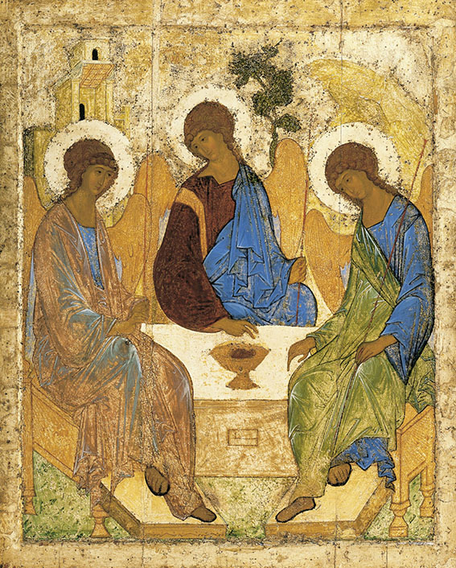

## **Klapbord**

**Andrei Roublev** is de tweede langspeelfilm van de Russische cineast Andrei Tarkovsky. Hij leefde van 4 april 1932 (Zavraje bij Moskou) tot 29 december 1986 (Parijs). Zijn laatste vier levensjaren bracht hij door in vrijwillige ballingschap in Italië. Hij stierf aan longkanker in een ziekenhuis in Parijs. Zijn graf bevindt zich op het Russische kerkhof aldaar. Wegens voortdurende tegenwerkingen door het regime van de Sovjet-Unie wilde hij niet meer werken in zijn moederland, Rusland.

>Door die tegenwerkingen kon hij slechts vijf langspeelfilms realiseren onder het communistische regime van de Sovjet-Unie: **Ivanovo Destvo** (Ivans Jeugd) (1962), **Andrei Roublev** (1966), **Solaris** (1972), **Zerkalo** (De Spiegel) (1975) en **Stalker** (1979). Daarna filmde hij in Italië en Zweden zijn laatste twee films, respectievelijk **Nostalghia** en **Offret** (Het Offer).

>Op zijn graf te Parijs beitelde de Russische beeldhouwer Ernst Neizvestny de woorden: ‘_Voor de man die de Engel zag._’ Dit verwijst naar het _diepreligieuze karakter en de uitzonderlijke spirituele uitstraling van Tarkovsky’s films_. 

>Dit geldt bij uitstek voor **Andrei Roublev**, zijn subliem meesterwerk en een hoogtepunt in de kunst van de cinematografie en de religieuze kunst van de twintigste eeuw. De film heeft zowel esthetisch als religieus een uitstraling die niet taant.

## **Synopsis**

Andrei Roublev is de drieëntwintig jaar jonge monnik-schilder. Hij heeft een uitzonderlijk talent voor het schilderen van iconen. Op zekere dag verlaat hij het _Triniteitsklooster_ waar hij heeft gewerkt, begeleid door zijn oudere medebroeder, de monnik-schilder Kyrill en zijn geestelijke mentor, de monnik Daniël. 

>Ze gaan een schilderopdracht uitvoeren in de nieuwe _Annuniciatiekerk_ te Moskou. Hij wordt tevens persoonlijk gevraagd om mee te werken met de zeer gerespecteerde, buitenlandse iconenschilder _Theofaan De Griek_. Die uitnodiging, teken van grote waardering van de grootmeester, wekt de jaloezie op van zijn oudere medebroeder-schilder _Kyrill_. Die verlaat daarvoor zelfs het klooster. 

>In de loop van de jaren komt Andrei ook in conflict met zijn mentor, de monnik _Daniël_. Hij blijkt bobendien een heel andere visie te hebben over de betekenis van iconen in de kerken dan Theofaan De Griek. Het conflict tussen Andrei en Daniël escaleert. In die breuk staat de schildering van _Het Laatste Oordeel_ centraal, een tafereel dat Andrei weigert te schilderen. Het tafereel moet volgens de kerkelijke en theologische voorschriften, aldus Daniël, de gelovigen angst voor de hel inboezemen en hen aldus tot een vroom leven aansporen. Andrei weigert echter te schilderen.

>Tijdens zijn voettochten naar de diverse kerken heeft hij immers het gewone volk leren kennen. Hij heeft gezien hoe het wordt vernederd en lijdt. Het gaat immers al vele decennia lang gebukt onder het juk van de Mongoolse Tartaren die met de regelmaat van een klok het opgeslagen voedsel komen roven. Andrei maakt aan de lijve _de belegering en plundering van de stad Vladimir_ mee. De Tartaren terroriseren de bewoners en plunderen de kerk, de schuilplaats voor het angstige volk.

>Tijdens die belegering beschermt Andrei een jonge vrouw over wie hij zich al een tijdje ontfermt. Ze is doofstom, heeft geen naam en geen bezittingen. Ze bezit een heilige onschuld. De bescherming van _de onschuldige_ vormt nu Andrei’s prioriteit. 

>Door getuige te zijn van het lot van het gelovige volk, van de plundering van de kerk en de verbranding van de iconen, beslist Andrei net zoals de anonieme onschuldige niet meer te spreken en ook niet meer te schilderen. Ondertussen zorgt hij in het _Andronikovklooster_ voor de onschuldige. Dat is niet vanzelfsprekend. Door de terreur van de Tartaren kampt ook het klooster met een nijpend tekort aan voedsel. Wanneer de Tartaren ook de kloosterlingen zelf komen vernederen, weten ze de onschuldige te verleiden met kleding en vlees. Ze rijdt uit eigen wil weg uit het klooster op de rug van het paard van de leider van de Tartaren. Ondertussen is Kyrill uitgehongerd teruggekeerd naar het klooster. Vol berouw smeekt hij de ouder geworden Andrei zijn zwijgen te doorbreken en opnieuw te gaan iconen schilderen.

>Wanneer Andrei op zekere dag met een kar volgeladen met verse groenten in de buurt van de nieuwe hoofdstad Moskou komt, ziet hij de jonge _Boriska_, de zoon van een overleden klokkengieter, aan het werk. Andrei beslist om zijn stilte te doorbreken en samen met de jongen mee te werken aan de wederopbouw van het centrum van het zich herstelde christelijke Rusland, het _Triniteitsklooster_ nabij Moskou. De jongen zal klokken gieten, Andrei iconen schilderen.

## **Cinematografie**

**HISTORISCH EN EPISCH FRESCO**. De film is niet in de volle zin van het woord een historische film. Het is zeker geen biografische film want iedere verwijzing naar de geboorte en kindertijd, en de ouderdom en het overlijden ontbreken. Bovendien zijn er over de _historische monnik-schilder Andrei Roublev_  bijzonder weinig historische gegevens bekend. Op basis van de weinige data kunnen we met enige zekerheid zeggen dat Andrei Roublev leefde van _circa 1370 tot circa 1430_. 

>Een anonieme kroniekschrijver, een tijdgenoot van Roublev, vermeldt Roublev en Daniël als spirituele broeders die zich met passie hebben gewijd aan de prachtige iconen van de nieuwe hoofdkerk van het _Triniteitsklooster in Sergei Posad_, nabij Moskou (vandaag de _Troitse-Sergieva Lavra_ of ‘_het Klooster van de heilige Triniteit en de heilige Sergei_’ genoemd, het centrum van de Russische Orthodoxie; het klooster werd door de regering van de Sovjet-Unie gesloten in 1918 en heropend in 1946. 

>De film **Andrei Roublev** van Tarkovsky opent met Andrei die het Triniteitsklooster verlaat om in de stad Moskou iconen te gaan schilderen en de film eindigt op het ogenblik dat Andrei beslist iconen te zullen schilderen voor de nieuwe hoofdkerk van het Triniteitsklooster. Daar realiseerde hij immers zijn sublieme _Triniteitsicoon_. Dat staat centraal in de _epiloog_ van de film. Tussen het midden van de zestiende eeuw en het begin van de twintigste eeuw was het werk van Roublev echter helemaal vergeten. Rond de eeuwwisseling begon men werk te maken van de restauratie van oude, Russische iconen. Zo werd de _Triniteitsicoon_ van Andrei Roublev herontdekt, de enige icoon die met zekerheid aan hem wordt toegeschreven. Het meesterwerk van de oud-Russische schilderkunst wordt heden bewaard in de [State Tretyakov Gallery](https://www.tretyakovgallery.ru/en/) in Moskou. 

>Pas in 1988 werd de historische Andrei Roublev _heilig_ verklaard door de Russische Orthodoxe Kerk naar aanleiding van het eerste millennium van het christendom in Rusland (988-1988). Hij is hiermee de _enige heilge kunstenaar van alle christelijke kerken_.

>Via het portret van de historische Roublev schildert Tarkovsky ook _een portret van het Russische volk_ in het begin van de vijftiende eeuw. In die periode is nadien voorgesteld als de tijd van de _Russische renaissance_. Het betreft een kantelmoment waarin Rusland van zijn middeleeuwen overgaat in een nieuwe tijd met Moskou als nieuw centrum. 

>Roublev bevond zich inderdaad in _een erg chaotische overgangstijd_ waarin niemand kon voorzien hoe de toekomst er verder zou gaan uitzien. Het was een tragische scharnierperiode in de grote geschiedenis van Rusland. Die periode begon wanneer het eerste, grote historische tijdperk van Ruslands geschiedenis, die met _Kiev_ als centrum, gedurende de dertiende eeuw helemaal ten onder ging. Dat gebeurde door _de bijzonder wrede en ongenadige strooptochten van de nomadische Mongoolse Tartaren_ van Dzenghis Kahn en zijn opvolgers. Zo een tweehonderd jaar lang moesten de Russen zien te overleven in de wouden van het noorden en het oosten. Eén van de voornaamste oorzaken van deze apocalyptische tijden waren de _onderlinge vetes en broedertwisten_ die de Russische Kievnatie verlamden. De onderlinge verbondenheid ontbrak. De talrijke oproepen van de kerkelijke overheid, de metropolieten van Kiev, om _de interne broederstrijd_ op te geven, haalden niets uit. Tarkovsky heeft die historische basisgegevens verwerkt in zijn film over _het einde van de veertiende en het begin van de vijftiende eeuw_, de periode waarin zich in alle opzichten de wedergeboorte van het christelijke Rusland aankondigde. 

>De historische held die Tarkovsky in **Andrei Roublev** op het voorplan plaatst, is echter geen militair, geen prins, maar _een monnik-kunstenaar_. De regisseur wil geenszins zelf de witte vlekken van de biografie van Roublev invullen. Hij beperkt zich tot de weinig bekende gegevens en concentreert zich op de historische omstandigheden vanuit de optiek van de historische Roublev en de religieuze en spirituele traditie van waaruit hij heeft geleefd en gewerkt. Die traditie gaat terug op de _heilige monnik Sergei van Radonezh_ die eind veertiende eeuw stierf. Zijn religieuze en spirituele beweging stond in het teken van _het geloof in de Triniteit_ (de mystieke gemeenschap van Vader, Zoon en Geest). Ofschoon de heilige Sergei als een kluizenaar leefde in de ondoordringbare wouden van Rusland, trok hij door zijn charismatische persoonlijkheid toch veel monniken aan. Hij stichtte daarom _het historische Triniteitsklooster_ in de nabijheid van Moskou. Zijn leerlingen stichtten daarna diverse kloosters, een ervan is _het Andronikovklooster_ in Moskou. De eerste abt ervan was de heilige _Andronik_, een leerling van de heilige Sergei van Radonezh. 

>Vandaag is het voormalige klooster het _Andrei Roublev Museum_ van de oud-Russische kunst. Andrie Roublev is de meest beroemde monnik van het klooster geweest. Het was zijn fysieke en geestelijke thuisbasis, ook al zal hij veel tijd hebben doorgebracht in het centrale Triniteitsklooster. Tarkovsky schetst in _zijn historisch fresco_ van iets meer dan drie uren vooral hoe Roublev, gevormd in de geest van de Triniteit volgens de heilige Sergei, de situatie van het lijdende volk in zich opneemt en verwerkt in zijn unieke iconen, in het bijzonder in die van zijn meesterwerk, _de Triniteit_. 

>Tarkovksy brengt Roublevs iconen tot leven in de _epiloog_ van de film. Hij maakt er een drieluik van, bestaande uit iconen die aan Roublev en zijn Moskouse school worden toegeschreven met in het middenluik de _Triniteitsicoon_.

**TOESCHOUWERSCHAP IN TWEEVOUD**. Wie **Andrei Roublev** bekijkt vanuit de verwachtingen die het genre van de historische film schept, raakt gefrustreerd en zelfs geërgerd. Dat was bijvoorbeeld het geval bij de Russische schrijver Alexander Solzhenitsyn, Nobelprijswinnaar voor literatuur in 1970 en internationaal bekende dissident van de Sovjet-Unie. Hij wees de film van Tarkovsky af met de woorden ‘_een onmogelijke lange film met extra episodes die het hoofdverhaal niet ondersteunen_’, zoals geciteerd door Robert Bird in zijn Engelse studie voor het British Film Institute, _Andrei Rublev_ (London, 2004, 37). 

>In zekere zin frustreert de film bewust de verwachting van de toeschouwer. Bij het zien van een film over de belangrijkste schilder van Rusland, verwacht die toeschouwer allerlei scènes en sequenties met het hoofdpersonage die aan het schilderen is. Dat gebeurt dus niet. Tarkovsky heeft dat bewust zo gewild. Zijn **Andrei Roublev** is inderdaad _een episch fresco over een schilder die niet schildert_. Er is slechts één korte scène waaruit blijkt dat Roublev een schilder is. Hij bereidt duidelijk de schildering van een icoon voor. 

>Het motief van Tarkovsky om het historische kunstenaarsportret atypisch uit te werken, betreft _het toeschouwerschap_. Dat bepaalt op _twee niveaus_ het meesterwerk. Op _het narratieve niveau_ portretteert Tarkovsky zijn historisch hoofdpersonage als een toeschouwer. Andrei Roublev treedt het verhaal binnen op het ogenblik dat hij, in het gezelschap van Kyrill en Daniël, op weg gaat naar een nieuwe opdracht. De jonge monnik verlaat voor het eerst de veilige wereld van het klooster en treedt binnen in de voor hem ongekende wereld buiten het klooster. Als volleerd iconenschilder beschikt hij over een sterke blik. Die begeleidt hem nu, niet zozeer om de muren van nieuwe kerken te beschilderen, maar om de nieuwe wereld die hem verschijnt, in zich te absorberen. 

>Reeds in de eerste episode ― _De nar. Zomer 1400_ ― ziet Andrei Roublev de wereld rondom hem met nieuwe ogen. Voor een onweer gaan de drie monniken schuilen bij de boeren. Een nar vermaakt hen in ruil voor wat eten. Andrei neemt alles aandachtig in zich op en ontdekt dat de monniken bij monde van Kyrill zich distantiëren van het gewone volk en de nar, een volkskunstenaar die al zingend en dansend zijn publiek vermaakt. Andrei ziet ook hoe Kyrill de nar verraadt bij de gewapende ruiters, zij die in opdracht van de regerende Groot-Hertog de orde handhaven. De jonge monnik stelt vast dat hij, als monnik, tegenover het volk en zijn kunstenaar staat en zich dus aan de kant van de heersers bevindt. Dit zet hem aan het denken. Vanaf die eerste episode treedt hij binnen in _de nieuwe wereld van het beeldend denken_. Dat denken is een nieuwe wijze van kijken naar het leven waarvan hij deel uitmaakt maar waarvan hij de betekenis en de draagwijdte in het klooster nooit heeft leren zien. Het beeldend denken leidt hem binnen in _de nieuwe leerschool, die van het reële leven_. Op het ritme van zijn verdere tocht waarbij hij regelmatig terugkeert naar zijn thuis, _het Andronikovklooster_, leert hij in de school van het leven _het lijden van het volk_ door en door kennen tot hij er zich mee gaat identificeren. Dat gebeurt door de komst van _de onschuldige, jonge vrouw_ die het lijden van het volk belichaamt: stom en doof gemaakt, weerloos zonder enig bezit. 

>In de laatste episode ― _De klok-Zomer-herfst-winter-lente 1423-1424_ ― ziet de oudere Andrei Roublev de nar, de volkskunstenaar terug. Hij is gemarteld tijdens zijn gevangenschap. Tegelijkertijd ontdekt Andrei een nieuwe gestalte van de volkskunst: _de jonge klokkengieter Boriska_. Hij is een wees wiens vader een gekende klokkengieter was. Om te ontsnappen aan de dood van honger, slaagt hij erin om zich te laten aanwerven door de gezanten van de Groot-Hertog als de nieuwe klokkengieter, de opvolger van zijn vader. Daartoe liegt hij wanneer hij de gezanten vertelt dat zijn vader hem op diens sterfbed het geheim van het klokkengieten heeft verklapt. Andrei volgt zwijgend maar met een scherpe blik hoe de jonge Boriska vanuit zijn wil om te overleven en vanuit zijn intuïtie, gevoed door de herinneringen aan zijn vader, erin slaagt een klok te gieten. Vanuit die schouwing van het leven zelf beslist Andrei Roublev zijn zwijgen te verbreken en opnieuw iconen te gaan schilderen. Die iconen zijn _de historische iconen die Tarkovsky tijdens de epiloog in kleur_ toont. 

>Met andere woorden, de regisseur schildert zelf het portret van zijn hoofdpersonage in zwart-wit als een _leerproces_. Hij toont welke fasen Andrei Roublev moet hebben doorlopen in zijn eigen tijd om tot de creatie te kunnen komen van de iconen, waaronder _de Triniteitsicoon_, waarvan slechts een deel de lotgevallen van de geschiedenis hebben overleefd. Tarkovsky focust dus niet op de evocatie van historische feiten op zich, maar op de in de eigen tijd gewortelde levenshouding van de historische Roublev. Het inzicht in die levenshouding helpt inzien _vanuit welk artistiek vermogen en visie de reële, overgeleverde iconen zijn voortgekomen_. 

>Meteen vormt dit _het tweede niveau van het toeschouwerschap_ dat het meesterwerk van Tarkovsky typeert. Op dat niveau staat _de toeschouwer die de film ziet_, op de voorgrond. De regisseur heeft de film inderdaad gemaakt met het oog op de toeschouwer. De verschillende episodes van het verhaal, samen met de proloog en de epiloog, zijn bedoeld om de toeschouwer in _een bepaalde denk- en kijkhouding_ te brengen. Die houding, eigen aan het toeschouwerschap, is vereist om op het einde de iconen van Roublev vanuit de juiste blik te kunnen bekijken. Het hoofdpersonage Roublev die zijn leerschool van het leven doorloopt, vormt de leidraad voor de toeschouwer van de film. Het blikveld van het hoofdpersonage bouwt het blikveld van de toeschouwer op. De verschillende episodes brengen die laatste in _de juiste contemplatieve houding_, die van _het beeldend denken_, om aldus de betekenis en de draagwijdte van Roublevs bewaarde en gerestaureerde iconen op gepaste wijze te kunnen aanschouwen. 

>Dat toeschouwerschap is geënt op de iconenkunst van Roublev zelf. De iconen, met _de Triniteitsicoon_ als de standaard, beoefenen zelf het toeschouwerschap. De volledige icoon werkt als een oog, nog versterkt door de unieke blik van de geschilderde personages. Het zijn ogen gericht naar de toeschouwer. Hun blik dringt door tot in zijn gemoed. Sinds het begin van vorige eeuw duiden kunsttheoretici die unieke werking van de iconen met de term ‘_het omgekeerde perspectief_’. Dat houdt in dat het snijpunt van het blikveld niet in het beeld zelf ligt, maar in de toeschouwer die het bekijkt. Het blikveld van de icoon betrekt de levende toeschouwer in zijn eigen beeldruimte. Hiermee wordt het schouwen van een icoon, geschilderd in de lijn van Andrei Roublev, een spirituele ontmoeting. De toeschouwer overstijgt zijn voyeurisme en ontdekt in die ontmoeting de sleutel tot zijn eigen vermogen van het toeschouwerschap. 

>Kijken verandert in schouwen. De Russische priester-filosoof-kunsttheoreticus en moderne wetenschapper, _Pavel Florensky_ (1882-1937), vermoord door Stalins Sovjetregime, leende de term ‘_het omgekeerde perspectief’ (die umgekehrte Perspektive/the reverse perspective)_ van de Duitse kunsttheoreticus _Oskar Wulff_. Die ontwikkelde in 1907 het concept in zijn studie over de vormgeving van de ruimte in de Oud-Byzantijnse kunst. Wulff zelf leende de term  de Russische kunstgeleerde _Dimitry Ainalov_. Die introduceerde circa 1900 de term ‘_het omgekeerde perspectief_’ vanuit zijn eerder negatieve visie op de eigenheid van de Byzantijnse iconenkunst. Die zou volgens Ainalov voort zijn gekomen uit een gebrek aan artistieke vaardigheden bij de iconenschilders. Wulff daarentegen herijkte de term in een _positieve_ zin. Hij bakende de unieke eigenheid van de Byzantijnse iconenkunst af tegenover die van _de westerse renaissancekunst_. Kenmerkend voor die kunst is _het geometrische perspectief_, in Oud-Griekenland en het Romeinse Rijk vooral werd beoefend in de decorbouw en de architectuur. De architecten en de kunstenaars van de Renaissance werkten dat perspectief verder uit. In dat westerse en geometrische perspectief ligt het snijpunt altijd in het beeld zelf. Het kenmerkt _de westerse voyeuristische houding_ tegenover de werkelijkheid van de ruimte en de dingen. 

>Maar het is Florensky die de _positieve_ betekenis van het omgekeerde perspectief van Wulff verder uitwerkte. Hij liet zien dat vooral de schilders van de Russische iconen, voortgekomen uit _de Moskouse school van Andrei Roublev_, de kunst van het omgekeerde perspectief zeer bewust en op een geniale manier hebben ontwikkeld en uitgewerkt. 

>Op die constructieve visie van Florensky ent Andrei Tarkovsky zijn **Andrei Roublev** en zijn cinematografische beschouwing van Roublevs Triniteitsicoon. In zekere zin toont Tarkovsky in de _modus van het beeldend denken_ nog meer dan Florensky in de modus van het theoretische denken aan dat de Russische iconenkunst van Roublev zich op een unieke manier onderscheidt van de Byzantijnse. Dat verklaart waarom de regisseur in de film een belangrijke episode inlast, _De passie van Andrei_, waarin Andrei Roublev theologisch en spiritueel afstand neemt van de visie van _Theofaan De Griek_. Roublev introduceert de eigen Russische iconenkunst door zich te distantiëren van die van Theofaan De Griek, de vertegenwoordiger van de Byzantijnse traditie. Tarkovsky zelf transponeert op zijn manier die originele visie van de historische Roublev naar de nieuwe kunst van de cinematografie, een kunst die volgens de Orthodoxe Kerk zelf helemaal niet geschikt is als religieuze kunst.
  
**TRINAIRE COMPOSITIE.** Eén van de belangrijkste esthetische sleutels van **Andrei Roublev**, is de _trinaire_ compositie. Trinair staat hier tegenover binair. 

>Tarkovsky ontleent zijn drieledige benadering aan de historische, religieuze beweging van en rond _de heilige Sergei_, vereeuwigd in onder andere _de Triniteitsicoon_ van de historische Roublev. Deze unieke icoon vormt de muze én de hoeksteen van de film. Dat blijkt uit _de drieledige beweging van de film_ in zijn geheel alsook in het iconendeel van de epiloog. Wat de hele film betreft blijkt de drieledigheid uit de momenten van de aarde in zwart-wit, de iconen en het slotbeeld met de aarde in kleur. In het iconendeel komen drie iconen volledig in beeld: _de Pantocrator, de Triniteit en de Verlosser_. Zij worden met elkaar verbonden via fragmenten van andere iconen. _De Triniteit_ vormt het middenstuk waarop de camera inzoomt. 

>In het iconendeel monteert Tarkovsky op de klankband _driemaal_ de donder, het hanengekraai en het klokkengelui. In het zwart-wit gedeelte, het grootste deel van de film, is _het trinaire principe_ ook werkzaam. Het portret van het hoofdpersonage kent immers _een drieluik_: de monnik van het Andronikovklooster, en zijn alter-ego’s, de anonieme onschuldige en Boriska.

> _Het trinaire portret van Roublev_ krijgt nog _een tweede drieluik_ via de drie monniken Andrei, Kyrill en Daniël. Met hun drie openen ze de eerste episode van het verhaal. Ze vertegenwoordigen de wereld van het orthodoxe klooster. Het beeld van de machthebbers is eveneens _trinair_ opgebouwd: de Groot-Hertog, diens broer en het hoofd van de Tartaren. Vanuit de optiek van de volkskunstenaar vormen de nar, Andrei en Boriska ook een betekenisvol _drieluik_. Tot slot, ook de wereld van de iconenschilders verschijnt _in drievoud_: Andrei Roublev, Theofaan De Griek en Kyrill. 

**VAN ZWART-WIT NAAR KLEUR.** Het grootste deel van **Andrei Roublev** is in zwart-wit. Dat geldt voor proloog met de ballonvaarder en de verschillende episodes.

>Alleen het iconendeel met het slotbeeld, samen de epiloog van de film, zijn in kleur. Het zwart-wit deel vertegenwoordigt _de wereld van het reële leven_. Daar maken de monniken met hun klooster deel van uit. Dat geldt uiteraard voor de boeren en hun families, de Russische machthebbers en de buitenlandse indringers. De iconen vertegenwoordigen _de wereld van de kunst met hun hemelse kleuren en figuren_. Dat laatste impliceert niet dat ze zich boven de gewone wereld van de stervelingen bevinden. Tarkovsky laat daarover geen twijfel bestaan. 

>Vanuit de kleurrijke wereld van de iconen keert hij in het slotbeeld terug naar de aardse wereld, de grote scène waar zich het reële leven afspeelt. _De kleurrijke iconen vormen de zon wiens licht en warme op het aardse leven schijnen_. Zij geven aan dat aardse leven een nieuwe, kleurrijke dimensie.

>_De overgang_ van het zwart-wit gedeelte naar de epiloog met iconen in kleur gebeurt bijna ongemerkt en dus vanzelfsprekend in de scène waarin Andrei zijn zwijgen verbreekt en beslist om met Boriska samen te gaan werken in dienst van het herop gestane volk. Na het moment waarop Andrei zijn scheppingsverbond met Boriska heeft gesloten, zoomt de camera in op de bevuilde kleren van Boriska die, na het gieten van de klok en de inzegening ervan, neerzit in de modder, de vruchtbare aarde in de schoot waarvan hij zopas de klok heeft gegoten. Dan gaat het beeld over naar het brandhout dan nog nasmeult. Dat beeld krijgt geleidelijk een lichtrode kleur die herinnert aan het vuur dat Boriska heeft ontstoken om het edel metaal te kunnen doen smelten. Tegelijkertijd valt dat beeld via een overvloeier samen met het eerste beeld van het iconendeel. Het betreft namelijk nog een onherkenbaar detail uit een van de iconen die geleidelijk aan in beeld komen. 

>Tarkovsky beschrijft dus een drieledige beweging. Ze begint bij de aarde op de plaats van het nasmeulende hout, gaat vervolgens over naar de iconen en keert van daaruit terug naar de vruchtbare aarde waar op een eiland in een stroom paarden staan te grazen in de lenteregen. 

**BEELDMOTIEVEN.** Dat Tarkovsky het beeldend denken uitmuntend beoefent in zijn **Andrei Roublev**, blijkt uit zijn creatie van _diverse visuele beeldmotieven_. Die krijgen _een menselijke gestalte_ in de figuren van Andrei, de monniken, de ballonvaarder, de nar, de onschuldige, Boriska, de machthebbers. De beeldmotieven kunnen ook _dingen_ zijn: de rivier, de boom, de modder, de regen, de appels, het vlees, het ijs, het kerkgebouw, de klok, enzovoort. 

>Een van de meest eigene beeldmotieven van de film zijn _de dieren_: de zwaan en vooral het paard, in casu _het beeld van het zwarte paard_. Het is mogelijk om **Andrei Roublev** alleen al te bekijken vanuit zijn _eigenzinnige en tevens complexe iconografie van het zwarte paard_.

>>**INTRODUCTIE VAN HET ZWARTE PAARD.** In _het openingstafereel met de ballonvaarder_ last Tarkovsky het beeld in van de kudde paarden die vrij draaft over het onbegrensde land. Wanneer de ballonvaarder echter is neergestort en het tafereel zijn eindpunt bereikt, ensceneert Tarkovsky die slotsequentie met een beeld in slow motion van een vrij zwart paard. Het dier ligt op de grond, op zijn rug. Het tracht moeizaam recht te komen. Uiteindelijk slaagt het daarin. Dan loopt het rustig weg van de onfortuinlijke ballonvaarder. 

>>**INSTRUMENT VAN MACHT.** Het beeldmotief van het _vrije, zwarte paard_ contrasteert met het beeld van de andere paarden in de film. Binnen de verhaalstructuur verschijnen die paarden als de levende instrumenten van de niets ontziende machtigen. In het tafereel met de zingende en dansende volkskunstenaar, een rondtrekkende nar, die voor wat eten de ongeletterde boeren vermaakt met een zowel obscene als rebelse opvoering, verraadt monnik Kyrill de kunstenaar. De manschappen van de Groot-Hertog houden hem aan, slaan hem bewusteloos tegen een boom en voeren hem in gevangenschap weg op hun paarden.

>>**OBJECT VAN WREEDHEID.** _In de epische episode van de belegering van de stad Vladimir_ komt de Tartaarse leider nooit van zijn paard. Met de hulp van de troepen van de Russische verrader, de broer van de Groot-Hertog en tevens diens rivaal, plunderen, verkrachten, verwoesten, moorden, verbranden de Tartaren zonder genade. Tijdens de belegering verschijnt plots _het vrije, zwarte paard_. Geen ruiter bereidt het. Vanwaar het komt, bij welk kamp het hoort, dat speelt geen rol. Het dier is helemaal alleen en duidelijk op de vlucht voor het geweld dat mens noch dier spaart. Het verkeert in paniek, want het wil weg uit de brandende stal waar het zich bevindt. Het zoekt een uitweg via een kleine, steile trap. Dat lukt niet, het dier struikelt en valt naar beneden. Het bezeert daarbij zijn achterste poten. De camera zwenkt even naar rechts: Tartaarse soldaten hebben daar een Russische vrouw verkracht. Dan beweegt de camera terug naar het gekwetste paard. Ondertussen heeft het geprobeerd recht te staan en enkele stappen vooruit te zetten, maar het zakt door zijn gebroken achterpoten, maakt een rugwaartse tuimeling en valt weerloos neer. Op dat ogenblik komt er een soldaat met een lans voorbij en maakt het dier af. 

>>**HET KERKGEBOUW.** Daarna monteert Tarkovsky het eerste beeld binnen in _het kerkgebouw_. Bij de laatste buitenbeelden met het zwarte paard bereidt Tarkovsky de overgang naar beelden binnen de kerk voor via de klankband. Daar weerklinkt de koorzang van het angstige, maar biddende, gelovige volk. Met een klagende, bijna wenende stem wachten ze bang het moment af waarop de Tartaren de kerkdeur zullen openen. Die audiovisuele collage vormt samen een krachtig reflectief beeld. De schreeuw van het weerloze paard voegt zich bij het klaaglied van het belaagde Russische kerkvolk en omgekeerd.

>>**HET GELUID VAN DE TRAGIEK.** De beeldovergang van het zwarte paard naar het kerkvolk sticht een betekeniswereld die de toeschouwer alleen via het beeldend denken kan betreden. Tarkovsky verdicht ermee het _tragische lot van de stad_ in de laatste sequentie met het zwarte paard en maakt ervan de sleutel waarmee hij de sequentiereeks opent van de kerk met de plundering van het gebouw, het uitmoorden van de gelovigen, het folteren van de koster, het bespotten en verbranden van de iconostase. Die beeldspraak van de tragiek vervolgt in de slotsequentie binnen in de kerk. Het sneeuwt binnen in de kerk, alleen Roublev, de onschuldige vrouw en een zwart paard komen in beeld. Zij vertegenwoordigen de achtergebleven overlevenden. Met het beeld van het figurentrio krijgt de stem van de tragiek het geluid van de stilte. 

>>**DE SCHULDIGE REDDING VAN DE ONSCHULDIGE.** Roublev heeft tijdens de plundering van de kerk een jonge vrouw gered uit de handen van een Russische soldaat. Hij heeft de man met een bijl gedood. De onschuldige was weerloos. Roublev ontfermt zich over haar waardoor hij zondigt. Een medemens vermoorden, dat ervaart Roublev als een grote schuld ook al heeft hij dit gedaan om de onschuldige te redden. Op het einde van de sequentie in de kerkruïne met sneeuw belooft hij niet meer te zullen schilderen en geen woord meer te zeggen. Uit boetedoening zwijgen, als kunstenaar én als mens. 

>>**DE TERUGKEER.** En dan komt opnieuw een ander zwart paard de kerk binnengestapt. Niemand leidt het. Een van de Tartaren heeft het voordien uit de kerk gejaagd nadat de folteraars van de koster de man eerst met zijn voeten aan het paard hadden vastgeknoopt. Voordien hadden ze de koster de mond gesnoerd door vloeibaar, kokend metaal in zijn keel te gieten. Het zwarte paard keert terug naar de kerk en brengt de herinnering mee aan de wrede terechtstelling van de trouwe koster die weigerde de plaats van de kerkschatten te verraden. 

>>**BEELDEN WAARVOOR GEEN WOORDEN ZIJN.** Het figurentrio in de vernielde kerk ― _Andrei, de onschuldige, het zwarte paard_ ― vertolkt _de diepe tragiek van het grote lijden_ van al die anonieme mensen die het volk vormen. Vooral _de vrouwen_ ondergaan die tragiek. Terwijl Andrei in de verwoeste kerk mediteert over het gebeuren, kijkt hij naar de onschuldige die bezig is het haar te vlechten van een vermoorde vrouw. Deze lijkt wel de zuster van de onschuldige te zijn, want ze hebben dezelfde gevlochten haren. Met dit beeld voor ogen vraagt Roublev: ’_Rusland verdraagt altijd het lijden en zal dat blijven doen. Maar hoelang nog?_’ De monnik-kunstenaar Andrei doorleeft _de tragiek van de geschiedenis_. Hij engageert zich vanuit dit besef van het tragische en identificeert zich met het stom gemaakte volk, object van wreedheid, subject van onmeetbaar lijden. 

>>**EPILOOG VAN VRIJHEID.** In het slotbeeld verschijnen vier paarden die vrij grazen zonder enig spoor van hun ruiters. 

## **Betekenisruimte**

**KUNST AAN DE OVERZIJDE VAN DE IDEOLOGIE.** Met **Andrei Roublev** doet Tarkovsky meer dan een collectieve herinnering in beeld brengen. Hij beoefent op de scène van de collectieve herinnering aan Andrei Roublev _het beeldend denken_ op een hoogst persoonlijke en intensieve manier. Daarbij mediteert hij over de betekenis en de draagwijdte van kunst in de menselijke beschaving. Die meditatie houdt hij in de context van de Sovjet-Unie waar de kunst werd opgeëist in dienst van de verspreiding van _de communistische staatsideologie_. 

>Tegelijkertijd steunt Tarkovsky op _de herinterpretatie van het Russisch-Orthodoxe christendom_, verdicht in de iconen van Andrei Roublev, zelf een exponent van  _de Triniteitsbeweging rond de heilige Sergei van Radonezh_. Tarkovsky put voor zijn beeldrijke  herinterpretatie uit de traditie van Russische auteurs als _Leon Tolstoi, Fjodor Dostojevski, Pavel Florensky en Nicolai Berdyaev_. Allen droegen ze bij tot _een herlezing van het Russisch-Orthodoxe christendom in dialoog met de moderne, democratische ontwikkelingen in de Europese filosofie en wetenschap_. 

>Met zijn **Andrei Roublev** bracht Tarkovsky die traditie van de tweede helft van de negentiende en de eerste helft van de twintigste eeuw terug aan de oppervlakte. Hij deed dit op het ogenblik dat ze was ondergesneeuwd door de agressieve, atheïstische staatsideologie van de Sovjet-Unie. In **Andrei Roublev** stelt hij zijn personage van de kunstenaar, de monnik-schilder Roublev, tegenover twee vertegenwoordigers van een _ideologisch blikveld_ op de werkelijkheid van het leven. 

>Het zijn _Theofaan De Griek en de monnik Daniël_. Bij de eerste, de buitenlandse iconenschilder die de kunst van de iconen uit Byzantium naar Rusland brengt, primeert _de ideologische visie op kunst_ in het algemeen en die van de iconen in het bijzonder. Voor Theofaan De Griek is de kunst hemels en transcendent. Zij keert zich af van de verwerpelijke wereld van de mensen. Dat zijn toch maar zondaars die het hemelse en het verhevene van de religie in en door hun gedrag verloochenen. De mannen en de vrouwen die het volk uitmaken, verdienen eigenlijk niet dat God in de gestalte van Jezus Christus voor hen aan het kruis is gestorven. De Griek formuleert zijn afwijzende visie op het lijdende volk tegenover Andrei. 

>De jonge monnik distantieert zich echter radicaal van dergelijke visie. Dat gebeurt in de episode _De passie van Andrei_. Het woord ‘passie’ verwijst hier naar het evangelische passieverhaal. De monnik Daniël spreekt en handelt ook ideologisch. Hij belichaamt _de geestelijke macht van de Orthodoxe Kerk_. Hij wijst Andrei terecht wanneer die niet wil schilderen wat hem vanuit de kerkelijke overheid wordt opgedragen. Dat betreft vooral het tafereel van _het Laatste Oordeel_. 

>Daniël handelt als een kerkelijke ambtenaar. Hij denkt en treedt op in dienst van de machthebbers zonder nog daarover vragen te stellen. Hij is uitvoerder en een bewaker van _de geldende Ideologie_. Zowel Theofaan De Griek als Daniël zorgen voor _de impact van de heersende Ideologie in het dagelijkse leven_. Ze leggen als het ware een zwaar kleed over het bestaande leven van mensen en dingen. Ze denken binair. Ze delen alle fenomenen en gebeurtenissen op volgens _het strakke dualistische schema van goed versus kwaad, toegelaten versus verboden, wit versus zwart,  hoog versus laag, man versus vrouw, clerus versus leek_. 

>Andrei Roublev aanvaardt dat hardnekkige, traditionele dualisme niet. Hij zoekt een weg om het te overstijgen. Hij volgt zijn _levensbeschouwelijke weg in de school van het reële leven_. Hij gaat in de tragiek ervan staan, de tragiek waarvoor _het binaire dualisme_ blind is. Zo herontdekt hij via de ontmoetingen met de volkskunstenaar, de onschuldige, en Boriska _de trinaire bron van zijn religieuze beleving_ en van _het Russisch-Orthodoxe christendom van de heilige Sergei van Radonezh_.

**DE CHRISTELIJKE IDENTITEIT.** Tarkovsky vond in een meditatief en biddend bezoek aan de _Triniteitsicoon in het State Tretyakov Gallery_ in Moskou de inspiratiebron voor zijn film **Andrei Roublev**. 

>De Russische cineast benadert de icoon niet als een kostbaar museumstuk. Hij beschouwt het als een religieus kunstwerk dat voortgekomen is uit de levende beweging van het Russische volk en zijn Kerk. _De Triniteitsicoon_ maakte oorspronkelijk deel uit van de iconostase van de kerk van het Triniteitsklooster in Sergei Posad, de bakermat van de Russische Orthodoxie en bijhorende spirituele beweging. Van belang is dat Tarkovsky niet vertrokken is vanuit een theologische Idee of Dogma of Leer. 

>>**BELICHAMING.** Het unieke van de _Triniteitsicoon_ kan nooit worden gereduceerd tot een of andere Theorie van welke aard dan ook. Geschreven of gesproken woorden bezitten de kracht niet om de plaats van het Beeld in te nemen. Door de scheppende act waaruit ze is ontstaan, belichaamt de _Triniteitsicoon_ de levende religieuze spirituele beweging rond het christelijke geloof in de Triniteit, zoals het teruggaat op de heilige Sergei van Radonezh. 

>>**LEVENSBESCHOUWING.** In die beweging speelt _de levensbeschouwelijke beleving en interpretatie van het christelijke credo van de Menswording_ een hoofdrol. Opvallend daarbij is dat die levensbeschouwelijk stroming uitgaat van drie beeldende ankerpunten: _een oudtestamentisch verhaal, een nieuwtestamentisch verhaal en een levende mensheid_. 

>>**GENESIS.** Het _Genesisverhaal 18, 1-16_ beschrijft Gods aanwezigheid beeldend in de gestalte van drie engelen die op de aarde wandelen en aankomen bij de tent van Abraham en Sarah om te rusten. Het oudere en kinderloze koppel ontvangt hen zo gastvrij dat ze na het bezoek van de drie engelen de gave van de zwangerschap ontvangen. Andrei Roublev vertrekt van dat verhaal, een oorspronkelijk werk van het contemplatievermogen van een van de vele, anonieme auteurs van Genesis. Dat verhaal is een echte beeldende creatie. Het is geen Idee of Wet. Het verhaal ent zich op de werkelijkheid van het leven zelf: _de vruchtbaarheid_ van het koppel man-vrouw, hun liefde, hun huwelijk. En Gods aanwezigheid neemt de gedaante aan van _de hemelse Beschouwer_ die het leven op aarde, in het bijzonder de heiligheid van het menselijke leven, komt schouwen, waarderen en zegenen. 

>>**FEMINIENE HOUDING.** Andrei Roublev schildert de drie engelen terwijl ze uitrusten aan de tafel. De figuren van Abraham en Sarah zijn _afwezig_. Hun aanwezigheid in het verhaal wordt via _het omgekeerde perspectief_ ingenomen door _de levende toeschouwer_ die zo meezit aan de tafel. Het omgekeerde perspectief krijgt hierdoor _een feminiene, moederlijke open-barende houding_ wat verwijst naar de vruchtbaarheid, het zegel van de komst van de drie engelen. Andrei Roublev versterkt nog de feminiene dimensie via de personages van de drie engelen. 

>>**MENSWORDING.** Die schildert hij vanuit _het nieuwtestamentisch verhaal, aanwezig in de vier Evangelies, van de Menswording_. Tarkovsky verwijst naar het evangelische verhaal van de Menswording via _de figuur van de onschuldige vrouw_. Net zoals Maria in de Evangelies is zij iemand van de onderdrukte volk. Ze bekleedt geen maatschappelijke positie, integendeel. Ze heeft geen dak boven haar hoofd. Het lijden heeft haar sprakeloos en doof gemaakt. 

>>**HET PASSIEVERHAAL VAN JEZUS.** Tegelijkertijd schenkt Tarkovsky in de episode _De passie van Andrei_ aandacht aan _het Passieverhaal_, de hoeksteen van het nieuwtestamentische narratief. In die episode verdedigt het personage van Andrei Roublev dat verhaal van de Menswording tegenover de theoreticus Theofaan De Griek. Hij reduceert het verhaal tot een argument van een bewijsvoering. _Het Passieverhaal_ ‘bewijst’ volgens hem de schuld van het zondige volk dat alleen maar minachting en afwijzing verdient. 

>>**HET PASSIEVERHAAL VAN HET LIJDENDE VOLK.** Daartegenover plaatst Andrei _de beeldende betekenis van het Passieverhaal_. Er is de lijdensweg in regie van de machthebbers, terwijl het lijdensweg van Jezus ook die is van het gewone, onderdrukte volk zelf. In _de verbeeldende hervertelling van het Passieverhaal_ door het personage Roublev en regisseur Tarkovsky heeft de verschijning van Jezus de gedaante van een Russische boer. De lijdensweg zelf voltrekt zich in een Russisch sneeuwlandschap. 

>>**GEZIN.** Andrei Roublev plaatst in zijn _Triniteitsicoon_ de nieuwtestamentische Jezusfiguur in het midden aan de tafel. Dat betekent dat hij op één lijn zit met de levende toeschouwer. Tegelijkertijd vormt hij een gemeenschap met de twee andere personages van de Icoon: de Vader en de Geest. Alle drie vormen ze via _hun naar elkaar buigende houding een intense gemeenschap_, een Gezin. Hun verschijning kent _feminiene vormen_. Ze lijken niet op stoere, machtige en mannelijke heersers die op het punt staan _het Laatste Oordeel_ over mensen te gaan uitspreken. 

>>**LEVENSBOOM.** Via de aanwezigheid van de rots, de boom en het kerkgebouw betrekt Andrei Roublev ook het levende beeld van de eigen tijd en die van het lijdende, Russische volk, in het beeld zelf. De boom staat in het midden, ter hoogte van de Jezusfiguur. Het personage van de boom verwijst naar _de levensboom_ uit het Aards Paradijs, maar evengoed naar de ontelbare bomen die het Russische landschap vormen. 

>>**VISUELE ECHO IN KLEUR.** In de epiloog laat Tarkovsky zien hoe allerlei details in de iconen van Roublev verwijzen naar de lotgevallen van het Russische, lijdende volk. Die vormt de visuele echo in kleur van het drama van het volk in zwart-wit. Hiermee laat hij tegelijkertijd ook zien hoe hij vanuit die iconische details concrete scènes heeft opgebouwd. De iconen lijken in de epiloog _de artistieke spons te zijn dat het drama van het Russische volk en bij uitbreiding van de mens in zich heeft opgenomen_. 

>>**RELIGIEUZE BEELDRUIMTE.** Via de drieledige structuur met de drie grote iconen, _de Pantocrator, de Triniteit, de Verlosser_, kadert Roublev de fragmenten van de tragiek eigen aan het volk en de mensheid in de religieuze ruimte. In die structuur steekt ook een beweging die vertrekt bij de God als de Al-Beheerser (Pantocrator) om via de Triniteit dat beeld te corrigeren vanuit de Verlosser, de directe uitdrukking van de Menswording. 

>>**EEN ZONE VAN ZIN.** Die structuur van de montage van de epiloog is bij nader toezien _een akte van geloof_. Die _filmische geloofsakte_ wordt hier ervaarbaar als _een creatie van zingeving_ en wel in _de trinaire modus van de creatie van een zowel kunstzinnige als religieuze zone van zin_. 

## **Context**

Met zijn film **Andrei Roublev** positioneert Tarkovsky _de historische Triniteitsicoon van _ als _een blijvend paradigma van het bestaan van een originele christelijke kunst_. Tegelijkertijd affirmeert hij _de blijvende actualiteit van het trinaire beeldende denken in het naoorlogse Europa van de toekomst_. Dat doet hij via een eigen en unieke cinematografische verdieping van Florensky’s theoretische visie op de eigen Russische traditie van iconen, met _Andrei Roublevs Triniteit_ als referentiebron. 

>In die trinaire spiegel bevindt zich die toekomst aan _de overzijde van de ideologische disputen en tegenstellingen_. Tarkovsky wordt vandaag gezien als _een profeet_ die reeds in de jaren zestig van vorige eeuw voorbij de toen nog ondenkbare val van het Sovjetregime dacht en werkte. Hij bood op zijn eentje weerstand aan _de grote Ideologie_ die niet alleen Rusland maar ook een groot deel van Europa in haar antidemocratische en antireligieuze greep hield.

>Het strijdterrein van Tarkovsky was _de kunst van de cinematografie_. Die had via de communistische Oktoberrevolutie van 1917 in de jonge USSR prestige gekregen als revolutionaire kunst. De pionier ervan was _Sergei Eisenstein_ (1989-1948). Zijn voornaam verwijst nog naar de grote impact van de heilige Sergei van van Radonezh op de Russische cultuur. Maar de moderne dictatuur van Lenin-Stalin wilde daar definitief een einde aan stellen. 

>Sergei Eisenstein werd de held van _de Sovjetfilm_. Hij interpreteerde en beoefende de cinematografie vanuit _de ideologische a priori’s van het Sovjetsysteem_. In de lijn van de voorschriften van de eerste partijleider, Lenin, ijkte Eisenstein de cinematografie als ‘_de intellectuele filmkunst_’. De hoeksteen ervan moest de (communistische, rationele) Idee zijn. In zijn filmtheorie en -praxis ontwikkelde Eisenstein die ‘intellectuele filmkunst’. 

>Dat blijkt bijvoorbeeld uit zijn **Alexander Nevski** (1938). Daarin herinterpreteert hij de historische veldslag van 1242. Toen versloegen de Russen onder leiding van Alexander Nevski, de hertog van Novgorod, de oprukkende Duitse ridders. Eisenstein herinnert in _een nationalistische pose_ aan die militaire zegen van het orthodoxe Rusland tegen de katholieke Duitsers. Onder impuls van Stalin moest het Russische verleden in dienst worden gesteld van het echte, nieuwe Rusland, dat van de communistische Idee. Stalin wilde met de film _de nationalistische gevoelens_ van de bevolking oproepen om haar te kunnen mobiliseren voor een mogelijke oorlog tegen nazi-Duitsland, een oorlog die er uiteindelijk ook is gekomen. 

>Met zijn films zoals **Andrei Roublev** weekte Tarkovsky daarentegen de kunst van de cinematografie los van _de dictatuur van de Idee (de Ideologie)_. In de eerste versie van het scenario dacht hij eraan **Andrei Roublev** te laten beginnen met de succesrijke historische veldslag van Koulikovo tegen de Mongoolse Gouden Horde van de Tartaren (1380). De veldslag betekende niet het einde van de Tartaarse terreur, wel het begin van het einde ervan. 

>Uiteindelijk heeft Tarkovsky beslist het _oorlogstafereel_ niet te verfilmen om aldus ieder mogelijk, nationalistisch en militaristisch gebruik en vooral misbruik van de film onmogelijk te maken. De verfilming van de verwoesting van Vladimir die tijdens het leven van Andrei Roublev effectief plaatsvond, is helemaal geen tafereel dat het _nationalistische_ ego streelt. Tarkovsky’s verzet tegen de heersende _Idee_ van de USSR blijkt uit zijn consequente keuze voor de historische monnik-schilder Roublev als hoofdpersonage. Hij legt ook de nadruk op de onderlinge verdeeldheid van de Russen zelf. Hij laat zien hoe de Russische machthebbers hun eigen mensen uitbuiten en vermoorden, een niet te missen verwijzing naar Stalins terreur tegen de eigen bevolking onder andere via de werkkampen van de Goulag Archipel. Met het dramatische tafereel van de plundering van de kerk te Vladimir zinspeelt Tarkovsky heel direct op de grootschalige destructie door het Sovjetregime, van orthodoxe kerken en kloosters met inbegrip van hun iconen. 

## **Links**

Voor een verdieping van de belangrijke noties _Toeschouwerschap, Beeldend denken, Tragiek, Zingeving & Levensbeschouwing, Ideologie,_ zie [Levensbeschouwing democratisch belicht](http://www.menstis.be/uitgeverij).

Sylvain De Bleeckere bestudeert sinds 1980 het oeuvre van Andrei Tarkovsky. Zie [bibliografie](http://www.menstis.be/blog/).

_Mosfilm_ stelt de film **Andrei Roublev** van Tarkovsky vrij ter beschikking voor streaming [online](http://www.openculture.com/2010/07/tarkovksy.html).

 © Sylvain De Bleeckere, Men(S)tis, 2017.
