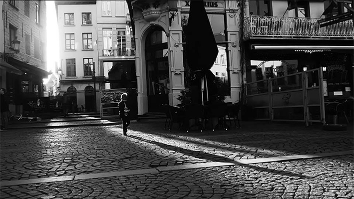

## **Klapbord**

De kortfilm in zwart-wit met de internationale titel **Come and See** is geschreven en geregisseerd door Selina De Maeyer. Deze Belgische heeft zich reeds een naam verworven als kunstfotografe. Tevens heeft ze zich in de media expliciet over haar katholiek geloof uitgesproken. In 2017 debuteerde Selina De Mayer als filmregisseuse met haar kortfilm **Come and See**.

 De kortfilm verdient het label Europese auteursfilm. Selina De Maeyer schreef zelf het scenario, hanteerde zelf de camera en voerde ook de volledige regie. Ze kaapte ermee prijzen weg op internationale katholieke filmfestivals. Dat geldt vooral voor de achtste editie van het _Mirabile Dictu-Filmfestival_ (2017) van het Vaticaan waar **Come and See** de prijs van beste kortfilm kreeg. En op het 32ste Internationale _Niepokalana Film en Multimediafestival_ in Warschau won de kortfilm de derde prijs.
 
  De opnames vonden plaats in de stad _Antwerpen_: het rustieke historisch centrum met het bestaande huisje aan de Ossenmarkt, bewoond door een Spaanse vrouw die luistert naar de naam Maria-Jezus, het Begijnhof aan de Rodestraat, en de Vlaaikensgang die de Oude Koornmarkt, de Pelgrimstraat en de Hoogstraat verbindt; voorts zijn er sequenties in de winkelstraat de Meir, op de kaaien aan het Steen en in het Stadspark. De slotsequenties in het kerkgebouw zijn gefilmd in de kerk van het Heilig Hart van de gelijknamige parochie, gelegen aan de Lange Beeldekensstraat. 
  
  Alles is op locatie gefilmd tijdens de winter van 2016-2017. Daarbij waren slechts vier personen betrokken: _Selina De Maeyer_, minderbroeder kapucijn _Marcin Derdziuk_, priester, die ook de rol van de dakloze bedelaar speelt, _Bartek_, de roepnaam van het hoofdpersonage, het kind, vertolkt door het zesjarig Poolse jongentje Bartlomiej Basiaga, en zijn moeder, _Dorota_. Luc De Maeyer tekende het storyboard. Selina De Maeyer verstrekte zelf de nodige gegevens over de opnames aan de auteur en heeft ook deze studie nagelezen. Zelf deelde ze de auteur nog het volgende mee over het verloop van het productieproces: 

>>_Geen draaidag is gestart zonder gebed en geen draaidag is geëindigd zonder gebed. Daar ligt de sleutel. God is waarlijk de regisseur van deze film. Er zijn zo veel toevalligheden mee gemoeid geweest dat je die alleen maar kan toeschrijven aan de Goddelijke Voorzienigheid._

De productie is van de Nederlandse, katholieke uitgeverij Betsaida en de Minderbroeders Kapucijnen Vlaanderen. Xander Nichting componeerde de originele filmmuziek, vooral voor piano en elektrische viool. De film duurt 11 minuten.

## **Synopsis**

Op de kast in de woonkamer staan behalve familiefoto’s van kinderen, ook verschillende beelden die getuigen van een katholiek huis. Er blijkt niemand thuis te zijn, behalve een kind, een jongentje dat de kamer binnenkomt. Hij kijkt door het raam naar de hemel. De kale boomkruinen zeggen dat het winter is. Het heldere hemellicht werkt als een magneet op het jongentje. Het inspireert hem. Hij neemt de kaarshouder van de kast, steekt de kaars aan en gaat de deur uit nadat hij in de gang de affiche ‘Kom en zie’ heeft gelezen. 

>Met zijn brandende kaars begint hij aan een tocht vanuit het historisch centrum van de stad Antwerpen. Hij bereikt de grote winkelstraat, de Meir. Er is veel volk. Hij moet zijn kaars brandend zien te houden. Hij steekt het zebrapad over en gaat naar de tramhalte. Via tram 11 rijdt hij richting Stadspark. Daar stapt hij over de besneeuwde paden. Hij is er alleen, omringd door duiven. 

>Uiteindelijk bereikt hij zijn doel, het kerkgebouw van de parochie Heilig Hart. Wanneer hij de kerk betreedt, begint hij enthousiast naar het hoogaltaar te lopen. Hierdoor dooft zijn kaars. Aan het altaar gekomen, ziet hij de uitgestalde monstrans met de heilige Hostie. Hij kijkt aandachtig en blij naar het heilig Sacrament, maar hij beseft tevens dat de vlam van zijn kaars is gedoofd. Hij kijkt naar de glasramen die zich vullen met licht, de zon licht op in de Hostie; het hemelse licht verlicht het gezicht van de jongen en doet zijn kaars opnieuw branden. Hij is diep gelukkig. Zijn blik zoomt in op de Hostie. Ze is een en al licht waarin de eucharistische woorden verschijnen: ‘_This is my Body. This is my Blood._’, waarna het  ‘_I am the Light of the World_’ de film afsluit.

## **Cinematografie**

**GESCHREVEN MET DE PEN VAN DE LICHTAARD IN ZWART-WIT.** Door zijn zwart-wit look oogt de film heel esthetisch. De regisseuse slaagt erin de kunst van de cinematografie, waarvan de oorsprong teruggaat op de negentiende-eeuwse zwart-wit fotografie, optimaal in te zetten. Het zwart-wit accentueert immers de bron van alle beelden, het heldere zonlicht dat iedere dag opnieuw de duisternis overwint. Dit wonderlijk gebeuren waarin zich het leven van mensen, dieren en planten op aarde voltrekt, heeft een echo gevonden in de openingstekst van de joodse Thora en de christelijke Bijbel. In de spiegel van _Genesis 1-2.4a_ én de kunst van de cinematografie diept [Levensbeschouwing democratisch belicht](http://www.menstis.be/uitgeverij/Levensbeschouwing) die religiositeit van het licht uitgebreid uit in het neologisme van _de Lichtaard_.

> **Come and See** beweegt zich letterlijk als een blij kind in die Lichtaard. Dat krijgt zijn bezegeling met het citaat uit het _Johannesevangelie 8.12_: ‘_I am the Light of the World_’. Daarna volgt de eindgeneriek.
 
  >**Come and See** is inderdaad geschreven met de pen van de Lichtaard. Die pen is de filmcamera. Die is voortdurend in beweging. _Het openingsshot_ bevestigt dat met de tracking shot (traveling shot) bij de kast in de woonkamer. De camera beweegt langs de kast met de voorwerpen. Ook _het slotbeeld_ ontstaat uit een beweging. Het is even eenvoudig als complex opgebouwd. Nadat de gloed van het zowel goddelijke als aardse licht de kaars van het kind weer heeft doen branden, plaatst het kind de kaarshouder met de brandende kaars op het altaar naast de andere brandende kaarsen. Dan kijkt hij blij en gelukkig op naar de monstrans met de heilige Hostie. Daarop volgt de ‘goddelijke’ respons. De regisseuse bereikt dat effect door gebruik te maken van de _subjectieve camera_. Die bevindt zich achter de monstrans en zoomt geleidelijk in op de heilige Hostie. Er ontstaat een _grote close-up_ waarbij de hostie zelf een bron van licht wordt, waarin vervolgens de eucharistische woorden verschijnen. Met andere woorden, de regisseuse gebruikt hier de subjectieve camera om de goddelijke aanwezigheid, fysisch present in het _heilig Sacrament_, te evoceren. Die goddelijke aanwezigheid waarmee de positie van de camera via de _inzoom_ bijna letterlijk samenvalt, belichaamt het goddelijke welkom en ontvangst van het kind in het kerkgebouw, het eindpunt en de bekroning van zijn tocht doorheen de stad. 

**MONTAGE EN INLAS.** De bewegende camera past perfect in het beeld van de tocht van de jongen door de stad, richting het kerkgebouw met het heilig Sacrament. De camera stapt mee met de jongen. Dat kondigt zich aan via een creatief gebruik van de montage. De film is namelijk lineair opgebouwd. Het is _een kleine road movie_, een genre waarvan het kenmerk is dat het hoofdpersonage een concrete weg aflegt. Het verhaal is dan de weg zelf. In **Come and See** betreft het de weg van het hoofdpersonage van de kleine jongen doorheen de stad Antwerpen: van het historisch centrum via de winkelstraat naar de tramhalte en zo naar het park om aan te komen bij de kerk. 

>Die narratieve ononderbroken lijn kent één korte, maar belangrijke uitzondering. Die situeert zich helemaal aan het begin van de film. De korte passage bestaat uit _een close-up van stappende voeten_. De camera focust op de schoenen op de weg. Dat tussenshot is erg betekenisvol. Het jongentje kijkt door het raam naar de hemel over de kale kruinen van de bomen. Dan volgt het _bedoelde tussenshot_, waarna het kind beslist om de kaarshouder te nemen, de kaars aan te steken en aan zijn tocht te beginnen. Met andere woorden, op het ogenblik dat het kind nog binnen in de woonkamer is, vormt het tussenshot van de stappende voeten een uitnodiging. Het kind ervaart een kracht vanuit het helderde hemellicht om op weg te gaan. Die beeldende compositie werkt narratief als de roep om de Bron van het licht op te gaan zoeken. 

>Een dergelijke ‘roeping’ herinnert aan het evangelisch verhaal van _Mattheüs 2.1-23_ met de drie koningen die de roep van de lichtende kerstster volgen en _Lucas 2, 8-12_ met de herders die op weg gaan naar Bethlehem na de ontmoeting met een engel ‘_omgeven door het stralende licht van de Heer_’. Net voor het kind de huisdeur opent, leest hij nog de affiche in de gang: ‘_Kom en zie_’. Ook die versterkt de roep die hij kijkend naar het licht heeft vernomen. De regisseuse heeft zelf de originele affiche ontworpen. Aan de auteur liet ze weten dat ze de affiche heeft gemaakt als een uitnodiging voor de wekelijkse [Kom en Zie-bijeenkomsten met Jezus (gebed, catechese, ontmoeting)]( https://jezus-hart.be/activiteiten) op donderdagavond in de H. Hartkerk. Daar zijn de eindsequenties opgenomen. Selina De Maeyer staat mede aan de wieg van dit initiatief. De affiche toont gevouwen, biddende handen waaruit een sterke lichtbron ontspringt. Die uitnodigende affiche is uitgegroeid tot de kortfilm **Come and See**. 

**HET KIND ALS WANDELENDE BEELDMETAFOOR.**  **Come and See** ontspringt aan het _beeldend denken_. Dat gebeurt zeer intens. De film maakt de kijker bewust van zijn _toeschouwerschap_ (zie Deel 1 van [Levensbeschouwing democratisch belicht](http://www.menstis.be/uitgeverij/Levensbeschouwing). Van de eerste sequentie af plaatst de film de kijker voor zijn eigen verantwoordelijkheid als toeschouwer. Beeldconsumptie is hier niet mogelijk. Op het eerste zicht wordt die toeschouwer immers aan zijn lot overgelaten. Die krijgt geen enkele introductie, geen mededeling over wat en waar. Het hoofdpersonage is niet gesitueerd. Het kind heeft wel een thuis, maar ouders of sporen ervan zijn niet te bespeuren. Het lijkt erop alsof hij alleen in het huis woont. En vooral: er wordt geen woord gesproken, zoals in een stille film uit de beginperiode van de filmkunst. Maar toen werden de stille beelden afgewisseld met tekstborden om de toeschouwers te informeren. Hier niet. Alleen verschijnen op het einde de eucharistische woorden. 

>Het beeldend denken werkt met _beeldmetaforen_. De voornaamste is _het kind zelf_. Zijn anonimiteit, de afwezigheid van enige gezinssituatie, een portret zonder enige psychologische analyse, dat alles maakt van het hoofdpersonage een levend beeld van het kind-zijn. Hij belichaamt het menszijn in de gestalte van het kind. Dat het daarbij niet om een bepaalde levensfase met een bepaalde eigen psychologische setting gaat, blijkt uit de hele signatuur van de film. Het kind-zijn geldt voor alle mensen, klein en groot, jong en oud, man of vrouw, monnik of dakloze. De oudste man of vrouw op aarde blijft nog steeds het kind van zijn ouders. Maar er is nog meer. 

>Niet de psychologie, maar de _spiritualiteit van het kind-zijn_ primeert in **Come and See**. In de optiek van de eerste sequenties geldt het kind-zijn voor alle bewoners van de aarde. Alle mensen zijn kinderen van het licht, zonen en dochters van het mysterie van het leven op aarde. Het jongentje woont in een huis en vanaf zijn eerste verschijnen beweegt hij vanuit de verbondenheid met het licht aan de hemel dat boven de hoge kale bomen zichtbaar is. Zelfs in de winter waarborgt dat _lichtende licht_ de belofte van leven, beweging, toekomst. Die primaire relatie van het mensenkind met de bron zelf van het leven, _de Lichtaard_, maakt de mens tot een religieus wezen. Het wezen dat alle religies delen met elkaar is die onderlinge verbondenheid met het enige en zelfde mysterie van het Leven, opgewekt door het lichtende Licht. 

>_Religiositeit_ is eigen aan de mens op aarde die baat in het licht dat hem omhult. Dat licht roept het kind op weg te gaan naar zijn oorsprong, naar de Bron van zijn bestaan. Daarbij vertrekt hij niet vanuit het niets. Hij vertrekt vanuit zijn thuis. Hij is niet alleen het mensenkind van de Lichtaard, maar ook van de cultuur, het tweede licht waarin hij leeft en beweegt. 

>De openingsshot van **Come and See** brengt dat _cultuurhuis_ in beeld. Naast de baby- en kinderfoto’s, de blijvende herinnering aan het mysterie van de geboorte als kind, het waarmerk dat iedere mens tekent, zijn er duidelijke sporen van de _katholieke geloofscultuur_: het beeldje van de engel, de grote prent van het Heilig Hart van Jezus, het open bijbelboek in het Spaans met de bladwijzer van de zalig verklaarde priester Edward Poppe, een rode roos en een rozenkrans met grote bollen, zijnde het katholieke gebedssnoer, vervolgens het beeldje van de Heilige Familie bij de levensboom, het glazen kistje met erin een volksmissaal of persoonlijk misboek, het beeld van Onze-Lieve-Vrouw met een rozenkrans in haar handen. Die tekens van de katholieke geloofscultuur begeleiden de kleine jongen. Ze vormen de achtergrond evenals de rugdekking van zijn tocht door de stad. Daarbij maakt de kaarshouder met de brandende kaars deel uit van de bewegende beeldmetafoor van het jongentje. 

>Dat beeld definieert _de eigen narratieve lijn_ van **Come and See**. Die bevindt zich tussen het begin ― zelf aansteken van de kaars in de woonkamer ― en het einde ― het uitdoven van de kaars in de kerk én de terugkeer van de vlam via het inwerkende Licht. De beeldende verhaallijn van **Come and See** ontwikkelt zich in de tocht naar het kerkgebouw waarbij het jongentje vervuld is van de zorg om de kaars brandend te houden. Zijn doel is om op de enige plaats waar dat kan, hulde te brengen aan het heilige mysterie van het goddelijke Licht in het kerkgebouw. 

**CHRISTELIJKE TEKENS ONDERWEG.** De tocht van het kind met de brandende kaars verloopt niet blind. Allereerst verlaat het jongentje het huis met een duidelijke boodschap die hij op de affiche ‘_kom en zie_’ leest alvorens op weg te gaan. Iets roept hem, nodigt hem uit te komen en te zien. Ook de katholieke cultuurtekens, de devotiebeelden, in het huis vormen een kompas dat hij in zijn hart en geest meeneemt. Maar ook onderweg leiden religieuze tekens uit diezelfde katholieke geloofstraditie zijn pad. Die bestaan uit dingen, dieren en mensen. 

>Er zijn de _gebouwen_ die getuigen van het katholiek verleden van de stad: kerktorens, de grote Onze-Lieve-Vrouwkathedraal. Er zijn de _kruisbeelden en kruistekens_: een groot kruisbeeld in de publieke ruimte, de straatnaam ‘Jezusstraat’ met vlakbij een kruisteken in neonlicht. In het historisch centrum staan _Mariabeelden_ in nissen boven deuren of in uitsnijdingen van huizen op straathoeken.

>Naast de tekens van gebouwen en beelden in de stad, begeleiden ook _duiven_ het kind. Wanneer hij het zebrapad in de drukke winkelstraat oversteekt, houdt hij even halt, kijkt achterom en ziet op het zebrapad een witte duif. Niemand anders dan het jongentje ziet ze. Hij kijkt toe en ziet hoe ze opvliegt, hemelwaarts. Er volgt een subjectief camerastandpunt. Genomen vanuit een kikvorsperspectief, monteert de regisseuse een inlas die toont hoe de witte duif zich in de lucht bevindt samen met nog twee andere duiven. In de christelijke iconografie staat de witte duif voor de _Heilige Geest_. In de katholieke traditie is de voorstelling van de duif ook verbonden met het sacrament van het _vormsel_. Het beeld van de drie duiven vliegend in de lucht verwijst tegelijkertijd ook naar het _mysterie van de Triniteit of Drievuldigheid_ waarnaar ieder christen verwijst telkens wanneer hij het kruisteken maakt. Na het shot met de drie duiven volgt een shot van het glimlachende jongentje. In het park verwelkomen hem de duiven. Hij loopt op het pad langs het water. Op de afsluiting zit een duif. Wanneer hij voorbij de duif loopt, slaat ze haar vleugels open. Die scène is in slow motion gefilmd. Het gebeuren krijgt een accent. De duif met gespreide vleugels vormt een kruisteken. Het laatste shot in het park is eveneens in slow motion. Op zeker ogenblik komt hij op een plek waar zich veel duiven hebben verzameld. Bij zijn komst vliegen ze een voor een op in slow motion. Na die scène komt het jongentje aan de grote deur van de kerk. In de wat donkere hal verwelkomt hem een groot kruisbeeld. Dan stapt hij binnen in het licht van het kerkgebouw. 

>Niet alleen de gebouwen, de beelden, de duiven begeleiden hem op zijn tocht naar het kerkgebouw. Er zijn ook _mensen_. Eerst is er _de pater_, de minderbroeder kapucijn. Hij verschijnt in beeld vanuit het blikveld van het jongentje. Die ziet ― in close-up ― vooral het kruisbeeld van de grote rozenkrans die hangt aan de witte koord van het habijt van de pater. Die legt zijn handen op het hoofd van de jongen. De ontmoeting met de pater gebeurt aan het begin van de tocht, net voor hij de eerder gesloten omgeving waar zich het huis bevindt, verlaat en de stad intrekt. Onmiddellijk daarna volgt de ontmoeting met _de dakloze man_. Het jongentje wil hem geld geven maar stelt vast dat hij geen geld bij zich heeft. Het kind maakt een gebaar van ‘het spijt me, ik heb niets bij’, de man glimlacht. Direct na die ontmoeting last de regisseuse een korte sequentie in waarin twee vliegtuigstrepen in de lucht een kruisteken tekenen. Het komt voor op het ogenblik dat de echte tocht doorheen de stad begint. Het vormt een wegwijzer in de lucht. Een erg belangrijk moment dat filmisch amper enkele seconden duurt, speelt zich af bij het opstappen op tram 11. _De bestuurder_ roept het jongentje terug; hij heeft immers niet betaald. Op dat ogenblik stapt _een onbekende man_ op die de buschauffeur een eurobiljet geeft zonder te wachten op de teruggave van het teveel betaalde bedrag. Uit de eindgeneriek blijkt dat die persoon Jezus heet. 

**CRESCENDO VAN LICHT EN STILTE .** **Come and See** beweegt zich als _spirituele road movi_ naar een crescendo van licht toe. Dat crescendo ontwikkelt zich in een afwisseling van sequenties die de aarde en de hemel samenbrengen. Er is het shot van de voetstappen, de kasseien, de verharde bestrating van de winkelstraat, het zebrapad, het besneeuwde park, de vloer van het kerkgebouw. Die beelden tekenen het _element van de aarde, de woon- en werkplaats van de mens_. Andere beelden tonen vanuit een kikvorsperspectief dat samenvalt met de blik van het kind, de _hoge lucht met zijn aura van helder licht_. De weg van het kind krijgt inhoud zowel via zijn voeten (de aarde) als via zijn mentale blik (de hemel). Beide polen zijn geen tegengestelden. Ze scheppen een leefwereld waarin het jongentje zich schouwend beweegt. Het kind spreekt niet, hij concentreert zich op zijn kaars, maar absorbeert tevens schouwend de vele tekens en de personen die hem geruisloos begeleiden. En dat wordt in zijn geheel geregisseerd door ‘het licht van de Schepping’, _de Lichtaard_.

 >Er is één _fade out naar een zwart beeld_. Dat gebeurt na de sequentie in het park. Het kind stapt op het pad met de vele duiven. Ze vliegen op. Dan volgt de fade out. Het zwarte beeld markeert het _einde van de tocht_. Het volgende beeld toont immers de aankomst van het kind aan de grote dubbele deur van het kerkgebouw. Dan bereikt de regie van de _Lichtaard_ haar hoogtepunt in de slotsequenties aan het hoogaltaar in de kerk. 
 
 >Het uitgestalde heilige Sacrament verschijnt als een bron van helder, hemels licht dat opnieuw wenkt en uitnodigt naderbij te komen. De regisseuse laat hierover geen twijfel bestaan. Zij monteert een _inlas van de zon_ en koppelt die aan de close-up van de ronde heilige Hostie. _Het crescendo van licht_ eindigt immers met een inzoom op de Hostie tot die verschijnt in een zeer grote close-up die vloeiend overgaat in zuiver licht waarop de eucharistische woorden verschijnen. 
 
 >Voorts krijgt het crescendo nog een auditieve ondersteuning door _de filmmuziek_. De film kent slechts enkele natuurlijke geluiden: de wind, het openen van de kerkdeur. De filmbeelden zijn als het ware stom, maar worden begeleid door de _muziekscore van Xander Nichting_. De openingssequentie met de kast introduceert de piano die vanaf de inlas met de voetstappen wordt versterkt met de elektrische viool. Samen begeleiden ze de tocht van het jongentje. De _piano_ vertegenwoordigt de klanken van de aarde, terwijl de _viool_ die van de hemel oproept. Wanneer het jongentje aan de tweedelige deur van de kerk komt, zwijgt de muziek even. De _stilte_ neemt het over. De zachte wind en het geluid van de opengaande kerkdeur markeren de aanwezigheid van een gewijde stilte. Dan ontstaat er een beweging van relatieve donkerte naar intens hemels licht. Het kind komt eerst aan in het voorportaal dat vrij donker is. Hij ziet er een kruisbeeld aan de muur hangen. Dan merkt hij de open deur naar de verlichte ruimte van de kerk. Wanneer hij de kerkruimte zelf betreedt, registreert een subjectief camerastandpunt de grote verwondering van het kind. Een bijna verblindende lichtbundel, begeleid door zachte, sferische muziek, verwelkomt hem. Hij bewondert de hoge hemelkoepel waarin zich glasruimten bevinden. 
 
 >Dan merkt het kind de monstrans op en begint ernaar toe te lopen. Dan weerklinken opnieuw de piano en de viool, nu in een uptempo. Op het ogenblik dat het kind merkt dat zijn kaars niet langer meer brandt, is er opnieuw een moment van volledige stilte. Geleidelijk wellen uit die stilte de _etherische klanken_ op van bij het binnenkomen van de kerk. Ze klinken nu duidelijker en ze lijken afkomstig te zijn van een koor. Die sferische muziek begeleidt de filmische introductie van het heilig Sacrament in de monstrans op het hoogaltaar. In combinatie met de eraan vooraf gaande opwaartse gerichte shots van de kerkkoepel met zijn glasramen en het shot van het hoog invallende zonlicht met het grote opgehangen kruisbeeld in tegenlicht, zou het onzichtbare koor een engelenkoor kunnen zijn. Bij het shot van het jongentje die in het donker wat verloren kijkt naar zijn gedoofde kaars, is er volledige stilte. Wanneer er plots een helder licht valt op het gelaat van het kind en de kaars terug begint te branden, weerklinkt weer de _muziek van de tocht_, de piano en de viool. De camera neemt de blik van het kind over en zoomt in op de monstrans. Opnieuw een moment van gewijde stilte. Met de close-up van de bijna opgebrande kaars begint de allerlaatste beweging van de tocht van het jongentje. De muziek zet in en het jongentje gaat naar het hoogaltaar toe waar hij de kaarshouder met de brandende kaars neerzet. Tijdens die laatste stappen weerklinkt opnieuw het engelenkoor. In de slotsequentie ― het jongentje en de Hostie kijken elkaar aan, staan oog in oog bij elkaar ― speelt alleen de piano de laatste klanken. 
 
 >In de openingssequentie was het ook de piano die de beelden op de kast introduceerde. Nu blijkt dat die kast waarvan alleen het bovenblad met de voorwerpen in beeld komt, _een soort huisaltaar_ is dat nu gelinkt wordt aan _het hoogaltaar_ van de kerk. Op dat hoogaltaar staat nu de monstrans met het heilig Sacrament en de brandende kaarsen, ook die van het kind. De film eindigt met de verschijning van de eucharistische woorden op een lichtende achtergrond. Dat gebeurt in stilte, net zoals ook tijdens de eucharistie zelf de eucharistische woorden en de bijhorende liturgische gebaren met de Hostie en de Kelk zich in de gewijde stilte van de kerk voltrekken. 

## **Betekenisruimte**

**SCHAKERING.** Selina De Mayer bespeelt in **Come and See** de vele mogelijkheden van het cinematografische register. Ze stelt die in het teken van de schakering. Daarvan getuigt al haar eerste keuze om het verhaal in zwart-wit in beeld te brengen. Ze wisselt wazige beelden af met scherpe. Ook de muziekscore kent een tweeledigheid, die van de piano en de viool, een toetseninstrument in een lagere en een snaarinstrument in een hogere klankorde. 

>**Come and See** werkt met _schakeringen_, niet met contrasten. De film komt niet voort uit een visie getekend door harde tegenstellingen. Het zwart en het wit behoren in **Come and See** niet tot een set van scherpe tegengestelden. Ze verschijnen als schakeringen van witheid, eigen aan het heldere zonlicht én de heilige Hostie. **Come and See** beschrijft een weg van een eerdere donkere naar een heldere schakering. De wisseling van het ene naar het andere mondt uit in het crescendo van het hemels licht dat het alles in zich opneemt. In die zin treden het zwart en het wit in **Come and See** op als kleurschakeringen van de helderheid, eigen aan het Licht. 

>In diezelfde geest schildert de regisseuse het _onderscheid_ tussen het huis en de stad, tussen de winkelstraat en het park, en tussen het park en het kerkgebouw. Selina De Maeyer schept haar verhaal geenszins vanuit de dualistische instelling. Ze laat niet toe dat de tegengestelde categorieën van goed versus slecht, kwaad versus goed haar regie overnemen. Dat blijkt heel duidelijk uit de sequenties die zich in de stad, met name in de tram en de winkelstraat situeren. Het jongentje bevindt zich in de tram met de andere tramreizigers en hij beweegt zich in de winkelstraat tussen de shoppers. Hij zondert zich niet af, hij vermijdt ze niet als de pest of als de wereld van de onreinen. 

>Hij onderscheidt zich enkel door _zijn zorg voor de brandende kaars_. Hij blijft gefocust op de weg die hij bewandelt. Die loopt niet langs het pad van de shoppers. Evenmin lijkt de weg van het jongentje op die van de automobilist die naast de tram even stilstaat. De arm van de chauffeur hangt uit het open raam omdat de man een _sigaret_ aan het roken is. Het vuur van de sigaret lijkt niet op dat van de _brandende kaars_ in de tram

>Het jongentje dat als toeschouwer zijn weg gaat, neemt alles waar, ook het seculiere leven, eigen aan de stad. Juist in die stad gaat hij zijn _eigen weg_. Enige behoefte om de anderen te veroordelen of zelfs te bekeren, blijft hem vreemd. Hij neemt alles in zich op terwijl hij zich blijft concentreren op zijn brandende kaars. 
 
>Langs zijn _spirituele pad_ laat het jongentje een en ander links liggen. Dat geldt voor _het geld_ en _de sigaret_. Van zijn eerste schreden af blijkt dat hij op zijn tocht geen geld bij zich heeft. De dakloze herkent in het kind zijnsgelijke. Wanneer het jongentje de tram opstapt, betaalt hij niet. Hij heeft immers geen geld bij zich. Zonder geld vindt men in de stad zijn weg niet. Daarvan getuigt de winkelstraat. Wat loopt iemand zonder geld daar immers te doen? De regisseuse blijft dicht bij het kind zonder geld of smartphone met GPS. Wat geld in de stad doet, verdicht zich in het beeld van de rokende chauffeur. Hij blijft onzichtbaar, alleen zijn arm en hand met een brandende sigaret zijn te zien. Het vuur van de sigaret is dat van de consumptie. Het eigen verbruik, het eigen genot primeert. Het vuur van de consumptie brandt het leven op in functie van het eigen narcisme. Dat is een reële mogelijkheid, het is een reële weg die mensen in de stad kunnen en willen gaan. Het is een van de redenen waaraan de stad haar reden van bestaan ontleent. Eén, maar niet de enige reden van bestaan. Eén weg, maar niet de enig mogelijke. 
 
>Het jongentje en zijn weg getuigen van een andere levenshouding. Die licht op in _de tram_. In tegenstelling met de _auto_ en de sigaret, instrumenten van het ego, vertegenwoordigt de _tram_ de gemeenschap. De anonieme man betaalt de rit van het jongentje. In tegenstelling met de autorijder, heeft de trambestuurder wel een gezicht. Hij glimlacht. Op de tram bevindt zich ergens anoniem _Jezus_. Het kind ziet op de tram de staatnaam ‘Jezusstraat’ verschijnen, hangend naast een kruisteken in neon. In de stad waar het jongentje leeft, is de heersende consumptieve levenshouding, gestoeld op de daadkracht van het geld, geen dwangbuis. Daarvan levert de levenshouding van het kind het menselijke bewijs. Hij volgt _een roeping_, hij handelt en wandelt vanuit een spirituele levenshouding die haar motivatie haalt uit een religieuze beleving. Daarin overstijgt hij zijn ego. Zijn doel is de kaars brandend te houden om ze als een offer op te dragen aan het heilig Sacrament. Dat belichaamt het fundament van het christelijke geloofsmysterie, fysiek verdicht in de gewijde Hostie in de monstrans op het hoogaltaar.

**DE TRADITIE ALS WEGWIJZER.** In de optiek van **Come and See** hoort de christelijke, meer bepaald de _katholieke geloofstraditie_ tot de levende stad. Het kind vertrekt vanuit een bestaand woning nabij de Ossenmarkt, bewoond door een diepgelovige Spaanse vrouw die luistert naar de naam _Maria-Jezus_. De setting op de kast is niet geënsceneerd. Dat heeft Selina De Maeyer aan de auteur laten weten. De kast met de devotiebeelden en open geslagen Bijbel staat zo in de woonkamer van Maria-Jezus. Na de sequenties in het huisje, komt het kind eerst door het _Begijnhof_, een typische architectuur, specifiek voor het katholieke verleden van Vlaanderen. Dan zijn er ook de talrijke aanwezige kerkgebouwen en diverse kruisbeelden op publieke plaatsen. 

>Voorts zijn nog de duidelijk herkenbare vertegenwoordigers van de katholieke kerk zelf, met in de film de _minderbroeders kapucijnen_, vroeger gekend onder de katholieke bevolking als ‘de bruine paters’, officieel de _Ordo Fratrum Minorum_ waarvan de oorsprong teruggaat op de middeleeuwse heilige _Fransciscus van Assisi_. Het gekende _Zonnelied_ van Franciscus bezingt de lof van de schepping. Hij spreekt er de zon aan met ‘broeder’ en de maan met ‘zuster’. ‘Broeder’ zonlicht speelt een hoofdrol in **Come and See**. Interessant detail om te weten, met als bron de regisseuse zelf, speelt een kapucijn de figuur van de dakloze bedelaar. De minderbroeders kapucijnen horen bij de middeleeuwse bedelorden, zij die hun voedsel bedelden en dus leefden zonder geld dat ze zelf genereerden. Zij herinnerden aan Jezus zelf die in de overleving van de Evangelies vaste woning noch inkomen bezat. 

>De katholieke traditie komt in **Come and See** al in de eerste sequentie, het tracking shot in de woonkamer, in beeld via de _devotiebeeldjes_ zoals die in de vele Vlaamse huiskamers een plaats hebben gekregen. Dat geldt in het bijzonder voor afbeeldingen van de _Heilige Familie_, Maria, Jozef en de kleine Jezus. Ook de aanwezigheid van de sterk verspreide devotie van _het Heilig Hart van Jezus_ komt duidelijk in beeld. Het kind bereikt het doel van zijn tocht doorheen de stad in de _Heilig-Hartkerk_. In de periode die men aanduidt als ‘het rijke Roomse leven’ in Vlaanderen ― tweede helft van de negentiende eeuw tot aan het Tweede Vaticaans Concilie in  het begin van de jaren zestig van vorige eeuw ― waren de devotieprentjes met het [H. Hart van Jezus](https://nl.wikipedia.org/wiki/Heilig_Hartverering) overal verspreid. 

>In die devotie werd in de parochies de eerste vrijdag van de maand toegewijd aan het _Heilig Hart van Jezus_, wat gepaard ging met de uitstalling in de monstrans van _het heilig Sacrament_. Die uitstalling speelt een hoofdrol in de ontknoping van **Come and See**. Daarnaast krijgt de devotionele eerbied voor het heilig Sacrament nog extra aandacht tijdens het _katholiek hoogfeest van het Heilig Bloed en Lichaam van Christus_, kortweg _Sacramentsdag_ genoemd. Op de tweede donderdag na Pinksteren wordt de geconsacreerde Hostie in een monstrans ter aanbidding opgesteld op het hoofdaltaar. Voorheen ging op die dag ook de Sacramentsprocessie uit waarbij de monstrans door de straten van de parochie werd rondgedragen. Tot op heden is Sacramentsdag in sommige Europese landen, alsook in Brazilië,  met een sterk katholiek verleden nog steeds een officiële feestdag. In Vlaanderen en Nederland werd het feest van het heilig Sacrament verplaatst naar de tweede zondag na Pinksteren. 

>Die gegevens uit de traditie verduidelijken hoe sterk **Come and See** verankerd zit in _die katholieke geloofstraditie_ in Vlaanderen en het Zuiden van Nederland. De religieuze objecten, de monnik in habijt, het kerkgebouw met de monstrans, al deze ‘kerkschatten’ zijn _sporen van een religieuze, christelijk-katholieke_ cultuur die vandaag nog duidelijk zichtbaar zijn in het heden van de seculiere stad. Die sporen werken als gidsen. Ze ondersteunen de tocht van het hoofdpersonage dat zijn ‘roeping’ volgt. 

>In **Come and See** beleren de cultuursporen niet, ze dwingen niet; er is zelfs geen catecheseonderricht noch wordt er een preek gehouden. 

>In de optiek van**Come and See** werkt de genoemde traditie vooral als een inspiratiebron, als een _bron van creativiteit_. Dat houdt in dat die traditie niet verschijnt als een onbeweeglijk massief gegeven of als een oud relict uit het verre verleden, alleen nog aanwezig in een of ander museum. De jonge kunstenares Selina De Maeyer gaat _creatief_ om met die geloofstraditie die ze benadert als grondstof voor haar eigen origineel verhaal. 

>**Come and See** is een cinematografisch geloofsverhaal, een _filmisch credo_, vertolkt in een zuiver beeldende stijl. De geloofstraditie toont hier vooral haar _beeldend wezen_, van architectuur tot devotiebeelden. Die christelijk-katholieke traditie was eeuwenlang bijzonder schatplichtig aan een canon van woorden en strakke formuleringen. 

>**Come and See** relativeert die en voert ze vanuit de eigen kracht van de cinematografie, terug naar haar ware bron, het _levende licht van ‘de Schepping’_, het zonlicht dat energie, warmte en leven geeft aan alles op aarde, aan plant, dier en mens. Selina De Maeyer onderhoudt als kunstfotografe een diepe, zeg maar mystieke band met het hemelse licht, de _Lichtaard_. Zij doordrenkt de oude geloofstraditie met dat Licht.

**BEZIELD DOOR DE HEILIGE GEEST.** Er is een subtiel auditief detail dat de intro van de religieuze roep kracht bijzet. Het hoort bij de titel **Come and See**, witte letters op een zwarte achtergrond, zwart en wit, de twee componenten van de film. Bij die titel hoort namelijk nog het geluid van de wind. 

>In de christelijke traditie staat de wind voor de _werking van de Heilige Geest_. Die bezielt, zet in beweging, motiveert. Daarover vertellen de huissequenties. In de loop van de tocht van het kind doorheen de stad begeleiden de duiven hem op zijn tocht. Dat gebeurt op het einde van de passage in de winkelstraat bij het oversteken van het zebrapad, waar de inlas van de witte duif én die van de drie duiven, hoog in de lucht vliegend: beeld van de Triniteit. En op het einde van zijn tocht, het deel in het park, verwelkomen de opvliegende duiven de jongen, waarna hij het kerkgebouw betreedt. Tijdens zijn intrede in de kerk, het binnenkomen, is het stil op het geluid van de opengaande deur én dat van de wind na; met dat laatst opent ook de film. Bij de eerste sequenties aan en in het kerkgebouw, duidt de aanwezigheid van de wind de herkomst van de wind bij het beeld van de titel: die wind vindt zijn oorsprong in de religieuze kracht en de beweging, waarvan het kerkgebouw de stenen getuige is. De zacht voorbij waaiende wind, een duif die opvliegt, tastbaar beeld van _de Heilige Geest_ die motiveert om de eucharistische weg van en naar Jezus te gaan.

**FILMISCHE CHRISTOLOGIE IN HET TEKEN VAN DE EUCHARISTIE.** De beeldende intro, het tracking shot, met de devotievoorwerpen op de kast in de woonkamer, bevat de eucharistische sleutel tot de eigen betekeniswereld van de film. Het betreft het beeld van het Heilig Hart van Jezus en een historisch portret van de Vlaamse priester _Edward Poppe_, te zien op de bladwijzer op de open gevouwen Bijbel. 

>De twee beelden zijn met elkaar verbonden, zoals blijkt uit een korte biografische schets van de bakkerszoon van Temse die leefde van 1890-1924. Hij werd in Gent op 1 mei 1916 priester gewijd. Hij leed een consequent ascetisch leven niettegenstaande zijn zwakke gezondheid. Zijn pastoraal werk als priester stelde hij consequent in dienst van de verspreiding van de eucharistische spiritualiteit. Dit was in overeenstemming met wat de katholieke kerk _de communiedecreten_ van paus Pius X van 1910 is gaan noemen. Centraal daarin stond de nieuwe pastoraal gericht op de kinderen en het ontvangen van de heilige communie door hen. Het motto van die pastorale beweging was Jezus’ gezegde: ‘_Laat de kinderen tot mij komen_.’ (Mc. 10.14). Hierdoor ontstond in de katholieke kerk de pastoraal en catechetische werking rond de eerste communie, een gebruik dat ook na het _Tweede Vaticaans Concilie_ (1962-1965) is blijven bestaan tot op de dag van vandaag. Priester Poppe nam het pauselijk communiebeleid zeer ter harte. In zijn priesterlijk engagement speelde het sacrament van de eucharistie de hoofdrol. Hij stimuleerde de volwassen gelovigen om veelvuldig het sacrament van de eucharistie te ontvangen. Zijn aandacht ging echter vooral uit naar de kinderen en de jongeren. In Vlaanderen begon voor hen _de beweging van de Eucharistische Kruistocht_ in 1920. Dat gebeurde onder impuls van de norbertijnen van Averbode. In priester Edward Poppe vond de beweging vanaf 1922 haar meest vurige bezieler. Ze had als doel de kinderen te stimuleren om vanaf hun eerste communie iedere week minstens eenmaal de heilige communie te ontvangen. De leden droegen een speldje in de vorm van een wit kruis met een beeld van een kelk met een hostie erin verwerkt. Die beweging die nog tot diep in de jaren vijftig van vorige eeuw erg verspreid was, kwam voor in alle Vlaamse parochies. Er is nog een biografisch gegeven dat niet onbelangrijk is voor de film. De overlevering over priester Poppe bewaart namelijk de herinnering aan zijn sterfbed. Hij stierf terwijl hij keek naar een devotiebeeldje van het H. Hart van Jezus. Op 3 oktober 1999 is hij zalig verklaard door paus Johannes-Paulus II. 

>De kortfilm **Come and See** herbront _de eucharistische spiritualiteit van de zalige priester Poppe_. Selina De Maeyer toont er de blijvende actualiteit van door als hoofdfiguur een anoniem jongentje, een kind, te nemen. Wanneer de kortfilm in het tegenlicht van de figuur van Edward Poppe wordt gehouden, kan die zelfs worden gezien als een vrije bewerking van de roeping van de kleine Edward Poppe. 

>Door echter het scenario in het heden te situeren, kan het jongentje voor ieder kind staan dat zich aangesproken weet door het _geloofsmysterie van de eucharistie_, al dan niet tijdens de voorbereiding op het ontvangen van de eerste communie. Het doel van de tocht van het kind doorheen de stad is de kerk van het H. Hart en de uitgestalde heilige Hostie in de monstrans op het hoogaltaar. 

>In de traditie hoort het spreken over de eucharistie thuis in de _sacramentologie_, de leer over de zeven sacramenten (doopsel, eucharistie, vormsel, huwelijk, ziekenzalving, biecht en priesterwijding). Met zijn twee invloedrijke studies  ― _De sacramentele heilseconomie_ (1952) en _Christus, sacrament van Godsontmoeting_ (1959) ― effende de Vlaamse theoloog [Edward Schillebeeckx]( https://www.lucepedia.nl/dossieritem/schillebeeckx-edward/introductie-edward-schillebeeckx) het pad voor de liturgievernieuwing die tijdens het reeds vermelde _Tweede Vaticaans Concilie_ tot stand kwam. Zelf beschouwde Schillebeeckx zijn studies als een reactie tegen wat hij ‘_de verzakelijking van de sacramenten_’ noemde. Dat slaat op het gebruik van de sacramenten als een ritueel automatisme zonder enige spirituele beleving. In positieve zin voerde Schillebeeckx de visie en de praktijk van de sacramenten terug op de bron van alle sacramenten, de eucharistie en die vindt haar bron in het evangelische verhaal van Jezus zelf. De eucharistie ― het verhaal van het laatste avondmaal, de instelling van de eucharistie met het woorden ‘_Dit is mijn Lichaam, Dit is mijn Bloed_ ― is het fundament van het christelijk leven en de bijhorende christologie.

 >**Come and See** voltrekt op een _eigen, originele manier die christologisch terugkeer naar de eucharistie_, niet zozeer als een sacrament op zich, maar als de grondslag van alle kerkelijke sacramenten. 
 
 >In **Come and See** komen er geen sacramentele handelingen voor. Het crescendo bestaat wel uit een verering, ja een aanbidding van het heilig Sacrament zelf, waaraan de eucharistische woorden zijn verbonden. En die worden bezegeld door het christologische ‘_Ik ben het licht van de wereld_’ (Johannes 8.12). In ‘dat Licht’ onthullen verschillende filmische elementen hun rijke betekenis. Die staat helemaal in het teken van Christus, fundament van het credo van alle christelijke kerken. 
 
 >De beeldende visie op Christus, de christologie, in **Come and See** staat helemaal in het teken van _Jezus’ leven en werk_. De keuze voor het kind verwijst naar het reeds aangehaalde Jezuswoord: ‘_Laat de kinderen tot mij komen_’ (Mc. 10.14). De openingssequentie herinnert aan de Heilige Familie en aan de moeder van Jezus, Maria, vereerd als Onze-Lieve-Vrouw en aan wie de grote kathedraal van Antwerpen is toegewijd. In de stad tonen verschillende kruisbeelden het kind de weg. Ze verwijzen naar de Passie van Jezus in Jeruzalem en het Romeinse kruis waaraan hij is gestorven. Ook het kerkgebouw zelf herbergt niet alleen twee grote kruisbeelden; het grondplan ervan zelf verwijst naar een uitvergroot Romeins kruis, liggend op de grond. Een ander Jezus-element betreft de devotieprent van het H. Hart van Jezus en het kerkgebouw van de Heilig-Hartparochie, ook al wordt de naam ervan in de film niet expliciet genoemd. In de hoge koepel van de kerk bevindt zich, zo blijkt uit de film, een grote muurschildering van het _Lam Gods_, centrale figuur op het meest gekende, gelijknamige schilderij van Jan van Eyck. Het gelijknamige, christelijke gebed ― het _Agnus Dei_ (Lam Gods)― maakt deel uit van de eucharistieviering. De priester spreekt het gebed uit op het moment dat hij de heilige Hostie breekt en een stukje ervan in de kelk met het heilige Bloed legt. 
 
 >De _beeldende christologie_ van **Come and See** bestaat ook uit het kruis getekend in de hoge lucht door twee vliegtuigen. Voorts is er de Jezusstraat, en bovenal er is de Jezusfiguur zelf die op de tram stapt en het kind zijn rit betaalt. Het personage verschijnt enkel op zijn rug, en dan nog maar gedeeltelijk. Het is geen toeval dat het om _tram 11_ gaat. Een schijnbaar onbelangrijk detail. Maar het Jezuspersonage stapt wel op de tram samen met het jongentje. Van de twaalf apostelen die door Jezus waren geroepen om met hem mee te gaan om zijn goede boodschap uit te dragen, was er één afvallige bij, Judas. Eigenlijk waren ze maar elf ware apostelen. Vandaag, op de tram in de stad van nu, vertegenwoordigt het kind de twaalfde apostel, iedere mogelijke twaalfde apostel. De bijna onzichtbare aanwezigheid van Jezus bezegelt dat.
 
 >Hier verschijnt de kern zelf van de cinematografische christologie. Het _Jezusverhaal_, voor altijd geconsacreerd in het uitgestalde heilige Sacrament, voltrekt zich nog steeds daar waar concrete mensen leven, en proberen, met vallen en opstaan, mens te worden. Dat dit geen evidentie is, bewijst de seculiere stad. 
 
 >Het jongentje met de brandende kaars in de stad herinnert trouwens aan de Griekse overlevering. Die bewaart de herinnering aan _Diogenes van Sinope_. Deze filosoof die eerder op een dakloze dan op een geleerde leek, wandelde op klaarlichte dag met een brandende lantaarn in de hand over de agora op zoek naar een echte mens. De agora liep vol mensen, maar Diogenes vond dat hij heel hard moest zoeken om onder al die passanten 'een mens' te vinden. In **Come and See** betekent de wandelende beeldmetafoor van het kind met zijn brandende kaars overdag in de stad niet zozeer dat hij op zoek is naar een echte mens an sich. Hij is veeleer onderweg naar de bron van menselijkheid, present in de heilige Hostie, mysterievolle beeldende belichaming van Jezus Christus zelf. Hij vormt het ware licht onder de mensen, hij brengt de menselijkheid van de mens aan het licht, gisteren, vandaag en morgen. 
 
 >Denkers zoals de theoloog _Schillebeeckx_ en de christelijke filosoof _Paul Ricœur_ hebben in de tweede helft van vorige eeuw onderlijnd dat het christelijk credo _narratief, verhalend_, is en blijft. Selina De Maeyer laat zien dat dit doorwerkend christologisch Jezusverhaal vandaag meer dan ooit het geval is geweest, in de volle zin een beeldverhaal is en als beeldverhaal een verhaal van Licht is.

## **Context**

De kortfilm **Come and See** is dankzij zijn cinematografische kwaliteit zeer geschikt voor alle leerkrachten in het godsdienstonderwijs, die via het beeldend denken met kinderen van het basisonderwijs en van de eerste graad secundair onderwijs willen werken rond het katholiek credo en het basissacrament van de eucharistie. Het filmpje is een godsgeschenk voor de eerstecommuniecatechese. Tegelijkertijd kan de kortfilm een hedendaags gesprek tussen jongeren en volwassenen over de aanwezigheid van het katholieke geloof in onze cultuur vandaag introduceren en begeleiden.

## **Links**

[De website van Selina De Mayer](http://www.selinademaeyer.com).

Er staan diverse filmpjes met Selina De Mayer op youtube o.a. [Interview met haar in Terzake](https://www.youtube.com/watch?v=t5UvjxdzCMc).

De dvd van **Come and See** is te bestellen bij [Uitgeverij Betsaida](https://www.betsaida.org/?p=dvd&id=320&t=Come+and+See).

 © Sylvain De Bleeckere, Men(S)tis, 2018.

