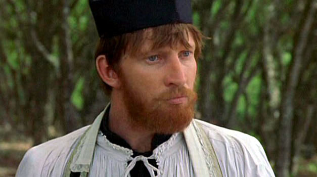

## **Klapbord**

**Father Damien**
is de titel van het historische filmeposis hoofdzakelijk _een Vlaamse productie_. In Vlaanderen is de film uitgebracht onder de titel _Damiaan_, terwijl de internationale titel _Molokai: The Story of Father Damien_ is. Die wordt gewoonlijk verkort tot _Father Damien_.

>Na haar wereldpremière op woensdag 10 maart 1999 (Antwerpen) oogstte de film van regisseur _Paul Cox_ bij de filmpers een onbarmhartige kritiek. De toeschouwers reageerden echter positief op de film. Die is en blijft _de belangrijkste film over de historische figuur van pater Damiaan_.

>De toeschouwer kijkt geboeid naar de film over de merkwaardige geschiedenis die zo onvoorstelbaar is dat geen menselijke verbeelding ze zou kunnen bedenken. De grote episode van _Damiaans leven en sterven op Molokai_ komt helder in beeld, mede dank zij het scenario van Briley dat gebaseerd is op het historisch onderzoek dat de Vlaamse historica _Hilde Eynikel_ heeft gepubliceerd onder de titel _Damiaan. De definitieve biografie_ (1999).

## **Synopsis**

Na een korte introductie in Honolulu waar _de jonge Vlaamse pater Damiaan_ zich als vrijwilliger opgeeft om als priester naar _het lepra-eiland Molokai_ te vertrekken, evoceert de film het verblijf van Damiaan op Molokai. Het verhaal begint met zijn aankomst tot aan zijn dood als melaatse priester. De film schenkt vooral aandacht aan _het spiritueel portret van pater Damiaan_, zijn innerlijke strijd, en aan het menselijk portret dat het engagement van pater Damiaan toont voor de menswaardigheid van de leprazieken die op het eiland zijn gedumpt. Daarbij komen enkele belangrijke, historische nevenpersonages in beeld.

>Er is vooral _Rudolph Meyer_, de Duitse ingenieur die met zijn gezin aan de bovenkant van de pali woont, en het algemeen toezicht houdt op de leprozerie. Hij wordt een bondgenoot van Damiaan.

>Daarnaast is er _William Williamson_, verpleger, patiënt, Brit en protestant. De man is besmet geraakt tijdens zijn werk als verpleger in Honolulu en, ook verbannen naar Molokai, wacht hij nu op de spoedige komst van de dood.

>De jonge dokter _Nathaniel Emerson_ komt Damiaan helpen, maar hij houdt de alomtegenwoordige ellende niet uit en vertrekt.

>Andere tijdelijke bezoekers geven de jonge priester moed, vooral omdat ze zijn werk bewonderen en het ook materieel en/of medisch ondersteunen. Een echte riem onder het hart is het bezoek van _princes Liliuokalani_.

>Wanneer hij al melaats is geworden, krijgt pater Damiaan assistentie van broeder _Joseph Ira Dutton_ en blijvende hulp van de Belgische priester _Louis-Lambert Conrady_. In 1888 krijgt de melaatse Damiaan ook bezoek van _Edward Clifford_, Britse schilder en schrijver die een portret schildert van hem. Op het einde komen enkele zusters onder leiding van _Ann Cope_, zuster Marianne, de stervende zieke priester helpen en bijstaan.

## **Cinematografie**

**CONFLICT TUSSEN LYRIEK EN EPIEK.** De toeschouwer ervaart dat de film lijdt onder _het esthetische conflict_ tussen de filmdichter Paul Cox die zijn trouw aan de historische waarheid op een _poëtische_ wijze wil vertolken en de eisen van de productie die de opdracht gaf voor een _epische_ film, bestemd voor een groot publiek.

>De eisen van de epiek vragen voortgang, strak ritme, spanning. Het is duidelijk dat Cox soms meer _filmische tijd_ zou willen voor het beeld zelf. Dat is het geval bijvoorbeeld bij _de openingsscène_ waarmee hij de personage van Damiaan en de lepra via het meisje Maulani introduceert. Oorspronkelijk opgenomen via een prachtig gecomponeerde pan, is het beeldend elan van die introductie op de montagetafel tot een minimum gereduceerd en is de epische kern – de achtervolging – maximaal op de voorgrond gebracht.

>In dezelfde geest worden enkele cruciale scènes te abrupt afgebroken. De toeschouwer leeft zich in de dramatische situaties in – vooral de scène van de overboord gegooide melaatsen, de biechtscéne – maar de montage dwingt hem direct over te schakelen naar een volgend tafereel.

>Het is duidelijk dat Cox tal van sequenties heeft willen laten uitmonden in _een lyrisch-poëtisch en bezinnend moment_. De eisen van de _epiek_ halen het daarbij af en toe van de _lyriek_. Maar die plaatsen waar de strijd duidelijk zichtbaar is en waar het dictaat van de epiek bij de montage het verlangen van de lyriek, het beeld, afremt, zijn uitzonderingen, geen algemene regel. In de versie van  Cox zelf, de ‘director’s cut’ genoemd, is dat conflict tussen epiek en lyriek in het voordeel van de lyriek beslecht.

**KLANKBAND.** Een van de sterkste en tevens unieke cinematografische kwaliteiten van **Father Damien** is de klankband. Die vormt een unieke compositie met de originele filmmuziek van de Belgische componist _Wim Mertens_ en de natuurlijke geluiden van _de wind op het eiland Molokai_ zelf.

>Het is de grote verdienste van de productie dat de opnames zijn kunnen gebeuren op Molokai zelf. _As Music in the Trees_ is de titel van een nummer van Wim Mertens. De titel verwijst naar een scène van Damiaan met een blinde leprajongen. Wanneer de priester de jongen vraagt waarom hij niet slaapt, bekent de jongen bang te zijn van de wind. Damiaan stelt hem gerust:_'Denk aan de wind als muziek in de bomen'_. De angst om de wind bij de jongen is geen inbeelding. In feite deelt Damiaan dezelfde angst. Alle leprabewoners kennen dat gevoel. Het hoort bij de plek. De wind regeert immers als heer en meester over Kalaupapa, het schiereiland van Molokai.

**PANORAMISCH BEELD.** De cinematografie van **Father Damien** is gekenmerkt door _het poëtisch gebruik van het panoramische beeld_. Via de pano laat Cox de spirit van de plek, _de genius loci_, het beeld mee componeren.

>Die genius loci is hier audiovisueel: zichtbaar verschijnt de geest van de plek in het landschap van de oceaan, het schiereiland en het gebergte, de pali, en hoorbaar laat die geest zijn stem weerklinken met _de kracht van de wind_. Daar waar het kan en zinvol is, laat Cox op de klank- en beeldband ofwel via korte inlassen ofwel midden in de scène zelf, de wind mee het portret van Damiaan regisseren.

>Het gebruik van een super 35mm camera bevordert de filmpoëtische werking van de panoramische beelden. Cox ent het verhaal op de geografische realiteit van de wind en geeft daardoor aan het filmportret van Damiaan een poëtische dimensie. De wind groeit zo uit tot een _metaforisch_ element dat geleidelijk de waarde krijgt van de hoeksteen van de betekenisruimte van de film.

## **Betekenisruimte**

**IN HET TEKEN VAN HET KRUIS.** Midden in de betekenisruimte van de film staat _het christelijke kruis_.

>Damiaan maakt verschillende keren _het kruisteken_: om te bidden nadat hij als eerste vrijwilliger aangeduid is om als priester van de melaatsen naar Molokai te gaan, om zijn eerste mis te beginnen op Molokai, voorts ook als opening van zijn preek over het gemis en het gevoel een outcast te zijn, of wanneer hij een biecht begint te horen; het gebeurt eveneens in zijn kerk wanneer hij er gaat bidden nadat Emerson hem duidelijk heeft gemaakt dat hij melaats geworden is.

>Naast het kruisteken, is er _het kruisbeeld_. Damiaan vindt een groot kruisbeeld in het vervallen kerkje van Molokai. Het beeld van _de Gekruisigde Jezus_ lijkt voor Damiaan een trouwe gezel te zijn. Het beeld lijkt hem zelfs te verwachten en te verwelkomen. Wanneer hij bewust is dat hij melaats geworden is, gaat hij de Gekruisigde danken voor de verschillende jaren die hij gezond is gebleven en heeft kunnen werken. Maar het beeld van de Gekruisigde spreekt ook van lijden en dood. De lepra is het gezicht van het lijden en de dood op Molokai. Het gewicht van die destructieve werkelijkheid weegt zwaar op Damiaans schouders en ook dat maakt deel uit van zijn diep eenzaamheidsgevoel. Hij die iedereen helpt, is zelf verstoken van iedere geestelijke bijstand. Vandaar Damiaans voortdurende nood om te biechten.

>De opvallende aanwezigheid van het kruisbeeld in talrijke Molokai-sequenties geeft _een religieuze, christelijke duiding_ aan het werk van Damiaan. Het kruisbeeld spiegelt er niet alleen het lijden van de zieken, het spreekt ook nog een andere taal. Damiaan is daar de tolk van.

>In zijn eerste preek op Molokai thematiseert hij niet alleen _het Kruis van Jezus_, hij verwijst er ook letterlijk naar. Na het maken van het kruisteken, introduceert hij de letterlijke verwijzing naar het kruisbeeld in zijn kerk als volgt:

 >>_'I do not have the disease that has sent you tot Molokai, but I want you to remind that all men know loneliness, all men know isolation and despair. And all men are afflicted in their hearts or in their bodies by sores and wounds that make them outcasts. Outcasts to all but Him…'_ 
 
 >Bij het woord _‘Him’_ draait Damiaan zich even om en wijst naar het beeld van de Gekruisigde. Welnu, in de scène die zich afspeelt in de werkkamer van de bisschop, blijkt er ook een kruisbeeld aan de muur te hangen. Cox filmt de scène zo dat de drie vertegenwoordigers van de macht met hun rug naar het kruisbeeld staan gekeerd. Zij keren zich niet om naar het kruisbeeld.
 
 >Cox vervolgt _de beeldspraak van het kruis_ tot in de sterfscène. Ook hier werkt hij beeldend, met name via het spel van  licht en donker in de vorm van licht en schaduw. In de scène vraagt zuster Marianne aan Damiaan om vergeving omdat zij, de zusters, zo lang hebben gewacht om naar Molokai zelf te komen. Ze vraagt hem zijn zegen. Een laatste keer maakt Damiaan het zegenende gebaar van het kruisteken. Cox filmt het gebeuren zo dat de schaduw van de zegende hand van Damiaan wordt geprojecteerd op de muur van de kamer. Die schaduw valt juist aan de voet van het kruisbeeld dat aan de muur hangt.

**IN HET TEKEN VAN DE WIND.** Wanneer Damiaan Little Bishop troost door de boze wind van Kalaupapa voor te stellen als muziek, dan gebruikt hij _een beeldspraak waarin de wind een nieuwe en helende dimensie_ krijgt.

>Tegenover de wind van Molokai plaatst Damiaan een andere wind, of beter: hij buigt die wind zoveel als hij kan om in een andere richting. Het windscherm dat hij bouwt, is daarvan een voorbeeld. In die scène stelt Cox Damiaan zelf voor als een krachtige wind. Dit raakt de kern van het beeldend denken dat Cox in **Father Damien** uitwerkt.

>De wind als beeldspraak die iets belangrijks onthult over de _betekenis van de figuur van Damiaan_. Geen oceaanwind, geen leprawind, maar _de wind als helende kracht_. De komst van Damiaan naar Molokai doet inderdaad in menig opzicht _een windscherm van helende humaniteit_ ontstaan. Hij schudt het stof dat de oceaanwind in de hut van William heeft geblazen, letterlijk uit de hut. In die scène gaat Damiaan met zijn rug naar de wind zijn. Ook al lijkt het hopeloos, hij wil een windscherm zijn voor de oceaan-en leprawind.

>In Cox’ filmische tekening van Damiaan krijgt de wind de betekenis van _opbouwende levensadem_. Damiaans aanwezigheid geeft adem aan de in wanhoop levende lepraleiders. Hij kan de ziekte niet genezen, maar hij brengt terug humaniteit in de aardse hel van Molokai. Zijn aandacht voor de kinderen, zijn verzet tegen alcoholisme en gedwongen prostitutie, Maulani die zich aan hem spiegelt en de kracht vindt om in een mooie scène neen te zeggen tegen ‘het goede leven’ van alcohol en goedkope seks.

>Damiaans aanwezigheid, zijn werk, geeft aan de hel van ‘het goede leven’ een andere windrichting. Zijn waken bij de stervenden in de dodenhut, deze en andere handelingen laten een weldoende wind van humaniteit waaien in de harten van de verweesde zieken. Wanneer de melaatse missionaris sterft, moet hij inderdaad buigen voor de leprawind. Maar tegelijkertijd geeft hij op Molokai een hele, andere wind gebracht. _Een wind die muziek maakt in de bomen_. Letterlijk: William sterft terwijl hij hoort hoe het melaatsenkoor van Damiaan _het Miserere_ instudeert.

>Muziek is wind, geluid, de adem van klanken. Muziek, dat zijn voor Little Bishop en al de andere melaatsen de woorden van Damiaan. Al die vormen van muziek krijgen een filmische ondersteuning door de eigenlijke filmmuziek, ingetogen, droevig, maar ook bezield.'De muziek in de bomen' is _de Heilige Geest, de helende geest, de goddelijke en bezielende Levensadem_ die door de eenvoudige Damiaan over Molokai is komen waaien. Dat is niet ongezien gebleven.

>Zijn getuigenis is uitgegroeid tot een begenadigd moment in de humane en religieuze geschiedenis van de moderne mensheid, waarvan Cox’ film niet alleen vertellend en episch, maar ook beeldend en poëtisch de herinnering doorgeeft.

## **Context**

De opdrachtfilm **Father Damien** van Cox is _een blijvend waardig en authentiek portret_ dat aan deze Vlaamse zoon van christelijke goedheid alle recht doet. Door de film kan pater Damiaan _een blijvende inspiratiebron_ zijn voor de  komende generaties. De film helpt begrijpen waarom pater Damiaan in 2005 tijdens een selectieprogramma van de VRT werd gekozen tot _‘de grootste Belg’_. Door de katholieke Kerk werd hij met name door paus Johannes-Paulus II op 4 juni 1995 _zalig_ verklaard. Op 11 oktober 2009 verklaarde  paus Benedictus XVI te Rome pater Damiaan _heilig_.

## **Links**

In 1999 schreef Sylvain De Bleeckere het filmdossier _Damiaan. Gevoelig episch en karaktervol filmportret._ In 2009 heeft hij dit herwerkt. Het uitgebreide dossier is [hier](http://www.menstis.be/blog/) te downloaden. 

© Sylvain De Bleeckere, Men(S)tis, 2011/2017
