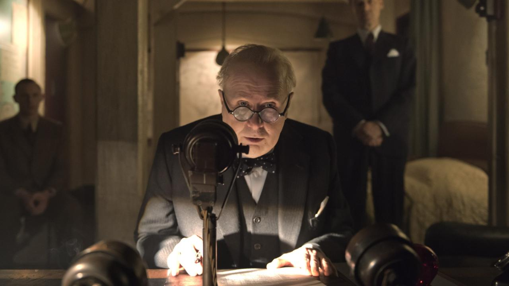

## **Klapbord**

De historische, Britse Oscarfilm van Joe Wright zoomt in op een weinig gekend historisch moment in het verhaal van de Tweede Wereldoorlog. Nochtans blijven die gebeurtenissen tot op heden het landschap van de huidige Europese Unie uittekenen. De Britse politicus Winston Churchill met zijn uitzonderlijk belangrijk politiek inzicht, zijn buitengewone moed en zijn unieke verantwoordelijkheidszin vormt de spilfiguur van die historische korte periode. In de meimaand van 1940 bevond zich aan de donkere kant van het machtsspectrum Hitler en zijn oorlogsregime, met wie de leiding gevende Engelse politici een deal wilden sluiten, aan de lichtzijde ervan stond de pas benoemde premier Winston Churchill helemaal alleen. Het beklijvende en immer actuele filmportret is sterk gebaseerd op nauwkeurig historisch onderzoek van al het schriftelijke, auditieve en beeldende archiefmateriaal. Het scenario is het werk van talentrijke Anthony McCarten, Britse auteur en producer. Hij kreeg de directe medewerking van de Churchill-familie en van de Churchill Archives. Hij verwerkte zijn scenario nog in een historisch boek met de gelijknamige titel: **Darkest Hour** (2017). De Britse film zelf kreeg internationale weerklank: zes Oscarnominaties, waarvan drie gewonnen Oscars, waaronder die voor de beste acteur in ‘leading role’ (hoofdrol) voor Gary Oldman, en die voor de beste film van het jaar. Gary Oldman won nog de Golden Globe en de Bafta (Britse Oscars) voor beste acteur, één van de zeven Bafta-nominaties, waaronder ook die voor beste film. De film werd volledig opgenomen in Engeland, onder andere in Chartwell House in Kent, van 1924 tot 1964 het geliefde landhuis van Winston Churchill en zijn vrouw Clementine. Het is nu een museum gewijd aan het leven en werk van Winston Churchill, beheerd door de National Trust. Er is eveneens gefilmd in en nabij Westminster, Londen. Het parlement, the House of Commons, dat werd gebruikt voor de film is een replica van het Britse parlement van de jaren veertig van vorige eeuw.

## **Synopsis**

Op 3 september 1939 verklaarden Engeland en Frankrijk de oorlog aan nazi-Duitsland nadat het met zijn infanterie, tanks en vliegtuigen op 1 september brutaal Polen was binnengevallen. In Downing Street 10 en in het Palace of Westminster, de zetel van de twee Britse parlementen (Houses of Parlement) heerste er paniek. De regering van de Britse premier Neville Chamberlain verkeerde in een permanente staat van crisis. Op 10 mei 1940 zette Duitsland zijn militaire agressie verder. Het lanceerde zijn Blitzkrieg in de neutrale landen België, Luxemburg, Nederland. Het doel: zo snel mogelijk de kusten bereiken, Frankrijk bezetten om dan snel Engeland aan te vallen. Op diezelfde 10de mei moest Chamberlain, tegen zijn zin, aftreden. Terwijl Hitlers Wehrmacht vanuit het epicentrum Berlijn over het Europese vasteland een nooit geziene politieke en militaire tsunami op gang bracht, bereikte in de meidagen van 1940 de politieke crisis in Londen haar absoluut dieptepunt. Wie moest de regering en het land met zijn bevolking doorheen die nooit geziene storm leiden? Wie kon en wilde een regering vormen die het land kon besturen nu een Duitse invasie van Engeland erg reëel begon te worden?  Het land moest op zoek gaan naar een politicus die Groot-Brittannië en ook de rest van Europa kon loodsen doorheen de grootste politieke, morele en militaire beproeving waarmee Engeland en Europa ooit werden geconfronteerd. De film **Darkest Hour** brengt de collectieve herinnering in beeld hoe Winston Churchill op 10 mei 1940 die gezochte politieke leider werd. Hij bleek de enig democratisch verkozen Britse en tevens Europese politicus te zijn die in staat bleek op te staan tegen de dictator Hitler en diens naziregime. Dat gebeurde in de beslissende weken van mei 1940, toen nog niemand wist wat er zou volgen, laat staan dat er toen al iemand kon voorzien dat het zo overmachtige nazi-Duitsland met zijn politieke en militaire leiders vijf jaar later dramatisch ten onder zou gaan.

## **Cinematografie**

**OP HET RITME VAN DE HISTORISCHE MEIDAGEN**

De Churchill-film is geen biografische film. Het is wel een historische film die inzoomt op een bepaalde sectie van de zeer bewogen eerste helft van de twintigste eeuw. De verhaalstructuur van Darkest Hour bestaat uit een kalender, gevormd door enkele dagen van de meimaand van 1940. Na de generiek volgen verschillende fasen van de historische gebeurtenissen die zich in het Londen van toen hebben afgespeeld. In de eerste helft van mei gaat het om de dagen van 9, 10 en 13 mei. Het dramatische zwaartepunt situeert zich eind mei met de dagen 25, 26, 27 en 28 mei. De kalenderstructuur onderlijnt het historische karakter van het verhaal. De film reconstrueert zo exact mogelijk de gebeurtenissen op het moment dat ze zich afspelen in de tijd. De toeschouwer aanschouwt het verloop ervan. De film is dus geen flashback waarbij achteraf op de gebeurtenissen wordt teruggeblikt. Het blikveld van de film is daarentegen helemaal dat van de historische personages die zich midden in de gebeurtenissen bevinden zonder te weten waarmee ze de volgende dagen, weken en maanden zullen worden geconfronteerd. Ze kunnen met andere woorden de implicaties van hun gemaakte keuzes niet overzien. Alleen de toeschouwer van de film is in staat om de personages te volgen tijdens het verloop van de gebeurtenissen vanuit hun actuele kennis over wat de historische gevolgen zijn geweest van de beslissingen die de historische figuren toen in die bewuste maand mei hebben genomen: de overwinning van de geallieerde troepen, de smadelijke nederlaag van Hitlers Duitsland. Een bijkomend effect van die kalender-verhaalstructuur is de verwondering over de korte periode waarop de bewuste personages zo’n grote en uiterst belangrijke beslissingen hebben moeten nemen. 

**HET DRAMA VAN DE INTERNE OORLOG**

De eerste dag, 9 mei, staat helemaal in het teken van het ontslag van de Britse premier Neville Chamberlain en voorzitter van de Conservatieve Partij. De oppositieleider, de voorzitter van de Labour Partij, Clement Antlee schreeuwt het uit: 

>>_Mr. Speaker, we zijn in oorlog en Mr. Chamberlain is onbekwaam om ons in oorlogstijd te leiden. We zullen nooit toetreden tot een grote coalitie met de regerende Conservatie Partij geleid door mijnheer Chamberlain._ 

Tegen zijn zin en die van de kopstokken van zijn partij, vooral zijn vriend en bondgenoot, de aristocraat Lord Edward Wood, de derde graaf van Halifax, sinds 1938 minister van Buitenlandse Zaken in de regering Chamberlain. Iedereen aan de top van de Conservatieve Partij wil Halifax als nieuwe eerste minister. Dat zou neerkomen op een kleine stoelendans met de voortzetting van de huidige bewind als gevolg. Op 10 mei moeten Chamberlain-Halifax erkennen dat alleen Winston Churchill aanvaardbaar is voor de oppositie. De koning George VI steunde Chamberlain en moest tegen zijn zin Churchill de opdracht geven een nieuwe regering te vormen.

De dramatische verhaallijn is niet die van de militaire oorlog tussen Duitsland en Engeland. Natuurlijk is die voortdurend aanwezig, weliswaar zelden op de voorgrond, wel steeds op de achtergrond. Er komen verschillende belangrijke sequenties voor die zich afspelen in de War Room van de Britse oorlogsregering onder leiding van Winston Churchill. De historische War Room, vandaag een Londense trekpleister, is getrouw nagebouwd in de studio. In de War Room-sequenties overlegt het _War Room Cabinet_ met de militaire hoofdverantwoordelijken. Opmerkelijk daarbij ligt de focus van het filmverhaal op de interne, politieke oorlog die zich afspeelt tussen de nieuwe, kersverse premier Winston Churchill enerzijds en de vorige premier Nelville Chamberlain en de minister van buitenlandse zaken Halifax anderzijds. Churchill heeft namelijk zijn grote politieke opponenten  opgenomen in zijn oorlogskabinet. Hij wil immers tijdens die cruciale periode geen open oorlog binnen zijn eigen partij ontketenen. Zijn positie in zijn partij, de Conservatieve, is immers zwak juist omdat Chamberlain-Halifax tegen hun zin het premierschap van Winston hadden hebben moeten  accepteren. De dramatische klemtoon van **Darkest Hour** ligt op de onophoudelijke politieke poging van Chamberlain-Halifax om Winston als premier tegen te werken en hem te doen mislukken zodat zij het roer terug in handen kunnen nemen. Achter de rug van Winston spelen ze een weinig fraai politiek spel waarbij ze zelfs de koning betrekken. Wanneer Winston op 13 mei zijn eerste toespraak als premier houdt in het parlement dan verbiedt Chamberlain al de partijleden van de Conservatieve Partij, de partij van Winston, te applaudisseren. De dramatische lijn van de interne, politieke oorlog mondt uit in de slotsequenties. Daarin moet Halifax gelaten toezien dat Chamberlain aan de partijleden na de tweede toespraak van Winston in het parlement op 28 mei de toestemming geeft om samen met de Labour-partijleden te applaudisseren.

**DE GELUIDSCINEMATOGRAFIE VAN TWEE HISTORISCHE STEMMEN**

Een sterk cinematografisch punt van de film, is de bijzondere zorg voor de klankband. De ondersteunende filmmuziek van Dario Marianelli domineert niet en is vooral functioneel aanwezig in overgangsscènes. Karakteristiek voor de film daarentegen zijn de klanken, in het bijzonder die van de menselijke stem die beweegt tussen de stilte en het gesproken woord. Dat geldt in de eerste plaats voor de vier speeches van Winston Churchill in de film: in het parlement (13 mei), diens eerste radiotoespraak (eveneens op 13 mei), één voor de voltallige ministers en belangstellenden in het vertrek van het Outer Cabinet (28 mei) en de tweede toespraak voor het volledige parlement (eveneens op 28 mei). Daarbij werkt de regisseur het contrast uit tussen de twee historische antagonisten: Winston Churchill en Hitler. Met de film corrigeert Joe Wright het collectieve beeldgeheugen. Door de niet meer te tellen documentaires over de Tweede Wereldoorlog en het naziregime van Hitler is de balans zeer sterk gaan doorslaan in de richting van de retor Hitler. Alle documentaires gebruiken de footage dat afkomstig is van het naziregime. Dat muntte uit in het gebruik van het nog jonge filmmedium in dienst van de ideologische propaganda en brainwashing van de bevolking. Dat verklaart waarom er zoveel beeldmateriaal van Hitlers toespraken bestaan. Dat geldt niet voor zijn tegenpool Winston Churchill. Tijdens een korte scène, gesitueerd in de smalle gangen van het ondergrondse oorlogsministerie in Londen, hoort Churchill Hitler speechen op de radio in een van de kamers. Hij blijft even staan om te luisteren en stelt dan een opvallend gebaar. Hij gooit ostentatief de deur van de kamer toe. Hij legt de orakelende Hitler het zwijgen op. Andere stijl – stilte bezielde woorden de muziek van de taal versus het bulderende geschreeuw en sloganeske geroep eigen aan Hitlers spreekstijl. De film laat het volledige andere auditief spectrum zien van Churchills spreken zowel in de private als in de publieke sfeer. Hij werkte intens aan zijn een unieke manier van publiek spreken. Daarvan was vooral de radio het dragende medium. De radio speelde een cruciale rol tijdens de Tweede Wereldoorlog, vooral in Engeland en in het verzetsgroepen in de Duitse bezette gebieden. Voor de mannen en vrouwen in het verzet was de BBC-radio van wezenlijk belang. In Churchills radiospeeches vonden niet alle de Engelse bevolking, maar ook de mensen in het verzet motivatie en bezieling. Churchill was geschoold inde retorische Grieks-Romeinse traditie. In de film zoekt Churchill op zeker ogenblik naar zijn boek van Cicereo, de grote Romeinse juridische retor. Tegelijkertijd was Churchill ook, zoals iedereen in Engeland, gevormd door de impressionante, Shakespeareaanse theatertraditie. Vooral door de opnames van Churchills speeches voor het Engelse volk via de BBC-radio kon de acteur Gary Oldman zich perfect voorbereiden om zo dicht mogelijk bij de klank en de toon van Churchills stem te komen. Door zijn vertolking slaagt Oldman erin om de unieke spreekstijl van Churchill bijzonder aanwezig te brengen. In fel contrast met Hitler beweegt Churchills spreekstijl vanuit de geladen stilte. Zij is de bron van de woorden die hij zoekt. De stilte tussen de zinnen en de woorden vertolkt zijn contemplatieve geest. Hij denkt voortdurend, ademt alle gebeurtenissen die tot hem komen in, beschouwt ze en probeert die dan te verwerken in klank en woord. Daarom legt de film ook de nadruk op het typische gemurmel van Churchill. Hij dacht intens na, zocht woorden, vond die niet altijd, maar hij zocht verder. Hij gaf niet op. De film capteert dit fenomeen treffend in de korte, maar sprekende scène met de laatste seconden voor de eerste radiotoespraak op 13 mei. De BBC-regisseur jaagt Churchill op die nog tot op de laatste seconde aan zijn tekst aan het werken is. De eerste seconden van de toespraak bestaan uit stilte. Vanuit die gewijde stilte vloeien dan de woorden die die stilte met zich meedragen. Ook in een ontroerende scène met Churchill en zijn onmisbare secretaresse, miss Layton, schenkt de regisseur aandacht aan het ontstaan van Churchills unieke spreekstijl. Hij vindt zijn woorden niet op 27 mei, de dag voor zijn grote speech in het parlement. Hij struikelt over hoe hij Hitler zal noemen, de man tegen wie hij het moet opnemen, zij het met ongelijke wapens. Hitler boekt immers met zijn Blitzkrieg de ene overwinning na de ander. Churchill krijgt voortdurende nieuws van het oorlogsfront dat altijd maar slechter en slechter wordt. Churchill is ook en vooral ontmoedigd door de interne tegenwerking. Miss Clayton verstaat hem niet.

>>Ze zegt: ‘_You were mumbling_’ (mompelen). 
>>Hij reageert: ‘_The right words won’t come_.’ (‘_De juiste woorden komen niet._’) 
>>Zij troost hem: ‘_They will come sir. No one can put words together like you._’ (‘_Ze zullen komen, sir. Niemand anders dan jij kan woorden bij elkaar brengen._’)

**AUTHENTIEK FILMPORTRET**

De film oogt als een levend portret van de zestiger Winston Churchill. Toen hij premier werd in mei 1940 was hij al goed 65 geworden. Dat Darkest Hour oogt als een authentiek historisch filmportret, daar tekent Joe Wright voor. Hij heeft echter zijn doel kunnen bereiken dankzij het bijzondere acteertalent van Gary Oldman. De Britse acteur mocht voor zijn prestatie in 2018 terecht verschillende hoogste prijzen in ontvangst nemen. De acteur lijkt nochtans helemaal niet op de echte Winston Churchill. Oldman heeft een grote transformatie moeten ondergaan en is in zijn rol als Churchill zelf niet meer herkenbaar. Zelf heeft Oldman zich een jaar lang toegelegd op de studie van de houding en de manier van spreken, eigen aan Winston Churchill. Daarvoor kon hij gebruik maken van het uitgebreid klank- en beeldarchief. Oldman is een telg uit de Britse theaterschool. Toch is een vertolking voor film iets helemaal anders dan spelen op een podium. Dit laatste is statisch, terwijl de filmcamera voortdurend zelf in beweging is. Bovendien beschikt de camera over verschillende lenzen die kunnen uit- en inzoomen. De camera blijft ook altijd gefocust. Hij verliest de personages nooit uit het oog en hij kan de kleinste details registreren. Dit betekent hier dat de camera veel aandacht besteed aan de lichaamstaal van het hoofdpersonages zowel in de privésfeer als in het publieke domein. Oldman is er met zijn regisseur Wright in geslaagd om beeldend de historische Churchill terug tot leven te brengen, iets wat archieffoto’s en –beelden, hoe belangrijk ze ook zijn, zelf niet meer kunnen.

**COMPOSITIE MET DONKER EN LICHT**

De filmtitel introduceert een belangrijk cinematografisch gegeven. Niettegenstaande de film in kleur is, componeert Wright zijn Churchill-film met het coloriet  ‘donker–licht’. Eerst en vooral zijn er twee bijzondere momenten waarop het beeld helemaal donker kleurt. Dat gebeurt bij het begin van de episode 10 mei en bij de opening van het slottafereel van de episode 27 mei. In beide voldonkere beelden bevindt zich Winston Churchill. In de scène van 10 mei gebeurt de introductie van het hoofdpersonage en een belangrijk nevenpersonage. We bevinden ons in de slaap- en werkkamer van Churchill. Van zodra hij ontwaakt – hij werkt tot laat in de nacht – neemt hij het ontbijt in bed en begint hij te schrijven door te dicteren. In de bewuste scène voltrekt zich de introductie van de werkende Churchill en zijn nieuwe typiste en secretaresse, miss Clayton. De twee worden onafscheidelijk. Churchill denkt zo snel dat de typiste hem soms amper kan volgen. Nadien neemt hij de getypte tekst nog door en corrigeert die met een pen. Daarom moeten alle teksten een dubbelle spatie hebben. Wanneer miss Clayton de kamer betreedt, stapt ze binnen in het donker. Op dat ogenblik gaat het eerste licht aan. Churchill ontsteekt een lucifer om zijn eerste sigaar van de dag aan te steken. Met andere woorden, hij zal de komende weken in mei degene zijn die het licht aansteekt in de alsmaar donkere tijden. Het tweede moment van volledige duisternis komt voor in het laatste tafereel van de episode van 27 mei, het slottafereel met de koning. Churchill bevindt zich dan politiek en emotioneel op het meest donkere punt van zijn prille premierschap. Hij ziet geen licht meer. Hij zit in een volledig donkere kamer. Plots gaat de deur op. Zijn vrouw Clementine kondigt de komst van een onverwachte gast aan op het late avondduur: de koning in eigen persoon. Nu brengt de koning het licht naar Churchill. Voorheen steunde hij Chamberlain en Halifax en stond hij onder hun anti-Churchill invloed. Maar hij is geleidelijk aan waardering gaan krijgen voor de nieuwe premier. Hij kom hem melden dat hij nu af aan aan zijn kant staat. Uit dat bijzonder gebaar put Churchill de moed om de volgende dag, 28 mei, definitief zijn eigen lichtspoor te volgen. Er komen nog enkele frappante taferelen voor waarin de regie met ‘donker – licht’ betekenisvolle accenten plaatst. Dat betreft de belangrijke taferelen in het parlement, het House of Commons. Op 9 mei, het eerste parlement-tafereel, staat de oppositie in het licht – de Labourleider Clement Attlee is aan het woord. De zijde van de regering onder leiding van Chamberlain zit in het indirecte licht. In de volgende taferelen met premier Churchill staat de regeringsleider in het licht, waarbij het opvalt dat nu het volle licht schijnt op de Speaker’s Table (de Sprekers Tabel), ook Clerk’s Table genoemd. Op de tafel liggen onder andere de boeken met de democratische basiswetten van het Britse volk samen met de Despatch Boxes. Dat zijn historische houten kisten waarop de regeringsleden, met als eerste de premier, en de oppositieleider hun teksten leggen van de redes die ze houden. Regisseur Wright  zorgt er tijdens de speeches van Churchill altijd het volle licht valt op de belangrijke tafel. Het personage van Churchill staat mede aan de tafel in het volle licht. Ook een betekenisvol lichtmoment doet zich voor wanneer Winston samen is met zijn vrouw Clementine. Dat is al het geval vanaf hun eerste verschijning samen in de episode van 10 mei. Ze zitten naast elkaar op de rand van Winstons bed. Ze zitten samen in het volle licht dat door het grote raam de kamer vult, die kamer die in het begin van de episode alleen maar donker kende. Clementine zegt daar tegen haar man die op het punt staat geroepen te worden om premier te worden:

>>_I want others to love and respect you, as I do._ 
>>(_Ik wil dat anderen van u houden en u respecteren zoals ik doe_.)
 
Met die lichtscène van Winston en Clementine is de toon gezet: beiden vormen een en dezelfde lichtbron in het donkerste uur dat de Britse natie kent. Beiden vormen een geheel, een feminiene en een masculiene component die elkaar in balans houden. In de momenten die volgen, zal premier Churchill verschijnen als een lichtbron in de duisternis van de toenmalige politieke omstandigheden. Zo schijnt in de episode van 13 mei de lamp op zijn gelaat in de BBC-opnamekamer die voor het overige erg duister is. Na die opname loopt hij door de donkere gang van het ondergrondse complex waar de Britse regering tijdens de oorlog werkte. Na de opname stapt Churchill door de flauw verlichte gang naar de lift die hem naar de bovengronds woonvertrekken van de premier zal brengen. De regisseur filmt dan de liftscène. In het midden van een volledig donker beeld beweegt de verlichte lift met de premier naar boven. Diens eerste BBC-speech vormt een eerste, bescheiden stap opwaarts naar het nog zwakke licht in een overweldigende donkerte.

**OOG VOOR DETAILS**

Regisseur Wright zet alle cinematografische middelen in voor het filmportret. Dat impliceert een goed oog voor details. Close-ups maken hier wezenlijk deel uit van het levende portret. Ze helpen de uniekheid van de persoon in kwestie in de verf te zetten. Daartoe behoren de close-ups van de sigaar, de lucifer, de ring, de whisky, de blik, de mond, de typemachine, de letters op het blad. Die detailbeelden zijn met elkaar verweven. Ze typeren namelijk de wijze waarop Churchill leeft en werkt. Ze kenmerken de eigen lichaamstaal van Churchill; ze ogen als directe expressies van de denkende politicus Churchill. De sigaar en de ring zijn historisch, evenals de typemachine waarop letterlijk de teksten van Churchill zijn ontstaan via de snelle vingers van miss Layton. Die details die de gewone beelden versterken en naar hun eigenlijk betekenis verwijzen, schilderen de snel denkende geest van Churchill. Churchill ontwikkelde een persoonlijke stijl om een sigaar te roken en een glad whisky te drinken, als deel van zijn werkritueel. Zijn vijanden gebruikten dat om zijn naam te bekladden. Voor hem hoorden die zaken tot het ritueel om zich te concentreren en te focussen. Van zodra hij begon te werken, stak hij een sigaar aan. Dat verklaart de introscène in zijn slaapkamer die eveneens een werkkamer was. Ook bij de uitwerking van Churchills tegenpool, zijn voorganger Chamberlain, gebruikt de regisseur de close-up, met name van diens witte zakdoek. Met die close-up tegenpartij beschrijft Wright een narratieve inclusie. Ze opent op het einde van de eerste episode, die van 9 mei, en sluit in de close-up van de witte zakdoek bij de afsluiting van de laatste episode, die van 28 mei. Bij de eerste gaf Chamberlain aan de partijleden het teken om niet te applaudisseren voor Churchill door zijn witte zakdoek weg te steken. Op 28 mei veranderde hij van mening. Met het teken van de witte zakdoek gaf hij toe dat Churchill had gewonnen.

**SLOW MOTION**

De film kent ook twee taferelen in slow-motion. Telkens gaat het om het gebruik van de subjectieve camera, het blikveld van het hoofdpersonage. Het eerste tafereel situeert zich in de episode van 10 mei. Churchill rijdt naar Buckingham Palace voor zijn eerste audiëntie met de koning. In de taxi observeert de mensen die langs de weg voorbij lopen op weg naar hun werk of hun thuis. De slow-motion onderstreept het belang hiervan. Die beelden van gewone mensen in de stad horen bij de observatie, de scherpe en open blik van  de toekomstige premier. Die beelden tonen hoe hij zich verbonden weet met de stadsbewoners. Hij zorgt om hun lot vanuit zijn kennis over de concrete oorlogssituatie die zich dan aan het voltrekken is. Het tweede tafereel in slow-motion kent dezelfde dynamiek. In de laatste episode, die van 28 mei, is Churchill op weg naar de vergadering in de War Room. Opnieuw focust hij zich op de concrete mensen. Hierdoor beslist hij op zeker ogenblik uit de taxi te stappen en de metro te nemen. Het metro-tafereel vormt het dramatische hoogtepunt van de film. De ervaringen die Churchill daar opdoet, de concrete mannen, vrouwen en kinderen die hij daar leert kennen, leveren hem de mentale grondstof die hij nodig heeft om de moeilijke politieke beslissing als oorlogspremier te nemen. Die beslissing brengt hem naar zijn toespraak in het Outer Cabinet, gevolgd door zijn belangrijke speech in het parlement, het crescendo van de hele film **Darkest Hour**.

## **Betekenisruimte**

**DE OORSPRONG VAN HET DONKERE UUR**

De film opent met een heel korte maar betekenisvolle korte proloog, een pregeneriek. Die bestaat een triptiek in zwart-wit beelden. Ze vormen een montage van archiefbeelden van nazi-Duitsland. Achtereenvolgens verschijnen gehelmde Duitse soldaten, opgesteld in een perfecte rij, gevolgd door eveneens perfect op één rij opgestelde kanonlopen van tanks, waarna een korte sequentie volgt met Hitler die zijn generaals instructies geeft op een militaire kaart. Die openingstriptiek roept de herinnering wakker aan de directe oorzaak van Europa’s ‘donkerste uur’. De term ‘_darkest hour_’ komt van Churchill zelf. Hij gebruikt het in zijn eerste toespraak als premier in het parlement. Churchill ontleent de term zelf aan de Bijbel, meer bepaald aan Jesaja 58: 8-10. Churchill gebruikt de benaming ‘darkest hour’ in een concrete, actuele zin. Hij beschrijft ermee de heersende toestand waarin Engeland en de ander Europese landen zich dan bevinden. Hitler ontketende met zijn militair naziregime een wereldbrand. Hij had in dat kader een nieuwe strategische stap genomen: de opening van het westelijke front met een Blitzkrieg in de neutrale Lage Landen, waaronder België, en Frankrijk met als doel: een mogelijke samenwerking tussen Frankrijk en Engeland verhinderen, en een aanval op Engeland voorbereiden. De eigenlijke betekenis van die eerste sequenties van Darkest Hour licht op door het contrast met de eerste sequenties na de filmtitel. Van dan af situeren de beelden zich in Engeland, vooral in London. De eerste sequenties, gesitueerd op 9 mei, plaatsen de toeschouwer midden een parlementair debat. De oppositieleider Clement Attlee eist dat de premier Chamberlain en zijn regering opstappen. Opmerkelijk valt dan het eerste gesproken woord in de film. De Speaker of the House roept driemaal: ‘Order!’.  De Londense parlementszitting is alles behalve een toonbeeld van orde. De parlementsleden luisteren, maar reageren spontaan en luid. De oppositieleden, de meerderheidsleden, allen zijn ze betrokken in een open forum van uitgesproken gedachten en voorstellen waarvoor ze hun goed- of afkeuring laten blijken. Dat vormt een enorm contrast met de Duitse openingssequenties. Het nazibeleid van Führer Hitler legt een perfecte orde op. De Engelse democratie ontstaat uit een chaos van botsende gedachten en voorstellen, uitgesproken door verkozen parlementsleden. De roep ‘order’ van de Speaker is geen dictatoriaal bevel dat met wapens en terreur wordt afgedwongen. Een van de eerste maatregelingen die de nieuwe kanselier Hitler na zijn aanstelling op 30 mei 1933 uitvaardigde, leidde tot het sluiten van het eerste Duitse, democratische parlement, dat van de Weimarrepubliek, ontstaan na de Duitse nederlaag in Wereldoorlog I. Van dan af kende Duitsland maar één stem, het bevel van de Führer. De aanwezigen, de nazi-partijleden, mochten enkele nog op maat applaudisseren. Met andere woorden, de film Darkest Hour, plaatst de werking van een democratische samenleving tegenover die van nazi-Duitsland, een samenleving gebouwd op de steen van terreur en blinde gehoorzaamheid. De tegenpool van Hitler is Winston Churchill. In de film wordt de historisch juiste uitspraak aangehaald dat Hitler maar van één man schrik had, en dat was Winston Churchill. De film is opgebouwd naar het crescendo van de toespraak van Churchill op 29 mei in het parlement. Dan blijkt dat hij van onderuit de orde waarnaar de Speaker in het begin naar vroeg, heeft tot stand gebracht. Die democratisch verworven orde zal de dictatoriale orde van Hitler verslaan. Daartoe moest op 29 mei nog een hele weg worden afgelegd. De eerste stap was gezet. 

**DE GROOTSTE BEPROEVING OOIT**

In zijn eerste toespraak op 13 mei voor het parlement spreekt Churchill over ‘_an ordeal of the most grievous kind_’. Die zin spreekt hij direct uit na de historische woorden ‘_I have nothing to offer but blood, toil, tears and sweat_’ uitspreekt. ‘_Ik heb niets te bieden behalve bloed, labeur, tranen en zweet_’. De reden van dat alles, zo verduidelijkt hij, is het feit dat het land zich bevindt voor ‘beproeving van de ergste soort’. De ‘blood, toil, tears and sweat’-zin is in het collectieve geheugen blijven hangen. De daarop volgende ‘_ordeal_’-zin daarentegen is in de vergetelheid geraakt. Niemand anders dan Churchill zelf begreep de volle betekenis van die zin. De film laat nu zien wat die voor Churchill zelf inhield. De ‘blood, toil, tears and sweat’-zin slaat natuurlijk op het hele land dat officieel in staat van oorlog verkeert met uit zijn as herrezen Duitsland. In mei 1940 ondervoed de Engelse bevolking nog praktisch niets van die oorlog. Maar het ‘bruine’ gevaar kwam nader. Op 10 mei was het zover. Hitler startte zijn Blitzkrieg richting Engeland. In zijn toespraak doelde Churchill niet alleen op de naderende, militaire confrontatie met Hitlers troepen. Hij zelf begreep ook de echte beproeving waarmee hij werd geconfronteerd. Die bestond in de ontmoediging, de wanhoop die dreigde bezit te nemen van de natie. Iedereen was zonder uitzondering danig onder de indruk van de Duitse militaire overmacht. Iedereen, zonder uitzondering,stelde zich hardop de vraag die Britse historicus Tim Bouverie in zijn boek _Appeasing Hitler. Chamberlain, Churchill and the Road to War (2019)_:

>>_How was it that a country defeated in 1918, reduced in size, restricted in arms and surrounded by potential foes, was allowed to rise in twenty short years to a position where she was able to mount a challenge for global supremacy and almost achieve her objective?_ (p. 414)

Niemand zag een uitweg. De beproeving van de ontmoediging woog steeds zwaarder en de bekoring om eraan te bezwijken nam overmaats toe. Ook Churchill kon niet zomaar een oplossing uit zijn mauw schudden. De twee volkomen donkere beelden in de film, gesitueerd in de episodes van 10 mei en 27 mei, roepen die beproeving van ontmoediging, ook bij Churchill, op. Maar er is meer. De zwaarte van die beproeving kwam helemaal terecht op de persoonlijke, politieke schouders van Churchill. Alleen hij zelf voelde dat gewicht dat hij moest torsen. Dat gewicht kwam niet rechtstreeks van de oorlogszucht van Hitler, maar van de eigen partij, ondersteund door het Engelse koningshuis: Neville Chamberlain, premier en partijleider van de Conservatieve Partij, waarvan Churchill zelf ook lid was, en Edward Wood, Viscount Halifax genoemd? Beiden deden er alles aan om Churchill van het premierschap te houden en zelfs wanneer de kersverse premier Churchill hen beiden opnam in zijn War Room Cabinet als volwaardige ministers, hielden ze niet op met Churchill te dwarsbomen en zelfs achter zijn rug samen te zweren om hem ten val te brengen om daarna via het premierschap van Halifax het beleid van Chamberlain voort te kunnen zetten. Churchills beproeving bestond dus niet alleen uit de naderende oorlogsmachine van Hitler, maar ook uit de harde, interne tegenwerking in eigen politieke rangen bij monde van zijn oorlogsministers Chamberlain en Halifax. Hij had zelf zijn politieke vijanden in eigen partijrangen als ministers aangesteld bij wijze van politiek gebaar van verzoening. De beproeving van politieke zwaarte betekende voor Churchill persoonlijk een existentiële beproeving van een voor hem zelf nooit eerder geziene grootte. 

**HET EIGEN EGO, DE GEVAARLIJKE BLINDHEID VAN POLITIEKE VERWAANDHEID**

 In het derde seizoen van de veel geprezen en bekroonde televisieserie **The Crown** bezoekt koningin Elisabeth II Winston Churchill op zijn sterfbed. Daar zegt ze tegen hem: ‘_Where would Great Britain be without its greatest Briton?_’ Of dit bezoek er is geweest en wat de koningin heeft gezegd, is niet  geweten. Scenarist Peter Morgan heeft in die scène de sterke band tussen Winston Churchill en de koningin weten samen te vatten. En als koningin vertolkt ze de mening van alle Britten die in 2002 Winston Churchill als de grootste Brit aller tijden hebben gekozen. Die nationaal-Britse waardering mag vandaag vanuit een breder perspectief worden uitgebreid tot: ‘De grootste Europese politicus die tot nu toe heeft geleefd.’ Waarom? Hoever reikt zo’n uitspraak?

**Darkest Hour** helpt om een antwoord te vinden. Churchill wist de Britse natie de zwaarste beproeving ooit te overwinnen. Meteen gold die overwinning ook voor de grootste beproeving waarmee tegelijkertijd Europa werd geconfronteerd. De draagwijdte van die overwonnen beproeving, zo laat **Darkest Hour** op grond van degelijk archiefonderzoek zien, strekt zich uit tot wat we vandaag ‘politieke verantwoordelijkheid nemen’. Die woorden zijn niet onschuldig. Ze worden te pas en te onpas gebruikt. De enen vinden dat ze hun politieke verantwoordelijkheid nemen, terwijl de anderen het omgekeerde beweren. Tragisch genoeg, zijn het meestal de feiten achteraf die onthullen wie zijn politieke verantwoordelijkheid wel of niet heeft genomen. Darkest Hour toont duidelijk dat Churchill dat duidelijk wel heeft gedaan. De film realiseert dat door aandacht te besteden aan Churchills antipoden: Chamberlain en Halifax. Zij vormen dan ook de belangrijkste nevenpersonages. Het helpt veel wanneer de toeschouwer van Darkest Hour enige voorkennis bezit over beide historische, Britse politici. De zwaarste beproeving voor de Britse natie, de bezette Europese landen en Churchill persoonlijk ontsprong niet alleen aan Hitlers politieke waanzin, maar evenzeer uit het Engelse buitenlandse beleid dat Chamberlain samen met Halifax voerde. Vanaf 1933, het begin van Hitlers kanselierschap, was ‘_appeasement_’ het codewoord van dat beleid. Deze term is sinds die tijd niet alleen een historisch, maar tevens ook blijvend diplomatiek begrip geworden. Letterlijk betekent ‘_appeasement_’ ‘_verzoening, concessie, kalmering, toegeving_’. Concreet formuleerde Chamberlain zelf zijn beleid in een brief van januari 1938 aan een kennis als volgt:

>>_The dictators are too often regarded as though they were entirely inhuman. I believe this idea to be quite erroneous. It is needed the human side of the dictators which makes them dangerous, but on the other hand, it is the side on which they can be approached with the greatest hope of successful issue._ (Bouverie, o.c.,  p. 131)

Met andere woorden Chamberlain geloofde in zijn persoonlijk talent om het menselijke in heersende Europese dictators aan te kunnen spreken om zodoende erger te kunnen voorkomen. Concreet was hij er heilig van overtuigd om Hitler tot redelijkheid te kunnen brengen en zo een vredesverdrag tussen Duitsland en Engeland te kunnen realiseren. Daartoe was hij bereid Hitlers aanspraken op nieuw Duits grondgebied in Centraal-Europa (Oostenrijk, Sudetenland, dit is een stuk van Tsjecho-Slovakije, Polen in te willigen. Om hij beleid te realiseren, gingen Chamberlain en Halifax heel ver. Ook letterlijk. Op 17 november 1937 reisde Halifax persoonlijk naar Berlijn en nam daar de nachttrein naar Hitlers schuiloord Berghof in Brechtesgarten. Hij onderhandelde er persoonlijk met Hitler. Daarna reisde Chamberlain zelf nog drie keren kort na elkaar naar Duitsland om er persoonlijk met Hitler te spreken. De eerste keer, op 15 september 1938, nodigde Chamberlain zichzelf uit bij Hitler in Berghof. Daarna volgen er nog officiële besprekingen in Bad Godesberg nabij Bonn (22-24 augustus 1938) en in München (19-30 september). Dit laatste betrof de historische, zogeheten München Vredesconferentie onder leiding van Hitler zelf. Na die conferentie kwam premier Chamberlain terug naar Londen. Hij stapte uit het vliegtuig, zwaaide met het blad van de overeenkomst naar de aanwezige journalisten met hun camera’s in aanslag en noemde het papier: ‘_Peace for our time_’, de waarborg van de gemeenschappelijke wil van de twee volkeren om nooit meer tegen elkaar oorlog te voeren. (Bouverie, o.c.,  p. 286). In eigen land werd Chamberlain ontvangen met groot enthousiasme door de aristocratie en hogere burgerij. Ze zagen hem als een soort _Christus op aarde_ (Idem, 299). De hogere kringen juichten omdat de kalender van de cricket wedstrijden niet meer door een mogelijke, nakende oorlog zou worden verstoord (Idem, p. 360). Daarentegen, zo laten de archieven van Münchenconferentie zien, noemde Hitler in eigen kringen achteraf de overeenkomst ‘een vodje papier’. Tegenover zijn intimi liet hij verstaan dat hij Chamberlain een belachelijk, zwak figuur vond van wie hij alles gedaan kreeg als hij nog maar het woord ‘oorlog’ uitsprak. Chamberlain hield aan zijn gesprekken met Hitler een andere indruk over. Chamberlain meende, zo blijkt uit diens eigen notities en verklaringen, dat hij een persoonlijke band met Hitler had weten tot stand te brengen, dat het hem was gelukt op die manier Hitler in te tomen en dat hij er niet aan twijfelde dat Hitler een ‘man van zijn woord’ was. Die voorstelling en dat geloof in zichzelf stortte op 9 mei toen Hitler het bevel tot de Blitzkrieg had gegeven, als een kaartenhuisje in elkaar.

**Darkest Hour** laat correct zien dat Chamberlain en Halifax zelfs in de weken na 10de mei, de Duitse aanval op onder andere België, bleven geloven in hun diplomatieke kunde om met Hitler een vredesakkoord te sluiten om diens mogelijke invasie van Engeland te voorkomen. Daarbij wilden ze alle bezette gebieden compromisloos aan Hitler toewijzen. Dat verklaart wat er in Darkest Hour gebeurt in de ‘donkerste’ episodes tussen 13 mei en 27 mei. Churchill wist zich geconfronteerd met zijn grootste beproeving. Tegelijkertijd moest hij direct een militair-strategische oplossing zien te vinden voor de redding van zo’n 300 000 Engelse soldaten die vast zitten aan de Franse kust nabij Duinkerken wegens de Duitse Blitzkrieg. Hij kon enkel op zichzelf rekenen. Niemand in War Room wilde hem helpen. Alleen van generaal Ismay kreeg hij de nodige en juiste militaire info over de toestand aan het front. Hij telefoneerde dan maar naar de Amerikaanse president Franklin Delano Roosevelt maar daar kreeg hij op een erg cynische manier een koude douche te trotseren. Hij overwon echter de beproeving van politieke verlatenheid en eenzaamheid door de _Operatie Dynamo_ te lanceren. Hij schakelde burgers in om met hun boten de soldaten aan de Franse kust op te gaan halen om de beperkte Britse militaire vloot te ondersteunen. Met die historische, geslaagde operatie legde Churchill, ofschoon het op korte termijn gezien een militaire nederlaag betrof, op middellange termijn met de redding van het overgrote deel van het Engelse leger de grondvesten voor het nieuw op te bouwen Engelse leger. Hij slaagde ermee de Engelse bevolking samen met de militairen mentaal te mobiliseren om weerstand te bieden aan Hitler en diens troepen.  En dan nog bleven Chamberlain en Halifax hun premier dwarsbomen. Ze plaatsten hem met zijn rug tegen de muur door te eisen via de Italiaanse dictator Mussolini  opnieuw met Hitler te gaan onderhandelen. Churchill begon ernstig te twijfelen. Alle militaire feiten riepen duisternis op. Zijn externe en interne vijanden zetten hem klem. De beproeving toe te geven aan de agressor Hitler en zijn Britse onderhandelaars groeide uit tot een onoverkomelijk obstakel. Dat gebeurde op het einde van 27 mei. Waarom handelden Chamberlain en Halifax op die manier?

Beide politici vormden een tweespan dat werd voortgestuwd door hun eigen groot ego, nog aangesterkt door hun aristocratisch meerderwaardigheidsgevoel. Dat uitvergroot ego maakte hen blind voor hun eigen realiteit en voor die van buiten hen. Ze waren niet in staat het ware wezen van Hitlers nazisme onder ogen te zien en dat niettegenstaande Churchill al vanaf 1930 systematisch in bijdragen in kranten en in speeches de demonische ziel van Hitlers ambitie had blootgelegd. Tevens waren ze op de hoogte van wat er echt aan de gang was in het Duitsland van Hitler via de nieuwsreportages van Engelse en Amerikaanse journalisten vanuit Berlijn. Vandaag zijn er voldoende data gekend om de impact van de nefaste gevolgen van het buitenlands beleid van Chamberlain en Halifax in te schatten. Duitse generaals hebben tijdens de processen van Neurenberg (1945-1946) duidelijk bevestigd dat wanneer de Fransen en de Engelsen in 1938 militair waren opgetreden tegen Hitler, er nooit een Blitzkrieg was gekomen, en dat door het noodlottige zogeheten Vredesverdrag van München de voorziene opstand van de Duitse generaals om Hitler af te zetten, werd gedwarsboomd, met de ontmoediging van de interne Duitse oppositie als gevolg. Het tragische van de situatie, de tragiek van de verblindheid door het eigen ego, het bezwijken aan de beproeving van de eigen machtuitoefening, worden nog dramatische wanneer men weet dat dat politieke ego bij Chamberlain werd gevoed door diens sterk geloof dat God zelf hem had uitgekozen als in instrument om de oorlogsdreiging af te wenden. (Bouverie, o.c.,  p. 338). Dat verklaart ook een van de karaktertrekken van Chamberlain. Hij haatte te worden tegengesproken (idem, p. 241).

**AAN DE TAFEL VAN DE EUROPESE DEMOCRATIE MET EEN CHRISTELIJKE ONDERSTROOM**

Dat Churchill die grootse beproeving heeft weten te doorstaan, heeft alles van doen met zijn diep geworteld geloof in de unieke humane waarden eigen aan de moderne, democratische samenleving. Chamberlain en Halifax waren ook democratisch verkozenen en toch bezweken ze aan hun fascinatie voor Hitler die brutaal de prille, Duitse democratie van na de Eerste Wereldoorlog tot in de kiem zelf vernietigde. De film laat zien wat Churchills trouw aan en inzet voor de democratische, humane waarden inhield: zijn emotionele verbondenheid met het lot van de mensen in de straat, met het lot van de soldaten in hun hachelijke situatie aan het nieuwe front. Wat dat laatste betreft, organiseerde hij op zeer korte termijn de Operatie Dynamo. Wat het eerste betreft, zijn er de twee sequenties langs de straten van Londen in slow motion en het tafereel in de metro. Cinematografisch versterkt regisseur Wright die democratisch-humane bezieling van Churchill via de lichtinval op de tafel in het parlement, het House of Commons. Die tafel van de democratie verbindt. De opening van de film laat de bitsige woordenstrijd zien aan die tafel, terwijl het einde ervan toont hoe Churchill alle strekkingen weet te verenigen rond de democratisch tafel. Wat daarbij opvalt, is het gebruik van de religieuze inval van het licht. Het schijnt van buiten door de hoge ramen naar beneden. Wright maakt beeldend gebruik van het feit dat het Britse parlement zetelt in de oorspronkelijke Sint-Stevens Kapel van het Paleis van Westminster, het centrum van de Britse democratie. Die bewuste verwijzing naar die religieus-christelijke origine van het parlementsgebouw is niet gratuit. Het onderlijnt de christelijke onderstroom van de Europese democratisch-humane waarden. Churchill begreep dat zeer goed en hij had van dag één al door dat Hitlers nazisme en nationalisme haaks stonden op christelijke waarden. In zijn toespraken gebruikte hij geregeld ‘and I pray God that…’. Zijn gebed was zijn democratisch engagement dat zich toonde én in zijn bezielde woorden én in zijn volgehouden werkijver. Zijn ‘gebedswerk’ onderscheidt zich wezenlijk van het christendom van, zoals Darkest Hour, terecht laat zien, zijn hevigste opponent, de bekende Britse politicus Lord Halifax, Edward Frederick Lindley Wood, een nakomeling van het adellijke geslacht Wood, graaf van Halifax. Hij had twee passies: christelijke religie en vossenjacht (o.c. p. 137). Hij zag er meer uit als iemand van de clerus als dan als een politicus. Churchill noemde hem daarom ‘Holy Fox’ en iemand anders typeerde hem als ‘a sort of Jesus in long boots’ (‘een Jezus met lange botten’) (o.c. p. 137). In contrast met Churchill betekende het christelijk geloofs- en gebedsleven een kleed dat hij uit gewoonte droeg. Het was een façade. Het christelijk bidden droeg niet verder dan uitgesproken woorden.

Voor Churchill droeg de christelijke onderstroom zijn consequent engagement voor de bescherming van de humaan-christelijke waarden in het dagelijkse leven van alle mensen. Voor hem uitte zich in zijn grote waardering voor de huiselijke en parlementaire tafel. Als er iets christelijks is dat teruggaat naar de bron ervan, de historische figuur van Jezus van Nazareth, dan is het de tafel en de tafelgemeenschap, zoals ik heb verduidelijkt in [_Beeldgebed_ (2020)](/webshop/Beeldgebed/).

**Darkest Hour** besteedt terecht ook veel aandacht aan de huiselijke tafel van Churchills gezin, vooral aan de hechte huwelijksband van Winston en Clementine. Sonia Purnell heeft in haar boek _First Lady. The Life and Wars of Clementine Churchill_ (2015) terecht laten zien welke hoofdrol Clementine heeft gespeeld in het leven van Winston als man en als politicus. **Darkest Hour** heeft dat ook ernstig genomen. In Winstons leven en werk vormde Clementine het actieve, vrouwelijke element. Dat werd nog aangevuld door de rol van miss Clayton en die van de kokkin van het huis, Georgina Landemare. In de episode van 10 mei, de introductie van het hoofdpersonage Winston Churchill, verschijnt ze even in beeld. Haar belangrijk, huiselijk werk komt in close-up eerst in beeld: het klaargemaakte ontbijt. Later in de film komt haar onmisbaar werk nog in beeld via de tafel waar Winston en koning George VI iedere maandagmiddag samen eten. Historisch kwam de koning heel graag naar wekelijkse tafel want het eten was er beter dan in het paleis. In zijn strijd midden in de grootste beproeving vond Winston er de onmisbare energie om niet te bezwijken in zijn huiselijke basis. Die huiselijke basis breidde hij uit naar alle mensen, mannen, vrouwen en kinderen. In de film belichaamt miss Clayton de gewone Brit. Heel wat sequenties tonen haar als bevoorrechte getuige en Churchill laat haar ook een actieve rol spelen in zijn werk. Die verbondenheid met de tafel van het volk, bereikt zijn hoogtepunt uit het tafereel in de metro. Een bijzonder detail daarbij is dat hij op dat moment een nieuwe sigaar wilt aansteken, maar geen licht, geen lucifers bij zich heeft. Die ene keer krijgt hij licht en vuur van iemand van het volk. Met dat licht stapt hij naar het parlement en vindt hij de kracht om aan de beproeving van het ‘donkerste uur’ weerstand te bieden aan de tafel van de democratie. Voor hem is dat democratisch licht evenzeer een christelijk licht.

Dat gegeven belicht ook het hemelsbrede onderscheid tussen Winston Churchill en Adolf  Hitler. De Führer trouwde met Eva Braun op de dag dat ze samen zelfmoord pleegden. Hij hield in het publiek Eva Braun verborgen. Zijn eigen monumentaal, mannelijk ego vulde de hele publieke ruimte. Niemand anders mocht het beeld vullen. Churchill daarentegen oversteeg die beproeving van het ego. Zijn vrouw Clementine ondersteunde hem daarin. Trouwens, echt last had hij niet van dergelijk ego, want hij had al heel wat mislukkingen en vernederingen achter de rug. Hij had samen met Clementine ook een intens rouwproces doorstaan na het overlijden van hun twee-en-een-halfjarig dochtertje Marigold. Winston kende en toonde twijfel, en hij relativeerde zichzelf via zijn humor. Dit laatste komt in **Darkest Hour** goed uit de verf. Na de oorlog aanvaardde hij tegen zijn zin de eretitel 'Sir'. Hij vond ‘Winston’ prima. Hij gedroeg zich niet als een Führer. Hij schreef en sprak ook als historicus, iets wat werd opgemerkt toen hij de Nobelprijs voor literatuur mocht ontvangen in 1953. Hitler kende zijn geschiedenis niet; de frustratie over de Duitse nederlaag in de Eerste Wereldoorlog was zijn enig referentiepunt, versterkt door zijn valse lezing van het jodendom. Het christendom legde hij naast zich neer om via de Germaanse mythologie zichzelf en het Duitse volk te verheerlijken.

Het grote onderscheid tussen Winston Churchill en Hitler komt vooral aan de oppervlakte in het gebruik van de taal. Hitler schreeuwde, riep en tierde. Humor was hem vreemd. Zijn spreken werd beheerst door het Ideologische Woord vol goddeloze haat, radicaal racisme en blind nationalisme. Hitlers spreken dulde geen tegenspraak; het verdroeg geen respons, het accepteerde geen feedback. Het eiste gedirigeerd applaus en absolute gehoorzaamheid. Het woord van Churchill daarentegen werd bezield door zijn democratische geest die hij entte op die van het Britse en Europese, vrije volk. Zijn woord maakte deel uit van een democratische tafel waar woord en wederwoord met elkaar blijven dialogeren. **Darkest Hour** eindigt met een historische uitspraak van Halifax die uiteindelijk tegen zijn zin het talent van Churchill erkent: ‘_He mobilised the English language and sent it into battle’_. Vanuit zijn democratisch-christelijke motivatie en inspiratie zette Winston de beeldende kracht van de taal in om weerstand te bieden aan het holle gebulder van Hitlers destructieve oorlogstaal. Na de oorlog ontving Sir Winston Spencer Churchill de Nobelprijs voor de Vrede in 1953. De verantwoording luidde:

>>_For his mastery of historical and biographical description as well as for brilliant oratory in defending exalted human values_’ (‘_Voor zijn meesterschap in historische en biografische beschrijving alsook voor zijn briljante welsprekendheid voor de verdediging van uitgelezen humane waarden_’). 

## **Context**

**Darkest Hour** wint aan belang in de spiegel van een aantal andere films die inzoomen op dezelfde historische periode.  

De _Operatie Dynamo_ was al tweemaal het voorwerp van een oorlogsfilm. De eerste, de Britse film **Dunkirk** in zwart-wit, dateert van 1958. De film beklemtoont de solidariteit tussen militairen en burgers. De naam Churchill wordt slechts eenmaal genoemd, en dan nog eerder terloops. De film legt geen direct verband tussen Operatie Dynamo en Churchill. In 1958 was men zich in Engeland daar niet bewust van. De meer recente 2017-film **Dunkirk** van Chistopher Nolan, een Amerikaans-Brits-Frans-Nederlandse productie, blijft vooral stilstaan bij het militaire dimensie van Operatie Dynamo op het land en het strand, in de lucht en op de zee. Ook in deze film is de directe link met het initiatief van Churchill zoek.

In 2021 verscheen de film **Munich – The Edge of War** van Christian Schwochow. Vanaf januari 2022 is die te zien via Netflix. De historische film reconstrueert de gebeurtenissen die direct voorafgaan aan die van Darkest Hour. De figuur van Winston Churchill komt er niet in voor en wordt geen enkele keer genoemd; de nadruk ligt op het historische personage van de Britse eerste minister Neville Chamberlain die wel voorkomt in **Darkest Hour**. In **Munich – The Edge of War** staan Chamberlain en zijn politieke relatie met de Duitse Führer Adolf Hitler op de voorgrond. Premier Chamberlain die zelf nooit soldaat was geweest, wilde Groot-Brittannië ver van iedere mogelijke oorlogsdreiging houden. Misleid door het typisch Britse hoogwaardigheidscomplex (‘_Great Britain’_), was hij er persoonlijk van overtuigd dat hij Hitler had kunnen overtuigen om een blijvend vredesakkoord te ondertekenen als afronding van de diplomatieke gesprekken in München anno 1938. Om dat te bereiken, had hij er echter eerder mee ingestemd dat Hitler in hetzelfde jaar  Sudetenland in Centraal-Europa (een stuk van toenmalig Tsjecho-Slowakije, nu Tsjechië) annexeerde. Dit druiste in tegen de internationale vredesakkoorden gesloten na WO I, waarvoor onder andere Groot-Brittannië zich garant had gesteld, mede in het kader van de toenmalige zwakke Volkenbond. De Britse politicus Chamberlain besefte in München absoluut niet dat het juist Hitler was die hem welbewust in de waan liet een blijvende vrede te hebben onderhandeld. Dit contrasteert met het historische inzicht van Churchill die reeds in de Britse pers Hitler als persoon en politiek leider had ontmaskerd in 1930, nog voor Hitler op 30 januari 1933 Duitse kanselier werd. In contrast met **Darkest Hour**, is **Munich – The Edge of War** niet volledig historisch, behalve wat de grote omkaderende, politieke gebeurtenissen betreft. De verhaallijn is historische fictie in die zin dat het scenario is gebaseerd op de succesrijke, historische roman **Munich** (2017) van Robert Harris. Dat verklaart de aanwezigheid van twee fictieve personages die de jonge generatie van Engeland en Duitsland belichamen: Brits  diplomaat Hugh Legat en de Duitse tolk Paul von Hartman. Vermeldenswaard is de zeer verzorgde productie design van Tim Pannen. Alle historische details van de kleding, de communicatiemiddelen en de auto’s zijn zorgvuldig en historisch getrouw in beeld gebracht. Er is zelfs gefilmd op de juiste, historische locatie in München in de toenmalige _Fuhrerbau_ waar de historische gesprekken plaatsvonden. Vandaag herbergt het gebouw de _Hochschule für Musik und Theater_. 

**Darkest Hour** wint nog meer aan belang in het licht van enkele, belangrijke historische gebeurtenissen. 

In 2019 vierden de westerse landen 75ste verjaardag van D-Day (Operatie Overlord). De presidenten Trump en Macron vergaten tijdens hun speeches Winston Churchill te vernoemen. Nochtans was zonder hem er geen sprake geweest van een D-Day. In 2020 werd Brexit een feit onder het premierschap van Boris Johnson die het eerder al vermelde, mooie boek schreef over Winston Churchill. Met de Brexit misbruikte Johnson echter de Europese erfenis van Churchill. Die erfenis is trouwens eveneens een veelal vergeten gegeven in het Europese collectieve geheugen. Het politieke concept van een Verenigd Europa komt nochtans van Churchill. Hij sprak er al over in de jaren dertig van vorige eeuw en zag toen al Groot-Brittannië als de grote sponsor van dat nieuw Europa. Het verzwijgen van Churchills werk en bijdrage tot het ontstaan van de naoorlogse Europese Unie, werd gedeeltelijk rechtgezet door Felix Klos in diens studie ‘_Churchill on Europe. The Untold Story of Churchill’s European Project_’ (London, I.B. Taurus, 2016).

 In zijn historische rede van 14 mei 1947 in de Royal Albert Hall in Londen, rechtstreeks te volgen op de BBC-radio, had als titel ‘_On an United Europe_’. Daar zei hij het volgende:

>_The influence and the power of Europe and of Christendom have for centuries shaped and dominated the course of history. We hope to reach again a Europa purged of the slavery of ancient days in which men will be as proud to say ‘I’m a European’ as once they were to say ‘Civis Romanus sum’._ (Churchill Archive)

Churchill werd de naoorlogse gangmaker voor de Europese beweging. Dit leidde tot de oprichting van de allereerste Europese organisatie De Raad van Europa. Churchills Europees engagement werd ook de inspiratiebron voor het belangrijke Marshallplan van de Amerikaanse General Marshall. Die verwees expliciet naar Churchill als zijn inspiratie. Zonder dat plan had de naoorlogse wederopbouw voor de bevolking van de bevrijde Europese landen in het Noorden en het Westen, een erg moeizaam verloop gekend.

In _Time Magazine_ van 15-22 februari 2021, een themanummer over _The Black Renaissance_, verscheen een interview van Michele Obama met Amanda Gorman, de jonge zwarte dichteres die wereldwijd indruk maakte op de Inauguration Day van president Biden met de voordracht van haar gelegenheidsgedicht _The Hill We Climb_. Michelle Obama vroeg aan Amanda Gorman welke kunstenaars die in andere domeinen dan de poëzie werken, haar hebben geïnspireerd. Ze antwoordde: _'While I was writing the Inaugural poem, I was reading a lot of Frederick Douglass, a lot of Winston Churchill, a lot of Abraham Lincoln._' (p. 63)

Op 6 en 7 september 2024 gaf Sylvain De Bleeckere tijdens de herdenking van de 80ste verjaardag van de Bevrijding na de Tweede Wereldoorlog op het Kasteeldomein Rijsdaal te Spalbeek (Hasselt) een performance met een kopie van een originele Britse oorlogsaffiche met Churchill en zijn motto: '_Let us go forwards together_'.

## **Links**

[Churchill Archive](http://www.churchillarchive.com)

[Chartwell House](https://www.nationaltrust.org.uk/chartwell)

Anthony McCarten, _Darkest Hour. How Churchill brought us back from the brink_. Pinguin Books. London, Pinguin Random House, 2017.

Tim Bouverie, _Appeasing Hitler. Chamberlain, Churchill and the Road to War_. London, The Bodley Head (Vintage), 2019.

Anny Gray, _Victory in the Kitchen. The Life of Chrurchill's Cook._ London, Profile Books, 2020.

© Sylvain De Bleeckere, Men(S)tis, 2020/2022
