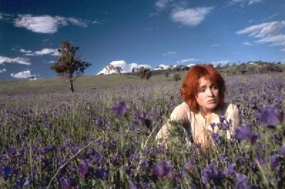

## **Klapbord**

**The Goddess of 1967** van Clara Law ontving in 2000 tijdens _het Festival van Venetië_ de prijs van de beste vrouwelijke vertolking voor Rose Byrne. Niettegenstaande die erkenning, is **The Goddess of 1967** in Vlaanderen en Nederland slechts door een kleine groep toeschouwers gezien. Onterecht, want met deze prent bewijst de jonge cineaste uit Macau (China) die in Australië woont, dat _het genre van de spirituele film_ actuele en onmisbare beelden maakt. Een belangrijke inspiratiebron voor haar is het werk van _Andrei Tarkovski_.

## **Synopsis**

JM (Deirdre) en BG, dat zijn de namen van de twee protagonisten. Beide personages leven elk in een verschillende cultuur: de Aziaat JM leeft in de metropool Tokio, terwijl BG een blanke, Australische is die als kind is opgegroeid in het desolate, uitgestrekte Australische landschap van Lightning Ridge en White Cliff. De twee vinden elkaar in Australië door toedoen van een bijzondere auto, _de Citroen DS van 1967_. In deze auto bewegen JM en BG door het uitgestrekte Australische landschap. Ze zijn onderweg. De weg is hun thuis. JM wil de auto kopen en BG gidst de jongen naar de eigenaar, althans dit is wat BG de jongen wijsmaakt. Ze loodst zichzelf en haar Japanse chauffeur naar niemand minder dan _haar vader_. Het eindpunt wordt voor beide jonge mensen een nieuw vertrekpunt.

## **Cinematografie**

TAOÏSTISCH SCENARIO.Regisseur Clara Law schreef zelf het scenario van **The Goddess of 1967**samen met haar levensgezel Eddie L.C. Fong die tevens coproducent is van de film. Het filmverhaal heeft een origineel plot. Die originaliteit ent zich op de twee jeugdige hoofdpersonages die via _een rijke taoïstische (yin/yang) uitwerking_ - oosters/westers, ziend/blind, man/vrouw, stad/platteland - reliëf krijgen. Clara Law ontleent de stof aan haar eigen ervaringen en haar kijk op de wereld van de jonge generaties die aan het begin van het nieuwe, derde millennium leven in een zich globaliserende, postmoderne wereld. _Het narratieve_ staat in de film niet op de voorgrond. Law vertelt geen verhaal om de toeschouwer te onderhouden. Het verhaal zelf is eerder secundair; de nadruk ligt op de tekening van de twee bijzondere personages en op de cinematografische kwaliteit van de beelden.

ROADMOVIE. Na een kort inleidend deel in Tokio, krijgt **The Goddess of 1967**, eens in Australië, het karakter van _een roadmovie_. Dan wordt het meisje het hoofdpersonage. Dankzij een bijzonder gebruik van de camera verschijnt _het landschap_ dat zich via de weg openbaart, eveneens als een apart hoofdpersonage. De rode kleur van de aarde reflecteert zich in het haar van BG. Law gebruikt de camera om de landschappelijke elementen van de horizon, de kleurrijke wolken, de sublieme sterrenhemel te profileren. Deze cinematografie van het landschap bereikt hier sublieme momenten. Ze huldigen de unieke Australische natuur, maar ze dienen vooral de inhoudelijke strekking van deze bijzondere roadmovie. Vooral door in sommige sequenties gebruik te maken van _de bleach-bypass techniek_, toegepast op het negatief van de film, vermijdt Law toeristisch ogende shots en vindt ze haar eigen cinematografische signatuur.

FUGA IN TWEE TIJDEN. Een ander opvallend cinematografisch kenmerk van **The Goddess of 1967** komt aan het licht via _de flashbacksequenties_. De montage steunt op de ritmische afwisseling tussen de scènes die zich in het heden afspelen en de andere die duidelijk in het recente verleden zijn gesitueerd. Hierdoor realiseert de film esthetisch een eigen tijdsbeleving. In het heden verloopt de tijdslijn chronologisch, terwijl juist door voorwaarts in de tijd en langs de weg te bewegen, de personages zelf steeds verder teruggaan in de tijd. De regisseur laat de film evolueren als _een fuga met twee bewegingen in de tijd_: ze drijven elkaar aan en houden tegelijk elkaar in evenwicht volgens _het yin-yang principe_ met aandacht voor de zowel reële als spirituele wisseling van licht en donder in vele variaties, ook soms in één beeld of één sequentie.  

BEELDSPRAAK. Law ‘schrijft’ in **The Goddess of 1967** een cinematografische poëzie met _een sterk uitgewerkte beeldspraak_: de dieren, de revolver, de DS, de satelliettelefoon, de oude boom, de mijnschacht, de kuisheidsgordel, de vervallen kerk, de dans, de wijn en het brood.

## **Betekenisruimte**

POSTMODERNE CULTUUR. Clara Law ontwikkelt in haar oeuvre en zeker in **The Goddess of 1967** een heel persoonlijke kijk op _de zich globaliserende mens en diens postmoderne cultuur_. Ze gebruikt diverse genres van muziek, ze mengt ernst met humor en een flinke knipoog naar de postmoderne semiotiek van Roland Barthes. Daarbij legt ze consequent de nadruk op _de spirituele grondtoon_ van het menselijk bestaan, die zich toont in _het streven naar zingeving_.

NOMADISCH LEVENSGEVOEL. Eén van de sterke cinematografische elementen is de evocatie van _het postmoderne nomadische levensgevoel_. Dat gebeurt niet op een modieuze en dus oppervlakkige wijze. Via haar eigen cinematografie peilt ze in **The Goddess of 1967** naar de diepere achtergronden van dat existentiële  grondgevoel dat niet meer gebonden is aan een welbepaalde cultuur of een bepaalde plek. Daarbij blijft Law niet steken in een zuiver interculturele of multiculturele retoriek. Ze overstijgt de intellectuele multiculti-mode en exploreert het spirituele leven van vooral de millenniumgeneratie die is opgegroeid met de eerste huiscomputers. Clara Law evoceert de wereld op van de metropool en de hightech van de communicatiemachines, de 'natuurlijke' biotoop van ontelbare jonge mensen over heel de wereld. Die biotoop is ondertussen ook uitgegroeid tot die van de meeste volwassenen en ouderen.

GODDELIJKE BEELDSPRAAK. De beeldspraak van de auto in **The Goddess of 1967** past in de postmoderne setting. JM verstuurt in het begin van de film een e-mail met als inhoud: '_I want to buy God_'. De bewuste auto wordt namelijk '_la déese_" (DS) genoemd. Door met dit gegeven te spelen, opent Law een betekeniswereld met _een religieus-spirituele strekking_. In de wereld van JM 'is God dood', dit wil zeggen: Hij is nu een auto, een designproduct, een consumptievehikel met een mythische status. Dat gaat gepaard met een spirituele leegte en een cultuur van verveling. Het wonderlijke van Laws film bestaat erin dat juist het blinde meisje BG de jongen de open ruimte van het landschap en de diepte van het menselijke hart leert kennen: de wolken, de sterren, de dorre woestijn, even zoveel beeldende expressies die elk een elk een beeldend verhaal vertellen.

METAFOOR KERKGEBOUW. Het lege houten kerkgebouw vormt in **The Goddess of 1967** een belangrijk onderdeel van de 'goddelijke beeldspraak'. Deirdres moeder, Mary, zelf slachtoffer van kindermisbruik, komt er nog bidden wanneer de wanhoop haar overvalt. Wanneer ze ontdekt dat haar eigen vader die tevens haar man is, ook nog hun dochtertje misbruikt, neemt ze de kleine Deirdre mee naar de vervallen kerk. Ze dwingt het meisje te bidden om zich via God te reinigen. De moeder, zelf slachtoffer, predikt over de fundamentele schuld van Eva. Wanneer Mary vaststelt dat Deirdre niet in haar verwrongen logica stapt, pleegt ze zelfmoord door de kerk in brand te steken en zich bewust over te geven aan de vlammen. De terugkeer naar haar nog levende vader die in zijn eigen waanzin leeft en in zijn zelf uitgegraven mijnschacht woont, is voor Deirdre _het doel van haar spirituele reis_, de weg waarlangs ze zichzelf bevrijdt van de beschaving zonder religieuze ziel. Ook voor de Japanse hacker die JM uiteindelijk blijkt te zijn, vormt de reis _een spirituele bevrijding_. Hij slaagt erin afstand te doen van zijn materialistische waarbeeld waarin ‘de auto’ een hogere waarde vormt dan een levende mens. Door mee te reizen met de blinde Deirdre ontdekt hij voor het eerst _de onbetaalbare schoonheid van het landschap, de onvergankelijke betekenis van de sterrenhemel, de poëzie van de dans en de tederheid van de liefdevolle aanraking_. Tegelijkertijd geneest de liefde van de jongen voor haar Deirdre van haar dwang om zich te wreken op haar schuldige (groot)vader die ze wil vermoorden. In die overwinning op zichzelf maakt ze het mogelijk om samen met JM aan een nieuwe weg te beginnen. De auto is nu hun gemeenschappelijke thuis, hun verworven eigendom. De _goddelijkheid_ steekt niet meer in de machine zelf, maar in hun onderlinge sterke band die hen allebei in beweging heeft gezet en in beweging houdt. Met **The Goddess of 1967** geeft Clara Law stem aan een belangrijk segment van _de jong volwassenen aan het begin van het derde millennium_. In een interview met CineMagie verduidelijkt Law haar visie als volgt: '_Eigenlijk moet je je afvragen of er nog wel plaats is in onze samenleving voor fundamentele vragen of je nu vrouw of man bent. Vragen zoals ‘Wie ben ik? Waar kom ik van? Waarom ben ik hier? Waar gaan we na onze dood naartoe?’ Zeer fundamentele kwesties omdat we allemaal ‘born to die’ zijn. Die vragen komen nog nauwelijks – ook niet in Australië waar ik nu leef – aan bod in films of boeken.'_ **The Goddess of 1967** is alvast een mooie uitzondering.

## **Context**

Clara Law formuleert vooral via de flashbacksequenties van **The Goddess of 1967** een scherpe tijds- en cultuurkritiek. Zij verdicht dat in _het portret van de grootvader van BG_, de man die tevens haar vader is. De beeldspraak van 'God' krijgt ook hier weer inhoud omdat de man in kwestie beweert dat hij als ‘een god’ kan heersen over wat hem toebehoort. Na de dood van zijn vrouw, pleegt hij incest met zijn eigen dochter en nadien met zijn kleindochter, Deirdre. Hij leeft als een onmens. Hij blijkt een gewezen hippie te zijn die de donkere terreur van de toenmalige slogan van 'de vrije liefde' aan het licht brengt. Law laat zien dat de generatie van de optimistische jaren zestig - zie het jaartal 1967 in de titel - vooral een consumptiewereld heeft voortgebracht waarin de mens zelf voor god speelt, met als resultaat: de dramatische verdwijning van iedere zin voor spiritualiteit en religiositeit.

## **Links**

De Bleeckere, S., 2002. _The Goddess of 1967_, in: CineMagie nr. 239, 7-12. / Sartor, F., 2002\. The _The Goddess of 1967._ Recensie en interview, in: CineMagie nr. 239, 13-16.

© Sylvain De Bleeckere, Men(S)tis, 2011/2017.

