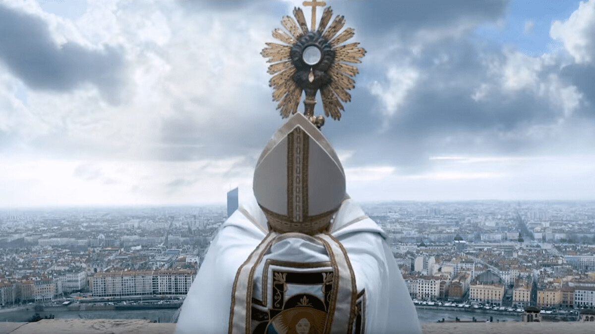

## **Klapbord**

Met **Grâce à Dieu** realiseerde de Parijse regisseur François Ozon in 2018 zijn achttiende langspeelfilm. Ozon (°1967) draaide al in 1988 zijn eerste professionele kortfilm, _Photo de famille_. Zijn oeuvre ― sinds 1998 levert hij ieder jaar een langspeelfilm af ― ent zich op zijn cinefiele kennis en vertrouwdheid met de rijke traditie van de Franse, naoorlogse auteursfilm. Zijn **Grâce à Dieu** verdient ook dat erelabel. Ozon regisseerde niet alleen; hij schreef ook zelf het scenario. Hij baseerde zich op de grondige studie van wat in Frankrijk, vooral in Lyon, sinds de jaren tachtig van vorige eeuw al ‘L’affaire Bernard Preynat’ werd genoemd; die pedoseksuele zaak rees midden 2014 plots terug uit de vergetelheid. ‘L’affaire Bernard Preynat’ vermeerderde zich toen tot ‘L’affaire Philippe Barbarin’. Beide zaken vonden een brede maatschappelijke weerklank en het bisdom Lyon schudde op zijn grondvesten. Over zijn eigen grondig onderzoek schrijft Ozon zelf:

>>_Après avoir recueilli, lord d’une longue enquête pour mon film, une multitude de paroles écrites et orales ― mails, lettres, rapports d’expertise, interviews, aveux, conférence de presse, auditions ―, j’ai voulu laisser une trace écrite de ces ‘paroles libérées’_ (F. Ozon, Grâce à Dieu. Trois actes et un épilogue, p. 5).

De film zelf opent dan ook terecht met de volgende mededeling:
_'Ce film est une fiction, basé sur des faits réelles.’_ Ozon veranderde de namen van de slachtoffers maar niet die van de kerkelijke protagonisten: Bernard Preynat, Philippe Barbarin en Régine Marie. De kerkelijke instanties probeerden de release van de film tegen te houden, maar dat is niet gelukt.

## **Synopsis**

In juni 2014 schrijft Alexander Guérin naar kardinaal Philippe Barbarin, aartsbisschop van Lyon. Hij informeert de verantwoordelijke van de lokale kerk dat hij gehuwd en vader van vijf kinderen is, dat zijn gezin katholiek is. Hij laat de kerkelijke leider weten dat hij, Alexander, als kind herhaaldelijk seksueel is misbruikt door priester Bernard Preynat, de scoutsaalmoezenier van Lyon en tevens actief in de parochiepastoraal van het bisdom. Voorts verduidelijkt Alexander dat hij een maand geleden heeft ontdekt dat priester Preynat nog steeds in de jeugdpastoraal actief is buiten de regio Lyon, daar waarnaar hij eerder door de voorganger van Barbarin, aartsbisschop Decourtray, was weggestuurd. Alexander wil dat kardinaal Barbarin optreedt tegen Preynat. Hij vraagt zich hardop af hoe dergelijke situatie onder de bevoegdheid van de kardinaal mogelijk is.

Uit dit schriftelijk contact volgt er een correspondentie tussen Barbarin en Alexander. De eerste toont zich begripvol en nodigt Alexander uit voor een persoonlijk gesprek, voorbereid door de psychologe van het bisdom, Régine Maire. Alexander krijgt alle steun van zijn vrouw Marie en hun oudste kinderen. Ondertussen tracht hij nog getuigenissen van andere slachtoffers van de scouts van toen te contacteren via Suzanne Cremer, de gewezen secretaresse van het bisdom. Ze wist van het misbruik door Preynat, maar kon niets doen en voelt zich daarover schuldig. Haar neefjes, Didier en Mathieu, waren trouwens ook slachtoffers van Preynat. Mathieu pleegde later zelfmoord, de volwassen Didier wil het verleden niet meer terug ophalen en weigert mee te werken met Alexander. Ondertussen lopen de geschreven en fysieke communicatie tussen Alexander en de aartsbisschop uit op een dovemansgesprek. Alexander beslist om zijn uitgebreid dossier dat hij ondertussen heeft samengesteld, over te maken aan de gerechtelijke instanties; hij deponeert zijn aanklacht bij de procureur van de Republiek in Lyon.

Politiekapitein Courteau van de gerechtelijke politie, afdeling jeugdbrigade, belt aan bij het gezin Odile en Pierre Debord. In het opnieuw geopende pedofiliedossier, ‘Le cas Preynat’, vonden de onderzoekers een brief die moeder Odile vijfentwintig jaar geleden naar het bisdom Lyon schreef over haar zoon François die het slachtoffer was geworden van het pedofiele gedrag van priester Preynat. De ouders en hun zoon François die ondertussen een gezin heeft met zijn vrouw Aline en hun twee dochters, vernemen dat het gerecht het dossier Preynat opnieuw heeft geopend. François die zich nu atheïst noemt, neemt tegen het advies van Courteau in, contact op met een lokale journalist. Hij contacteert eveneens een mede-slachtoffer, Gilles, die nu als chirurg in het hospitaal werkt. Samen stichten ze in december 2015 de vereniging La Parole libérée. Kardinaal Barbarin die ondertussen op de hoogte is gebracht van het heropende onderzoek tegen Preynat, wil zoveel mogelijk de schade beperken en roept in maart 2016 snel een persconferentie bijeen. Op haar website publiceert de groep La Parole libérée tientallen getuigenissen van gewezen slachtoffers van priester Preynat. Op 12 januari 2016 organiseert de vereniging die ondertussen al meer dan 60 leden telt, op haar beurt een persconferentie. Hiermee treedt ze naar buiten en wil ze andere slachtoffers een forum geven. Op het einde van de persconferentie formuleert François in naam van de vereniging drie vragen aan Mgr. Barbarin: Waarom veroordeelt de kerkelijke rechtbank priester Preynat niet gezien de vele klachten? Hoelang weet u al dat Preynat een perverse pedofiel is? Hoelang is het Vaticaan op de hoogte van de pedofiel Preynat?

De echo van die vragen weergalmt in het schrijnende getuigenis van de 34jarige Emmanuel Thomassin. Op zijn dertigtigste kreeg hij de diagnose ‘hoogbegaafd’, waardoor hij zijn studies nooit heeft kunnen voltooien en hij onstabiel is in werksituaties. Hij zegt over zichzelf: ‘_Je suis toujours en mode survie…_’. Daarbij komt het onderliggende trauma van het seksueel misbruik door de scoutsaalmoezenier Preynat. Het is zijn gescheiden moeder Irène die Emmanuel het krantenbericht laat lezen dat verscheen naar aanleiding van de  persconferentie van La Parole libérée. Zo komt Emmanuel in contact met de vereniging en ontstaat er een sterke band tussen hem en François en Alexander. Zij ondersteunen hem om bij het gerecht klacht in te dienen tegen Preynat, hetgeen ook gebeurt. Op het kantoor van justitie volgt er zelfs een confrontatie tussen Emmanuel en de oude Preynat. Deze verklaart letterlijk dat hij erkent een pedoseksueel te zijn. Voorts verklaart Preynat: 

>>_Mais vous savez, j’en ai parlé plusieurs fois à ma hierarchie et personne n’a rien fait. Ils ont tout su, depuis Mgr. Decourtray jusqu’au cardinal Barbarin. Et ils n’ont rien fait…Je tiens aujourd’hui à dire à Emmanuel: Pardon. Pour tout ce que je t’ai fait subir._

 Preynat vraagt vergiffenis aan Emmanuel die verklaart:
 
 >>_Vous avez trahi ma confiance et celle de milliers de gens qui vennaient dans cette église. J’étais un enfant… Pour vous, c’étais un jeu et moi, ça m’a détruit. Alors non monsieur, je ne vous pardonnerai jamais_.
 
 Daarna stemt Emmanuel nog toe bij hem thuis een interview toe te staan aan een journaliste, wat nog leidt tot een oplopende ruzie tussen hem en zijn vriendin Jennifer. Uiteindelijk verneemt de vereniging _La Parole libérée_ dat niet alleen Preynat maar ook Barbarin juridisch wordt aangeklaagd. Kardinaal Barbarin voelt zich opnieuw verplicht de schade te beperken via een persconferentie. Die vindt plaats in maart 2016 in het gekende rooms-katholieke bedevaartsoord Lourdes. Daar verklaart hij het volgende: 
 
 _Nous sommes confrontés à des faits anciens, et grâce à Dieu, tous ces faits sont prescrits._
 
 Hij prijst zichzelf en zijn kerk ‘gelukkig’ ― de Franse uitdrukking ‘_grâce à Dieu_’ ―  dat al de feiten zijn verjaard. Letterlijk gezien, dankt hij God zelf voor die meevaller. Een journalist wijst de kerkman op diens zeer ongelukkige woordkeuze. Barbarin antwoordt daarop met: 
 
 _Oui, je comprends mais c’est une erreur de mon langage, je le reconnais volontiers._
 
 Tevreden over de behaalde weerklank – 30 miljoen volgelingen ―  en de lopende juridische vervolging van de twee geestelijke protagonisten, tevreden ook over het feit dat de leden van de vereniging zelf zijn uitgeroepen tot ‘Les Lyonnais de 2016’, nodigt Alexander en zijn gezin de voornaamste leden van _La Parole libérée_ uit om bij hem thuis samen nieuwjaar te vieren. Laat op de avond, als de gasten al naar huis zijn, wacht Alexander op de thuiskomst van zijn oudste zoon Victor die een afspraak had met zijn vriendin Elodie. Op het einde van het korte gesprek vraagt Victor aan zijn vader: 
 
 _Geloof jij nog in God?_. 
 Alexander antwoordt met een stilte. 

## **Cinematografie**

 **DRIETRAPSSCENARIO**. 

De film **Grâce à Dieu** vertelt het verhaal via een triptiek die bestaat uit de korte proloog, het lange middelluik en de korte epiloog. De proloog en de epiloog spiegelen zich in elkaar. Het beeld van de Basilique Notre Dame de Fourvière van Lyon vormt de link tussen de opening en de afsluiting van de film. 

De historische basiliek is gebouwd van 1872 tot 1884 in neo-Byzantijnse stijl op de heuvel de Fourvière en troont over de lager gelegen stad aan de Rhône. De monumentale basiliek vormt het architecturale gezicht van de derde grootste, Franse stad. Het plechtstatige kerkgebouw definieert Lyon als rooms-katholieke, ‘mariale stad’. 

Het lange middelluik van de film is opgebouwd als een drietrapsverhaal. In het eerste deel staan het personage Alexander en zijn gezin centraal; in het tweede deel vormt het personage François de spilfiguur en in het derde deel komt het personage Emmanuel op het voorplan. De drie delen zijn verweven met elkaar via een crescendo uitgewerkte dynamiek.

Het deel met Alexander is het langste van de drie. De actie die Alexander onderneemt naar het aartsbisdom toe, meer bepaald naar de aartsbisschop Barbarin, genereert de twee volgende delen. Het Alexander-deel ontwikkelt zichzelf ook crescendo. Alexander doet er alles aan om de actie tegen de pedoseksueel Preynat binnenkerkelijk te houden. Hij wil dat de kerkelijke overheid zelf orde op zaken stelt en maatregelen neemt om te voorkomen dat de priester in kwestie nog steeds pastoraal kan omgaan met minderjarigen en in de kerk missen kan blijven opdragen voor de gelovigen, ook voor kinderen en jongeren. Zijn plan botst op weerstand ook al toont het bisdom begrip voor hem als slachtoffer. Toch brengen de intense pogingen van Alexander om de kardinaal zelf tot concrete actie te motiveren, geen zoden aan de dijk. Dat brengt hem, op het einde van het eerste deel, ertoe om zijn uitgebreid dossier Preynat over te maken aan het gerecht. 

Daarna, in het tweede deel met François, schakelt het verhaal een versnelling hoger. Hij werkt niet alleen actief mee aan het gerechtelijk onderzoek op; hij brengt hij ook het hele dossier naar de buitenwereld via de pers en nadien via de vereniging van _La Parole libérée_ en haar website. Tegelijkertijd vormt François de narratieve schakel met Alexander. Via Courteau van het gerecht weet François dat er iemand klacht heeft neergelegd. Courteau mag hem echter de naam van de aanklager niet meedelen. Toch vindt François een spoor naar Alexander ook al legt Ozon niet uit hoe dat precies in zijn werk is gegaan. Van belang is dat van dan af Alexander deel uit maakt van de vereniging _La Parole libérée_ en de doelstellingen ervan volledig onderschrijft. Met de persconferentie van _La Parole libérée bereikt_ de vereniging haar eerste, grote doel: de publieke aandacht verwerven en aldus nog meer getuigenissen van slachtoffers verzamelen. Hiermee sluit het tweede deel af en neemt het verhaal in het derde deel nog een hogere vlucht. 

Dat gebeurt via Emmanuel die dankzij zijn moeder Irène op de hoogte wordt gebracht van de publieke weerklank van de persconferentie van _La Parole libérée_. Irène engageert zich vrijwillig als telefoniste van de vereniging die een snelle, opwaartse dynamiek kent. Zowel Preynat als Barbarin worden officieel in beschuldiging gesteld. Dat juridisch resultaat gaat op het jaareinde gepaard met het publieke succes van de leden van de vereniging want zij worden uitgeroepen tot ‘_les Lyonnais de 2016_’. Hiermee is ook het tweede grote doel van de vereniging bereikt: de juridische vervolging van de twee betrokkenen en de publieke erkenning van het leed dat ze als kinderen en jongeren hebben moeten dragen tot vandaag. Op persoonlijk vlak bekroont het filmische derde deel de hele opwaartse dynamiek van het verhaal. Alexander en Marie hebben de bestuursleden uitgenodigd naar aanleiding van nieuwjaar. De drie hoofdfiguren zitten nu samen verenigd en bevrijd van het jarenlange zwijgen aan dezelfde gastvrije tafel: Alexander, François en Emmanuel.

**AUDIOVISUEEL DUET**. 

De Franse film kenmerkt zich in het algemeen door de prominente aanwezigheid van de gesproken taal. Doorsnee Franse personages spreken graag en veel. Ook Grâce à Dieu kent amper stiltes, ook al eindigt de film met de close-up van Alexander die zwijgt. De personages hebben altijd veel te vertellen. Dat komt omdat de film zijn kracht haalt uit de reële getuigenissen van hen die als kinderen slachtoffer zijn geworden van seksueel misbruik binnen de rooms-katholieke kerk. Het belang van het gesproken woord blijkt ook uit de naam van de vereniging die de slachtoffers stichten: _La parole libérée_, letterlijk ‘het bevrijde woord’. De ‘bevrijde woorden’ van de drie hoofdpersonages vormen de echte drive van **Grâce à Dieu**. Daarom kunnen we hier spreken van ‘de zich bevrijdende woorden’. De drie hoofdgetuigenissen vertegenwoordigen die van de vele andere slachtoffers.

Kenmerkend voor **Grâce à Dieu** betreft de zeer specifieke connectie tussen woord en beeld. De film bezit een unieke audiovisuele signatuur die het meesterschap van Ozons regie demonstreert. Natuurlijk zijn er ook tal van traditionele scènes waarin woord en beeld parallel voorkomen. De toeschouwer ziet hoe de personages met elkaar dialogeren. In het Alexander-deel situeren zich die dialoogscènes in het gezin van Alexander en Marie, maar ook in het gebouw van het bisdom van Lyon: de gesprekken tussen Alexander en de psychologe Régine Maire en kardinaal Barbarin, het gesprek tussen Alexander, Régine Maire en priester Preynat; ook hun oudste zoon Victor voert samen met zijn jonger broer Gauthier een persoonlijk gesprek met de kardinaal in diens kantoor. Voorts komen er enkele korte scènes voor met Alexander en zijn oude scoutsvriend Olivier Itaque , ook een slachtoffer van Preynat. Niettegenstaande het grote belang van de gesproken woorden, oogt Grâce à Dieu op geen enkel moment als gefilmd theater. De spreekscènes zelf kennen een creatieve combinatie van een vloeiende cameravoering en een vlotte montage die long shots van de sfeervolle ruimtes dynamisch afwisselt met close-ups van personages en aanwezige voorwerpen. 

Daarnaast zet Ozon op een erg vernuftige manier de filmische verhaaltechniek van de voice-off in. Veel van de gesproken woorden zijn letterlijk enkel te horen en niet te zien. Ze spelen zich off-screen af. Vooral in het eerste en het tweede deel bestaat de klankband uit een drukke uitwisseling van mails van bijvoorbeeld Alexander naar Barbarin en vice versa, alsook van Alexander naar Régine Maire en omgekeerd. Ozon maakt de toeschouwer vertrouwd met die filmische verhaaltechniek vanaf het eerste moment van het eerste deel. Hij componeert de beelden en de woorden, beeld en klank, volledig autonoom en los van elkaar. Via een doorlopende voice-off laat Ozon de geschreven e-mails hardop lezen door Alexander, terwijl ondertussen de beelden een ander visueel verhaal van het personage laten zien. Die filmische partituur verschijnt hierdoor als een volwaardig filmisch duet van beeld en klank. 

En in die eerste narratieve beweging die het filmverhaal letterlijk op gang trekt, organiseert Ozon dat duet beeld- klank als een inclusie. Het begin ervan situeert zich in het gezin van Alexander en Marie op een zondag. Als katholiek gezin vertrekken ze samen naar de zondagsmis in de kathedraal waar kardinaal Barbarin de hoogmis opdraagt voor de gelovigen. Het gezin Guérin wandelt te voet naar de kerk. Na de misviering keren ze samen terug naar huis. De inclusie eindigt wanneer het gezin op het punt staat terug de deur van hun stadswoning te openen. Tussen het begin en het einde van die visuele inclusie monteert Ozon beelden van het gezin op weg naar de kerk en nadien naar hun woning, alsook beelden van de misviering zelf: het gezin gaat ook te communie. Bij al die beelden horen we in voice-off de tekst van Alexanders eerste mail naar kardinaal Barbarin uitspreken, alsof het een telefoongesprek betreft. Hiermee definieert Ozon het spanningsveld van de film: enerzijds de uitwendige, zichtbare wereld waar alles goed geordend verloopt en waar zich de handelingen ordelijk in de tijd met quasi de regelmaat van een klok herhalen, anderzijds de onzichtbare leefwereld van de 40jarige Alexander die nog worstelt met het trauma dat hem als kind is aangedaan en dat hij nu voor het eerst uitspreekt in zijn bericht naar de hogepriester Barbarin van wie hij wekelijks de communie ontvangt: die e-mail is zijn eerste ‘bevrijde woord’. 

Dat spanningsveld tussen de normale, visuele buitenwereld en de erg dramatische, hoorbare innerlijke gedachtewereld breidt zich crescendo uit eerst bij Alexander, dan bij François en vervolgens bij Emmanuel. Bij alle drie de personages krijgt de verborgen wereld van de persoonlijke, traumatische herinneringen ook af en toe een visuele component via korte flashbacks. In die korte sequenties heerst er een ongemakkelijke stilte die herinnert aan het jarenlange zwijgen van de volwassen geworden slachtoffers.

**ROOMS-KATHOLIEKE PARAFERNALIA**. 

**Grâce à Dieu** heeft een uitgesproken rooms-katholieke signatuur. Dat vertaalt zich al in de ouverture van de film. Die situeert zich aan de Basilique Notre Dame de Fourvière. Ook in de epiloog is die te zien. De proloog zelf evoceert de rooms-katholieke uitstraling van de basiliek via een hogepriesterlijk ritueel: gekleed in zijn bisschoppelijke gewaad voltrekt kardinaal Barbarin vanop het balkon van de basiliek het ritueel met de monstrans. Hij tilt haar omhoog en toont ze aan de lager gelegen stad Lyon. De monstrans of ostensorium is een typisch rooms-katholiek object dat deel uitmaakt van het uitgebreide liturgische vaatwerk: de monstrans wordt gebruikt in de katholieke eredienst, maar ook in de anglicaanse en zelfs lutherse kerkdiensten. De monstrans zelf is van edel metaal en heeft de vorm van een stralende zon met op de plaats van de zon een glazen houder waarin zich de geconsacreerde hostie bevindt. ‘Geconsacreerd’ betekent in de rooms-katholieke liturgie dat de priester tijdens de eucharistieviering ― ‘de mis’ ― het brood van de hostie via de uitvoering van geijkte liturgische gebaren en woorden heeft veranderd in ‘het lichaam van Christus’. De monstrans met die gewijde hostie dient dus, kerkelijk gezien, voor de aanbidding van ‘het lichaam van Christus’. De priester stalt die monstrans dan uit op het altaar voor de duur van de aanbidding en hij kan ook de gelovigen zegenen met die monstrans.

In het openingsdeel met Alexander beweegt de film in de kerkelijke sfeer. Het gezin Guérin woont de zondagsmis bij in de Cathédrale Saint-Jean-Baptiste. We zien het majestueuze gebouw met zijn glas-in-loodramen. Die typische kerkramen komen ook nog in andere sequenties voor. In de sequentie van de zondagsmis zoomt Ozon in op het gezin Guérin tijdens de communiegang. Ozon filmt in close-up de kardinaal die de communie geeft aan Alexander: ‘_Het Lichaam van Christus_’ ‘_Amen_’. Later in het eerste deel zien we opnieuw het gezin Guérin in de kathedraal. De twee oudste zonen, de zestienjarige Victor en de veertienjarige Gauthier krijgen van de kardinaal het sacrament van het vormsel toegediend. Dat sacrament vormt na het sacrament van het doopsel en na de eerste communie de afsluiting van het officiële initiatieproces in de rooms-katholieke kerk. Het hoogtepunt van het kerkelijk ritueel van het vormsel bestaat uit de zalving met het heilig chrisma. Dat welriekend oliesel wordt door de bisschop tijdens de chrismamis op Witte Donderdag van de Goede Week ― de herdenking van de lijdensweg, de kruisdood en de verrijzenis van Jezus, kerkelijk beschouwd als ‘de Zoon van God’ ― gewijd en bestaat uit een mengsel van olijfolie en balsem. Tijdens het sacrament van het vormsel tekent de bisschop met het gewijde chrisma op het voorhoofd van de vormeling een kruisteken terwijl hij de rituele woorden uitspreekt: ‘_Ontvang het zegel van de heilige Geest, de gave Gods_’. Ozon filmt die bisschoppelijke zalving in close-up. 
Ook het kerkelijk hoogfeest van Kerstmis stoffeert de film. In een van de scènes in het gezin Guérin zien we hoe ouders en kinderen de kerstsfeer in de woonkamer verzorgen en onder ander de beelden van de kerkstal installeren. Ozon filmt ze in close-up. Daarna bevindt het hele gezin zich in de kathedraal voor de middernachtmis van Kerstmis. Het kinderkoor zingt: ‘_Gloria in excelsis Deo_’. De tekst verwijst naar het kerstverhaal zoals te lezen in het Evangelie volgens Lucas. Het engelenkoor verwelkomt met die hemelse groet het pasgeboren kerstekind, Jezus van Nazareth. Die evangelische woorden zijn opgenomen in het gelijknamige kerstlied, zowel door Johann Sebastiaan Bach als door Frederich Händel op muziek gezet. In het Nederlands is het kerstlied gekend als ‘_Eer zij God in onze dagen_’. 

De filmt vermeldt dus bewust de kerkelijke jaarkrans met zijn vier kerkelijke hoogdagen: Kerstmis, Pasen en via het vormsel van de twee oudste zonen van Alexander en Marie, ook Pinksteren, én Allerheiligen.

In het eerste deel verschijnt ook Preynat zelf in priesterornaat aan het altaar. Hij draagt de mis op als pastoor in Neulise, een parochie op zo’n 70 km van Lyon. Het gezin Guérin is aanwezig, maar bij de communie verlaten ze de kerk, waarmee ze publiekelijk de communie weigeren te ontvangen uit de handen van priester-pedofiel Preynat. 

Behalve de liturgische rooms-katholieke parafernalia ― liturgisch vaarwerk, liturgische kleding, kerkgebouw, kerkelijke jaarkrans, sacramentele rituelen ― kent de film nog andere rooms-katholieke sequenties. In de belangrijkste ervan zien we de oudere Preynat die in Neulise nog steeds aan kinderen catechese geeft. Hij laat hen om beurten een zin voorlezen uit het evangelieboek, met name de passage van het Evangelie van Marcus 10. Daar onderricht Jezus zijn leerlingen over de betekenis van kinderen: 

‘_Laat de kinderen bij me komen, houdt ze niet tegen, want het koninkrijk van God behoort hen toe…_’ 

We zien dat tijdens die sequentie van de catechese een vrouw de deur van het lokaal opent en komt kijken of alles volgens de nieuwe regels van kardinaal Barbarin verloopt. Naar aanleiding van de commotie over het kindermisbruik door Preynat in het verleden heeft de kardinaal naar zijn priesters aan circulaire gezonden waarin hij hen oplegt tijdens hun priesterwerk nooit alleen met een kind of kinderen te verblijven. Er moet een derde persoon aanwezig zijn, ook en vooral tijdens catechese-onderricht. In de betreffende sequentie zien we hoe de vrouw die komt kijken die derde persoon moet zijn. Haar controle duurt amper enkele seconden en voor de verdere duur van de catechese blijft Preynat alleen met de kinderen. 

Andere typische elementen van de Franse rooms-katholieke cultuurwereld komen voor in de correspondentie tussen Alexander Guérin en kardinaal Barbarin. Zo verwijst Alexander in een van zijn mails naar de kerkleider dat hij in het katholieke tijdschrift _La Vie_ een interview met paus Franciscus heeft herlezen. Alexander heeft een abonnement op het magazine. Hij beveelt Barbarin aan ook het interview te lezen en zendt hem de link door. Zelf citeert Alexander een zin uit dat interview met paus Franciscus: 

‘_Je m’engage personnellement à ne tolérer aucun mal envers un mineur par tout individu, clerc ou non, pour qu’aucun loup ne rentre dans la bergerie_’. 

Die beeldspraak verwijst naar de uitdrukking ‘een wolf in schaapskleren’, geïnspireerd door het vers 7:15 van het Evangelie volgens Matteüs. In de kerstperiode schrijft Alexander opnieuw naar Barbarin. Daarin uit hij zijn ongenoegen dat Preynat als priester nog steeds in het publiek de mis opdraagt, zelfs ‘_des messes de Noël_’. In zijn mail verwijst hij opnieuw naar paus Franciscus en diens optreden in de voorbije maand november ten aanzien van de pedofiele priesters van het Spaanse aartsbisdom Granada. Barbarin antwoordt dat hij niet op de hoogte was van de affaire in Granada. Daarna speelt Alexander de ‘onwetende’ kardinaal van Lyon nog andere info toe over de pedofilie-affaires in de katholieke kerk. Hij voegt in bijlage een artikel over de Poolse aartsbisschop Jozef Wedolowski, 66 jaar, gewezen pauselijke nuntius in de Dominicaanse Republiek, beschuldigd van pedofilie en sedert 2013 gevlucht naar het Vaticaan waar hij verblijft. Daar is hij, aldus Alexander, door de gendarmerie van het Vaticaan gearresteerd op verzoek van paus Franciscus zelf. Na grondig onderzoek door de pauselijke Congregatie van de Geloofsleer zal Wedolowski uit zijn priesterlijk ambt worden ontzet wegens seksueel misbruik van minderjarigen. Alexander hoopt dat het voorbeeld van de paus zelf kardinaal Barbarin zal inspireren in de affaire Preynat. Alexander eindigt:

‘_Où êtes-vous de votre côté? Que Dieu nous vienne en aide et continue de protéger nos enfants._’ 

Tot slot zendt de ontgoochelde Alexander nog een brief naar paus Franciscus zelf. Daarin schrijft hij: ‘Il faut mettre la lumière sur la terrible obscurité de l’Eglise.’ En over de ‘zachte’ en ‘minimale’ behandeling van Preynat door Barbarin: 

‘_Cette minimisation de ses crimes m’est insupportable. Il y a très peu de compassion, de révolte devant cela. J’ai l’impression que ma démarche de vérité gêne et ennuie…Pour ne plus avoir peur d’écrire et avoir la certitude d’être lu, il m’aura fallu trente années._’

Nog een andere Vaticaanse verwijzing in de film betreft het consistorie waarover Barbarin schrijft aan Alexander. Een consistorie betekent de bijeenkomst in het Vaticaan waarbij de paus nieuwe kardinalen aanduidt en ‘creëert’, zoals dat officieel heet. Barbarin schrijft aan Alexander dat hij in Rome aanwezig was voor het consistorie en dat naar aanleiding ervan de paus de Amerikaanse kardinaal Sean Patrick O’Malley van het aartsbisdom Boston heeft aangesteld om het dossier van kindermisbruik in de kerk op te volgen. Inderdaad, paus Franciscus stelde in 2013 priester kapucijn O’Malley aan tot president van de Pauselijke Commissie voor de Bescherming van Minderjarigen.

De uitbeelding van het rooms-katholieke milieu zou onvolledig zijn zonder de gebedsscènes. Eigenlijk zijn de liturgische scènes aan het altaar per definitie gebedsscènes en de openingsscène met de monstrans roept ‘aan-bidding’ op. Maar ook buiten de liturgische context last Ozon een belangrijke gebedsscène in. Dat gebeurt namelijk op het einde van het gesprek tussen Alexander, Preynat en Régine Marie in de gebouwen van het aartsbisdom van Lyon. Régine Marie probeert op het einde van het gesprek de pijnlijke stilte te doorbreken en tegelijkertijd het gesprek zelf af te ronden door beiden uit te nodigen samen te bidden. Hand in hand bidden de drie personen hardop het typisch katholieke gebed dat ook in iedere priesterlijke mis wordt gebeden: _Het Onzevader_. En het gesprek tussen de kardinaal en de twee zonen van Alexander die zich scharen achter de strijd van hun vader, vraagt de kardinaal hun gesprek biddend af te sluiten: _‘_We moeten bidden voor de kerk en uw vade.’ En op het einde van de laatste ontmoeting van Alexander met Barbarin, een gesprek dat uitmondt in een dovemansgesprek, rondt Barbarin af met: ‘_Je prierai pour vous._’

De rooms-katholieke sfeer belichaamt zich ook in het gebaar van kardinaal Barbarin. Op het einde van de ontmoeting met de zonen Viktor en Gauthier overhandigt de kerkvader twee gesigneerde exemplaren van zijn boek: ’_Dieu est-il périmé?_’. De jongens krijgen een exemplaar en het andere is een geschenk van de kardinaal voor hun vader. Concreet gaat het over het boek dat Philippe Barbarin als aartsbisschop van Lyon in 2015 schreef samen met Jean-Marie Montali, uitgegeven bij Editions de La Martinière. Het verscheen dus midden in de crisis rond de Affaire Preynat die uiteindelijk uitmondde in de Affaire Barbarin. De ondertitel van het boek ― _Paroles humaines, Parole de feu_ ― is, geplaatst tegenover de vereniging _La Parole libérée_, erg veelzeggend.

## **Betekenisruimte**

**HET ZWIJGEN DOORBROKEN**.  

‘_Donner une parole théâtrale à ces trois victimes est une façon pour moi de perpétuer leur combat, en espérant que l’institution catholique ose enfin affronter et régler la question de la pédophilie dans l’ Eglise._’ 

Aldus regisseur Ozon in het voorwoord van het boek met de theaterversie van het scenario van **Grâce à Dieu**. De regisseur laat er geen twijfel over bestaan. Hij wil niet alleen de filmruimte wijden aan de zich bevrijdende stem van de slachtoffers; hij wil tevens hun strijd voor gerechtigheid in de rooms-katholieke kerk en de Franse samenleving versterken en verlengen. De structuur van de film demonstreert duidelijk de intentie van de filmmaker. Ozon heeft welbewust drie personages gekozen die alle slachtoffers kunnen belichamen. 

Alexander is de uitgesproken katholiek en hij wil ook de oplossing voor het probleem binnen de kerk zoeken. Niettegenstaande het misbruik dat hij als kind heeft gekend, is hij katholiek gebleven. De kracht daartoe heeft hij gevonden in het kinderrijke gezin dat hij heeft gesticht met zijn echtgenote Marie. Het eerste deel maar ook het laatste deel van de film bevatten samen heel wat scènes die zich in de warme geborgenheid van de thuis van het gezin Guérin situeren. Het is op het einde trouwens dat aan de nieuwjaarstafel van het gezin dat de drie slachtoffers samen zitten en hun gemeenschappelijke overwinning vieren als een nieuw begin voor henzelf. In die laatste gezinssequenties situeert zich nog een korte scène met Marie en Emmanuel die vol bewondering is over het gezin dat ze heeft met Alexander en hun kinderen. Marie vertelt vertrouwelijk aan Emmanuel hoe ze zelf ook slachtoffer is geweest van seksueel misbruik, gepleegd door een familielid van haar; ze erkent niet over diezelfde moed te beschikken als haar man Alexander om met het opgelopen trauma naar buiten te treden. Uit respect voor diens moed heeft Marie haar man in zijn strijd altijd onvoorwaardelijk gesteund en via haar ook de twee oudste kinderen van het gezin, Victor en Gautier. Zij nemen zelfs op eigen initiatief contact met de kardinaal. Daarentegen hebben de ouders van Alexander, goed gezien in de katholieke goegemeente van Lyon, hun zoon nooit gesteund en vinden zij zijn acties nu naar het bisdom een vorm van arrogantie. Geplaatst in het tegenlicht van die ouderlijke, katholieke opstelling die het bisdom uit de wind wil zetten, wint de helende houding van het gezin van Alexander en Marie nog meer aan humane waarde.

De narratieve lijn van het tweede deel draait rond het tweede slachtoffer-personage, François Debord. In tegenstelling met Alexander heeft het ondergane misbruik hem verwijderd van de kerk. Hij noemt zichzelf atheïst. Hij belichaamt de vele slachtoffers die door het kerkelijke kwaad zich niet alleen van de kerk afwenden, maar tevens hun rug keren naar het christelijke geloof in het algemeen. Daarom gelooft François niet in tegenstelling met Alexander dat de kerkelijke overheid zelf de slachtoffers ernstig zal nemen en de dader uit hun midden, Preynat, zal verwijderen. Dat inzicht brengt François ertoe mee te werken met het gerechtelijke onderzoek, maar ook om tegelijkertijd de pers in te schakelen. Hij wil het misbruik en het gedrag van de kerkelijke overheid dienaangaande publiek maken. Daarom weigert hij ook in te gaan op het voorstel van Barbarin om een gemeenschappelijke persconferentie te houden. Evenals Alexander is François goed omringd door een warm gezin. Zijn echtgenote Aline staat volledig achter hem en samen vinden ze motivatie voor hun strijd tegen de kerk in hun sterke wil om hun twee meisjes en andere kinderen in het heden en de toekomst te beschermen. Voorts krijgt François ook alle steun van zijn ouders Pierre en Odile. Vroeger heeft zijn moeder Odile trouwens een eigen dossier bijgehouden van de eerste misbruikperiode van Preynat, een dossier dat het gerechtelijk onderzoek nu veel helpt. François ontpopt zich tot de leider en de spreekbuis van de vereniging La Parole libérée.  

Het derde personage, Emmanuel, heeft zich nog verder verwijderd van de kerk. Hij heeft geen gezin,  is constant onder medisch toezicht en kent epileptische aanvallen. Ook zijn relatie met zijn vriendin, Jennifer, lijdt onder de situatie. En wanneer het interview met Emmanuel op de regionale televisie verschijnt, vertoont Jennifer tekenen van jaloezie. Emmanuel wil medisch laten vaststellen dat zijn geslacht is misvormd door het misbruik van Preynat, maar de dokter kan wetenschappelijk gezien geen bevestiging geven. Wanneer hij die diagnose hoort, krijgt Emmanuel een elliptische aanval. Emmanuel vindt een nieuw houvast bij de vereniging La Parole libérée. Ook zijn gescheiden moeder Irène steunt hem en ze meldt zich vrijwillig als telefoniste van La Parole libérée. Tijdens de laatste sequentie met de leden van de vereniging in de woning van Alexander en Marie neemt Emmanuel, gelouterd door de gebeurtenissen, het woord. Hij vertolkt wat ‘het bevrijde woord’ voor hem persoonlijk heeft betekend: ‘…Je voulais vous dire merci pour tout ce que vous avez fait, votre soutien. Ça a changé ma vie, je dirais même: ça lui a donné un sens, une Valeur. Je sais qu’aujourd’hui, grâce à vous, ce qu’on a vécu et ce qu’on a subi n’a pas servi à rien…’ Emmanuel vat de waarde en de betekenis van het gefilmde gebeuren, een sterke audiovisuele echo van het reële gebeuren, zeer persoonlijk en treffend samen. Hij gebruikt opvallend ‘grâce à vous’, waarmee hij eigenlijk het ‘grâce à Dieu’ van de filmtitel corrigeert, wat meteen ook een correctie betekent van het ‘grâce à Dieu’ dat kardinaal Barbarin tijdens zijn tweede persconferentie gebruikte. 

**ACHTER EEN MUUR VAN WOORDEN**.  

De slachtoffers van Preynat hadden geen persoonlijke macht. Als kinderen konden ze zich niet verweren. Hun onzekerheid, onwetendheid, schaamte en de priesterlijke manipulatie dreven hen naar de stilte van het angstige zwijgen. Hierdoor kwamen ze weerloos terecht in de dwangbuis van het machtige instituut van de rooms-katholieke kerk, zeker in Frankrijk en in het bijzonder in het zeer katholieke Lyon. Dat kerkelijke machtsvertoon blijkt duidelijk uit de zuiver defensieve respons van de kerkleiders en hun pedofiele daders, in casu Preynat. De vroegere aartsbisschop van Lyon, kardinaal Decourtray werd in 1991 geconfronteerd met de ‘affaire Preynat’, onder ander door een brief van Odile, de moeder van François Debord. De kardinaal ‘muteerde’ Preynat in datzelfde jaar naar Neulise waar hij echter verder als priester kon blijven functioneren: missen opdragen, zelfs op Kerstmis, en catechetisch onderricht geven aan kinderen en jongeren. Als een van zijn slachtoffers, de nu volwassen Alexander Guérin, vader van vijf kinderen, in 2014 ontdekt dat Preynat nog steeds ‘priesterlijk’ actief is, laat hij zijn verontwaardiging daarover weten aan de huidige aartsbisschop Barbarin. Met die stap steekt de ‘affaire Preynat’ opnieuw de kop op en dijnt die geleidelijk uit tot de ‘affaire Barbarin’. In de film ontmoet Alexander tweemaal Barbarin. Daarbij valt op dat Barbarin verzwijgt dat hij Preynat persoonlijk goed kent en hem beschermt als priester. De gewezen secretaresse van het bisdom, Suzanne Cremer, met wie Alexander contact neemt, informeert hem: 

‘_Oh vous savez, Barbarin/Preynat, c’est une vieille histoire, ils se connaissent depuis longtemps. Et quand Barbarin est arrivé sur Lyon, il a vu le bon travail qu’avait fait Preynat, tout l’argent et les fidèles qu’il ramenait au diocèse…_’ 

Met andere woorden, voor Barbarin is Preynat een zeer goede en nuttige priester die veel kerkelijke gelovigen rekruteert en dus veel geld naar de lade van het bisdom laat vloeien. Alexander ervaart dat Barbarin met woorden speelt. De ondertitel van diens boek bevat tweemaal het woord ‘_paroles_’. In woord vertolkt de aartsbisschop zijn medeleven met de slachtoffers en veroordeelt hij, naar het voorbeeld van zijn paus te Rome, de aanwezigheid van pedofiele priesters die opereren onder de koepel van de rooms-katholieke kerk. 

Dat Barbarin met woorden speelt en spint, blijkt uit het eerste gesprek van Alexander met hem. Hij weigert namelijk het woord ‘pedofiel’ in de mond te nemen. Hij herinnert Alexander aan de Griekse etymologie van het woord ‘pedofiel’: ‘hij die van kinderen houdt’. Dan zet Barbarin nog een schaamteloze stap verder door in één beweging die Griekse etymologie te koppelen aan het christelijke Evangelie: 

_Et selon notre Seigneur, il faut aimer les enfants. Pas trop, évidemment._

Met deze retorische kronkel suggereert Barbarin listig dat iedere priester evangeliegewijs een ‘pedofiel’ mag worden genoemd. Hij stemt in met het voorstel van Alexander om ten aanzien van figuren als Preynat niet te spreken over ‘pedofiel’ maar over ‘pedoseksueel’. Aldus blijkt hoe de kerkleider zich verschuilt achter een retorische muur van woorden.

Op het ritme van het filmverhaal blijkt steeds duidelijker dat er een schijnheilige scheiding bestaat tussen de woorden van de aartsbisschop en zijn daden. Wanneer hij toch met zijn rug tegen de muur komt te staan, erkent hij tegenover Alexander dat Preynat niet uit zijn priesterambt zal worden ontheven. Aangekomen op het punt van dat inzicht, stapt Alexander naar het gerecht, in het kielzog waarvan de vereniging van de slachtoffers, _La Parole libérée_, ontstaat. In het derde deel, in de dramatische sequentie van de confrontatie van Emmanuel met Barbarin op het bureau van de onderzoeksinspecteur Courteau, erkent Preynat dat hij zijn kerkelijke overheden (‘la hiérarchie’), Barbarin incluis, herhaaldelijk heeft ingelicht over zijn ‘problèmes avec des gosses’ en daarbij om hulp heeft gevraagd. De aanwezige advocaat van Emmanuel: ‘Et ils n’ont rien fait?’ Preynat: ‘Non!’. 

Conclusie: de schijnheiligheid van het bisschoppelijke muur van woorden gaf aan Preynat een vrijbrief om telkens opnieuw kinderen die onder zijn hoede kwamen te staan, seksueel te molesteren.

**DE THEOLOGISCHE BRON VAN HET KWAAD: HET KLERIKALISME**.  

**Grâce à Dieu** opent met de liturgische opvoering met de monstrans, uitgevoerd door aartsbisschop en kardinaal Philippe Barbarin op het balkon van Basilique Notre Dame de Fourvière. In vol bisschoppelijk ornaat spreekt hij het volgende gebed uit terwijl hij de monstrans omhoog heft en die aan de stad beneden hem toont:

>>_Heer Jezus, die ons in dit bewonderenswaardig sacrament de gedachtenis van uw lijden hebt nagelaten, geef ons de heilige geheimen van uw lichaam en bloed zo te vereren dat we de vrucht van uw verlossing gedurig in ons mogen ervaren. Gij die leeft en heerst. Amen._

Hierna zet hij de monstrans op het balustrade van het balkon. Met dat gebaar maakt hij de benedenstad Lyon tot een kerk van gelovigen die ‘het heilig sacrament’ aanbidden. Het balkon van de basiliek krijgt zo beeldend de betekenis van een altaar.
Het slotbeeld roept in de vorm van een inclusie het openingstafereel op. Alleen is het perspectief helemaal omgekeerd. In de proloog met monstrans gaat het om een vogelperspectief, in de epiloog over een kikvorsperspectief. Emmanuel heeft afscheid genomen van Alexander en Marie. Hij wandelt de nacht in langs de oevers van de Rhône, hij rookt een sigaret en kijkt tevreden omhoog, naar de verlichte basiliek. Met dit beeld heeft Ozon het kerkelijke en bijna pontificale openingsperspectief, badend in het zonlicht, helemaal  onderste boven gekeerd. 

**Grâce à Dieu** eindigt met de blik van het slachtoffer Emmanuel naar het kerkgebouw, in het donker enkel door lampen verlicht. Voor hem betekent zijn visueel gebaar een radicale bevrijding van de macht van de kerk in het algemeen en van de priesterlijke macht van Preynat en Barbarin in het bijzonder. De betekenis van het monumentale kerkgebouw heeft zijn kerkelijke inhoud verloren en is veranderd in een toeristisch interessant cultureel erfgoed.
De cinematografische beeldspraak bezit een grote reikwijdte. Het dramatische verhaal met diepe wortels in de recente historische realiteit, belicht vanaf de eerste beelden de bron van het echte maar verdoken kwaad dat in de stad woekert: het eeuwenlange rooms-katholieke klerikalisme. 

Dat verschijnt helemaal in bisschoppelijk ornaat, gedragen door een kardinaal die deel uitmaakt van de hoogste instantie van de rooms-katholieke kerk met zetel in het Vaticaan te Rome. De aanwezigheid van de liturgische monstrans duidt direct het sacramentele ambt van het priesterschap aan. Alleen de rooms-katholieke priester kan aan het altaar tijdens de eucharistie, de mis, brood en wijn via de door hem uitgesproken liturgische woorden en bijhorende gebaren ritueel veranderen in het ‘lichaam en bloed van Jezus Christus’. Aan die sacramentele macht ontleent de priester zijn heerschappij over de gelovigen. En dat impliceert dat de priester zelf overtuigd is te beschikken over de religieuze macht die rechtstreeks van God zelf komt; hij gelooft met heel zijn wezen dat hij spreekt en handelt in naam van God zelf. Die bijzondere, theologische positie bezit een verticale oriëntatie: de priester boven, de gelovige onder. Dat hemels vogelperspectief kenmerkt niet alleen de proloog van de film, maar tevens van de hele theologische denkwereld van aartsbisschop Barbarin, man van Rome. Hij kijkt met het priesterlijke wapen van de monstrans neer op de stad, wat zich herhaalt in zijn schijnheilige houding tegenover de slachtoffers van seksueel misbruik, begaan door een van zijn priesters. Hij beschermt de priester-dader en verklaart dat volgens de leer van de kerk via het priesterlijke sacrament van de biecht ook de dader vergeving van zonden kan bekomen. Dat impliceert eigenlijk dat voor de kerk de zondaar Preynat priester kan blijven. Er kan dan ook geen sprake zijn van het afnemen van het ambt van priester: Preynat is en blijft een priester, iemand die ooit is bekleed met de priesterlijke, sacramentele macht. 

In [Beeldgebed](http://www.menstis.be/webshop/Beeldgebed/) heb ik de tragiek van het universeel cultuurfenomeen ‘priester’ behandeld. Ik heb er laten zien hoe de rooms-katholieke kerk vanaf de eerste eeuw van onze tijdrekening dat fenomeen historisch heeft geradicaliseerd. Dat deed en doet ze nog steeds ze via het intellectuele mechanisme van de retorische macht van het w/Woord. De film van Ozon laat de ideologische implicaties zien van dat priesterlijk beleid dat al eeuwen stand houdt en vandaag nog overeind blijft, zij het zieltogend. De rooms-katholieke kerk heeft het lot van het christendom verankerd in het klerikalisme. Die hoeksteen splijt nu door het wrede fenomeen van het seksueel kindermisbruik.

Waarom heeft dat fenomeen zo’n impact? Omdat de rooms-katholieke kerk het corpus van het christendom heeft ingepakt met het kleed van de morele en zedelijke perfectie. Het type van ‘de heilige’ incarneerde die perfectie. En de priester kreeg via de sacramentele wijding de aura van de heilige, de zuivere en ongeschondene. De ‘eeuwige’ gelofte van het celibaat, de radicale en anti-lichamelijke negatie van iedere seksuele handeling, bezegelde die ‘hemelse’ reinheid, althans volgens de woordelijke theologische, dogmatische kerkleer. Ook het ‘hemelse’, verticaliserende kerkgebouw, zeker een zoals Basilique Notre Dame de Fourvière of de grote Franse kathedralen, versterken nog die hemelse ongeschondenheid als het Huis van God waar de priester in al zijn gestalten –parochiepastoor, deken, kanunnik, bisschop, aartsbisschop, patriarch, kardinaal, paus – heer en meester is. In dat licht van hemelse volmaaktheid en zuivere schoonheid beschouwd, vormt het priesterlijke seksueel kindermisbruik een morele en intellectuele tijdbom die de intellectuele en morele hoeksteen van het sacramentele klerikalisme doet exploderen.  

## **Context**

**Grâce à Dieu** maakt deel uit van een audiovisuele opstand tegen de morele kanker van het seksueel kindermisbruik binnen het kader van de rooms-katholieke clerus. De motor van die audiovisuele opstand vindt zijn aandrijving in de democratische samenleving: de vrijheid van spreken, onderzoek, getuigenis en uitdrukking. Grâce à Dieu brengt een eerbetoon aan de vereniging van de slachtoffers, _La Parole libérée_. Het Eerste Vaticaans Concilie (december 1869-september 1870) decreteerde het antimodernistische dogma van de onfeilbaarheid van de paus als dé oplossing van de oprukkende democratische bewegingen in Europa. Het rooms-katholieke, klerikale kerkinstituut beschouwde de democratische samenleving als een vijand of, als het niet anders kon, benaderde het die op zijn minst met een uitgesproken argwaan. In de praktijk probeerde en probeert het instituut nog steeds zoveel mogelijk van de voorzieningen van de democratische staten te profiteren voor zijn eigen doelen. Dat laatste wordt erger moeilijker en moeilijker mede door de groeiende impact van de audiovisuele media. In de eerste decennia van de 21ste eeuw kennen die media zo’n een explosie dat het kerkinstituut die niet meer kan beheersen of manipuleren. 

Het is geen toeval dat juist in die context de berichten over seksueel kindermisbruik door de clerus aan de oppervlakte van de publieke opinie zijn gekomen. Ook dát laat **Grâce à Dieu** duidelijk zien. In vorig decennium zijn in democratische staten een aantal beklijvende werken ontstaan die zo’n impact hebben gehad dat het fenomeen van het seksueel kindermisbruik door leden van de katholieke clerus niet meer als een fait divers of een accident de parcours kan worden onder tafel geveegd. Behalve Grâce à Dieu zijn ook de hierna voorgestelde audiovisuele werken in die context erg belangrijk en van blijvende waarde. Veelzeggend daarbij is dat ze zich situeren in diverse uitgesproken katholieke regio’s in de democratische staten van de USA en Europa, van de Amerikaanse aartsbisdommen Boston en Baltimore tot het Poolse aartsbisdom Krakau en tal van bisdommen van Vlaanderen, het aartsbisdom Mechelen-Brussel incluis: 

**Spotlight** (2015) is de titel van de Amerikaans-Canadese langspeelfilm van Tom McCarthy. De film die in 2016 de Oscar voor beste film en beste origineel scenario won, is volledig gebaseerd op het journalistieke werk van de Amerikaanse krant The Boston Globe. Het journalistieke Spotlight-team van de krant bracht in 2002 het grootschalige kindermisbruik door priesters van het aartsbisdom Boston aan het licht; het team legde de structurele doofpotoperatie van Bostons kerkleiders bloot. Het Spotlight-team ontving voor haar journalistieke werk de prestigieuze Pulitzerprijs. De film Spotlight ging in première op het filmfestival van Venetië in 2015, toen in het aartsbisdom Lyon de affaires Preynat en Barbarin het gesprek van de dag vormden. 

**The Keepers** (2017) is een Amerikaanse en documentaire tv-serie, uitgebracht door en te zien via Netflix. De serie bestaat uit zeven episodes. De eerste episode van deze beklijvende serie introduceert de narratieve rode draad: de tot op heden onopgeloste misdadig overlijden van kloosterzuster Catherine ‘Cathy’ Cesnik, in 1969 vermoord in de katholieke, Amerikaanse stad Baltimore. Ze gaf les in Engelse literatuur aan de middelbare privéschool voor meisjes, de Archbishop Keough High School, vandaag de Seton Keough High School hernoemd. De serie bestaat uit het onderzoek van haar oud-leerlingen Gemma Hoskins en Abbie Fitzgerald Schaub, nu vrouwen van in de zestig. Zij onderzoeken waarom de moord op hun geliefde lerares nooit is opgelost. In de volgende zes episodes blijkt duidelijk waarom:  het systematisch seksueel misbruik van kwetsbare meisjes met een moeilijke thuissituatie door de rooms-katholieke priester Anthony Joseph Maskell (1939-2001). Hij has een master in de psychologie met bijhorende master in de schoolpsychologie. Hij werkte in opdracht van het aartsbisdom als geestelijke begeleider in verschillende scholen van Baltimore. Hij opereerde in Archbishop Keough High School van 1965 tot 1994. Zuster Cathy werd vermoord op het moment dat ze weet kreeg van het systematisch misbruik door Maskell; ze stond op het punt Maskell te ontmaskeren en aan te klagen bij de directie en het aartsbisdom. Ook hier verschijnt opnieuw diezelfde kerkelijke strategie: doofpotoperatie die zelfs moord niet uitsluit als het moet zonder enige aandacht voor de reële slachtoffers. 

**Franciszkańska 3** (2023) is de titel van de ontluisterende, Poolse documentaire van Marcin Gutowski. Ze werd in het voorjaar van 2023 online publiek gemaakt op het Poolse nieuws-videoplatform TVN24, sinds 2018 deel van het Amerikaanse Warner Bros. Discovery. De uitzending zorgde in Polen voor bijzonder veel ophef. De titel Franciszkańska 3 is de naam van de straat en het huisnummer van het aartsbisdom van Krakau, daar waar kardinaal Karol Józef Wojtyła resideerde als aartsbisschop van Krakow, en waar hij ook als jonge priester zijn kerkelijke carrière begon onder de naoorlogse aartsbisschop en populaire Poolse kardinaal Adam Stefan Sapieha (1867-1951), wiens uitgesproken favoriet de jonge seminarist Wojtyla was. Uit grondig onderzoek van originele archiefstukken en belangrijke kroongetuigen blijkt dat kardinaal Sapieha zijn seminaristen seksueel aanrandde onder andere met het vreemde argument dat homoseksualiteit een positieve eigenschap was van de Poolse aristocratie. Voorts brengt het uitgebreide onderzoek aan het licht dat diens opvolger, aartsbisschop Wojtyla weet had van seksueel kindermisbruik door zijn ondergeschikte priesters en hun misdaden systematisch toedekte. Eén van de daders was Boleslaw Sadus, een van Wojtyla’s dichtste vrienden-priesters, met wie hij ook als paus Johannes-Paulus II vriendschappelijke contacten bleef onderhouden. Als aartsbisschop verplaatste Wojtyla de pedofiele priesters naar andere parochies, waar ze opnieuw slachtoffers konden maken. In Franciszkańska 3 blijkt ook uit alle data dat Wojtyła als aartsbisschop, kardinaal én paus altijd trouw bleef aan zijn bevriende pedofiele priesters en clerici. Bij dit alles was er geen enkele plaats voor de slachtoffers. 

**Godvergeten** (2023) van Ibbe Daniëls en Ingrid Schildermans is de vierdelige, documentaire miniserie, uitgezonden op VRT CANVAS en VRT-MAX in september 2023 en in Nederland (KRO-NCRV) in januari 2024. In de lijn van **Grâce à Dieu** geeft de documentaire voor het eerst in Vlaanderen een twintigtal slachtoffers of hun familieleden het woord om zelf te getuigen van het seksueel kindermisbruik door priesters. De makers konden rekenen op de medewerking en het uitgebreide archief van Rik Devillé, priester, auteur en medestichter van en actief in de Werkgroep Mensenrechten in de Kerk. Het derde deel van de documentaire behandelt vooral de zaak-Vangheluwe en geeft het woord aan het slachtoffer van de gewezen bisschop van Brugge, zijn neef Mark Vangheluwe. De documentaire Godvergeten werd bekroond met de Ensor voor beste documentaire, de Impactprijs van de Kastaars! voor een programma dat ‘_iedereen heeft weggeblazen_’ en ‘_voor moed, durf en lef in de Vlaamse media_’. De titels van de vierdelige, documentaire zijn: _Zwijgen is goud, In de naam van de vader, Operatie kelk, Tot in de eeuwigheid_. Naar aanleiding van de publieke verontwaardiging die de uitzending van _Godvergeten_ teweegbracht, werd er in het federale parlement in oktober 2023 een parlementaire onderzoekscommissie opgestart.

## **Links**

**Boeken**

François Ozon, _Grâce à Dieu. Trois actes et un epilogue._ Besançon, Les Solitaires Intempestives, 2019. 

>>Het boek bevat enkele de gesproken voice-off teksten en de belangrijke dialogen van de film. Ze kunnen dienen als leidraad voor een toneelstuk. Het boek is dus geen gepubliceerd filmscenario.

Rik Devillé, _Eva, één uit de godvergeten duizend._ Borgerhoff en Lamberigts, Gent, 2023. 

>>Het boek sluit aan op de documentaire _Godvergeten_. In dit boek belicht Devillé het schrijnende getuigenis van Eva Demoor (1935-2022) die als slachtoffer van seksueel misbruik door een priester in het vierde deel van _Godvergeten_ in beeld komt. Devillé publiceert in zijn boek haar volledig neergeschreven getuigenis. Het boek verscheen in memoriam Eva Demoor daar ze in 2022 is overleden. Ze heeft noch de uitzending van de documentaire en de impact ervan noch de publicatie van het boek kunnen meemaken.

**Web**

[Over Ozon](https://fr.wikipedia.org/wiki/Fran%C3%A7ois_Ozon)

© Sylvain De Bleeckere, Men(S)tis, 2024
     