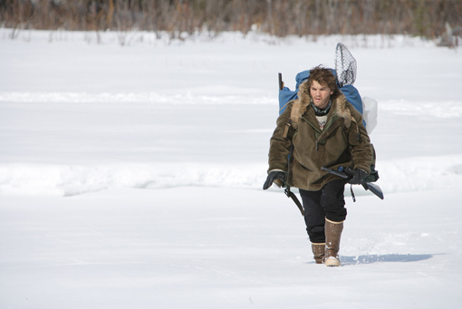

## **Klapbord**

**Into the Wils** is _een onafhankelijke Amerikaanse_ River Road productie. De regie is van de acteur en regisseur _Sean Penn_. Het is de vierde speelfilm van de eigenzinnige Sean Penn waarin hij telkens reflecteert over vervreemding en verlies: _The Indian Runner, The Crossing Guard, The Pledge_.  Met **Into the Wild** verdiept hij zich in het ware verhaal van de 22-jarige drop-out Chris McCandless. De film is gebaseerd op het gelijknamige non-fictie boek (1996) van Jon Krakauer over de lotgevallen van Chris McCandless (1968-1992).

## **Synopsis**

Chris McCandless wordt in 1968 geboren bij zijn ouders Walt McCandless en Wilhelmina ‘Billie” Johnson. Het gezin zit er warmpjes in. De ouders leiden in Annandale, Virginia een bloeiend consulting bedrijf. Tussen beide partners heersen er echter voortdurende emotionele spanningen die leiden tot openlijke conflicten. Het huwelijk balanceert voortdurend op de slappe koord van de echtscheiding. Chris is een idealist die ook intens fysiek traint. Hij beleeft bijvoorbeeld lopen als een spirituele oefening en zoekt leden voor een cross-country team. Lopen op uithouding is voor hem '_running against the forces of darkness ... all the evil in the world, all the hatred_.'Hij studeert succesvol af aan de W.T.Woodson High School in 1986 en aan de Emory University van Atlanta, Georgia in 1990 met als majors geschiedenis en antropologie. Na die alweer succesrijke studieperiode beslist hij als 20-er zijn gegoede familie, zijn diploma en toekomstige carrière in Virginia achter te laten en westwaarts te trekken. Chris verbrandt zijn spaarcenten, rijdt zijn wagen vast en trekt liftend door het land. Hij ontmoet een hippiepaar, een boer, toeristen, een jong meisje en een weduwnaar maar bewaart afstand. Hij verandert zijn naam in ‘Alexander Supertramp’ en is cultureel en spiritueel goed voorbereid, maar tegenover bepaalde uitdagingen van de natuur blijkt dat hij toch niet goed te zijn uitgerust, wat hij ervaart tijdens een kanotocht of een verblijf tussen daklozen in LA. Zijn ervaringen onderweg sturen hem richting Alaska. Ongerepte natuur en zowat het laatste nog resterende gebied voor wie ‘weg’ wil uit de beschaving. Maar Chris is opnieuw onvoorbereid. Slechts giften (laarzen, warme kleren, mes) en een beschavingsrestant (een verlaten ‘magische bus’) leveren bescherming in wat snel een ongelijke overlevingsstrijd wordt. In 1992 sterft Chris door totale verzwakking en voedselvergiftiging.

## **Cinematografie**

AUTOBIOGRAFISCHE WOORDEN. Bij het openingsbeeld van **Into the Wild** geeft Penn aan dat woorden tellen. Ze zijn van belang. Hij opent met een zwart beeld met daarop de verzen van Lord Byron, die ook voor Chris een inspiratiebron waren:

>There is a pleasure in the pathless woods; 
>There is a rapture on the lonely shore; 
>There is society, where none intrudes, 
>By the deep sea, and music in its roar: 
>I love not man the less, but Nature more. 

De woorden zijn belangrijk in de film, maar niet zoals bij een documentaire waar in voice-over wordt verteld wat er te zien is. Sean Penn maakt van de biografie over Chris ook gedeeltelijk een _autobiografie_. Hij laat Chris zelf aan het woord. Dat gebeurt concreet door woorden die al schrijvend in gele letters verschijnen op het beeld. Dat is bijvoorbeeld het geval met de titel **Into the Wild** Het is het tweede deel van de zin die Chris zelf op het scherm schrijft: '_I now walk into the wild_.' Zijn woorden zijn gebaseerd op het schrift dat bij zijn dode lichaam is gevonden. De jonge man noteerde zijn gedachten. Sean Penn introduceert de toeschouwer met de woorden van Chris op het ogenblik dat hij in 1992 aankomt aan het eindpunt van zijn tocht: de Stampede Road, ergens in Alaska waar geen mens met een auto of ander vervoermiddel nog voorbij kan. De woorden in de vorm van _schriftbeelden_ geven aan de film zijn _meditatieve_ dimensie en doen recht aan de _beschouwelijke_ geest de Chris zelf is geweest. In een houten plank kerft hij zijn ‘onafhankelijkheidsverklaring’.

ROAD MOVIE. De film is een road movie genoemd. Dat is slechts gedeeltelijk waar. De film heeft namelijk geen lineaire structuur in de zin dat het personage van een punt vertrekt en op een bepaald punt aankomt. Zo eenvoudig liggen de zaken niet bij **Into the Wild**. Na de openingstekst van de dichter Lord Byron, volgt er eerst een korte sequentie met de ouders. De moeder schrikt wakker. Ze heeft een vreemde droom gehad en zegt tegen haar man: '_Ik hoorde hem._' De stem van de ongeruste ouders is eerst hoorbaar. De toeschouwer ontdekt pas op het einde van de film dat dit het ogenblik was waarop Chris is gestorven. Na die korte openingsequentie met de ouders, volgen de sequenties van de aankomst van Chris op het eindpunt van zijn tocht nabij de berg McKinley in Alaska op 27 april 1992. Met andere woorden, niet eerst de reis, maar de aankomst.

FLASHBACK. De film is gestructureerd als een veelzijdige flashback. Die komt voort uit de beschouwende geest van het hoofdpersonage Chris. _De eerste tijdslaag_ van de flashbacks is die van de voorbije reis die Chris heeft afgelegd. En dan reist hij verder in de tijd: zijn leven thuis bij zijn welstellende, maar ruziënde ouders. Binnen _die tweede tijdslaag_ treedt er nog een flashback op, die van zijn zus Carine. Zij reflecteert ook over Chris, hoe hij vroeger was. Zij zoekt erin de reden van zijn vrijwillige verdwijning.  

## **Betekenisruimte**

EEN JEZUSFIGUUR. **Into the Wild** handelt over _een reis naar spirituele volwassenheid_. Dat blijk uit de titels van de hoofdstukken die Penn aanbrengt in de film: ze heten ‘geboorte, ‘adolescentie’ en ‘het bereiken van wijsheid’. Vanuit die spirituele basis van het portret tekent Penn de jonge volwassen Chris als iemand die zich tijdens zijn tocht tussen de mensen beweegt als een Jezusfiguur. Dat gebeurt subtiel maar daarom niet minder diepgaand. Helemaal in de biografische lijn van de echte Chris — toevallig verwijst zijn voornaam naar Christus — laat Penn, in de flashbacks van de tocht, zien hoe Chris bij de mensen die hij ontmoet goedheid en menslievendheid oproept. Hij heeft in zich een bewuste ethische zuiverheid ontwikkeld, mede geïnspireerd door een christelijke auteur als _Leon Tolstoi_.

IN DE GEEST VAN DE BERGREDE.**Into the Wild** brengt met sympathie en maar ook met een groot mededogen een hedendaagse mens in beeld die in de geest van de evangelische Bergrede een bron van goedheid en liefde voor de mens wil zijn. Die wil komt niet uit de opvoeding die hij thuis heeft gekregen. Hij keert zich af van het gezinsleven dat kent en gebouwd is op leugen, geruzie en rijkdom. Hij gaat zelf op zoek naar meesters in de spiritualiteit en vindt die in christelijk geïnspireerde auteurs als Tolstoi. Interessant is te zien hoe een jonge en talentrijke jonge man, een zoon van het in welvaart badende Amerika, zich een eigen weg baant naar zijn diepste wezen als mens. Hij vindt _die religieuze kern_ niet in een of andere gevestigde religie, maar in de dagelijkse omgang met concrete mensen die zijn pad kruisen en uiteindelijk in de ongerepte natuur. Eerst is die natuur een bron van religieuze ervaring. Geleidelijk ontdekt hij echter de vijandige zijde van die natuur. Die houdt hem een spiegel voor waarin hij beseft dat hij het contact met andere mensen nodig heeft om _de religieuze ervaring van innerlijke zuiverheid_ te kunnen delen en beleven. Op het ogenblik dat hij naar de mensenwereld wil terugkeren, ontdekt hij echter dat hij zonder enig voedsel gevangen zit op een tijdelijk eiland vanwaar hij niemand kan bereiken. In dat inzicht aanvaardt hij zijn onvermijdelijke dood.  

## **Context**

Sean Penn wil meer dan enkel de biografie van een zonderling geval, Chris McCandless, in beeld brengen. In zijn optiek is dit ook de biografie van een jonge generatie. Penn wil het portret filmen van een opgroeiende generatie in de jaren negentig van vorige eeuw en van het eerste decennium van de twintigste eeuw. Een generatie die ontevreden is met de vooral morele gang van zaken in de westerse wereld in het algemeen en de Verenigde Staten in het bijzonder. In zijn ‘onafhankelijkheidsverklaring’ spreekt Chris over ‘_een spirituele revolutie_’. Sean Penn idealiseert het hoofdpersonage niet; hij oordeelt of veroordeelt niet. Hij laat de jonge man zoveel mogelijk zelf aan het woord, maar laat ook zijn ouders en zijn zus zien die hem missen. Penn laat ook zien dat Chris de natuur zelf overschat. Hij kent er te weinig van en dat gebrek aan kennis wordt zijn dood. Penn toont vooral respect voor het avontuur van Chris en het meest van al voor zijn spirituele motieven. Hiermee wil hij aantonen dat niet alle westerse jongeren zich laten meesleuren door de materiële golfstroom van rijkdom en consumptie. Die golfstroom is verbonden met de politiek van het neoliberalisme, vooral het waarmerk van de drie presidentschappen van de Bush-familie. Via een foto van het eerste presidentschap, dat van George H.W. Bush (1989-1993), verwijst Penn daar expliciet naar zonder ook maar op één moment een politiek statement te willen maken. 

## **Links**

In _Leren Leven Met Beelden_ nr. 15 (2009) verscheen er een voorstelling van de film. Er is een website gewijd aan [Chris McCandless](http://www.christophermccandless.info/).

© Sylvain De Bleeckere, Men(S)tis, 2011/2017
