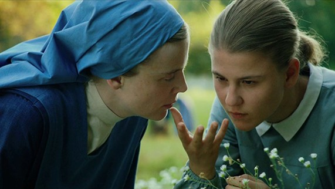

## **Klapbord**

De historisch-biografische film **Marie Heurtin** ging in de zomer van 2014  in première tijdens het internationaal filmfestival van Locarno. Hij won er de _Variety Piazza Grande Award_. De internationale titel is **Marie’s Story**. De Franse regisseur _Jean-Pierre Améris_ baseerde zich op het goed gedocumenteerde verhaal van _Marie Heurtin_. Ze kwam doofblind ter wereld in 1885 en overleed op 36jarige leeftijd op 22 juli 1921. Het meisje had de eerste dertien jaren van haar leven geen enkel contact met zichzelf en haar omgeving. Ze had geen enkel besef wie ze was en waar ze was. Ze bleef  onhandelbaar. Dat veranderde op haar veertiende. Ze kwam dan terecht bij de kloosterzusters _Filles de la Sagesse_. Die bestuurden het _Institut Notre-Dame de Larnay_ bij Poitiers, Frankrijk. Het instituut bestaat nog steeds. Sinds 2006 hebben de zusters het bestuur overgedragen aan de vereniging Larnay Sagesse. Priester _Chaubier de Larnay_ stichtte het instituut in 1847 met als doel sensorieel gehandicapte personen, blinden en doven, op te vangen en te begeleiden. Doofblinden zijn heel uitzonderlijk. Eén van de uitzonderingen was Marie Heurtin. In het Institut Larnay ontfermde de kloosterzuster _Sainte-Marguerite_ ontfermt zich over de veertienjarige doofblinde Marie Heurtin. De zuster ontwikkelde een pedagogie waarmee ze erin slaagde om contact te krijgen met het doofblinde meisje. Door de jaren heen kon Marie Heurtin aldus _een eigen menselijke persoonlijkheid_ opbouwen. Aan het werk van zuster Marguerite dankt het instituut zijn bekendheid. De film is gebaseerd op _de wetenschappelijke documentatie_ over het pedagogische werk van zuster Marguerite met Marie Heurtin. De Franse professor Louis Arnould, verbonden aan de universiteit van Poitiers, wijdde reeds in 1900 in zijn wetenschappelijk werk _Une âme en prison_ een uitgebreide studie aan Marie Heurtin. Zijn studie werd in 1907 nog uitgebreid met een beschrijving van de behandeling van een tweede doofblinde vrouw, Anne-Marie Poyet en met een uitbreiding van het geval Marie Heurtin door haar zuster Marthe Heurtin. De nieuwe titel van het werk dat verwijst naar de eerste studie luidt: _Âmes en prison, l’École française des sourdes-muettes-aveugles_ (1910). De regisseur Jean-Pierre Améris schreef zelf het scenario samen met Philippe Blasband op basis van de historische bonnen. Daarbij legden ze de nadruk op de relatie tussen de twee betrokken vrouwen, zuster Marguerite en Marie Heurtin. De actrice _Isabelle Carre_ nam de rol van de zuster op zich en bereidde zich een half jaar voor met het leren van de Franse gebarentaal. De dove _Arianan Rovoire_ werkte nooit eerder als actrice. De regisseur koos haar voor de rol van Marie Heurtin. De vertolking van beide vrouwen is indrukwekkend.

## **Synopsis**

De ouders van Marie Heurtin hebben hun doofblinde dochter met liefde opgevoed. Ze staan echter machteloos tegenover de ingrijpende handicap van hun meisje. Ze zijn er bijvoorbeeld al die jaren niet in geslaagd het meisje schoenen aan te doen en behoorlijk te kleden. Het kind heeft immers geen enkel contact met zichzelf noch met haar omgeving. De ouders kunnen niet communiceren met hun opgroeiende dochter. Ze herkent haar ouders enkel via de geur en door met haar handen de gezichten te betasten, maar wie eigenlijk wie ze zijn. Met haar zorgende vader heeft ze een goede band. Ze vertrouwt hem. Ze willen de opgroeiende Marie niet laten opsluiten in een asiel voor krankzinnigen. Ze vragen aan het nabijgelegen Larnay Instituut haar te willen opnemen. De moeder-overste weigert, terwijl zuster Marguerite zich geroepen voelt om het meisje te helpen. Ze weet de moeder-overste te overtuigen. Ze krijgt de toestemming van haar overste om het meisje te gaan halen en mee te brengen. Eens aangekomen in het klooster en het internaat, begint het opvoedingswerk van zuster Marguerite. Ze moet improviseren. Ze laat zich niet ontmoedigen door tegenslagen. Ook de scepsis van haar overste  kan haar motivatie en inzet niet temperen. Ondersteund door vooral haar dove medezuster Raphaëlle, gaat zuster Marguerite met een eindeloos geduld te werk. Ze experimenteert. Haar medezusters Véronique, Joseph, Elisabeth, Marthe, Anne, Clothilde en Marie-Ange volgen het verloop van de opvoeding van Marie met verwondering, soms met ongeloof en zelfs met scepsis. Uiteindelijk slaagt Marie een eerste contact te krijgen met de geest van Marie. Het meisje ontwaakt en begint aan een ongekend leerproces. Tussen Marie en zuster Marguerite ontstaat er een heel sterke band. Die wordt op de proef gesteld door de zwakke gezondheid van zuster Marguerite. Uiteindelijk kunnen ze allebei afscheid nemen op het sterfbed van zuster Marguerite. Marie bezoekt het graf van zuster Marguerite,en spreekt tot haar, over de dood heen, in de gebarentaal die ze van haar heeft geleerd. 

## **Cinematografie**

WARME KLEUREN. De film kent een zonnige uitstraling. Dat komt door de aandacht voor de _volle kleuren_, zelfs in de sequenties die zich in de winter situeren. Het eerste deel van de film speelt zich trouwens af in de lente. Het is in de meimaand, de Mariamaand, dat zuster Marguerite, met toestemming van moeder-overste, Marie gaat halen bij haar thuis om ze mee te nemen. De _zonovergoten_ beelden vertolken de blijheid van zuster Marguerite. De blijde lentebeelden krijgen nog versterking van de begeleidende _zonnige muziek_ waarin de speelse, maar warme fagot een hoofdrol speelt. Het betreft _Jeux d’enfants, After Janacek’s Moravian Folksongs V_ van Franck Krawcyck. Voorts straalt de _licht blauwe kleding_ van de zusters een blijde eenvoud uit.   

CYCLISCHE TIJD. De film is lineair opgebouwd, maar toch staat de duur van het verhaal in het teken van de cyclische tijd. De openingssequenties brengen zuster Marguerite en Marie samen. Eens Marie in het instituut is waar zuster Marguerite zich over het meisje ontfermt, begint de zuster _een dagboek_. Regelmatig volgen er korte sequenties met zuster Marguerite schrijvend in haar dagboek. Daarna gaat haar stem die uitspreekt wat ze schrijft, verder in voice-over bij de beelden van het leerproces van Marie. Dat dagboekdeel dat tevens het grootste deel van de film omvat, is gestructureerd via _de kalenderdagen_ die de zuster in haar dagboek noteert. Het begint op 10 mei. Daarna volgen nog 27 mei, 26 juli, 20 september, 27 oktober, 15 november, 15 juni, 20 april. Het valt op dat bij de data _geen jaartallen_ staan. Hiermee lost Améris het probleem op van de duur van het leerproces. Het is onmogelijk om dat leerproces dat jaren bestrijkt, binnen de tijdsduur van een film weer te geven. Alleen via suggestie is het mogelijk om het wezenlijke van dat reële proces te evoceren. Via de data beschrijft de regisseur _een cyclus van lente (mei) tot lente (eind april)_. Het is de _natuurcyclus van de wedergeboorte_. In dat teken plaatst de regisseur het hele leerproces dat zuster Marguerite en Marie Heurtin samen doormaken.

PANO EN CLOSE-UPS. Het beeldformaat varieert van panorama tot close-up. In _de buitenbeelden_ plaatst de regisseur de personages in de omgeving, de natuur. Dat gebeurt in het eerste deel van de film vooral in de sequenties van de weg die zuster Marguerite samen met Marie te voet aflegt van Marie’s thuis tot aan het instituut. In de buitensequenties die zich situeren in het instituut gebruikt de cineast het kleinere panoramaformaat om de personages te situeren in de groetentuin, de grote tuin met vooral gras en enkele bomen en het kleine kerkhof. Het formaat in _de binnensequenties_ is vooral dat van de close-up. De talrijke close-ups brengen de pedagogische werk van zuster Marguerite in beeld. De close-ups van _de gezichten van zuster Marguerite en Marie_ zetten het wonder van het contact tussen beiden in reliëf. Dat contact verloopt immers zonder woorden. Dat verklaart waarom de close-ups van _de handen van beide vrouwen_ het visuele leidmotief van de film vormen. 

BEELDMETAFOREN. De film kent geen visuele bravoure. Hij oogt eenvoudig. Dat sluit aan bij _de spiritualiteit van de eenvoud_ die het werk van de zusters typeert. Ze leiden een bestaan in eenvoud en ze stellen zich in dienst van de opvoeding van de meisjes met een zintuiglijke beperking. Die cinematografische eenvoud krijgt een grote diepgang via _enkele beeldmetaforen_ die op het dagelijkse leven zijn geënt. Juist in een omgeving waar woorden amper een rol spelen, ontwikkelt zich _het beeldend denken_ via visuele metaforen op een manier die alleen de kunst van de cinematografie kan realiseren. De belangrijkste beeldmetafoor is die van _het zakmes_. Zuster Marguerite ontdekt in het huis van de ouders van Marie dat het meisje zeer gehecht is aan het zakmes. Ze neemt het in haar handen en ruikt er het intens aan. Zuster Marguerite gebruikt dat zakmes om een eerste vorm van communicatie te realiseren met Marie. Daarnaast groeien via talrijke close-ups _de handen_ uit tot sterke lichaamsmetaforen. In tal van sequenties vormt het spel van de handen een eigen visuele partituur. Een andere belangrijke beeldmetafoor is die van _de boom_. De regisseur brengt ermee _een inclusie_ aan in de film. Bij de eerste aankomst van Marie op het Institut Notre-Dame de Larnay vlucht Marie in de boom. Zuster Marguerite probeert haar te overtuigen om terug naar beneden te komen. Op het ogenblik dat dit bijna lukt, komt moeder-overste tussen waardoor zuster Marguerite uit de boom valt. Naar het einde toe, met name in de sequenties die in het teken staan van de stervende zuster Marguerite, komt er opnieuw een boomscène voor. Opnieuw is Marie in de boom geklommen. Ze is gefrustreerd omdat de zieke zuster Marguerite haar niet meer in haar kamer wil toelaten. De zuster heeft immers grote moeite om afscheid van Marie te nemen. Opnieuw komt de moeder-overste tussen, maar nu in de positieve zin. Ze weet zuster Marguerite te overtuigen om Marie toe te laten bij haar ziekbed. Daarna is het de moeder-overste die zelf in de boom klimt om Marie te overtuigen om naar beneden te komen en opnieuw voor de zieker zuster Marguerite te gaan zorgen. De boom krijgt in die dramatische context en door de inclusie de betekenis van _de levensboom_. Hij brengt zuster Marguerite en Marie samen bij het begin en op het einde.  

DE KLANK VAN CELLO EN VOGELS. Naast de reeds vermelde zonnige muziek in het eerste deel van **Marie Heurtin**, is het vooral _de cellomuziek_ de filmbeelden begeleidt. Voor de instrumentale filmmuziek tekende de Franse celliste _Sonia Wieder-Atherton_. Ze vertolkt samen met Matthieu Lejeune en Sarah Lancu fragmenten van Claude Monteverdi’s _Madrigali Guerrieri et Amorosi, Libro VIII : Altri Canti d’Amor_. Voorts speelt ze een eigen bewerking van _Jeux d’enfants, After Janacek’s Moravian Folksongs I-VII_ van Franck Krawcyck, _de Vespers_ van Rachmaninov, _Variaties on a Slovak Folksong 1-5_ van Bohuslav Martinu, _het Rückert-Lied Ich bin der Welt abhanden gekommen_ van Gustav Mahler, _La chanson de Marie_, Sonia Wieder-Athertons bewerking van een Joodse tradional voor cello. Via de keuze voor de cello als leidend instrument krijgt de filmmuziek een homogeen karakter. De hoofdtoon is _ingetogen, met een ondertoon van beheerste droefheid_. Die begeleidt _de innerlijke strijd_ van zowel zuster Marguerite als van de doofblinde Marie. De muzikale uitzonderingen zijn het reeds vermelde zonnige _Jeux d’enfants, After Janacek’s Moravian Folksongs V_ van Franck Krawcyck, alsook Bachs _Sicilienne_. Dit laatste stuk wordt in de film zelf op piano gespeeld door een medezuster van zuster Marguerite. De piano staat in de eetzaal van de zusters. In de scène met de piano leert Marie voor het eerst de wereld van de muziek en de muziekinstrumenten verkennen. Naast de muziek, monteert  Améris ook _natuurgeluiden_, in het bijzonder _het gefluit van vogel_. Het instituut die het internaat voor de meisjes en het klooster van de zusters omvat, ligt immers midden in de natuur. De stemmen van de vogels die zich ophouden in de grote tuin met bomen van het instituut, begeleiden vooral de buitenbeelden met zuster Marguerite en Marie. Vooral in de momenten van harmonie en verstandhouding tussen beiden situeren zich buiten, begeleid door de vogels. De slotsequentie met Marie bij het graf van zuster Marguerite situeert zich ook in de grote tuin waar zich het kerkhof van de zusters bevindt. De binnenbeelden onderlijnen vooral de strijd die zuster Marguerite moet voeren om Marie uit haar duisternis te halen, een strijd die grenzeloos geduld vereist. Die binnenbeelden krijgen vooral een cellobegeleiding.

## **Betekenisruimte**

DE GEBOORTE VAN DE GEEST. De kracht van de film **Marie Heurtin** reikt verder dan de re-enactment van de historische case van de doofblind geboren Marie Heurtin en haar opvoedster zuster Marguerite. Via die filmische reconstructie, herinnert de regisseur de toeschouwer aan _een zeer fundamenteel menselijk fenomeen_, namelijk dat van _de geboorte en de wording van de geest_. Met die geest is niet alleen de identiteit van de mens als mens en individu gegeven, maar eveneens het onlosmakelijk fenomeen van de opvoeding en de menswording. Geen mens die wordt geboren, is in staat zichzelf op te voeden. En dat geldt bij uitstek voor wie doofblind ter wereld komt. Doofblindheid van bij de geboorte, officieel _aangeboren of congenitale doofblindheid_ genoemd, is eerder zeldzaam. Tot in de tweede helft van de negentiende eeuw, de tijd van Marie Heurtin, werd een opgroeiende doofblinde als ‘abnormaal, wild, gek, idioot’ beschouwd, waarvoor er geen remedie of therapie bestond. Overleden hij of zij niet op jonge leeftijd en werd hij of zij volwassenen, dan kwamen die terecht in een gesloten instelling voor psychiatrische patiënten, toen in de volksmond ‘een gekkenhuis of zothuis’ genoemd. Kortom, opsluiting! Dat laatste wilden de ouders van Marie Heurtin vermijden. Ze konden echter geen kant uit daar ze zelf hun opgroeiende dochter niet meer in bedwang konden houden. Daarom zochten ze hun toevlucht tot het nabijgelegen Institut Notre-Dame de Larnay, gespecialiseerd in de opvoeding van dove meisjes. Zuster Marguerite beschouwde het als haar roeping om alles te proberen om de doofblinde Marie te helpen. De film brengt _het opvoedingsproces_ in beeld, dat zich tussen beiden heeft afgespeeld. Hierdoor krijgt de toeschouwer de gelegenheid om met zuster Marguerite mee _het wonder van de geboorte van de menselijke geest_ te zien voltrekken. Alles staat daarbij in het teken van het contact krijgen met zichzelf en de eigen omgeving. In [Levensbeschouwing democratisch belicht](http://www.menstis.be/uitgeverij/Levensbeschouwing) wordt die open relatie tussen de mens en de wereld rondom als ‘_het contactum_’ belicht. 

In **Marie Heurtin** staat alles in het teken van het ontstaan van dat contactum. Dat gebeurt via de beeldmetafoor van _het zakmes_. Voor Marie is het een bijzonder voorwerp. Ze voelt en ruikt het. Tegelijkertijd belichaamt het zakmes ook de onmogelijkheid om in contact te komen met de dingen. Ze weet niet wat het zakmes precies is, wat het betekent en hoe ze het kan gebruiken. Dat verandert wanneer ze onder leiding van zuster Marguerite leert eten met mes en vork. Van zodra dat lukt, neemt zuster Marguerite dit succes als opstap om de link te leggen met het zakmes. Ze brengt Marie het eerste teken van de gebarentaal bij: _twee vingers die over elkaar bewegen_. ‘Couteau’! Dat herhaalt ze honderden keren na elkaar, uren lang. Ze houdt Marie aan de tafel, ook al is het tijd om te gaan slapen. Ze houdt vol. Plots breekt het inzicht door bij Marie. Ze legt voor het eerst een verband tussen het zakmes en het teken van de gebarentaal. Zuster Marguerite omhelst Marie, beiden lachen. De geest, de ‘_mind_’, van Marie is ontwaakt, acht maanden na haar aankomst in het instituut. Van dat moment af, leert ze heel erg snel. Dat komt omdat ze de moeilijke grens naar het contactum heeft overgestoken. Ze begint te begrijpen dat ze in contact staat met dingen die een naam en een betekenis hebben. Ze leert wat leren is. Voorheen kende ze aangename momenten van verwondering: de ontdekking van het stromende water van de rivier, de zachte, warme huid van de koe. Op die momenten kon het contact echter niet doordringen tot haar omdat haar geest _volkomen afgesloten_ was, ook en vooral voor het contact met zichzelf. 

Met het eerste gebaarteken ‘mes’ verwerft ze een sleutel waarmee ze _toegang_ krijgt tot haar eigen geest en via haar geest opent zich _het contact met de werkelijkheid_ rondom haar. De film belicht dat wonderlijk gebeuren door de mentale ontwikkeling van Marie helemaal in het teken van _de levensboom_ te plaatsen. In de boom zoekt ze veiligheid bij haar aankomst in het instituut en daar vindt ze op het einde opnieuw een houvast. Zo blijkt dat _de geboorte van de geest voor Marie en bij uitbreiding voor iedere mens_ de deur opent van _de werkelijkheid van het leven_. Aan die werkelijkheid krijgt ieder mens als pasgeborene deel zonder het te beseffen. In de slotsequentie, bij het graf van zuster Marguerite, spreekt Marie in gebarentaal tot de zuster in de hemel. Ze eert haar als haar _tweede moeder_, zij die haar het leven als unieke mens heeft geschonken. Via het mentale leven leert ze zichzelf zien in relatie tot alles wat tot het leven behoort, ook het sterven. Ze zegt: ‘_Ik denk de hele dag aan jou, ’s morgens als ik wakker word, ’s avonds als ik slapen ga. Wanneer ik nieuwe dingen leer, denk ik aan jou._’ 

Er komt een zeer krachtig tafereel voor in de film. Die staat helemaal in het teken van _de ontmoeting van Marie met haar ouders_ in het instituut. Daar blijkt hoe dochter en ouders nu voor de allereerste keer contact met elkaar hebben. Marie heeft door het werk van zuster Marguerite contact met zichzelf gekregen, waardoor ze nu ook in contact kan treden met haar ouders, met wie ze altijd heeft geleefd, maar die nooit heeft kunnen kennen. Dan blijkt hoe de menselijke geest tijdens dat contact, die herkenning, vervuld wordt van _dankbaarheid_. Die heeft betrekking op het besef van aanwezig te mogen zijn in het leven, een gave die een mens bij de geboorte krijgt. Aan haar ouders kan ze nu zeggen: ‘_Ik hou van jullie_’. 

Het wonder van de geboorte van de menselijke geest voltrekt zich in _het intens contact met de eigen oorsprong_, die via de ouders uiteindelijk leidt naar _het heilig mysterie van het leven zelf_. Juist iemand als Marie Heurtin die in zeer extreme omstandigheden moet leven, komt tot een sterker inzicht in _het wezen van die dankbaarheid, eigen aan het contactum_, dan ontelbare mensen die het leven ervaren als niets meer dan een dagelijkse gewoonte. Hun sterkste gevoel is dat van de verveling. 

Het gevoel van verveling is volkomen vreemd aan Marie en zuster Marguerite. Via de grote inspanningen die de zuster levert om toegang te krijgen tot Marie, krijgt ze ook meer toegang tot _het mysterie_ van haar eigen menselijk wezen. Als kroongetuige van het wonder van de geboorte van de geest bij Marie, treedt zuster Marguerite zelf ook opnieuw binnen in het mysterie van de menselijke geest en zo in het mysterie van het leven zelf. Ze zegt: ‘_Marie heeft mij zoveel gegeven. Ze heeft me een wereld leren ontdekken waarvan ik niets wist. Een wereld die je aanraakt, een wereld waarin alles wat leeft, onder de vingers vibreert._’ 

De film **Marie Heurtin** is voor de toeschouwer een sterk antidotum tegen de existentiële verveling, of positief geformuleerd: de film helpt de toeschouwer het wonder van de eigen menselijke geest en het contactum te herontdekken, vervuld van een gevoel van dankbaarheid.

CHRISTELIJK LEVENSWERK. Beschouwd vanuit het perspectief van het personage van zuster Marguerite, valt er een bijzonder licht op de eigen betekeniswereld van de film. Dat zij een kloosterzuster is die zich in dienst stelt van zintuiglijk gehandicapte meisjes, is niet zonder betekenis. De zorg om de nieuwe, onhandelbare Marie beschouwt ze als haar _roeping_. Die heeft een door en door _christelijke_ motivatie. Tegenover haar sceptische moeder-overste spreekt zuster Marguerite zelfs over ‘_een openbaring_’ (‘_une révélation_’) die ze heeft gehad. Ze interpreteert die vervolgens als ‘een idee’, een ingeving. Dat daarin haar _evangelische_ bezieling om in de voetsporen van Jezus zelf te treden, een hoofdrol speelt, staat buiten kijf. De moeder-overste wijst zuster Marguerite erop dat ze zelf een veel te zwakke gezondheid heeft: ‘Dat u nog leeft, is een wonder.’ Ze mag geen zware inspanningen doen. Dat kan haar fataal zijn. Toch zet zuster Marguerite door, ze trekt haar moeder-overste over de streep en brengt persoonlijk Marie naar het instituut. Van dan af volgt er de grote inspanning van het opvoedingswerk die haar uiteindelijk toch fataal wordt. Ze spaart haar schaarse krachten niet en die raken op. In de concrete context gezien, _geeft ze haar leven_ voor de mentale geboorte van Marie. 

De film blijft sober over wat _de expliciet christelijke bezieling_ van zuster Marguerite, op de aanwezigheid van de kloosterkleding na. Het kloosterleven zelf komt niet in beeld omdat de focus ligt op de pedagogische relatie tussen Marie en zuster Marguerite. Toch zijn er twee scènes waarin op de achtergrond iets van _de christelijke bezieling_ van de zuster zichtbaar wordt. Het betreft twee momenten in scènes die zich situeren in de eetzaal. De zusters en de meisjes eten samen in stilte, terwijl tijdens het eten, zoals gebruikelijk is een klooster, iemand voorleest uit de rijke christelijke literatuur. Concreet betreft het een fragment uit de _Fioretti_, een anoniem geschrift uit de 14de eeuw, met verhalen over het leven van de heilige _Franciscus_. Het verhaal handelt over de heilige Franciscus en zijn broeder Leo, Franciscus' grootste vertrouweling, tevens zijn secretaris en biechtvader. Ze zijn samen onderweg naar een klooster. Ze zien er uit als bedelaars en schooiers. Broeder Leo vreest dat de portier van het klooster hen omwille van hun verschijning niet zal binnenlaten. Franciscus stelt broeder Leo gerust. Hij vraagt de broeder zich niet boos te maken maar te reageren met ‘humilité’ en ‘charité’, nederigheid en naastenliefde. Terwijl de lectrice de tekst aan het lezen is, zoomt de camera in op zuster Marguerite die _een fysiek gevecht_ levert met Marie aan de tafel. Ze probeert het meisje aan de tafel te houden. In de film zien we hoe de zuster zich nooit boos maakt, nooit haar geduld verliest. Ze volhardt vanuit haar nederigheid en grote naastenliefde. Hierbij verschijnen _die christelijke, Franciscaanse deugden_ niet als een teken van zwakheid, maar, zo blijkt, van _grote kracht en inzet_ die het onmogelijke mogelijk maken. 

In een ander tafereel dat zich ook in de eetzaal situeert, leest een zuster het verhaal uit de _Handelingen van de Apostelen, hoofdstuk 9_. De nadruk in de film ligt op het gegeven dat Saulus die door een verblindend licht waarin de verrezen Jezus hem verscheen, van zijn paard viel en ‘drie dagen niets zag’ (Hand. 9:9). Het fragment komt voor in de episode dat zuster Marguerite door de moeder-overste op rust is gestuurd in een sanatorium in de bergen. Marie begrijpt niet  waarom ze zuster Marguerite nergens meer vindt. Geconfronteerd met die afwezigheid en leegte, sluit Marie zich in zichzelf op. Ze weigert te eten en deel te nemen aan het dagelijkse ritme in het instituut. Gealarmeerd door een brief van zuster Raphaëlle, keert zuster Marguerite terug naar het instituut, tegen het advies van haar dokter in. Wanneer beiden elkaar terug ontmoeten, schrijft zuster Marguerite in haar dagboek: ‘‘_Ze is mijn vreugde. De dochter van mijn ziel. Het licht van mijn leven._’ In de geest van de evangelische [Bergrede](http://www.menstis.be/blog) wijdt zuster Marguerite zich aan de geboorte van de geest van Marie. Haar christelijk werk oogt als dat van een vroedvrouw die helpt om nieuw leven te laten geboren worden. Het betreft hier een spirituele geboorte. Het christelijkelevenswerk verschijnt hier als een _dienstwerk_ waarbij een mens toegang krijgt tot zijn eigen geest en daardoor tot het heilig wonder zelf van het leven.

  

## **Context**

De film **Marie Heurtin** brengt ook ongewild een hulde aan _het stille, maar baanbrekende werk van de ontelbare kloosterzusters_ in de katholieke landen van Europa in de negentiende en de eerste helft van de twintigste eeuw. Hun werk, zoals dat van de _Filles de la Sagesse_, situeede  zich in de zorgsector, de medische inbegrepen, en het onderwijs. Daarbij hebben ze, los van theologische en ideologische discussies en debatten, gekozen voor de concrete, kwetsbare mensen, de kinderen en de jeugd, in het bijzonder de meisjes. In de tweede helft van de negentiende eeuw was _vrouwenemancipatie_ geen punt op de agenda van zowel de klerikale Kerk als op die van de burgerlijke maatschappij. Die burgerlijke maatschappij was zich op dat ogenblik aan het verliezen in het cultiveren van nationalistische gevoelens, de noodlottige kiemen voor de komende Wereldoorlogen. 

## **Links**

[Hier](https://www.facebook.com/MarieHeurtin.lefilm) vind je de Franse Faceboek pagina van **Marie Heurtin** met onder andere enkele videogesprekken met de regisseur en de actrices.

[Hier](http://www.fdlsagesse.org/cms/article-161-FR-a-l-institution-de-larnay-un-grand-anniversaire.html) vind je internationale site van de _Filles de la Sagesse_. 

© Sylvain De Bleeckere, Men(S)tis, 2017
