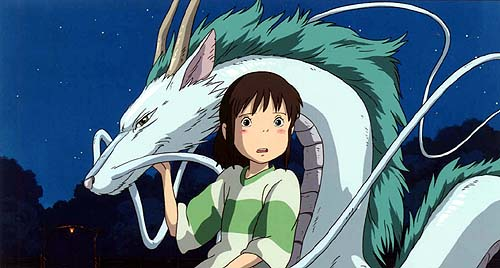

## **Klapbord**

In 2003 won Hayao Miyazaki met zijn **Spirited Away [Sen To Chihiro No Kamikakushi]** niet alleen de Gouden Beer van het Berlijnse filmfestival, maar ook de Oscar voor de beste animatiefilm. De film is dan ook de kroon op het werk van de Japanse 'keizer' van de animatiefilm. Reeds meer dan negenerdertig jaar werkt hij consequent aan zijn oeuvre waarrond hij in Mitaka, een buitenwijk van Tokio, een eigen productiehuis, _de Ghibi Studio's_, en een eigen museum heeft uitgebouwd. Met zijn eerdere productie **Prinses Mononoke** (1997) oogstte hij al internationale erkenning. Hij schrijft zelf de verhalen die voor alle generaties boeiend en verrijkend zijn.

## **Synopsis**

Het tienjarig meisje Chihiro moet tegen haar zin verhuizen. Haar ouders, Akio en Yugo, brengen haar naar het nieuwe huis. Onderweg rijdt haar vader verloren. De ingeslagen weg loopt dood in een bos waar de drie plots voor een verlaten poortgebouw staan. De ouders lopen, alweer tegen de zin van Chihiro, door de lange tunnel onder het poortgebouw. Die geeft toegang tot wat de vader interpreteert als een verlaten pretpark. In één van de gebouwen vinden ze een gedekte tafel. Zonder aarzelen beginnen de ouders van Chihiro gulzig het uitgestalde voedsel te verorberen. Vol ergernis laat Chihiro haar ouders achter en wandelt ze het park verder in. Dat lijkt helemaal niet zo verlaten te zijn als het wel lijkt. Een jongen, Haku, waarschuwt haar dat ze zich op verboden terrein bevindt en dat dit voor haar als mens levensgevaarlijk is. Wanneer ze snel haar ouders gaat opzoeken, ontdekt ze verbaasd dat die in vetgemeste varkens zijn veranderd. Een grote angst overvalt haar. Ze kan alleen rekenen op de hulp van Haku om in leven te blijven in het pretpark dat bij het vallen van de duisternis verandert in een recreatieoord voor geesten. Het wordt bestuurd door de harpijachtige Yubaba met haar verwende baby Bo. Chihiro krijgt van Yubaba een arbeidscontract op voorwaarde dat ze zichzelf voortaan Sen noemt. Dan mag ze werken in het grote badhuis. Ze wint de sympathie van Yubaba en voelt een hechte liefde voor Haku die over haar waakt. Chihiro houdt één doel voor ogen: haar ouders redden uit de varkensstallen van Yubaba. Met haar ijver, moed en liefde lukt haar dat, maar haar teruggekeerde ouders merken daar niets van. Ze denken dat hun koppige Chihiro verloren is gelopen en dat ze haar nu eindelijk hebben teruggevonden. De Japanse titel luidt trouwens: **Sen en de mysterieuze verdwijning van Chihiro**.

## **Cinematografie**

JAPANSE BEELDTAAL. Regisseur en scenarist Hayao Miyazaki blijft trouw aan de Japanse tekentraditie. Die heeft haar oude wortels in de calligrafie en in de zeer alomverspreide, Japanse stripcultuur (manga) en tekenfilms (anime). Miyazaki loopt niet mee met de heersende trend in de digitale animatiefilm. Die keuze heeft geen reactionaire achtegrond. Ze komt voort uit een esthetische visie. Daarin vormt de lijn de basis van de tekening, terwijl de digitale animatie vertrekt van het vlak. Het gevolg van Miyazaki's esthetische optie is _de rijkdom aan details_. Deze typische Japanse gevoeligheid uit zich ook in de tuinarchitectuur en in de kunst van de bonsai en het bloemschikken. Bij Miyazaki leidt die gevoeligheid tot een weelde aan detailering. De digitale animatie die liever imponeert met kwantiteit, kan dergelijke visuele rijkdom niet evenaren. Daaruit volgt dat de narrativiteit niet domineert, maar voortkomt uit een fundamenteel beeldend concept. _Het beeldend denken_ primeert.

ARCHITECTUURBEELDEN. Een bijzonder cinematografisch aspect betreft de architecturale uitbeelding. De ruimte in het bijzonder en de gebouwen in het algemeen zijn volwaardige personages. Het is op het niveau van de plot geen toeval dat de eerste sequenties in het teken staan van het verhuizen. En wanneer Chihiro het verlaten pretpark binnenstapt, kijkt ze even achterom naar het poortgebouw en zegt ze: '_Het huis zucht_'. De verantwoordelijke voor de artistieke look van de film, Yoji Takeshige, baseerde zich, op advies van de regisseur, op foto's en films van oude Japanse gebouwen zoals die uit de oude Gionbuurt van Kyoto en in het Koganei Park. Voor het centrale badhuis (yuga) stonden de badhuizen van Dogo Onsen model. En voor het huis van Zeniba nam Takeshige de oude Engelse cottage als vertrekpunt. Die vertoont immers enige gelijkenis met oude Japanse boerderijen.

METAMORFOSE. De cinematografie van deze Miyazakifilm steunt op de metamorfose. Tot de esthetische wereld waaroe het esthetische principe van de metamorfose toegang verleent, is in de eerste plaats het cinematografisch beginsel van de beweging. In de openingsbeelden zijn de personages onderweg. Chihiro zit in de auto. Bewegen impliceert onderweg zijn, van plaats veranderen. Die eerste algemene component van de metamorfose verdiept zich in de tweede, die van de gedaanteverandering. Die structureert de dramatische opbouw van de plot en inspireert de verbluffende tekenkunst van Miyazaki.

## **Betekenisruimte**

PEDAGOGISCHE RELATIE. De film beweegt zich op verschillende betekenisniveaus tegelijk. Een eerste niveau is van pedagogische aard en ent zich op de inclusiestructuur. Door het narratief gegeven van Chihiro en haar ouders, is het pedagogische gegeven altijd aanwezig. Het vreemde daarbij is dat het meisje haar ouders moet beschermen. Er ontstaat met andere woorden een omgekeerde pedagogische relatie: Chihiro redt haar ouders, terwijl zijzelf het slechte voorbeeld geven. Het rijgedrag van haar vader in de openeningsequenties getuigt daarvan. Die pedagogische relatie spiegelt zich nog in de relatie tussen Chihiro, Yubaba en baby Bo.

BEELDMOTIEF VAN HET WATER. Een andere betekenislaag betreft de beeldspraak van het water. Het element van het water is _alomtegenwoordig_. Zelfs de trein rijdt over het water. Het centrale gebouw is het badhuis. De riviergod krijgt een visuele en dramatische hoofdrol. Het gegeven van het zich zuiveren door en in het water evolueert naar _het beeld van het water dat zichzelf zuivert in de gedaante van de riviergod_. Door de aanwezigheid van de geesten thematiseert de kunstenaar het element van de spiritualiteit. Interessant is te zien hoe de wereld van de geesten verborgen blijft voor de mensen. Alleen enkele mensen hebben toegang tot die geestelijke wereld en dat is onder andere Chihiro. In de geestenwereld functioneren de mensen als hard werkende dienaars. In die rol bereikt Chihiro een vooraanstaande status dankzij haar hechte band van solidariteit en liefde met enkele bijzondere personages.

## **Context**

CONSUMPTIEBESCHAVING. Met **Spitited Away** thematiseert Miyazaki op een kritische wijze de consumptiehonger waaraan veel kinderen, jongeren en volwassenen vandaag lijden. De verandering van Chihiro's gulzige ouders in vetgemeste varkens, Yubaba's verwende en veel te dikke baby Bo, het zwarte fantoom Zondergezicht verwijzen naar de consumptieziekte. In een inhoudelijk interview bevestig Miyazaki zelf de betekenis van de varkens: '_Zij verslinden alles. Ze vertegenwoordigen **het hedendaagse Japan._'

SJINTOÏSME. Langs het kritische spoor ontwikkelt Miyazaki de waarde van de spirituele band met de traditie. Hij ziet in die band de juiste, pedagogische ruimte. De uitdrukking van die band is aanwezig in het geven van 'goden' (kami) en 'geesten' (rei). In de lijn van het oude sjintoïsme actualiseert de kunstenaar de rijkdom van de spirituele beleving van de werkelijkheid. Kinderen als Chihiro hebben daar nog een natuurlijke toegang toe, maar het zijn de consumerende ouders die die toegang voor de kinderen verzegelen.

TRADITIE EN MODERNITEIT. De actuele cultuurwaarde van de verwevenheid van traditie en moderniteit is in een Japanse context zeer actueel. Er is naast de groeiende tegenstelling tussen Tokio en Kyoto, ook nog de groeiende culturele tegenstelling tussen de agrarische en de stedelijke zones. Het cultuurdomein waarop die tegenstelling zich profileert, is dat van de architectuur. Vandaar dat Miyazaki in zijn film de gebouwen een hoofdrol toebedeelt. De sublieme tekeningen die getuigen van een intense, architecturale verbeelding impliceren een duidelijke kritiek op de strakke en zielloze betonarchitectuur die een stad als Tokio ontsiert. Een architectuur die zich uit schaamte verbergt achter een wand van digitale beeldschermen. Miyazaki huldigt geen conservatieve terugkeer naar het verre verleden. Hij verdedigt geen archaïsme. Alleen al de keuze voor het filmmedium bewijst dat. Hij denkt na in het moderne medium van het bewegende beeld. Een andere element in deze context is zijn creatieve integratie in **Spitited Away** van twee moderne, westerse kunstwerken: **Alice in Wonderland** van Lewis Caroll en de film **Metropolis** van Fritz Lang.

## **Link**

[De Nederlandse site van Studio Ghibli](http://www.studioghibli.nl/)

© Sylvain De Bleeckere, Men(S)tis, 2011/2017.
