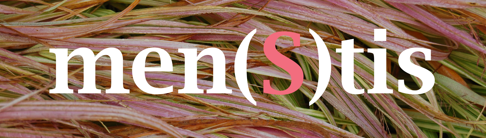

# Missie

De missie van de vereniging zonder winstgevend doel, **Men(S)tis,** rust op **de waarden 'mens, geest en leven'**.
**Het eerste element,** **de mens,** is aanwezig in de naam die leest als 'mens, menstis'.
 **Men(S)tis vzw** **wil het mysterie van de menswording** blijven huldigen en exploreren in **al** zijn dimensies.

**Het tweede element** van 'mens, menstis', is **het Latijnse woord mens voor geest**. 
Die betekenis blijft immers goed leesbaar in de woorden 'mentaal, mentaliteit' en het Engelse 'mind'. 
**Men(S)tis** **werkt vanuit de mentale rijkdom van de mens.** In en door de mens stroomt 
er een innerlijk kapitaal aan gedachten, gevoelens en beelden. Het hoort bij de _Homo sapiens_ 
als de bladeren aan de boom, maar... ze zijn diens **geleende** eigendom. 
De Latijnse genitief — _menstis_ — signaleert dat de mens verbonden is 
met **de wonderlijke en complexe wereld van de geest**. In die  wonderlijke wereld heeft de mens zijn wotels, een wereld waarin hij thuis is en woont,
  maar die hij _niet_ als zijn volle eigendom bezit of beheerst, maar eerder _verzorgend beheert en dient_.

**Het derde element** van de missie, is **het fenomeen van het leven**. 
Daarvan is het beeldlogo het zichtbare teken. De naam _Men(S)tis_ waarbij de **S** de symmetrie vormt 
tussen de twee woorddelen, bevindt zich op de foto van het Japanse **Hakonegras** waarvan de herfstkleur
in de kleur van de letter S herkenbaar is. Het Hakonegras wuift mee met de wind. In de Bijbelse, christelijke 
spiritualiteit staat de wind ook voor **de Geest die leven geeft**. Op een gelijkaardige wijze kennen de Oosterse 
culturen het fenomeen wind als de **Levenskracht** die energie en beweging met zich meebrengt in de mens en in de natuur.

**Men(S)tis vzw** schept met ieder initiatief een reële en mentale ruimte 
die verschijnt als een **bescheiden, tijdelijke en vruchtbare zone van zin**, 
een oord van levensbeschouwing. **Men(S)tis vzw** 
wil hiermee bijdragen tot de ontwikkeling
 van **het beeldend denken** en tot **het onderzoek naar de religiositeit**, 
 eigen aan _de zich ontwikkelende audiovisuele cultuur_ in een wereld die voortbeweegt in de richting van **een zowel democratische als globaliserende mensheid**.

De **stichtende leden** zijn:
Sylvain De Bleeckere (1950), Felix Rijcken (1929), Nicole De Bleeckere-Van de Kerckhove (1951-1996), 
Gie Dandois (1955-1997). De **huidige** bestuursleden zijn: Sylvain De Bleeckere (voorzitter),
 Felix Rijcken (ondervoorzitter), Samuel De Bleeckere (secretaris). De webmaster is 
 Siegfried De Bleeckere.
