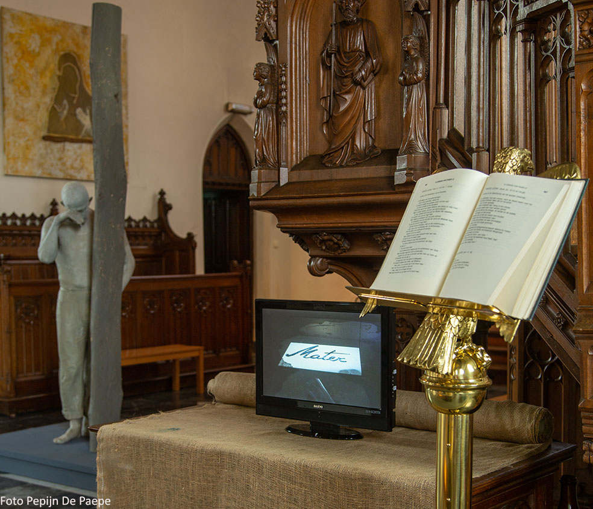

**P I L O O T P R O J E C T**

Men(S)tis ontwikkelde vanaf 2018 het **Project AGORA** in Vlaamse parochiekerken in nauwe samenwerking met de plaatselijke verantwoordelijkheden. De eerste editie vond plaats in de Heilige-Magdalenekerk te Brugge (mei-oktober 2018). Daarvoor werktte Men(S)tis samen met de lokale vzw [YOT](https://www.yot.be/nl/home/5). 

Kerkraden die interesse hebben, kunnen contact opnemen met Men(S)tis via: info@mentis.be.

 Tijdens het **Project AGORA** rolde de Heilige-Magdalenakerk de rode loper uit voor iedereen, klein en groot, buurtbewoner, Bruggeling en toerist. Er ontstond _een experimentele ontmoetingsplaats_. Het **Project AGORA** deed binnen het inspirerende, historische en neogotische gebouw _een zichtbaar en onzichtbaar weefsel van zingeving_ ontstaan. Dat gebeurde via: 
>1) De _tentoonstelling_ van hedendaagse kunst met werk van [Marleen Mertens](http://www.marleen-mertens.be/humana.html) (_Humana_) en [Jan De Wachter]( http://www.jandewachter.be/Intro) (De meerdelige installatie, uitgewerkt als beeldweg met als titel _Alles goed? Jan De Wachter!_, alsook het schilderij _De Madonna van de Tederheid_ in een aparte ruimte met soundscape)
>2) De _Verhalenkamer_ waar iedere woensdagnamiddag en zaterdagnamiddag (15u00 - 17u00) iemand een verhaal vertelde, en naar aanleiding waarvan telkens de koffiebar open was.
>3) De _Filmstudio Lichtaard_. In juni 2018 realiseerden Sylvain De Bleeckere en Kristof Hoornaert de kortfilm **PilgrImage**. Het filmpje is [hier](./AgoraMovies/) te bekijken. Over **PilgrImage** kan je een uitgebreide voorstelling vinden in [FilmFocus](http://www.menstis.be/film-focus/pilgrimage/). 

Triënnale Brugge 2018 kende aan het **Project AGORA** haar logo '_Inspired by Triennale Brugge 2018_' toe.

Als verwerking van het pilootproject AGORA verscheen in 2019 het boek [Meerstemmig Kerkgebouw](http://www.menstis.be/webshop/Kerkgebouw/).

**AGORA PROJECT DE BARTHOLOMEUSKERK: ONZE AGORA**

In de zomer van 2020 realiseert Men(S)tis vzw het Project **De Bartholomeuskerk: Onze Agora** in de gelijknamige parochiekerk van Hillegem, Herzele, in de Vlaamse Ardennen. Die realisatie is mogelijk dankzij de actieve medewerking en steun van de cultuurdienst van de gemeente Herzele, de centrale kerkraad en de meewerkende kunstenaars Marleen Mertens en Jan De Wachter. Het Project is iedere zaterdag- en zondagnamiddag van 14u00 tot 18u00 gratis te bezoeken. Ter plaatse is een uitgebreide info gratis ter beschikking van de bezoekers.

De twee foto's tonen de twee delen van het Project. De **Humana** van Marleen Mertens staat in het schip van de kerk. De kerkstoelen bevinden zich tegen de wanden. Daar zijn op tafels ook de tien aquarellen geplaatst die Marleen Mertens heeft gecreëerd voor het [boekje](http://www.menstis.be/webshop/Beeldgebed/) **Beeldgebed**. De tweede foto, gemaakt door Pepijn De Paepe, realiseert ook een directe link met **Beeldgebed**. De foto hier verbindt de bestaande spreekstoel die in het koor van de kerk is geplaatst, met het scherm van de video die de performance **Methode** van Jan De Wachter toont. Die performance handelt over de verloren gegane macht van het w/Woord, thema van het eerste deel van [boekje](http://www.menstis.be/webshop/Beeldgebed/) **Beeldgebed**. De foto beschrijft een beeldlijn. Die vertrekt van het w/Woord (het open Bijbelboek en de preekstoel), loopt over de still van het videoscherm met het woord 'Mater' (moeder). Dat roept de feminiene kracht van het beeld op, aanwezig in het neogotische kerkgebouw zelf, de **Humana** én het doek **De Madonna van de Tederheid** van Jan De Wachter. Het doek hangt in het koor. De kunstenaar heeft er het woord 'mater' op geschilderd. In het midden van de gegeven betekenislijn bevindt zich het beeld van Jan De Wachter, **De Traan**. De wenende man kijkt richting preekstoel en het w/Woord. Hij staat op een kruisteken, aanwezig in de vloer van het koor en onder het hangende kruisbeeld van de kerk. Die elementen vormen samen een tweede bekenislijn.

© Men(S)tis, 2020.

